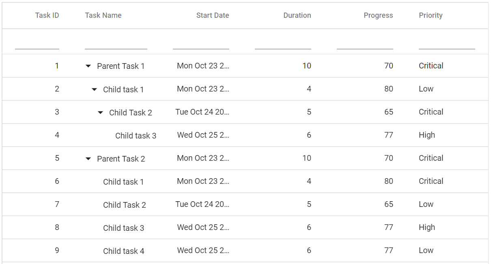
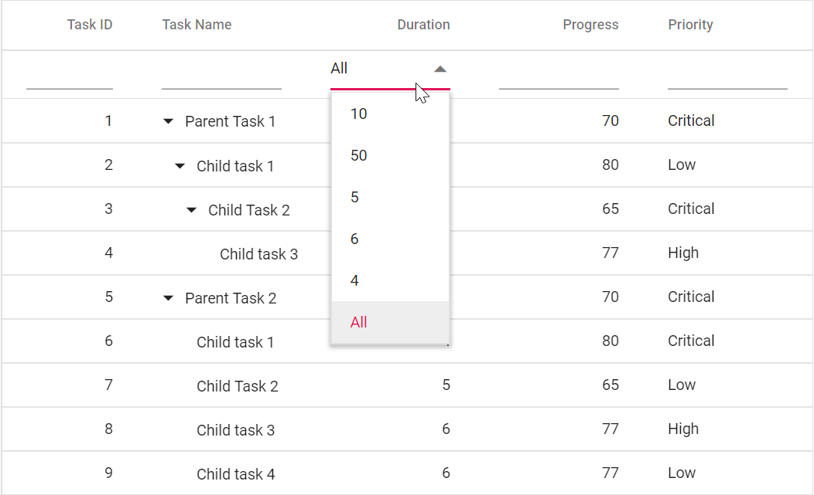
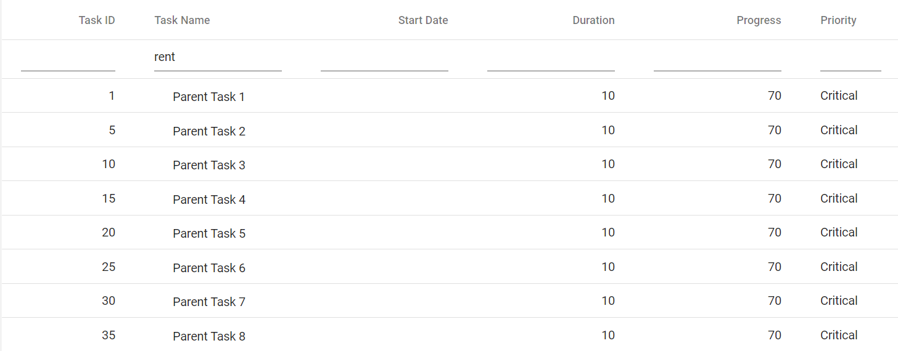

# Filter Bar in Blazor Tree Grid Component

By setting the [AllowFiltering](https://help.syncfusion.com/cr/blazor/Syncfusion.Blazor~Syncfusion.Blazor.TreeGrid.SfTreeGrid~AllowFiltering.html) to true, the filter bar row will render next to the header, which allows to filter data. The records can be filtered with different expressions depending upon the column type.

 **Filter bar expressions:**

 Enter the following filter expressions (operators) manually in the filter bar.

Expression |Example |Description |Column Type
-----|-----|-----|-----
= |=value |equal |Number
!= |!=value |notequal |Number
> |>value |greaterthan |Number
< |<value |lessthan |Number
>= |>=value |greaterthanorequal |Number
<=|<=value|lessthanorequal |Number
* |*value |startswith |String
% |%value |endswith |String
N/A |N/A | **Equal** operator will always be used for date filter. |Date
N/A |N/A |**Equal** operator will always be used for Boolean filter. |Boolean





@using TreeGridComponent.Data;
@using Syncfusion.Blazor.TreeGrid;
@using Syncfusion.Blazor.Data;

<SfTreeGrid IdMapping="TaskId" DataSource="@TreeGridData" ParentIdMapping="ParentId" TreeColumnIndex="1" AllowFiltering="true">
    <TreeGridColumns>
        <TreeGridColumn Field="TaskId" HeaderText="Task ID" Width="80" TextAlign="Syncfusion.Blazor.Grids.TextAlign.Right"></TreeGridColumn>
        <TreeGridColumn Field="TaskName" HeaderText="Task Name" Width="100"></TreeGridColumn>
        <TreeGridColumn Field="StartDate" HeaderText="Start Date" Width="100" TextAlign="Syncfusion.Blazor.Grids.TextAlign.Right"></TreeGridColumn>
        <TreeGridColumn Field="Duration" HeaderText="Duration" Width="100" TextAlign="Syncfusion.Blazor.Grids.TextAlign.Right"></TreeGridColumn>
        <TreeGridColumn Field="Progress" HeaderText="Progress" Width="100" TextAlign="Syncfusion.Blazor.Grids.TextAlign.Right"></TreeGridColumn>
        <TreeGridColumn Field="Priority" HeaderText="Priority" Width="60"></TreeGridColumn>
    </TreeGridColumns>
</SfTreeGrid>

@code{
    public List<BusinessObject> TreeGridData { get; set; }

    protected override void OnInitialized()
    {
        this.TreeGridData = BusinessObject.GetSelfDataSource().ToList();
    }
}





namespace TreeGridComponent.Data {

        public class BusinessObject
        {
            public int TaskId { get; set;}
            public string TaskName { get; set;}
            public int? Duration { get; set;}
            public int? Progress { get; set;}
            public string Priority { get; set;}
            public int? ParentId { get; set;}
       
        public static List<BusinessObject> GetSelfDataSource()
        {
            List<BusinessObject> BusinessObjectCollection = new List<BusinessObject>();
            BusinessObjectCollection.Add(new BusinessObject() { TaskId = 1,TaskName = "Parent Task 1",Duration = 10,Progress = 70,Priority = "Critical",ParentId = null });
            BusinessObjectCollection.Add(new BusinessObject() { TaskId = 2,TaskName = "Child task 1",Duration = 4,Progress = 80,Priority = "Low",ParentId = 1 });
            BusinessObjectCollection.Add(new BusinessObject() { TaskId = 3,TaskName = "Child Task 2",Duration = 5,Progress = 65,Priority = "Critical",ParentId = 2 });
            BusinessObjectCollection.Add(new BusinessObject() { TaskId = 4,TaskName = "Child task 3",Duration = 6,Priority = "High",Progress = 77,ParentId = 3 });
            BusinessObjectCollection.Add(new BusinessObject() { TaskId = 5,TaskName = "Parent Task 2",Duration = 10,Progress = 70,Priority = "Critical",ParentId = null});
            BusinessObjectCollection.Add(new BusinessObject() { TaskId = 6,TaskName = "Child task 1",Duration = 4,Progress = 80,Priority = "Critical",ParentId = 5});
            BusinessObjectCollection.Add(new BusinessObject() { TaskId = 7,TaskName = "Child Task 2",Duration = 5,Progress = 65,Priority = "Low",ParentId = 5});
            BusinessObjectCollection.Add(new BusinessObject() { TaskId = 8,TaskName = "Child task 3",Duration = 6,Progress = 77,Priority = "High",ParentId = 5});
            BusinessObjectCollection.Add(new BusinessObject() { TaskId = 9,TaskName = "Child task 4",Duration = 6,Progress = 77,Priority = "Low",ParentId = 5});
            return BusinessObjectCollection;
        }
    }
}





The following screenshot shows filtering using FilterBar

## Filter bar template with custom component

The [FilterTemplate](https://help.syncfusion.com/cr/blazor/Syncfusion.Blazor.TreeGrid.TreeGridColumn.html#Syncfusion_Blazor_TreeGrid_TreeGridColumn_FilterTemplate) property is used to add custom components to a particular column. To access the filtered values inside the `FilterTemplate`, you can use the implicit named parameter context. You can type cast the context as `PredicateModel<T>` to get filter values inside template.

In the following sample, the dropdown is used as a custom component in the Duration column.





@using TreeGridComponent.Data;
@using  Syncfusion.Blazor.TreeGrid;
@using  Syncfusion.Blazor.Grids;
@using  Syncfusion.Blazor.Data;
@using  Syncfusion.Blazor.DropDowns;

<SfTreeGrid @ref="TreeGrid" DataSource="@TreeGridData" IdMapping="TaskId" ParentIdMapping="ParentId" TreeColumnIndex="1" AllowFiltering="true">    
    <TreeGridColumns>
        <TreeGridColumn Field="TaskId" HeaderText="Task ID" Width="80" TextAlign="Syncfusion.Blazor.Grids.TextAlign.Right"></TreeGridColumn>
        <TreeGridColumn Field="TaskName" HeaderText="Task Name" Width="100"></TreeGridColumn>
        <TreeGridColumn Field="StartDate" HeaderText="Start Date" Width="100" TextAlign="Syncfusion.Blazor.Grids.TextAlign.Right"></TreeGridColumn>
        <TreeGridColumn Field="Duration" HeaderText="Duration" Width="100" TextAlign="Syncfusion.Blazor.Grids.TextAlign.Right">
            <FilterTemplate>
                <SfDropDownList TValue="string" DataSource="@DropDownData" TItem="string" Value="@((string)(context as PredicateModel).Value)">
                    <DropDownListEvents ValueChange="change" TItem="string" TValue="string" ></DropDownListEvents>
                </SfDropDownList>
            </FilterTemplate>
        </TreeGridColumn>
        <TreeGridColumn Field="Progress" HeaderText="Progress" Width="100" TextAlign="Syncfusion.Blazor.Grids.TextAlign.Right"></TreeGridColumn>
        <TreeGridColumn Field="Priority" HeaderText="Priority" Width="60"></TreeGridColumn>
    </TreeGridColumns>
</SfTreeGrid>

@code{

    SfTreeGrid<BusinessObject> TreeGrid;

    public List<string> DropDownData { get; set; } = new List<string>();

    public List<BusinessObject> TreeGridData { get; set; }

    protected override void OnInitialized()
    {
        this.TreeGridData = BusinessObject.GetSelfDataSource().ToList();

        this.DropDownData.Add("10");
        this.DropDownData.Add("50");
        this.DropDownData.Add("5");
        this.DropDownData.Add("6");
        this.DropDownData.Add("4");        
        this.DropDownData.Add("All");
    }    

    public void change(Syncfusion.Blazor.DropDowns.ChangeEventArgs<string,string> Args)
    {
        if (Args.Value == "All")
        {
            List<string> Data = new List<string>();
            Data.Add("Duration");
            TreeGrid.ClearFilteringAsync(Data);
        }
        else
        {
            TreeGrid.FilterByColumnAsync("Duration", "equal", Args.Value);
        }
    }
}





namespace TreeGridComponent.Data {

        public class BusinessObject
        {
            public int TaskId { get; set;}
            public string TaskName { get; set;}
            public int? Duration { get; set;}
            public int? Progress { get; set;}
            public string Priority { get; set;}
            public int? ParentId { get; set;}
       
        public static List<BusinessObject> GetSelfDataSource()
        {
            List<BusinessObject> BusinessObjectCollection = new List<BusinessObject>();
            BusinessObjectCollection.Add(new BusinessObject() { TaskId = 1,TaskName = "Parent Task 1",Duration = 10,Progress = 70,Priority = "Critical",ParentId = null });
            BusinessObjectCollection.Add(new BusinessObject() { TaskId = 2,TaskName = "Child task 1",Duration = 4,Progress = 80,Priority = "Low",ParentId = 1 });
            BusinessObjectCollection.Add(new BusinessObject() { TaskId = 3,TaskName = "Child Task 2",Duration = 5,Progress = 65,Priority = "Critical",ParentId = 2 });
            BusinessObjectCollection.Add(new BusinessObject() { TaskId = 4,TaskName = "Child task 3",Duration = 6,Priority = "High",Progress = 77,ParentId = 3 });
            BusinessObjectCollection.Add(new BusinessObject() { TaskId = 5,TaskName = "Parent Task 2",Duration = 10,Progress = 70,Priority = "Critical",ParentId = null});
            BusinessObjectCollection.Add(new BusinessObject() { TaskId = 6,TaskName = "Child task 1",Duration = 4,Progress = 80,Priority = "Critical",ParentId = 5});
            BusinessObjectCollection.Add(new BusinessObject() { TaskId = 7,TaskName = "Child Task 2",Duration = 5,Progress = 65,Priority = "Low",ParentId = 5});
            BusinessObjectCollection.Add(new BusinessObject() { TaskId = 8,TaskName = "Child task 3",Duration = 6,Progress = 77,Priority = "High",ParentId = 5});
            BusinessObjectCollection.Add(new BusinessObject() { TaskId = 9,TaskName = "Child task 4",Duration = 6,Progress = 77,Priority = "Low",ParentId = 5});
            return BusinessObjectCollection;
        }
    }
}





## Change default filter operator

You can change the default filter operator by extending [FilterSettings](https://help.syncfusion.com/cr/blazor/Syncfusion.Blazor.TreeGrid.TreeGridColumn.html#Syncfusion_Blazor_TreeGrid_TreeGridColumn_FilterSettings) property in the column.

In the following sample, we have changed the default operator for TaskName column as **contains** from **startswith**





@using TreeGridComponent.Data;
@using  Syncfusion.Blazor.TreeGrid;
@using  Syncfusion.Blazor.Grids;
@using  Syncfusion.Blazor.Data;
@using Syncfusion.Blazor

<SfTreeGrid @ref="TreeGrid" DataSource="@TreeGridData" IdMapping="TaskId" ParentIdMapping="ParentId" TreeColumnIndex="1" AllowFiltering="true">    
    <TreeGridColumns>
        <TreeGridColumn Field="TaskId" HeaderText="Task ID" Width="80" TextAlign="Syncfusion.Blazor.Grids.TextAlign.Right"></TreeGridColumn>
        <TreeGridColumn Field="TaskName" HeaderText="Task Name" Width="100" FilterSettings="@(new FilterSettings{ Operator = Operator.Contains })"></TreeGridColumn>
        <TreeGridColumn Field="StartDate" HeaderText="Start Date" Width="100" TextAlign="Syncfusion.Blazor.Grids.TextAlign.Right"></TreeGridColumn>
        <TreeGridColumn Field="Duration" HeaderText="Duration" Width="100" TextAlign="Syncfusion.Blazor.Grids.TextAlign.Right"></TreeGridColumn>
        <TreeGridColumn Field="Progress" HeaderText="Progress" Width="100" TextAlign="Syncfusion.Blazor.Grids.TextAlign.Right"></TreeGridColumn>
        <TreeGridColumn Field="Priority" HeaderText="Priority" Width="60"></TreeGridColumn>
    </TreeGridColumns>
</SfTreeGrid>

@code{
    SfTreeGrid<BusinessObject> TreeGrid;

    public List<BusinessObject> TreeGridData { get; set; }

    protected override void OnInitialized()
    {
        this.TreeGridData = BusinessObject.GetSelfDataSource().ToList();
    }
}





namespace TreeGridComponent.Data {

        public class BusinessObject
        {
            public int TaskId { get; set;}
            public string TaskName { get; set;}
            public int? Duration { get; set;}
            public int? Progress { get; set;}
            public string Priority { get; set;}
            public int? ParentId { get; set;}
       
        public static List<BusinessObject> GetSelfDataSource()
        {
            List<BusinessObject> BusinessObjectCollection = new List<BusinessObject>();
            BusinessObjectCollection.Add(new BusinessObject() { TaskId = 1,TaskName = "Parent Task 1",Duration = 10,Progress = 70,Priority = "Critical",ParentId = null });
            BusinessObjectCollection.Add(new BusinessObject() { TaskId = 2,TaskName = "Child task 1",Duration = 4,Progress = 80,Priority = "Low",ParentId = 1 });
            BusinessObjectCollection.Add(new BusinessObject() { TaskId = 3,TaskName = "Child Task 2",Duration = 5,Progress = 65,Priority = "Critical",ParentId = 2 });
            BusinessObjectCollection.Add(new BusinessObject() { TaskId = 4,TaskName = "Child task 3",Duration = 6,Priority = "High",Progress = 77,ParentId = 3 });
            BusinessObjectCollection.Add(new BusinessObject() { TaskId = 5,TaskName = "Parent Task 2",Duration = 10,Progress = 70,Priority = "Critical",ParentId = null});
            BusinessObjectCollection.Add(new BusinessObject() { TaskId = 6,TaskName = "Child task 1",Duration = 4,Progress = 80,Priority = "Critical",ParentId = 5});
            BusinessObjectCollection.Add(new BusinessObject() { TaskId = 7,TaskName = "Child Task 2",Duration = 5,Progress = 65,Priority = "Low",ParentId = 5});
            BusinessObjectCollection.Add(new BusinessObject() { TaskId = 8,TaskName = "Child task 3",Duration = 6,Progress = 77,Priority = "High",ParentId = 5});
            BusinessObjectCollection.Add(new BusinessObject() { TaskId = 9,TaskName = "Child task 4",Duration = 6,Progress = 77,Priority = "Low",ParentId = 5});
            BusinessObjectCollection.Add(new BusinessObject() { TaskId = 10,TaskName = "Parent Task 3",Duration = 10,Progress = 70,Priority = "Critical",ParentId = null});
            BusinessObjectCollection.Add(new BusinessObject() { TaskId =11,TaskName = "Child task 1",Duration = 4,Progress = 80,Priority = "Critical",ParentId = 10});
            BusinessObjectCollection.Add(new BusinessObject() { TaskId = 12,TaskName = "Child Task 2",Duration = 5,Progress = 65,Priority = "Low",ParentId = 10});
            BusinessObjectCollection.Add(new BusinessObject() { TaskId = 13,TaskName = "Child task 3",Duration = 6,Progress = 77,Priority = "High",ParentId = 10});
            BusinessObjectCollection.Add(new BusinessObject() { TaskId = 14,TaskName = "Child task 4",Duration = 6,Progress = 77,Priority = "Low",ParentId = 10});
            BusinessObjectCollection.Add(new BusinessObject() { TaskId = 15,TaskName = "Parent Task 4",Duration = 10,Progress = 70,Priority = "Critical",ParentId = null});
            BusinessObjectCollection.Add(new BusinessObject() { TaskId = 16,TaskName = "Child task 1",Duration = 4,Progress = 80,Priority = "Critical",ParentId = 15});
            BusinessObjectCollection.Add(new BusinessObject() { TaskId = 17,TaskName = "Child Task 2",Duration = 5,Progress = 65,Priority = "Low",ParentId = 15});
            BusinessObjectCollection.Add(new BusinessObject() { TaskId = 18,TaskName = "Child task 3",Duration = 6,Progress = 77,Priority = "High",ParentId = 15});
            BusinessObjectCollection.Add(new BusinessObject() { TaskId = 19,TaskName = "Child task 4",Duration = 6,Progress = 77,Priority = "Low",ParentId = 15});
            BusinessObjectCollection.Add(new BusinessObject() { TaskId = 20,TaskName = "Parent Task 5",Duration = 10,Progress = 70,Priority = "Critical",ParentId = null});
            BusinessObjectCollection.Add(new BusinessObject() { TaskId = 21,TaskName = "Child task 1",Duration = 4,Progress = 80,Priority = "Critical",ParentId = 20});
            BusinessObjectCollection.Add(new BusinessObject() { TaskId = 22,TaskName = "Child Task 2",Duration = 5,Progress = 65,Priority = "Low",ParentId = 20});
            BusinessObjectCollection.Add(new BusinessObject() { TaskId = 23,TaskName = "Child task 3",Duration = 6,Progress = 77,Priority = "High",ParentId = 20});
            BusinessObjectCollection.Add(new BusinessObject() { TaskId = 24,TaskName = "Child task 4",Duration = 6,Progress = 77,Priority = "Low",ParentId = 20});
            BusinessObjectCollection.Add(new BusinessObject() { TaskId = 25,TaskName = "Parent Task 6",Duration = 10,Progress = 70,Priority = "Critical",ParentId = null});
            BusinessObjectCollection.Add(new BusinessObject() { TaskId = 26,TaskName = "Child task 1",Duration = 4,Progress = 80,Priority = "Critical",ParentId = 25});
            BusinessObjectCollection.Add(new BusinessObject() { TaskId = 27,TaskName = "Child Task 2",Duration = 5,Progress = 65,Priority = "Low",ParentId = 25});
            BusinessObjectCollection.Add(new BusinessObject() { TaskId = 28,TaskName = "Child task 3",Duration = 6,Progress = 77,Priority = "High",ParentId = 25});
            BusinessObjectCollection.Add(new BusinessObject() { TaskId = 29,TaskName = "Child task 4",Duration = 6,Progress = 77,Priority = "Low",ParentId = 25});
            BusinessObjectCollection.Add(new BusinessObject() { TaskId = 30,TaskName = "Parent Task 7",Duration = 10,Progress = 70,Priority = "Critical",ParentId = null});
            BusinessObjectCollection.Add(new BusinessObject() { TaskId = 31,TaskName = "Child task 1",Duration = 4,Progress = 80,Priority = "Critical",ParentId = 30});
            BusinessObjectCollection.Add(new BusinessObject() { TaskId = 32,TaskName = "Child Task 2",Duration = 5,Progress = 65,Priority = "Low",ParentId = 30});
            BusinessObjectCollection.Add(new BusinessObject() { TaskId = 33,TaskName = "Child task 3",Duration = 6,Progress = 77,Priority = "High",ParentId = 30});
            BusinessObjectCollection.Add(new BusinessObject() { TaskId = 34,TaskName = "Child task 4",Duration = 6,Progress = 77,Priority = "Low",ParentId = 30});
            BusinessObjectCollection.Add(new BusinessObject() { TaskId = 35,TaskName = "Parent Task 8",Duration = 10,Progress = 70,Priority = "Critical",ParentId = null});
            BusinessObjectCollection.Add(new BusinessObject() { TaskId = 36,TaskName = "Child task 1",Duration = 4,Progress = 80,Priority = "Critical",ParentId = 35});
            BusinessObjectCollection.Add(new BusinessObject() { TaskId = 37,TaskName = "Child Task 2",Duration = 5,Progress = 65,Priority = "Low",ParentId = 35});
            BusinessObjectCollection.Add(new BusinessObject() { TaskId = 38,TaskName = "Child task 3",Duration = 6,Progress = 77,Priority = "High",ParentId = 35});
            BusinessObjectCollection.Add(new BusinessObject() { TaskId = 39,TaskName = "Child task 4",Duration = 6,Progress = 77,Priority = "Low",ParentId = 35});
            return BusinessObjectCollection;
        }
    }
}





The following screenshot represents Filter with change in default operator as contains

## Filter bar modes

By default, filter bar [Mode](https://help.syncfusion.com/cr/blazor/Syncfusion.Blazor.TreeGrid.TreeGridFilterSettings.html#Syncfusion_Blazor_TreeGrid_TreeGridFilterSettings_Mode) will be of OnEnter type. So, you need to press the Enter key after typing a value in the filter bar.

You can also perform filtering operation without pressing Enter key in the filter bar by Setting the filter bar `Mode` property as [Immediate](https://help.syncfusion.com/cr/blazor/Syncfusion.Blazor.Grids.FilterBarMode.html#Syncfusion_Blazor_Grids_FilterBarMode_Immediate).

The [ImmediateModeDelay](https://help.syncfusion.com/cr/blazor/Syncfusion.Blazor.TreeGrid.TreeGridFilterSettings.html#Syncfusion_Blazor_TreeGrid_TreeGridFilterSettings_ImmediateModeDelay) property of [TreeGridFilterSettings](https://help.syncfusion.com/cr/blazor/Syncfusion.Blazor.TreeGrid.TreeGridFilterSettings.html) is used to define the time, tree grid has to wait for performing filter operation.





@using TreeGridComponent.Data;
@using Syncfusion.Blazor.TreeGrid;
@using Syncfusion.Blazor.Grids;
@using Syncfusion.Blazor.Data;

<SfTreeGrid IdMapping="TaskId" DataSource="@TreeGridData" ParentIdMapping="ParentId" TreeColumnIndex="1" AllowFiltering="true">
    <TreeGridFilterSettings Mode="FilterBarMode.Immediate" ImmediateModeDelay="300"></TreeGridFilterSettings>
    <TreeGridColumns>
        <TreeGridColumn Field="TaskId" HeaderText="Task ID" Width="80" TextAlign="Syncfusion.Blazor.Grids.TextAlign.Right"></TreeGridColumn>
        <TreeGridColumn Field="TaskName" HeaderText="Task Name" Width="100"></TreeGridColumn>
        <TreeGridColumn Field="StartDate" HeaderText="Start Date" Width="100" TextAlign="Syncfusion.Blazor.Grids.TextAlign.Right"></TreeGridColumn>
        <TreeGridColumn Field="Duration" HeaderText="Duration" Width="100" TextAlign="Syncfusion.Blazor.Grids.TextAlign.Right"></TreeGridColumn>
        <TreeGridColumn Field="Progress" HeaderText="Progress" Width="100" TextAlign="Syncfusion.Blazor.Grids.TextAlign.Right"></TreeGridColumn>
        <TreeGridColumn Field="Priority" HeaderText="Priority" Width="60"></TreeGridColumn>
    </TreeGridColumns>
</SfTreeGrid>

@code{
    public List<BusinessObject> TreeGridData { get; set; }

    protected override void OnInitialized()
    {
        this.TreeGridData = BusinessObject.GetSelfDataSource().ToList();
    }
}





namespace TreeGridComponent.Data {

        public class BusinessObject
        {
            public int TaskId { get; set;}
            public string TaskName { get; set;}
            public int? Duration { get; set;}
            public int? Progress { get; set;}
            public string Priority { get; set;}
            public int? ParentId { get; set;}
       
        public static List<BusinessObject> GetSelfDataSource()
        {
            List<BusinessObject> BusinessObjectCollection = new List<BusinessObject>();
            BusinessObjectCollection.Add(new BusinessObject() { TaskId = 1,TaskName = "Parent Task 1",Duration = 10,Progress = 70,Priority = "Critical",ParentId = null });
            BusinessObjectCollection.Add(new BusinessObject() { TaskId = 2,TaskName = "Child task 1",Duration = 4,Progress = 80,Priority = "Low",ParentId = 1 });
            BusinessObjectCollection.Add(new BusinessObject() { TaskId = 3,TaskName = "Child Task 2",Duration = 5,Progress = 65,Priority = "Critical",ParentId = 2 });
            BusinessObjectCollection.Add(new BusinessObject() { TaskId = 4,TaskName = "Child task 3",Duration = 6,Priority = "High",Progress = 77,ParentId = 3 });
            BusinessObjectCollection.Add(new BusinessObject() { TaskId = 5,TaskName = "Parent Task 2",Duration = 10,Progress = 70,Priority = "Critical",ParentId = null});
            BusinessObjectCollection.Add(new BusinessObject() { TaskId = 6,TaskName = "Child task 1",Duration = 4,Progress = 80,Priority = "Critical",ParentId = 5});
            BusinessObjectCollection.Add(new BusinessObject() { TaskId = 7,TaskName = "Child Task 2",Duration = 5,Progress = 65,Priority = "Low",ParentId = 5});
            BusinessObjectCollection.Add(new BusinessObject() { TaskId = 8,TaskName = "Child task 3",Duration = 6,Progress = 77,Priority = "High",ParentId = 5});
            BusinessObjectCollection.Add(new BusinessObject() { TaskId = 9,TaskName = "Child task 4",Duration = 6,Progress = 77,Priority = "Low",ParentId = 5});
            return BusinessObjectCollection;
        }
    }
}



