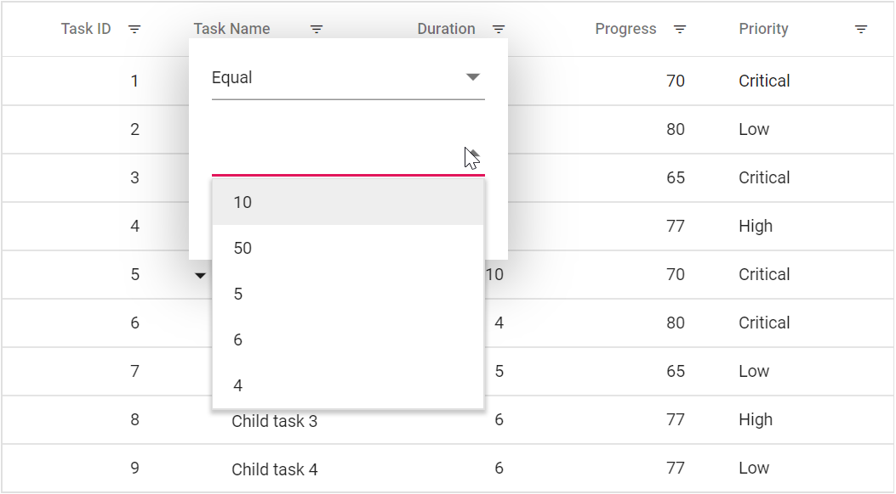

# Filter Menu in Blazor Tree Grid Component

The filter menu can be enabled by setting the [Type](https://help.syncfusion.com/cr/blazor/Syncfusion.Blazor~Syncfusion.Blazor.TreeGrid.TreeGridFilterSettings~Type.html) of [FilterSettings](https://help.syncfusion.com/cr/blazor/Syncfusion.Blazor~Syncfusion.Blazor.TreeGrid.TreeGridFilterSettings.html) as **Menu**. The filter menu UI will be rendered based on its column type, which allows to filter data. The records can be filtered with different operators.





@using TreeGridComponent.Data;
@using  Syncfusion.Blazor.TreeGrid;
@using  Syncfusion.Blazor.Data;

<SfTreeGrid IdMapping="TaskId" DataSource="@TreeGridData" ParentIdMapping="ParentId" TreeColumnIndex="1" AllowFiltering="true">
    <TreeGridFilterSettings HierarchyMode="@FilterHierarchyMode.Parent" Type="Syncfusion.Blazor.TreeGrid.FilterType.Menu"></TreeGridFilterSettings>
    <TreeGridColumns>
        <TreeGridColumn Field="TaskId" HeaderText="Task ID" Width="80" TextAlign="Syncfusion.Blazor.Grids.TextAlign.Right"></TreeGridColumn>
        <TreeGridColumn Field="TaskName" HeaderText="Task Name" Width="160"></TreeGridColumn>
        <TreeGridColumn Field="Duration" HeaderText="Duration" Width="100" TextAlign="Syncfusion.Blazor.Grids.TextAlign.Right"></TreeGridColumn>
        <TreeGridColumn Field="Progress" HeaderText="Progress" Width="100" TextAlign="Syncfusion.Blazor.Grids.TextAlign.Right"></TreeGridColumn>
        <TreeGridColumn Field="Priority" HeaderText="Priority" Width="80"></TreeGridColumn>
    </TreeGridColumns>
</SfTreeGrid>

@code{

    public List<BusinessObject> TreeGridData { get; set; }

    protected override void OnInitialized()
    {
        this.TreeGridData = BusinessObject.GetSelfDataSource().ToList();
    }
}





namespace TreeGridComponent.Data {

        public class BusinessObject
        {
            public int TaskId { get; set;}
            public string TaskName { get; set;}
            public int? Duration { get; set;}
            public int? Progress { get; set;}
            public string Priority { get; set;}
            public int? ParentId { get; set;}
       
        public static List<BusinessObject> GetSelfDataSource()
        {
            List<BusinessObject> BusinessObjectCollection = new List<BusinessObject>();
            BusinessObjectCollection.Add(new BusinessObject() { TaskId = 1,TaskName = "Parent Task 1",Duration = 10,Progress = 70,Priority = "Critical",ParentId = null });
            BusinessObjectCollection.Add(new BusinessObject() { TaskId = 2,TaskName = "Child task 1",Duration = 4,Progress = 80,Priority = "Low",ParentId = 1 });
            BusinessObjectCollection.Add(new BusinessObject() { TaskId = 3,TaskName = "Child Task 2",Duration = 5,Progress = 65,Priority = "Critical",ParentId = 2 });
            BusinessObjectCollection.Add(new BusinessObject() { TaskId = 4,TaskName = "Child task 3",Duration = 6,Priority = "High",Progress = 77,ParentId = 3 });
            BusinessObjectCollection.Add(new BusinessObject() { TaskId = 5,TaskName = "Parent Task 2",Duration = 10,Progress = 70,Priority = "Critical",ParentId = null});
            BusinessObjectCollection.Add(new BusinessObject() { TaskId = 6,TaskName = "Child task 1",Duration = 4,Progress = 80,Priority = "Critical",ParentId = 5});
            BusinessObjectCollection.Add(new BusinessObject() { TaskId = 7,TaskName = "Child Task 2",Duration = 5,Progress = 65,Priority = "Low",ParentId = 5});
            BusinessObjectCollection.Add(new BusinessObject() { TaskId = 8,TaskName = "Child task 3",Duration = 6,Progress = 77,Priority = "High",ParentId = 5});
            BusinessObjectCollection.Add(new BusinessObject() { TaskId = 9,TaskName = "Child task 4",Duration = 6,Progress = 77,Priority = "Low",ParentId = 5});
            return BusinessObjectCollection;
        }
    }
}






N> * [AllowFiltering](https://help.syncfusion.com/cr/blazor/Syncfusion.Blazor.TreeGrid.TreeGridColumn.html#Syncfusion_Blazor_TreeGrid_TreeGridColumn_AllowFiltering) must be set as true to enable filter menu.
<br/> * Setting `AllowFiltering` property of [TreeGridColumn](https://help.syncfusion.com/cr/blazor/Syncfusion.Blazor.TreeGrid.TreeGridColumn.html) as false will prevent filter menu rendering for a particular column.

## Custom component in filter menu

The [FilterTemplate](https://help.syncfusion.com/cr/blazor/Syncfusion.Blazor.TreeGrid.TreeGridColumn.html#Syncfusion_Blazor_TreeGrid_TreeGridColumn_FilterTemplate) property of [`Column`] is used to add custom filter components to a particular column. In the following sample the FilterTemplate property is used to add custom components to a particular column. To access the filtered values inside the FilterTemplate, use the implicit named parameter context, which can be cast as `PredicateModel<T>` to get filter values inside the template.

In the following sample, dropdown is used as custom component in the duration column.





@using TreeGridComponent.Data;
@using Syncfusion.Blazor.TreeGrid
@using Syncfusion.Blazor.Data
@using Syncfusion.Blazor.DropDowns
@using Syncfusion.Blazor.Grids

<SfTreeGrid @ref="TreeGrid"
            DataSource="@TreeGridData"
            IdMapping="TaskId"
            ParentIdMapping="ParentId"
            TreeColumnIndex="1"
            AllowFiltering="true">

    <TreeGridFilterSettings Type="Syncfusion.Blazor.TreeGrid.FilterType.Menu"></TreeGridFilterSettings>

    <TreeGridColumns>
        <TreeGridColumn Field="TaskId" HeaderText="Task ID" Width="80" TextAlign="TextAlign.Right" />
        <TreeGridColumn Field="TaskName" HeaderText="Task Name" Width="150" />
        <TreeGridColumn Field="StartDate" HeaderText="Start Date" Width="120" TextAlign="TextAlign.Right" />

        <TreeGridColumn Field="Duration" HeaderText="Duration" Width="100" TextAlign="TextAlign.Right">
            <FilterTemplate>
                @{
                    
                    var predicate = context as PredicateModel;

                    // PredicateModel.Value is object, might be int/int?/string.
                    int? current = null;
                    if (predicate?.Value is int i) current = i;
                    else if (predicate?.Value is int ni) current = ni;
                    else if (predicate?.Value != null && int.TryParse(predicate.Value.ToString(), out var parsed))
                        current = parsed;
                }
                <SfDropDownList TValue="int?"
                                TItem="DropItem"
                                DataSource="@DropDownData"
                                Placeholder="Select"
                                Value="@current">

                    <DropDownListFieldSettings Text="Text" Value="Value"></DropDownListFieldSettings>

                    <DropDownListEvents TValue="int?"
                                        TItem="DropItem"
                                        ValueChange="@OnDurationChange">
                    </DropDownListEvents>
                </SfDropDownList>
            </FilterTemplate>
        </TreeGridColumn>

        <TreeGridColumn Field="Progress" HeaderText="Progress" Width="100" TextAlign="TextAlign.Right" />
        <TreeGridColumn Field="Priority" HeaderText="Priority" Width="80" />
    </TreeGridColumns>
</SfTreeGrid>

@code {
    private SfTreeGrid<BusinessObject>? TreeGrid;

    public List<BusinessObject> TreeGridData { get; set; } = new();

    // Dropdown items: int? so we can represent "All" as null
    public class DropItem
    {
        public string Text { get; set; } = "";
        public int? Value { get; set; }
    }

    public List<DropItem> DropDownData { get; set; } = new();

    protected override void OnInitialized()
    {
        TreeGridData = BusinessObject.GetSelfDataSource().ToList();

        DropDownData = new List<DropItem>
        {
            new() { Text = "10", Value = 10 },
            new() { Text = "50", Value = 50 },
            new() { Text = "5",  Value = 5  },
            new() { Text = "6",  Value = 6  },
            new() { Text = "4",  Value = 4  },
            new() { Text = "All", Value = null } // null => clear filter
        };
    }

    private async Task OnDurationChange(ChangeEventArgs<int?, DropItem> args)
    {
        if (TreeGrid is null) return;

        // "All" clears Duration filter
        if (args?.Value is null)
        {
            await TreeGrid.ClearFilteringAsync(new List<string> { "Duration" });
            return;
        }

        await TreeGrid.FilterByColumnAsync("Duration", "equal", args.Value);
    }
}





namespace TreeGridComponent.Data {

        public class BusinessObject
        {
            public int TaskId { get; set;}
            public string TaskName { get; set;}
            public int? Duration { get; set;}
            public int? Progress { get; set;}
            public string Priority { get; set;}
            public int? ParentId { get; set;}
       
        public static List<BusinessObject> GetSelfDataSource()
        {
            List<BusinessObject> BusinessObjectCollection = new List<BusinessObject>();
            BusinessObjectCollection.Add(new BusinessObject() { TaskId = 1,TaskName = "Parent Task 1",Duration = 10,Progress = 70,Priority = "Critical",ParentId = null });
            BusinessObjectCollection.Add(new BusinessObject() { TaskId = 2,TaskName = "Child task 1",Duration = 4,Progress = 80,Priority = "Low",ParentId = 1 });
            BusinessObjectCollection.Add(new BusinessObject() { TaskId = 3,TaskName = "Child Task 2",Duration = 5,Progress = 65,Priority = "Critical",ParentId = 2 });
            BusinessObjectCollection.Add(new BusinessObject() { TaskId = 4,TaskName = "Child task 3",Duration = 6,Priority = "High",Progress = 77,ParentId = 3 });
            BusinessObjectCollection.Add(new BusinessObject() { TaskId = 5,TaskName = "Parent Task 2",Duration = 10,Progress = 70,Priority = "Critical",ParentId = null});
            BusinessObjectCollection.Add(new BusinessObject() { TaskId = 6,TaskName = "Child task 1",Duration = 4,Progress = 80,Priority = "Critical",ParentId = 5});
            BusinessObjectCollection.Add(new BusinessObject() { TaskId = 7,TaskName = "Child Task 2",Duration = 5,Progress = 65,Priority = "Low",ParentId = 5});
            BusinessObjectCollection.Add(new BusinessObject() { TaskId = 8,TaskName = "Child task 3",Duration = 6,Progress = 77,Priority = "High",ParentId = 5});
            BusinessObjectCollection.Add(new BusinessObject() { TaskId = 9,TaskName = "Child task 4",Duration = 6,Progress = 77,Priority = "Low",ParentId = 5});
            return BusinessObjectCollection;
        }
    }
}







## Override default filter operators for menu filtering

The default filter operators for a GridColumn can be overridden by using the [FilterDialogOpening](https://help.syncfusion.com/cr/blazor/Syncfusion.Blazor.TreeGrid.TreeGridEvents-1.html#Syncfusion_Blazor_TreeGrid_TreeGridEvents_1_FilterDialogOpening) event of the tree grid. In the below code, we have overridden the filter operators for the **Task Name** column.





@using TreeGridComponent.Data;
@using  Syncfusion.Blazor.TreeGrid;
@using  Syncfusion.Blazor.Grids;
@using  Syncfusion.Blazor.Data;

<SfTreeGrid IdMapping="TaskId" DataSource="@TreeGridData" ParentIdMapping="ParentId" TreeColumnIndex="1" AllowFiltering="true">
    <TreeGridEvents FilterDialogOpening="FilterDialogOpeningHandler" TValue="BusinessObject"></TreeGridEvents>
    <TreeGridFilterSettings Type="Syncfusion.Blazor.TreeGrid.FilterType.Menu"></TreeGridFilterSettings>
    <TreeGridColumns>
        <TreeGridColumn Field="TaskId" HeaderText="Task ID" Width="80" TextAlign="Syncfusion.Blazor.Grids.TextAlign.Right"></TreeGridColumn>
        <TreeGridColumn Field="TaskName" HeaderText="Task Name" Width="160"></TreeGridColumn>
        <TreeGridColumn Field="Duration" HeaderText="Duration" Width="100" TextAlign="Syncfusion.Blazor.Grids.TextAlign.Right"></TreeGridColumn>
        <TreeGridColumn Field="Progress" HeaderText="Progress" Width="100" TextAlign="Syncfusion.Blazor.Grids.TextAlign.Right"></TreeGridColumn>
        <TreeGridColumn Field="Priority" HeaderText="Priority" Width="80"></TreeGridColumn>
    </TreeGridColumns>
</SfTreeGrid>

@code{

    public List<BusinessObject> TreeGridData { get; set; }

    public class Operators : IFilterOperator
    {
        public string Value { get; set; }
        public string Text { get; set; }
    }

    private readonly List<IFilterOperator> taskNameOperators = new()
    {
        new Operators { Text = "Equal",    Value = "equal" },
        new Operators { Text = "Contains", Value = "contains" }
    };

    public void FilterDialogOpeningHandler(FilterDialogOpeningEventArgs args)
    {

        if (args.ColumnName == "TaskName")
        {
            args.FilterOperators = taskNameOperators;
        }
    }

    protected override void OnInitialized()
    {
        this.TreeGridData = BusinessObject.GetSelfDataSource().ToList();
    }
}





namespace TreeGridComponent.Data {

        public class BusinessObject
        {
            public int TaskId { get; set;}
            public string TaskName { get; set;}
            public int? Duration { get; set;}
            public int? Progress { get; set;}
            public string Priority { get; set;}
            public int? ParentId { get; set;}
       
        public static List<BusinessObject> GetSelfDataSource()
        {
            List<BusinessObject> BusinessObjectCollection = new List<BusinessObject>();
            BusinessObjectCollection.Add(new BusinessObject() { TaskId = 1,TaskName = "Parent Task 1",Duration = 10,Progress = 70,Priority = "Critical",ParentId = null });
            BusinessObjectCollection.Add(new BusinessObject() { TaskId = 2,TaskName = "Child task 1",Duration = 4,Progress = 80,Priority = "Low",ParentId = 1 });
            BusinessObjectCollection.Add(new BusinessObject() { TaskId = 3,TaskName = "Child Task 2",Duration = 5,Progress = 65,Priority = "Critical",ParentId = 2 });
            BusinessObjectCollection.Add(new BusinessObject() { TaskId = 4,TaskName = "Child task 3",Duration = 6,Priority = "High",Progress = 77,ParentId = 3 });
            BusinessObjectCollection.Add(new BusinessObject() { TaskId = 5,TaskName = "Parent Task 2",Duration = 10,Progress = 70,Priority = "Critical",ParentId = null});
            BusinessObjectCollection.Add(new BusinessObject() { TaskId = 6,TaskName = "Child task 1",Duration = 4,Progress = 80,Priority = "Critical",ParentId = 5});
            BusinessObjectCollection.Add(new BusinessObject() { TaskId = 7,TaskName = "Child Task 2",Duration = 5,Progress = 65,Priority = "Low",ParentId = 5});
            BusinessObjectCollection.Add(new BusinessObject() { TaskId = 8,TaskName = "Child task 3",Duration = 6,Progress = 77,Priority = "High",ParentId = 5});
            BusinessObjectCollection.Add(new BusinessObject() { TaskId = 9,TaskName = "Child task 4",Duration = 6,Progress = 77,Priority = "Low",ParentId = 5});
            return BusinessObjectCollection;
        }
    }
}





```cshtml
@using Syncfusion.Blazor.TreeGrid;
@using Syncfusion.Blazor.Grids;
@using Syncfusion.Blazor.Data;

<SfTreeGrid IdMapping="TaskId" DataSource="@TreeGridData" ParentIdMapping="ParentId" TreeColumnIndex="1" AllowFiltering="true">
    <TreeGridEvents FilterDialogOpening="FilterDialogOpeningHandler" TValue="BusinessObject"></TreeGridEvents>
    <TreeGridFilterSettings Type="Syncfusion.Blazor.TreeGrid.FilterType.Menu"></TreeGridFilterSettings>
    <TreeGridColumns>
        <TreeGridColumn Field="TaskId" HeaderText="Task ID" Width="80" TextAlign="Syncfusion.Blazor.Grids.TextAlign.Right"></TreeGridColumn>
        <TreeGridColumn Field="TaskName" HeaderText="Task Name" Width="160"></TreeGridColumn>
        <TreeGridColumn Field="Duration" HeaderText="Duration" Width="100" TextAlign="Syncfusion.Blazor.Grids.TextAlign.Right"></TreeGridColumn>
        <TreeGridColumn Field="Progress" HeaderText="Progress" Width="100" TextAlign="Syncfusion.Blazor.Grids.TextAlign.Right"></TreeGridColumn>
        <TreeGridColumn Field="Priority" HeaderText="Priority" Width="80"></TreeGridColumn>
    </TreeGridColumns>
</SfTreeGrid>

@code {
    public List<BusinessObject> TreeGridData { get; set; }

    public class Operators : IFilterOperator
    {
        public string Value { get; set; }
        public string Text { get; set; }
    }

    private readonly List<IFilterOperator> CustomerIDOperator = new()
    {
        new Operators { Text = "Equal",    Value = "equal" },
        new Operators { Text = "Contains", Value = "contains" }
    };

    public void FilterDialogOpeningHandler(FilterDialogOpeningEventArgs args)
    {
        if (args.ColumnName == "TaskName")//Specify Field name
        {
            args.FilterOperators = CustomerIDOperator;
        }
    }

    protected override void OnInitialized()
    {
        this.TreeGridData = BusinessObject.GetSelfDataSource().ToList();
    }

    public class BusinessObject
        {
            public int TaskId { get; set;}
            public string TaskName { get; set;}
            public int? Duration { get; set;}
            public int? Progress { get; set;}
            public string Priority { get; set;}
            public int? ParentId { get; set;}
       
        public static List<BusinessObject> GetSelfDataSource()
        {
            List<BusinessObject> BusinessObjectCollection = new List<BusinessObject>();
            BusinessObjectCollection.Add(new BusinessObject() { TaskId = 1,TaskName = "Parent Task 1",Duration = 10,Progress = 70,Priority = "Critical",ParentId = null });
            BusinessObjectCollection.Add(new BusinessObject() { TaskId = 2,TaskName = "Child task 1",Duration = 4,Progress = 80,Priority = "Low",ParentId = 1 });
            BusinessObjectCollection.Add(new BusinessObject() { TaskId = 3,TaskName = "Child Task 2",Duration = 5,Progress = 65,Priority = "Critical",ParentId = 2 });
            BusinessObjectCollection.Add(new BusinessObject() { TaskId = 4,TaskName = "Child task 3",Duration = 6,Priority = "High",Progress = 77,ParentId = 3 });
            BusinessObjectCollection.Add(new BusinessObject() { TaskId = 5,TaskName = "Parent Task 2",Duration = 10,Progress = 70,Priority = "Critical",ParentId = null});
            BusinessObjectCollection.Add(new BusinessObject() { TaskId = 6,TaskName = "Child task 1",Duration = 4,Progress = 80,Priority = "Critical",ParentId = 5});
            BusinessObjectCollection.Add(new BusinessObject() { TaskId = 7,TaskName = "Child Task 2",Duration = 5,Progress = 65,Priority = "Low",ParentId = 5});
            BusinessObjectCollection.Add(new BusinessObject() { TaskId = 8,TaskName = "Child task 3",Duration = 6,Progress = 77,Priority = "High",ParentId = 5});
            BusinessObjectCollection.Add(new BusinessObject() { TaskId = 9,TaskName = "Child task 4",Duration = 6,Progress = 77,Priority = "Low",ParentId = 5});
            return BusinessObjectCollection;
        }
    }
}

## Enable different filter for a column

Both the **Menu** and **Excel** filter can be used in a same Tree Grid. To do so, set the type as **Menu** or **Excel** using the [Filter](https://help.syncfusion.com/cr/blazor/Syncfusion.Blazor~Syncfusion.Blazor.TreeGrid.TreeGridColumn~Filter.html) property of the [TreeGridColumn](https://help.syncfusion.com/cr/blazor/Syncfusion.Blazor~Syncfusion.Blazor.TreeGrid.TreeGridColumn.html).

In the following sample menu filter is enabled by default and excel filter is enabled for the **Task Name** column using the `Filter` property of `TreeGridColumn`.





@using TreeGridComponent.Data;
@using  Syncfusion.Blazor.TreeGrid;
@using  Syncfusion.Blazor.Data;

<SfTreeGrid DataSource="@TreeGridData" IdMapping="TaskId" ParentIdMapping="ParentId" TreeColumnIndex="1" AllowFiltering="true">
    <TreeGridFilterSettings HierarchyMode="FilterHierarchyMode.None" Type="Syncfusion.Blazor.TreeGrid.FilterType.Excel"></TreeGridFilterSettings>
    <TreeGridColumns>
        <TreeGridColumn Field="TaskId" HeaderText="Task ID" Width="80" FilterSettings="@(new Syncfusion.Blazor.Grids.FilterSettings{ Type = Syncfusion.Blazor.Grids.FilterType.Menu })" TextAlign="Syncfusion.Blazor.Grids.TextAlign.Right"></TreeGridColumn>
        <TreeGridColumn Field="TaskName" HeaderText="Task Name" Width="100"></TreeGridColumn>
        <TreeGridColumn Field="Duration" HeaderText="Duration" Width="100" TextAlign="Syncfusion.Blazor.Grids.TextAlign.Right"></TreeGridColumn>
        <TreeGridColumn Field="Progress" HeaderText="Progress" Width="100" TextAlign="Syncfusion.Blazor.Grids.TextAlign.Right"></TreeGridColumn>
        <TreeGridColumn Field="Priority" HeaderText="Priority" Width="100" FilterSettings="@(new Syncfusion.Blazor.Grids.FilterSettings{ Type = Syncfusion.Blazor.Grids.FilterType.Menu })"></TreeGridColumn>
    </TreeGridColumns>
</SfTreeGrid>

@code{

    public List<BusinessObject> TreeGridData { get; set; }

    protected override void OnInitialized()
    {
        this.TreeGridData = BusinessObject.GetSelfDataSource().ToList();
    }
}





namespace TreeGridComponent.Data {

        public class BusinessObject
        {
            public int TaskId { get; set;}
            public string TaskName { get; set;}
            public int? Duration { get; set;}
            public int? Progress { get; set;}
            public string Priority { get; set;}
            public int? ParentId { get; set;}
       
        public static List<BusinessObject> GetSelfDataSource()
        {
            List<BusinessObject> BusinessObjectCollection = new List<BusinessObject>();
            BusinessObjectCollection.Add(new BusinessObject() { TaskId = 1,TaskName = "Parent Task 1",Duration = 10,Progress = 70,Priority = "Critical",ParentId = null });
            BusinessObjectCollection.Add(new BusinessObject() { TaskId = 2,TaskName = "Child task 1",Duration = 4,Progress = 80,Priority = "Low",ParentId = 1 });
            BusinessObjectCollection.Add(new BusinessObject() { TaskId = 3,TaskName = "Child Task 2",Duration = 5,Progress = 65,Priority = "Critical",ParentId = 2 });
            BusinessObjectCollection.Add(new BusinessObject() { TaskId = 4,TaskName = "Child task 3",Duration = 6,Priority = "High",Progress = 77,ParentId = 3 });
            BusinessObjectCollection.Add(new BusinessObject() { TaskId = 5,TaskName = "Parent Task 2",Duration = 10,Progress = 70,Priority = "Critical",ParentId = null});
            BusinessObjectCollection.Add(new BusinessObject() { TaskId = 6,TaskName = "Child task 1",Duration = 4,Progress = 80,Priority = "Critical",ParentId = 5});
            BusinessObjectCollection.Add(new BusinessObject() { TaskId = 7,TaskName = "Child Task 2",Duration = 5,Progress = 65,Priority = "Low",ParentId = 5});
            BusinessObjectCollection.Add(new BusinessObject() { TaskId = 8,TaskName = "Child task 3",Duration = 6,Progress = 77,Priority = "High",ParentId = 5});
            BusinessObjectCollection.Add(new BusinessObject() { TaskId = 9,TaskName = "Child task 4",Duration = 6,Progress = 77,Priority = "Low",ParentId = 5});
            return BusinessObjectCollection;
        }
    }
}





### Limitations of using different filter types in different columns


The different filter types such as Excel, Menu can be defined in different columns of the same tree grid. However, these filter types cannot be used along with filterBar type (default filter type).
