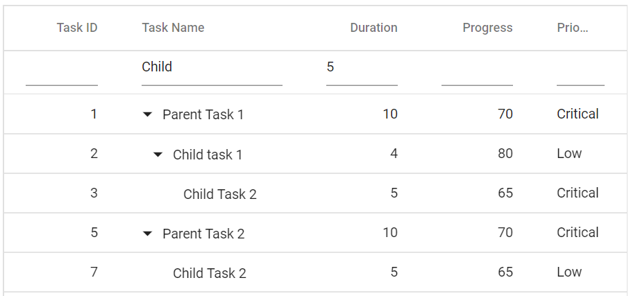
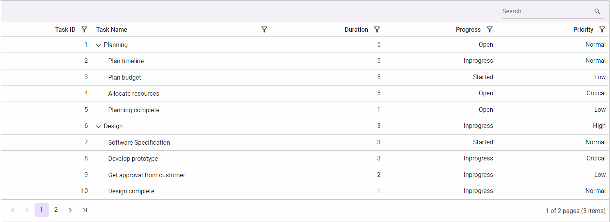

# Filtering in Blazor Tree Grid Component

Filtering displays specific or related records based on defined criteria. To enable filtering in the TreeGrid, set [AllowFiltering](https://help.syncfusion.com/cr/blazor/Syncfusion.Blazor.TreeGrid.SfTreeGrid-1.html#Syncfusion_Blazor_TreeGrid_SfTreeGrid_1_AllowFiltering) to true. Configure filtering behavior through [FilterSettings](https://help.syncfusion.com/cr/blazor/Syncfusion.Blazor.TreeGrid.SfTreeGrid-1.html#Syncfusion_Blazor_TreeGrid_SfTreeGrid_1_FilterSettings). For related filtering UIs, see the filter menu, Excel-like filter, and filter bar topics.

The following video shows how to filter data in the Blazor TreeGrid.







@using TreeGridComponent.Data;
@using  Syncfusion.Blazor.TreeGrid;
@using  Syncfusion.Blazor.Data;

<SfTreeGrid DataSource="@TreeGridData" IdMapping="TaskId" ParentIdMapping="ParentId" TreeColumnIndex="1" AllowFiltering="true">
    <TreeGridColumns>
        <TreeGridColumn Field="TaskId" HeaderText="Task ID" Width="80" TextAlign="Syncfusion.Blazor.Grids.TextAlign.Right"></TreeGridColumn>
        <TreeGridColumn Field="TaskName" HeaderText="Task Name" Width="100"></TreeGridColumn>
        <TreeGridColumn Field="StartDate" HeaderText="Start Date" Width="100" TextAlign="Syncfusion.Blazor.Grids.TextAlign.Right"></TreeGridColumn>
        <TreeGridColumn Field="Duration" HeaderText="Duration" Width="100" TextAlign="Syncfusion.Blazor.Grids.TextAlign.Right"></TreeGridColumn>
        <TreeGridColumn Field="Progress" HeaderText="Progress" Width="100" TextAlign="Syncfusion.Blazor.Grids.TextAlign.Right"></TreeGridColumn>
        <TreeGridColumn Field="Priority" HeaderText="Priority" Width="60"></TreeGridColumn>
    </TreeGridColumns>
</SfTreeGrid>

@code{
    public List<BusinessObject> TreeGridData { get; set; }

    protected override void OnInitialized()
    {
        this.TreeGridData = BusinessObject.GetSelfDataSource().ToList();
    }
}





namespace TreeGridComponent.Data {

        public class BusinessObject
        {
            public int TaskId { get; set;}
            public string TaskName { get; set;}
            public int? Duration { get; set;}
            public int? Progress { get; set;}
            public string Priority { get; set;}
            public int? ParentId { get; set;}
       
        public static List<BusinessObject> GetSelfDataSource()
        {
            List<BusinessObject> BusinessObjectCollection = new List<BusinessObject>();
            BusinessObjectCollection.Add(new BusinessObject() { TaskId = 1,TaskName = "Parent Task 1",Duration = 10,Progress = 70,Priority = "Critical",ParentId = null });
            BusinessObjectCollection.Add(new BusinessObject() { TaskId = 2,TaskName = "Child task 1",Duration = 4,Progress = 80,Priority = "Low",ParentId = 1 });
            BusinessObjectCollection.Add(new BusinessObject() { TaskId = 3,TaskName = "Child Task 2",Duration = 5,Progress = 65,Priority = "Critical",ParentId = 2 });
            BusinessObjectCollection.Add(new BusinessObject() { TaskId = 4,TaskName = "Child task 3",Duration = 6,Priority = "High",Progress = 77,ParentId = 3 });
            BusinessObjectCollection.Add(new BusinessObject() { TaskId = 5,TaskName = "Parent Task 2",Duration = 10,Progress = 70,Priority = "Critical",ParentId = null});
            BusinessObjectCollection.Add(new BusinessObject() { TaskId = 6,TaskName = "Child task 1",Duration = 4,Progress = 80,Priority = "Critical",ParentId = 5});
            BusinessObjectCollection.Add(new BusinessObject() { TaskId = 7,TaskName = "Child Task 2",Duration = 5,Progress = 65,Priority = "Low",ParentId = 5});
            BusinessObjectCollection.Add(new BusinessObject() { TaskId = 8,TaskName = "Child task 3",Duration = 6,Progress = 77,Priority = "High",ParentId = 5});
            BusinessObjectCollection.Add(new BusinessObject() { TaskId = 9,TaskName = "Child task 4",Duration = 6,Progress = 77,Priority = "Low",ParentId = 5});
            return BusinessObjectCollection;
        }
    }
}





Filtering enabled in the TreeGrid with basic column configurations.

N> Use [FilterByColumnAsync](https://help.syncfusion.com/cr/blazor/Syncfusion.Blazor.TreeGrid.SfTreeGrid-1.html#Syncfusion_Blazor_TreeGrid_SfTreeGrid_1_FilterByColumnAsync_System_String_System_String_System_Object_System_String_System_Nullable_System_Boolean__System_Nullable_System_Boolean__System_String_System_String_) to apply a filter programmatically and [ClearFilteringAsync](https://help.syncfusion.com/cr/blazor/Syncfusion.Blazor.TreeGrid.SfTreeGrid-1.html#Syncfusion_Blazor_TreeGrid_SfTreeGrid_1_ClearFilteringAsync) to clear filters. To disable filtering for a specific column, set the column’s `AllowFiltering` to false.

## Filter hierarchy modes

TreeGrid supports multiple hierarchy modes through the [HierarchyMode](https://help.syncfusion.com/cr/blazor/Syncfusion.Blazor.TreeGrid.SfTreeGrid-1.html#Syncfusion_Blazor_TreeGrid_SfTreeGrid_1_FilterSettings#Syncfusion_Blazor_TreeGrid_TreeGridFilterSettings_HierarchyMode) property of [FilterSettings](https://help.syncfusion.com/cr/blazor/Syncfusion.Blazor.TreeGrid.SfTreeGrid-1.html#Syncfusion_Blazor_TreeGrid_SfTreeGrid_1_FilterSettings). The following modes are available:

* **Parent** : This is the default filter hierarchy mode in the Tree Grid. The filtered records are displayed with its parent records, if the filtered records not have any parent record then the filtered records are only displayed.

* **Child** : The filtered records are displayed with its child record, if the filtered records does not have any child record then the filtered records are only displayed.

* **Both** : The filtered records are displayed with its both parent and child record, if the filtered records does not have any parent and child record then the filtered records are only displayed.

* **None** : The filtered records are only displayed.

## Initial filter

To apply filters during initial rendering, configure one or more filter **PredicateModel** values in the [Columns](https://help.syncfusion.com/cr/blazor/Syncfusion.Blazor.TreeGrid.SfTreeGrid-1.html#Syncfusion_Blazor_TreeGrid_SfTreeGrid_1_FilterSettings#Syncfusion_Blazor_TreeGrid_TreeGridFilterSettings_Columns) collection of [FilterSettings](https://help.syncfusion.com/cr/blazor/Syncfusion.Blazor.TreeGrid.SfTreeGrid-1.html#Syncfusion_Blazor_TreeGrid_SfTreeGrid_1_FilterSettings).





@using TreeGridComponent.Data;
@using Syncfusion.Blazor.TreeGrid;
@using Syncfusion.Blazor.Data;
@using Syncfusion.Blazor.Grids;

<SfTreeGrid IdMapping="TaskId" DataSource="@TreeGridData" AllowFiltering="true" ParentIdMapping="ParentId" TreeColumnIndex="1">
    <TreeGridFilterSettings>
        <TreeGridFilterColumns>
            <TreeGridFilterColumn Field="TaskName" MatchCase="false" Operator="Syncfusion.Blazor.Operator.StartsWith" Predicate="and" Value="@Name"></TreeGridFilterColumn>
            <TreeGridFilterColumn Field="Duration" MatchCase="false" Operator="Syncfusion.Blazor.Operator.Equal" Predicate="and" Value="@Duration"></TreeGridFilterColumn>
        </TreeGridFilterColumns>
    </TreeGridFilterSettings>
    <TreeGridColumns>
        <TreeGridColumn Field="TaskId" HeaderText="Task ID" Width="80" TextAlign="@TextAlign.Right"></TreeGridColumn>
        <TreeGridColumn Field="TaskName" HeaderText="Task Name" Width="160"></TreeGridColumn>
        <TreeGridColumn Field="Duration" HeaderText="Duration" Width="100" TextAlign="@TextAlign.Right"></TreeGridColumn>
        <TreeGridColumn Field="Progress" HeaderText="Progress" Width="100" TextAlign="@TextAlign.Right"></TreeGridColumn>
        <TreeGridColumn Field="Priority" HeaderText="Priority" Width="80"></TreeGridColumn>
    </TreeGridColumns>
</SfTreeGrid>

@code{

    public string Name { get; set; } = "Child";

    public int Duration { get; set; } = 5;

    public List<BusinessObject> TreeGridData { get; set; }

    protected override void OnInitialized()
    {
        this.TreeGridData = BusinessObject.GetSelfDataSource().ToList();
    }
}





namespace TreeGridComponent.Data {

        public class BusinessObject
        {
            public int TaskId { get; set;}
            public string TaskName { get; set;}
            public int? Duration { get; set;}
            public int? Progress { get; set;}
            public string Priority { get; set;}
            public int? ParentId { get; set;}
       
        public static List<BusinessObject> GetSelfDataSource()
        {
            List<BusinessObject> BusinessObjectCollection = new List<BusinessObject>();
            BusinessObjectCollection.Add(new BusinessObject() { TaskId = 1,TaskName = "Parent Task 1",Duration = 10,Progress = 70,Priority = "Critical",ParentId = null });
            BusinessObjectCollection.Add(new BusinessObject() { TaskId = 2,TaskName = "Child task 1",Duration = 4,Progress = 80,Priority = "Low",ParentId = 1 });
            BusinessObjectCollection.Add(new BusinessObject() { TaskId = 3,TaskName = "Child Task 2",Duration = 5,Progress = 65,Priority = "Critical",ParentId = 2 });
            BusinessObjectCollection.Add(new BusinessObject() { TaskId = 4,TaskName = "Child task 3",Duration = 6,Priority = "High",Progress = 77,ParentId = 3 });
            BusinessObjectCollection.Add(new BusinessObject() { TaskId = 5,TaskName = "Parent Task 2",Duration = 10,Progress = 70,Priority = "Critical",ParentId = null});
            BusinessObjectCollection.Add(new BusinessObject() { TaskId = 6,TaskName = "Child task 1",Duration = 4,Progress = 80,Priority = "Critical",ParentId = 5});
            BusinessObjectCollection.Add(new BusinessObject() { TaskId = 7,TaskName = "Child Task 2",Duration = 5,Progress = 65,Priority = "Low",ParentId = 5});
            BusinessObjectCollection.Add(new BusinessObject() { TaskId = 8,TaskName = "Child task 3",Duration = 6,Progress = 77,Priority = "High",ParentId = 5});
            BusinessObjectCollection.Add(new BusinessObject() { TaskId = 9,TaskName = "Child task 4",Duration = 6,Progress = 77,Priority = "Low",ParentId = 5});
            return BusinessObjectCollection;
        }
    }
}





## Filter operators

Define the filter operator for a column using the Operator property in the [Columns](https://help.syncfusion.com/cr/blazor/Syncfusion.Blazor.TreeGrid.SfTreeGrid-1.html#Syncfusion_Blazor_TreeGrid_SfTreeGrid_1_FilterSettings#Syncfusion_Blazor_TreeGrid_TreeGridFilterSettings_Columns) collection of [FilterSettings](https://help.syncfusion.com/cr/blazor/Syncfusion.Blazor.TreeGrid.SfTreeGrid-1.html#Syncfusion_Blazor_TreeGrid_SfTreeGrid_1_FilterSettings).

The available operators and their supported data types are:

Operator |Description |Supported Types
-----|-----|-----
startswith |Checks whether the value begins with the specified value. |String
doesnotstartswith |Checks whether the value does not begin with the specified value. |String
endswith |Checks whether the value ends with the specified value. |String
doesnotendswith |Checks whether the value does not end with the specified value. |String
contains |Checks whether the value contains the specified value. |String
doesnotcontains |Checks whether the value does not contain the specified value. |String
empty |Checks whether the value is empty. |String
notempty |Checks whether the value is not empty. |String
like |Processes a single search pattern using the “%” symbol and returns values matching the pattern. |String
wildcard |Processes one or more search patterns using the “*” symbol and returns values matching the patterns. |String
equal |Checks whether the value is equal to the specified value. |String &#124; Number &#124; Boolean &#124; Date
notequal |Checks whether the value is not equal to the specified value. |String &#124; Number &#124; Boolean &#124; Date
greaterthan |Checks whether the value is greater than the specified value. |Number &#124; Date
greaterthanorequal |Checks whether the value is greater than or equal to the specified value. |Number &#124; Date
lessthan |Checks whether the value is less than the specified value. |Number &#124; Date
lessthanorequal |Checks whether the value is less than or equal to the specified value. |Number &#124; Date
null |Checks whether the value is null. |Number &#124; Date
notnull |Checks whether the value is not null. |Number &#124; Date

N> By default, the [Operator](https://help.syncfusion.com/cr/blazor/Syncfusion.Blazor.TreeGrid.TreeGridFilterSettings.html#Syncfusion_Blazor_TreeGrid_TreeGridFilterSettings_Operators) value is **equal**.

## Wildcard and LIKE operator filter

**Wildcard** and **LIKE** operators filter values based on string patterns and apply to string-type columns. They differ in how patterns are processed and where they are supported.

### Wildcard filtering

The **Wildcard** filter processes one or more search patterns using the “*” symbol and returns values that match the specified patterns.

- The **Wildcard** option is supported when search options are available in the TreeGrid.

**For example:**

Operator |Description
-----|-----
a*b |Values that start with “a” and end with “b”.
a* |Values that start with “a”.
*b |Values that end with “b”.
*a* |Values that contain “a”.
*a*b* |Values that contain “a”, followed by anything, then “b”, followed by anything.

The following image illustrates the **Wildcard** operator in action.

 

> When using the **Wildcard** operator, records are displayed according to the selected filter [HierarchyMode](https://help.syncfusion.com/cr/blazor/Syncfusion.Blazor.TreeGrid.SfTreeGrid-1.html#Syncfusion_Blazor_TreeGrid_SfTreeGrid_1_FilterSettings#Syncfusion_Blazor_TreeGrid_TreeGridFilterSettings_HierarchyMode) in [FilterSettings](https://help.syncfusion.com/cr/blazor/Syncfusion.Blazor.TreeGrid.SfTreeGrid-1.html#Syncfusion_Blazor_TreeGrid_SfTreeGrid_1_FilterSettings). For details, see the filter hierarchy modes [section](https://blazor.syncfusion.com/documentation/treegrid/filtering/filtering#filter-hierarchy-modes).

### LIKE filtering

The **LIKE** filter processes a single search pattern using the “%” symbol and returns values that match the specified pattern. The following TreeGrid features support **LIKE** filtering for string-type columns:

* Filter Menu
* Custom Filter of Excel filter type.

**For example:**

Operator |Description
-----|-----
%ab% |Values that contain “ab”.
ab% |Values that start with “ab”.
%ab |Values that end with “ab”.

The following image illustrates the **LIKE** operator in action.

> When using the **LIKE** operator, records are displayed according to the selected filter [HierarchyMode](https://help.syncfusion.com/cr/blazor/Syncfusion.Blazor.TreeGrid.SfTreeGrid-1.html#Syncfusion_Blazor_TreeGrid_SfTreeGrid_1_FilterSettings#Syncfusion_Blazor_TreeGrid_TreeGridFilterSettings_HierarchyMode) in [FilterSettings](https://help.syncfusion.com/cr/blazor/Syncfusion.Blazor.TreeGrid.SfTreeGrid-1.html#Syncfusion_Blazor_TreeGrid_SfTreeGrid_1_FilterSettings). For details, see the filter hierarchy modes [section](https://blazor.syncfusion.com/documentation/treegrid/filtering/filtering#filter-hierarchy-modes).

## Filter enum column

Filter enum-type data in a TreeGrid column using a filter template.

In the following example, an enumerated list is bound to the Priority column, and the `SfDropDownList` component is rendered in the [FilterTemplate](https://help.syncfusion.com/cr/blazor/Syncfusion.Blazor.TreeGrid.SfTreeGrid-1.html#Syncfusion_Blazor_TreeGrid_SfTreeGrid_1_Columns#Syncfusion_Blazor_TreeGrid_TreeGridColumn_FilterTemplate) of that column.  

In the [ValueChange](https://help.syncfusion.com/cr/blazor/Syncfusion.Blazor.DropDowns.DropDownListEvents-2.html#Syncfusion_Blazor_DropDowns_DropDownListEvents_2_ValueChange) event of `SfDropDownList`, the Priority column is filtered programmatically using [FilterByColumnAsync](https://help.syncfusion.com/cr/blazor/Syncfusion.Blazor.TreeGrid.SfTreeGrid-1.html#Syncfusion_Blazor_TreeGrid_SfTreeGrid_1_FilterByColumnAsync_System_String_System_String_System_Object_System_String_System_Nullable_System_Boolean__System_Nullable_System_Boolean__System_String_System_String_).





@using TreeGridComponent.Data;
@using Syncfusion.Blazor.TreeGrid
@using Syncfusion.Blazor.Grids
@using Syncfusion.Blazor.DropDowns

    

        

            <SfTreeGrid @ref="TreeGrid" DataSource="@TreeData" AllowFiltering="true" IdMapping="TaskID" ParentIdMapping="ParentID" TreeColumnIndex="1">
                <TreeGridColumns>
                    <TreeGridColumn Field="TaskID" HeaderText="Task ID" Width="80" TextAlign="TextAlign.Right"></TreeGridColumn>
                    <TreeGridColumn Field="TaskName" HeaderText="Task Name" Width="145"></TreeGridColumn>
                    <TreeGridColumn Field="Duration" HeaderText="Duration" Width="100" TextAlign="TextAlign.Right"></TreeGridColumn>
                    <TreeGridColumn Field="Progress" HeaderText="Progress" Width="200"></TreeGridColumn>
                    <TreeGridColumn Field="Priority" HeaderText="Priority" Width="200">
                        <FilterTemplate>
                            <SfDropDownList Placeholder="Priority" ID="Priority" Value="@((string)(context as PredicateModel).Value)" DataSource="@FilterDropData" TValue="string" TItem="Data">
                                <DropDownListEvents TItem="Data" ValueChange="Change" TValue="string"></DropDownListEvents>
                                <DropDownListFieldSettings Value="Priority" Text="Priority"></DropDownListFieldSettings>
                            </SfDropDownList>
                        </FilterTemplate>
                    </TreeGridColumn>
                </TreeGridColumns>
            </SfTreeGrid>
        

    

@code{
    public SfTreeGrid<SelfReferenceData> TreeGrid;
    private List<SelfReferenceData> TreeData { get; set; }
    protected override void OnInitialized()
    {
        this.TreeData = SelfReferenceData.GetTree().Take(50).ToList();
    }
    public enum Prioritize : short
    {
        High = 1,
        Low = 2,
        Critical = 3
    }
    public class Data
    {
        public string Priority { get; set; }
    }
    List<Data> FilterDropData = new List<Data>
    {
        new Data() { Priority= "All" },
        new Data() { Priority= "High" },
        new Data() { Priority= "Low" },
        new Data() { Priority= "Critical" }
    };
    public async Task Change(ChangeEventArgs<string, Data> args)
    {
        if (args.Value == "All")
        {
           await this.TreeGrid.ClearFilteringAsync();
        }
        else
        {
            await this.TreeGrid.FilterByColumnAsync("Priority", "contains", args.Value);
        }
    }
}





namespace TreeGridComponent.Data {

        public class SelfReferenceData
        {
        public static List<SelfReferenceData> tree = new List<SelfReferenceData>();
        public int? TaskID { get; set; }
        public string TaskName { get; set; }
        public DateTime? StartDate { get; set; }
        public DateTime? EndDate { get; set; }
        public String Progress { get; set; }
        public Prioritize Priority { get; set; }
        public double? Duration { get; set; }
        public int? ParentID { get; set; }
        public bool? IsParent { get; set; }
        public int? ParentItem { get; set;}
        public SelfReferenceData() { }
        public static List<SelfReferenceData> GetTree()
        {
                tree.Clear();
                int root = -1;
                int TaskNameID = 0;
                int ChildCount = -1;
                int SubTaskCount = -1;
                var values = Enum.GetValues(typeof(Prioritize));
                for (var t = 1; t <= 60; t++)
                {
                Random gen = new Random();
                Random ran = new Random();
                DateTime start = new DateTime(2021, 06, 07);
                int range = (DateTime.Today - start).Days;
                DateTime startingDate = start.AddDays(gen.Next(range));
                DateTime end = new DateTime(2023, 08, 25);
                int endrange = (end - DateTime.Today).Days;
                DateTime endingDate = end.AddDays(gen.Next(endrange));
                    string progr = (ran.Next() % 3) == 0 ? "Started" : (ran.Next() % 2) == 0 ? "Open" : "In Progress";
                    bool appr = (ran.Next() % 3) == 0 ? true : (ran.Next() % 2) == 0 ? false : true;
                    root++; TaskNameID++;
                    int rootItem = root + 1;
                    tree.Add(new SelfReferenceData() { TaskID = rootItem, TaskName = "Parent task " + TaskNameID.ToString(), StartDate = startingDate, EndDate = endingDate, IsParent = true, ParentID = null, Progress = progr, Priority = (Prioritize)(values.GetValue(gen.Next(values.Length))), Duration = ran.Next(1, 50) });
                    int parent = tree.Count;
                    for (var c = 0; c < 2; c++)
                    {
                    DateTime start1 = new DateTime(2021, 07, 09);
                    int range1 = (DateTime.Today - start1).Days;
                    DateTime startingDate1 = start1.AddDays(gen.Next(range1));
                    DateTime end1 = new DateTime(2022, 08, 23);
                    int endrange1 = (end1 - DateTime.Today).Days;
                    DateTime endingDate1 = end1.AddDays(gen.Next(endrange1));
                    root++; ChildCount++;
                        int parn = parent + c + 1;
                        progr = (ran.Next() % 3) == 0 ? "In Progress" : (ran.Next() % 2) == 0 ? "Open" : "Validated";
                        appr = (ran.Next() % 3) == 0 ? true : (ran.Next() % 2) == 0 ? false : true;
                        int iD = root + 1;
                        tree.Add(new SelfReferenceData() { TaskID = iD, TaskName = "Child task " + (ChildCount + 1).ToString(), StartDate = startingDate1, EndDate = endingDate1, IsParent = (((parent + c + 1) % 3) == 0), ParentID = rootItem, Progress = progr, Priority = (Prioritize)(values.GetValue(gen.Next(values.Length))), Duration = ran.Next(1, 50) });
                        if ((((parent + c + 1) % 3) == 0))
                        {
                        int immParent = tree.Count;
                            for (var s = 0; s < 3; s++)
                            {
                            DateTime start2 = new DateTime(2021, 05, 05);
                            int range2 = (DateTime.Today - start2).Days;
                            DateTime startingDate2 = start2.AddDays(gen.Next(range2));
                            DateTime end2 = new DateTime(2024, 06, 16);
                            int endrange2 = (end2 - DateTime.Today).Days;
                            DateTime endingDate2 = end2.AddDays(gen.Next(endrange2));
                            root++; SubTaskCount++;
                                tree.Add(new SelfReferenceData() { TaskID = root + 1, TaskName = "Sub task " + (SubTaskCount + 1).ToString(), StartDate = startingDate2, EndDate = endingDate2, IsParent = false, ParentID = iD, Progress = (immParent % 2 == 0) ? "In Progress" : "Closed", Priority = (Prioritize)(values.GetValue(gen.Next(values.Length))), Duration = ran.Next(1, 50) });
                            }
                        }
                    }
                }
            return tree;
        }
    }
}





## Filtering with case sensitivity

The Syncfusion&reg; Blazor TreeGrid filtering functionality can be configured to consider or ignore character casing. By default, filtering is not case-sensitive, meaning matches are found regardless of character case (e.g., "Task" and "task" are treated the same). Case-sensitive filtering is enabled by setting the [`TreeGridFilterSettings.EnableCaseSensitivity`](https://help.syncfusion.com/cr/blazor/Syncfusion.Blazor.TreeGrid.SfTreeGrid-1.html#Syncfusion_Blazor_TreeGrid_SfTreeGrid_1_EnableCaseSensitivity) property to **true**.

The following example demonstrates configuration of the `EnableCaseSensitivity` property within `TreeGridFilterSettings`:




@using TreeGridComponent.Data
@using Syncfusion.Blazor.TreeGrid
@using Syncfusion.Blazor.Grids
@using Syncfusion.Blazor.Buttons

    <SfTreeGrid @ref="TreeGrid" DataSource="@TreeData" IdMapping="TaskID" ParentIdMapping="ParentID" TreeColumnIndex="1" AllowFiltering="true">
    <TreeGridFilterSettings Type="Syncfusion.Blazor.TreeGrid.FilterType.FilterBar" EnableCaseSensitivity="true"> </TreeGridFilterSettings>
    <TreeGridColumns>
        <TreeGridColumn Field=@nameof(TreeTask.TaskID) HeaderText="Task ID" TextAlign="TextAlign.Right" Width="90" IsPrimaryKey />
        <TreeGridColumn Field=@nameof(TreeTask.TaskName) HeaderText="Task Name" Width="200" />
        <TreeGridColumn Field=@nameof(TreeTask.ResourceName) HeaderText="Resource Name" Width="180" />
        <TreeGridColumn Field=@nameof(TreeTask.City) HeaderText="City" Width="140" />
        <TreeGridColumn Field=@nameof(TreeTask.StartDate) HeaderText="Start Date" Type="ColumnType.Date" Format="d" Width="130" />
        <TreeGridColumn Field=@nameof(TreeTask.Duration) HeaderText="Duration (days)" TextAlign="TextAlign.Right" Width="140" />
    </TreeGridColumns>
</SfTreeGrid>

@code{
    private List<TreeTask> TreeData = new();
    public SfTreeGrid<TreeTask> TreeGrid;
    protected override void OnInitialized()
    {
        TreeData = TreeTask.GetTreeTasks();
    }
   
}




namespace TreeGridComponent.Data {

    public class TreeTask
    {
        public int TaskID { get; set; }
        public string TaskName { get; set; } = string.Empty;
        public string ResourceName { get; set; } = string.Empty;
        public string City { get; set; } = string.Empty;
        public DateTime StartDate { get; set; }
        public int Duration { get; set; }
        public int? ParentID { get; set; }
        public static List<TreeTask> GetTreeTasks() => new()
        {
            new TreeTask
            {
                TaskID = 1,
                TaskName = "Market Analysis",
                ResourceName = "José Álvarez",
                City = "Sevilla",
                StartDate = new DateTime(2024, 1, 2),
                Duration = 5,
                ParentID = null
            },
            new TreeTask
            {
                TaskID = 2,
                TaskName = "Competitor Review",
                ResourceName = "Zoë Brontë",
                City = "São Paulo",
                StartDate = new DateTime(2024, 1, 3),
                Duration = 3,
                ParentID = 1
            },
            new TreeTask
            {
                TaskID = 3,
                TaskName = "Focus Group",
                ResourceName = "François Dœuf",
                City = "Montréal",
                StartDate = new DateTime(2024, 1, 4),
                Duration = 2,
                ParentID = 1
            },
            new TreeTask
            {
                TaskID = 4,
                TaskName = "Product Design",
                ResourceName = "Mårten Šedý",
                City = "Göteborg",
                StartDate = new DateTime(2024, 1, 5),
                Duration = 6,
                ParentID = null
            },
            new TreeTask
            {
                TaskID = 5,
                TaskName = "UX Workshop",
                ResourceName = "Anaïs Löhn",
                City = "München",
                StartDate = new DateTime(2024, 1, 6),
                Duration = 4,
                ParentID = 4
            },
            new TreeTask
            {
                TaskID = 6,
                TaskName = "Prototype Testing",
                ResourceName = "Renée Faßbinder",
                City = "Zürich",
                StartDate = new DateTime(2024, 1, 8),
                Duration = 3,
                ParentID = 4
            }
        };
    }
}






## Filtering with ignore accent

The Syncfusion&reg; Blazor TreeGrid filtering functionality can be configured to ignore diacritic characters or accents. By default, filtering is accent-sensitive, requiring exact matches (e.g., "José" vs. "Jose"). Accent-insensitive filtering is enabled by setting the [`TreeGridFilterSettings.IgnoreAccent`](https://help.syncfusion.com/cr/blazor/Syncfusion.Blazor.TreeGrid.SfTreeGrid-1.html#Syncfusion_Blazor_TreeGrid_SfTreeGrid_1_IgnoreAccent) property to **true**.

The following example demonstrates configuration of the `IgnoreAccent` property within `TreeGridFilterSettings`:




@using TreeGridComponent.Data
@using Syncfusion.Blazor.TreeGrid
@using Syncfusion.Blazor.Grids
@using Syncfusion.Blazor.Buttons

    <<SfTreeGrid @ref="TreeGrid" DataSource="@TreeData" IdMapping="TaskID" ParentIdMapping="ParentID" TreeColumnIndex="1" AllowFiltering="true">
    <TreeGridFilterSettings Type="Syncfusion.Blazor.TreeGrid.FilterType.FilterBar" IgnoreAccent="true"> </TreeGridFilterSettings>
    <TreeGridColumns>
        <TreeGridColumn Field=@nameof(TreeTask.TaskID) HeaderText="Task ID" TextAlign="TextAlign.Right" Width="90"  IsPrimaryKey />
        <TreeGridColumn Field=@nameof(TreeTask.TaskName) HeaderText="Task Name" Width="200" />
        <TreeGridColumn Field=@nameof(TreeTask.ResourceName) HeaderText="Resource Name" Width="180" />
        <TreeGridColumn Field=@nameof(TreeTask.City) HeaderText="City" Width="140" />
        <TreeGridColumn Field=@nameof(TreeTask.StartDate) HeaderText="Start Date" Type="ColumnType.Date" Format="d" Width="130" />
        <TreeGridColumn Field=@nameof(TreeTask.Duration) HeaderText="Duration (days)" TextAlign="TextAlign.Right" Width="140" />
    </TreeGridColumns>
</SfTreeGrid>

@code{
    private List<TreeTask> TreeData = new();
    public SfTreeGrid<TreeTask> TreeGrid;
    protected override void OnInitialized()
    {
        TreeData = TreeTask.GetTreeTasks();
    }
}




namespace TreeGridComponent.Data {

    public class TreeTask
    {
        public int TaskID { get; set; }
        public string TaskName { get; set; } = string.Empty;
        public string ResourceName { get; set; } = string.Empty;
        public string City { get; set; } = string.Empty;
        public DateTime StartDate { get; set; }
        public int Duration { get; set; }
        public int? ParentID { get; set; }
        public static List<TreeTask> GetTreeTasks() => new()
        {
            new TreeTask
            {
                TaskID = 1,
                TaskName = "Market Analysis",
                ResourceName = "José Álvarez",
                City = "Sevilla",
                StartDate = new DateTime(2024, 1, 2),
                Duration = 5,
                ParentID = null
            },
            new TreeTask
            {
                TaskID = 2,
                TaskName = "Competitor Review",
                ResourceName = "Zoë Brontë",
                City = "São Paulo",
                StartDate = new DateTime(2024, 1, 3),
                Duration = 3,
                ParentID = 1
            },
            new TreeTask
            {
                TaskID = 3,
                TaskName = "Focus Group",
                ResourceName = "François Dœuf",
                City = "Montréal",
                StartDate = new DateTime(2024, 1, 4),
                Duration = 2,
                ParentID = 1
            },
            new TreeTask
            {
                TaskID = 4,
                TaskName = "Product Design",
                ResourceName = "Mårten Šedý",
                City = "Göteborg",
                StartDate = new DateTime(2024, 1, 5),
                Duration = 6,
                ParentID = null
            },
            new TreeTask
            {
                TaskID = 5,
                TaskName = "UX Workshop",
                ResourceName = "Anaïs Löhn",
                City = "München",
                StartDate = new DateTime(2024, 1, 6),
                Duration = 4,
                ParentID = 4
            },
            new TreeTask
            {
                TaskID = 6,
                TaskName = "Prototype Testing",
                ResourceName = "Renée Faßbinder",
                City = "Zürich",
                StartDate = new DateTime(2024, 1, 8),
                Duration = 3,
                ParentID = 4
            }
        };
    }
}




