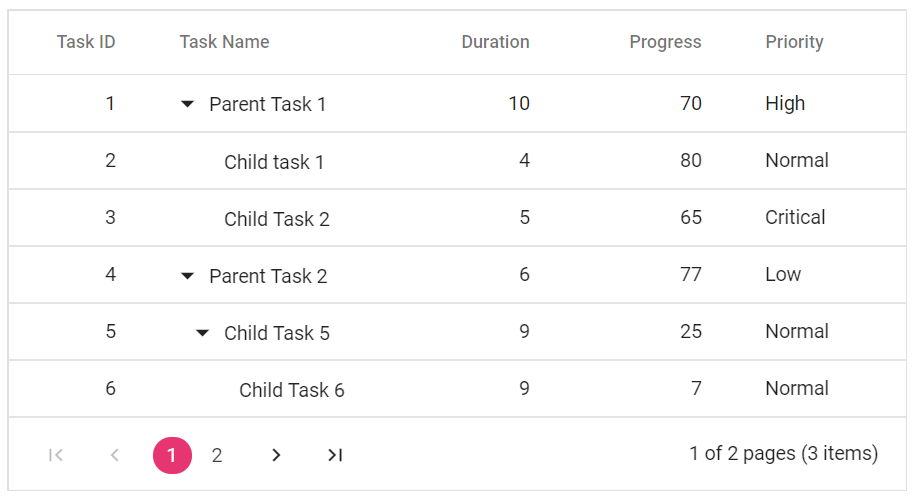

# Getting Started with Blazor TreeGrid in Blazor MAUI App

This section explains the step-by-step process of integrating the Syncfusion<sup style="font-size:70%">&reg;</sup> Blazor TreeGrid component into the Blazor MAUI application using Visual Studio and Visual Studio Code.





## Prerequisites

* [System requirements for Blazor components](https://blazor.syncfusion.com/documentation/system-requirements)

## Create a new Blazor MAUI App in Visual Studio

Create a **.NET MAUI Blazor Hybrid App** using Visual Studio 2022 via [Microsoft Templates](https://learn.microsoft.com/en-us/dotnet/maui/get-started/first-app?pivots=devices-windows&tabs=vswin) or the [Syncfusion<sup style="font-size:70%">&reg;</sup> Blazor Extension](https://blazor.syncfusion.com/documentation/visual-studio-integration/template-studio).

1. Open **Visual Studio 2022** (v17.8 or later).
2. Click **Create a new project** in the start window.
3. Search for **.NET MAUI Blazor Hybrid App** template and select it.
4. Click **Next** to proceed.
5. Enter the project name (for example, `MauiTreeGridApp`).
6. Select the project location and solution settings.
7. Click **Next** to continue.
8. Select **.NET 8.0** (or the latest installed version) as the target framework.
9. Click **Create** to generate the project.

## Install Syncfusion<sup style="font-size:70%">&reg;</sup> Blazor TreeGrid and Themes NuGet in the App

To add the **Blazor TreeGrid** component in the app, open the NuGet package manager in Visual Studio (*Tools → NuGet Package Manager → Manage NuGet Packages for Solution*), then search and install [Syncfusion.Blazor.TreeGrid](https://www.nuget.org/packages/Syncfusion.Blazor.TreeGrid) and [Syncfusion.Blazor.Themes](https://www.nuget.org/packages/Syncfusion.Blazor.Themes/).

Alternatively, run the following commands in the Package Manager Console to achieve the same.




Install-Package Syncfusion.Blazor.TreeGrid -Version 24.1.36
Install-Package Syncfusion.Blazor.Themes -Version 24.1.36




N> Syncfusion<sup style="font-size:70%">&reg;</sup> Blazor components are available in [nuget.org](https://www.nuget.org/packages?q=syncfusion.blazor). Refer to the [NuGet packages](https://blazor.syncfusion.com/documentation/nuget-packages) topic for the available NuGet packages list with component details.





## Prerequisites

* [System requirements for Blazor components](https://blazor.syncfusion.com/documentation/system-requirements)

## Create a new Blazor MAUI App in Visual Studio Code

Create a **Blazor MAUI App** using Visual Studio Code via [Microsoft Templates](https://learn.microsoft.com/en-us/dotnet/maui/get-started/first-app?pivots=devices-windows&tabs=vsc) or the [Syncfusion<sup style="font-size:70%">&reg;</sup> Blazor Extension](https://blazor.syncfusion.com/documentation/visual-studio-code-integration/create-project).

1. Open a terminal or command prompt.
2. Navigate to the desired project location.
3. Run the following command to create a new Blazor MAUI App:




dotnet new maui-blazor -o MauiTreeGridApp
cd MauiTreeGridApp




## Install Syncfusion<sup style="font-size:70%">&reg;</sup> Blazor TreeGrid and Themes NuGet in the App

* Press <kbd>Ctrl</kbd>+<kbd>`</kbd> to open the integrated terminal in Visual Studio Code.
* Ensure you’re in the project root directory where your `.csproj` file is located.
* Run the following command to install a [Syncfusion.Blazor.TreeGrid](https://www.nuget.org/packages/Syncfusion.Blazor.TreeGrid) and [Syncfusion.Blazor.Themes](https://www.nuget.org/packages/Syncfusion.Blazor.Themes/) NuGet package and ensure all dependencies are installed.





dotnet add package Syncfusion.Blazor.TreeGrid --version 24.1.36
dotnet add package Syncfusion.Blazor.Themes --version 24.1.36
dotnet restore





N> Syncfusion<sup style="font-size:70%">&reg;</sup> Blazor components are available in [nuget.org](https://www.nuget.org/packages?q=syncfusion.blazor). Refer to the [NuGet packages](https://blazor.syncfusion.com/documentation/nuget-packages) topic for the available NuGet packages list with component details.





## Prerequisites

Install the latest version of [.NET SDK](https://dotnet.microsoft.com/en-us/download). If you previously installed the SDK, you can determine the installed version by executing the following command in a command prompt (Windows) or terminal (macOS) or command shell (Linux).




dotnet --version




## Register Syncfusion Blazor Services

**Add Import Namespaces**

1. Open the `_Imports.razor` file in the project root.

2. Add the following namespaces:

```razor
@using Syncfusion.Blazor
@using Syncfusion.Blazor.TreeGrid
```

**Register Syncfusion Services in MauiProgram.cs**

1. Open the `MauiProgram.cs` file.

2. Register the Syncfusion Blazor service:

```csharp
using Microsoft.Extensions.Logging;
using Syncfusion.Blazor;

namespace MauiTreeGridApp;

public static class MauiProgram
{
    public static MauiApp CreateMauiApp()
    {
        var builder = MauiApp.CreateBuilder();
        builder
            .UseMauiApp<App>()
            .ConfigureFonts(fonts =>
            {
                fonts.AddFont("OpenSans-Regular.ttf", "OpenSansRegular");
            });

        builder.Services.AddMauiBlazorWebView();

        // Register Syncfusion Blazor service
        builder.Services.AddSyncfusionBlazor();

#if DEBUG
        builder.Services.AddBlazorWebViewDeveloperTools();
        builder.Logging.AddDebug();
#endif

        return builder.Build();
    }
}
```

## Add stylesheet and script resources

The theme stylesheet and script can be accessed from NuGet through [Static Web Assets](https://blazor.syncfusion.com/documentation/appearance/themes#static-web-assets). Include the stylesheet and script references in the `<head>` section of the **~/index.html** file.

```html
<head>
    ....
    <link href="_content/Syncfusion.Blazor.Themes/bootstrap5.css" rel="stylesheet" />
    <script src="_content/Syncfusion.Blazor.Core/scripts/syncfusion-blazor.min.js" type="text/javascript"></script>

    <!--Blazor TreeGrid Component script reference. -->
    <!-- <script src="_content/Syncfusion.Blazor.TreeGrid/scripts/sf-treegrid.min.js" type="text/javascript"></script> -->
</head>
```
N> Check out the [Blazor Themes](https://blazor.syncfusion.com/documentation/appearance/themes) topic to discover various methods ([Static Web Assets](https://blazor.syncfusion.com/documentation/appearance/themes#static-web-assets), [CDN](https://blazor.syncfusion.com/documentation/appearance/themes#cdn-reference), and [CRG](https://blazor.syncfusion.com/documentation/common/custom-resource-generator)) for referencing themes in the Blazor application. Also, check out the [Adding Script Reference](https://blazor.syncfusion.com/documentation/common/adding-script-references) topic to learn different approaches for adding script references in the Blazor application.

## Add Syncfusion Blazor TreeGrid component

1. Navigate to the `Pages` folder.
2. Open `Index.razor`.
3. Replace the content with the following:

```razor
@page "/"
@using Syncfusion.Blazor.TreeGrid
@using Syncfusion.Blazor.Grids
<h1>Project Management Dashboard</h1>

<SfTreeGrid DataSource="@TreeData" IdMapping="TaskId" ParentIdMapping="ParentId" TreeColumnIndex="1">
    <TreeGridColumns>
        <TreeGridColumn Field="TaskId" HeaderText="Task ID" Width="80" TextAlign="Syncfusion.Blazor.Grids.TextAlign.Right"></TreeGridColumn>
        <TreeGridColumn Field="TaskName" HeaderText="Task Name" Width="200"></TreeGridColumn>
        <TreeGridColumn Field="StartDate" HeaderText="Start Date" Type="Syncfusion.Blazor.Grids.ColumnType.Date" Format="yMd" Width="120" TextAlign="Syncfusion.Blazor.Grids.TextAlign.Right"></TreeGridColumn>
        <TreeGridColumn Field="Duration" HeaderText="Duration (Days)" Width="100" TextAlign="Syncfusion.Blazor.Grids.TextAlign.Right"></TreeGridColumn>
        <TreeGridColumn Field="Progress" HeaderText="Progress (%)" Width="100" TextAlign="Syncfusion.Blazor.Grids.TextAlign.Right"></TreeGridColumn>
        <TreeGridColumn Field="Priority" HeaderText="Priority" Width="80"></TreeGridColumn>
    </TreeGridColumns>
</SfTreeGrid>

@code {
    public class TaskData
    {
        public int TaskId { get; set; }
        public string TaskName { get; set; }
        public DateTime? StartDate { get; set; }
        public int Duration { get; set; }
        public int Progress { get; set; }
        public string Priority { get; set; }
        public int? ParentId { get; set; }
    }

    public List<TaskData> TreeData = new List<TaskData>();

    protected override void OnInitialized()
    {
        TreeData.Add(new TaskData 
        { 
            TaskId = 1, 
            TaskName = "Project Launch", 
            StartDate = new DateTime(2026, 02, 01),
            Duration = 30,
            Progress = 40,
            Priority = "High",
            ParentId = null 
        });

        TreeData.Add(new TaskData 
        { 
            TaskId = 2, 
            TaskName = "Planning & Design", 
            StartDate = new DateTime(2026, 02, 01),
            Duration = 14,
            Progress = 80,
            Priority = "High",
            ParentId = 1 
        });

        TreeData.Add(new TaskData 
        { 
            TaskId = 3, 
            TaskName = "Requirements Analysis", 
            StartDate = new DateTime(2026, 02, 01),
            Duration = 5,
            Progress = 100,
            Priority = "High",
            ParentId = 2 
        });

        TreeData.Add(new TaskData 
        { 
            TaskId = 4, 
            TaskName = "Development", 
            StartDate = new DateTime(2026, 02, 15),
            Duration = 12,
            Progress = 10,
            Priority = "High",
            ParentId = 1 
        });

        TreeData.Add(new TaskData 
        { 
            TaskId = 5, 
            TaskName = "Backend Development", 
            StartDate = new DateTime(2026, 02, 15),
            Duration = 7,
            Progress = 15,
            Priority = "High",
            ParentId = 4 
        });

        TreeData.Add(new TaskData 
        { 
            TaskId = 6, 
            TaskName = "Frontend Development", 
            StartDate = new DateTime(2026, 02, 18),
            Duration = 4,
            Progress = 5,
            Priority = "Medium",
            ParentId = 4 
        });
    }
}
```

## Run the Application

### Windows

1. In the Visual Studio toolbar, select **Windows Machine** as the target.
2. Press <kbd>F5</kbd> to run the application.

### Android

1. Ensure an Android Emulator is setup via **Tools > Android > Android Device Manager**.
2. Select the Android Emulator in the toolbar.
3. Press <kbd>F5</kbd>.

## Define Columns

The TreeGrid displays data in columns. Each column maps to a property in the data model through the `Field` property.

1. In the `Index.razor` file, locate the `<TreeGridColumns>` section.

2. Review the existing column definitions:

```razor
<TreeGridColumns>
    <TreeGridColumn Field="TaskId" HeaderText="Task ID" Width="80" TextAlign="Syncfusion.Blazor.Grids.TextAlign.Right"></TreeGridColumn>
    <TreeGridColumn Field="TaskName" HeaderText="Task Name" Width="200"></TreeGridColumn>
    <TreeGridColumn Field="StartDate" HeaderText="Start Date" Type="Syncfusion.Blazor.Grids.ColumnType.Date" Format="yMd" Width="120" TextAlign="Syncfusion.Blazor.Grids.TextAlign.Right"></TreeGridColumn>
    <TreeGridColumn Field="Duration" HeaderText="Duration (Days)" Width="100" TextAlign="Syncfusion.Blazor.Grids.TextAlign.Right"></TreeGridColumn>
    <TreeGridColumn Field="Progress" HeaderText="Progress (%)" Width="100" TextAlign="Syncfusion.Blazor.Grids.TextAlign.Right"></TreeGridColumn>
    <TreeGridColumn Field="Priority" HeaderText="Priority" Width="80"></TreeGridColumn>
</TreeGridColumns>
```

**Column Properties**

| Property | Purpose | Values |
|---|---|---|
| **Field** | Maps column to data property | Property name from data model |
| **HeaderText** | Column header display text | Any string value |
| **Width** | Column width | Pixels (e.g., "80") or percentage (e.g., "20%") |
| **TextAlign** | Text alignment in cells | Left, Center, Right |

> **Note:** The `TreeColumnIndex="1"` property on the SfTreeGrid component specifies that the tree expand/collapse icons appear in the `TaskName` column (second column).

## Enable paging

The paging feature enables users to view the TreeGrid records in a paged view. It can be enabled by setting the  [AllowPaging](https://help.syncfusion.com/cr/blazor/Syncfusion.Blazor.TreeGrid.SfTreeGrid-1.html#Syncfusion_Blazor_TreeGrid_SfTreeGrid_1_AllowPaging) property to true. The pager can be customized using the [PageSettings](https://help.syncfusion.com/cr/blazor/Syncfusion.Blazor.TreeGrid.SfTreeGrid-1.html#Syncfusion_Blazor_TreeGrid_SfTreeGrid_1_PageSettings) property.

In root-level paging mode, paging is based on the root-level rows only, i.e., it ignores the child row count and it can be enabled by using the [PageSettings.PageSizeMode](https://help.syncfusion.com/cr/blazor/Syncfusion.Blazor.TreeGrid.TreeGridPageSettings.html#Syncfusion_Blazor_TreeGrid_TreeGridPageSettings_PageSizeMode) property.

```razor
<SfTreeGrid DataSource="@TreeData" 
    IdMapping="TaskId" 
    ParentIdMapping="ParentId" 
    TreeColumnIndex="1"
    AllowPaging="true">
    <TreeGridPageSettings PageSizeMode="PageSizeMode.Root" PageSize="10"></TreeGridPageSettings>
    <TreeGridColumns>
        <!-- Column definitions -->
    </TreeGridColumns>
</SfTreeGrid>
```

## Enable sorting

The sorting feature enables to order the records. It can be enabled by setting the  [AllowSorting](https://help.syncfusion.com/cr/blazor/Syncfusion.Blazor.TreeGrid.SfTreeGrid-1.html#Syncfusion_Blazor_TreeGrid_SfTreeGrid_1_AllowSorting) property to `true`.

```razor
<SfTreeGrid DataSource="@TreeData" 
    IdMapping="TaskId" 
    ParentIdMapping="ParentId" 
    TreeColumnIndex="1"
    AllowPaging="true"
    AllowSorting="true">
    <TreeGridPageSettings PageSizeMode="PageSizeMode.Root" PageSize="10"></TreeGridPageSettings>
    <TreeGridColumns>
        <!-- Column definitions -->
    </TreeGridColumns>
</SfTreeGrid>
```



## Handling exceptions

Exception handling in TreeGrid identifies exceptions and notifies the application through the [OnActionFailure](https://help.syncfusion.com/cr/blazor/Syncfusion.Blazor.TreeGrid.TreeGridEvents-1.html#Syncfusion_Blazor_TreeGrid_TreeGridEvents_1_OnActionFailure) event. When configuring the TreeGrid or enabling specific features through its API, mistakes can occur. The `OnActionFailure` event can be used to manage these exceptions. This event triggers when such mistakes happen. The `OnActionFailure` event handles various scenarios, including:

* For CRUD operations, row drag and drop, and persisting the selection, ensure the [IsPrimaryKey](https://help.syncfusion.com/cr/blazor/Syncfusion.Blazor.TreeGrid.TreeGridColumn.html#Syncfusion_Blazor_TreeGrid_TreeGridColumn_IsPrimaryKey) property is mapped to a unique data column. Failure to do so will cause an exception.
* [Paging](https://blazor.syncfusion.com/documentation/treegrid/paging) is not supported with [Virtualization](https://blazor.syncfusion.com/documentation/treegrid/virtualization). Enabling `Paging` with `Virtualization` will result in an exception.
* To render the TreeGrid, map either the [DataSource](https://help.syncfusion.com/cr/blazor/Syncfusion.Blazor.TreeGrid.SfTreeGrid-1.html#Syncfusion_Blazor_TreeGrid_SfTreeGrid_1_DataSource) or [Columns](https://help.syncfusion.com/cr/blazor/Syncfusion.Blazor.TreeGrid.SfTreeGrid-1.html#Syncfusion_Blazor_TreeGrid_SfTreeGrid_1_Columns) property. Failure to do so will result in an exception.
* Freeze columns by mapping either [IsFrozen](https://help.syncfusion.com/cr/blazor/Syncfusion.Blazor.TreeGrid.TreeGridColumn.html#Syncfusion_Blazor_TreeGrid_TreeGridColumn_IsFrozen) or [FrozenColumns](https://help.syncfusion.com/cr/blazor/Syncfusion.Blazor.TreeGrid.SfTreeGrid-1.html#Syncfusion_Blazor_TreeGrid_SfTreeGrid_1_FrozenColumns). Enabling both properties simultaneously will result in an exception.
* The [DetailTemplate](https://blazor.syncfusion.com/documentation/treegrid/rows/detail-template) is not supported with `Virtualization` and `Stacked Header`. Enabling them with these features will result in an exception.

* The [FrozenRows](https://help.syncfusion.com/cr/blazor/Syncfusion.Blazor.TreeGrid.SfTreeGrid-1.html#Syncfusion_Blazor_TreeGrid_SfTreeGrid_1_FrozenRows) and `FrozenColumns` are not supported with [RowTemplate](https://blazor.syncfusion.com/documentation/treegrid/rows/row-template), `DetailTemplate`, and [Cell Editing](https://blazor.syncfusion.com/documentation/treegrid/editing/cell-editing). Enabling them with these features will result in an exception.

* In `Stacked Header`, the [Freeze](https://help.syncfusion.com/cr/blazor/Syncfusion.Blazor.TreeGrid.TreeGridColumn.html#Syncfusion_Blazor_TreeGrid_TreeGridColumn_Freeze) direction is incompatible with [Column Reordering](https://blazor.syncfusion.com/documentation/treegrid/columns/column-reorder).  
* [Selection](https://blazor.syncfusion.com/documentation/treegrid/selection) functionality is not supported when using `RowTemplate`. Enabling both properties simultaneously will result in an exception.
* Set the [TreeColumnIndex](https://help.syncfusion.com/cr/blazor/Syncfusion.Blazor.TreeGrid.SfTreeGrid-1.html#Syncfusion_Blazor_TreeGrid_SfTreeGrid_1_TreeColumnIndex) value to display the tree structure. Make sure the value does not exceed the total column count, or it will result in an exception.
* For `Virtualization`, do not specify height and width in percentages. Using percentages will result in an error.
* When using the default filter ([FilterBar](https://blazor.syncfusion.com/documentation/treegrid/filtering/filter-bar)) type, do not apply the other [FilterType](https://help.syncfusion.com/cr/blazor/Syncfusion.Blazor.TreeGrid.FilterType.html) to columns within the same tree grid, as this will result in an exception.
* In TreeGrid, avoid enabling [IdMapping](https://help.syncfusion.com/cr/blazor/Syncfusion.Blazor.TreeGrid.SfTreeGrid-1.html#Syncfusion_Blazor_TreeGrid_SfTreeGrid_1_IdMapping) and [ChildMapping](https://help.syncfusion.com/cr/blazor/Syncfusion.Blazor.TreeGrid.SfTreeGrid-1.html#Syncfusion_Blazor_TreeGrid_SfTreeGrid_1_ChildMapping) simultaneously. Enabling both properties at the same time will result in an exception.
* The [ShowCheckbox](https://help.syncfusion.com/cr/blazor/Syncfusion.Blazor.TreeGrid.TreeGridColumn.html#Syncfusion_Blazor_TreeGrid_TreeGridColumn_ShowCheckbox) column should only be defined in the tree column. Defining it elsewhere will result in an exception.
* The [TextAlign](https://help.syncfusion.com/cr/blazor/Syncfusion.Blazor.TreeGrid.TreeGridColumn.html#Syncfusion_Blazor_TreeGrid_TreeGridColumn_TextAlign) right is not applicable for tree columns in the TreeGrid.  Enabling right alignment for tree columns will result in an exception.

The following code example shows how to use the [OnActionFailure](https://help.syncfusion.com/cr/blazor/Syncfusion.Blazor.TreeGrid.TreeGridEvents-1.html#Syncfusion_Blazor_TreeGrid_TreeGridEvents_1_OnActionFailure) event in the TreeGrid control to display an exception when `IsPrimaryKey` is not configured properly in the TreeGrid.

```razor
@if (!string.IsNullOrEmpty(ErrorMessage))
{
    <div style="color: red; padding: 10px; border: 1px solid red;">
        <strong>Error:</strong> @ErrorMessage
    </div>
}

<SfTreeGrid DataSource="@TreeData" 
    IdMapping="TaskId" 
    ParentIdMapping="ParentId" 
    TreeColumnIndex="1"
    AllowPaging="true"
    AllowSorting="true">
    <TreeGridEvents TValue="TaskData" OnActionFailure="@OnActionFailure"></TreeGridEvents>
    <!-- ... -->
</SfTreeGrid>

@code {
    public string ErrorMessage { get; set; } = "";

    public void OnActionFailure(FailureEventArgs args)
    {
        ErrorMessage = args.Error?.Message ?? "An unknown error occurred";
        StateHasChanged();
    }
    // ...
}
```

## See also

* [Getting Started with Syncfusion<sup style="font-size:70%">&reg;</sup> Blazor for Server-Side in .NET Core CLI](https://blazor.syncfusion.com/documentation/getting-started/blazor-server-side-dotnet-cli)
* [Getting Started with Syncfusion<sup style="font-size:70%">&reg;</sup> Blazor for Client-Side in Visual Studio](https://blazor.syncfusion.com/documentation/getting-started/blazor-webassembly-visual-studio)
* [Getting Started with Syncfusion<sup style="font-size:70%">&reg;</sup> Blazor for Client-Side in .NET Core CLI](https://blazor.syncfusion.com/documentation/getting-started/blazor-webassembly-dotnet-cli)
* [Getting Started with Syncfusion<sup style="font-size:70%">&reg;</sup> JavaScript documentation](https://ej2.syncfusion.com/documentation/treegrid/getting-started)
* [Getting Started with Syncfusion<sup style="font-size:70%">&reg;</sup> JavaScript (ES5) documentation](https://ej2.syncfusion.com/javascript/documentation/treegrid/getting-started)
* [Getting Started with Syncfusion<sup style="font-size:70%">&reg;</sup> Angular documentation](https://ej2.syncfusion.com/angular/documentation/treegrid/getting-started)
* [Getting Started with Syncfusion<sup style="font-size:70%">&reg;</sup> React documentation](https://ej2.syncfusion.com/react/documentation/treegrid/getting-started)
* [Getting Started with Syncfusion<sup style="font-size:70%">&reg;</sup> Vue documentation](https://ej2.syncfusion.com/vue/documentation/treegrid/getting-started)
* [Getting Started with Syncfusion<sup style="font-size:70%">&reg;</sup> ASP.NET Core documentation](https://ej2.syncfusion.com/aspnetcore/documentation/tree-grid/getting-started-core)
* [Getting Started with Syncfusion<sup style="font-size:70%">&reg;</sup> ASP.NET MVC documentation](https://ej2.syncfusion.com/aspnetmvc/documentation/tree-grid/getting-started-mvc)