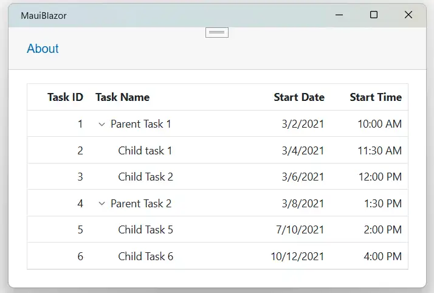
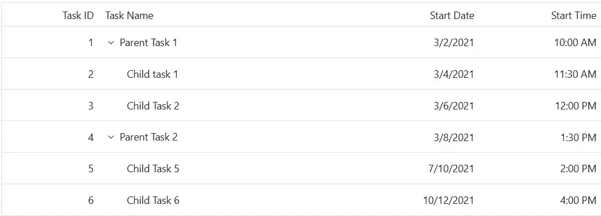

# Getting Started with Blazor Tree Grid in Blazor MAUI App

This section explains you through the step-by-step process of integrating the [Blazor Tree Grid](https://www.syncfusion.com/blazor-components/blazor-tree-grid) component in your Blazor MAUI App using both [Visual Studio](https://visualstudio.microsoft.com/vs/), [Visual Studio Code](https://code.visualstudio.com/) and the [.NET CLI](https://learn.microsoft.com/en-us/dotnet/core/tools/).

## Create a new Blazor MAUI App





Create a Blazor MAUI App using Visual Studio via [Microsoft Templates](https://learn.microsoft.com/en-us/dotnet/maui/get-started/first-app?pivots=devices-windows&view=net-maui-9.0&tabs=vswin). For detailed instructions, refer to the [Blazor MAUI App Getting Started](https://blazor.syncfusion.com/documentation/getting-started/maui-blazor-app) documentation.





Run the following command to create a new Blazor MAUI App.




dotnet new maui-blazor -o MauiBlazorApp
cd MauiBlazorApp




Alternatively, create a **Blazor MAUI App** using Visual Studio Code via [Microsoft Templates](https://learn.microsoft.com/en-us/dotnet/maui/get-started/first-app?pivots=devices-windows&view=net-maui-9.0&tabs=visual-studio-code) or the [Blazor Extension](https://blazor.syncfusion.com/documentation/visual-studio-code-integration/create-project). For detailed instructions, refer to the [Blazor MAUI App Getting Started](https://blazor.syncfusion.com/documentation/getting-started/maui-blazor-app) documentation.





Run the following command to create a new Blazor MAUI App.




dotnet new maui-blazor -o MauiBlazorApp
cd MauiBlazorApp








## Install the required Blazor packages

Install [Syncfusion.Blazor.TreeGrid](https://www.nuget.org/packages/Syncfusion.Blazor.TreeGrid/) and [Syncfusion.Blazor.Themes](https://www.nuget.org/packages/Syncfusion.Blazor.Themes/) NuGet packages. All Syncfusion Blazor packages are available on [nuget.org](https://www.nuget.org/packages?q=syncfusion.blazor). See the [NuGet packages](https://blazor.syncfusion.com/documentation/nuget-packages) topic for details.





1. Go to *Tools → NuGet Package Manager → Manage NuGet Packages for Solution*.
2. Search the required NuGet packages (`Syncfusion.Blazor.TreeGrid` and `Syncfusion.Blazor.Themes`) and install them.

Alternatively, you can install the same packages using the Package Manager Console with the following commands.




Install-Package Syncfusion.Blazor.TreeGrid -Version {{ site.releaseversion }}
Install-Package Syncfusion.Blazor.Themes -Version {{ site.releaseversion }}








Open the terminal and run the following commands.




dotnet add package Syncfusion.Blazor.TreeGrid -v {{ site.releaseversion }}
dotnet add package Syncfusion.Blazor.Themes -v {{ site.releaseversion }}








Open the command prompt and run the following commands.




dotnet add package Syncfusion.Blazor.TreeGrid -v {{ site.releaseversion }}
dotnet add package Syncfusion.Blazor.Themes -v {{ site.releaseversion }}








## Add import namespaces

After the packages are installed, open the **~/Components/_Imports.razor** file and import the `Syncfusion.Blazor` and `Syncfusion.Blazor.TreeGrid` namespaces.




@using Syncfusion.Blazor 
@using Syncfusion.Blazor.TreeGrid




## Register the Blazor service

Open the **MauiProgram.cs** file in Blazor MAUI App and register the Blazor service.




....
using Syncfusion.Blazor;

....

public static class MauiProgram
{
    public static MauiApp CreateMauiApp()
    {
        ....
        builder.Services.AddSyncfusionBlazor();
        ....
    }
}




## Add stylesheet and script resources

The theme stylesheet and script can be accessed from NuGet through [Static Web Assets](https://blazor.syncfusion.com/documentation/appearance/themes#static-web-assets). Include the [stylesheet](https://blazor.syncfusion.com/documentation/appearance/themes) and [script references](https://blazor.syncfusion.com/documentation/common/adding-script-references) in the **~wwwroot/index.html** file.




...
<link href="_content/Syncfusion.Blazor.Themes/fluent2.css" rel="stylesheet" />
...




## Add Blazor Tree Grid component

Open a Razor file located in the **~/Components/Pages/*.razor** (for example, **Home.razor**) and add the [Blazor Tree Grid](https://www.syncfusion.com/blazor-components/blazor-tree-grid) component inside the razor file.




@using Syncfusion.Blazor.TreeGrid;

<SfTreeGrid DataSource="@TreeData" IdMapping="TaskId" ParentIdMapping="ParentId" TreeColumnIndex="1">
    <TreeGridColumns>
        <TreeGridColumn Field="TaskId" HeaderText="Task ID" Width="80" TextAlign="Syncfusion.Blazor.Grids.TextAlign.Right"></TreeGridColumn>
        <TreeGridColumn Field="TaskName" HeaderText="Task Name" Width="160"></TreeGridColumn>
        <TreeGridColumn Field="StartDate" HeaderText="Start Date" Format="d" Type="Syncfusion.Blazor.Grids.ColumnType.DateOnly" Width="152" TextAlign="Syncfusion.Blazor.Grids.TextAlign.Right"></TreeGridColumn>
        <TreeGridColumn Field="StartTime" HeaderText="Start Time" Type="Syncfusion.Blazor.Grids.ColumnType.TimeOnly" Width="100" TextAlign="Syncfusion.Blazor.Grids.TextAlign.Right"></TreeGridColumn>
    </TreeGridColumns>
</SfTreeGrid>

@code {
   public class BusinessObject
    {
        public int TaskId { get; set; }
        public string TaskName { get; set; }
        public DateOnly? StartDate { get; set; }
        public TimeOnly? StartTime { get; set; }
        public int Duration { get; set; }
        public int Progress { get; set; }
        public string Priority { get; set; }
        public int? ParentId { get; set; }
    }

    public List<BusinessObject> TreeData = new List<BusinessObject>();

    protected override void OnInitialized()
    {
        TreeData.Add(new BusinessObject() { TaskId = 1, TaskName = "Parent Task 1", StartDate = new DateOnly(2021, 03, 02), StartTime = new TimeOnly(10, 00, 00), Duration = 10, Progress = 70, ParentId = null, Priority = "High" });
        TreeData.Add(new BusinessObject() { TaskId = 2, TaskName = "Child task 1", StartDate = new DateOnly(2021, 03, 04), StartTime = new TimeOnly(11, 30, 00), Duration = 4, Progress = 80, ParentId = 1, Priority = "Normal" });
        TreeData.Add(new BusinessObject() { TaskId = 3, TaskName = "Child Task 2", StartDate = new DateOnly(2021, 03, 06), StartTime = new TimeOnly(12, 00, 00), Duration = 5, Progress = 65, ParentId = 1, Priority = "Critical" });
        TreeData.Add(new BusinessObject() { TaskId = 4, TaskName = "Parent Task 2", StartDate = new DateOnly(2021, 03, 08), StartTime = new TimeOnly(13, 30, 00), Duration = 6, Progress = 77, ParentId = null, Priority = "Low" });
        TreeData.Add(new BusinessObject() { TaskId = 5, TaskName = "Child Task 5", StartDate = new DateOnly(2021, 07, 10), StartTime = new TimeOnly(14, 00, 00), Duration = 9, Progress = 25, ParentId = 4, Priority = "Normal" });
        TreeData.Add(new BusinessObject() { TaskId = 6, TaskName = "Child Task 6", StartDate = new DateOnly(2021, 10, 12), StartTime = new TimeOnly(16, 00, 00), Duration = 9, Progress = 7, ParentId = 4, Priority = "Normal" });
    }
}




## Run the application on Windows





Press <kbd>Ctrl</kbd>+<kbd>F5</kbd> (Windows) or <kbd>⌘</kbd>+<kbd>F5</kbd> (macOS) to launch the application. The Blazor Tree Grid component will render in your default web browser.





Open the terminal and run the following command.




dotnet run








Open the command prompt and run the following command.




dotnet run








## Run the application on Android

To run the Blazor Tree Grid in your Blazor MAUI app on an Android emulator, follow the steps below.

1. Set up and start the Android emulator. For help, see the [Android Device Manager guide](https://learn.microsoft.com/en-us/dotnet/maui/android/emulator/device-manager#android-device-manager-on-windows).

2. Run your app using the emulator to view the Tree Grid.

N> If you face any issues with the Android emulator, check the [Troubleshooting Android Emulator guide](https://learn.microsoft.com/en-us/dotnet/maui/android/emulator/troubleshooting) for solutions.

## See also

1. [Getting Started with Blazor WebAssembly App](https://blazor.syncfusion.com/documentation/getting-started/blazor-webassembly-dotnet-cli)
2. [Getting Started with Blazor Server App](https://blazor.syncfusion.com/documentation/getting-started/blazor-server-side-visual-studio)