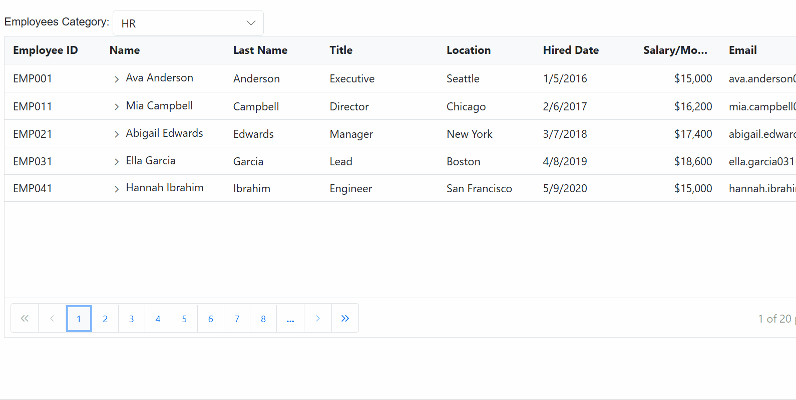
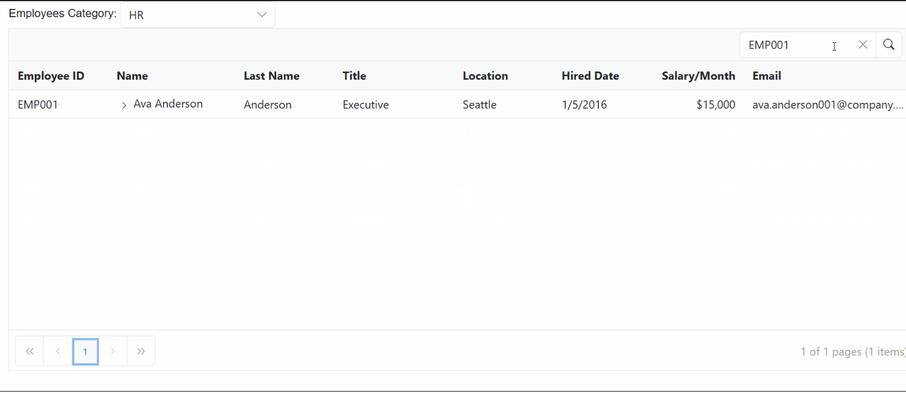
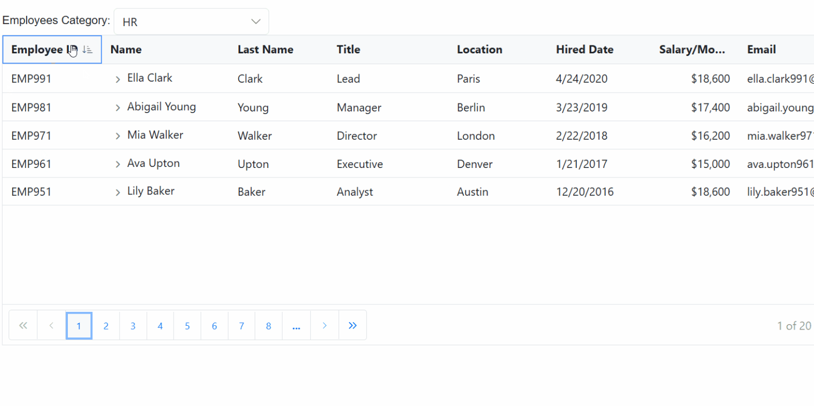
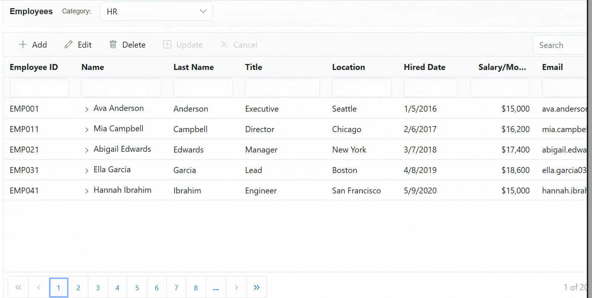

# GraphQL Adaptor in Blazor TreeGrid

GraphQL is a powerful query language for APIs, designed to provide a more efficient alternative to traditional REST APIs. It allows precise fetching of required data, reducing over-fetching and under-fetching. GraphQL provides a flexible and expressive syntax for querying, enabling clients to request only the specific data they require.

Syncfusion’s Blazor TreeGrid  seamlessly integrates with GraphQL servers using the [GraphQLAdaptor](https://help.syncfusion.com/cr/blazor/Syncfusion.Blazor.Data.GraphQLAdaptor.html) in the [`SfDataManager`](https://blazor.syncfusion.com/documentation/data/getting-started-with-web-app). This specialized adaptor simplifies the interaction between the TreeGrid and GraphQL servers, allowing efficient data retrieval with support for data operations like CRUD (Create, Read, Update and Delete), paging, sorting, and filtering.

This section describes a step-by-step process for retrieving data from a GraphQL service using `GraphQLAdaptor`, then binding it to the TreeGrid to facilitate data and CRUD operations.

## Configure a GraphQL server

To configure a GraphQL server using Hot Chocolate with the Syncfusion<sup style="font-size:70%">&reg;</sup> Blazor TreeGrid, follow these steps:

**Step 1: Create a new ASP.NET Core application**

- Open Visual Studio and select **Create a new project**.
- Choose **ASP.NET Core Web App** and name the project `GraphQLServer`.
- Alternatively, create the project using a terminal or command prompt:
    ```bash
    dotnet new web -n GraphQLServer
    ```
- Navigate to the project directory:
    ```bash
    cd GraphQLServer
    ```

**Step 2: Add the Hot Chocolate NuGet package**

- Open the **NuGet Package Manager** by right-clicking on the project in the **Solution Explorer** and selecting **Manage NuGet Packages**.
- Go to the **Browse** tab, search for `HotChocolate.AspNetCore`, and select the package.
- Click **Install** to add the package to the project.

Alternatively, the **Package Manager Console** can be used to install the package by running the following command:

```powershell
Install-Package HotChocolate.AspNetCore
```

**Step 3: Create a model class**

Add a new folder named **Models**. Then, add a model class named **EmployeeData.cs** in the **Models** folder to represent the employee data.




using System.Text.Json.Serialization;

namespace GraphQLServer.Models
{
    public class EmployeeData
    {
        [GraphQLName("employeeID")]
        public string EmployeeID { get; set; } = default!; // EMP001, EMP002, ...

        [GraphQLName("firstName")]
        public string? FirstName { get; set; }

        [GraphQLName("lastName")]
        public string? LastName { get; set; }

        [GraphQLName("title")]
        public string? Title { get; set; }

        // Parent reference as EMP###
        [GraphQLName("managerID")]
        public string? ManagerID { get; set; }

        [GraphQLName("hasChild")]
        public bool HasChild { get; set; }

        [GraphQLName("name")]
        public string? Name { get; set; }

        [GraphQLName("location")]
        public string? Location { get; set; }

        [GraphQLName("dateJoined")]
        public DateTime? DateJoined { get; set; }

        [GraphQLName("salaryPerMonth")]
        public decimal? SalaryPerMonth { get; set; }

        [GraphQLName("email")]
        public string? Email { get; set; }

        [GraphQLName("projectDetails")]
        public string? ProjectDetails { get; set; }

        [GraphQLName("projectStatus")]
        public string? ProjectStatus { get; set; }

        [GraphQLName("priority")]
        public string? Priority { get; set; } // Low, Medium, High, Critical

        [GraphQLName("progress")]
        public int? Progress { get; set; } // 0..100

        [GraphQLName("projectStartDate")]
        public DateTime? ProjectStartDate { get; set; }

        [GraphQLName("projectEndDate")]
        public DateTime? ProjectEndDate { get; set; }

        [GraphQLName("projectId")]
        public string? ProjectId { get; set; } // PRJ001 ...

        private static readonly object _sync = new();
        private static List<EmployeeData>? _store;

        private static string EmpId(int n) => $"EMP{n:000}";
        private static string PrjId(int n) => $"PRJ{n:000}";

        // Name pools (48 * 32 = 1536 unique full-name combinations)
        private static readonly string[] FirstNames =
        {
            "Ava","Liam","Olivia","Noah","Emma","Elijah","Sophia","Lucas","Isabella","Mason",
            "Mia","James","Amelia","Benjamin","Charlotte","Ethan","Harper","Henry","Evelyn","Alexander",
            "Abigail","Michael","Emily","Daniel","Elizabeth","Logan","Sofia","Jackson","Avery","Sebastian",
            "Ella","Jack","Scarlett","Aiden","Grace","Owen","Chloe","Samuel","Lily","Matthew",
            "Hannah","Joseph","Victoria","Levi","Aria","David","Nora","Wyatt"
        };

        private static readonly string[] LastNames =
        {
            "Anderson","Baker","Campbell","Diaz","Edwards","Foster","Garcia","Harris","Ibrahim","Johnson",
            "Kim","Lopez","Miller","Nguyen","Owens","Patel","Quinn","Rodriguez","Smith","Turner",
            "Upton","Vasquez","Walker","Xu","Young","Zimmerman","Clark","Parker","Carter","Howard",
            "Brooks","Murphy"
        };

        // Simple, non‑technical project names (short and clear)
        private static readonly string[] SimpleProjectNames =
        {
            "Website Redesign",
            "Online Store",
            "Customer Portal",
            "Employee Portal",
            "Help Center",
            "Booking System",
            "Payment System",
            "Inventory Tracker",
            "Order Tracker",
            "Reporting Dashboard",
            "Mobile App",
            "Chat Support",
            "Email Notices",
            "File Sharing",
            "Maps & Locations",
            "Video Library",
            "Search Tool",
            "Survey Tool",
            "Learning Portal",
            "HR System",
            "Scheduling App",
            "Billing & Invoices",
            "Ticket System",
            "News & Blog",
            "Profile Manager",
            "Settings Panel",
            "Theme Builder",
            "Docs Site",
            "Admin Dashboard",
            "Data Import",
            "Data Export",
            "Backup Service",
            "Alerts Center",
            "Task Manager",
            "Calendar",
            "Feedback Board",
            "Onboarding Guide"
        };

        // Scrambled unique full name for index n (1-based)
        private static (string first, string last, string full) UniquePersonName(int n)
        {
            int idx = n - 1; // zero-based
            int F = FirstNames.Length;
            int L = LastNames.Length;

            int i = idx % F;          // first-name index cycles fastest
            int q = idx / F;          // advances every F items
            int j = (q + 13 * i) % L; // interleave last names to avoid blocks

            string first = FirstNames[i];
            string last = LastNames[j];
            return (first, last, $"{first} {last}");
        }

        // Pick a short, clear project name
        private static string ProjectName(int n)
        {
            // Use a stride to mix names; wraps automatically
            return SimpleProjectNames[(n * 5) % SimpleProjectNames.Length];
        }

        // Parent + Children only (no grandchildren)
        public static List<EmployeeData> GetAllRecords()
        {
            if (_store != null) return _store;

            lock (_sync)
            {
                if (_store != null) return _store;

                var list = new List<EmployeeData>();
                int next = 0; // sequential counter for EMP ids

                string[] locations = { "Seattle", "Chicago", "New York", "Boston", "San Francisco", "Austin", "Denver", "London", "Berlin", "Paris" };
                string[] priorities = { "Low", "Medium", "High", "Critical" };
                string[] statuses = { "Open", "In Progress", "Started", "Validated", "Closed" };
                string[] titles = { "Executive", "Director", "Manager", "Lead", "Engineer", "Analyst" };

                int rootCount = 100;        // number of parents
                int childrenPerRoot = 9;    // children per parent

                for (int r = 0; r < rootCount; r++)
                {
                    string rootPriority = (r % 3) switch { 0 => "High", 1 => "Critical", _ => "Medium" };
                    string rootStatus = (r % 2 == 0) ? "Open" : "In Progress";

                    var rootEmpId = EmpId(++next);
                    var rootName = UniquePersonName(next);

                    var root = new EmployeeData
                    {
                        EmployeeID = rootEmpId,
                        FirstName = rootName.first,
                        LastName = rootName.last,
                        Name = rootName.full,
                        Title = titles[r % titles.Length],
                        ManagerID = null,
                        HasChild = true,
                        Location = locations[r % locations.Length],
                        DateJoined = new DateTime(2016 + (r % 5), 1 + (r % 12), 5 + (r % 20)),
                        SalaryPerMonth = 15000 + (r % 4) * 1200,
                        Email = $"{rootName.first.ToLower()}.{rootName.last.ToLower()}{next:000}@company.com",
                        ProjectDetails = ProjectName(next),
                        ProjectStatus = rootStatus,
                        Priority = rootPriority,
                        Progress = 60 + (r * 7) % 41,
                        ProjectStartDate = new DateTime(2024, 1 + (r % 6), 1 + (r % 28)),
                        ProjectEndDate = new DateTime(2025, 1 + ((r + 6) % 12), 1 + (r % 28)),
                        ProjectId = PrjId(next)
                    };
                    list.Add(root);

                    // Children
                    for (int c = 0; c < childrenPerRoot; c++)
                    {
                        string childPriority = priorities[(c + r) % priorities.Length];
                        string childStatus = statuses[(c + r) % statuses.Length];

                        var childEmpId = EmpId(++next);
                        var childName = UniquePersonName(next);

                        var child = new EmployeeData
                        {
                            EmployeeID = childEmpId,
                            FirstName = childName.first,
                            LastName = childName.last,
                            Name = childName.full,
                            Title = (c % 2 == 0) ? "Manager" : "Lead",
                            ManagerID = rootEmpId,
                            HasChild = false,
                            Location = locations[(r + c + 1) % locations.Length],
                            DateJoined = new DateTime(2018 + (c % 5), 1 + ((c + 2) % 12), 1 + ((c + 5) % 28)),
                            SalaryPerMonth = 8500 + (c % 6) * 700,
                            Email = $"{childName.first.ToLower()}.{childName.last.ToLower()}{next:000}@company.com",
                            ProjectDetails = ProjectName(next),
                            ProjectStatus = childStatus,
                            Priority = childPriority,
                            Progress = (c * 13) % 101,
                            ProjectStartDate = DateTime.Today.AddDays(-(c % 200)),
                            ProjectEndDate = DateTime.Today.AddDays((c % 200) + 30),
                            ProjectId = PrjId(next)
                        };
                        list.Add(child);
                    }
                }

                var parentsWithChildren = list
                    .Where(e => !string.IsNullOrWhiteSpace(e.ManagerID))
                    .Select(e => e.ManagerID!)
                    .Distinct(StringComparer.OrdinalIgnoreCase)
                    .ToHashSet(StringComparer.OrdinalIgnoreCase);

                foreach (var e in list)
                    e.HasChild = parentsWithChildren.Contains(e.EmployeeID);

                _store = list;
                return _store;
            }
        }
    }
}




**Step 4: Define the GraphQL query**

Create a **GraphQLQuery** class to define the query resolver for fetching employee data. This class will handle the logic for retrieving data from the **EmployeeData** model. The following code demonstrates the `DataManagerRequestInput` class, which is passed as an argument to the resolver function.




using GraphQLServer.Models;

/// <summary>
/// Represents the GraphQL query resolver for fetching employee data.
/// </summary>
public class GraphQLQuery
{
   // SINGLE ENTRYPOINT: handles roots, children, expand/collapse, expandall, loadchildondemand, filtering, search, sort, paging
    public EmployeesDataResponse EmployeesData(DataManagerRequestInput dataManager)
    {
        EnsureDataLoaded();

        // Parent detection (params first, then ManagerID== in where)
        string? parentId = TryGetParentIdFromParams(dataManager?.Params)
                        ?? TryGetParentIdFromWhere(dataManager?.Where);

        // CHILDREN SLICE: return only direct children of requested parent
        if (!string.IsNullOrWhiteSpace(parentId))
        {
            var children = _data
                .Where(d => string.Equals(d.ManagerID, parentId, StringComparison.OrdinalIgnoreCase))
                .ToList();

            return new EmployeesDataResponse
            {
                Count = children.Count,
                Result = children,
                Items = children
            };
        }

        // ROOTS: proper root-only paging
        var roots = _data.Where(d => string.IsNullOrWhiteSpace(d.ManagerID)).ToList();
        int total = roots.Count;

        IEnumerable<EmployeeData> page = roots;
        if (dataManager?.Skip is int sk && dataManager.Take is int tk)
        {
            page = page.Skip(sk).Take(tk);
        }

        var list = page.ToList();
        return new EmployeesDataResponse
        {
            Count = total,
            Result = list,
            Items = list
        };
    }

    private static List<EmployeeData> _data = EnsureDataInternal();

    private static List<EmployeeData> EnsureDataInternal() => EmployeeData.GetAllRecords();

    private static void EnsureDataLoaded()
    {
        if (_data == null || _data.Count == 0) _data = EnsureDataInternal();
    }

    private static string? TryGetParentIdFromParams(object? prms)
    {
        if (!TryReadFromParams(prms, "parentId", out var v) || v is null) return null;
        return ToEmpId(v);
    }

    private static bool TryReadFromParams(object? prms, string key, out object? value)
    {
        value = null;
        if (prms == null) return false;

        // IDictionary<string, object>
        if (prms is IDictionary<string, object> dictObj)
            return dictObj.TryGetValue(key, out value);

        // IReadOnlyDictionary<string, object>
        if (prms is IReadOnlyDictionary<string, object> roDict)
            return roDict.TryGetValue(key, out value);

        // IDictionary<string, JsonElement>
        if (prms is IDictionary<string, JsonElement> dictJson)
        {
            if (dictJson.TryGetValue(key, out var je)) { value = je; return true; }
            return false;
        }

        // IEnumerable<KeyValuePair<string, object>>
        if (prms is IEnumerable<KeyValuePair<string, object>> kvs)
        {
            foreach (var kv in kvs)
                if (string.Equals(kv.Key, key, StringComparison.OrdinalIgnoreCase))
                { value = kv.Value; return true; }
        }

        // JsonElement object
        if (prms is JsonElement jeObj && jeObj.ValueKind == JsonValueKind.Object)
        {
            if (jeObj.TryGetProperty(key, out var je))
            { value = je; return true; }
        }

        return false;
    }

    private static string? TryGetParentIdFromWhere(List<WhereFilter>? where)
    {
        if (where == null || where.Count == 0) return null;

        foreach (var wf in where)
        {
            if (!string.IsNullOrWhiteSpace(wf.Field) &&
                wf.Field.Equals("ManagerID", StringComparison.OrdinalIgnoreCase))
            {
                var op = (wf.Operator ?? "equal").Trim().ToLowerInvariant();
                if (op is "equal" or "eq")
                {
                    if (wf.Value == null) return null;
                    return ToEmpId(wf.Value);
                }
            }

            if (wf.Predicates != null && wf.Predicates.Count > 0)
            {
                var nested = TryGetParentIdFromWhere(wf.Predicates);
                if (nested != null || wf.Value == null) return nested;
            }
        }
        return null;
    }

    private static string? ToEmpId(object? v)
    {
        if (v == null) return null;
        if (v is string s)
        {
            if (int.TryParse(s, out var n)) return $"EMP{n:000}";
            return s;
        }
        if (v is int i) return $"EMP{i:000}";
        if (v is long l && l >= int.MinValue && l <= int.MaxValue) return $"EMP{(int)l:000}";
        if (v is JsonElement je)
        {
            return je.ValueKind switch
            {
                JsonValueKind.Number => je.TryGetInt32(out var j) ? $"EMP{j:000}" : null,
                JsonValueKind.String => int.TryParse(je.GetString(), out var k) ? $"EMP{k:000}" : je.GetString(),
                JsonValueKind.Null => null,
                _ => null
            };
        }
        return v.ToString();
    }
}

// Response type
public class EmployeesDataResponse
{
    [GraphQLName("count")]
    public int Count { get; set; }

    [GraphQLName("result")]
    public List<EmployeeData> Result { get; set; } = new();

    [GraphQLName("items")]
    public List<EmployeeData> Items { get; set; } = new();
}





namespace GraphQLServer.Models
{
    /// <summary>
    /// Represents the input structure for data manager requests.
    /// </summary>
    public class DataManagerRequestInput
    {
        [GraphQLName("Skip")]
        public int Skip { get; set; }

        [GraphQLName("Take")]
        public int Take { get; set; }

        [GraphQLName("RequiresCounts")]
        public bool RequiresCounts { get; set; } = false;

        [GraphQLName("Params")]
        [GraphQLType(typeof(AnyType))]
        public IDictionary<string, object> Params { get; set; }

        [GraphQLName("Aggregates")]
        [GraphQLType(typeof(AnyType))]
        public List<Aggregate>? Aggregates { get; set; }

        [GraphQLName("Search")]
        public List<SearchFilter>? Search { get; set; }

        [GraphQLName("Sorted")]
        public List<Sort>? Sorted { get; set; }

        [GraphQLName("Where")]
        [GraphQLType(typeof(AnyType))]
        public List<WhereFilter>? Where { get; set; }

        [GraphQLName("Group")]
        public List<string>? Group { get; set; }

        [GraphQLName("antiForgery")]
        public string? antiForgery { get; set; }

        [GraphQLName("Table")]
        public string? Table { get; set; }

        [GraphQLName("IdMapping")]
        public string? IdMapping { get; set; }

        [GraphQLName("Select")]
        public List<string>? Select { get; set; }

        [GraphQLName("Expand")]
        public List<string>? Expand { get; set; }

        [GraphQLName("Distinct")]
        public List<string>? Distinct { get; set; }

        [GraphQLName("ServerSideGroup")]
        public bool? ServerSideGroup { get; set; }

        [GraphQLName("LazyLoad")]
        public bool? LazyLoad { get; set; }

        [GraphQLName("LazyExpandAllGroup")]
        public bool? LazyExpandAllGroup { get; set; }
    }

    /// <summary>
    /// Represents an aggregate operation in the data manager request.
    /// </summary>
    public class Aggregate
    {
        [GraphQLName("Field")]
        public string Field { get; set; }

        [GraphQLName("Type")]
        public string Type { get; set; }
    }

    /// <summary>
    /// Represents a search filter in the data manager request.
    /// </summary>
    public class SearchFilter
    {
        [GraphQLName("Fields")]
        public List<string> Fields { get; set; }

        [GraphQLName("Key")]
        public string Key { get; set; }

        [GraphQLName("Operator")]
        public string Operator { get; set; }

        [GraphQLName("IgnoreCase")]
        public bool IgnoreCase { get; set; }

        [GraphQLName("IgnoreAccent")]
        public bool? IgnoreAccent { get; set; }
    }

    /// <summary>
    /// Represents a sorting operation in the data manager request.
    /// </summary>
    public class Sort
    {
        [GraphQLName("Name")]
        public string Name { get; set; }

        [GraphQLName("Direction")]
        public string Direction { get; set; }

        [GraphQLName("Comparer")]
        [GraphQLType(typeof(AnyType))]
        public object Comparer { get; set; }
    }

    /// <summary>
    /// Represents a filter condition in the data manager request.
    /// </summary>
    public class WhereFilter
    {
        [GraphQLName("Field")]
        public string? Field { get; set; }

        [GraphQLName("IgnoreCase")]
        public bool? IgnoreCase { get; set; }

        [GraphQLName("IgnoreAccent")]
        public bool? IgnoreAccent { get; set; }

        [GraphQLName("IsComplex")]
        public bool? IsComplex { get; set; }

        [GraphQLName("Operator")]
        public string? Operator { get; set; }

        [GraphQLName("Condition")]
        public string? Condition { get; set; }

        [GraphQLName("Value")]
        [GraphQLType(typeof(AnyType))]
        public object? Value { get; set; }

        [GraphQLName("predicates")]
        public List<WhereFilter>? predicates { get; set; }
    }
}




**Step 5: Configure the GraphQL server**

Update the **Program.cs** file to configure the GraphQL server. This configuration ensures that the server can handle GraphQL requests effectively.




var builder = WebApplication.CreateBuilder(args);

// Register GraphQL services.
builder.Services.AddGraphQLServer()
    .AddQueryType<GraphQLQuery>();

var app = builder.Build();

// Use routing middleware.
app.UseRouting();

// Map endpoints.
app.MapGet("/", () => "Hello, World!");
app.MapGraphQL(); // Maps the /graphql endpoint by default.

app.Run();




**Step 6: Test the GraphQL endpoint**

To verify that the GraphQL server is functioning correctly, use the following example query in a GraphQL client or playground:

```
{
   employeesData(dataManager: $dataManager) {
      count
      result {
        employeeID
        managerID
        hasChild
        name
        lastName
        title
        location
        dateJoined
        salaryPerMonth
        email
      }
}
```

This query will return the total count of employee data. Ensure the server is running and accessible at `http://localhost:xxxx/graphql` before testing. Here, **xxxx** represents the port number.

For more details, refer to the [Hot Chocolate documentation](https://chillicream.com/docs/hotchocolate).

## Connecting Syncfusion<sup style="font-size:70%">&reg;</sup> Blazor TreeGrid to an GraphQL service
 
To integrate the Syncfusion<sup style="font-size:70%">&reg;</sup> Blazor TreeGrid into a project using Visual Studio, follow the steps below:

**Step 1: Create a Blazor Web App**

Create a **Blazor Web App** named **TreeGrid** using Visual Studio. Either [Microsoft Templates](https://learn.microsoft.com/en-us/aspnet/core/blazor/tooling?view=aspnetcore-8.0) or the [Syncfusion<sup style="font-size:70%">&reg;</sup> Blazor Extension](https://blazor.syncfusion.com/documentation/visual-studio-integration/template-studio) can be used. Configure the appropriate [interactive render mode](https://learn.microsoft.com/en-us/aspnet/core/blazor/components/render-modes?view=aspnetcore-8.0#render-modes) and [interactivity location](https://learn.microsoft.com/en-us/aspnet/core/blazor/tooling?view=aspnetcore-8.0&pivots=windows).

**Step 2: Install Syncfusion<sup style="font-size:70%">&reg;</sup> Blazor TreeGrid and Themes NuGet packages**

To add the Syncfusion<sup style="font-size:70%">&reg;</sup> Blazor TreeGrid to an application, open the NuGet Package Manager in Visual Studio (*Tools → NuGet Package Manager → Manage NuGet Packages for Solution*). Search for and install the following packages:

- [Syncfusion.Blazor.TreeGrid](https://www.nuget.org/packages/Syncfusion.Blazor.TreeGrid/)
- [Syncfusion.Blazor.Themes](https://www.nuget.org/packages/Syncfusion.Blazor.Themes/)

If a Blazor Web App uses WebAssembly or Auto (Server and WebAssembly) render modes, the following packages must be installed in the client project:

Alternatively, use the following Package Manager commands:

```powershell
Install-Package Syncfusion.Blazor.TreeGrid -Version {{ site.releaseversion }}
Install-Package Syncfusion.Blazor.Themes -Version {{ site.releaseversion }}
```

> Syncfusion<sup style="font-size:70%">&reg;</sup> Blazor components are available on [nuget.org](https://www.nuget.org/packages?q=syncfusion.blazor). Refer to the [NuGet packages](https://blazor.syncfusion.com/documentation/nuget-packages) topic for a complete list of available packages.

**Step 3: Register Syncfusion<sup style="font-size:70%">&reg;</sup> Blazor service**

- Open the **~/_Imports.razor** file and import the required namespaces:

```cs
@using Syncfusion.Blazor
@using Syncfusion.Blazor.Grids
@using Syncfusion.Blazor.TreeGrid
@using Syncfusion.Blazor.Data
```

- Register the Syncfusion<sup style="font-size:70%">&reg;</sup> Blazor service in the **~/Program.cs** file:

```csharp
using Syncfusion.Blazor;

builder.Services.AddSyncfusionBlazor();
```

For apps using WebAssembly or Auto (Server and WebAssembly) render modes, register the service in both **~/Program.cs** files.

**Step 4: Add stylesheet and script resources**

Include the theme stylesheet and script references in the **~/Components/App.razor** file:

```html
<head>
    ...
    <link href="_content/Syncfusion.Blazor.Themes/bootstrap5.css" rel="stylesheet" />
</head>
...
<body>
    ...
    <script src="_content/Syncfusion.Blazor.Core/scripts/syncfusion-blazor.min.js" type="text/javascript"></script>
</body>
```

> - Refer to the [Blazor Themes](https://blazor.syncfusion.com/documentation/appearance/themes) topic for various methods to include themes (e.g., Static Web Assets, CDN, or CRG).
- Set the rendermode to **InteractiveServer** or **InteractiveAuto** in the Blazor Web App configuration.

**Step 5: Add Blazor TreeGrid and Configure with server**

To bind GraphQL service data to the TreeGrid, provide the GraphQL query string using the [Query](https://help.syncfusion.com/cr/blazor/Syncfusion.Blazor.Data.GraphQLAdaptorOptions.html#Syncfusion_Blazor_Data_GraphQLAdaptorOptions_Query) property of the [GraphQLAdaptorOptions](https://help.syncfusion.com/cr/blazor/Syncfusion.Blazor.Data.GraphQLAdaptorOptions.html). Additionally, set the [ResolverName](https://help.syncfusion.com/cr/blazor/Syncfusion.Blazor.Data.GraphQLAdaptorOptions.html#Syncfusion_Blazor_Data_GraphQLAdaptorOptions_ResolverName) property to map the response. The `GraphQLAdaptor` expects the response as a JSON object with properties **Result**, **Count**, and **Aggregates**, which contain the collection of entities, total number of records, and aggregate values, respectively. The GraphQL response should be returned in JSON format like **{ "data": { ... } }** with the query name as the field.




@rendermode InteractiveServer
@using Syncfusion.Blazor
@using Syncfusion.Blazor.Data
@using Syncfusion.Blazor.Grids
@using Syncfusion.Blazor.TreeGrid
@using Syncfusion.Blazor.DropDowns
@using Syncfusion.Blazor.Calendars
@using System.Text.Json.Serialization

<div class="page-wrap">
    <div class="toolbar">
        <span class="toolbar-title">Employees</span>
        <span class="label">Category:</span>

        <SfDropDownList TValue="string"
                        TItem="DropDownData"
                        Width="220px"
                        DataSource="@CategoryOptions"
                        @bind-Value="@SelectedCategory">
            <DropDownListEvents TValue="string" TItem="DropDownData" ValueChange="ModeChange" />
            <DropDownListFieldSettings Text="Name" Value="ID" />
        </SfDropDownList>
    </div>

    <SfTreeGrid @ref="tree"
                TValue="EmployeeData"
                IdMapping="EmployeeID"
                ParentIdMapping="ManagerID"
                HasChildMapping="HasChild"
                TreeColumnIndex="@treeindex"
                Height="340"
                RowHeight="40"
                AllowPaging="true">
                <SfDataManager Url="https://localhost:xxxx/graphql/"
                       Adaptor="Adaptors.GraphQLAdaptor"
                       GraphQLAdaptorOptions="@adaptorOptions">
                </SfDataManager>
        <TreeGridPageSettings PageSize="5"></TreeGridPageSettings>
        <TreeGridColumns>
            <TreeGridColumn Field="EmployeeID" HeaderText="Employee ID" IsPrimaryKey="true" Width="140" Visible="@showHRColumns" />
            <TreeGridColumn Field="ProjectId" HeaderText="Project ID" Width="120" Visible="@showPMColumns" TextAlign="TextAlign.Center" />
            <TreeGridColumn Field="ProjectDetails" HeaderText="Project Details" Width="240" Visible="@showPMColumns" />
            <TreeGridColumn Field="Name" HeaderText="@headerName" Width="180" />
            <TreeGridColumn Field="LastName" HeaderText="Last Name" Width="140" Visible="@showHRColumns" />
            <TreeGridColumn Field="Title" HeaderText="Title" Width="170" Visible="@showHRColumns" />
            <TreeGridColumn Field="Location" HeaderText="Location" Width="140" Visible="@showHRColumns" />
            <TreeGridColumn Field="DateJoined" HeaderText="Hired Date" Type="ColumnType.Date" Format="d" Width="130" Visible="@showHRColumns" />
            <TreeGridColumn Field="SalaryPerMonth" HeaderText="Salary/Month" Type="ColumnType.Integer" Format="C0" Width="140" TextAlign="TextAlign.Right" Visible="@showHRColumns" />

            <!-- Priority with subtle, matte chips -->
            <TreeGridColumn Field="Priority" HeaderText="Priority" Width="150" Visible="@showPMColumns" TextAlign="TextAlign.Center">
                <Template>
                    @{
                        var e = (EmployeeData)context;
                        var p = (e.Priority ?? "Low").Trim().ToLowerInvariant();
                        var cls = p switch
                        {
                            "critical" => "chip chip-critical",
                            "high" => "chip chip-high",
                            "medium" => "chip chip-medium",
                            _ => "chip chip-low"
                        };
                        var label = string.IsNullOrWhiteSpace(e.Priority) ? "Low" : e.Priority!;
                    }
                    <span class="@cls" aria-label="Priority @label">@label</span>
                </Template>
            </TreeGridColumn>

            <!-- Progress bar like screenshot -->
            <TreeGridColumn Field="Progress" HeaderText="Progress" Width="220" Visible="@showPMColumns" TextAlign="TextAlign.Left">
                <Template>
                    @{
                        var e = (EmployeeData)context;
                        var pct = Math.Clamp(e.Progress ?? 0, 0, 100);
                        var barClass = pct >= 80 ? "progress-bar prog-high"
                        : pct >= 50 ? "progress-bar prog-mid"
                        : "progress-bar prog-low";
                    }
                    <div class="progress-row" role="group" aria-label="Progress">
                        <div class="progress-wrap" role="progressbar" aria-valuemin="0" aria-valuemax="100" aria-valuenow="@pct">
                            <div class="@barClass" style="width:@pct%"></div>
                        </div>
                        <span class="progress-text">@pct%</span>
                    </div>
                </Template>
            </TreeGridColumn>

            <TreeGridColumn Field="ProjectStatus" HeaderText="Status" Width="130" Visible="@showPMColumns" />
            <TreeGridColumn Field="ProjectStartDate" HeaderText="Start Date" Type="ColumnType.Date" Format="d" Width="130" Visible="@showPMColumns" />
            <TreeGridColumn Field="ProjectEndDate" HeaderText="End Date" Type="ColumnType.Date" Format="d" Width="130" Visible="@showPMColumns" />
            <TreeGridColumn Field="Email" HeaderText="Email" Width="240" Visible="@showEmail" />
        </TreeGridColumns>
    </SfTreeGrid>
</div>

@code {
    // - Replace https://localhost:xxxx/graphql with the actual server port.

    public class DropDownData { public string ID { get; set; } = ""; public string Name { get; set; } = ""; }

    private readonly List<DropDownData> CategoryOptions = new()
  {
    new() { ID = "HR", Name = "HR" },
    new() { ID = "PM", Name = "Project Management" }
  };

    public bool expandState { get; set; }
    private string SelectedCategory { get; set; } = "HR";
    private int treeindex { get; set; } = 3;
    private bool showHRColumns = true;
    private bool showPMColumns = false;
    private bool showEmail = true;
    public string headerName { get; set; } = "Name";
    private SfTreeGrid<EmployeeData>? tree;

    // Revert to ONLY $dataManager; server reads TreeGrid flags from dataManager.Params
    private const string HrQuery = @"
    query employeesData($dataManager: DataManagerRequestInput!) {
      employeesData(dataManager: $dataManager) {
        count
        result {
          employeeID
          managerID
          hasChild
          name
          lastName
          title
          location
          dateJoined
          salaryPerMonth
          email
        }
      }
    }";

    private const string PmQuery = @"
    query employeesData($dataManager: DataManagerRequestInput!) {
      employeesData(dataManager: $dataManager) {
        count
        result {
          employeeID
          managerID
          hasChild
          name
          projectId
          projectDetails
          projectStatus
          priority
          progress
          projectStartDate
          projectEndDate
        }
      }
    }";

    private GraphQLAdaptorOptions adaptorOptions = new GraphQLAdaptorOptions
    {
        Query = HrQuery,
        // ResolverName should match the GraphQL field name (camelCase)
        
        ResolverName = "employeesData"
    };

    private async Task ModeChange(ChangeEventArgs<string, DropDownData> args)
    {
        SelectedCategory = args?.Value ?? "HR";
        if (SelectedCategory == "PM")
        {
            adaptorOptions.Query = PmQuery;
            showHRColumns = false; showPMColumns = true; treeindex = 1;
            showEmail = false;
            headerName = "Assigned To";
        }
        else
        {
            adaptorOptions.Query = HrQuery;
            showHRColumns = true; showPMColumns = false; treeindex = 3;
            showEmail = true;
            headerName = "Name";
            if (tree is not null) await tree.ClearFilteringAsync();
        }
        await tree.CallStateHasChangedAsync();
    }

    public class EmployeeData
    {
        [JsonPropertyName("employeeID")] public string EmployeeID { get; set; } = "";
        [JsonPropertyName("managerID")] public string? ManagerID { get; set; }
        [JsonPropertyName("hasChild")] public bool HasChild { get; set; }
        [JsonPropertyName("name")] public string? Name { get; set; }
        [JsonPropertyName("lastName")] public string? LastName { get; set; }
        [JsonPropertyName("title")] public string? Title { get; set; }
        [JsonPropertyName("location")] public string? Location { get; set; }
        [JsonPropertyName("dateJoined")] public DateTime? DateJoined { get; set; }
        [JsonPropertyName("salaryPerMonth")] public decimal? SalaryPerMonth { get; set; }
        [JsonPropertyName("email")] public string? Email { get; set; }
        [JsonPropertyName("projectId")] public string? ProjectId { get; set; }
        [JsonPropertyName("projectDetails")] public string? ProjectDetails { get; set; }
        [JsonPropertyName("projectStatus")] public string? ProjectStatus { get; set; }
        [JsonPropertyName("priority")] public string? Priority { get; set; }
        [JsonPropertyName("progress")] public int? Progress { get; set; }
        [JsonPropertyName("projectStartDate")] public DateTime? ProjectStartDate { get; set; }
        [JsonPropertyName("projectEndDate")] public DateTime? ProjectEndDate { get; set; }
    }
}




Replace `https://localhost:xxxx/graphql` with the actual URL of the API endpoint that provides data in a consumable format (e.g., JSON).

**Step 6: Enable CORS Policy**

To allow a Blazor application to access the GraphQL server, Cross-Origin Resource Sharing (CORS) must be enabled in the server application. Add the following code to the **Program.cs** file:

```csharp
// Add CORS policy
builder.Services.AddCors(options =>
{
    options.AddPolicy("AllowSpecificOrigin", policy =>
    {
        // Replace with the Blazor app's URL.
        policy.WithOrigins("https://localhost:xxxx/") 
              .AllowAnyHeader()
              .AllowAnyMethod()
              .AllowCredentials();
    });
});

// Use CORS.
app.UseCors("AllowSpecificOrigin");
```

This configuration ensures that the Blazor application can communicate with the GraphQL server without encountering CORS-related issues.

**Step 7: Run the Application**

After completing the setup, run the application. The TreeGrid will fetch and display data from the configured GraphQL API. Ensure that both the Blazor application and the GraphQL server are running and accessible.
 


**Understanding DataManagerRequestInput Class**

Before performing specific data operations such as search, sorting, or filtering, it is essential to understand the request structure that the Syncfusion<sup style="font-size:70%">&reg;</sup> Blazor TreeGrid sends to the GraphQL server.

The following code demonstrates the `DataManagerRequestInput` class, which encapsulates parameters such as pagination (Skip, Take), search filters (Search), sorting (Sorted), and more. These parameters are passed as arguments to the resolver function for processing.




namespace GraphQLServer.Models
{
    /// <summary>
    /// Represents the input structure for data manager requests.
    /// </summary>
    public class DataManagerRequestInput
    {
        [GraphQLName("Skip")]
        public int Skip { get; set; }

        [GraphQLName("Take")]
        public int Take { get; set; }

        [GraphQLName("RequiresCounts")]
        public bool RequiresCounts { get; set; } = false;

        [GraphQLName("Params")]
        [GraphQLType(typeof(AnyType))]
        public IDictionary<string, object> Params { get; set; }

        [GraphQLName("Aggregates")]
        [GraphQLType(typeof(AnyType))]
        public List<Aggregate>? Aggregates { get; set; }

        [GraphQLName("Search")]
        public List<SearchFilter>? Search { get; set; }

        [GraphQLName("Sorted")]
        public List<Sort>? Sorted { get; set; }

        [GraphQLName("Where")]
        [GraphQLType(typeof(AnyType))]
        public List<WhereFilter>? Where { get; set; }

        [GraphQLName("Group")]
        public List<string>? Group { get; set; }

        [GraphQLName("antiForgery")]
        public string? antiForgery { get; set; }

        [GraphQLName("Table")]
        public string? Table { get; set; }

        [GraphQLName("IdMapping")]
        public string? IdMapping { get; set; }

        [GraphQLName("Select")]
        public List<string>? Select { get; set; }

        [GraphQLName("Expand")]
        public List<string>? Expand { get; set; }

        [GraphQLName("Distinct")]
        public List<string>? Distinct { get; set; }

        [GraphQLName("ServerSideGroup")]
        public bool? ServerSideGroup { get; set; }

        [GraphQLName("LazyLoad")]
        public bool? LazyLoad { get; set; }

        [GraphQLName("LazyExpandAllGroup")]
        public bool? LazyExpandAllGroup { get; set; }
    }

    /// <summary>
    /// Represents an aggregate operation in the data manager request.
    /// </summary>
    public class Aggregate
    {
        [GraphQLName("Field")]
        public string Field { get; set; }

        [GraphQLName("Type")]
        public string Type { get; set; }
    }

    /// <summary>
    /// Represents a search filter in the data manager request.
    /// </summary>
    public class SearchFilter
    {
        [GraphQLName("Fields")]
        public List<string> Fields { get; set; }

        [GraphQLName("Key")]
        public string Key { get; set; }

        [GraphQLName("Operator")]
        public string Operator { get; set; }

        [GraphQLName("IgnoreCase")]
        public bool IgnoreCase { get; set; }
    }

    /// <summary>
    /// Represents a sorting operation in the data manager request.
    /// </summary>
    public class Sort
    {
        [GraphQLName("Name")]
        public string Name { get; set; }

        [GraphQLName("Direction")]
        public string Direction { get; set; }

        [GraphQLName("Comparer")]
        [GraphQLType(typeof(AnyType))]
        public object Comparer { get; set; }
    }

    /// <summary>
    /// Represents a filter condition in the data manager request.
    /// </summary>
    public class WhereFilter
    {
        [GraphQLName("Field")]
        public string? Field { get; set; }

        [GraphQLName("IgnoreCase")]
        public bool? IgnoreCase { get; set; }

        [GraphQLName("IgnoreAccent")]
        public bool? IgnoreAccent { get; set; }

        [GraphQLName("IsComplex")]
        public bool? IsComplex { get; set; }

        [GraphQLName("Operator")]
        public string? Operator { get; set; }

        [GraphQLName("Condition")]
        public string? Condition { get; set; }

        [GraphQLName("Value")]
        [GraphQLType(typeof(AnyType))]
        public object? Value { get; set; }

        [GraphQLName("predicates")]
        public List<WhereFilter>? predicates { get; set; }
    }
}




## Handling searching operation

To handle search operations in the Syncfusion<sup style="font-size:70%">&reg;</sup> Blazor TreeGrid using the `GraphQLAdaptor`, the `dataManager.Search` parameters can be utilized and the search logic applied on the server side. This approach enables efficient filtering and retrieval of relevant records from the TreeGrid based on the provided search criteria.

When a search is performed in the TreeGrid, the `DataManager` sends the search parameters to the server, which include the search keyword and the list of fields to search against. The server then processes these parameters and filters the data accordingly.






@page "/"
@rendermode InteractiveServer
@using Syncfusion.Blazor
@using Syncfusion.Blazor.Data
@using Syncfusion.Blazor.Grids
@using Syncfusion.Blazor.TreeGrid
@using Syncfusion.Blazor.DropDowns
@using Syncfusion.Blazor.Calendars
@using System.Text.Json.Serialization

<div class="page-wrap">
    <div class="toolbar">
        <span class="toolbar-title">Employees</span>
        <span class="label">Category:</span>

        <SfDropDownList TValue="string"
                        TItem="DropDownData"
                        Width="220px"
                        DataSource="@CategoryOptions"
                        @bind-Value="@SelectedCategory">
            <DropDownListEvents TValue="string" TItem="DropDownData" ValueChange="ModeChange" />
            <DropDownListFieldSettings Text="Name" Value="ID" />
        </SfDropDownList>
    </div>

    <SfTreeGrid @ref="tree"
                TValue="EmployeeData"
                IdMapping="EmployeeID"
                ParentIdMapping="ManagerID"
                HasChildMapping="HasChild"
                TreeColumnIndex="@treeindex"
                Toolbar="@(new List<string>(){"Search"})"
                Height="340"
                RowHeight="40"
                AllowPaging="true">
                <SfDataManager Url="https://localhost:xxxx/graphql/"
                       Adaptor="Adaptors.GraphQLAdaptor"
                       GraphQLAdaptorOptions="@adaptorOptions">
                </SfDataManager>
        <TreeGridPageSettings PageSize="5"></TreeGridPageSettings>
        <TreeGridColumns>
            <TreeGridColumn Field="EmployeeID" HeaderText="Employee ID" IsPrimaryKey="true" Width="140" Visible="@showHRColumns" />
            <TreeGridColumn Field="ProjectId" HeaderText="Project ID" Width="120" Visible="@showPMColumns" TextAlign="TextAlign.Center" />
            <TreeGridColumn Field="ProjectDetails" HeaderText="Project Details" Width="240" Visible="@showPMColumns" />
            <TreeGridColumn Field="Name" HeaderText="@headerName" Width="180" />
            <TreeGridColumn Field="LastName" HeaderText="Last Name" Width="140" Visible="@showHRColumns" />
            <TreeGridColumn Field="Title" HeaderText="Title" Width="170" Visible="@showHRColumns" />
            <TreeGridColumn Field="Location" HeaderText="Location" Width="140" Visible="@showHRColumns" />
            <TreeGridColumn Field="DateJoined" HeaderText="Hired Date" Type="ColumnType.Date" Format="d" Width="130" Visible="@showHRColumns" />
            <TreeGridColumn Field="SalaryPerMonth" HeaderText="Salary/Month" Type="ColumnType.Integer" Format="C0" Width="140" TextAlign="TextAlign.Right" Visible="@showHRColumns" />

            <!-- Priority with subtle, matte chips -->
            <TreeGridColumn Field="Priority" HeaderText="Priority" Width="150" Visible="@showPMColumns" TextAlign="TextAlign.Center">
                <Template>
                    @{
                        var e = (EmployeeData)context;
                        var p = (e.Priority ?? "Low").Trim().ToLowerInvariant();
                        var cls = p switch
                        {
                            "critical" => "chip chip-critical",
                            "high" => "chip chip-high",
                            "medium" => "chip chip-medium",
                            _ => "chip chip-low"
                        };
                        var label = string.IsNullOrWhiteSpace(e.Priority) ? "Low" : e.Priority!;
                    }
                    <span class="@cls" aria-label="Priority @label">@label</span>
                </Template>
            </TreeGridColumn>

            <!-- Progress bar like screenshot -->
            <TreeGridColumn Field="Progress" HeaderText="Progress" Width="220" Visible="@showPMColumns" TextAlign="TextAlign.Left">
                <Template>
                    @{
                        var e = (EmployeeData)context;
                        var pct = Math.Clamp(e.Progress ?? 0, 0, 100);
                        var barClass = pct >= 80 ? "progress-bar prog-high"
                        : pct >= 50 ? "progress-bar prog-mid"
                        : "progress-bar prog-low";
                    }
                    <div class="progress-row" role="group" aria-label="Progress">
                        <div class="progress-wrap" role="progressbar" aria-valuemin="0" aria-valuemax="100" aria-valuenow="@pct">
                            <div class="@barClass" style="width:@pct%"></div>
                        </div>
                        <span class="progress-text">@pct%</span>
                    </div>
                </Template>
            </TreeGridColumn>

            <TreeGridColumn Field="ProjectStatus" HeaderText="Status" Width="130" Visible="@showPMColumns" />
            <TreeGridColumn Field="ProjectStartDate" HeaderText="Start Date" Type="ColumnType.Date" Format="d" Width="130" Visible="@showPMColumns" />
            <TreeGridColumn Field="ProjectEndDate" HeaderText="End Date" Type="ColumnType.Date" Format="d" Width="130" Visible="@showPMColumns" />
            <TreeGridColumn Field="Email" HeaderText="Email" Width="240" Visible="@showEmail" />
        </TreeGridColumns>
    </SfTreeGrid>
</div>

@code {
    // - Replace https://localhost:xxxx/graphql with the actual server port.

    public class DropDownData { public string ID { get; set; } = ""; public string Name { get; set; } = ""; }

    private readonly List<DropDownData> CategoryOptions = new()
  {
    new() { ID = "HR", Name = "HR" },
    new() { ID = "PM", Name = "Project Management" }
  };

    public bool expandState { get; set; }
    private string SelectedCategory { get; set; } = "HR";
    private int treeindex { get; set; } = 3;
    private bool showHRColumns = true;
    private bool showPMColumns = false;
    private bool showEmail = true;
    public string headerName { get; set; } = "Name";
    private SfTreeGrid<EmployeeData>? tree;

    // Revert to ONLY $dataManager; server reads TreeGrid flags from dataManager.Params
    private const string HrQuery = @"
    query employeesData($dataManager: DataManagerRequestInput!) {
      employeesData(dataManager: $dataManager) {
        count
        result {
          employeeID
          managerID
          hasChild
          name
          lastName
          title
          location
          dateJoined
          salaryPerMonth
          email
        }
      }
    }";

    private const string PmQuery = @"
    query employeesData($dataManager: DataManagerRequestInput!) {
      employeesData(dataManager: $dataManager) {
        count
        result {
          employeeID
          managerID
          hasChild
          name
          projectId
          projectDetails
          projectStatus
          priority
          progress
          projectStartDate
          projectEndDate
        }
      }
    }";

    private GraphQLAdaptorOptions adaptorOptions = new GraphQLAdaptorOptions
    {
        Query = HrQuery,
        // ResolverName should match the GraphQL field name (camelCase)
        
        ResolverName = "employeesData"
    };

    private async Task ModeChange(ChangeEventArgs<string, DropDownData> args)
    {
        SelectedCategory = args?.Value ?? "HR";
        if (SelectedCategory == "PM")
        {
            adaptorOptions.Query = PmQuery;
            showHRColumns = false; showPMColumns = true; treeindex = 1;
            showEmail = false;
            headerName = "Assigned To";
        }
        else
        {
            adaptorOptions.Query = HrQuery;
            showHRColumns = true; showPMColumns = false; treeindex = 3;
            showEmail = true;
            headerName = "Name";
            if (tree is not null) await tree.ClearFilteringAsync();
        }
        await tree.CallStateHasChangedAsync();
    }

    public class EmployeeData
    {
        [JsonPropertyName("employeeID")] public string EmployeeID { get; set; } = "";
        [JsonPropertyName("managerID")] public string? ManagerID { get; set; }
        [JsonPropertyName("hasChild")] public bool HasChild { get; set; }
        [JsonPropertyName("name")] public string? Name { get; set; }
        [JsonPropertyName("lastName")] public string? LastName { get; set; }
        [JsonPropertyName("title")] public string? Title { get; set; }
        [JsonPropertyName("location")] public string? Location { get; set; }
        [JsonPropertyName("dateJoined")] public DateTime? DateJoined { get; set; }
        [JsonPropertyName("salaryPerMonth")] public decimal? SalaryPerMonth { get; set; }
        [JsonPropertyName("email")] public string? Email { get; set; }
        [JsonPropertyName("projectId")] public string? ProjectId { get; set; }
        [JsonPropertyName("projectDetails")] public string? ProjectDetails { get; set; }
        [JsonPropertyName("projectStatus")] public string? ProjectStatus { get; set; }
        [JsonPropertyName("priority")] public string? Priority { get; set; }
        [JsonPropertyName("progress")] public int? Progress { get; set; }
        [JsonPropertyName("projectStartDate")] public DateTime? ProjectStartDate { get; set; }
        [JsonPropertyName("projectEndDate")] public DateTime? ProjectEndDate { get; set; }
    }
}






using GraphQLServer.Models;

// Defines the GraphQL resolver for handling TreeGrid data requests.
public class GraphQLQuery
{
    // - Roots: search applied, then paged by Skip/Take
    // - Children slice: ManagerID=parentId, search applied;
    public EmployeesDataResponse EmployeesData(DataManagerRequestInput dataManager)
    {
        EnsureDataLoaded();

        // Detect explicit children request from params first, then ManagerID filter in where (only to detect parentId)
        string? parentId = TryGetParentIdFromParams(dataManager?.Params)
                           ?? TryGetParentIdFromWhere(dataManager?.Where);

        // CHILDREN SLICE: return only direct children of requested parent (no paging)
        if (!string.IsNullOrWhiteSpace(parentId))
        {
            IEnumerable<EmployeeData> children = _data
                .Where(d => string.Equals(d.ManagerID, parentId, StringComparison.OrdinalIgnoreCase));

            // Apply search to the current level only
            children = ApplySearch(children, dataManager?.Search ?? new List<SearchFilter>());

            var list = children.ToList();
            return new EmployeesDataResponse
            {
                Count = list.Count,
                Result = list,
                Items = list
            };
        }

        // ROOTS: search then paging
        IEnumerable<EmployeeData> roots = _data.Where(d => string.IsNullOrWhiteSpace(d.ManagerID));

        // Apply search to roots
        roots = ApplySearch(roots, dataManager?.Search ?? new List<SearchFilter>());

        int total = roots.Count();

        // Paging
        if (dataManager?.Skip is int sk && dataManager.Take is int tk)
        {
            roots = roots.Skip(sk).Take(tk);
        }

        var page = roots.ToList();
        return new EmployeesDataResponse
        {
            Count = total,
            Result = page,
            Items = page
        };
    }

    private static List<EmployeeData> _data = EnsureDataInternal();

    private static List<EmployeeData> EnsureDataInternal() => EmployeeData.GetAllRecords();

    private static void EnsureDataLoaded()
    {
        if (_data == null || _data.Count == 0) _data = EnsureDataInternal();
    }

    private static string? TryGetParentIdFromParams(object? prms)
    {
        if (!TryReadFromParams(prms, "parentId", out var v) || v is null) return null;
        return ToEmpId(v);
    }

    private static bool TryReadFromParams(object? prms, string key, out object? value)
    {
        value = null;
        if (prms == null) return false;

        if (prms is IDictionary<string, object> dictObj)
            return dictObj.TryGetValue(key, out value);

        if (prms is IReadOnlyDictionary<string, object> roDict)
            return roDict.TryGetValue(key, out value);

        if (prms is IDictionary<string, JsonElement> dictJson)
        {
            if (dictJson.TryGetValue(key, out var je)) { value = je; return true; }
            return false;
        }

        if (prms is IEnumerable<KeyValuePair<string, object>> kvs)
        {
            foreach (var kv in kvs)
                if (string.Equals(kv.Key, key, StringComparison.OrdinalIgnoreCase))
                { value = kv.Value; return true; }
        }

        if (prms is JsonElement jeObj && jeObj.ValueKind == JsonValueKind.Object)
        {
            if (jeObj.TryGetProperty(key, out var je))
            { value = je; return true; }
        }

        return false;
    }

    private static string? TryGetParentIdFromWhere(List<WhereFilter>? where)
    {
        if (where == null || where.Count == 0) return null;

        foreach (var wf in where)
        {
            if (!string.IsNullOrWhiteSpace(wf.Field) &&
                wf.Field.Equals("ManagerID", StringComparison.OrdinalIgnoreCase))
            {
                var op = (wf.Operator ?? "equal").Trim().ToLowerInvariant();
                if (op is "equal" or "eq")
                {
                    if (wf.Value == null) return null;
                    return ToEmpId(wf.Value);
                }
            }

            if (wf.Predicates != null && wf.Predicates.Count > 0)
            {
                var nested = TryGetParentIdFromWhere(wf.Predicates);
                if (nested != null || wf.Value == null) return nested;
            }
        }
        return null;
    }

    // Search only
    private static IEnumerable<EmployeeData> ApplySearch(IEnumerable<EmployeeData> data, List<SearchFilter> searches)
    {
        if (searches == null || searches.Count == 0) return data;

        IEnumerable<EmployeeData> current = data;

        foreach (var s in searches)
        {
            if (s == null) continue;
            var key = s.Key ?? string.Empty;
            if (string.IsNullOrWhiteSpace(key)) continue;

            var cmp = s.IgnoreCase ? StringComparison.OrdinalIgnoreCase : StringComparison.Ordinal;

            // If no fields provided, search a reasonable set
            var fields = (s.Fields != null && s.Fields.Count > 0)
                ? s.Fields
                : new List<string> {
                    "employeeID","managerID","name","firstName","lastName",
                    "title","location","email","projectId","projectDetails",
                    "projectStatus","priority","progress"
                };

            current = current.Where(e =>
            {
                foreach (var f in fields)
                {
                    var val = GetFieldString(e, f);
                    if (!string.IsNullOrEmpty(val) && val.IndexOf(key, cmp) >= 0)
                        return true;
                }
                return false;
            });
        }

        return current;
    }

    // Map field to string for search
    private static string? GetFieldString(EmployeeData e, string field)
    {
        if (string.IsNullOrWhiteSpace(field)) return null;

        switch (field)
        {
            case "employeeID":
            case "EmployeeID": return e.EmployeeID;
            case "managerID":
            case "ManagerID": return e.ManagerID;
            case "hasChild":
            case "HasChild": return e.HasChild ? "true" : "false";
            case "name":
            case "Name": return e.Name;
            case "firstName":
            case "FirstName": return e.FirstName;
            case "lastName":
            case "LastName": return e.LastName;
            case "title":
            case "Title": return e.Title;
            case "location":
            case "Location": return e.Location;
            case "dateJoined":
            case "DateJoined": return e.DateJoined?.ToString("o");
            case "salaryPerMonth":
            case "SalaryPerMonth": return e.SalaryPerMonth?.ToString();
            case "email":
            case "Email": return e.Email;
            case "projectId":
            case "ProjectId": return e.ProjectId;
            case "projectDetails":
            case "ProjectDetails": return e.ProjectDetails;
            case "projectStatus":
            case "ProjectStatus": return e.ProjectStatus;
            case "priority":
            case "Priority": return e.Priority;
            case "progress":
            case "Progress": return e.Progress?.ToString();
            case "projectStartDate":
            case "ProjectStartDate": return e.ProjectStartDate?.ToString("o");
            case "projectEndDate":
            case "ProjectEndDate": return e.ProjectEndDate?.ToString("o");
            default: return null;
        }
    }

    private static string? ToEmpId(object? v)
    {
        if (v == null) return null;
        if (v is string s)
        {
            if (int.TryParse(s, out var n)) return $"EMP{n:000}";
            return s;
        }
        if (v is int i) return $"EMP{i:000}";
        if (v is long l && l >= int.MinValue && l <= int.MaxValue) return $"EMP{(int)l:000}";
        if (v is JsonElement je)
        {
            return je.ValueKind switch
            {
                JsonValueKind.Number => je.TryGetInt32(out var j) ? $"EMP{j:000}" : null,
                JsonValueKind.String => int.TryParse(je.GetString(), out var k) ? $"EMP{k:000}" : je.GetString(),
                JsonValueKind.Null => null,
                _ => null
            };
        }
        return v.ToString();
    }
}

// Response type
public class EmployeesDataResponse
{
    [GraphQLName("count")]
    public int Count { get; set; }

    [GraphQLName("result")]
    public List<EmployeeData> Result { get; set; } = new();

    [GraphQLName("items")]
    public List<EmployeeData> Items { get; set; } = new();
}




## Handling filtering operation

To handle filtering operations in the Syncfusion<sup style="font-size:70%">&reg;</sup> Blazor TreeGrid using the `GraphQLAdaptor`, the `dataManager.Where` parameters can be utilized and the filter logic applied on the server side. This approach enables refinement of TreeGrid data by specifying one or more filter conditions based on column values.

When a filter is applied in the TreeGrid, the `DataManager` sends the filtering criteria to the server through the `Where` property. Each filter condition includes the target field, operator, filter value, and other optional settings such as case sensitivity or nested predicates.

On the server, these parameters are parsed and used to filter the data source accordingly before returning the results to the TreeGrid.





@page "/"
@rendermode InteractiveServer
@using Syncfusion.Blazor
@using Syncfusion.Blazor.Data
@using Syncfusion.Blazor.Grids
@using Syncfusion.Blazor.TreeGrid
@using Syncfusion.Blazor.DropDowns
@using Syncfusion.Blazor.Calendars
@using System.Text.Json.Serialization

<div class="page-wrap">
    <div class="toolbar">
        <span class="toolbar-title">Employees</span>
        <span class="label">Category:</span>

        <SfDropDownList TValue="string"
                        TItem="DropDownData"
                        Width="220px"
                        DataSource="@CategoryOptions"
                        @bind-Value="@SelectedCategory">
            <DropDownListEvents TValue="string" TItem="DropDownData" ValueChange="ModeChange" />
            <DropDownListFieldSettings Text="Name" Value="ID" />
        </SfDropDownList>
    </div>

    <SfTreeGrid @ref="tree"
                TValue="EmployeeData"
                IdMapping="EmployeeID"
                ParentIdMapping="ManagerID"
                HasChildMapping="HasChild"
                AllowFiltering=true
                TreeColumnIndex="@treeindex"
                Height="340"
                RowHeight="40"
                AllowPaging="true">
                <SfDataManager Url="https://localhost:xxxx/graphql/"
                       Adaptor="Adaptors.GraphQLAdaptor"
                       GraphQLAdaptorOptions="@adaptorOptions">
                </SfDataManager>
        <TreeGridPageSettings PageSize="5"></TreeGridPageSettings>
        <TreeGridColumns>
            <TreeGridColumn Field="EmployeeID" HeaderText="Employee ID" IsPrimaryKey="true" Width="140" Visible="@showHRColumns" />
            <TreeGridColumn Field="ProjectId" HeaderText="Project ID" Width="120" Visible="@showPMColumns" TextAlign="TextAlign.Center" />
            <TreeGridColumn Field="ProjectDetails" HeaderText="Project Details" Width="240" Visible="@showPMColumns" />
            <TreeGridColumn Field="Name" HeaderText="@headerName" Width="180" />
            <TreeGridColumn Field="LastName" HeaderText="Last Name" Width="140" Visible="@showHRColumns" />
            <TreeGridColumn Field="Title" HeaderText="Title" Width="170" Visible="@showHRColumns" />
            <TreeGridColumn Field="Location" HeaderText="Location" Width="140" Visible="@showHRColumns" />
            <TreeGridColumn Field="DateJoined" HeaderText="Hired Date" Type="ColumnType.Date" Format="d" Width="130" Visible="@showHRColumns" />
            <TreeGridColumn Field="SalaryPerMonth" HeaderText="Salary/Month" Type="ColumnType.Integer" Format="C0" Width="140" TextAlign="TextAlign.Right" Visible="@showHRColumns" />

            <!-- Priority with subtle, matte chips -->
            <TreeGridColumn Field="Priority" HeaderText="Priority" Width="150" Visible="@showPMColumns" TextAlign="TextAlign.Center">
                <Template>
                    @{
                        var e = (EmployeeData)context;
                        var p = (e.Priority ?? "Low").Trim().ToLowerInvariant();
                        var cls = p switch
                        {
                            "critical" => "chip chip-critical",
                            "high" => "chip chip-high",
                            "medium" => "chip chip-medium",
                            _ => "chip chip-low"
                        };
                        var label = string.IsNullOrWhiteSpace(e.Priority) ? "Low" : e.Priority!;
                    }
                    <span class="@cls" aria-label="Priority @label">@label</span>
                </Template>
            </TreeGridColumn>

            <!-- Progress bar like screenshot -->
            <TreeGridColumn Field="Progress" HeaderText="Progress" Width="220" Visible="@showPMColumns" TextAlign="TextAlign.Left">
                <Template>
                    @{
                        var e = (EmployeeData)context;
                        var pct = Math.Clamp(e.Progress ?? 0, 0, 100);
                        var barClass = pct >= 80 ? "progress-bar prog-high"
                        : pct >= 50 ? "progress-bar prog-mid"
                        : "progress-bar prog-low";
                    }
                    <div class="progress-row" role="group" aria-label="Progress">
                        <div class="progress-wrap" role="progressbar" aria-valuemin="0" aria-valuemax="100" aria-valuenow="@pct">
                            <div class="@barClass" style="width:@pct%"></div>
                        </div>
                        <span class="progress-text">@pct%</span>
                    </div>
                </Template>
            </TreeGridColumn>

            <TreeGridColumn Field="ProjectStatus" HeaderText="Status" Width="130" Visible="@showPMColumns" />
            <TreeGridColumn Field="ProjectStartDate" HeaderText="Start Date" Type="ColumnType.Date" Format="d" Width="130" Visible="@showPMColumns" />
            <TreeGridColumn Field="ProjectEndDate" HeaderText="End Date" Type="ColumnType.Date" Format="d" Width="130" Visible="@showPMColumns" />
            <TreeGridColumn Field="Email" HeaderText="Email" Width="240" Visible="@showEmail" />
        </TreeGridColumns>
    </SfTreeGrid>
</div>

@code {
    // - Replace https://localhost:xxxx/graphql with the actual server port.

    public class DropDownData { public string ID { get; set; } = ""; public string Name { get; set; } = ""; }

    private readonly List<DropDownData> CategoryOptions = new()
  {
    new() { ID = "HR", Name = "HR" },
    new() { ID = "PM", Name = "Project Management" }
  };

    public bool expandState { get; set; }
    private string SelectedCategory { get; set; } = "HR";
    private int treeindex { get; set; } = 3;
    private bool showHRColumns = true;
    private bool showPMColumns = false;
    private bool showEmail = true;
    public string headerName { get; set; } = "Name";
    private SfTreeGrid<EmployeeData>? tree;

    // Revert to ONLY $dataManager; server reads TreeGrid flags from dataManager.Params
    private const string HrQuery = @"
    query employeesData($dataManager: DataManagerRequestInput!) {
      employeesData(dataManager: $dataManager) {
        count
        result {
          employeeID
          managerID
          hasChild
          name
          lastName
          title
          location
          dateJoined
          salaryPerMonth
          email
        }
      }
    }";

    private const string PmQuery = @"
    query employeesData($dataManager: DataManagerRequestInput!) {
      employeesData(dataManager: $dataManager) {
        count
        result {
          employeeID
          managerID
          hasChild
          name
          projectId
          projectDetails
          projectStatus
          priority
          progress
          projectStartDate
          projectEndDate
        }
      }
    }";

    private GraphQLAdaptorOptions adaptorOptions = new GraphQLAdaptorOptions
    {
        Query = HrQuery,
        // ResolverName should match the GraphQL field name (camelCase)
        
        ResolverName = "employeesData"
    };

    private async Task ModeChange(ChangeEventArgs<string, DropDownData> args)
    {
        SelectedCategory = args?.Value ?? "HR";
        if (SelectedCategory == "PM")
        {
            adaptorOptions.Query = PmQuery;
            showHRColumns = false; showPMColumns = true; treeindex = 1;
            showEmail = false;
            headerName = "Assigned To";
        }
        else
        {
            adaptorOptions.Query = HrQuery;
            showHRColumns = true; showPMColumns = false; treeindex = 3;
            showEmail = true;
            headerName = "Name";
            if (tree is not null) await tree.ClearFilteringAsync();
        }
        await tree.CallStateHasChangedAsync();
    }

    public class EmployeeData
    {
        [JsonPropertyName("employeeID")] public string EmployeeID { get; set; } = "";
        [JsonPropertyName("managerID")] public string? ManagerID { get; set; }
        [JsonPropertyName("hasChild")] public bool HasChild { get; set; }
        [JsonPropertyName("name")] public string? Name { get; set; }
        [JsonPropertyName("lastName")] public string? LastName { get; set; }
        [JsonPropertyName("title")] public string? Title { get; set; }
        [JsonPropertyName("location")] public string? Location { get; set; }
        [JsonPropertyName("dateJoined")] public DateTime? DateJoined { get; set; }
        [JsonPropertyName("salaryPerMonth")] public decimal? SalaryPerMonth { get; set; }
        [JsonPropertyName("email")] public string? Email { get; set; }
        [JsonPropertyName("projectId")] public string? ProjectId { get; set; }
        [JsonPropertyName("projectDetails")] public string? ProjectDetails { get; set; }
        [JsonPropertyName("projectStatus")] public string? ProjectStatus { get; set; }
        [JsonPropertyName("priority")] public string? Priority { get; set; }
        [JsonPropertyName("progress")] public int? Progress { get; set; }
        [JsonPropertyName("projectStartDate")] public DateTime? ProjectStartDate { get; set; }
        [JsonPropertyName("projectEndDate")] public DateTime? ProjectEndDate { get; set; }
    }
}





using GraphQLServer.Models;

// Defines the GraphQL resolver for handling TreeGrid requests.
public class GraphQLQuery
{ 
    // - Roots: filters applied, then paged by Skip/Take
    // - Children slice: ManagerID=parentId, then filters applied; no paging
    public EmployeesDataResponse EmployeesData(DataManagerRequestInput dataManager)
    {
        EnsureDataLoaded();

        // Detect explicit children request from params first, then ManagerID filter in where
        string? parentId = TryGetParentIdFromParams(dataManager?.Params)
                            ?? TryGetParentIdFromWhere(dataManager?.Where);

        // CHILDREN SLICE: return only direct children of requested parent (no paging)
        if (!string.IsNullOrWhiteSpace(parentId))
        {
            var children = _data
                .Where(d => string.Equals(d.ManagerID, parentId, StringComparison.OrdinalIgnoreCase))
                .ToList();

            // Apply non-parent filters to the current level
            children = ApplyWhereExcludingParent(children, dataManager?.Where ?? new List<WhereFilter>()).ToList();

            return new EmployeesDataResponse
            {
                Count = children.Count,
                Result = children,
                Items = children
            };
        }

        // ROOTS: apply filters, then paging
        var roots = _data.Where(d => string.IsNullOrWhiteSpace(d.ManagerID)).ToList();
        roots = ApplyWhereExcludingParent(roots, dataManager?.Where ?? new List<WhereFilter>()).ToList();

        int total = roots.Count;

        IEnumerable<EmployeeData> page = roots;
        if (dataManager?.Skip is int sk && dataManager.Take is int tk)
        {
            page = page.Skip(sk).Take(tk);
        }

        var list = page.ToList();
        return new EmployeesDataResponse
        {
            Count = total,
            Result = list,
            Items = list
        };
    }

    private static List<EmployeeData> _data = EnsureDataInternal();

    private static List<EmployeeData> EnsureDataInternal() => EmployeeData.GetAllRecords();

    private static void EnsureDataLoaded()
    {
        if (_data == null || _data.Count == 0) _data = EnsureDataInternal();
    }

    private static string? TryGetParentIdFromParams(object? prms)
    {
        if (!TryReadFromParams(prms, "parentId", out var v) || v is null) return null;
        return ToEmpId(v);
    }

    private static bool TryReadFromParams(object? prms, string key, out object? value)
    {
        value = null;
        if (prms == null) return false;

        if (prms is IDictionary<string, object> dictObj)
            return dictObj.TryGetValue(key, out value);

        if (prms is IReadOnlyDictionary<string, object> roDict)
            return roDict.TryGetValue(key, out value);

        if (prms is IDictionary<string, JsonElement> dictJson)
        {
            if (dictJson.TryGetValue(key, out var je)) { value = je; return true; }
            return false;
        }

        if (prms is IEnumerable<KeyValuePair<string, object>> kvs)
        {
            foreach (var kv in kvs)
                if (string.Equals(kv.Key, key, StringComparison.OrdinalIgnoreCase))
                { value = kv.Value; return true; }
        }

        if (prms is JsonElement jeObj && jeObj.ValueKind == JsonValueKind.Object)
        {
            if (jeObj.TryGetProperty(key, out var je))
            { value = je; return true; }
        }

        return false;
    }

    private static string? TryGetParentIdFromWhere(List<WhereFilter>? where)
    {
        if (where == null || where.Count == 0) return null;

        foreach (var wf in where)
        {
            if (!string.IsNullOrWhiteSpace(wf.Field) &&
                wf.Field.Equals("ManagerID", StringComparison.OrdinalIgnoreCase))
            {
                var op = (wf.Operator ?? "equal").Trim().ToLowerInvariant();
                if (op is "equal" or "eq")
                {
                    if (wf.Value == null) return null;
                    return ToEmpId(wf.Value);
                }
            }

            if (wf.Predicates != null && wf.Predicates.Count > 0)
            {
                var nested = TryGetParentIdFromWhere(wf.Predicates);
                if (nested != null || wf.Value == null) return nested;
            }
        }
        return null;
    }

    // Apply structured Where (respect nested groups, AND/OR), ignoring ManagerID match here
    private static IEnumerable<EmployeeData> ApplyWhereExcludingParent(IEnumerable<EmployeeData> data, List<WhereFilter> where)
    {
        if (where == null || where.Count == 0) return data;

        bool Match(EmployeeData e, WhereFilter f)
        {
            // ignore ManagerID in non-parent filtering
            if ((f.Field ?? string.Empty).Equals("ManagerID", StringComparison.OrdinalIgnoreCase))
                return true;

            var op = (f.Operator ?? "equal").Trim().ToLowerInvariant();
            var ignoreCase = f.IgnoreCase ?? true;
            var cmp = ignoreCase ? StringComparison.OrdinalIgnoreCase : StringComparison.Ordinal;

            var right = f.Value?.ToString() ?? string.Empty;
            var left = GetFieldString(e, f.Field ?? string.Empty) ?? string.Empty;

            return op switch
            {
                "equal" or "==" or "eq" => string.Equals(left, right, cmp),
                "notequal" or "!=" or "ne" or "neq" => !string.Equals(left, right, cmp),
                "contains" => left.IndexOf(right, cmp) >= 0,
                "startswith" => left.StartsWith(right, cmp),
                "endswith" => left.EndsWith(right, cmp),
                _ => string.Equals(left, right, cmp)
            };
        }

        IEnumerable<EmployeeData> ApplyNode(IEnumerable<EmployeeData> src, WhereFilter f)
        {
            if (f.IsComplex == true && f.Predicates != null && f.Predicates.Count > 0)
            {
                var condition = (f.Condition ?? "and").Trim().ToLowerInvariant();

                if (condition == "or")
                {
                    var set = new HashSet<string>(StringComparer.OrdinalIgnoreCase);
                    var bag = new List<EmployeeData>();
                    foreach (var p in f.Predicates)
                    {
                        foreach (var item in ApplyNode(src, p))
                        {
                            if (set.Add(item.EmployeeID))
                                bag.Add(item);
                        }
                    }
                    return bag;
                }
                else
                {
                    var current = src;
                    foreach (var p in f.Predicates)
                        current = ApplyNode(current, p);
                    return current;
                }
            }
            else
            {
                return src.Where(e => Match(e, f));
            }
        }

        var result = data;
        foreach (var f in where)
            result = ApplyNode(result, f);

        return result;
    }

    // Map field name to string value for filtering
    private static string? GetFieldString(EmployeeData e, string field)
    {
        if (string.IsNullOrWhiteSpace(field)) return null;

        switch (field)
        {
            case "employeeID":
            case "EmployeeID": return e.EmployeeID;
            case "managerID":
            case "ManagerID": return e.ManagerID;
            case "hasChild":
            case "HasChild": return e.HasChild ? "true" : "false";
            case "name":
            case "Name": return e.Name;
            case "firstName":
            case "FirstName": return e.FirstName;
            case "lastName":
            case "LastName": return e.LastName;
            case "title":
            case "Title": return e.Title;
            case "location":
            case "Location": return e.Location;
            case "dateJoined":
            case "DateJoined": return e.DateJoined?.ToString("o");
            case "salaryPerMonth":
            case "SalaryPerMonth": return e.SalaryPerMonth?.ToString();
            case "email":
            case "Email": return e.Email;
            case "projectId":
            case "ProjectId": return e.ProjectId;
            case "projectDetails":
            case "ProjectDetails": return e.ProjectDetails;
            case "projectStatus":
            case "ProjectStatus": return e.ProjectStatus;
            case "priority":
            case "Priority": return e.Priority;
            case "progress":
            case "Progress": return e.Progress?.ToString();
            case "projectStartDate":
            case "ProjectStartDate": return e.ProjectStartDate?.ToString("o");
            case "projectEndDate":
            case "ProjectEndDate": return e.ProjectEndDate?.ToString("o");
            default: return null;
        }
    }

    private static string? ToEmpId(object? v)
    {
        if (v == null) return null;
        if (v is string s)
        {
            if (int.TryParse(s, out var n)) return $"EMP{n:000}";
            return s;
        }
        if (v is int i) return $"EMP{i:000}";
        if (v is long l && l >= int.MinValue && l <= int.MaxValue) return $"EMP{(int)l:000}";
        if (v is JsonElement je)
        {
            return je.ValueKind switch
            {
                JsonValueKind.Number => je.TryGetInt32(out var j) ? $"EMP{j:000}" : null,
                JsonValueKind.String => int.TryParse(je.GetString(), out var k) ? $"EMP{k:000}" : je.GetString(),
                JsonValueKind.Null => null,
                _ => null
            };
        }
        return v.ToString();
    }
}

// Response type
public class EmployeesDataResponse
{
    [GraphQLName("count")]
    public int Count { get; set; }

    [GraphQLName("result")]
    public List<EmployeeData> Result { get; set; } = new();

    [GraphQLName("items")]
    public List<EmployeeData> Items { get; set; } = new();
}




## Handling sorting operation

To handle sorting operations in the Syncfusion<sup style="font-size:70%">&reg;</sup> Blazor TreeGrid using the `GraphQLAdaptor`, the sorting logic can be implemented on the server side by utilizing the `dataManager.Sorted` parameter. This enables the TreeGrid to send sorting instructions to the server, specifying the fields and sort directions to apply.

When a sort action is triggered in the TreeGrid, the `DataManager` sends the sorting configuration in the `Sorted` property. This includes the field name to sort and the direction (Ascending or Descending). The server processes this parameter and sorts the data accordingly before returning it to the TreeGrid.





@page "/"
@rendermode InteractiveServer
@using Syncfusion.Blazor
@using Syncfusion.Blazor.Data
@using Syncfusion.Blazor.Grids
@using Syncfusion.Blazor.TreeGrid
@using Syncfusion.Blazor.DropDowns
@using Syncfusion.Blazor.Calendars
@using System.Text.Json.Serialization

<div class="page-wrap">
    <div class="toolbar">
        <span class="toolbar-title">Employees</span>
        <span class="label">Category:</span>

        <SfDropDownList TValue="string"
                        TItem="DropDownData"
                        Width="220px"
                        DataSource="@CategoryOptions"
                        @bind-Value="@SelectedCategory">
            <DropDownListEvents TValue="string" TItem="DropDownData" ValueChange="ModeChange" />
            <DropDownListFieldSettings Text="Name" Value="ID" />
        </SfDropDownList>
    </div>

    <SfTreeGrid @ref="tree"
                TValue="EmployeeData"
                IdMapping="EmployeeID"
                ParentIdMapping="ManagerID"
                HasChildMapping="HasChild"
                AllowSorting=true
                TreeColumnIndex="@treeindex"
                Height="340"
                RowHeight="40"
                AllowPaging="true">
                <SfDataManager Url="https://localhost:xxxx/graphql/"
                       Adaptor="Adaptors.GraphQLAdaptor"
                       GraphQLAdaptorOptions="@adaptorOptions">
                </SfDataManager>
        <TreeGridPageSettings PageSize="5"></TreeGridPageSettings>
        <TreeGridColumns>
            <TreeGridColumn Field="EmployeeID" HeaderText="Employee ID" IsPrimaryKey="true" Width="140" Visible="@showHRColumns" />
            <TreeGridColumn Field="ProjectId" HeaderText="Project ID" Width="120" Visible="@showPMColumns" TextAlign="TextAlign.Center" />
            <TreeGridColumn Field="ProjectDetails" HeaderText="Project Details" Width="240" Visible="@showPMColumns" />
            <TreeGridColumn Field="Name" HeaderText="@headerName" Width="180" />
            <TreeGridColumn Field="LastName" HeaderText="Last Name" Width="140" Visible="@showHRColumns" />
            <TreeGridColumn Field="Title" HeaderText="Title" Width="170" Visible="@showHRColumns" />
            <TreeGridColumn Field="Location" HeaderText="Location" Width="140" Visible="@showHRColumns" />
            <TreeGridColumn Field="DateJoined" HeaderText="Hired Date" Type="ColumnType.Date" Format="d" Width="130" Visible="@showHRColumns" />
            <TreeGridColumn Field="SalaryPerMonth" HeaderText="Salary/Month" Type="ColumnType.Integer" Format="C0" Width="140" TextAlign="TextAlign.Right" Visible="@showHRColumns" />

            <!-- Priority with subtle, matte chips -->
            <TreeGridColumn Field="Priority" HeaderText="Priority" Width="150" Visible="@showPMColumns" TextAlign="TextAlign.Center">
                <Template>
                    @{
                        var e = (EmployeeData)context;
                        var p = (e.Priority ?? "Low").Trim().ToLowerInvariant();
                        var cls = p switch
                        {
                            "critical" => "chip chip-critical",
                            "high" => "chip chip-high",
                            "medium" => "chip chip-medium",
                            _ => "chip chip-low"
                        };
                        var label = string.IsNullOrWhiteSpace(e.Priority) ? "Low" : e.Priority!;
                    }
                    <span class="@cls" aria-label="Priority @label">@label</span>
                </Template>
            </TreeGridColumn>

            <!-- Progress bar like screenshot -->
            <TreeGridColumn Field="Progress" HeaderText="Progress" Width="220" Visible="@showPMColumns" TextAlign="TextAlign.Left">
                <Template>
                    @{
                        var e = (EmployeeData)context;
                        var pct = Math.Clamp(e.Progress ?? 0, 0, 100);
                        var barClass = pct >= 80 ? "progress-bar prog-high"
                        : pct >= 50 ? "progress-bar prog-mid"
                        : "progress-bar prog-low";
                    }
                    <div class="progress-row" role="group" aria-label="Progress">
                        <div class="progress-wrap" role="progressbar" aria-valuemin="0" aria-valuemax="100" aria-valuenow="@pct">
                            <div class="@barClass" style="width:@pct%"></div>
                        </div>
                        <span class="progress-text">@pct%</span>
                    </div>
                </Template>
            </TreeGridColumn>

            <TreeGridColumn Field="ProjectStatus" HeaderText="Status" Width="130" Visible="@showPMColumns" />
            <TreeGridColumn Field="ProjectStartDate" HeaderText="Start Date" Type="ColumnType.Date" Format="d" Width="130" Visible="@showPMColumns" />
            <TreeGridColumn Field="ProjectEndDate" HeaderText="End Date" Type="ColumnType.Date" Format="d" Width="130" Visible="@showPMColumns" />
            <TreeGridColumn Field="Email" HeaderText="Email" Width="240" Visible="@showEmail" />
        </TreeGridColumns>
    </SfTreeGrid>
</div>

@code {
    // - Replace https://localhost:xxxx/graphql with the actual server port.

    public class DropDownData { public string ID { get; set; } = ""; public string Name { get; set; } = ""; }

    private readonly List<DropDownData> CategoryOptions = new()
  {
    new() { ID = "HR", Name = "HR" },
    new() { ID = "PM", Name = "Project Management" }
  };

    public bool expandState { get; set; }
    private string SelectedCategory { get; set; } = "HR";
    private int treeindex { get; set; } = 3;
    private bool showHRColumns = true;
    private bool showPMColumns = false;
    private bool showEmail = true;
    public string headerName { get; set; } = "Name";
    private SfTreeGrid<EmployeeData>? tree;

    // Revert to ONLY $dataManager; server reads TreeGrid flags from dataManager.Params
    private const string HrQuery = @"
    query employeesData($dataManager: DataManagerRequestInput!) {
      employeesData(dataManager: $dataManager) {
        count
        result {
          employeeID
          managerID
          hasChild
          name
          lastName
          title
          location
          dateJoined
          salaryPerMonth
          email
        }
      }
    }";

    private const string PmQuery = @"
    query employeesData($dataManager: DataManagerRequestInput!) {
      employeesData(dataManager: $dataManager) {
        count
        result {
          employeeID
          managerID
          hasChild
          name
          projectId
          projectDetails
          projectStatus
          priority
          progress
          projectStartDate
          projectEndDate
        }
      }
    }";

    private GraphQLAdaptorOptions adaptorOptions = new GraphQLAdaptorOptions
    {
        Query = HrQuery,
        // ResolverName should match the GraphQL field name (camelCase)
        
        ResolverName = "employeesData"
    };

    private async Task ModeChange(ChangeEventArgs<string, DropDownData> args)
    {
        SelectedCategory = args?.Value ?? "HR";
        if (SelectedCategory == "PM")
        {
            adaptorOptions.Query = PmQuery;
            showHRColumns = false; showPMColumns = true; treeindex = 1;
            showEmail = false;
            headerName = "Assigned To";
        }
        else
        {
            adaptorOptions.Query = HrQuery;
            showHRColumns = true; showPMColumns = false; treeindex = 3;
            showEmail = true;
            headerName = "Name";
            if (tree is not null) await tree.ClearFilteringAsync();
        }
        await tree.CallStateHasChangedAsync();
    }

    public class EmployeeData
    {
        [JsonPropertyName("employeeID")] public string EmployeeID { get; set; } = "";
        [JsonPropertyName("managerID")] public string? ManagerID { get; set; }
        [JsonPropertyName("hasChild")] public bool HasChild { get; set; }
        [JsonPropertyName("name")] public string? Name { get; set; }
        [JsonPropertyName("lastName")] public string? LastName { get; set; }
        [JsonPropertyName("title")] public string? Title { get; set; }
        [JsonPropertyName("location")] public string? Location { get; set; }
        [JsonPropertyName("dateJoined")] public DateTime? DateJoined { get; set; }
        [JsonPropertyName("salaryPerMonth")] public decimal? SalaryPerMonth { get; set; }
        [JsonPropertyName("email")] public string? Email { get; set; }
        [JsonPropertyName("projectId")] public string? ProjectId { get; set; }
        [JsonPropertyName("projectDetails")] public string? ProjectDetails { get; set; }
        [JsonPropertyName("projectStatus")] public string? ProjectStatus { get; set; }
        [JsonPropertyName("priority")] public string? Priority { get; set; }
        [JsonPropertyName("progress")] public int? Progress { get; set; }
        [JsonPropertyName("projectStartDate")] public DateTime? ProjectStartDate { get; set; }
        [JsonPropertyName("projectEndDate")] public DateTime? ProjectEndDate { get; set; }
    }
}




using GraphQLServer.Models;

// Defines the GraphQL resolver for handling TreeGrid requests.
public class GraphQLQuery
{
    // - Roots: paged by Skip/Take and sorted if dataManager.Sorted provided
    // - Children slice: direct children for a parentId; sorted if dataManager.Sorted provided;
    public EmployeesDataResponse EmployeesData(DataManagerRequestInput dataManager)
    {
        EnsureDataLoaded();

        string? parentId = TryGetParentIdFromParams(dataManager?.Params)
                        ?? TryGetParentIdFromWhere(dataManager?.Where);

        // CHILDREN SLICE (no paging)
        if (!string.IsNullOrWhiteSpace(parentId))
        {
            var children = _data
                .Where(d => string.Equals(d.ManagerID, parentId, StringComparison.OrdinalIgnoreCase))
                .ToList();

            children = SortListStable(children, dataManager?.Sorted);
            return new EmployeesDataResponse
            {
                Count = children.Count,
                Result = children,
                Items = children
            };
        }

        // ROOTS: paging + optional sorting
        var roots = _data.Where(d => string.IsNullOrWhiteSpace(d.ManagerID)).ToList();
        int total = roots.Count;

        roots = SortListStable(roots, dataManager?.Sorted);

        IEnumerable<EmployeeData> page = roots;
        if (dataManager?.Skip is int sk && dataManager.Take is int tk)
        {
            page = page.Skip(sk).Take(tk);
        }

        var list = page.ToList();
        return new EmployeesDataResponse
        {
            Count = total,
            Result = list,
            Items = list
        };
    }

    private static List<EmployeeData> _data = EnsureDataInternal();

    private static List<EmployeeData> EnsureDataInternal() => EmployeeData.GetAllRecords();

    private static void EnsureDataLoaded()
    {
        if (_data == null || _data.Count == 0) _data = EnsureDataInternal();
    }

    private static string? TryGetParentIdFromParams(object? prms)
    {
        if (!TryReadFromParams(prms, "parentId", out var v) || v is null) return null;
        return ToEmpId(v);
    }

    private static bool TryReadFromParams(object? prms, string key, out object? value)
    {
        value = null;
        if (prms == null) return false;

        if (prms is IDictionary<string, object> dictObj)
            return dictObj.TryGetValue(key, out value);

        if (prms is IReadOnlyDictionary<string, object> roDict)
            return roDict.TryGetValue(key, out value);

        if (prms is IDictionary<string, JsonElement> dictJson)
        {
            if (dictJson.TryGetValue(key, out var je)) { value = je; return true; }
            return false;
        }

        if (prms is IEnumerable<KeyValuePair<string, object>> kvs)
        {
            foreach (var kv in kvs)
                if (string.Equals(kv.Key, key, StringComparison.OrdinalIgnoreCase))
                { value = kv.Value; return true; }
        }

        if (prms is JsonElement jeObj && jeObj.ValueKind == JsonValueKind.Object)
        {
            if (jeObj.TryGetProperty(key, out var je))
            { value = je; return true; }
        }

        return false;
    }

    private static string? TryGetParentIdFromWhere(List<WhereFilter>? where)
    {
        if (where == null || where.Count == 0) return null;

        foreach (var wf in where)
        {
            if (!string.IsNullOrWhiteSpace(wf.Field) &&
                wf.Field.Equals("ManagerID", StringComparison.OrdinalIgnoreCase))
            {
                var op = (wf.Operator ?? "equal").Trim().ToLowerInvariant();
                if (op is "equal" or "eq")
                {
                    if (wf.Value == null) return null;
                    return ToEmpId(wf.Value);
                }
            }

            if (wf.Predicates != null && wf.Predicates.Count > 0)
            {
                var nested = TryGetParentIdFromWhere(wf.Predicates);
                if (nested != null || wf.Value == null) return nested;
            }
        }
        return null;
    }

    private static string? ToEmpId(object? v)
    {
        if (v == null) return null;
        if (v is string s)
        {
            if (int.TryParse(s, out var n)) return $"EMP{n:000}";
            return s;
        }
        if (v is int i) return $"EMP{i:000}";
        if (v is long l && l >= int.MinValue && l <= int.MaxValue) return $"EMP{(int)l:000}";
        if (v is JsonElement je)
        {
            return je.ValueKind switch
            {
                JsonValueKind.Number => je.TryGetInt32(out var j) ? $"EMP{j:000}" : null,
                JsonValueKind.String => int.TryParse(je.GetString(), out var k) ? $"EMP{k:000}" : je.GetString(),
                JsonValueKind.Null => null,
                _ => null
            };
        }
        return v.ToString();
    }

    private static List<EmployeeData> SortListStable(List<EmployeeData> list, List<Sort>? sorts)
    {
        if (sorts == null || sorts.Count == 0)
            return list.OrderBy(x => x.EmployeeID, StringComparer.OrdinalIgnoreCase).ToList();

        IOrderedEnumerable<EmployeeData>? ordered = null;

        for (int i = 0; i < sorts.Count; i++)
        {
            var s = sorts[i];
            bool desc = string.Equals(s.Direction, "desc", StringComparison.OrdinalIgnoreCase) ||
                        string.Equals(s.Direction, "descending", StringComparison.OrdinalIgnoreCase);

            Func<EmployeeData, object?> key = s.Name switch
            {
                "employeeID" => e => e.EmployeeID,
                "managerID" => e => e.ManagerID,
                "name" => e => e.Name,
                "firstName" => e => e.FirstName,
                "lastName" => e => e.LastName,
                "title" => e => e.Title,
                "location" => e => e.Location,
                "dateJoined" => e => e.DateJoined,
                "salaryPerMonth" => e => e.SalaryPerMonth,
                "email" => e => e.Email,
                "projectId" => e => e.ProjectId,
                "projectDetails" => e => e.ProjectDetails,
                "projectStatus" => e => e.ProjectStatus,
                "priority" => e => e.Priority,
                "progress" => e => e.Progress,
                "projectStartDate" => e => e.ProjectStartDate,
                "projectEndDate" => e => e.ProjectEndDate,
                _ => e => e.EmployeeID
            };

            ordered = i == 0
                ? (desc ? list.OrderByDescending(key) : list.OrderBy(key))
                : (desc ? ordered!.ThenByDescending(key) : ordered!.ThenBy(key));
        }

        return ordered!.ThenBy(x => x.EmployeeID, StringComparer.OrdinalIgnoreCase).ToList();
    }
}

// Response type
public class EmployeesDataResponse
{
    [GraphQLName("count")]
    public int Count { get; set; }

    [GraphQLName("result")]
    public List<EmployeeData> Result { get; set; } = new();

    [GraphQLName("items")]
    public List<EmployeeData> Items { get; set; } = new();
}




## Handling paging operation

To handle paging operations in the Syncfusion<sup style="font-size:70%">&reg;</sup> Blazor TreeGrid using the `GraphQLAdaptor`, the `dataManager.Skip` and `dataManager.Take` parameters can be utilized. These parameters enable retrieval of data in pages, helping to manage large datasets efficiently by loading only a subset of records at a time.

When paging is applied, the `DataManager` sends the **Skip** and **Take** values to the server. The **Skip** parameter specifies the number of records to be skipped, while the **Take** parameter defines how many records to retrieve in the current page.

On the server side, the data is sliced based on the **Skip** and **Take** values, and the total record count is returned to enable proper pagination in the TreeGrid.





@page "/"
@rendermode InteractiveServer
@using Syncfusion.Blazor
@using Syncfusion.Blazor.Data
@using Syncfusion.Blazor.Grids
@using Syncfusion.Blazor.TreeGrid
@using Syncfusion.Blazor.DropDowns
@using Syncfusion.Blazor.Calendars
@using System.Text.Json.Serialization

<div class="page-wrap">
    <div class="toolbar">
        <span class="toolbar-title">Employees</span>
        <span class="label">Category:</span>

        <SfDropDownList TValue="string"
                        TItem="DropDownData"
                        Width="220px"
                        DataSource="@CategoryOptions"
                        @bind-Value="@SelectedCategory">
            <DropDownListEvents TValue="string" TItem="DropDownData" ValueChange="ModeChange" />
            <DropDownListFieldSettings Text="Name" Value="ID" />
        </SfDropDownList>
    </div>

    <SfTreeGrid @ref="tree"
                TValue="EmployeeData"
                IdMapping="EmployeeID"
                ParentIdMapping="ManagerID"
                HasChildMapping="HasChild"
                TreeColumnIndex="@treeindex"
                Height="340"
                RowHeight="40"
                AllowPaging="true">
                <SfDataManager Url="https://localhost:xxxx/graphql/"
                       Adaptor="Adaptors.GraphQLAdaptor"
                       GraphQLAdaptorOptions="@adaptorOptions">
                </SfDataManager>
        <TreeGridPageSettings PageSize="5"></TreeGridPageSettings>
        <TreeGridColumns>
            <TreeGridColumn Field="EmployeeID" HeaderText="Employee ID" IsPrimaryKey="true" Width="140" Visible="@showHRColumns" />
            <TreeGridColumn Field="ProjectId" HeaderText="Project ID" Width="120" Visible="@showPMColumns" TextAlign="TextAlign.Center" />
            <TreeGridColumn Field="ProjectDetails" HeaderText="Project Details" Width="240" Visible="@showPMColumns" />
            <TreeGridColumn Field="Name" HeaderText="@headerName" Width="180" />
            <TreeGridColumn Field="LastName" HeaderText="Last Name" Width="140" Visible="@showHRColumns" />
            <TreeGridColumn Field="Title" HeaderText="Title" Width="170" Visible="@showHRColumns" />
            <TreeGridColumn Field="Location" HeaderText="Location" Width="140" Visible="@showHRColumns" />
            <TreeGridColumn Field="DateJoined" HeaderText="Hired Date" Type="ColumnType.Date" Format="d" Width="130" Visible="@showHRColumns" />
            <TreeGridColumn Field="SalaryPerMonth" HeaderText="Salary/Month" Type="ColumnType.Integer" Format="C0" Width="140" TextAlign="TextAlign.Right" Visible="@showHRColumns" />

            <!-- Priority with subtle, matte chips -->
            <TreeGridColumn Field="Priority" HeaderText="Priority" Width="150" Visible="@showPMColumns" TextAlign="TextAlign.Center">
                <Template>
                    @{
                        var e = (EmployeeData)context;
                        var p = (e.Priority ?? "Low").Trim().ToLowerInvariant();
                        var cls = p switch
                        {
                            "critical" => "chip chip-critical",
                            "high" => "chip chip-high",
                            "medium" => "chip chip-medium",
                            _ => "chip chip-low"
                        };
                        var label = string.IsNullOrWhiteSpace(e.Priority) ? "Low" : e.Priority!;
                    }
                    <span class="@cls" aria-label="Priority @label">@label</span>
                </Template>
            </TreeGridColumn>

            <!-- Progress bar like screenshot -->
            <TreeGridColumn Field="Progress" HeaderText="Progress" Width="220" Visible="@showPMColumns" TextAlign="TextAlign.Left">
                <Template>
                    @{
                        var e = (EmployeeData)context;
                        var pct = Math.Clamp(e.Progress ?? 0, 0, 100);
                        var barClass = pct >= 80 ? "progress-bar prog-high"
                        : pct >= 50 ? "progress-bar prog-mid"
                        : "progress-bar prog-low";
                    }
                    <div class="progress-row" role="group" aria-label="Progress">
                        <div class="progress-wrap" role="progressbar" aria-valuemin="0" aria-valuemax="100" aria-valuenow="@pct">
                            <div class="@barClass" style="width:@pct%"></div>
                        </div>
                        <span class="progress-text">@pct%</span>
                    </div>
                </Template>
            </TreeGridColumn>

            <TreeGridColumn Field="ProjectStatus" HeaderText="Status" Width="130" Visible="@showPMColumns" />
            <TreeGridColumn Field="ProjectStartDate" HeaderText="Start Date" Type="ColumnType.Date" Format="d" Width="130" Visible="@showPMColumns" />
            <TreeGridColumn Field="ProjectEndDate" HeaderText="End Date" Type="ColumnType.Date" Format="d" Width="130" Visible="@showPMColumns" />
            <TreeGridColumn Field="Email" HeaderText="Email" Width="240" Visible="@showEmail" />
        </TreeGridColumns>
    </SfTreeGrid>
</div>

@code {
    // - Replace https://localhost:xxxx/graphql with the actual server port.

    public class DropDownData { public string ID { get; set; } = ""; public string Name { get; set; } = ""; }

    private readonly List<DropDownData> CategoryOptions = new()
    {
        new() { ID = "HR", Name = "HR" },
        new() { ID = "PM", Name = "Project Management" }
    };

    public bool expandState { get; set; }
    private string SelectedCategory { get; set; } = "HR";
    private int treeindex { get; set; } = 3;
    private bool showHRColumns = true;
    private bool showPMColumns = false;
    private bool showEmail = true;
    public string headerName { get; set; } = "Name";
    private SfTreeGrid<EmployeeData>? tree;

    // Revert to ONLY $dataManager; server reads TreeGrid flags from dataManager.Params
    private const string HrQuery = @"
    query employeesData($dataManager: DataManagerRequestInput!) {
      employeesData(dataManager: $dataManager) {
        count
        result {
          employeeID
          managerID
          hasChild
          name
          lastName
          title
          location
          dateJoined
          salaryPerMonth
          email
        }
      }
    }";

    private const string PmQuery = @"
    query employeesData($dataManager: DataManagerRequestInput!) {
      employeesData(dataManager: $dataManager) {
        count
        result {
          employeeID
          managerID
          hasChild
          name
          projectId
          projectDetails
          projectStatus
          priority
          progress
          projectStartDate
          projectEndDate
        }
      }
    }";

    private GraphQLAdaptorOptions adaptorOptions = new GraphQLAdaptorOptions
    {
        Query = HrQuery,
        // ResolverName should match the GraphQL field name (camelCase)
        
        ResolverName = "employeesData"
    };

    private async Task ModeChange(ChangeEventArgs<string, DropDownData> args)
    {
        SelectedCategory = args?.Value ?? "HR";
        if (SelectedCategory == "PM")
        {
            adaptorOptions.Query = PmQuery;
            showHRColumns = false; showPMColumns = true; treeindex = 1;
            showEmail = false;
            headerName = "Assigned To";
        }
        else
        {
            adaptorOptions.Query = HrQuery;
            showHRColumns = true; showPMColumns = false; treeindex = 3;
            showEmail = true;
            headerName = "Name";
            if (tree is not null) await tree.ClearFilteringAsync();
        }
        await tree.CallStateHasChangedAsync();
    }

    public class EmployeeData
    {
        [JsonPropertyName("employeeID")] public string EmployeeID { get; set; } = "";
        [JsonPropertyName("managerID")] public string? ManagerID { get; set; }
        [JsonPropertyName("hasChild")] public bool HasChild { get; set; }
        [JsonPropertyName("name")] public string? Name { get; set; }
        [JsonPropertyName("lastName")] public string? LastName { get; set; }
        [JsonPropertyName("title")] public string? Title { get; set; }
        [JsonPropertyName("location")] public string? Location { get; set; }
        [JsonPropertyName("dateJoined")] public DateTime? DateJoined { get; set; }
        [JsonPropertyName("salaryPerMonth")] public decimal? SalaryPerMonth { get; set; }
        [JsonPropertyName("email")] public string? Email { get; set; }
        [JsonPropertyName("projectId")] public string? ProjectId { get; set; }
        [JsonPropertyName("projectDetails")] public string? ProjectDetails { get; set; }
        [JsonPropertyName("projectStatus")] public string? ProjectStatus { get; set; }
        [JsonPropertyName("priority")] public string? Priority { get; set; }
        [JsonPropertyName("progress")] public int? Progress { get; set; }
        [JsonPropertyName("projectStartDate")] public DateTime? ProjectStartDate { get; set; }
        [JsonPropertyName("projectEndDate")] public DateTime? ProjectEndDate { get; set; }
    }
}





using GraphQLServer.Models;

// Defines the GraphQL resolver for handling TreeGrid requests.
public class GraphQLQuery
{
    // SINGLE ENTRYPOINT: handles roots, children, expand/collapse, expandall, loadchildondemand, filtering, search, sort, paging
    public EmployeesDataResponse EmployeesData(DataManagerRequestInput dataManager)
    {
        EnsureDataLoaded();

        // Parent detection (params first, then ManagerID== in where)
        string? parentId = TryGetParentIdFromParams(dataManager?.Params)
                        ?? TryGetParentIdFromWhere(dataManager?.Where);

        // CHILDREN SLICE: return only direct children of requested parent
        if (!string.IsNullOrWhiteSpace(parentId))
        {
            var children = _data
                .Where(d => string.Equals(d.ManagerID, parentId, StringComparison.OrdinalIgnoreCase))
                .ToList();

            return new EmployeesDataResponse
            {
                Count = children.Count,
                Result = children,
                Items = children
            };
        }

        // ROOTS: proper root-only paging
        var roots = _data.Where(d => string.IsNullOrWhiteSpace(d.ManagerID)).ToList();
        int total = roots.Count;

        IEnumerable<EmployeeData> page = roots;
        if (dataManager?.Skip is int sk && dataManager.Take is int tk)
        {
            page = page.Skip(sk).Take(tk);
        }

        var list = page.ToList();
        return new EmployeesDataResponse
        {
            Count = total,
            Result = list,
            Items = list
        };
    }

    private static List<EmployeeData> _data = EnsureDataInternal();

    private static List<EmployeeData> EnsureDataInternal() => EmployeeData.GetAllRecords();

    private static void EnsureDataLoaded()
    {
        if (_data == null || _data.Count == 0) _data = EnsureDataInternal();
    }

    private static string? TryGetParentIdFromParams(object? prms)
    {
        if (!TryReadFromParams(prms, "parentId", out var v) || v is null) return null;
        return ToEmpId(v);
    }

    private static bool TryReadFromParams(object? prms, string key, out object? value)
    {
        value = null;
        if (prms == null) return false;

        // IDictionary<string, object>
        if (prms is IDictionary<string, object> dictObj)
            return dictObj.TryGetValue(key, out value);

        // IReadOnlyDictionary<string, object>
        if (prms is IReadOnlyDictionary<string, object> roDict)
            return roDict.TryGetValue(key, out value);

        // IDictionary<string, JsonElement>
        if (prms is IDictionary<string, JsonElement> dictJson)
        {
            if (dictJson.TryGetValue(key, out var je)) { value = je; return true; }
            return false;
        }

        // IEnumerable<KeyValuePair<string, object>>
        if (prms is IEnumerable<KeyValuePair<string, object>> kvs)
        {
            foreach (var kv in kvs)
                if (string.Equals(kv.Key, key, StringComparison.OrdinalIgnoreCase))
                { value = kv.Value; return true; }
        }

        // JsonElement object
        if (prms is JsonElement jeObj && jeObj.ValueKind == JsonValueKind.Object)
        {
            if (jeObj.TryGetProperty(key, out var je))
            { value = je; return true; }
        }

        return false;
    }

    private static string? TryGetParentIdFromWhere(List<WhereFilter>? where)
    {
        if (where == null || where.Count == 0) return null;

        foreach (var wf in where)
        {
            if (!string.IsNullOrWhiteSpace(wf.Field) &&
                wf.Field.Equals("ManagerID", StringComparison.OrdinalIgnoreCase))
            {
                var op = (wf.Operator ?? "equal").Trim().ToLowerInvariant();
                if (op is "equal" or "eq")
                {
                    if (wf.Value == null) return null;
                    return ToEmpId(wf.Value);
                }
            }

            if (wf.Predicates != null && wf.Predicates.Count > 0)
            {
                var nested = TryGetParentIdFromWhere(wf.Predicates);
                if (nested != null || wf.Value == null) return nested;
            }
        }
        return null;
    }

    private static string? ToEmpId(object? v)
    {
        if (v == null) return null;
        if (v is string s)
        {
            if (int.TryParse(s, out var n)) return $"EMP{n:000}";
            return s;
        }
        if (v is int i) return $"EMP{i:000}";
        if (v is long l && l >= int.MinValue && l <= int.MaxValue) return $"EMP{(int)l:000}";
        if (v is JsonElement je)
        {
            return je.ValueKind switch
            {
                JsonValueKind.Number => je.TryGetInt32(out var j) ? $"EMP{j:000}" : null,
                JsonValueKind.String => int.TryParse(je.GetString(), out var k) ? $"EMP{k:000}" : je.GetString(),
                JsonValueKind.Null => null,
                _ => null
            };
        }
        return v.ToString();
    }
}

// Response type
public class EmployeesDataResponse
{
    [GraphQLName("count")]
    public int Count { get; set; }

    [GraphQLName("result")]
    public List<EmployeeData> Result { get; set; } = new();

    [GraphQLName("items")]
    public List<EmployeeData> Items { get; set; } = new();
}




## Handling CRUD operation using mutation

The Syncfusion<sup style="font-size:70%">&reg;</sup> Blazor TreeGrid integrates seamlessly with GraphQL APIs using the `GraphQLAdaptor`, enabling support for CRUD (Create, Read, Update, and Delete) and Batch operations. This adaptor maps TreeGrid actions to GraphQL queries and mutations for real-time data interaction.

This section demonstrates how to configure the TreeGrid with actual code to bind data and perform CRUD actions using the `GraphQLAdaptor`.

**Set Up Mutation Queries**

Define GraphQL mutation queries for Insert, Update, Delete, and Batch operations in the [GraphQLAdaptorOptions.Mutation](https://help.syncfusion.com/cr/blazor/Syncfusion.Blazor.Data.GraphQLAdaptorOptions.html#Syncfusion_Blazor_Data_GraphQLAdaptorOptions_Mutation) property. Below are the required queries for each operation:

* **Insert Mutation:** A GraphQL mutation that allows adding new records.

* **Update Mutation:** A GraphQL mutation for updating existing records.

* **Delete Mutation:** A GraphQL mutation that removes records.


**Configuration in GraphQL server application**

The following code is the configuration in GraphQL server application to set GraphQL query and mutation type and to enable CORS.

```cshtml

var builder = WebApplication.CreateBuilder(args);

//GraphQL resolver is defined in GraphQLQuery class and mutation methods are defined in GraphQLMutation class
builder.Services.AddGraphQLServer().AddQueryType<GraphQLQuery>().AddMutationType<GraphQLMutation>();

//CORS is enabled to access the GraphQL server from the client application
builder.Services.AddCors(options =>
{
    options.AddPolicy("AllowSpecificOrigin", builder =>
    {
        builder.WithOrigins("https://xxxxxx")
        .AllowAnyHeader()
        .AllowAnyMethod()
        .AllowCredentials().Build();
    });
});

```

The following steps outline how to set up these operations in the TreeGrid.

**1. Insert Operation:**

To insert a new record into the GraphQL server, define the mutation query in the [Insert](https://help.syncfusion.com/cr/blazor/Syncfusion.Blazor.Data.GraphQLMutation.html#Syncfusion_Blazor_Data_GraphQLMutation_Insert) property of the [Mutation](https://help.syncfusion.com/cr/blazor/Syncfusion.Blazor.Data.GraphQLAdaptorOptions.html#Syncfusion_Blazor_Data_GraphQLAdaptorOptions_Mutation) object within [GraphQLAdaptorOptions](https://help.syncfusion.com/cr/blazor/Syncfusion.Blazor.Data.GraphQLAdaptorOptions.html).

This mutation query is executed when a new row is added to the Syncfusion<sup style="font-size:70%">&reg;</sup> Blazor TreeGrid. The adaptor sends the necessary parameters to the GraphQL server to perform the insertion.

**Mutation query configuration**

The Insert mutation should be configured as shown below:

```cs
Mutation = new GraphQLMutation
{
    Insert = @"
    mutation create($record: EmployeeDataInput!, $index: Int!, $action: String!, $additionalParameters: Any) {
        createEmployee(record: $record, index: $index, action: $action, additionalParameters: $additionalParameters) {
            employeeID
            managerID
            hasChild
            name
            lastName
            title
            location
            dateJoined
            salaryPerMonth
            email
            projectId
            projectDetails
            projectStatus
            priority
            progress
            projectStartDate
            projectEndDate
        }
    }",
},
```

**Parameters Sent to the Server**

The following variables are passed as a parameter to the mutation method written for **Insert** operation in server side.

| Properties | Description |
|--------|----------------|
| record | The new record which is need to be inserted. |
| index | Specifies the index at which the newly added record will be inserted.  |
| action | Indicates the type of operation being performed. When the same method is used for all CRUD actions, this argument serves to distinguish the action, such as **Add, Delete and Update**  |
| additionalParameters | An optional parameter that can be used to perform any operations.   |

**Server-Side Mutation Implementation**

The following example demonstrates how to implement the insert logic on the GraphQL server using C# with HotChocolate:

```cs

using GraphQLServer.Models;

namespace GraphQLServer.GraphQL
{
    public class GraphQLMutation
    {
        public EmployeeData CreateEmployee(
            EmployeeData record,
            int index,
            string action,
            [GraphQLType(typeof(AnyType))] IDictionary<string, object> additionalParameters)
        {
            var employees = EmployeeData.GetAllRecords();

            // Accept provided values; caller should supply EmployeeID (e.g., EMP001) and optional ManagerID.
            var entity = new EmployeeData
            {
                EmployeeID = record.EmployeeID,
                FirstName = record.FirstName,
                LastName = record.LastName,
                Title = record.Title,
                ManagerID = record.ManagerID,
                HasChild = record.HasChild,
                Name = record.Name,
                Location = record.Location,
                DateJoined = record.DateJoined,
                SalaryPerMonth = record.SalaryPerMonth,
                Email = record.Email,
                ProjectDetails = record.ProjectDetails,
                ProjectStatus = record.ProjectStatus,
                Priority = record.Priority,
                Progress = record.Progress,
                ProjectStartDate = record.ProjectStartDate,
                ProjectEndDate = record.ProjectEndDate,
                ProjectId = record.ProjectId // e.g., PRJ001
            };

            if (!string.IsNullOrWhiteSpace(entity.ManagerID))
            {
                var manager = employees.FirstOrDefault(e => string.Equals(e.EmployeeID, entity.ManagerID, System.StringComparison.OrdinalIgnoreCase));
                if (manager != null) manager.HasChild = true;
            }

            if (index >= 0 && index <= employees.Count)
                employees.Insert(index, entity);
            else
                employees.Add(entity);

            return entity;
        }
    }
}

```

**2. Update Operation:**

To update an existing record on the GraphQL server, define the mutation query in the [Update](https://help.syncfusion.com/cr/blazor/Syncfusion.Blazor.Data.GraphQLMutation.html#Syncfusion_Blazor_Data_GraphQLMutation_Update) property of the [Mutation](https://help.syncfusion.com/cr/blazor/Syncfusion.Blazor.Data.GraphQLAdaptorOptions.html#Syncfusion_Blazor_Data_GraphQLAdaptorOptions_Mutation) object within [GraphQLAdaptorOptions](https://help.syncfusion.com/cr/blazor/Syncfusion.Blazor.Data.GraphQLAdaptorOptions.html).

This mutation query is triggered when an existing row in the Syncfusion<sup style="font-size:70%">&reg;</sup> Blazor TreeGrid is modified. The adaptor sends the updated data and relevant parameters to the GraphQL server for processing.

**Mutation query configuration**

The Update mutation should be configured as shown below:

```cs
Mutation = new GraphQLMutation
{
    Update = @"
    mutation update($record: EmployeeDataInput!, $action: String!, $primaryColumnName: String!, $primaryColumnValue: String!, $additionalParameters: Any) {
        updateEmployee(record: $record, action: $action, primaryColumnName: $primaryColumnName, primaryColumnValue: $primaryColumnValue, additionalParameters: $additionalParameters) {
            employeeID
            managerID
            hasChild
            name
            lastName
            title
            location
            dateJoined
            salaryPerMonth
            email
            projectId
            projectDetails
            projectStatus
            priority
            progress
            projectStartDate
            projectEndDate
        }
    }",
},
```

**Parameters Sent to the Server**

The following variables are passed as a parameter to the mutation method written for **Update** operation in server side.

| Properties | Description |
|--------|----------------|
| record | The new record which is need to be updated. |
| action | Indicates the type of operation being performed. When the same method is used for all CRUD actions, this argument serves to distinguish the action, such as **Add, Delete and Update**  |
| primaryColumnName | Specifies the field name of the primary column. |
| primaryColumnValue | Specifies the primary column value which is needs to be updated in the collection.   |
| additionalParameters | An optional parameter that can be used to perform any operations.   |

**Server-Side Mutation Implementation**

The following example demonstrates how to implement the update logic on the GraphQL server using C# with HotChocolate:

```cs
using GraphQLServer.Models;

namespace GraphQLServer.GraphQL
{
    public class GraphQLMutation
    {
       public EmployeeData? UpdateEmployee(
            EmployeeData record,
            string action,
            string primaryColumnName,
            string primaryColumnValue,
            [GraphQLType(typeof(AnyType))] IDictionary<string, object> additionalParameters)
        {
            var employees = EmployeeData.GetAllRecords();

            var keyName = primaryColumnName?.ToLowerInvariant();
            var existing = keyName switch
            {
                "employeeid" => employees.FirstOrDefault(x => string.Equals(x.EmployeeID, primaryColumnValue, System.StringComparison.OrdinalIgnoreCase)),
                _ => employees.FirstOrDefault(x => string.Equals(x.EmployeeID, primaryColumnValue, System.StringComparison.OrdinalIgnoreCase))
            };
            if (existing == null) return null;

            if (record.FirstName != null) existing.FirstName = record.FirstName;
            if (record.LastName != null) existing.LastName = record.LastName;
            if (record.Title != null) existing.Title = record.Title;
            if (record.Name != null) existing.Name = record.Name;
            if (record.Location != null) existing.Location = record.Location;
            if (record.DateJoined.HasValue) existing.DateJoined = record.DateJoined;
            if (record.SalaryPerMonth.HasValue) existing.SalaryPerMonth = record.SalaryPerMonth;
            if (record.Email != null) existing.Email = record.Email;
            if (record.ProjectDetails != null) existing.ProjectDetails = record.ProjectDetails;
            if (record.ProjectStatus != null) existing.ProjectStatus = record.ProjectStatus;
            if (record.Priority != null) existing.Priority = record.Priority;
            if (record.Progress.HasValue) existing.Progress = record.Progress;
            if (record.ProjectStartDate.HasValue) existing.ProjectStartDate = record.ProjectStartDate;
            if (record.ProjectEndDate.HasValue) existing.ProjectEndDate = record.ProjectEndDate;
            if (record.ProjectId != null) existing.ProjectId = record.ProjectId;

            if (!string.IsNullOrWhiteSpace(record.ManagerID) &&
                !string.Equals(record.ManagerID, existing.ManagerID, System.StringComparison.OrdinalIgnoreCase))
            {
                var oldManagerId = existing.ManagerID;
                existing.ManagerID = record.ManagerID;

                if (!string.IsNullOrWhiteSpace(existing.ManagerID))
                {
                    var newManager = employees.FirstOrDefault(e => string.Equals(e.EmployeeID, existing.ManagerID, System.StringComparison.OrdinalIgnoreCase));
                    if (newManager != null) newManager.HasChild = true;
                }

                if (!string.IsNullOrWhiteSpace(oldManagerId))
                {
                    var oldManager = employees.FirstOrDefault(e => string.Equals(e.EmployeeID, oldManagerId, System.StringComparison.OrdinalIgnoreCase));
                    if (oldManager != null)
                    {
                        oldManager.HasChild = employees.Any(e => string.Equals(e.ManagerID, oldManager.EmployeeID, System.StringComparison.OrdinalIgnoreCase));
                    }
                }
            }

            if (record.HasChild) existing.HasChild = record.HasChild;

            return existing;
        }
    }
}

```

**3. Delete Operation:**

To delete an existing record from the GraphQL server, define the mutation query in the [Delete](https://help.syncfusion.com/cr/blazor/Syncfusion.Blazor.Data.GraphQLMutation.html#Syncfusion_Blazor_Data_GraphQLMutation_Delete) property of the [Mutation](https://help.syncfusion.com/cr/blazor/Syncfusion.Blazor.Data.GraphQLAdaptorOptions.html#Syncfusion_Blazor_Data_GraphQLAdaptorOptions_Mutation) object within [GraphQLAdaptorOptions](https://help.syncfusion.com/cr/blazor/Syncfusion.Blazor.Data.GraphQLAdaptorOptions.html).

This mutation query is executed when a row is removed from the Syncfusion<sup style="font-size:70%">&reg;</sup> Blazor TreeGrid. The adaptor passes the required parameters to the GraphQL server to process the deletion.

**Mutation query configuration**

The Delete mutation should be configured as shown below:

```cs
Mutation = new GraphQLMutation
{
   Delete = @"
    mutation delete($primaryColumnValue: String!, $action: String!, $primaryColumnName: String!, $additionalParameters: Any) {
        deleteEmployee(primaryColumnValue: $primaryColumnValue, action: $action, primaryColumnName: $primaryColumnName, additionalParameters: $additionalParameters) {
            employeeID
            managerID
            hasChild
            name
            lastName
            title
            location
            dateJoined
            salaryPerMonth
            email
            projectId
            projectDetails
            projectStatus
            priority
            progress
            projectStartDate
            projectEndDate
        }
    }",
},
```

**Parameters Sent to the Server**

The following variables are passed as a parameter to the mutation method written for **Delete** operation in server side.

| Properties | Description |
|--------|----------------|
| primaryColumnValue | Specifies the primary column value which is needs to be removed from the collection. |
| action | Indicates the type of operation being performed. When the same method is used for all CRUD actions, this argument serves to distinguish the action, such as **Add, Delete and Update**  |
| primaryColumnName | specifies the field name of the primary column.  |
| additionalParameters | An optional parameter that can be used to perform any operations.   |

**Server-Side Mutation Implementation**

The following example demonstrates how to implement the delete logic on the GraphQL server using C# with HotChocolate:

```cs
using GraphQLServer.Models;

namespace GraphQLServer.GraphQL
{
    public class GraphQLMutation
    {
        public EmployeeData? DeleteEmployee(
            string primaryColumnValue,
            string action,
            string primaryColumnName,
            [GraphQLType(typeof(AnyType))] IDictionary<string, object> additionalParameters)
        {
            var employees = EmployeeData.GetAllRecords();

            var keyName = primaryColumnName?.ToLowerInvariant();
            var toDelete = keyName switch
            {
                "employeeid" => employees.FirstOrDefault(x => string.Equals(x.EmployeeID, primaryColumnValue, System.StringComparison.OrdinalIgnoreCase)),
                _ => employees.FirstOrDefault(x => string.Equals(x.EmployeeID, primaryColumnValue, System.StringComparison.OrdinalIgnoreCase))
            };
            if (toDelete == null) return null;

            var idsToRemove = new HashSet<string>(System.StringComparer.OrdinalIgnoreCase);
            CollectWithDescendants(employees, toDelete.EmployeeID, idsToRemove);

            employees.RemoveAll(e => idsToRemove.Contains(e.EmployeeID));

            if (!string.IsNullOrWhiteSpace(toDelete.ManagerID))
            {
                var manager = employees.FirstOrDefault(e => string.Equals(e.EmployeeID, toDelete.ManagerID, System.StringComparison.OrdinalIgnoreCase));
                if (manager != null)
                {
                    manager.HasChild = employees.Any(e => string.Equals(e.ManagerID, manager.EmployeeID, System.StringComparison.OrdinalIgnoreCase));
                }
            }

            return toDelete;
        }
    }
}

```

The following code shows how to bind the TreeGrid with a GraphQL service and enable CRUD operations.




@page "/"
@rendermode InteractiveServer
@using Syncfusion.Blazor
@using Syncfusion.Blazor.Data
@using Syncfusion.Blazor.Grids
@using Syncfusion.Blazor.TreeGrid
@using Syncfusion.Blazor.DropDowns
@using Syncfusion.Blazor.Calendars
@using System.Text.Json.Serialization

<div class="page-wrap">
    <div class="toolbar">
        <span class="toolbar-title">Employees</span>
        <span class="label">Category:</span>

        <SfDropDownList TValue="string"
                        TItem="DropDownData"
                        Width="220px"
                        DataSource="@CategoryOptions"
                        @bind-Value="@SelectedCategory">
            <DropDownListEvents TValue="string" TItem="DropDownData" ValueChange="ModeChange" />
            <DropDownListFieldSettings Text="Name" Value="ID" />
        </SfDropDownList>
    </div>

    <SfTreeGrid @ref="tree"
                TValue="EmployeeData"
                IdMapping="EmployeeID"
                ParentIdMapping="ManagerID"
                HasChildMapping="HasChild"
                TreeColumnIndex="@treeindex"
                Height="340"
                RowHeight="40"
                Toolbar="@(new List<string>() { "Add", "Edit", "Delete", "Update", "Cancel", "Search" })"
                AllowFiltering="true"
                AllowPaging="true"
                AllowSorting="true">
        <SfDataManager Url="https://localhost:xxxx/graphql/"
                       Adaptor="Adaptors.GraphQLAdaptor"
                       GraphQLAdaptorOptions="@adaptorOptions">
        </SfDataManager>

        <TreeGridEditSettings AllowAdding="true"
                              AllowEditing="true"
                              AllowDeleting="true"
                              Mode="Syncfusion.Blazor.TreeGrid.EditMode.Row" />
        <TreeGridPageSettings PageSize="5"></TreeGridPageSettings>
        <TreeGridColumns>
            <TreeGridColumn Field="EmployeeID" HeaderText="Employee ID" IsPrimaryKey="true" Width="140" Visible="@showHRColumns" />
            <TreeGridColumn Field="ProjectId" HeaderText="Project ID" Width="120" Visible="@showPMColumns" TextAlign="TextAlign.Center" />
            <TreeGridColumn Field="ProjectDetails" HeaderText="Project Details" Width="240" Visible="@showPMColumns" />
            <TreeGridColumn Field="Name" HeaderText="@headerName" Width="180" />
            <TreeGridColumn Field="LastName" HeaderText="Last Name" Width="140" Visible="@showHRColumns" />
            <TreeGridColumn Field="Title" HeaderText="Title" Width="170" Visible="@showHRColumns" />
            <TreeGridColumn Field="Location" HeaderText="Location" Width="140" Visible="@showHRColumns" />
            <TreeGridColumn Field="DateJoined" HeaderText="Hired Date" Type="ColumnType.Date" Format="d" Width="130" Visible="@showHRColumns" />
            <TreeGridColumn Field="SalaryPerMonth" HeaderText="Salary/Month" Type="ColumnType.Integer" Format="C0" Width="140" TextAlign="TextAlign.Right" Visible="@showHRColumns" />

            <!-- Priority with subtle, matte chips -->
            <TreeGridColumn Field="Priority" HeaderText="Priority" Width="150" Visible="@showPMColumns" TextAlign="TextAlign.Center">
                <Template>
                    @{
                        var e = (EmployeeData)context;
                        var p = (e.Priority ?? "Low").Trim().ToLowerInvariant();
                        var cls = p switch
                        {
                            "critical" => "chip chip-critical",
                            "high" => "chip chip-high",
                            "medium" => "chip chip-medium",
                            _ => "chip chip-low"
                        };
                        var label = string.IsNullOrWhiteSpace(e.Priority) ? "Low" : e.Priority!;
                    }
                    <span class="@cls" aria-label="Priority @label">@label</span>
                </Template>
            </TreeGridColumn>

            <!-- Progress bar like screenshot -->
            <TreeGridColumn Field="Progress" HeaderText="Progress" Width="220" Visible="@showPMColumns" TextAlign="TextAlign.Left">
                <Template>
                    @{
                        var e = (EmployeeData)context;
                        var pct = Math.Clamp(e.Progress ?? 0, 0, 100);
                        var barClass = pct >= 80 ? "progress-bar prog-high"
                        : pct >= 50 ? "progress-bar prog-mid"
                        : "progress-bar prog-low";
                    }
                    <div class="progress-row" role="group" aria-label="Progress">
                        <div class="progress-wrap" role="progressbar" aria-valuemin="0" aria-valuemax="100" aria-valuenow="@pct">
                            <div class="@barClass" style="width:@pct%"></div>
                        </div>
                        <span class="progress-text">@pct%</span>
                    </div>
                </Template>
            </TreeGridColumn>

            <TreeGridColumn Field="ProjectStatus" HeaderText="Status" Width="130" Visible="@showPMColumns" />
            <TreeGridColumn Field="ProjectStartDate" HeaderText="Start Date" Type="ColumnType.Date" Format="d" Width="130" Visible="@showPMColumns" />
            <TreeGridColumn Field="ProjectEndDate" HeaderText="End Date" Type="ColumnType.Date" Format="d" Width="130" Visible="@showPMColumns" />
            <TreeGridColumn Field="Email" HeaderText="Email" Width="240" Visible="@showEmail" />
        </TreeGridColumns>
    </SfTreeGrid>
</div>

@code {
    // - Replace https://localhost:xxxx/graphql with the actual server port.

    public class DropDownData { public string ID { get; set; } = ""; public string Name { get; set; } = ""; }

    private readonly List<DropDownData> CategoryOptions = new()
    {
        new() { ID = "HR", Name = "HR" },
        new() { ID = "PM", Name = "Project Management" }
    };

    public bool expandState { get; set; }
    private string SelectedCategory { get; set; } = "HR";
    private int treeindex { get; set; } = 3;
    private bool showHRColumns = true;
    private bool showPMColumns = false;
    private bool showEmail = true;
    public string headerName { get; set; } = "Name";
    private SfTreeGrid<EmployeeData>? tree;

    // Revert to ONLY $dataManager; server reads TreeGrid flags from dataManager.Params
    private const string HrQuery = @"
    query employeesData($dataManager: DataManagerRequestInput!) {
        employeesData(dataManager: $dataManager) {
            count
            result {
            employeeID
            managerID
            hasChild
            name
            lastName
            title
            location
            dateJoined
            salaryPerMonth
            email
            }
        }
    }";

    private const string PmQuery = @"
    query employeesData($dataManager: DataManagerRequestInput!) {
        employeesData(dataManager: $dataManager) {
            count
            result {
            employeeID
            managerID
            hasChild
            name
            projectId
            projectDetails
            projectStatus
            priority
            progress
            projectStartDate
            projectEndDate
            }
        }
    }";

    private GraphQLAdaptorOptions adaptorOptions = new GraphQLAdaptorOptions
    {
        Query = HrQuery,
        // ResolverName should match the GraphQL field name (camelCase)
        Mutation = new Syncfusion.Blazor.Data.GraphQLMutation
        {
            Insert = @"
            mutation create($record: EmployeeDataInput!, $index: Int!, $action: String!, $additionalParameters: Any) {
              createEmployee(record: $record, index: $index, action: $action, additionalParameters: $additionalParameters) {
                employeeID
                managerID
                hasChild
                name
                lastName
                title
                location
                dateJoined
                salaryPerMonth
                email
                projectId
                projectDetails
                projectStatus
                priority
                progress
                projectStartDate
                projectEndDate
              }
            }",
            Update = @"
            mutation update($record: EmployeeDataInput!, $action: String!, $primaryColumnName: String!, $primaryColumnValue: String!, $additionalParameters: Any) {
              updateEmployee(record: $record, action: $action, primaryColumnName: $primaryColumnName, primaryColumnValue: $primaryColumnValue, additionalParameters: $additionalParameters) {
                employeeID
                managerID
                hasChild
                name
                lastName
                title
                location
                dateJoined
                salaryPerMonth
                email
                projectId
                projectDetails
                projectStatus
                priority
                progress
                projectStartDate
                projectEndDate
              }
            }",
            Delete = @"
            mutation delete($primaryColumnValue: String!, $action: String!, $primaryColumnName: String!, $additionalParameters: Any) {
              deleteEmployee(primaryColumnValue: $primaryColumnValue, action: $action, primaryColumnName: $primaryColumnName, additionalParameters: $additionalParameters) {
                employeeID
                managerID
                hasChild
                name
                lastName
                title
                location
                dateJoined
                salaryPerMonth
                email
                projectId
                projectDetails
                projectStatus
                priority
                progress
                projectStartDate
                projectEndDate
              }
            }"
        },
        ResolverName = "employeesData"
    };

    private async Task ModeChange(ChangeEventArgs<string, DropDownData> args)
    {
        SelectedCategory = args?.Value ?? "HR";
        if (SelectedCategory == "PM")
        {
            adaptorOptions.Query = PmQuery;
            showHRColumns = false; showPMColumns = true; treeindex = 1;
            showEmail = false;
            headerName = "Assigned To";
        }
        else
        {
            adaptorOptions.Query = HrQuery;
            showHRColumns = true; showPMColumns = false; treeindex = 3;
            showEmail = true;
            headerName = "Name";
            if (tree is not null) await tree.ClearFilteringAsync();
        }
        await tree.CallStateHasChangedAsync();
    }

    public class EmployeeData
    {
        [JsonPropertyName("employeeID")] public string EmployeeID { get; set; } = "";
        [JsonPropertyName("managerID")] public string? ManagerID { get; set; }
        [JsonPropertyName("hasChild")] public bool HasChild { get; set; }
        [JsonPropertyName("name")] public string? Name { get; set; }
        [JsonPropertyName("lastName")] public string? LastName { get; set; }
        [JsonPropertyName("title")] public string? Title { get; set; }
        [JsonPropertyName("location")] public string? Location { get; set; }
        [JsonPropertyName("dateJoined")] public DateTime? DateJoined { get; set; }
        [JsonPropertyName("salaryPerMonth")] public decimal? SalaryPerMonth { get; set; }
        [JsonPropertyName("email")] public string? Email { get; set; }
        [JsonPropertyName("projectId")] public string? ProjectId { get; set; }
        [JsonPropertyName("projectDetails")] public string? ProjectDetails { get; set; }
        [JsonPropertyName("projectStatus")] public string? ProjectStatus { get; set; }
        [JsonPropertyName("priority")] public string? Priority { get; set; }
        [JsonPropertyName("progress")] public int? Progress { get; set; }
        [JsonPropertyName("projectStartDate")] public DateTime? ProjectStartDate { get; set; }
        [JsonPropertyName("projectEndDate")] public DateTime? ProjectEndDate { get; set; }
    }
}





using GraphQLServer.Models;
using System.Collections.Generic;
using System.Linq;
using HotChocolate;

namespace GraphQLServer.GraphQL
{
    public class GraphQLMutation
    {
        public EmployeeData CreateEmployee(
        EmployeeData record,
        int index,
        string action,
        [GraphQLType(typeof(AnyType))] IDictionary<string, object> additionalParameters)
        {
            var employees = EmployeeData.GetAllRecords();

            // Accept provided values; caller should supply EmployeeID (e.g., EMP001) and optional ManagerID.
            var entity = new EmployeeData
            {
                EmployeeID = record.EmployeeID,
                FirstName = record.FirstName,
                LastName = record.LastName,
                Title = record.Title,
                ManagerID = record.ManagerID,
                HasChild = record.HasChild,
                Name = record.Name,
                Location = record.Location,
                DateJoined = record.DateJoined,
                SalaryPerMonth = record.SalaryPerMonth,
                Email = record.Email,
                ProjectDetails = record.ProjectDetails,
                ProjectStatus = record.ProjectStatus,
                Priority = record.Priority,
                Progress = record.Progress,
                ProjectStartDate = record.ProjectStartDate,
                ProjectEndDate = record.ProjectEndDate,
                ProjectId = record.ProjectId // e.g., PRJ001
            };

            if (!string.IsNullOrWhiteSpace(entity.ManagerID))
            {
                var manager = employees.FirstOrDefault(e => string.Equals(e.EmployeeID, entity.ManagerID, System.StringComparison.OrdinalIgnoreCase));
                if (manager != null) manager.HasChild = true;
            }

            if (index >= 0 && index <= employees.Count)
                employees.Insert(index, entity);
            else
                employees.Add(entity);

            return entity;
        }

        public EmployeeData? UpdateEmployee(
            EmployeeData record,
            string action,
            string primaryColumnName,
            string primaryColumnValue,
            [GraphQLType(typeof(AnyType))] IDictionary<string, object> additionalParameters)
        {
            var employees = EmployeeData.GetAllRecords();

            var keyName = primaryColumnName?.ToLowerInvariant();
            var existing = keyName switch
            {
                "employeeid" => employees.FirstOrDefault(x => string.Equals(x.EmployeeID, primaryColumnValue, System.StringComparison.OrdinalIgnoreCase)),
                _ => employees.FirstOrDefault(x => string.Equals(x.EmployeeID, primaryColumnValue, System.StringComparison.OrdinalIgnoreCase))
            };
            if (existing == null) return null;

            if (record.FirstName != null) existing.FirstName = record.FirstName;
            if (record.LastName != null) existing.LastName = record.LastName;
            if (record.Title != null) existing.Title = record.Title;
            if (record.Name != null) existing.Name = record.Name;
            if (record.Location != null) existing.Location = record.Location;
            if (record.DateJoined.HasValue) existing.DateJoined = record.DateJoined;
            if (record.SalaryPerMonth.HasValue) existing.SalaryPerMonth = record.SalaryPerMonth;
            if (record.Email != null) existing.Email = record.Email;
            if (record.ProjectDetails != null) existing.ProjectDetails = record.ProjectDetails;
            if (record.ProjectStatus != null) existing.ProjectStatus = record.ProjectStatus;
            if (record.Priority != null) existing.Priority = record.Priority;
            if (record.Progress.HasValue) existing.Progress = record.Progress;
            if (record.ProjectStartDate.HasValue) existing.ProjectStartDate = record.ProjectStartDate;
            if (record.ProjectEndDate.HasValue) existing.ProjectEndDate = record.ProjectEndDate;
            if (record.ProjectId != null) existing.ProjectId = record.ProjectId;

            if (!string.IsNullOrWhiteSpace(record.ManagerID) &&
                !string.Equals(record.ManagerID, existing.ManagerID, System.StringComparison.OrdinalIgnoreCase))
            {
                var oldManagerId = existing.ManagerID;
                existing.ManagerID = record.ManagerID;

                if (!string.IsNullOrWhiteSpace(existing.ManagerID))
                {
                    var newManager = employees.FirstOrDefault(e => string.Equals(e.EmployeeID, existing.ManagerID, System.StringComparison.OrdinalIgnoreCase));
                    if (newManager != null) newManager.HasChild = true;
                }

                if (!string.IsNullOrWhiteSpace(oldManagerId))
                {
                    var oldManager = employees.FirstOrDefault(e => string.Equals(e.EmployeeID, oldManagerId, System.StringComparison.OrdinalIgnoreCase));
                    if (oldManager != null)
                    {
                        oldManager.HasChild = employees.Any(e => string.Equals(e.ManagerID, oldManager.EmployeeID, System.StringComparison.OrdinalIgnoreCase));
                    }
                }
            }

            if (record.HasChild) existing.HasChild = record.HasChild;

            return existing;
        }

        public EmployeeData? DeleteEmployee(
            string primaryColumnValue,
            string action,
            string primaryColumnName,
            [GraphQLType(typeof(AnyType))] IDictionary<string, object> additionalParameters)
        {
            var employees = EmployeeData.GetAllRecords();

            var keyName = primaryColumnName?.ToLowerInvariant();
            var toDelete = keyName switch
            {
                "employeeid" => employees.FirstOrDefault(x => string.Equals(x.EmployeeID, primaryColumnValue, System.StringComparison.OrdinalIgnoreCase)),
                _ => employees.FirstOrDefault(x => string.Equals(x.EmployeeID, primaryColumnValue, System.StringComparison.OrdinalIgnoreCase))
            };
            if (toDelete == null) return null;

            var idsToRemove = new HashSet<string>(System.StringComparer.OrdinalIgnoreCase);
            CollectWithDescendants(employees, toDelete.EmployeeID, idsToRemove);

            employees.RemoveAll(e => idsToRemove.Contains(e.EmployeeID));

            if (!string.IsNullOrWhiteSpace(toDelete.ManagerID))
            {
                var manager = employees.FirstOrDefault(e => string.Equals(e.EmployeeID, toDelete.ManagerID, System.StringComparison.OrdinalIgnoreCase));
                if (manager != null)
                {
                    manager.HasChild = employees.Any(e => string.Equals(e.ManagerID, manager.EmployeeID, System.StringComparison.OrdinalIgnoreCase));
                }
            }

            return toDelete;
        }

        private static void CollectWithDescendants(List<EmployeeData> all, string rootId, HashSet<string> bag)
        {
            if (bag.Contains(rootId)) return;
            bag.Add(rootId);
            var children = all.Where(e => string.Equals(e.ManagerID, rootId, System.StringComparison.OrdinalIgnoreCase))
                            .Select(e => e.EmployeeID);
            foreach (var c in children)
                CollectWithDescendants(all, c, bag);
        }
    }
}






