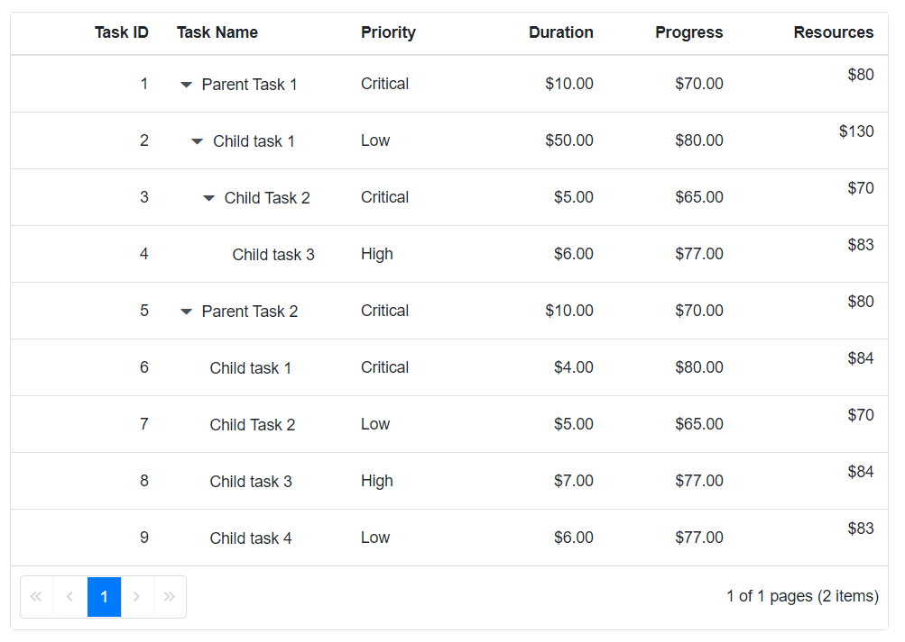

# Calculate column value based on other columns in Blazor TreeGrid

A TreeGrid column value can be calculated from other column values by using the **context** parameter in the [Template](https://help.syncfusion.com/cr/blazor/Syncfusion.Blazor.TreeGrid.TreeGridColumn.html#Syncfusion_Blazor_TreeGrid_TreeGridColumn_Template) of the [TreeGridColumn](https://help.syncfusion.com/cr/blazor/Syncfusion.Blazor.TreeGrid.TreeGridColumn.html) component. Inside the [Template](https://help.syncfusion.com/cr/blazor/Syncfusion.Blazor.TreeGrid.TreeGridColumn.html#Syncfusion_Blazor_TreeGrid_TreeGridColumn_Template), access the current row via the implicit context parameter and compute the value for the new column as needed.

The following example calculates the value of the **Resources** column based on the values of the **Duration** and **Progress** columns.





@using TreeGridComponent.Data;
@using  Syncfusion.Blazor.Grids;
@using  Syncfusion.Blazor.TreeGrid;

<SfTreeGrid DataSource="@TreeGridData" IdMapping="TaskId" ParentIdMapping="ParentId" AllowPaging="true" TreeColumnIndex="1" AllowSorting="true">
        <TreeGridColumns>
            <TreeGridColumn Field="TaskId" HeaderText="Task ID" Width="70" TextAlign="TextAlign.Right"></TreeGridColumn>
            <TreeGridColumn Field="TaskName" HeaderText="Task Name" Width="85"></TreeGridColumn>
            <TreeGridColumn Field="Priority" HeaderText="Priority" Width="60"></TreeGridColumn>
            <TreeGridColumn Field="Duration" HeaderText="Duration" Width="60" Format="C2" TextAlign="TextAlign.Right"></TreeGridColumn>
            <TreeGridColumn Field="Progress" HeaderText="Progress" Width="60" Format="C2" TextAlign="TextAlign.Right"></TreeGridColumn>
            <TreeGridColumn Field="Resources" HeaderText="Resources" Width="70" Format="C2" TextAlign="TextAlign.Right">
                <Template>
                    @{
                        var value = (context as TreeData);
                        var finalValue = value.Duration + value.Progress;
                        
$@finalValue

                    }
                </Template>
            </TreeGridColumn>
        </TreeGridColumns>
    </SfTreeGrid>

    @code{
        SfTreeGrid<TreeData> TreeGrid;

        public List<TreeData> TreeGridData { get; set; }
        protected override void OnInitialized()
        {
            this.TreeGridData = TreeData.GetSelfDataSource().ToList();
        }
    }





namespace TreeGridComponent.Data {

public class TreeData
    {
        public int TaskId { get; set; }
        public string TaskName { get; set; }
        public int? Duration { get; set; }
        public int? Progress { get; set; }
        public string Priority { get; set; }
        public int? ParentId { get; set; }

        public static List<TreeData> GetSelfDataSource()
        {
            List<TreeData> TreeDataCollection = new List<TreeData>();
            TreeDataCollection.Add(new TreeData() { TaskId = 1, TaskName = "Parent Task 1", Duration = 10, Progress = 70, Priority = "Critical", ParentId = null });
            TreeDataCollection.Add(new TreeData() { TaskId = 2, TaskName = "Child task 1", Progress = 80, Priority = "Low", Duration = 50, ParentId = 1 });
            TreeDataCollection.Add(new TreeData() { TaskId = 3, TaskName = "Child Task 2", Duration = 5, Progress = 65, Priority = "Critical", ParentId = 2 });
            TreeDataCollection.Add(new TreeData() { TaskId = 4, TaskName = "Child task 3", Duration = 6, Priority = "High", Progress = 77, ParentId = 3 });
            TreeDataCollection.Add(new TreeData() { TaskId = 5, TaskName = "Parent Task 2", Duration = 10, Progress = 70, Priority = "Critical", ParentId = null });
            TreeDataCollection.Add(new TreeData() { TaskId = 6, TaskName = "Child task 1", Duration = 4, Progress = 80, Priority = "Critical", ParentId = 5 });
            TreeDataCollection.Add(new TreeData() { TaskId = 7, TaskName = "Child Task 2", Duration = 5, Progress = 65, Priority = "Low", ParentId = 5 });
            TreeDataCollection.Add(new TreeData() { TaskId = 8, TaskName = "Child task 3", Duration = 6, Progress = 77, Priority = "High", ParentId = 5 });
            TreeDataCollection.Add(new TreeData() { TaskId = 9, TaskName = "Child task 4", Duration = 6, Progress = 77, Priority = "Low", ParentId = 5 });
            return TreeDataCollection;
        }
    }
}





