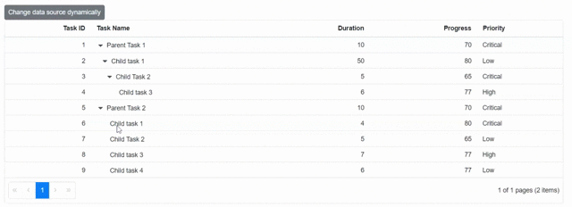

# Change DataSource Dynamically in Blazor TreeGrid Component

The [DataSource](https://help.syncfusion.com/cr/blazor/Syncfusion.Blazor.TreeGrid.SfTreeGrid-1.html#Syncfusion_Blazor_TreeGrid_SfTreeGrid_1_DataSource) of the TreeGrid component can be changed dynamically using an external button.

The following example demonstrates changing the [DataSource](https://help.syncfusion.com/cr/blazor/Syncfusion.Blazor.TreeGrid.SfTreeGrid-1.html#Syncfusion_Blazor_TreeGrid_SfTreeGrid_1_DataSource) at runtime through a bound property.





@using TreeGridComponent.Data;
@using Syncfusion.Blazor.Buttons
@using  Syncfusion.Blazor.Grids;
@using  Syncfusion.Blazor.TreeGrid;

<SfButton OnClick="Change">Change data source dynamically</SfButton>

<SfTreeGrid @ref="TreeGrid" DataSource="@TreeGridData" IdMapping="TaskId" ParentIdMapping="ParentId"
            TreeColumnIndex="1" AllowPaging="true" Height="200">
    <TreeGridPageSettings PageSize="8"></TreeGridPageSettings>

    <TreeGridColumns>
        <TreeGridColumn Field="TaskId" HeaderText="Task ID" Width="80" TextAlign="Syncfusion.Blazor.Grids.TextAlign.Right"></TreeGridColumn>
        <TreeGridColumn Field="TaskName" HeaderText="Task Name" Width="160"></TreeGridColumn>
        <TreeGridColumn Field="Duration" HeaderText="Duration" Width="100" TextAlign="Syncfusion.Blazor.Grids.TextAlign.Right"></TreeGridColumn>
        <TreeGridColumn Field="Progress" HeaderText="Progress" Width="100" TextAlign="Syncfusion.Blazor.Grids.TextAlign.Right"></TreeGridColumn>
        <TreeGridColumn Field="Priority" HeaderText="Priority" Width="80"></TreeGridColumn>
    </TreeGridColumns>
</SfTreeGrid>

@code{
    SfTreeGrid<TreeData> TreeGrid;

    public List<TreeData> TreeGridData { get; set; }

    protected override void OnInitialized()
    {
        this.TreeGridData = TreeData.GetSelfDataSource().ToList();
    }

    public void Change()
    {
        // Data source is modified dynamically
        this.TreeGridData = TreeData.GetSelfChangedDataSource().ToList();
    }
}





namespace TreeGridComponent.Data {

public class TreeData
    {
        public int TaskId { get; set; }
        public string TaskName { get; set; }
        public int? Duration { get; set; }
        public int? Progress { get; set; }
        public string Priority { get; set; }
        public int? ParentId { get; set; }

        public static List<TreeData> GetSelfDataSource()
        {
            List<TreeData> TreeDataCollection = new List<TreeData>();
            TreeDataCollection.Add(new TreeData() { TaskId = 1, TaskName = "Parent Task 1", Duration = 10, Progress = 70, Priority = "Critical", ParentId = null });
            TreeDataCollection.Add(new TreeData() { TaskId = 2, TaskName = "Child task 1", Progress = 80, Priority = "Low", Duration = 50, ParentId = 1 });
            TreeDataCollection.Add(new TreeData() { TaskId = 3, TaskName = "Child Task 2", Duration = 5, Progress = 65, Priority = "Critical", ParentId = 2 });
            TreeDataCollection.Add(new TreeData() { TaskId = 4, TaskName = "Child task 3", Duration = 6, Priority = "High", Progress = 77, ParentId = 3 });
            TreeDataCollection.Add(new TreeData() { TaskId = 5, TaskName = "Parent Task 2", Duration = 10, Progress = 70, Priority = "Critical", ParentId = null });
            TreeDataCollection.Add(new TreeData() { TaskId = 6, TaskName = "Child task 1", Duration = 4, Progress = 80, Priority = "Critical", ParentId = 5 });
            TreeDataCollection.Add(new TreeData() { TaskId = 7, TaskName = "Child Task 2", Duration = 5, Progress = 65, Priority = "Low", ParentId = 5 });
            TreeDataCollection.Add(new TreeData() { TaskId = 8, TaskName = "Child task 3", Duration = 6, Progress = 77, Priority = "High", ParentId = 5 });
            TreeDataCollection.Add(new TreeData() { TaskId = 9, TaskName = "Child task 4", Duration = 6, Progress = 77, Priority = "Low", ParentId = 5 });
            return TreeDataCollection;
        }

        public static List<TreeData> GetSelfChangedDataSource()
        {
            List<TreeData> TreeDataCollection = new List<TreeData>();
            TreeDataCollection.Add(new TreeData() { TaskId = 11, TaskName = "Parent Task 1", Duration = 10, Progress = 70, Priority = "Critical", ParentId = null });
            TreeDataCollection.Add(new TreeData() { TaskId = 22, TaskName = "Child task 1", Progress = 80, Priority = "Low", Duration = 50, ParentId = 11 });
            TreeDataCollection.Add(new TreeData() { TaskId = 13, TaskName = "Child Task 2", Duration = 5, Progress = 65, Priority = "Critical", ParentId = 11 });
            TreeDataCollection.Add(new TreeData() { TaskId = 14, TaskName = "Child task 3", Duration = 6, Priority = "High", Progress = 77, ParentId = null });
            TreeDataCollection.Add(new TreeData() { TaskId = 15, TaskName = "Parent Task 2", Duration = 10, Progress = 70, Priority = "Critical", ParentId = 14 });
            return TreeDataCollection;
        }
    }
}





