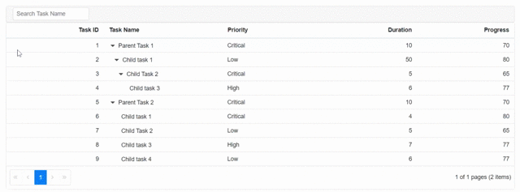

# Custom control in Tree Grid toolbar

You can render custom controls inside the Tree Grid's toolbar area. This can be achieved by initializing the custom controls within the Template property of the Toolbar component. This toolbar component is defined inside the Tree Grid component.

This is demonstrated in the below sample code where Autocomplete component is rendered inside the Tree Grid's toolbar and is used for performing search operation on the Tree Grid,





The following GIF represents the search operation performed on the Tree Grid using the Autocomplete component rendered in the toolbar,

