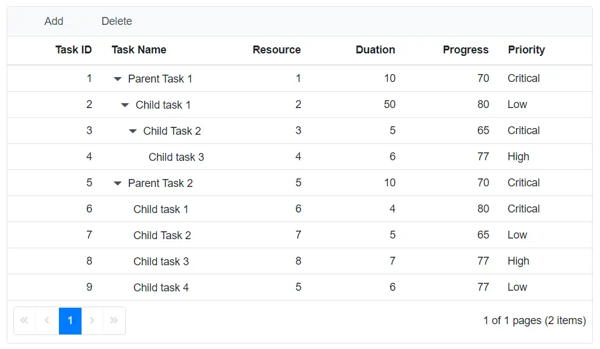

# Custom Toolbar Items in Blazor TreeGrid

Custom toolbar items can be created with text matching default toolbar items (Add, Edit, Delete, etc.). However, without proper configuration, they will be treated as default toolbar items, causing unintended behavior such as unwanted enable/disable state changes. To prevent this behavior, define the `Id` property for custom toolbar items.

The following sample demonstrates creating custom toolbar items with text matching **Add** and **Delete** buttons. When [TreeGridEditSettings](https://help.syncfusion.com/cr/blazor/Syncfusion.Blazor.TreeGrid.TreeGridEditSettings.html) is defined in the TreeGrid, default toolbar items are automatically managed (enabled/disabled based on selection state). By assigning unique `Id` values, custom toolbar items maintain independent behavior.





@using TreeGridComponent.Data;
@using  Syncfusion.Blazor.Grids;
@using  Syncfusion.Blazor.TreeGrid;

@{
    List<Syncfusion.Blazor.Navigations.ItemModel> Toolbaritems = new List<Syncfusion.Blazor.Navigations.ItemModel>();
    Toolbaritems.Add(new Syncfusion.Blazor.Navigations.ItemModel() { Text = "Add", Id = "add", TooltipText = "Add Record", PrefixIcon = "add" });
    Toolbaritems.Add(new Syncfusion.Blazor.Navigations.ItemModel() { Text = "Delete", Id = "delete", TooltipText = "Delete Record", PrefixIcon = "delete" });
}
<SfTreeGrid DataSource="@TreeGridData" IdMapping="TaskId" ParentIdMapping="ParentId" AllowPaging="true"
            TreeColumnIndex="1" Toolbar="Toolbaritems">
    <TreeGridEditSettings AllowAdding="true" AllowDeleting="true" AllowEditing="true"></TreeGridEditSettings>
    <TreeGridEvents OnToolbarClick="ToolbarClickHandler" TValue="TreeData"></TreeGridEvents>
    <TreeGridColumns>
        <TreeGridColumn Field="TaskId" HeaderText="Task ID" IsPrimaryKey="true" Width="70" TextAlign="TextAlign.Right"></TreeGridColumn>
        <TreeGridColumn Field="TaskName" HeaderText="Task Name" Width="85"></TreeGridColumn>
        <TreeGridColumn Field="Duration" HeaderText="Duration" Width="70" TextAlign="TextAlign.Right"></TreeGridColumn>
        <TreeGridColumn Field="Progress" HeaderText="Progress" Width="70" TextAlign="TextAlign.Right"></TreeGridColumn>
        <TreeGridColumn Field="Priority" HeaderText="Priority" Width="70"></TreeGridColumn>
    </TreeGridColumns>
</SfTreeGrid>

@code{
    SfTreeGrid<TreeData> TreeGrid;

    public List<TreeData> TreeGridData { get; set; }
    protected override void OnInitialized()
    {
        this.TreeGridData = TreeData.GetSelfDataSource().ToList();
    }
    public void ToolbarClickHandler(Syncfusion.Blazor.Navigations.ClickEventArgs args)
    {
        // Check the custom toolbar item Id to handle custom actions
        if (args.Item.Id == "add")
        {
            // Custom Add action - e.g., open a dialog, show a notification
            System.Diagnostics.Debug.WriteLine("Custom Add button clicked");
        }
        else if (args.Item.Id == "delete")
        {
            // Custom Delete action - e.g., delete with confirmation
            System.Diagnostics.Debug.WriteLine("Custom Delete button clicked");
        }
    }
}





namespace TreeGridComponent.Data {

public class TreeData
    {
        public int TaskId { get; set; }
        public string TaskName { get; set; }
        public int? Duration { get; set; }
        public int? Progress { get; set; }
        public string Priority { get; set; }
        public int? ParentId { get; set; }

        public static List<TreeData> GetSelfDataSource()
        {
            List<TreeData> TreeDataCollection = new List<TreeData>();
            TreeDataCollection.Add(new TreeData() { TaskId = 1, TaskName = "Parent Task 1", Duration = 10, Progress = 70, Priority = "Critical", ParentId = null });
            TreeDataCollection.Add(new TreeData() { TaskId = 2, TaskName = "Child task 1", Progress = 80, Priority = "Low", Duration = 50, ParentId = 1 });
            TreeDataCollection.Add(new TreeData() { TaskId = 3, TaskName = "Child Task 2", Duration = 5, Progress = 65, Priority = "Critical", ParentId = 2 });
            TreeDataCollection.Add(new TreeData() { TaskId = 4, TaskName = "Child task 3", Duration = 6, Priority = "High", Progress = 77, ParentId = 3 });
            TreeDataCollection.Add(new TreeData() { TaskId = 5, TaskName = "Parent Task 2", Duration = 10, Progress = 70, Priority = "Critical", ParentId = null });
            TreeDataCollection.Add(new TreeData() { TaskId = 6, TaskName = "Child task 1", Duration = 4, Progress = 80, Priority = "Critical", ParentId = 5 });
            TreeDataCollection.Add(new TreeData() { TaskId = 7, TaskName = "Child Task 2", Duration = 5, Progress = 65, Priority = "Low", ParentId = 5 });
            TreeDataCollection.Add(new TreeData() { TaskId = 8, TaskName = "Child task 3", Duration = 6, Progress = 77, Priority = "High", ParentId = 5 });
            TreeDataCollection.Add(new TreeData() { TaskId = 9, TaskName = "Child task 4", Duration = 6, Progress = 77, Priority = "Low", ParentId = 5 });
            return TreeDataCollection;
        }
    }
}





