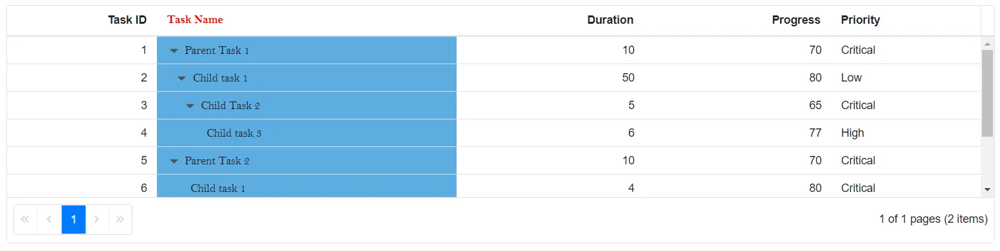

# Column Styles Customization in Blazor TreeGrid

Column headers and content can be customized using the [CustomAttributes](https://help.syncfusion.com/cr/blazor/Syncfusion.Blazor.TreeGrid.TreeGridColumn.html#Syncfusion_Blazor_TreeGrid_TreeGridColumn_CustomAttributes) property. To apply custom styling to a column:

**Step 1: Create a CSS Class**

Create a CSS class that overrides the default styles for both header and data cells. CSS can be added inline in a `<style>` block or in a separate stylesheet.

```css
.e-attr{
        background: #5DADE2;
        font-family: "Bell MT";
        color: red;
        font-size: 5px;
    }
```

**Step 2: Apply the CSS Class to a Column**

Apply the CSS class to the column using the [CustomAttributes](https://help.syncfusion.com/cr/blazor/Syncfusion.Blazor.TreeGrid.TreeGridColumn.html#Syncfusion_Blazor_TreeGrid_TreeGridColumn_CustomAttributes) property. The `CustomAttributes` property accepts a dictionary where the key is the attribute name (e.g., `class`) and the value is the attribute value.





@using TreeGridComponent.Data;
@using  Syncfusion.Blazor.Grids;
@using  Syncfusion.Blazor.TreeGrid;

<SfTreeGrid @ref="TreeGrid" DataSource="@TreeGridData" IdMapping="TaskId" ParentIdMapping="ParentId" 
            TreeColumnIndex="1" AllowPaging="true" Height="200">
    <TreeGridColumns>
        <TreeGridColumn Field="TaskId" HeaderText="Task ID" Width="80" TextAlign="Syncfusion.Blazor.Grids.TextAlign.Right"></TreeGridColumn>
        <TreeGridColumn Field="TaskName" HeaderText="Task Name" CustomAttributes="@(new Dictionary<string, object>() { { "class", "e-attr" } })" Width="160"></TreeGridColumn>
        <TreeGridColumn Field="Duration" HeaderText="Duration" Width="100" TextAlign="Syncfusion.Blazor.Grids.TextAlign.Right"></TreeGridColumn>
        <TreeGridColumn Field="Progress" HeaderText="Progress" Width="100" TextAlign="Syncfusion.Blazor.Grids.TextAlign.Right"></TreeGridColumn>
        <TreeGridColumn Field="Priority" HeaderText="Priority" Width="80"></TreeGridColumn>
    </TreeGridColumns>
</SfTreeGrid>
<style>
    .e-attr {
        background: #5DADE2;
        font-family: "Bell MT";
        color: red;
        font-size: 14px;
    }
</style>


@code{
        SfTreeGrid<TreeData> TreeGrid;

    public List<TreeData> TreeGridData { get; set; }


    protected override void OnInitialized()
    {
        this.TreeGridData = TreeData.GetSelfDataSource().ToList();
    }
}





namespace TreeGridComponent.Data {

public class TreeData
    {
        public int TaskId { get; set; }
        public string TaskName { get; set; }
        public int? Duration { get; set; }
        public int? Progress { get; set; }
        public string Priority { get; set; }
        public int? ParentId { get; set; }

        public static List<TreeData> GetSelfDataSource()
        {
            List<TreeData> TreeDataCollection = new List<TreeData>();
            TreeDataCollection.Add(new TreeData() { TaskId = 1, TaskName = "Parent Task 1", Duration = 10, Progress = 70, Priority = "Critical", ParentId = null });
            TreeDataCollection.Add(new TreeData() { TaskId = 2, TaskName = "Child task 1", Progress = 80, Priority = "Low", Duration = 50, ParentId = 1 });
            TreeDataCollection.Add(new TreeData() { TaskId = 3, TaskName = "Child Task 2", Duration = 5, Progress = 65, Priority = "Critical", ParentId = 2 });
            TreeDataCollection.Add(new TreeData() { TaskId = 4, TaskName = "Child task 3", Duration = 6, Priority = "High", Progress = 77, ParentId = 3 });
            TreeDataCollection.Add(new TreeData() { TaskId = 5, TaskName = "Parent Task 2", Duration = 10, Progress = 70, Priority = "Critical", ParentId = null });
            TreeDataCollection.Add(new TreeData() { TaskId = 6, TaskName = "Child task 1", Duration = 4, Progress = 80, Priority = "Critical", ParentId = 5 });
            TreeDataCollection.Add(new TreeData() { TaskId = 7, TaskName = "Child Task 2", Duration = 5, Progress = 65, Priority = "Low", ParentId = 5 });
            TreeDataCollection.Add(new TreeData() { TaskId = 8, TaskName = "Child task 3", Duration = 6, Progress = 77, Priority = "High", ParentId = 5 });
            TreeDataCollection.Add(new TreeData() { TaskId = 9, TaskName = "Child task 4", Duration = 6, Progress = 77, Priority = "Low", ParentId = 5 });
            return TreeDataCollection;
        }
    }
}






