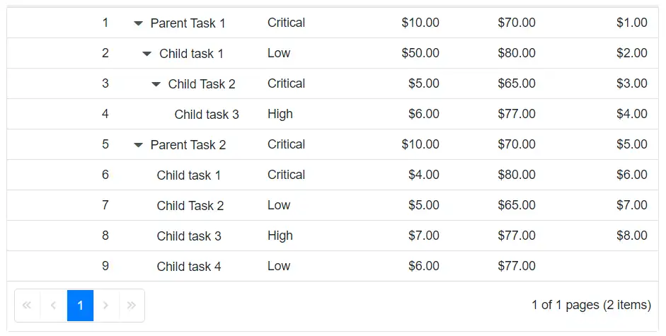

# Hide Header in Blazor TreeGrid

 The TreeGrid header can be hidden by applying the below styles to TreeGrid component.

```html
<style>
    .e-treegrid .e-gridheader .e-columnheader {
        display: none;
    }
</style>
```

**DOM Structure Explanation**

1. **.e-treegrid** → Root container class applied to the TreeGrid component. It wraps the entire treegrid, including header, body, and footer.

2. **.e-gridheader** → Represents the header section inside the TreeGrid. This contains the row of column headers displayed at the top.

3. **.e-columnheader** → Targets the individual header row that holds all column header cells. Each cell corresponds to a TreeGridColumn.

N> To hide the header of a specific TreeGrid, apply the preceding styles using a unique TreeGrid ID, for example, #TreeGrid .e-treegrid .e-gridheader .e-columnheader.


