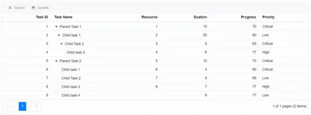

# Single Click Editing with Batch Mode in Blazor TreeGrid

A cell can be made editable with a single click when using [Batch](https://blazor.syncfusion.com/documentation/treegrid/editing/batch-editing) editing mode in the TreeGrid. This is achieved using the [EditCellAsync](https://help.syncfusion.com/cr/blazor/Syncfusion.Blazor.TreeGrid.SfTreeGrid-1.html#Syncfusion_Blazor_TreeGrid_SfTreeGrid_1_EditCellAsync_System_Int32_System_String_) method.

**Implementation Steps**

1. **Enable batch editing** - Configure the `TreeGridEditSettings` with `Mode="Syncfusion.Blazor.TreeGrid.EditMode.Batch"`.

2. **Set selection mode to Both** - Use the `TreeGridSelectionSettings` component and set `Mode="Syncfusion.Blazor.Grids.SelectionMode.Both"`.

3. **Bind CellSelected event** - Add the `TreeGridEvents` component and bind the `CellSelected` event with `TValue` set to the data model.

4. **Implement handler to call EditCellAsync** - In the `CellSelected` event handler, retrieve the selected cell index and invoke `EditCellAsync` with the row index and column field name.

5. **Test single-click editing** - Run the application and click on any cell to verify that it enters edit mode immediately.

6. **Save batch changes** - Use the toolbar options (`Update`, `Cancel`) to commit or discard the batch edits.





@using TreeGridComponent.Data;
@using Syncfusion.Blazor.Grids;
@using Syncfusion.Blazor.TreeGrid;

<SfTreeGrid @ref="TreeGrid" DataSource="@TreeGridData" IdMapping="TaskId" ParentIdMapping="ParentId" AllowPaging="true" TreeColumnIndex="1" Toolbar="@(new List<string>() { "Cancel", "Update" })">
    <TreeGridEditSettings AllowEditing="true" Mode="Syncfusion.Blazor.TreeGrid.EditMode.Batch"></TreeGridEditSettings>
    <TreeGridSelectionSettings Mode="Syncfusion.Blazor.Grids.SelectionMode.Both"></TreeGridSelectionSettings>
    <TreeGridEvents CellSelected="CellSelectHandler" TValue="TreeData"></TreeGridEvents>
    <TreeGridColumns>
        <TreeGridColumn Field="TaskId" HeaderText="Task ID" IsPrimaryKey="true" Width="70" TextAlign="TextAlign.Right"></TreeGridColumn>
        <TreeGridColumn Field="TaskName" HeaderText="Task Name" Width="85"></TreeGridColumn>
        <TreeGridColumn Field="Duration" HeaderText="Duration" Width="70" TextAlign="TextAlign.Right"></TreeGridColumn>
        <TreeGridColumn Field="Progress" HeaderText="Progress" Width="70" TextAlign="TextAlign.Right"></TreeGridColumn>
        <TreeGridColumn Field="Priority" HeaderText="Priority" Width="70"></TreeGridColumn>
    </TreeGridColumns>
</SfTreeGrid>

@code{
    SfTreeGrid<TreeData> TreeGrid;

    public List<TreeData> TreeGridData { get; set; }
    protected override void OnInitialized()
    {
        this.TreeGridData = TreeData.GetSelfDataSource().ToList();
    }
    public async Task CellSelectHandler(CellSelectEventArgs<TreeData> args)
    {
        // Step 1: Retrieve the selected cell indexes from the TreeGrid
        var CellIndexes = await TreeGrid.GetSelectedRowCellIndexesAsync();

        // Step 2: Extract the row index and cell index from the selection
        var CurrentEditRowIndex = CellIndexes[0].Item1;
        var CurrentEditCellIndex = (int)CellIndexes[0].Item2;

        // Step 3: Get the list of available column field names
        var fields = await TreeGrid.GetColumnFieldNamesAsync();
            
        // Step 4: Invoke EditCellAsync using the row index and corresponding column field
        await TreeGrid.EditCellAsync(CurrentEditRowIndex, fields[CurrentEditCellIndex]);
    }

}





namespace TreeGridComponent.Data {

public class TreeData
    {
        public int TaskId { get; set; }
        public string TaskName { get; set; }
        public int? Duration { get; set; }
        public int? Progress { get; set; }
        public string Priority { get; set; }
        public int? ParentId { get; set; }

        public static List<TreeData> GetSelfDataSource()
        {
            List<TreeData> TreeDataCollection = new List<TreeData>();
            TreeDataCollection.Add(new TreeData() { TaskId = 1, TaskName = "Parent Task 1", Duration = 10, Progress = 70, Priority = "Critical", ParentId = null });
            TreeDataCollection.Add(new TreeData() { TaskId = 2, TaskName = "Child task 1", Progress = 80, Priority = "Low", Duration = 50, ParentId = 1 });
            TreeDataCollection.Add(new TreeData() { TaskId = 3, TaskName = "Child Task 2", Duration = 5, Progress = 65, Priority = "Critical", ParentId = 2 });
            TreeDataCollection.Add(new TreeData() { TaskId = 4, TaskName = "Child task 3", Duration = 6, Priority = "High", Progress = 77, ParentId = 3 });
            TreeDataCollection.Add(new TreeData() { TaskId = 5, TaskName = "Parent Task 2", Duration = 10, Progress = 70, Priority = "Critical", ParentId = null });
            TreeDataCollection.Add(new TreeData() { TaskId = 6, TaskName = "Child task 1", Duration = 4, Progress = 80, Priority = "Critical", ParentId = 5 });
            TreeDataCollection.Add(new TreeData() { TaskId = 7, TaskName = "Child Task 2", Duration = 5, Progress = 65, Priority = "Low", ParentId = 5 });
            TreeDataCollection.Add(new TreeData() { TaskId = 8, TaskName = "Child task 3", Duration = 6, Progress = 77, Priority = "High", ParentId = 5 });
            TreeDataCollection.Add(new TreeData() { TaskId = 9, TaskName = "Child task 4", Duration = 6, Progress = 77, Priority = "Low", ParentId = 5 });
            return TreeDataCollection;
        }
    }
}




