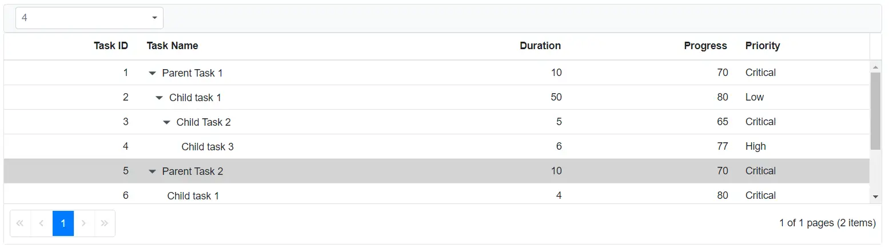

# Custom Toolbar with Drop-Down List in Blazor TreeGrid

Custom toolbar items are added by defining the [Toolbar](https://help.syncfusion.com/cr/blazor/Syncfusion.Blazor.TreeGrid.SfTreeGrid-1.html#Syncfusion_Blazor_TreeGrid_SfTreeGrid_1_Toolbar) property. Component-specific events, such as [DropDownListEvents](https://help.syncfusion.com/cr/blazor/Syncfusion.Blazor.DropDowns.DropDownListEvents-2.html), handle user interactions. In this example, a dropdown is added to the toolbar that allows users to select TreeGrid rows by index.

## Create the Dropdown Template

Add the [SfDropDownList](https://help.syncfusion.com/cr/blazor/Syncfusion.Blazor.DropDowns.SfDropDownList-2.html) component to the toolbar template as shown in the following code:

```cshtml
<SfToolbar>
    <ToolbarItems>
        <ToolbarItem Type="ItemType.Input">
            <Template>
                <SfDropDownList TValue="string" TItem="Select" DataSource=@LocalData Width="200">
                    <DropDownListFieldSettings Text="Text" Value="Text"> </DropDownListFieldSettings>
                    <DropDownListEvents TValue="string" ValueChange="OnChange" TItem="Select"> </DropDownListEvents>
                </SfDropDownList>
            </Template>
        </ToolbarItem>
    </ToolbarItems>
</SfToolbar>
```

## Handle Dropdown Value Changes

The [DropDownListEvents](https://help.syncfusion.com/cr/blazor/Syncfusion.Blazor.DropDowns.DropDownListEvents-2.html) handle dropdown value changes. When the dropdown value changes, the corresponding row is selected by index using `SelectRowAsync`.





@using TreeGridComponent.Data;
@using Syncfusion.Blazor.Grids
@using Syncfusion.Blazor.Navigations
@using Syncfusion.Blazor.DropDowns

<SfTreeGrid @ref="TreeGrid" DataSource="@TreeGridData" AllowPaging="true"
            IdMapping="TaskId" ParentIdMapping="ParentId" TreeColumnIndex="1" Height="200">
    <SfToolbar>
        <ToolbarItems>
            <ToolbarItem Type="ItemType.Input">
                <Template>
                    <SfDropDownList TValue="string" TItem="Select" DataSource=@LocalData Width="200">
                        <DropDownListFieldSettings Text="Text" Value="Text"> </DropDownListFieldSettings>
                        <DropDownListEvents TValue="string" ValueChange="OnChange" TItem="Select"> </DropDownListEvents>
                    </SfDropDownList>
                </Template>
            </ToolbarItem>
        </ToolbarItems>
    </SfToolbar>
    <TreeGridColumns>
        <TreeGridColumn Field="TaskId" HeaderText="Task ID" IsPrimaryKey="true" Width="80" TextAlign="Syncfusion.Blazor.Grids.TextAlign.Right"></TreeGridColumn>
        <TreeGridColumn Field="TaskName" HeaderText="Task Name" Width="160"></TreeGridColumn>
        <TreeGridColumn Field="Duration" HeaderText="Duration" Width="100" TextAlign="Syncfusion.Blazor.Grids.TextAlign.Right"></TreeGridColumn>
        <TreeGridColumn Field="Progress" HeaderText="Progress" Width="100" TextAlign="Syncfusion.Blazor.Grids.TextAlign.Right"></TreeGridColumn>
        <TreeGridColumn Field="Priority" HeaderText="Priority" Width="80"></TreeGridColumn>
    </TreeGridColumns>
</SfTreeGrid>

@code{
    SfTreeGrid<TreeData> TreeGrid;

    public List<TreeData> TreeGridData { get; set; }

    public class Select
    {
        public string Text { get; set; }
    }
    List<Select> LocalData = new List<Select>
    {
            new Select() { Text = "0"},
            new Select() { Text = "1"},
            new Select() { Text = "2"},
            new Select() { Text = "3"},
            new Select() { Text = "4"},
            new Select() { Text = "5"},
            new Select() { Text = "6"},
            new Select() { Text = "7"},
            new Select() { Text = "8"},
            new Select() { Text = "9"},
    };
    protected override void OnInitialized()
    {
        this.TreeGridData = TreeData.GetSelfDataSource().ToList();
    }
    public void OnChange(Syncfusion.Blazor.DropDowns.ChangeEventArgs<string, Select> args)
    {
        this.TreeGrid.SelectRowAsync(int.Parse(args.Value));
    }

}





namespace TreeGridComponent.Data {

public class TreeData
    {
        public int TaskId { get; set; }
        public string TaskName { get; set; }
        public int? Duration { get; set; }
        public int? Progress { get; set; }
        public string Priority { get; set; }
        public int? ParentId { get; set; }

        public static List<TreeData> GetSelfDataSource()
        {
            List<TreeData> TreeDataCollection = new List<TreeData>();
            TreeDataCollection.Add(new TreeData() { TaskId = 1, TaskName = "Parent Task 1", Duration = 10, Progress = 70, Priority = "Critical", ParentId = null });
            TreeDataCollection.Add(new TreeData() { TaskId = 2, TaskName = "Child task 1", Progress = 80, Priority = "Low", Duration = 50, ParentId = 1 });
            TreeDataCollection.Add(new TreeData() { TaskId = 3, TaskName = "Child Task 2", Duration = 5, Progress = 65, Priority = "Critical", ParentId = 2 });
            TreeDataCollection.Add(new TreeData() { TaskId = 4, TaskName = "Child task 3", Duration = 6, Priority = "High", Progress = 77, ParentId = 3 });
            TreeDataCollection.Add(new TreeData() { TaskId = 5, TaskName = "Parent Task 2", Duration = 10, Progress = 70, Priority = "Critical", ParentId = null });
            TreeDataCollection.Add(new TreeData() { TaskId = 6, TaskName = "Child task 1", Duration = 4, Progress = 80, Priority = "Critical", ParentId = 5 });
            TreeDataCollection.Add(new TreeData() { TaskId = 7, TaskName = "Child Task 2", Duration = 5, Progress = 65, Priority = "Low", ParentId = 5 });
            TreeDataCollection.Add(new TreeData() { TaskId = 8, TaskName = "Child task 3", Duration = 6, Progress = 77, Priority = "High", ParentId = 5 });
            TreeDataCollection.Add(new TreeData() { TaskId = 9, TaskName = "Child task 4", Duration = 6, Progress = 77, Priority = "Low", ParentId = 5 });
            return TreeDataCollection;
        }
    }
}






