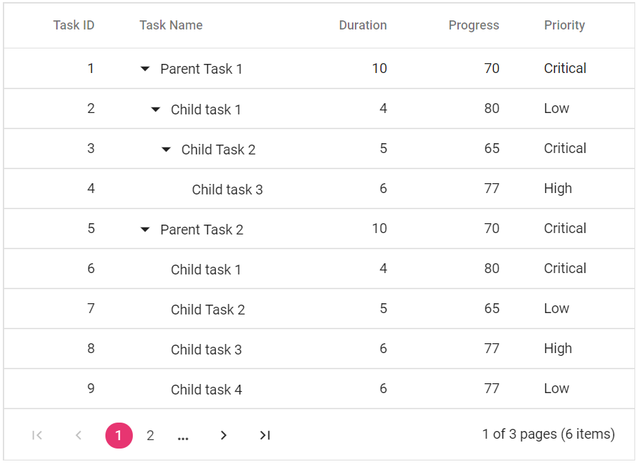
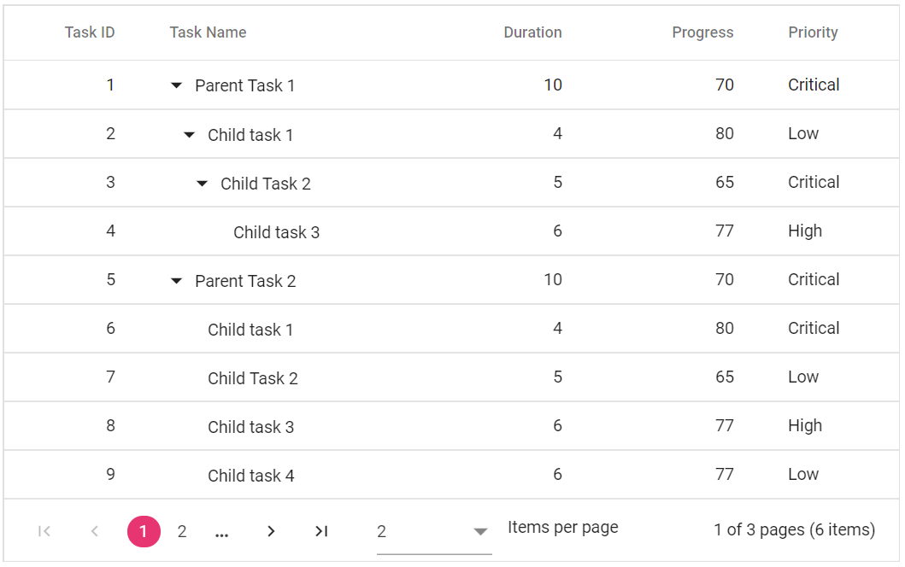

# Paging

Paging provides an option to display Tree Grid data in page segments. To enable paging, set the [`AllowPaging`](https://help.syncfusion.com/cr/blazor/Syncfusion.Blazor~Syncfusion.Blazor.TreeGrid.SfTreeGrid~AllowPaging.html) to true. When paging is enabled, pager component renders at the bottom of the tree grid.
Paging options can be configured through the [`TreeGridPageSettings`](https://help.syncfusion.com/cr/blazor/Syncfusion.Blazor~Syncfusion.Blazor.TreeGrid.TreeGridPageSettings.html).





The following output is displayed as a result of the above code example.

> You can achieve better performance by using tree grid paging to fetch only a pre-defined number of records from the data source.

## Page size mode

Two behaviour are available in Tree Grid paging to display certain number of records in a current page. Following are the two types of [`PageSizeMode`](https://help.syncfusion.com/cr/blazor/Syncfusion.Blazor~Syncfusion.Blazor.TreeGrid.TreeGridPageSettings~PageSizeMode.html) property of [`TreeGridPageSettings`](https://help.syncfusion.com/cr/blazor/Syncfusion.Blazor~Syncfusion.Blazor.TreeGrid.TreeGridPageSettings.html).

* **All** : This is the default mode. The number of records in a page is based on [`PageSize`](https://help.syncfusion.com/cr/blazor/Syncfusion.Blazor~Syncfusion.Blazor.TreeGrid.TreeGridPageSettings~PageSize.html) property.
* **Root** : The number of root nodes or the 0th level records to be displayed per page is based on [`PageSize`](https://help.syncfusion.com/cr/blazor/Syncfusion.Blazor~Syncfusion.Blazor.TreeGrid.TreeGridPageSettings~PageSize.html) property.

With [`PageSizeMode`](https://help.syncfusion.com/cr/blazor/Syncfusion.Blazor~Syncfusion.Blazor.TreeGrid.TreeGridPageSettings~PageSizeMode.html) property as **Root**, only the root level or the 0th level records are considered in records count.

> By default, Blazor Tree Grid work with **PageSizeMode** as *Root* and to behave as *All* mode, **Adaptor** property should be set for Tree Grid **SfDataManager**.





The following output is displayed as a result of the above code example.

<!-- Template

You can use custom elements inside the pager instead of default elements.
The custom elements can be defined by using the [`Template`](https://help.syncfusion.com/cr/blazor/Syncfusion.Blazor~Syncfusion.Blazor.TreeGrid.TreeGridPageSettings~Template.html) property.
Inside this template, you can access the [`CurrentPage`](https://help.syncfusion.com/cr/blazor/Syncfusion.Blazor~Syncfusion.Blazor.TreeGrid.TreeGridPageSettings~CurrentPage.html), [`PageSize`](https://help.syncfusion.com/cr/blazor/Syncfusion.Blazor~Syncfusion.Blazor.TreeGrid.TreeGridPageSettings~PageSize.html), [`PageCount`](https://help.syncfusion.com/cr/blazor/Syncfusion.Blazor~Syncfusion.Blazor.TreeGrid.TreeGridPageSettings~PageCount.html), **TotalPage** and **TotalRecordCount** values.





-->

## Pager with page size dropdown

The pager Dropdown allows you to change the number of records in the Tree Grid dynamically. It can be enabled by defining the [`PageSizes`](https://help.syncfusion.com/cr/blazor/Syncfusion.Blazor~Syncfusion.Blazor.TreeGrid.TreeGridPageSettings~PageSizes.html) property of [`TreeGridPageSettings`](https://help.syncfusion.com/cr/blazor/Syncfusion.Blazor~Syncfusion.Blazor.TreeGrid.TreeGridPageSettings.html) as **true**.





The following output is displayed as a result of the above code example.

<!--How to render Pager at the Top of the Tree Grid

By default, Pager will be rendered at the bottom of the Tree Grid. You can also render the Pager at the top of the Tree Grid by using the [`DataBound`](https://help.syncfusion.com/cr/blazor/Syncfusion.Blazor~Syncfusion.Blazor.TreeGrid.SfTreeGrid~DataBound.html) event.

> During the paging action, the pager component triggers the below three events.
> The **created** event triggers when Pager is created.
> The **click** event triggers when the numeric items in the pager is clicked.
> The **dropDownChanged** event triggers when pageSize DropDownList value is selected.

-->