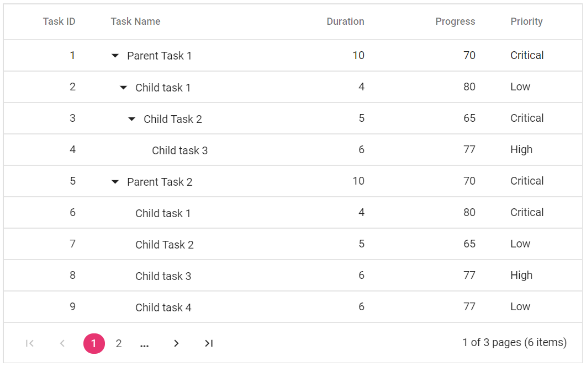

# Paging in Blazor TreeGrid Component

Paging provides an option to display Tree Grid data in page segments. To enable paging, set the [AllowPaging](https://help.syncfusion.com/cr/blazor/Syncfusion.Blazor.TreeGrid.SfTreeGrid-1.html#Syncfusion_Blazor_TreeGrid_SfTreeGrid_1_AllowPaging) to true. When paging is enabled, pager component renders at the bottom of the tree grid. Paging options can be configured through the [TreeGridPageSettings](https://help.syncfusion.com/cr/blazor/Syncfusion.Blazor.TreeGrid.TreeGridPageSettings.html).





@using TreeGridComponent.Data;
@using Syncfusion.Blazor.TreeGrid;

<SfTreeGrid DataSource="@TreeGridData" IdMapping="TaskId" ParentIdMapping="ParentId" TreeColumnIndex="1" AllowPaging="true">
    <TreeGridPageSettings PageCount="2" PageSize="2" PageSizeMode="PageSizeMode.Root">
    </TreeGridPageSettings>
    <TreeGridColumns>
        <TreeGridColumn Field="TaskId" HeaderText="Task ID" Width="80" TextAlign="Syncfusion.Blazor.Grids.TextAlign.Right"></TreeGridColumn>
        <TreeGridColumn Field="TaskName" HeaderText="Task Name" Width="160"></TreeGridColumn>
        <TreeGridColumn Field="Duration" HeaderText="Duration" Width="100" TextAlign="Syncfusion.Blazor.Grids.TextAlign.Right"></TreeGridColumn>
        <TreeGridColumn Field="Progress" HeaderText="Progress" Width="100" TextAlign="Syncfusion.Blazor.Grids.TextAlign.Right"></TreeGridColumn>
        <TreeGridColumn Field="Priority" HeaderText="Priority" Width="80"></TreeGridColumn>
    </TreeGridColumns>
</SfTreeGrid>

@code{
    public List<TreeData.BusinessObject> TreeGridData { get; set; }
    protected override void OnInitialized()
    {
        this.TreeGridData = TreeData.GetSelfDataSource().ToList();
    }
}





namespace TreeGridComponent.Data {

public class TreeData
    {
        public class BusinessObject
        {
            public int TaskId { get; set;}
            public string TaskName { get; set;}
            public int? Duration { get; set;}
            public int? Progress { get; set;}
            public string Priority { get; set;}
            public int? ParentId { get; set;}
        }

        public static List<BusinessObject> GetSelfDataSource()
        {
            List<BusinessObject> BusinessObjectCollection = new List<BusinessObject>();
            BusinessObjectCollection.Add(new BusinessObject() { TaskId = 1,TaskName = "Parent Task 1",Duration = 10,Progress = 70,Priority = "Critical",ParentId = null });
            BusinessObjectCollection.Add(new BusinessObject() { TaskId = 2,TaskName = "Child task 1",Progress = 80,Priority = "Low",ParentId = 1 });
            BusinessObjectCollection.Add(new BusinessObject() { TaskId = 3,TaskName = "Child Task 2",Duration = 5,Progress = 65,Priority = "Critical",ParentId = 2 });
            BusinessObjectCollection.Add(new BusinessObject() { TaskId = 4,TaskName = "Child task 3",Duration = 6,Priority = "High",Progress = 77,ParentId = 3 });
            BusinessObjectCollection.Add(new BusinessObject() { TaskId = 5,TaskName = "Parent Task 2",Duration = 10,Progress = 70,Priority = "Critical",ParentId = null});
            BusinessObjectCollection.Add(new BusinessObject() { TaskId = 6,TaskName = "Child task 1",Duration = 4,Progress = 80,Priority = "Critical",ParentId = 5});
            BusinessObjectCollection.Add(new BusinessObject() { TaskId = 7,TaskName = "Child Task 2",Duration = 5,Progress = 65,Priority = "Low",ParentId = 5});
            BusinessObjectCollection.Add(new BusinessObject() { TaskId = 8,TaskName = "Child task 3",Duration = 6,Progress = 77,Priority = "High",ParentId = 5});
            BusinessObjectCollection.Add(new BusinessObject() { TaskId = 9,TaskName = "Child task 4",Duration = 6,Progress = 77,Priority = "Low",ParentId = 5});
            return BusinessObjectCollection;
        }
    }
}





N> Better performance can be achieved by using tree grid paging to fetch only a pre-defined number of records from the data source.

## Page size mode

## Page size mode

The [`PageSizeMode`](https://help.syncfusion.com/cr/blazor/Syncfusion.Blazor.TreeGrid.TreeGridPageSettings.html#Syncfusion_Blazor_TreeGrid_TreeGridPageSettings_PageSizeMode) property of [`TreeGridPageSettings`](https://help.syncfusion.com/cr/blazor/Syncfusion.Blazor.TreeGrid.TreeGridPageSettings.html) defines two behaviors in TreeGrid paging to display a specific number of records on the current page.

* **All** : Page size is calculated using the entire hierarchy, including both root and child records. 
* **Root** : This is the default mode. The number of root nodes or the **0th-level** records to be displayed per page is based on [PageSize](https://help.syncfusion.com/cr/blazor/Syncfusion.Blazor.TreeGrid.TreeGridPageSettings.html#Syncfusion_Blazor_TreeGrid_TreeGridPageSettings_PageSize) property. With `PageSizeMode` property as **Root**, only the root level or the 0th level records are considered in records count.

N> The **ALL** mode of **PageSizeMode** is not supported with remote data binding in the Tree Grid.





@using TreeGridComponent.Data;
@using Syncfusion.Blazor.TreeGrid;

<SfTreeGrid DataSource="@TreeGridData" IdMapping="TaskId" ParentIdMapping="ParentId" TreeColumnIndex="1" AllowPaging="true">
    <TreeGridPageSettings PageCount="2" PageSize="2" PageSizeMode="PageSizeMode.Root">
    </TreeGridPageSettings>
    <TreeGridColumns>
        <TreeGridColumn Field="TaskId" HeaderText="Task ID" Width="80" TextAlign="Syncfusion.Blazor.Grids.TextAlign.Right"></TreeGridColumn>
        <TreeGridColumn Field="TaskName" HeaderText="Task Name" Width="160"></TreeGridColumn>
        <TreeGridColumn Field="Duration" HeaderText="Duration" Width="100" TextAlign="Syncfusion.Blazor.Grids.TextAlign.Right"></TreeGridColumn>
        <TreeGridColumn Field="Progress" HeaderText="Progress" Width="100" TextAlign="Syncfusion.Blazor.Grids.TextAlign.Right"></TreeGridColumn>
        <TreeGridColumn Field="Priority" HeaderText="Priority" Width="80"></TreeGridColumn>
    </TreeGridColumns>
</SfTreeGrid>

@code{
    public List<TreeData.BusinessObject> TreeGridData { get; set; }
    protected override void OnInitialized()
    {
        this.TreeGridData = TreeData.GetSelfDataSource().ToList();
    }
}





namespace TreeGridComponent.Data {

public class TreeData
    {
        public class BusinessObject
        {
            public int TaskId { get; set;}
            public string TaskName { get; set;}
            public int? Duration { get; set;}
            public int? Progress { get; set;}
            public string Priority { get; set;}
            public int? ParentId { get; set;}
        }

        public static List<BusinessObject> GetSelfDataSource()
        {
            List<BusinessObject> BusinessObjectCollection = new List<BusinessObject>();
            BusinessObjectCollection.Add(new BusinessObject() { TaskId = 1,TaskName = "Parent Task 1",Duration = 10,Progress = 70,Priority = "Critical",ParentId = null });
            BusinessObjectCollection.Add(new BusinessObject() { TaskId = 2,TaskName = "Child task 1",Progress = 80,Priority = "Low",ParentId = 1 });
            BusinessObjectCollection.Add(new BusinessObject() { TaskId = 3,TaskName = "Child Task 2",Duration = 5,Progress = 65,Priority = "Critical",ParentId = 2 });
            BusinessObjectCollection.Add(new BusinessObject() { TaskId = 4,TaskName = "Child task 3",Duration = 6,Priority = "High",Progress = 77,ParentId = 3 });
            BusinessObjectCollection.Add(new BusinessObject() { TaskId = 5,TaskName = "Parent Task 2",Duration = 10,Progress = 70,Priority = "Critical",ParentId = null});
            BusinessObjectCollection.Add(new BusinessObject() { TaskId = 6,TaskName = "Child task 1",Duration = 4,Progress = 80,Priority = "Critical",ParentId = 5});
            BusinessObjectCollection.Add(new BusinessObject() { TaskId = 7,TaskName = "Child Task 2",Duration = 5,Progress = 65,Priority = "Low",ParentId = 5});
            BusinessObjectCollection.Add(new BusinessObject() { TaskId = 8,TaskName = "Child task 3",Duration = 6,Progress = 77,Priority = "High",ParentId = 5});
            BusinessObjectCollection.Add(new BusinessObject() { TaskId = 9,TaskName = "Child task 4",Duration = 6,Progress = 77,Priority = "Low",ParentId = 5});
            return BusinessObjectCollection;
        }
    }
}





<!-- Template

You can use custom elements inside the pager instead of default elements.
The custom elements can be defined by using the [`Template`](https://help.syncfusion.com/cr/blazor/Syncfusion.Blazor.TreeGrid.TreeGridPageSettings.html#Syncfusion_Blazor_TreeGrid_TreeGridPageSettings_Template) property.
Inside this template, you can access the [`CurrentPage`](https://help.syncfusion.com/cr/blazor/Syncfusion.Blazor.TreeGrid.TreeGridPageSettings.html#Syncfusion_Blazor_TreeGrid_TreeGridPageSettings_CurrentPage), [`PageSize`](https://help.syncfusion.com/cr/blazor/Syncfusion.Blazor.TreeGrid.TreeGridPageSettings.html#Syncfusion_Blazor_TreeGrid_TreeGridPageSettings_PageSize), [`PageCount`](https://help.syncfusion.com/cr/blazor/Syncfusion.Blazor.TreeGrid.TreeGridPageSettings.html#Syncfusion_Blazor_TreeGrid_TreeGridPageSettings_PageCount), **TotalPage** and **TotalRecordCount** values.

-->

## Pager template

The pager template in the Syncfusion® TreeGrid component enables customization of the appearance and behavior of the pager element, which facilitates navigation across different pages of TreeGrid data. This feature is especially useful when custom elements are required inside the pager instead of the default controls.

To use the pager template, you must specify the [Template](https://help.syncfusion.com/cr/blazor/Syncfusion.Blazor.TreeGrid.TreeGridPageSettings.html#Syncfusion_Blazor_TreeGrid_TreeGridPageSettings_Template) property of the [TreeGridPageSettings](https://help.syncfusion.com/cr/blazor/Syncfusion.Blazor.TreeGrid.TreeGridPageSettings.html) component in your Syncfusion&reg; TreeGrid configuration. Within the pager `Template`, utilize the `PagerTemplateContext` context to retrieve vital paging values such as [CurrentPage](https://help.syncfusion.com/cr/blazor/Syncfusion.Blazor.TreeGrid.TreeGridPageSettings.html#Syncfusion_Blazor_TreeGrid_TreeGridPageSettings_CurrentPage), [PageSize](https://help.syncfusion.com/cr/blazor/Syncfusion.Blazor.TreeGrid.TreeGridPageSettings.html#Syncfusion_Blazor_TreeGrid_TreeGridPageSettings_PageSize), [PageCount](https://help.syncfusion.com/cr/blazor/Syncfusion.Blazor.TreeGrid.TreeGridPageSettings.html#Syncfusion_Blazor_TreeGrid_TreeGridPageSettings_PageCount), **TotalPage**, and **TotalRecordCount** . These values provide the data necessary to display and manage the pager effectively.

When implementing a custom pager template, you can design the layout of pager controls as desired. However, for actual paging functionality, you need to integrate the `GoToPageAsync` method. This method handles navigation to a specific page based on the page number input.

The following example demonstrates how to render a **NumericTextBox** component in the pager using the `Template` property





@using Syncfusion.Blazor.TreeGrid
@using Syncfusion.Blazor.Grids
@using Syncfusion.Blazor.Inputs
@using Syncfusion.Blazor.Navigations
@using System.ComponentModel.DataAnnotations
@using TreeGridComponent.Data;

<SfTreeGrid @ref="TreeGrid" DataSource="@TreeData" Height="312" IdMapping="TaskID" ParentIdMapping="ParentID" TreeColumnIndex="1" AllowPaging="true">
    <TreeGridPageSettings  PageSize="@pageSize">
        <Template>

            @{
                var Paging = ( context as  PagerTemplateContext);
            

                

                    

                        <SfNumericTextBox TValue="int" Format="###" Step="1" Min="1" Max="5" Placeholder="Select Page Size" Width="200px">
                            <NumericTextBoxEvents TValue="int" ValueChange="@CalculatePageSize"></NumericTextBoxEvents>
                        </SfNumericTextBox>
                    

                

                

                     of @totalPages pages (@TreeData.Count items)
                

            

            }
        </Template>
    </TreeGridPageSettings>
    <TreeGridColumns>
        <TreeGridColumn Field="TaskID" HeaderText="Task ID" Width="80" TextAlign="TextAlign.Right"></TreeGridColumn>
        <TreeGridColumn Field="TaskName" HeaderText="Task Name" Width="170"></TreeGridColumn>
        <TreeGridColumn Field="StartDate" HeaderText="Start Date" Format="d" Type=ColumnType.Date Width="145" TextAlign="TextAlign.Right"></TreeGridColumn>
        <TreeGridColumn Field="Duration" HeaderText="Duration" Width="100" TextAlign="TextAlign.Right"></TreeGridColumn>
        <TreeGridColumn Field="Progress" HeaderText="Progress" Width="110"></TreeGridColumn>
        <TreeGridColumn Field="Priority" HeaderText="Priority" Width="100"></TreeGridColumn>
    </TreeGridColumns>
</SfTreeGrid>

@code {
    private List<SelfReferenceData> TreeData { get; set; }
    SfTreeGrid<SelfReferenceData> TreeGrid;
    public int pageSize { get; set; } = 3;
    public int totalPages => (int)Math.Ceiling((double)TreeData.Count / (pageSize * 6));

    protected override void OnInitialized()
    {
        TreeData = SelfReferenceData.GetTree().Take(90).ToList();
    }

    
    private async Task CalculatePageSize(Syncfusion.Blazor.Inputs.ChangeEventArgs<int> args)
    {
        await TreeGrid.GoToPageAsync(args.Value);
    }
}





namespace TreeGridComponent.Data {

    public class SelfReferenceData
    {
        public static List<SelfReferenceData> tree = new List<SelfReferenceData>();
        [Key]
        public int? TaskID { get; set; }
        public string TaskName { get; set; }
        public DateTime? StartDate { get; set; }
        public DateTime? EndDate { get; set; }
        public String Progress { get; set; }
        public String Priority { get; set; }
        public double? Duration { get; set; }
        public int? ParentID { get; set; }
        public bool? IsParent { get; set; }
        public bool? Approved { get; set; }
        public int? ParentItem { get; set; }
        public SelfReferenceData() { }
        public static List<SelfReferenceData> GetTree()
        {
            tree.Clear();
            int root = -1;
            int TaskNameID = 0;
            int ChildCount = -1;
            int SubTaskCount = -1;
            for (var t = 1; t <= 60; t++)
            {
                DateTime start = new DateTime(2022, 08, 25);
                DateTime end = new DateTime(2027, 08, 25);
                DateTime startingDate = start.AddDays(t + 2);
                DateTime endingDate = end.AddDays(t + 20);
                string math = "";
                string progr = "";
                bool appr = true;
                int duration = 0;
                duration = (t % 2 == 0) ? 52 : (t % 5 == 0) ? 14 : (t % 3 == 0) ? 25 : 34;
                math = (t % 3) == 0 ? "High" : (t % 2) == 0 ? "Low" : "Critical";
                progr = (t % 3) == 0 ? "Started" : (t % 2) == 0 ? "Open" : "In Progress";
                appr = (t % 3) == 0 ? true : (t % 2) == 0 ? false : true;
                root++; TaskNameID++;
                int rootItem = root + 1;
                tree.Add(new SelfReferenceData() { TaskID = rootItem, TaskName = "Parent task " + TaskNameID.ToString(), StartDate = startingDate, EndDate = endingDate, IsParent = true, ParentID = null, Progress = progr, Priority = math, Duration = duration, Approved = appr });
                int parent = tree.Count;
                for (var c = 0; c < 2; c++)
                {
                    DateTime start1 = new DateTime(2022, 08, 25);
                    DateTime startingDate1 = start1.AddDays(c + 4);
                    DateTime end1 = new DateTime(2025, 06, 16);
                    DateTime endingDate1 = end1.AddDays(c + 15);
                    root++; ChildCount++;
                    int parn = parent + c + 1;
                    string val = "";
                    duration = (c % 3 == 0) ? 1 : (c % 2 == 0) ? 12 : 98;
                    val = ((parent + c + 1) % 3 == 0) ? "Low" : "Critical";
                    progr = ((c + 1) % 3) == 0 ? "In Progress" : ((c + 1) % 2) == 0 ? "Open" : "Validated";
                    appr = ((c + 1) % 3) == 0 ? true : ((c + 3) % 2) == 0 ? false : true;
                    int iD = root + 1;
                    tree.Add(new SelfReferenceData() { TaskID = iD, TaskName = "Child task " + (ChildCount + 1).ToString(), StartDate = startingDate1, EndDate = endingDate1, IsParent = (((parent + c + 1) % 3) == 0), ParentID = rootItem, Progress = progr, Priority = val, Duration = duration, Approved = appr });
                    if ((((parent + c + 1) % 3) == 0))
                    {
                        int immParent = tree.Count;
                        for (var s = 0; s < 3; s++)
                        {
                            DateTime start2 = new DateTime(2022, 08, 25);
                            DateTime startingDate2 = start2.AddDays(s + 4);
                            DateTime end2 = new DateTime(2024, 06, 16);
                            DateTime endingDate2 = end2.AddDays(s + 13);
                            root++; SubTaskCount++;
                            duration = (s % 2 == 0) ? 67 : 14;
                            string Prior = (immParent % 2 == 0) ? "Validated" : "Normal";
                            tree.Add(new SelfReferenceData() { TaskID = root + 1, TaskName = "Sub task " + (SubTaskCount + 1).ToString(), StartDate = startingDate2, EndDate = endingDate2, IsParent = false, ParentID = iD, Progress = (immParent % 2 == 0) ? "In Progress" : "Closed", Priority = Prior, Duration = duration, Approved = appr });
                        }
                    }
                }
            }
            return tree;
        }
    }
}







## Pager with page size dropdown

The pager Dropdown allows to change the number of records in the Tree Grid dynamically. It can be enabled by defining the [PageSizes](https://help.syncfusion.com/cr/blazor/Syncfusion.Blazor.TreeGrid.TreeGridPageSettings.html#Syncfusion_Blazor_TreeGrid_TreeGridPageSettings_PageSizes) property of [TreeGridPageSettings](https://help.syncfusion.com/cr/blazor/Syncfusion.Blazor.TreeGrid.TreeGridPageSettings.html) as **true**.





@using TreeGridComponent.Data;
@using Syncfusion.Blazor.TreeGrid;

<SfTreeGrid DataSource="@TreeGridData" IdMapping="TaskId" ParentIdMapping="ParentId" TreeColumnIndex="1" AllowPaging="true">
    <TreeGridPageSettings PageCount="2" PageSize="2" PageSizeMode="PageSizeMode.Root" PageSizes="new List<int>() { 2, 5, 10}"></TreeGridPageSettings>
    <TreeGridColumns>
        <TreeGridColumn Field="TaskId" HeaderText="Task ID" Width="80" TextAlign="Syncfusion.Blazor.Grids.TextAlign.Right"></TreeGridColumn>
        <TreeGridColumn Field="TaskName" HeaderText="Task Name" Width="160"></TreeGridColumn>
        <TreeGridColumn Field="Duration" HeaderText="Duration" Width="100" TextAlign="Syncfusion.Blazor.Grids.TextAlign.Right"></TreeGridColumn>
        <TreeGridColumn Field="Progress" HeaderText="Progress" Width="100" TextAlign="Syncfusion.Blazor.Grids.TextAlign.Right"></TreeGridColumn>
        <TreeGridColumn Field="Priority" HeaderText="Priority" Width="80"></TreeGridColumn>
    </TreeGridColumns>
</SfTreeGrid>

@code{
    public List<TreeData.BusinessObject> TreeGridData { get; set; }
    protected override void OnInitialized()
    {
        this.TreeGridData = TreeData.GetSelfDataSource().ToList();
    }
}





namespace TreeGridComponent.Data {

public class TreeData
    {
        public class BusinessObject
        {
            public int TaskId { get; set;}
            public string TaskName { get; set;}
            public int? Duration { get; set;}
            public int? Progress { get; set;}
            public string Priority { get; set;}
            public int? ParentId { get; set;}
        }

        public static List<BusinessObject> GetSelfDataSource()
        {
            List<BusinessObject> BusinessObjectCollection = new List<BusinessObject>();
            BusinessObjectCollection.Add(new BusinessObject() { TaskId = 1,TaskName = "Parent Task 1",Duration = 10,Progress = 70,Priority = "Critical",ParentId = null });
            BusinessObjectCollection.Add(new BusinessObject() { TaskId = 2,TaskName = "Child task 1",Progress = 80,Priority = "Low",ParentId = 1 });
            BusinessObjectCollection.Add(new BusinessObject() { TaskId = 3,TaskName = "Child Task 2",Duration = 5,Progress = 65,Priority = "Critical",ParentId = 2 });
            BusinessObjectCollection.Add(new BusinessObject() { TaskId = 4,TaskName = "Child task 3",Duration = 6,Priority = "High",Progress = 77,ParentId = 3 });
            BusinessObjectCollection.Add(new BusinessObject() { TaskId = 5,TaskName = "Parent Task 2",Duration = 10,Progress = 70,Priority = "Critical",ParentId = null});
            BusinessObjectCollection.Add(new BusinessObject() { TaskId = 6,TaskName = "Child task 1",Duration = 4,Progress = 80,Priority = "Critical",ParentId = 5});
            BusinessObjectCollection.Add(new BusinessObject() { TaskId = 7,TaskName = "Child Task 2",Duration = 5,Progress = 65,Priority = "Low",ParentId = 5});
            BusinessObjectCollection.Add(new BusinessObject() { TaskId = 8,TaskName = "Child task 3",Duration = 6,Progress = 77,Priority = "High",ParentId = 5});
            BusinessObjectCollection.Add(new BusinessObject() { TaskId = 9,TaskName = "Child task 4",Duration = 6,Progress = 77,Priority = "Low",ParentId = 5});
            return BusinessObjectCollection;
        }
    }
}





<!--How to render Pager at the Top of the Tree Grid

By default, Pager will be rendered at the bottom of the Tree Grid. You can also render the Pager at the top of the Tree Grid by using the [`DataBound`](https://help.syncfusion.com/cr/blazor/Syncfusion.Blazor.TreeGrid.TreeGridEvents-1.html#Syncfusion_Blazor_TreeGrid_TreeGridEvents_1_DataBound) event.

> During the paging action, the pager component triggers the below three events.
> The **created** event triggers when Pager is created.
> The **click** event triggers when the numeric items in the pager is clicked.
> The **dropDownChanged** event triggers when pageSize DropDownList value is selected.

-->
