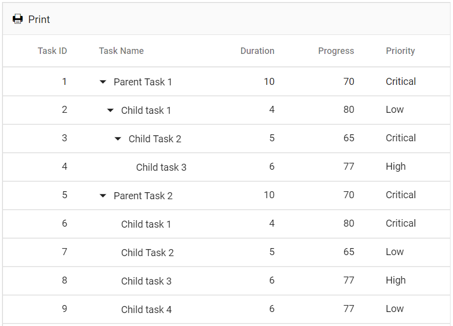
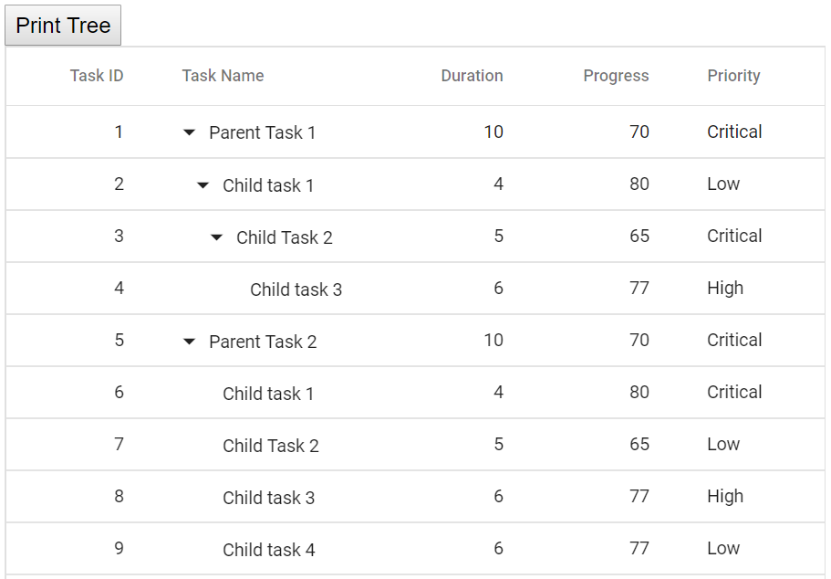

# Print

To print the Tree Grid, use the [`Print`](https://help.syncfusion.com/cr/blazor/Syncfusion.Blazor~Syncfusion.Blazor.TreeGrid.SfTreeGrid~Print.html) method from tree grid instance. The print option can be displayed on the [`Toolbar`](https://help.syncfusion.com/cr/blazor/Syncfusion.Blazor~Syncfusion.Blazor.TreeGrid.SfTreeGrid~Toolbar.html) by adding the **Print** toolbar item.



@using TreeGridComponent.Data;
@using Syncfusion.Blazor.TreeGrid;

<SfTreeGrid DataSource="@TreeGridData" Toolbar="@(new List<string>() { "Print" })" IdMapping="TaskId" AllowSelection="true" ParentIdMapping="ParentId" TreeColumnIndex="1">
    <TreeGridColumns>
        <TreeGridColumn Field="TaskId" HeaderText="Task ID" Width="80" TextAlign="Syncfusion.Blazor.Grids.TextAlign.Right"></TreeGridColumn>
        <TreeGridColumn Field="TaskName" HeaderText="Task Name" Width="160"></TreeGridColumn>
        <TreeGridColumn Field="Duration" HeaderText="Duration" Width="100" TextAlign="Syncfusion.Blazor.Grids.TextAlign.Right"></TreeGridColumn>
        <TreeGridColumn Field="Progress" HeaderText="Progress" Width="100" TextAlign="Syncfusion.Blazor.Grids.TextAlign.Right"></TreeGridColumn>
        <TreeGridColumn Field="Priority" HeaderText="Priority" Width="80"></TreeGridColumn>
    </TreeGridColumns>
</SfTreeGrid>

@code{
    public List<TreeData.BusinessObject> TreeGridData { get; set; }
    protected override void OnInitialized()
    {
        this.TreeGridData = TreeData.GetSelfDataSource().ToList();
    }
}



The following output is displayed as a result of the above code example.

## Page setup

Some of the print options cannot be configured through JavaScript code. So, you have to customize the layout, paper size, and margin options using the browser page setup dialog. Please refer to the following links to know more about the browser page setup:

* [`Chrome`](https://support.google.com/chrome/answer/1069693?hl=en&visit_id=1-636335333734668335-3165046395&rd=1)
* [`Firefox`](https://support.mozilla.org/en-US/kb/how-print-web-pages-firefox)
* [`Safari`](http://www.mintprintables.com/print-tips/adjust-margins-osx/)
* [`IE`](http://www.helpteaching.com/help/print/index.htm)

## Print using an external button

To print the tree grid from an external button, invoke the [`Print`](https://help.syncfusion.com/cr/blazor/Syncfusion.Blazor~Syncfusion.Blazor.TreeGrid.SfTreeGrid~Print.html) method.



@using TreeGridComponent.Data;
@using Syncfusion.Blazor.TreeGrid;

<input type="button" @onclick="onClick" value="Print Tree" />

<SfTreeGrid DataSource="@TreeGridData" @ref="TreeGrid" IdMapping="TaskId" ParentIdMapping="ParentId" TreeColumnIndex="1">
    <TreeGridColumns>
        <TreeGridColumn Field="TaskId" HeaderText="Task ID" Width="80" TextAlign="Syncfusion.Blazor.Grids.TextAlign.Right"></TreeGridColumn>
        <TreeGridColumn Field="TaskName" HeaderText="Task Name" Width="160"></TreeGridColumn>
        <TreeGridColumn Field="Duration" HeaderText="Duration" Width="100" TextAlign="Syncfusion.Blazor.Grids.TextAlign.Right"></TreeGridColumn>
        <TreeGridColumn Field="Progress" HeaderText="Progress" Width="100" TextAlign="Syncfusion.Blazor.Grids.TextAlign.Right"></TreeGridColumn>
        <TreeGridColumn Field="Priority" HeaderText="Priority" Width="80"></TreeGridColumn>
    </TreeGridColumns>
</SfTreeGrid>

@code{
    SfTreeGrid<TreeData.BusinessObject> TreeGrid;
    public List<TreeData.BusinessObject> TreeGridData { get; set; }
    protected override void OnInitialized()
    {
        this.TreeGridData = TreeData.GetSelfDataSource().ToList();
    }
    private void onClick()
    {
        TreeGrid.Print();
    }
}



The following output is displayed as a result of the above code example.

## Print the visible page

By default, the tree grid prints all the pages. To print the current page alone, set the [`PrintMode`](https://help.syncfusion.com/cr/blazor/Syncfusion.Blazor~Syncfusion.Blazor.TreeGrid.SfTreeGrid~PrintMode.html) to **CurrentPage**.



@using TreeGridComponent.Data;
@using Syncfusion.Blazor.TreeGrid;

<SfTreeGrid DataSource="@TreeGridData" Toolbar="@(new List<string>() { "Print" })" PrintMode="Syncfusion.Blazor.Grids.PrintMode.CurrentPage" AllowPaging="true" IdMapping="TaskId" ParentIdMapping="ParentId" TreeColumnIndex="1">
    <TreeGridPageSettings PageSize="2" PageSizeMode="PageSizeMode.Root"></TreeGridPageSettings>
    <TreeGridColumns>
        <TreeGridColumn Field="TaskId" HeaderText="Task ID" Width="80" TextAlign="Syncfusion.Blazor.Grids.TextAlign.Right"></TreeGridColumn>
        <TreeGridColumn Field="TaskName" HeaderText="Task Name" Width="160"></TreeGridColumn>
        <TreeGridColumn Field="Duration" HeaderText="Duration" Width="100" TextAlign="Syncfusion.Blazor.Grids.TextAlign.Right"></TreeGridColumn>
        <TreeGridColumn Field="Progress" HeaderText="Progress" Width="100" TextAlign="Syncfusion.Blazor.Grids.TextAlign.Right"></TreeGridColumn>
        <TreeGridColumn Field="Priority" HeaderText="Priority" Width="80"></TreeGridColumn>
    </TreeGridColumns>
</SfTreeGrid>

@code{
    public List<TreeData.BusinessObject> TreeGridData { get; set; }
    protected override void OnInitialized()
    {
        this.TreeGridData = TreeData.GetSelfDataSource().ToList();
    }
}



The following output is displayed as a result of the above code example.

## Print large number of columns

By default, the browser uses A4 as page size option to print pages and to adapt the size of the page the browser print preview will auto-hide the overflowed contents. Hence tree grid with large number of columns will cut off to adapt the print page.

To show large number of columns when printing, adjust the scale option from print option panel based on your content size.

<!-- Show or Hide columns while Printing

You can show a hidden column or hide a visible column while printing the tree grid using [`ToolbarClick`](https://help.syncfusion.com/cr/blazor/Syncfusion.Blazor~Syncfusion.Blazor.TreeGrid.SfTreeGrid~ToolbarClick.html) events.

In [`ToolbarClick`](https://help.syncfusion.com/cr/blazor/Syncfusion.Blazor~Syncfusion.Blazor.TreeGrid.SfTreeGrid~ToolbarClick.html) event, based on **args.Item.Text** as **print**. We can show or hide columns by setting [`Visible`](https://help.syncfusion.com/cr/blazor/Syncfusion.Blazor~Syncfusion.Blazor.TreeGrid.TreeGridColumn~Visible.htmll) of [`TreeGridColumn`](https://help.syncfusion.com/cr/blazor/Syncfusion.Blazor~Syncfusion.Blazor.TreeGrid.TreeGridColumn.html) property to **true** or **false** respectively.

In [`PrintComplete`](https://help.syncfusion.com/cr/blazor/Syncfusion.Blazor~Syncfusion.Blazor.TreeGrid.SfTreeGrid~PrintComplete.html) event, We have reversed the state back to the previous state.

In the below example, we have **Duration** as a hidden column in the tree grid. While printing, we have changed **Duration** to visible column and **StartDate** as hidden column.
-->

## Limitations of printing large data

When tree grid contains large number of data, printing all the data at once is not a best option for the browser performance. Because to render all the DOM elements in one page will produce performance issues in the browser. It leads to browser slow down or browser hang.

If printing of all the data is still needed, we suggest to Export the tree grid to **Excel** or **CSV** or **Pdf** and then print it from another non-web based application.