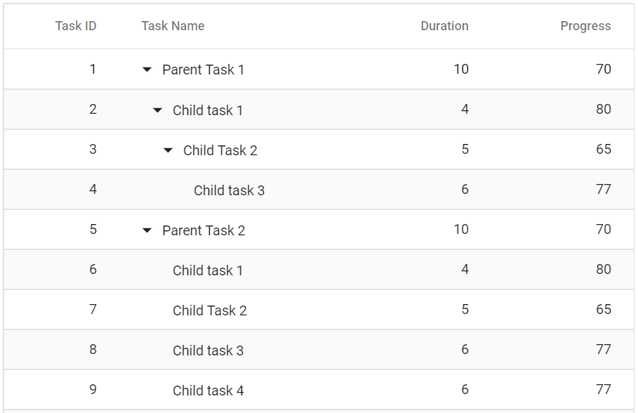
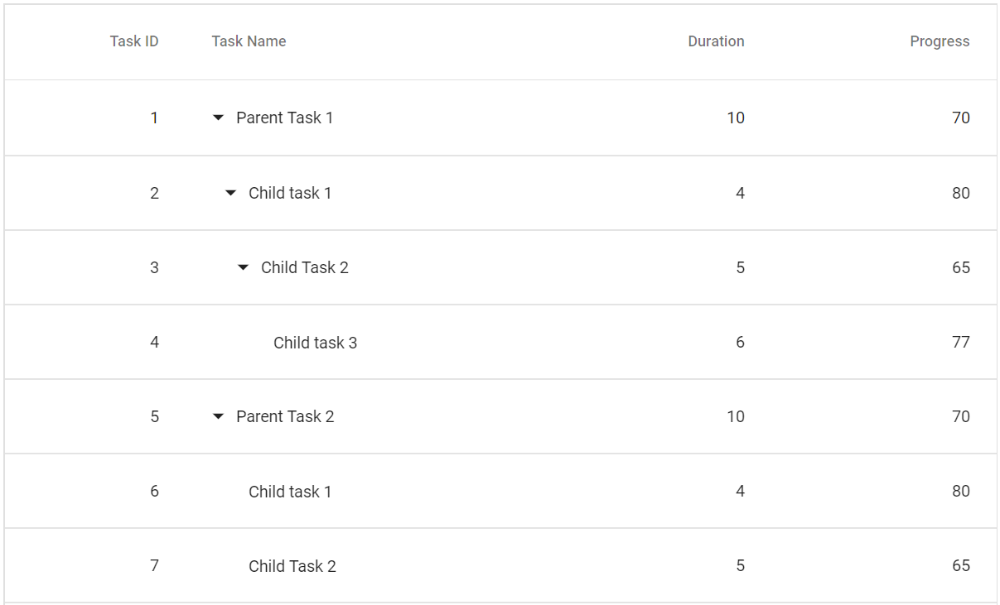
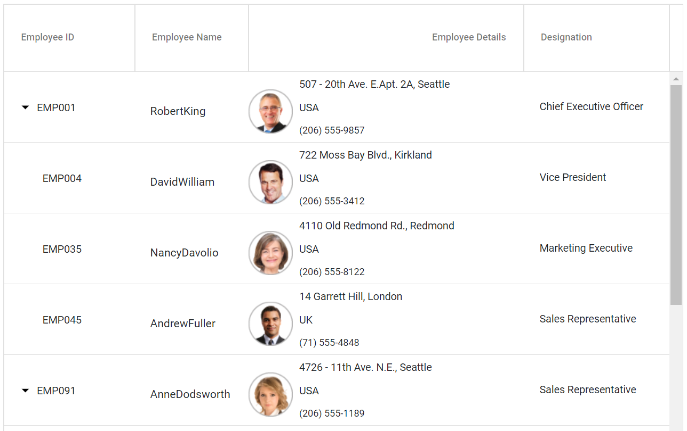
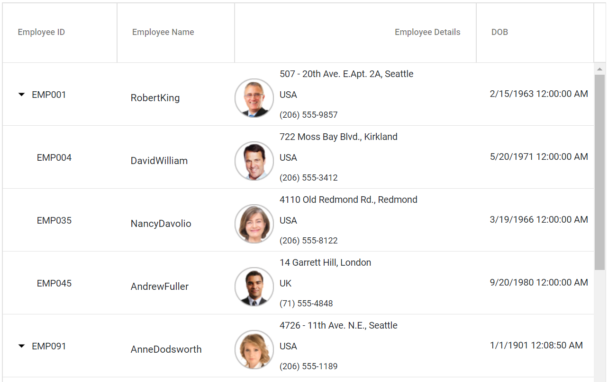
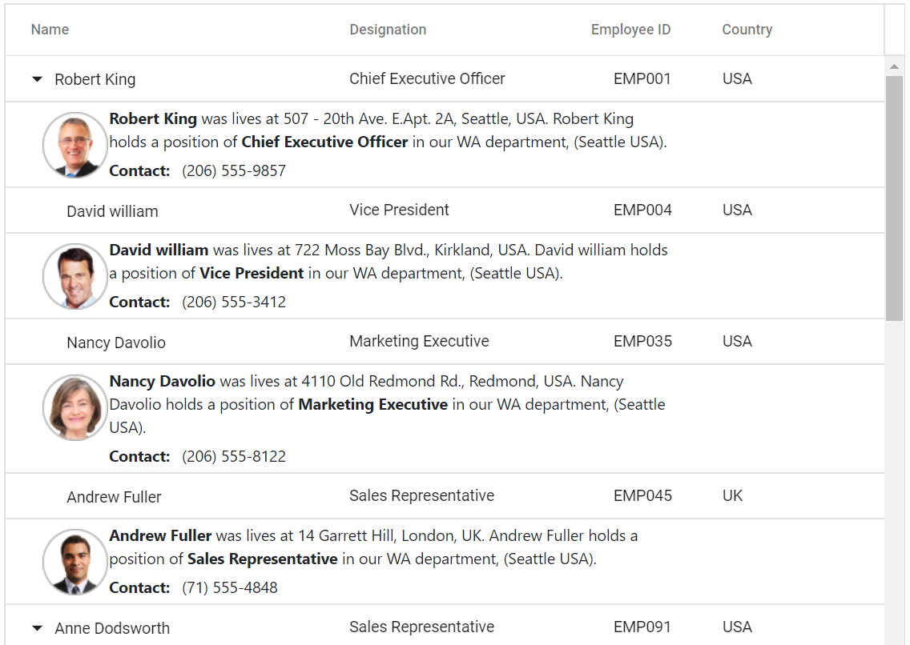
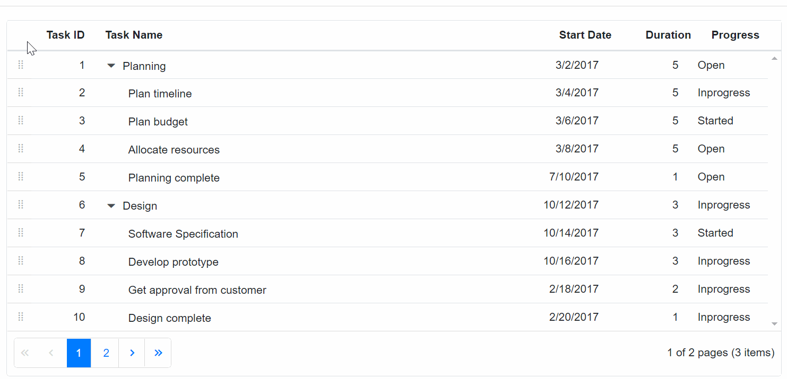
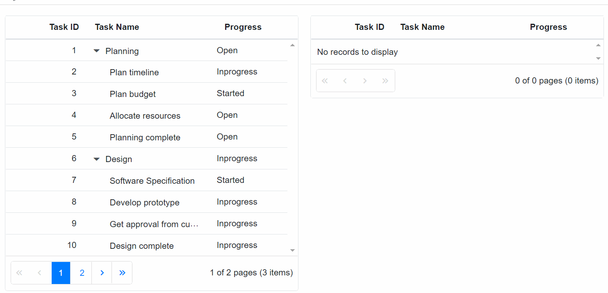

# Row

The row represents record details fetched from data source.

## Customize rows

You can customize the appearance of a row by using the [`RowDataBound`](https://help.syncfusion.com/cr/blazor/Syncfusion.Blazor~Syncfusion.Blazor.TreeGrid.SfTreeGrid~RowDataBound.html) event.
The [`RowDataBound`](https://help.syncfusion.com/cr/blazor/Syncfusion.Blazor~Syncfusion.Blazor.TreeGrid.SfTreeGrid~RowDataBound.html) event triggers for every row. In the event handler, you can get the **args** which contains details of the row.





The following output is displayed as a result of the above code example.


## Styling alternate rows

 You can change the tree grid's alternative rows' background color by overriding the **.e-altrow** class.

```css
.e-treegrid .e-altrow {
    background-color: #fafafa;
}
```

Please refer to the following example.





The following output is displayed as a result of the above code example.



## Row height

You can customize the row height of tree grid rows through the [`RowHeight`](https://help.syncfusion.com/cr/blazor/Syncfusion.Blazor~Syncfusion.Blazor.TreeGrid.SfTreeGrid~RowHeight.html) property. The [`RowHeight`](https://help.syncfusion.com/cr/blazor/Syncfusion.Blazor~Syncfusion.Blazor.TreeGrid.SfTreeGrid~RowHeight.html) property is used to change the row height of entire tree grid rows.

In the below example, the **RowHeight** is set as *60px*.





The following output is displayed as a result of the above code example.



## Row template

The **RowTemplate** has an option to customise the look and behavior of the tree grid rows. The [`RowTemplate`](https://help.syncfusion.com/cr/blazor/Syncfusion.Blazor~Syncfusion.Blazor.TreeGrid.SfTreeGrid~RowTemplate.html) property accepts either
the **template** string or HTML elements.





The following output is displayed as a result of the above code example.



### Row template with formatting

If [`RowTemplate`](https://help.syncfusion.com/cr/blazor/Syncfusion.Blazor~Syncfusion.Blazor.TreeGrid.SfTreeGrid~RowTemplate.html) is used, the value cannot be  formatted  inside the template using the [`Format`](https://help.syncfusion.com/cr/blazor/Syncfusion.Blazor~Syncfusion.Blazor.TreeGrid.TreeGridColumn~Format.html) property. In that case, a function should be defined globally to format the value and invoke it inside the template.





The following output is displayed as a result of the above code example.



### Limitations

Row template feature is not compatible with all the features which are available in tree grid and it has limited features support. Here we have listed out the features which are compatible with row template feature.

* Filtering
* Paging
* Sorting
* Scrolling
* Searching
* Rtl
* Context Menu
* State Persistence

## Detail template

The detail template provides additional information about a particular row. By expanding the parent row the child rows are expanded along with their detail template. The [`DetailTemplate`](https://help.syncfusion.com/cr/blazor/Syncfusion.Blazor~Syncfusion.Blazor.TreeGrid.SfTreeGrid~DetailTemplate.html) property accepts either the template string or HTML elements.





The following output is displayed as a result of the above code example.



<!-- Customize row height for particular row

Grid row height for particular row can be customized using the [`RowDataBound`](https://help.syncfusion.com/cr/blazor/Syncfusion.Blazor~Syncfusion.Blazor.TreeGrid.SfTreeGrid~RowDataBound.html)
event by setting the [`RowHeight`](https://help.syncfusion.com/cr/blazor/Syncfusion.Blazor~Syncfusion.Blazor.TreeGrid.SfTreeGrid~RowHeight.html) in arguments for each row based on the requirement.

In the below example, the row height for the row with Task ID as 3 is set as 90px using the [`RowDataBound`](https://help.syncfusion.com/cr/blazor/Syncfusion.Blazor~Syncfusion.Blazor.TreeGrid.SfTreeGrid~RowDataBound.html) event.

```csharp

@using TreeGridComponent.Data
@using Syncfusion.Blazor.Grids;
@using Syncfusion.Blazor.Data;

<SfTreeGrid ChildMapping="Children" TreeColumnIndex="1" RowDataBound="@onRowDataBound">
    <SfDataManager Json="@TreeGridData" Adaptor="Syncfusion.Blazor.Adaptors.JsonAdaptor"></SfDataManager>
    <TreeGridColumns>
        <TreeGridColumn Field="TaskId" HeaderText="Task ID" Width="80" TextAlign="Syncfusion.Blazor.Grids.TextAlign.Right"></TreeGridColumn>
        <TreeGridColumn Field="TaskName" HeaderText="Task Name" Width="160"></TreeGridColumn>
        <TreeGridColumn Field="Duration" HeaderText="Duration" Width="100" TextAlign="Syncfusion.Blazor.Grids.TextAlign.Right"></TreeGridColumn>
        <TreeGridColumn Field="Progress" HeaderText="Progress" Width="100" TextAlign="Syncfusion.Blazor.Grids.TextAlign.Right"></TreeGridColumn>
    </TreeGridColumns>
</SfTreeGrid>

@code{
    public List<TreeData.BusinessObject> TreeGridData { get; set; }

    protected override void OnInitialized()
    {
        this.TreeGridData = TreeData.GetDefaultData().ToList();
    }
    private void onRowDataBound(RowDataBoundEventArgs args)
    {
        int val = int.Parse(args.Data.GetType().GetProperty("TaskId").GetValue(args.Data, null).ToString());
        if (val == 3)
        {
            args.RowHeight = 90;
        }
    }
}

```
-->

### See Also

* [TreeGridTemplates component](./templates/#treegridtemplates-component)

## Drag and drop

The Tree Grid rows can be reordered, dropped to another Tree Grid or custom control by enabling the [`AllowRowDragAndDrop`](https://help.syncfusion.com/cr/aspnetcore-blazor/Syncfusion.Blazor~Syncfusion.Blazor.TreeGrid.TreeGridModel%601~AllowRowDragAndDrop.html) to true.

### Drag and drop within TreeGrid

The Tree Grid row drag and drop allows you to drag and drop Tree Grid rows on the same Tree Grid using drag icon. To enable row drag and drop, set the [`AllowRowDragAndDrop`](https://help.syncfusion.com/cr/aspnetcore-blazor/Syncfusion.Blazor~Syncfusion.Blazor.TreeGrid.TreeGridModel%601~AllowRowDragAndDrop.html) to true. It provides the way to drop the row above, below or child to the target row with respective to the target row position.





The following output is displayed as a result of the above code example.



> Selection feature must be enabled for row drag and drop.
> For multiple row selection, the type property must be set to multiple.

### Drag and drop to another TreeGrid

To drag and drop between two Tree Grid, enable the [`AllowRowDragAndDrop`](https://help.syncfusion.com/cr/aspnetcore-blazor/Syncfusion.Blazor~Syncfusion.Blazor.TreeGrid.TreeGridModel%601~AllowRowDragAndDrop.html) property and specify the target Tree Grid ID in [`TargetID`](https://help.syncfusion.com/cr/aspnetcore-blazor/Syncfusion.Blazor~Syncfusion.Blazor.TreeGrid.TreeGridRowDropSettings~TargetID.html) property of [`RowDropSettings`](https://help.syncfusion.com/cr/aspnetcore-blazor/Syncfusion.Blazor~Syncfusion.Blazor.TreeGrid.TreeGridRowDropSettings).





The following output is displayed as a result of the above code example.



### Drag and drop events

The following events are triggered while drag and drop the tree grid rows.

[`OnRowDragStart`](https://help.syncfusion.com/cr/blazor/Syncfusion.Blazor.TreeGrid.TreeGridEvents-1.html#Syncfusion_Blazor_TreeGrid_TreeGridEvents_1_OnRowDragStart) -Triggers when starts to drag the tree grid row.

[`RowDropped`](https://help.syncfusion.com/cr/blazor/Syncfusion.Blazor.TreeGrid.TreeGridEvents-1.html#Syncfusion_Blazor_TreeGrid_TreeGridEvents_1_RowDropped) - Triggers when a drag element is dropped on the target element.