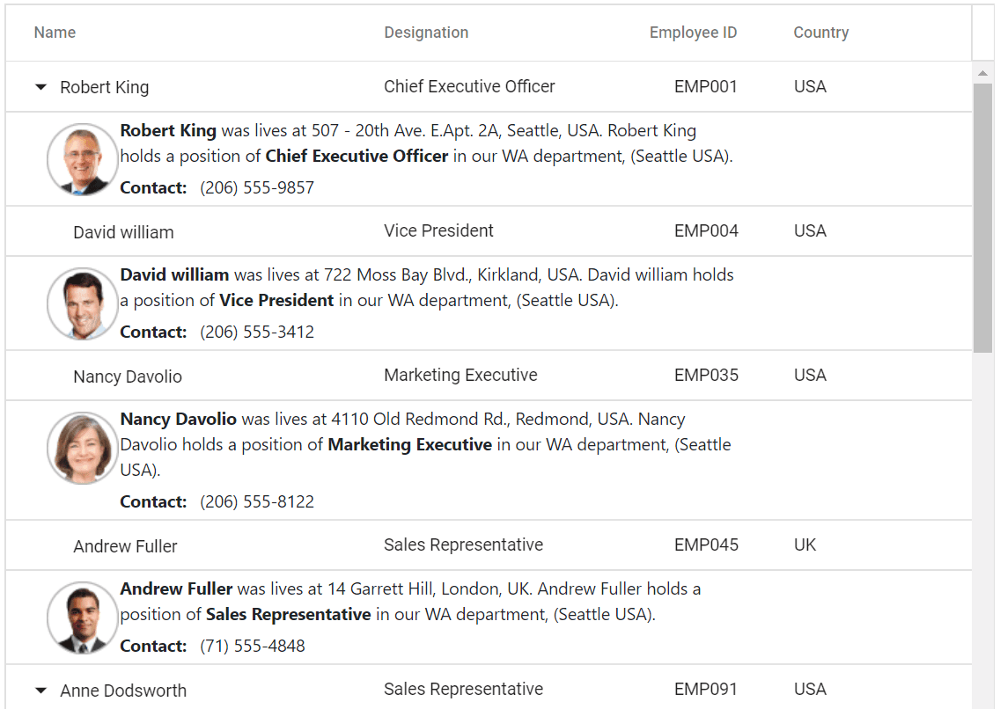

# Detail Template in Blazor Tree Grid Component

The detail template provides additional information about a particular row. By expanding the parent row, the child rows are expanded along with their detail template. The [DetailTemplate](https://help.syncfusion.com/cr/blazor/Syncfusion.Blazor.TreeGrid.SfTreeGrid-1.html#Syncfusion_Blazor_TreeGrid_SfTreeGrid_1_DetailTemplate) property accepts either the template string or HTML elements.





@using TreeGridComponent.Data
@using Syncfusion.Blazor.TreeGrid;
@inject Microsoft.AspNetCore.Components.NavigationManager UriHelper

<SfTreeGrid Height="400" DataSource="@TreeData" IdMapping="EmployeeID" ParentIdMapping="ParentId" TreeColumnIndex="0">
    <TreeGridTemplates>
        <DetailTemplate>
            

                
            

            

                

                    <b>@((context as Employee).Name)</b> was lives at @((context as Employee).Address), @((context as Employee).Country). @((context as Employee).Name) holds a position of <b>@((context as Employee).Designation)</b> in our WA department, (Seattle USA).
                

                

                    <b style="margin-right:10px;">Contact:</b>@((context as Employee).Contact)
                

            

        </DetailTemplate>
    </TreeGridTemplates>
    <TreeGridColumns>
        <TreeGridColumn Field="Name" HeaderText="Name" Width="160"></TreeGridColumn>
        <TreeGridColumn Field="DOB" HeaderText="DOB" Width="10" Type="Syncfusion.Blazor.Grids.ColumnType.Date" Format="yMd"></TreeGridColumn>
        <TreeGridColumn Field="Designation" HeaderText="Designation" Width="120"></TreeGridColumn>
        <TreeGridColumn Field="EmpID" HeaderText="Employee ID" Width="80" TextAlign="Syncfusion.Blazor.Grids.TextAlign.Right"></TreeGridColumn>
        <TreeGridColumn Field="Country" HeaderText="Country" Width="100"></TreeGridColumn>
    </TreeGridColumns>
</SfTreeGrid>

@code{
    public Employee model = new Employee();
    public IEnumerable<Employee> TreeData { get; set; }
    protected override void OnInitialized()
    {
        this.TreeData = Employee.GetTemplateData();
    }
}





namespace TreeGridComponent.Data {

public class Employee
    {
        public string Name { get; set; }
        public string FullName { get; set; }
        public DateTime? DOB { get; set; }
        public string Designation { get; set; }
        public string EmpID { get; set; }
        public int? EmployeeID { get; set; }
        public string Country { get; set; }
        public string Address { get; set; }
        public string Contact { get; set; }
        public int? ParentId { get; set; }
        public TreeData Treedata { get; set; }

        public static List<Employee> GetTemplateData()
        {
            List<Employee> DataCollection = new List<Employee>();

            DataCollection.Add(new Employee { Name = "Robert King",FullName = "RobertKing",Designation = "Chief Executive Officer",EmployeeID = 1,EmpID = "EMP001",Address = "507 - 20th Ave. E.Apt. 2A, Seattle",Contact = "(206) 555-9857",Country = "USA",DOB = new DateTime(1963, 2, 15),ParentId = null,Treedata = new TreeData() { ID = 21}});
            DataCollection.Add(new Employee { Name = "David william",FullName = "DavidWilliam",Designation = "Vice President",EmployeeID = 2,EmpID = "EMP004",Address = "722 Moss Bay Blvd., Kirkland",Contact = "(206) 555-3412",Country = "USA",DOB = new DateTime(1971, 5, 20),ParentId = 1,Treedata = new TreeData() { ID = 21 }});
            DataCollection.Add(new Employee { Name = "Nancy Davolio",FullName = "NancyDavolio",Designation = "Marketing Executive",EmployeeID = 3,EmpID = "EMP035",Address = "4110 Old Redmond Rd., Redmond",Contact = "(206) 555-8122",Country = "USA",DOB = new DateTime(1966, 3, 19),ParentId = 1,Treedata = new TreeData() { ID = 21 }});
            DataCollection.Add(new Employee { Name = "Andrew Fuller",FullName = "AndrewFuller",Designation = "Sales Representative",EmployeeID = 4,EmpID = "EMP045",Country = "UK",DOB = new DateTime(1980, 9, 20),ParentId = 1,Treedata = new TreeData() { ID = 21 }});
            return DataCollection;
        }
    }
}





