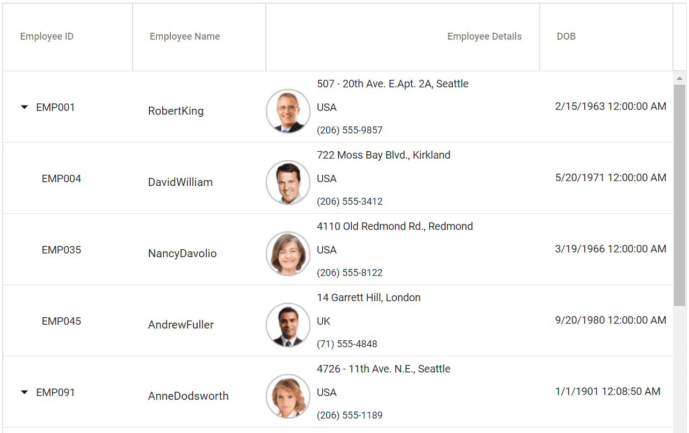

# Row Template in Blazor TreeGrid Component

The following video demonstrates how to use the row template in the Blazor TreeGrid.



The [RowTemplate](https://help.syncfusion.com/cr/blazor/Syncfusion.Blazor.TreeGrid.SfTreeGrid-1.html#Syncfusion_Blazor_TreeGrid_SfTreeGrid_1_RowTemplate) has an option to customize the look and behavior of the tree grid rows. The `RowTemplate` property accepts either the **template** string or HTML elements.





@using TreeGridComponent.Data
@using Syncfusion.Blazor.TreeGrid;
@inject Microsoft.AspNetCore.Components.NavigationManager UriHelper

<SfTreeGrid Height="335" DataSource="@TreeData" IdMapping="EmployeeID" ParentIdMapping="ParentId" TreeColumnIndex="0" RowHeight="83" GridLines="Syncfusion.Blazor.Grids.GridLine.Vertical">
    <TreeGridTemplates>
        <RowTemplate>
            <td style='padding-left:18px; border-bottom: 0.5px solid #e0e0e0;'>
                <RowTemplateTreeColumn>
                    @{
                        var cntxt = context as Employee;
                        
@(cntxt.EmpID)

                    }
                </RowTemplateTreeColumn>
            </td>
            <td style='padding: 10px 0px 0px 20px; border-bottom: 0.5px solid #e0e0e0;'>
                

                    @((context as Employee).FullName)
                

            </td>
            <td style="border-bottom: 0.5px solid #e0e0e0;">
                

                    

                        
                    

                    

                        
@((context as Employee).Address)

                        
@((context as Employee).Country)

                        
@((context as Employee).Contact)

                    

                

            </td>
            <td style='padding-left: 20px; border-bottom: 0.5px solid #e0e0e0;'>
                
@((context as Employee).Designation)

            </td>
        </RowTemplate>
    </TreeGridTemplates>
    <TreeGridColumns>
        <TreeGridColumn Field="EmpID" HeaderText="Employee ID" Width="160"></TreeGridColumn>
        <TreeGridColumn Field="Name" HeaderText="Employee Name"></TreeGridColumn>
        <TreeGridColumn Field="Address" HeaderText="Employee Details" Width="340" TextAlign="Syncfusion.Blazor.Grids.TextAlign.Right"></TreeGridColumn>
        <TreeGridColumn Field="Designation" HeaderText="Designation"></TreeGridColumn>
        </TreeGridColumns>
</SfTreeGrid>

@code{
    public Employee model = new Employee();
    public IEnumerable<Employee> TreeData { get; set; }
    protected override void OnInitialized()
    {
        this.TreeData = Employee.GetTemplateData();
    }
}





namespace TreeGridComponent.Data {

public class Employee
    {
        public string Name { get; set; }
        public string FullName { get; set; }
        public DateTime? DOB { get; set; }
        public string Designation { get; set; }
        public string EmpID { get; set; }
        public int? EmployeeID { get; set; }
        public string Country { get; set; }
        public string Address { get; set; }
        public string Contact { get; set; }
        public int? ParentId { get; set; }
        public TreeData Treedata { get; set; }

        public static List<Employee> GetTemplateData()
        {
            List<Employee> DataCollection = new List<Employee>();

            DataCollection.Add(new Employee { Name = "Robert King",FullName = "RobertKing",Designation = "Chief Executive Officer",EmployeeID = 1,EmpID = "EMP001",Address = "507 - 20th Ave. E.Apt. 2A, Seattle",Contact = "(206) 555-9857",Country = "USA",DOB = new DateTime(1963, 2, 15),ParentId = null,Treedata = new TreeData() { ID = 21}});
            DataCollection.Add(new Employee { Name = "David william",FullName = "DavidWilliam",Designation = "Vice President",EmployeeID = 2,EmpID = "EMP004",Address = "722 Moss Bay Blvd., Kirkland",Contact = "(206) 555-3412",Country = "USA",DOB = new DateTime(1971, 5, 20),ParentId = 1,Treedata = new TreeData() { ID = 21 }});
            DataCollection.Add(new Employee { Name = "Nancy Davolio",FullName = "NancyDavolio",Designation = "Marketing Executive",EmployeeID = 3,EmpID = "EMP035",Address = "4110 Old Redmond Rd., Redmond",Contact = "(206) 555-8122",Country = "USA",DOB = new DateTime(1966, 3, 19),ParentId = 1,Treedata = new TreeData() { ID = 21 }});
            DataCollection.Add(new Employee { Name = "Andrew Fuller",FullName = "AndrewFuller",Designation = "Sales Representative",EmployeeID = 4,EmpID = "EMP045",Country = "UK",DOB = new DateTime(1980, 9, 20),ParentId = 1,Treedata = new TreeData() { ID = 21 }});
            return DataCollection;
        }
    }
}





## Row template with formatting

When [RowTemplate](https://help.syncfusion.com/cr/blazor/Syncfusion.Blazor.TreeGrid.SfTreeGrid-1.html#Syncfusion_Blazor_TreeGrid_SfTreeGrid_1_RowTemplate) is used, values cannot be formatted using the column [Format](https://help.syncfusion.com/cr/blazor/Syncfusion.Blazor.TreeGrid.TreeGridColumn.html#Syncfusion_Blazor_TreeGrid_TreeGridColumn_Format) property inside the template. Define a helper method and invoke it within the template to format values as needed.





@using TreeGridComponent.Data
@using Syncfusion.Blazor.TreeGrid;
@inject Microsoft.AspNetCore.Components.NavigationManager UriHelper

<SfTreeGrid ID="TreeGrid" Height="335" DataSource="@TreeData" IdMapping="EmployeeID" ParentIdMapping="ParentId" TreeColumnIndex="0" RowHeight="83" GridLines="Syncfusion.Blazor.Grids.GridLine.Vertical">
    <TreeGridTemplates>
        <RowTemplate>
            <td style='padding-left:18px; border-bottom: 0.5px solid #e0e0e0;'>
                <RowTemplateTreeColumn>
                                @{
                                    var cntxt = context as Employee;
                                    
@(cntxt.EmpID)

                                }
                            </RowTemplateTreeColumn>
            </td>
            <td style='padding: 10px 0px 0px 20px; border-bottom: 0.5px solid #e0e0e0;'>
                

                    @((context as Employee).FullName)
                

            </td>
            <td style="border-bottom: 0.5px solid #e0e0e0;">
                

                    

                        
                    

                    

                        
@((context as Employee).Address)

                        
@((context as Employee).Country)

                        
@((context as Employee).Contact)

                    

                

            </td>
            <td style='padding-left: 20px; border-bottom: 0.5px solid #e0e0e0;'>
                
@Format((context as Employee).DOB))

            </td>
        </RowTemplate>
    </TreeGridTemplates>
    <TreeGridColumns>
        <TreeGridColumn Field="EmpID" HeaderText="Employee ID" Width="160"></TreeGridColumn>
        <TreeGridColumn Field="Name" HeaderText="Employee Name"></TreeGridColumn>
        <TreeGridColumn Field="Address" HeaderText="Employee Details" Width="340" TextAlign="Syncfusion.Blazor.Grids.TextAlign.Right"></TreeGridColumn>
        <TreeGridColumn Field="DOB" HeaderText="DOB"></TreeGridColumn>
        </TreeGridColumns>
</SfTreeGrid>

@code{
    public Employee model = new Employee();
    public IEnumerable<Employee> TreeData { get; set; }
    protected override void OnInitialized()
    {
        this.TreeData = Employee.GetTemplateData();
    }
    public object Format(DateTime? DOB) {
        return DOB.Value.ToLocalTime();
    }
}





namespace TreeGridComponent.Data {

public class Employee
    {
        public string Name { get; set; }
        public string FullName { get; set; }
        public DateTime? DOB { get; set; }
        public string Designation { get; set; }
        public string EmpID { get; set; }
        public int? EmployeeID { get; set; }
        public string Country { get; set; }
        public string Address { get; set; }
        public string Contact { get; set; }
        public int? ParentId { get; set; }
        public TreeData Treedata { get; set; }

        public static List<Employee> GetTemplateData()
        {
            List<Employee> DataCollection = new List<Employee>();

            DataCollection.Add(new Employee { Name = "Robert King",FullName = "RobertKing",Designation = "Chief Executive Officer",EmployeeID = 1,EmpID = "EMP001",Address = "507 - 20th Ave. E.Apt. 2A, Seattle",Contact = "(206) 555-9857",Country = "USA",DOB = new DateTime(1963, 2, 15),ParentId = null,Treedata = new TreeData() { ID = 21}});
            DataCollection.Add(new Employee { Name = "David william",FullName = "DavidWilliam",Designation = "Vice President",EmployeeID = 2,EmpID = "EMP004",Address = "722 Moss Bay Blvd., Kirkland",Contact = "(206) 555-3412",Country = "USA",DOB = new DateTime(1971, 5, 20),ParentId = 1,Treedata = new TreeData() { ID = 21 }});
            DataCollection.Add(new Employee { Name = "Nancy Davolio",FullName = "NancyDavolio",Designation = "Marketing Executive",EmployeeID = 3,EmpID = "EMP035",Address = "4110 Old Redmond Rd., Redmond",Contact = "(206) 555-8122",Country = "USA",DOB = new DateTime(1966, 3, 19),ParentId = 1,Treedata = new TreeData() { ID = 21 }});
            DataCollection.Add(new Employee { Name = "Andrew Fuller",FullName = "AndrewFuller",Designation = "Sales Representative",EmployeeID = 4,EmpID = "EMP045",Country = "UK",DOB = new DateTime(1980, 9, 20),ParentId = 1,Treedata = new TreeData() { ID = 21 }});
            return DataCollection;
        }
    }
}





## Limitations

The row template replaces default cell rendering and has limited compatibility with certain features. The following TreeGrid features are compatible with row templates:

* Filtering
* Paging
* Sorting
* Scrolling
* Searching
* RTL
* Context Menu

* State Persistence
