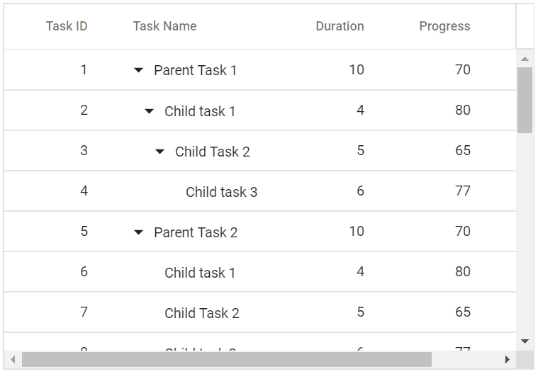

# Scrolling

The scrollbar will be displayed in the tree grid when content exceeds the element [`Width`](https://help.syncfusion.com/cr/blazor/Syncfusion.Blazor~Syncfusion.Blazor.TreeGrid.SfTreeGrid~Width.html) or [`Height`](https://help.syncfusion.com/cr/blazor/Syncfusion.Blazor~Syncfusion.Blazor.TreeGrid.SfTreeGrid~Height.html). The vertical and horizontal scrollbars will be displayed based on the following criteria:

The vertical scrollbar appears when the total height of rows present in the tree grid exceeds its element height.
The horizontal scrollbar appears when the sum of columns width exceeds the tree grid element width.
The [`Height`](https://help.syncfusion.com/cr/blazor/Syncfusion.Blazor~Syncfusion.Blazor.TreeGrid.SfTreeGrid~Height.html) and [`Width`](https://help.syncfusion.com/cr/blazor/Syncfusion.Blazor~Syncfusion.Blazor.TreeGrid.SfTreeGrid~Width.html) are used to set the tree grid height and width, respectively.

> The default value for [`Height`](https://help.syncfusion.com/cr/blazor/Syncfusion.Blazor~Syncfusion.Blazor.TreeGrid.SfTreeGrid~Height.html) and [`Width`](https://help.syncfusion.com/cr/blazor/Syncfusion.Blazor~Syncfusion.Blazor.TreeGrid.SfTreeGrid~Width.html) is **auto**.

## Set width and height

To specify the [`Height`](https://help.syncfusion.com/cr/blazor/Syncfusion.Blazor~Syncfusion.Blazor.TreeGrid.SfTreeGrid~Height.html) and [`Width`](https://help.syncfusion.com/cr/blazor/Syncfusion.Blazor~Syncfusion.Blazor.TreeGrid.SfTreeGrid~Width.html) of the scroller in the pixel, set the pixel value to a number.





The following output is displayed as a result of the above code example.



## Responsive with parent container

Specify the [`Height`](https://help.syncfusion.com/cr/blazor/Syncfusion.Blazor~Syncfusion.Blazor.TreeGrid.SfTreeGrid~Height.html) and [`Width`](https://help.syncfusion.com/cr/blazor/Syncfusion.Blazor~Syncfusion.Blazor.TreeGrid.SfTreeGrid~Width.html) as **100%** to make the tree grid element fill its parent container.
Setting the [`Height`](https://help.syncfusion.com/cr/blazor/Syncfusion.Blazor~Syncfusion.Blazor.TreeGrid.SfTreeGrid~Height.html) to **100%** requires the tree grid parent element to have explicit height.





<!--
Scroll to selected row

You can scroll the tree grid content to the selected row position by using the [`RowSelected`](https://help.syncfusion.com/cr/blazor/Syncfusion.Blazor~Syncfusion.Blazor.TreeGrid.SfTreeGrid~RowSelected.html) event.

```csharp

@using TreeGridComponent.Data;
@using Syncfusion.Blazor.TreeGrid;
@using Syncfusion.Blazor.Grids

<SfTreeGrid ref="@treeGrid" Height="300" DataSource="@TreeGridData" IdMapping="TaskId" RowSelected="onRowSelected" ParentIdMapping="ParentId" TreeColumnIndex="1">
    <TreeGridColumns>
        <TreeGridColumn Field="TaskId" HeaderText="Task ID" Width="80" TextAlign="Syncfusion.Blazor.Grids.TextAlign.Right"></TreeGridColumn>
        <TreeGridColumn Field="TaskName" HeaderText="Task Name" Width="160"></TreeGridColumn>
        <TreeGridColumn Field="Duration" HeaderText="Duration" Width="100" TextAlign="Syncfusion.Blazor.Grids.TextAlign.Right"></TreeGridColumn>
        <TreeGridColumn Field="Progress" HeaderText="Progress" Width="100" TextAlign="Syncfusion.Blazor.Grids.TextAlign.Right"></TreeGridColumn>
        <TreeGridColumn Field="Priority" HeaderText="Priority" Width="80"></TreeGridColumn>
    </TreeGridColumns>
</SfTreeGrid>

@code{
    SfTreeGrid treeGrid;
    public object[] TreeGridData { get; set; }
    protected override void OnInitialized()
    {
        this.TreeGridData = TreeData.GetSelfDataSource().ToList().Cast<object>().ToArray();
    }
    private void onRowSelected(object args)
    {
        treeGrid.GetContent().
    }
}

```
-->

## Frozen rows and columns

Frozen rows and columns provides an option to make rows and columns always visible in the top and left side of the tree grid while scrolling.

In this demo, the [`FrozenColumns`](https://help.syncfusion.com/cr/blazor/Syncfusion.Blazor~Syncfusion.Blazor.TreeGrid.SfTreeGrid~FrozenColumns.html) is set as **2** and the [`FrozenRows`](https://help.syncfusion.com/cr/blazor/Syncfusion.Blazor~Syncfusion.Blazor.TreeGrid.SfTreeGrid~FrozenRows.html)
is set as **3**. Hence, the left two columns and top three rows are frozen.





The following output is displayed as a result of the above code example.


### Freeze particular columns

To freeze particular column in the tree grid, the [`IsFrozen`](https://help.syncfusion.com/cr/blazor/Syncfusion.Blazor~Syncfusion.Blazor.TreeGrid.SfTreeGrid~IsFrozen.html) property can be used.

In this demo, the columns with field name **TaskName** and **Duration** is frozen using
the [`IsFrozen`](https://help.syncfusion.com/cr/blazor/Syncfusion.Blazor~Syncfusion.Blazor.TreeGrid.SfTreeGrid~IsFrozen.html) property.





The following output is displayed as a result of the above code example.


### Limitations

The following features are not supported in frozen rows and columns:

* Row Template
* Detail Template
* Cell Editing