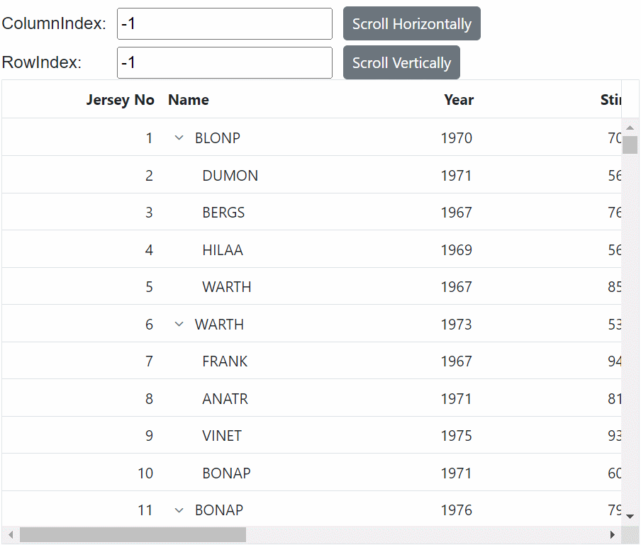

# Scrolling in Blazor TreeGrid Component

The scrollbar will be displayed in the tree grid when the content exceeds the element [Width](https://help.syncfusion.com/cr/blazor/Syncfusion.Blazor.TreeGrid.SfTreeGrid-1.html#Syncfusion_Blazor_TreeGrid_SfTreeGrid_1_Width) or [Height](https://help.syncfusion.com/cr/blazor/Syncfusion.Blazor.TreeGrid.SfTreeGrid-1.html#Syncfusion_Blazor_TreeGrid_SfTreeGrid_1_Height). The vertical and horizontal scrollbars will be displayed based on the following criteria:

The vertical scrollbar appears when the total height of rows present in the tree grid exceeds its element height. The horizontal scrollbar appears when the sum of the columns' width exceeds the tree grid element width. The [Height](https://help.syncfusion.com/cr/blazor/Syncfusion.Blazor.TreeGrid.SfTreeGrid-1.html#Syncfusion_Blazor_TreeGrid_SfTreeGrid_1_Height) and [Width](https://help.syncfusion.com/cr/blazor/Syncfusion.Blazor.TreeGrid.SfTreeGrid-1.html#Syncfusion_Blazor_TreeGrid_SfTreeGrid_1_Width) are used to set the tree grid height and width, respectively.

N> The default value for [Height](https://help.syncfusion.com/cr/blazor/Syncfusion.Blazor.TreeGrid.SfTreeGrid-1.html#Syncfusion_Blazor_TreeGrid_SfTreeGrid_1_Height) and [Width](https://help.syncfusion.com/cr/blazor/Syncfusion.Blazor.TreeGrid.SfTreeGrid-1.html#Syncfusion_Blazor_TreeGrid_SfTreeGrid_1_Width) is **auto**.

## Set width and height

To specify the [Height](https://help.syncfusion.com/cr/blazor/Syncfusion.Blazor.TreeGrid.SfTreeGrid-1.html#Syncfusion_Blazor_TreeGrid_SfTreeGrid_1_Height) and [Width](https://help.syncfusion.com/cr/blazor/Syncfusion.Blazor.TreeGrid.SfTreeGrid-1.html#Syncfusion_Blazor_TreeGrid_SfTreeGrid_1_Width) of the scroller in the pixel, set the pixel value to a number.





@using TreeGridComponent.Data;
@using Syncfusion.Blazor.TreeGrid;

<SfTreeGrid Width="500" Height="300" DataSource="@TreeGridData" IdMapping="TaskId" ParentIdMapping="ParentId" TreeColumnIndex="1">
    <TreeGridColumns>
        <TreeGridColumn Field="TaskId" HeaderText="Task ID" Width="80" TextAlign="Syncfusion.Blazor.Grids.TextAlign.Right"></TreeGridColumn>
        <TreeGridColumn Field="TaskName" HeaderText="Task Name" Width="160"></TreeGridColumn>
        <TreeGridColumn Field="Duration" HeaderText="Duration" Width="100" TextAlign="Syncfusion.Blazor.Grids.TextAlign.Right"></TreeGridColumn>
        <TreeGridColumn Field="Progress" HeaderText="Progress" Width="100" TextAlign="Syncfusion.Blazor.Grids.TextAlign.Right"></TreeGridColumn>
        <TreeGridColumn Field="Priority" HeaderText="Priority" Width="80"></TreeGridColumn>
    </TreeGridColumns>
</SfTreeGrid>

@code{
    public List<TreeData.BusinessObject> TreeGridData { get; set; }
    protected override void OnInitialized()
    {
        this.TreeGridData = TreeData.GetSelfDataSource().ToList();
    }
}





namespace TreeGridComponent.Data {

public class TreeData
    {
        public class BusinessObject
        {
            public int TaskId { get; set;}
            public string TaskName { get; set;}
            public int? Duration { get; set;}
            public int? Progress { get; set;}
            public string Priority { get; set;}
            public int? ParentId { get; set;}
        }

        public static List<BusinessObject> GetSelfDataSource()
        {
            List<BusinessObject> BusinessObjectCollection = new List<BusinessObject>();
            BusinessObjectCollection.Add(new BusinessObject() { TaskId = 1,TaskName = "Parent Task 1",Duration = 10,Progress = 70,Priority = "Critical",ParentId = null });
            BusinessObjectCollection.Add(new BusinessObject() { TaskId = 2,TaskName = "Child task 1",Progress = 80,Priority = "Low",ParentId = 1 });
            BusinessObjectCollection.Add(new BusinessObject() { TaskId = 3,TaskName = "Child Task 2",Duration = 5,Progress = 65,Priority = "Critical",ParentId = 2 });
            BusinessObjectCollection.Add(new BusinessObject() { TaskId = 4,TaskName = "Child task 3",Duration = 6,Priority = "High",Progress = 77,ParentId = 3 });
            BusinessObjectCollection.Add(new BusinessObject() { TaskId = 5,TaskName = "Parent Task 2",Duration = 10,Progress = 70,Priority = "Critical",ParentId = null});
            BusinessObjectCollection.Add(new BusinessObject() { TaskId = 6,TaskName = "Child task 1",Duration = 4,Progress = 80,Priority = "Critical",ParentId = 5});
            BusinessObjectCollection.Add(new BusinessObject() { TaskId = 7,TaskName = "Child Task 2",Duration = 5,Progress = 65,Priority = "Low",ParentId = 5});
            BusinessObjectCollection.Add(new BusinessObject() { TaskId = 8,TaskName = "Child task 3",Duration = 6,Progress = 77,Priority = "High",ParentId = 5});
            BusinessObjectCollection.Add(new BusinessObject() { TaskId = 9,TaskName = "Child task 4",Duration = 6,Progress = 77,Priority = "Low",ParentId = 5});
            return BusinessObjectCollection;
        }
    }
}






## Responsive with parent container

Specify the [Height](https://help.syncfusion.com/cr/blazor/Syncfusion.Blazor.TreeGrid.SfTreeGrid-1.html#Syncfusion_Blazor_TreeGrid_SfTreeGrid_1_Height) and [Width](https://help.syncfusion.com/cr/blazor/Syncfusion.Blazor.TreeGrid.SfTreeGrid-1.html#Syncfusion_Blazor_TreeGrid_SfTreeGrid_1_Width) as **100%** to make the tree grid element fill its parent container. Setting the [Height](https://help.syncfusion.com/cr/blazor/Syncfusion.Blazor.TreeGrid.SfTreeGrid-1.html#Syncfusion_Blazor_TreeGrid_SfTreeGrid_1_Height) to **100%** requires the tree grid parent element to have explicit height.





@using TreeGridComponent.Data;
@using Syncfusion.Blazor.TreeGrid;

<div class="e-resizable">
    <SfTreeGrid Width="100%" Height="100%" DataSource="@TreeGridData" IdMapping="TaskId" ParentIdMapping="ParentId" TreeColumnIndex="1">
        <TreeGridColumns>
            <TreeGridColumn Field="TaskId" HeaderText="Task ID" Width="80" TextAlign="Syncfusion.Blazor.Grids.TextAlign.Right"></TreeGridColumn>
            <TreeGridColumn Field="TaskName" HeaderText="Task Name" Width="160"></TreeGridColumn>
            <TreeGridColumn Field="Duration" HeaderText="Duration" Width="100" TextAlign="Syncfusion.Blazor.Grids.TextAlign.Right"></TreeGridColumn>
            <TreeGridColumn Field="Progress" HeaderText="Progress" Width="100" TextAlign="Syncfusion.Blazor.Grids.TextAlign.Right"></TreeGridColumn>
            <TreeGridColumn Field="Priority" HeaderText="Priority" Width="80"></TreeGridColumn>
        </TreeGridColumns>
    </SfTreeGrid>
</div>

@code{
    public List<TreeData.BusinessObject> TreeGridData { get; set; }
    protected override void OnInitialized()
    {
        this.TreeGridData = TreeData.GetSelfDataSource().ToList();
    }
}

<style>
    .e-resizable {
        resize: both;
        overflow: auto;
        border: 1px solid red;
        padding: 10px;
        height: 300px;
        min-height: 250px;
        min-width: 250px;
    }
</style>





namespace TreeGridComponent.Data {

public class TreeData
    {
        public class BusinessObject
        {
            public int TaskId { get; set;}
            public string TaskName { get; set;}
            public int? Duration { get; set;}
            public int? Progress { get; set;}
            public string Priority { get; set;}
            public int? ParentId { get; set;}
        }

        public static List<BusinessObject> GetSelfDataSource()
        {
            List<BusinessObject> BusinessObjectCollection = new List<BusinessObject>();
            BusinessObjectCollection.Add(new BusinessObject() { TaskId = 1,TaskName = "Parent Task 1",Duration = 10,Progress = 70,Priority = "Critical",ParentId = null });
            BusinessObjectCollection.Add(new BusinessObject() { TaskId = 2,TaskName = "Child task 1",Progress = 80,Priority = "Low",ParentId = 1 });
            BusinessObjectCollection.Add(new BusinessObject() { TaskId = 3,TaskName = "Child Task 2",Duration = 5,Progress = 65,Priority = "Critical",ParentId = 2 });
            BusinessObjectCollection.Add(new BusinessObject() { TaskId = 4,TaskName = "Child task 3",Duration = 6,Priority = "High",Progress = 77,ParentId = 3 });
            BusinessObjectCollection.Add(new BusinessObject() { TaskId = 5,TaskName = "Parent Task 2",Duration = 10,Progress = 70,Priority = "Critical",ParentId = null});
            BusinessObjectCollection.Add(new BusinessObject() { TaskId = 6,TaskName = "Child task 1",Duration = 4,Progress = 80,Priority = "Critical",ParentId = 5});
            BusinessObjectCollection.Add(new BusinessObject() { TaskId = 7,TaskName = "Child Task 2",Duration = 5,Progress = 65,Priority = "Low",ParentId = 5});
            BusinessObjectCollection.Add(new BusinessObject() { TaskId = 8,TaskName = "Child task 3",Duration = 6,Progress = 77,Priority = "High",ParentId = 5});
            BusinessObjectCollection.Add(new BusinessObject() { TaskId = 9,TaskName = "Child task 4",Duration = 6,Progress = 77,Priority = "Low",ParentId = 5});
            return BusinessObjectCollection;
        }
    }
}





<!--
Scroll to selected row

You can scroll the tree grid content to the selected row position by using the [`RowSelected`](https://help.syncfusion.com/cr/blazor/Syncfusion.Blazor.TreeGrid.TreeGridEvents-1.html#Syncfusion_Blazor_TreeGrid_TreeGridEvents_1_RowSelected) event.

```csharp

@using TreeGridComponent.Data;
@using Syncfusion.Blazor.TreeGrid;
@using Syncfusion.Blazor.Grids

<SfTreeGrid ref="@treeGrid" Height="300" DataSource="@TreeGridData" IdMapping="TaskId" RowSelected="onRowSelected" ParentIdMapping="ParentId" TreeColumnIndex="1">
    <TreeGridColumns>
        <TreeGridColumn Field="TaskId" HeaderText="Task ID" Width="80" TextAlign="Syncfusion.Blazor.Grids.TextAlign.Right"></TreeGridColumn>
        <TreeGridColumn Field="TaskName" HeaderText="Task Name" Width="160"></TreeGridColumn>
        <TreeGridColumn Field="Duration" HeaderText="Duration" Width="100" TextAlign="Syncfusion.Blazor.Grids.TextAlign.Right"></TreeGridColumn>
        <TreeGridColumn Field="Progress" HeaderText="Progress" Width="100" TextAlign="Syncfusion.Blazor.Grids.TextAlign.Right"></TreeGridColumn>
        <TreeGridColumn Field="Priority" HeaderText="Priority" Width="80"></TreeGridColumn>
    </TreeGridColumns>
</SfTreeGrid>

@code{
    SfTreeGrid treeGrid;
    public object[] TreeGridData { get; set; }
    protected override void OnInitialized()
    {
        this.TreeGridData = TreeData.GetSelfDataSource().ToList().Cast<object>().ToArray();
    }
    private void onRowSelected(object args)
    {
        treeGrid.GetContent().
    }
}

```
-->

## Sticky header

The Syncfusion<sup style="font-size:70%">&reg;</sup> Blazor TreeGrid provides a feature that allows column headers to remain fixed while scrolling, ensuring they stay visible at all times. This behavior can be enabled by setting the `EnableStickyHeader` property to **true**.

In the below demo, the TreeGrid headers remain sticky while scrolling within the TreeGrid's parent div element.




@using TreeGridComponent.Data;
@using Syncfusion.Blazor.TreeGrid;
@using Syncfusion.Blazor.Buttons

<div>
	<label>Enable or Disable Sticky Header</label>
	<SfSwitch ValueChange="Change" TChecked="bool" style="margin-top:5px"></SfSwitch>
</div>

<div style="height:350px; margin-top:5px">
	<SfTreeGrid @ref="TreeGrid"  DataSource="@TreeData" EnableStickyHeader="@isStickyHeaderEnabled" IdMapping="TaskID" TreeColumnIndex="1" ParentIdMapping="ParentID" >
		<TreeGridColumns>
			<TreeGridColumn Field="TaskID" HeaderText="Jersey No" TextAlign="TextAlign.Right" Width="150"></TreeGridColumn>
			<TreeGridColumn Field="FIELD1" HeaderText="Name" Width="150"></TreeGridColumn>
			<TreeGridColumn Field="FIELD2" HeaderText="Year" TextAlign="TextAlign.Right" Width="150"></TreeGridColumn>
			<TreeGridColumn Field="FIELD3" HeaderText="Stint" TextAlign="TextAlign.Right" Width="150"></TreeGridColumn>
			<TreeGridColumn Field="FIELD4" HeaderText="TMID" TextAlign="TextAlign.Right" Width="150"></TreeGridColumn>
			<TreeGridColumn Field="FIELD5" HeaderText="LGID" TextAlign="TextAlign.Right" Width="150"></TreeGridColumn>
			<TreeGridColumn Field="FIELD6" HeaderText="GP" TextAlign="TextAlign.Right" Width="150"></TreeGridColumn>
			<TreeGridColumn Field="Field7" HeaderText="GS" TextAlign="TextAlign.Right" Width="150"></TreeGridColumn>
			<TreeGridColumn Field="Field8" HeaderText="Minutes" TextAlign="TextAlign.Right" Width="150"></TreeGridColumn>
			<TreeGridColumn Field="Field9" HeaderText="Points" TextAlign="TextAlign.Right" Width="150"></TreeGridColumn>
		</TreeGridColumns>
	</SfTreeGrid>
</div>

@code {
	public SfTreeGrid<sampleData> TreeGrid;
	public List<sampleData> TreeData { get; set; }
	public bool isStickyHeaderEnabled;

	protected override void OnInitialized()
	{
		this.TreeData = sampleData.GetTreeSampleData().ToList();
	}

	private void Change(Syncfusion.Blazor.Buttons.ChangeEventArgs<bool> args)
	{
		isStickyHeaderEnabled = args.Checked;
		TreeGrid.RefreshAsync();
	}
}




namespace TreeGridComponent.Data 
{
    public class sampleData
    {
        public int TaskID { get; set; }
        public string FIELD1 { get; set; }
        public int FIELD2 { get; set; }
        public int FIELD3 { get; set; }
        public int FIELD4 { get; set; }
        public int FIELD5 { get; set; }
        public int FIELD6 { get; set; }
        public int Field7 { get; set; }
        public int Field8 { get; set; }
        public int Field9 { get; set; }
        public int? ParentID { get; set; }
        public static List<sampleData> GetTreeSampleData()
        {
            string[] Names = new string[] { "VINET", "TOMSP", "HANAR", "VICTE", "SUPRD", "HANAR", "CHOPS", "RICSU", "WELLI", "HILAA", "ERNSH", "CENTC",
            "OTTIK", "QUEDE", "RATTC", "ERNSH", "FOLKO", "BLONP", "WARTH", "FRANK", "GROSR", "WHITC", "WARTH", "SPLIR", "RATTC", "QUICK", "VINET",
            "MAGAA", "TORTU", "MORGK", "BERGS", "LEHMS", "BERGS", "ROMEY", "ROMEY", "LILAS", "LEHMS", "QUICK", "QUICK", "RICAR", "REGGC", "BSBEV",
            "COMMI", "QUEDE", "TRADH", "TORTU", "RATTC", "VINET", "LILAS", "BLONP", "HUNGO", "RICAR", "MAGAA", "WANDK", "SUPRD", "GODOS", "TORTU",
            "OLDWO", "ROMEY", "LONEP", "ANATR", "HUNGO", "THEBI", "DUMON", "WANDK", "QUICK", "RATTC", "ISLAT", "RATTC", "LONEP", "ISLAT", "TORTU",
            "WARTH", "ISLAT", "PERIC", "KOENE", "SAVEA", "KOENE", "BOLID", "FOLKO", "FURIB", "SPLIR", "LILAS", "BONAP", "MEREP", "WARTH", "VICTE",
            "HUNGO", "PRINI", "FRANK", "OLDWO", "MEREP", "BONAP", "SIMOB", "FRANK", "LEHMS", "WHITC", "QUICK", "RATTC", "FAMIA" };
            List<sampleData> DataCollection = new List<sampleData>();
            Random random = new Random();
            var RecordID = 0;
            for (var i = 1; i <= 100; i++)
            {
                var name = random.Next(0, 100);
                sampleData Parent = new sampleData()
                    {
                        TaskID = ++RecordID,
                        FIELD1 = Names[name],
                        FIELD2 = 1967 + random.Next(0, 10),
                        FIELD3 = 395 + random.Next(100, 600),
                        FIELD4 = 87 + random.Next(50, 250),
                        FIELD5 = 410 + random.Next(100, 600),
                        FIELD6 = 67 + random.Next(50, 250),
                        Field7 = (int)Math.Floor(random.NextDouble() * 100),
                        Field8 = (int)Math.Floor(random.NextDouble() * 10),
                        Field9 = (int)Math.Floor(random.NextDouble() * 10),
                        ParentID = null
                    };
                DataCollection.Add(Parent);
                for (var j = 1; j <= 4; j++)
                {
                    var childName = random.Next(0, 100);
                    DataCollection.Add(new sampleData()
                        {
                            TaskID = ++RecordID,
                            FIELD1 = Names[childName],
                            FIELD2 = 1967 + random.Next(0, 10),
                            FIELD3 = 395 + random.Next(100, 600),
                            FIELD4 = 87 + random.Next(50, 250),
                            FIELD5 = 410 + random.Next(100, 600),
                            FIELD6 = 67 + random.Next(50, 250),
                            Field7 = (int)Math.Floor(random.NextDouble() * 100),
                            Field8 = (int)Math.Floor(random.NextDouble() * 10),
                            Field9 = (int)Math.Floor(random.NextDouble() * 10),
                            ParentID = Parent.TaskID
                        });
                }
            }
            return DataCollection;
        }
    }
}





## Frozen rows and columns

Frozen rows and columns provides an option to make rows and columns always visible in the top and left side of the tree grid while scrolling.

In this demo, the [FrozenColumns](https://help.syncfusion.com/cr/blazor/Syncfusion.Blazor.TreeGrid.SfTreeGrid-1.html#Syncfusion_Blazor_TreeGrid_SfTreeGrid_1_FrozenColumns) is set as **2** and the [FrozenRows](https://help.syncfusion.com/cr/blazor/Syncfusion.Blazor.TreeGrid.SfTreeGrid-1.html#Syncfusion_Blazor_TreeGrid_SfTreeGrid_1_FrozenRows) is set as **3**. Hence, the left two columns and top three rows are frozen.





@using TreeGridComponent.Data;
@using Syncfusion.Blazor.TreeGrid;

<SfTreeGrid DataSource="@TreeGridData" IdMapping="TaskId" ParentIdMapping="ParentId" TreeColumnIndex="1" Height="400" FrozenColumns="2" FrozenRows="3">
    <TreeGridColumns>
        <TreeGridColumn Field="TaskId" HeaderText="Task ID" Width="100" TextAlign="TextAlign.Right"></TreeGridColumn>
        <TreeGridColumn Field="TaskName" HeaderText="Task Name" Width="220"></TreeGridColumn>
        <TreeGridColumn Field="Duration" HeaderText="Duration" Width="180" TextAlign="TextAlign.Right"></TreeGridColumn>
        <TreeGridColumn Field="Progress" HeaderText="Progress" Width="180"></TreeGridColumn>
        <TreeGridColumn Field="Priority" HeaderText="Priority" Width="180"></TreeGridColumn>
    </TreeGridColumns>
</SfTreeGrid>

@code{
    public List<TreeData.BusinessObject> TreeGridData { get; set; }
    protected override void OnInitialized()
    {
        this.TreeGridData = TreeData.GetSelfDataSource().ToList();
    }
}





namespace TreeGridComponent.Data {

public class TreeData
    {
        public class BusinessObject
        {
            public int TaskId { get; set;}
            public string TaskName { get; set;}
            public int? Duration { get; set;}
            public int? Progress { get; set;}
            public string Priority { get; set;}
            public int? ParentId { get; set;}
        }

        public static List<BusinessObject> GetSelfDataSource()
        {
            List<BusinessObject> BusinessObjectCollection = new List<BusinessObject>();
            BusinessObjectCollection.Add(new BusinessObject() { TaskId = 1,TaskName = "Parent Task 1",Duration = 10,Progress = 70,Priority = "Critical",ParentId = null });
            BusinessObjectCollection.Add(new BusinessObject() { TaskId = 2,TaskName = "Child task 1",Progress = 80,Priority = "Low",ParentId = 1 });
            BusinessObjectCollection.Add(new BusinessObject() { TaskId = 3,TaskName = "Child Task 2",Duration = 5,Progress = 65,Priority = "Critical",ParentId = 2 });
            BusinessObjectCollection.Add(new BusinessObject() { TaskId = 4,TaskName = "Child task 3",Duration = 6,Priority = "High",Progress = 77,ParentId = 3 });
            BusinessObjectCollection.Add(new BusinessObject() { TaskId = 5,TaskName = "Parent Task 2",Duration = 10,Progress = 70,Priority = "Critical",ParentId = null});
            BusinessObjectCollection.Add(new BusinessObject() { TaskId = 6,TaskName = "Child task 1",Duration = 4,Progress = 80,Priority = "Critical",ParentId = 5});
            BusinessObjectCollection.Add(new BusinessObject() { TaskId = 7,TaskName = "Child Task 2",Duration = 5,Progress = 65,Priority = "Low",ParentId = 5});
            BusinessObjectCollection.Add(new BusinessObject() { TaskId = 8,TaskName = "Child task 3",Duration = 6,Progress = 77,Priority = "High",ParentId = 5});
            BusinessObjectCollection.Add(new BusinessObject() { TaskId = 9,TaskName = "Child task 4",Duration = 6,Progress = 77,Priority = "Low",ParentId = 5});
            return BusinessObjectCollection;
        }
    }
}






### Freeze particular columns

To freeze particular column in the tree grid, the [IsFrozen](https://help.syncfusion.com/cr/blazor/Syncfusion.Blazor.TreeGrid.TreeGridColumn.html#Syncfusion_Blazor_TreeGrid_TreeGridColumn_IsFrozen) property can be used.

In this demo, the columns with the field name **TaskName** and **Duration** is frozen using the [IsFrozen](https://help.syncfusion.com/cr/blazor/Syncfusion.Blazor.TreeGrid.TreeGridColumn.html#Syncfusion_Blazor_TreeGrid_TreeGridColumn_IsFrozen) property.





@using TreeGridComponent.Data;
@using Syncfusion.Blazor.TreeGrid;

<SfTreeGrid DataSource="@TreeGridData" IdMapping="TaskId" ParentIdMapping="ParentId" TreeColumnIndex="1" Height="400">
    <TreeGridColumns>
        <TreeGridColumn Field="TaskId" HeaderText="Task ID" Width="100" TextAlign="TextAlign.Right"></TreeGridColumn>
        <TreeGridColumn Field="TaskName" HeaderText="Task Name" Width="220" IsFrozen="true"></TreeGridColumn>
        <TreeGridColumn Field="Duration" HeaderText="Duration" Width="180" TextAlign="TextAlign.Right" IsFrozen="true"></TreeGridColumn>
        <TreeGridColumn Field="Progress" HeaderText="Progress" Width="180"></TreeGridColumn>
        <TreeGridColumn Field="Priority" HeaderText="Priority" Width="180"></TreeGridColumn>
    </TreeGridColumns>
</SfTreeGrid>

@code{
    public List<TreeData.BusinessObject> TreeGridData { get; set; }
    protected override void OnInitialized()
    {
        this.TreeGridData = TreeData.GetSelfDataSource().ToList();
    }
}





namespace TreeGridComponent.Data {

public class TreeData
    {
        public class BusinessObject
        {
            public int TaskId { get; set;}
            public string TaskName { get; set;}
            public int? Duration { get; set;}
            public int? Progress { get; set;}
            public string Priority { get; set;}
            public int? ParentId { get; set;}
        }

        public static List<BusinessObject> GetSelfDataSource()
        {
            List<BusinessObject> BusinessObjectCollection = new List<BusinessObject>();
            BusinessObjectCollection.Add(new BusinessObject() { TaskId = 1,TaskName = "Parent Task 1",Duration = 10,Progress = 70,Priority = "Critical",ParentId = null });
            BusinessObjectCollection.Add(new BusinessObject() { TaskId = 2,TaskName = "Child task 1",Progress = 80,Priority = "Low",ParentId = 1 });
            BusinessObjectCollection.Add(new BusinessObject() { TaskId = 3,TaskName = "Child Task 2",Duration = 5,Progress = 65,Priority = "Critical",ParentId = 2 });
            BusinessObjectCollection.Add(new BusinessObject() { TaskId = 4,TaskName = "Child task 3",Duration = 6,Priority = "High",Progress = 77,ParentId = 3 });
            BusinessObjectCollection.Add(new BusinessObject() { TaskId = 5,TaskName = "Parent Task 2",Duration = 10,Progress = 70,Priority = "Critical",ParentId = null});
            BusinessObjectCollection.Add(new BusinessObject() { TaskId = 6,TaskName = "Child task 1",Duration = 4,Progress = 80,Priority = "Critical",ParentId = 5});
            BusinessObjectCollection.Add(new BusinessObject() { TaskId = 7,TaskName = "Child Task 2",Duration = 5,Progress = 65,Priority = "Low",ParentId = 5});
            BusinessObjectCollection.Add(new BusinessObject() { TaskId = 8,TaskName = "Child task 3",Duration = 6,Progress = 77,Priority = "High",ParentId = 5});
            BusinessObjectCollection.Add(new BusinessObject() { TaskId = 9,TaskName = "Child task 4",Duration = 6,Progress = 77,Priority = "Low",ParentId = 5});
            return BusinessObjectCollection;
        }
    }
}






### Limitations

The following features are not supported in frozen rows and columns:

* Row Template
* Detail Template
* Cell Editing

## Add or remove frozen columns by dragging the column separator

The [TreeGridColumns](https://help.syncfusion.com/cr/blazor/Syncfusion.Blazor.TreeGrid.TreeGridColumns.html) can be added or removed from frozen content by dragging and dropping the column separator. To enable this feature, set the `AllowFreezeLineMoving` property to true.





@using TreeGridComponent.Data;
@using Syncfusion.Blazor.Grids
@using Syncfusion.Blazor.TreeGrid;

<div class="col-lg-12 control-section">
    <div class="content-wrapper">
        <div class="row">
            <SfTreeGrid DataSource="@TreeData" IdMapping="TaskID" ParentIdMapping="ParentID" AllowFreezeLineMoving="true" TreeColumnIndex="1" Height="368" >
                <TreeGridColumns>
                    <TreeGridColumn Field="TaskID" HeaderText="Task ID" Width="115" TextAlign="TextAlign.Right" IsFrozen="true" Freeze="FreezeDirection.Left"></TreeGridColumn>
                    <TreeGridColumn Field="TaskName" HeaderText="Task Name" Width="145"></TreeGridColumn>
                    <TreeGridColumn Field="Duration" HeaderText="Duration" Width="100" TextAlign="TextAlign.Right"></TreeGridColumn>
                    <TreeGridColumn Field="StartDate" HeaderText="Start Date" Format="d" Type=ColumnType.Date Width="200" TextAlign="TextAlign.Right"></TreeGridColumn>
                    <TreeGridColumn Field="EndDate" HeaderText=" End Date" Format="d" Type=ColumnType.Date Width="200" TextAlign="TextAlign.Right"></TreeGridColumn>
                    <TreeGridColumn Field="Progress" HeaderText="Progress" Width="200"></TreeGridColumn>
                    <TreeGridColumn Field="Priority" HeaderText="Priority" Width="200"></TreeGridColumn>
                    <TreeGridColumn Field="Approved" HeaderText="Approved" Width="100" Type="Syncfusion.Blazor.Grids.ColumnType.Boolean" DisplayAsCheckBox="true" TextAlign="Syncfusion.Blazor.Grids.TextAlign.Center" IsFrozen="true" Freeze="FreezeDirection.Right"></TreeGridColumn>
                </TreeGridColumns>
            </SfTreeGrid>
        </div>
    </div>
</div>

@code{
    private List<SelfReferenceData> TreeData { get; set; }

    protected override void OnInitialized()
    {
        this.TreeData = SelfReferenceData.GetTree().Take(50).ToList();
    }
}





N> If frozen columns are not specified, the frozen column separator will be displayed at the left and right ends. You can dynamically change the frozen columns by dragging the column separator.


## Scroll the content programmatically
This section shows you how to invoke a [ScrollIntoViewAsync](https://help.syncfusion.com/cr/blazor/Syncfusion.Blazor.TreeGrid.SfTreeGrid-1.html#Syncfusion_Blazor_TreeGrid_SfTreeGrid_1_ScrollIntoViewAsync) method to scroll the tree grid content into view externally by passing column index or row index as parameter.

In the below demo, modifying the RowIndex value triggers a vertical scroll, while changing the ColumnIndex value initiates a horizontal scroll when the corresponding button is clicked.
 ```cshtml
@using Syncfusion.Blazor.Grids
@using Syncfusion.Blazor.TreeGrid
@using Syncfusion.Blazor.Buttons
<div style="display: flex; align-items: center;">
    <div style="margin-right: 10px;">
        ColumnIndex:
    </div>
    <div style="display: flex; align-items: center; margin-right: 10px;">
        <input style="margin-right: 10px;" @bind-value="@ColumnIndex" />
        <SfButton @onclick="Scroll" Content="Scroll Horizontally"></SfButton>
    </div>
</div>
<div style="display: flex; align-items: center; padding-top: 5px;">
    <div style="margin-right: 33px;">
        RowIndex:
    </div>
    <div style="display: flex; align-items: center; margin-right: 10px;">
        <input style="margin-right: 10px;" @bind-value="@RowIndex" />
        <SfButton @onclick="Scroll" Content="Scroll Vertically"></SfButton>
    </div>
</div>
<SfTreeGrid @ref="TreeGrid" DataSource="@TreeData" RowHeight="35" IdMapping="TaskID" TreeColumnIndex="1" ParentIdMapping="ParentID" Height="400" Width="600">
    <TreeGridColumns>
        <TreeGridColumn Field="TaskID" HeaderText="Jersey No" TextAlign="TextAlign.Right" Width="150"></TreeGridColumn>
        <TreeGridColumn Field="FIELD1" HeaderText="Name" Width="150"></TreeGridColumn>
        <TreeGridColumn Field="FIELD2" HeaderText="Year" TextAlign="TextAlign.Right" Width="150"></TreeGridColumn>
        <TreeGridColumn Field="FIELD3" HeaderText="Stint" TextAlign="TextAlign.Right" Width="150"></TreeGridColumn>
        <TreeGridColumn Field="FIELD4" HeaderText="TMID" TextAlign="TextAlign.Right" Width="150"></TreeGridColumn>
        <TreeGridColumn Field="FIELD5" HeaderText="LGID" TextAlign="TextAlign.Right" Width="150"></TreeGridColumn>
        <TreeGridColumn Field="FIELD6" HeaderText="GP" TextAlign="TextAlign.Right" Width="150"></TreeGridColumn>
        <TreeGridColumn Field="Field7" HeaderText="GS" TextAlign="TextAlign.Right" Width="150"></TreeGridColumn>
        <TreeGridColumn Field="Field8" HeaderText="Minutes" TextAlign="TextAlign.Right" Width="150"></TreeGridColumn>
        <TreeGridColumn Field="Field9" HeaderText="Points" TextAlign="TextAlign.Right" Width="150"></TreeGridColumn>
    </TreeGridColumns>
</SfTreeGrid>
@code {
    public List<sampleData> TreeData { get; set; }
    SfTreeGrid<sampleData> TreeGrid { get; set; }
    public int ColumnIndex { get; set; } = -1;
    public int RowIndex { get; set; } = -1;
    public int RowHeight { get; set; } = -1;
    protected override void OnInitialized()
    {
        this.TreeData = sampleData.GetTreeSampleData().ToList();
    }
    public async Task Scroll()
    {
        await TreeGrid.ScrollIntoViewAsync(ColumnIndex, RowIndex, RowHeight);
    }
    public class sampleData
    {
        public int TaskID { get; set; }
        public string FIELD1 { get; set; }
        public int FIELD2 { get; set; }
        public int FIELD3 { get; set; }
        public int FIELD4 { get; set; }
        public int FIELD5 { get; set; }
        public int FIELD6 { get; set; }
        public int Field7 { get; set; }
        public int Field8 { get; set; }
        public int Field9 { get; set; }
        public int? ParentID { get; set; }
        public static List<sampleData> GetTreeSampleData()
        {
            string[] Names = new string[] { "VINET", "TOMSP", "HANAR", "VICTE", "SUPRD", "HANAR", "CHOPS", "RICSU", "WELLI", "HILAA", "ERNSH", "CENTC",
            "OTTIK", "QUEDE", "RATTC", "ERNSH", "FOLKO", "BLONP", "WARTH", "FRANK", "GROSR", "WHITC", "WARTH", "SPLIR", "RATTC", "QUICK", "VINET",
            "MAGAA", "TORTU", "MORGK", "BERGS", "LEHMS", "BERGS", "ROMEY", "ROMEY", "LILAS", "LEHMS", "QUICK", "QUICK", "RICAR", "REGGC", "BSBEV",
            "COMMI", "QUEDE", "TRADH", "TORTU", "RATTC", "VINET", "LILAS", "BLONP", "HUNGO", "RICAR", "MAGAA", "WANDK", "SUPRD", "GODOS", "TORTU",
            "OLDWO", "ROMEY", "LONEP", "ANATR", "HUNGO", "THEBI", "DUMON", "WANDK", "QUICK", "RATTC", "ISLAT", "RATTC", "LONEP", "ISLAT", "TORTU",
            "WARTH", "ISLAT", "PERIC", "KOENE", "SAVEA", "KOENE", "BOLID", "FOLKO", "FURIB", "SPLIR", "LILAS", "BONAP", "MEREP", "WARTH", "VICTE",
            "HUNGO", "PRINI", "FRANK", "OLDWO", "MEREP", "BONAP", "SIMOB", "FRANK", "LEHMS", "WHITC", "QUICK", "RATTC", "FAMIA" };
            List<sampleData> DataCollection = new List<sampleData>();
            Random random = new Random();
            var RecordID = 0;
            for (var i = 1; i <= 100; i++)
            {
                var name = random.Next(0, 100);
                sampleData Parent = new sampleData()
                    {
                        TaskID = ++RecordID,
                        FIELD1 = Names[name],
                        FIELD2 = 1967 + random.Next(0, 10),
                        FIELD3 = 395 + random.Next(100, 600),
                        FIELD4 = 87 + random.Next(50, 250),
                        FIELD5 = 410 + random.Next(100, 600),
                        FIELD6 = 67 + random.Next(50, 250),
                        Field7 = (int)Math.Floor(random.NextDouble() * 100),
                        Field8 = (int)Math.Floor(random.NextDouble() * 10),
                        Field9 = (int)Math.Floor(random.NextDouble() * 10),
                        ParentID = null
                    };
                DataCollection.Add(Parent);
                for (var j = 1; j <= 4; j++)
                {
                    var childName = random.Next(0, 100);
                    DataCollection.Add(new sampleData()
                        {
                            TaskID = ++RecordID,
                            FIELD1 = Names[childName],
                            FIELD2 = 1967 + random.Next(0, 10),
                            FIELD3 = 395 + random.Next(100, 600),
                            FIELD4 = 87 + random.Next(50, 250),
                            FIELD5 = 410 + random.Next(100, 600),
                            FIELD6 = 67 + random.Next(50, 250),
                            Field7 = (int)Math.Floor(random.NextDouble() * 100),
                            Field8 = (int)Math.Floor(random.NextDouble() * 10),
                            Field9 = (int)Math.Floor(random.NextDouble() * 10),
                            ParentID = Parent.TaskID
                        });
                }
            }
            return DataCollection;
        }
    }
}
```
