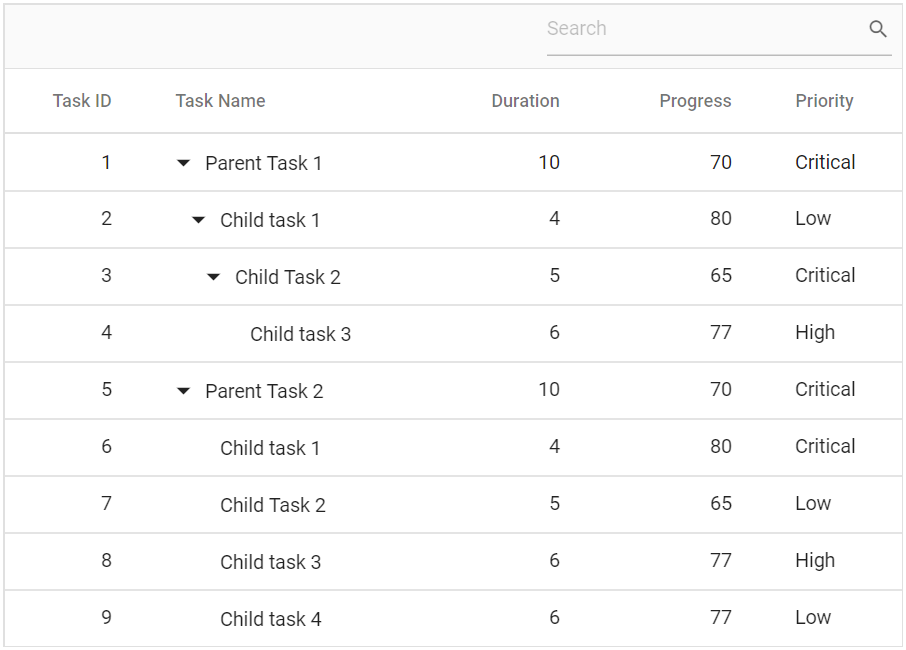

# Search

You can search records in a Tree Grid, by using the [`Search`](https://help.syncfusion.com/cr/blazor/Syncfusion.Blazor~Syncfusion.Blazor.TreeGrid.SfTreeGrid~Search.html) method with search key as a parameter. This also provides an option to integrate search text box in tree grid's toolbar by adding **Search** item to the [`Toolbar`](https://help.syncfusion.com/cr/blazor/Syncfusion.Blazor~Syncfusion.Blazor.TreeGrid.SfTreeGrid~Toolbar.html).





The following output is displayed as a result of the above code example.

## Initial search

To apply search at initial rendering, set the Fields, Operator, Key, and IgnoreCase in the [`TreeGridSearchSettings`](https://help.syncfusion.com/cr/blazor/Syncfusion.Blazor~Syncfusion.Blazor.TreeGrid.TreeGridSearchSettings.html).





The following output is displayed as a result of the above code example.

> By default, tree grid searches all the bound column values. To customize this behavior define the [`TreeGridSearchSettings.Fields`](https://help.syncfusion.com/cr/blazor/Syncfusion.Blazor~Syncfusion.Blazor.TreeGrid.TreeGridSearchSettings~Fields.html) property.

## Search operators

The search operator can be defined in the [`Operators`](https://help.syncfusion.com/cr/blazor/Syncfusion.Blazor~Syncfusion.Blazor.TreeGrid.TreeGridSearchSettings~Operators.html) property of [`TreeGridSearchSettings`](https://help.syncfusion.com/cr/blazor/Syncfusion.Blazor~Syncfusion.Blazor.TreeGrid.TreeGridSearchSettings_members.html) to configure specific searching.

The following operators are supported in searching:

Operator |Description
-----|-----
startsWith |Checks whether a value begins with the specified value.
endsWith |Checks whether a value ends with the specified value.
contains |Checks whether a value contains the specified value.
equal |Checks whether a value is equal to the specified value.
notEqual |Checks for values not equal to the specified value.

> By default, the [`Operators`](https://help.syncfusion.com/cr/blazor/Syncfusion.Blazor~Syncfusion.Blazor.TreeGrid.TreeGridSearchSettings~Operators.html) value is **contains**.

## Search by external button

To search tree grid records from an external button, invoke the [`Search`](https://help.syncfusion.com/cr/blazor/Syncfusion.Blazor~Syncfusion.Blazor.TreeGrid.SfTreeGrid~Search.html) method.





## Search specific columns

By default, tree grid searches all visible columns. You can search specific columns by defining the specific column's field names in the [`Fields`](https://help.syncfusion.com/cr/blazor/Syncfusion.Blazor~Syncfusion.Blazor.TreeGrid.TreeGridSearchSettings~Fields.html) property of [`TreeGridSearchSettings`](https://help.syncfusion.com/cr/blazor/Syncfusion.Blazor~Syncfusion.Blazor.TreeGrid.TreeGridSearchSettings_members.html).



