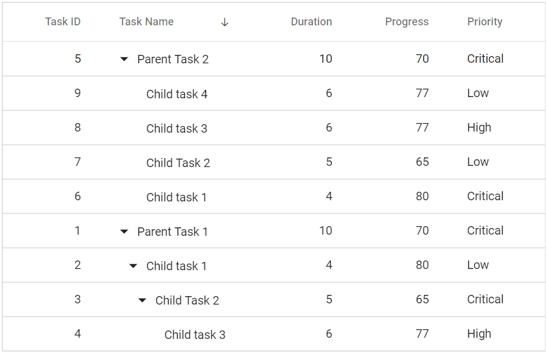
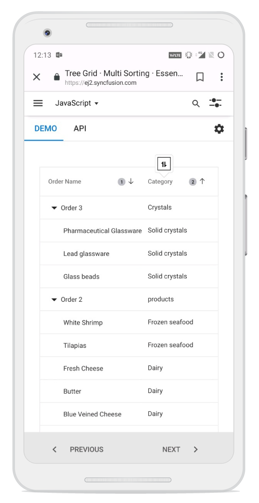

# Sorting in Blazor TreeGrid Component

Sorting enables to sort data in the **Ascending** or **Descending** order. To sort a column, click the column header. To sort multiple columns, press and hold the CTRL key and click the column header. Sorting of any one of the multi-sorted columns can be cleared by pressing and holding the SHIFT key and clicking the specific column header.

To enable sorting in the Tree Grid, set the [AllowSorting](https://help.syncfusion.com/cr/blazor/Syncfusion.Blazor.TreeGrid.SfTreeGrid-1.html#Syncfusion_Blazor_TreeGrid_SfTreeGrid_1_AllowSorting) to true. Sorting options can be configured through the [TreeGridSortSettings](https://help.syncfusion.com/cr/blazor/Syncfusion.Blazor.TreeGrid.TreeGridSortSettings.html).





@using TreeGridComponent.Data;
@using Syncfusion.Blazor.TreeGrid;

<SfTreeGrid DataSource="@TreeGridData" AllowSorting="true" IdMapping="TaskId" ParentIdMapping="ParentId" TreeColumnIndex="1">
    <TreeGridSortSettings Columns="@Sort"></TreeGridSortSettings>
    <TreeGridColumns>
        <TreeGridColumn Field="TaskId" HeaderText="Task ID" Width="80" TextAlign="Syncfusion.Blazor.Grids.TextAlign.Right"></TreeGridColumn>
        <TreeGridColumn Field="TaskName" HeaderText="Task Name" Width="160"></TreeGridColumn>
        <TreeGridColumn Field="Duration" HeaderText="Duration" Width="100" TextAlign="Syncfusion.Blazor.Grids.TextAlign.Right"></TreeGridColumn>
        <TreeGridColumn Field="Progress" HeaderText="Progress" Width="100" TextAlign="Syncfusion.Blazor.Grids.TextAlign.Right"></TreeGridColumn>
        <TreeGridColumn Field="Priority" HeaderText="Priority" Width="80"></TreeGridColumn>
    </TreeGridColumns>
</SfTreeGrid>

@code{
    public List<TreeData.BusinessObject> TreeGridData { get; set; }
    public List<TreeGridSortColumn> Sort { get; set; }
    protected override void OnInitialized()
    {
        this.Sort = new List<TreeGridSortColumn>();
        this.Sort.Add(new TreeGridSortColumn() { Field = "TaskName", Direction = Syncfusion.Blazor.Grids.SortDirection.Descending });

        this.TreeGridData = TreeData.GetSelfDataSource().ToList();
    }
}





namespace TreeGridComponent.Data {

public class TreeData
    {
        public class BusinessObject
        {
            public int TaskId { get; set;}
            public string TaskName { get; set;}
            public int? Duration { get; set;}
            public int? Progress { get; set;}
            public string Priority { get; set;}
            public int? ParentId { get; set;}
        }

        public static List<BusinessObject> GetSelfDataSource()
        {
            List<BusinessObject> BusinessObjectCollection = new List<BusinessObject>();
            BusinessObjectCollection.Add(new BusinessObject() { TaskId = 1,TaskName = "Parent Task 1",Duration = 10,Progress = 70,Priority = "Critical",ParentId = null });
            BusinessObjectCollection.Add(new BusinessObject() { TaskId = 2,TaskName = "Child task 1",Progress = 80,Priority = "Low",ParentId = 1 });
            BusinessObjectCollection.Add(new BusinessObject() { TaskId = 3,TaskName = "Child Task 2",Duration = 5,Progress = 65,Priority = "Critical",ParentId = 2 });
            BusinessObjectCollection.Add(new BusinessObject() { TaskId = 4,TaskName = "Child task 3",Duration = 6,Priority = "High",Progress = 77,ParentId = 3 });
            BusinessObjectCollection.Add(new BusinessObject() { TaskId = 5,TaskName = "Parent Task 2",Duration = 10,Progress = 70,Priority = "Critical",ParentId = null});
            BusinessObjectCollection.Add(new BusinessObject() { TaskId = 6,TaskName = "Child task 1",Duration = 4,Progress = 80,Priority = "Critical",ParentId = 5});
            BusinessObjectCollection.Add(new BusinessObject() { TaskId = 7,TaskName = "Child Task 2",Duration = 5,Progress = 65,Priority = "Low",ParentId = 5});
            BusinessObjectCollection.Add(new BusinessObject() { TaskId = 8,TaskName = "Child task 3",Duration = 6,Progress = 77,Priority = "High",ParentId = 5});
            BusinessObjectCollection.Add(new BusinessObject() { TaskId = 9,TaskName = "Child task 4",Duration = 6,Progress = 77,Priority = "Low",ParentId = 5});
            return BusinessObjectCollection;
        }
    }
}





N> * TreeGrid columns are sorted in the **Ascending** order. Clicking an already sorted column toggles its sort direction.
  * Apply and clear sorting by invoking [SortByColumnAsync](https://help.syncfusion.com/cr/blazor/Syncfusion.Blazor.TreeGrid.SfTreeGrid-1.html#Syncfusion_Blazor_TreeGrid_SfTreeGrid_1_SortByColumnAsync_System_String_Syncfusion_Blazor_Grids_SortDirection_System_Nullable_System_Boolean__) and [ClearSortingAsync](https://help.syncfusion.com/cr/blazor/Syncfusion.Blazor.TreeGrid.SfTreeGrid-1.html#Syncfusion_Blazor_TreeGrid_SfTreeGrid_1_ClearSortingAsync) methods.
  * To disable sorting for a particular column, set the [AllowSorting](https://help.syncfusion.com/cr/blazor/Syncfusion.Blazor.TreeGrid.TreeGridColumn.html#Syncfusion_Blazor_TreeGrid_TreeGridColumn_AllowSorting) property of [Column](https://help.syncfusion.com/cr/blazor/Syncfusion.Blazor.TreeGrid.TreeGridColumn.html#Syncfusion_Blazor_TreeGrid_TreeGridColumn_Columns) to **false**.

## Initial sort

To sort at initial rendering, set the **Field** and **Direction** in the [Columns](https://help.syncfusion.com/cr/blazor/Syncfusion.Blazor.TreeGrid.TreeGridSortSettings.html#Syncfusion_Blazor_TreeGrid_TreeGridSortSettings_Columns) property of [SortSettings](https://help.syncfusion.com/cr/blazor/Syncfusion.Blazor.TreeGrid.SfTreeGrid-1.html#Syncfusion_Blazor_TreeGrid_SfTreeGrid_1_SortSettings).





@using TreeGridComponent.Data;
@using Syncfusion.Blazor.TreeGrid;

<SfTreeGrid DataSource="@TreeGridData" AllowSorting="true" IdMapping="TaskId" ParentIdMapping="ParentId" TreeColumnIndex="1">
    <TreeGridSortSettings>
        <TreeGridSortColumns>
            <TreeGridSortColumn Field="TaskName" Direction="Syncfusion.Blazor.Grids.SortDirection.Descending"></TreeGridSortColumn>
        </TreeGridSortColumns>
    </TreeGridSortSettings>
    <TreeGridColumns>
        <TreeGridColumn Field="TaskId" HeaderText="Task ID" Width="80" TextAlign="Syncfusion.Blazor.Grids.TextAlign.Right"></TreeGridColumn>
        <TreeGridColumn Field="TaskName" HeaderText="Task Name" Width="160"></TreeGridColumn>
        <TreeGridColumn Field="Duration" HeaderText="Duration" Width="100" TextAlign="Syncfusion.Blazor.Grids.TextAlign.Right"></TreeGridColumn>
        <TreeGridColumn Field="Progress" HeaderText="Progress" Width="100" TextAlign="Syncfusion.Blazor.Grids.TextAlign.Right"></TreeGridColumn>
        <TreeGridColumn Field="Priority" HeaderText="Priority" Width="80"></TreeGridColumn>
    </TreeGridColumns>
</SfTreeGrid>

@code{
    public List<TreeData.BusinessObject> TreeGridData { get; set; }
    protected override void OnInitialized()
    {       
        this.TreeGridData = TreeData.GetSelfDataSource().ToList();
    }
}





namespace TreeGridComponent.Data {

public class TreeData
    {
        public class BusinessObject
        {
            public int TaskId { get; set;}
            public string TaskName { get; set;}
            public int? Duration { get; set;}
            public int? Progress { get; set;}
            public string Priority { get; set;}
            public int? ParentId { get; set;}
        }

        public static List<BusinessObject> GetSelfDataSource()
        {
            List<BusinessObject> BusinessObjectCollection = new List<BusinessObject>();
            BusinessObjectCollection.Add(new BusinessObject() { TaskId = 1,TaskName = "Parent Task 1",Duration = 10,Progress = 70,Priority = "Critical",ParentId = null });
            BusinessObjectCollection.Add(new BusinessObject() { TaskId = 2,TaskName = "Child task 1",Progress = 80,Priority = "Low",ParentId = 1 });
            BusinessObjectCollection.Add(new BusinessObject() { TaskId = 3,TaskName = "Child Task 2",Duration = 5,Progress = 65,Priority = "Critical",ParentId = 2 });
            BusinessObjectCollection.Add(new BusinessObject() { TaskId = 4,TaskName = "Child task 3",Duration = 6,Priority = "High",Progress = 77,ParentId = 3 });
            BusinessObjectCollection.Add(new BusinessObject() { TaskId = 5,TaskName = "Parent Task 2",Duration = 10,Progress = 70,Priority = "Critical",ParentId = null});
            BusinessObjectCollection.Add(new BusinessObject() { TaskId = 6,TaskName = "Child task 1",Duration = 4,Progress = 80,Priority = "Critical",ParentId = 5});
            BusinessObjectCollection.Add(new BusinessObject() { TaskId = 7,TaskName = "Child Task 2",Duration = 5,Progress = 65,Priority = "Low",ParentId = 5});
            BusinessObjectCollection.Add(new BusinessObject() { TaskId = 8,TaskName = "Child task 3",Duration = 6,Progress = 77,Priority = "High",ParentId = 5});
            BusinessObjectCollection.Add(new BusinessObject() { TaskId = 9,TaskName = "Child task 4",Duration = 6,Progress = 77,Priority = "Low",ParentId = 5});
            return BusinessObjectCollection;
        }
    }
}





## Sorting events

During the sort action, the tree grid component triggers two events. The [ActionBegin](https://help.syncfusion.com/cr/blazor/Syncfusion.Blazor.TreeGrid.TreeGridEvents-1.html#Syncfusion_Blazor_TreeGrid_TreeGridEvents_1_OnActionBegin) event triggers before the sort action starts, and the [ActionComplete](https://help.syncfusion.com/cr/blazor/Syncfusion.Blazor.TreeGrid.TreeGridEvents-1.html#Syncfusion_Blazor_TreeGrid_TreeGridEvents_1_OnActionComplete) event triggers after the sort action is completed. Using these events the needed actions can be performed.





@using TreeGridComponent.Data;
@using Syncfusion.Blazor.TreeGrid;
@inject IJSRuntime  JsRuntime;

<SfTreeGrid DataSource="@TreeGridData" AllowSorting="true" IdMapping="TaskId" ParentIdMapping="ParentId" TreeColumnIndex="1">
    <TreeGridEvents Sorting="SortingHandler" Sorted="SortedHandler" TValue="TreeData"></TreeGridEvents>
    <TreeGridColumns>
        <TreeGridColumn Field="TaskId" HeaderText="Task ID" Width="80" TextAlign="Syncfusion.Blazor.Grids.TextAlign.Right"></TreeGridColumn>
        <TreeGridColumn Field="TaskName" HeaderText="Task Name" Width="160"></TreeGridColumn>
        <TreeGridColumn Field="Duration" HeaderText="Duration" Width="100" TextAlign="Syncfusion.Blazor.Grids.TextAlign.Right"></TreeGridColumn>
        <TreeGridColumn Field="Progress" HeaderText="Progress" Width="100" TextAlign="Syncfusion.Blazor.Grids.TextAlign.Right"></TreeGridColumn>
        <TreeGridColumn Field="Priority" HeaderText="Priority" Width="80"></TreeGridColumn>
    </TreeGridColumns>
</SfTreeGrid>

@code {

    public List<TreeData> TreeGridData { get; set; }

    protected override void OnInitialized()
    {
        this.TreeGridData = TreeData.GetSelfDataSource().ToList();
    }

    private void SortingHandler(SortingEventArgs args)
    {
        JsRuntime.InvokeAsync<string>("window.alert", args.RequestType.ToString());
    }

    private void SortedHandler(SortedEventArgs args)
    {
        JsRuntime.InvokeAsync<string>("window.alert", args.RequestType.ToString());
    }
}





namespace TreeGridComponent.Data {

public class TreeData
    {
       
            public int TaskId { get; set;}
            public string TaskName { get; set;}
            public int? Duration { get; set;}
            public int? Progress { get; set;}
            public string Priority { get; set;}
            public int? ParentId { get; set;}
       
        public static List<TreeData> GetSelfDataSource()
        {
            List<TreeData> TreeDataCollection = new List<TreeData>();
            TreeDataCollection.Add(new TreeData() { TaskId = 1,TaskName = "Parent Task 1",Duration = 10,Progress = 70,Priority = "Critical",ParentId = null });
            TreeDataCollection.Add(new TreeData() { TaskId = 2,TaskName = "Child task 1",Progress = 80,Priority = "Low",ParentId = 1 });
            TreeDataCollection.Add(new TreeData() { TaskId = 3,TaskName = "Child Task 2",Duration = 5,Progress = 65,Priority = "Critical",ParentId = 2 });
            TreeDataCollection.Add(new TreeData() { TaskId = 4,TaskName = "Child task 3",Duration = 6,Priority = "High",Progress = 77,ParentId = 3 });
            TreeDataCollection.Add(new TreeData() { TaskId = 5,TaskName = "Parent Task 2",Duration = 10,Progress = 70,Priority = "Critical",ParentId = null});
            TreeDataCollection.Add(new TreeData() { TaskId = 6,TaskName = "Child task 1",Duration = 4,Progress = 80,Priority = "Critical",ParentId = 5});
            TreeDataCollection.Add(new TreeData() { TaskId = 7,TaskName = "Child Task 2",Duration = 5,Progress = 65,Priority = "Low",ParentId = 5});
            TreeDataCollection.Add(new TreeData() { TaskId = 8,TaskName = "Child task 3",Duration = 6,Progress = 77,Priority = "High",ParentId = 5});
            TreeDataCollection.Add(new TreeData() { TaskId = 9,TaskName = "Child task 4",Duration = 6,Progress = 77,Priority = "Low",ParentId = 5});
            return TreeDataCollection;
        }
    }
}





N> The **args.requestType** is the current action name. For example, in sorting the **args.requestType** value is *sorting*. 

## Touch interaction

When the tree grid header is tapped on the touchscreen devices, the selected column header is sorted. A popup  is displayed for the multi-column sorting. To sort multiple columns, tap the popup, and then tap the desired tree grid headers.

<!-- markdownlint-disable MD033 -->

<!-- markdownlint-enable MD033 -->

## Custom sorting 

The Syncfusion&reg; Blazor TreeGrid provides a way to customize the default sort action for a column by defining the [SortComparer](https://help.syncfusion.com/cr/blazor/Syncfusion.Blazor.TreeGrid.SfTreeGrid-1.html#Syncfusion_Blazor_TreeGrid_SfTreeGrid_1_SortComparer) property of `TreeGridColumn`. The `SortComparer` data type uses the [IComparer](https://learn.microsoft.com/en-us/dotnet/api/system.collections.generic.icomparer-1?view=net-7.0&viewFallbackFrom=net-5) interface, so the custom sort comparer class should be implemented in the interface `IComparer`.

In this TreeGrid example, custom sorting enhances project management by allowing the **"Priority"** column to be sorted based on a predefined hierarchy (Critical, High, Normal, Low) instead of alphabetical order, and the **"Story Points"** column to be sorted numerically so that string values are treated as numbers, producing the correct ascending sequence 3, 5, 30 rather than the alphabetical order "3", "30", "5". In descending order, the numeric order is reversed to 30, 5, 3, making larger story points appear at the top.



@using TreeGridComponent.Data;
@using Syncfusion.Blazor.TreeGrid
@using Syncfusion.Blazor.Grids
@using Syncfusion.Blazor.Navigations
<SfTreeGrid ID="treeCustomSorting" DataSource="@TreeGridData"
    IdMapping="TaskID"
    ParentIdMapping="ParentID"
    TreeColumnIndex="1"
    AllowFiltering="true"
    AllowSorting="true"
    Height="500">
    <TreeGridFilterSettings Type="Syncfusion.Blazor.TreeGrid.FilterType.Excel"></TreeGridFilterSettings>
    <TreeGridColumns>
        <TreeGridColumn Field="TaskID" HeaderText="Task ID" Width="100" TextAlign="TextAlign.Right"></TreeGridColumn>
        <TreeGridColumn Field="TaskName" HeaderText="Task Name" Width="280"></TreeGridColumn>
        <TreeGridColumn Field="AssignedTo" HeaderText="Assignee" Width="140"></TreeGridColumn>
        <TreeGridColumn Field="Priority" HeaderText="Priority" Width="120" SortComparer="@(new PriorityComparer())">
        </TreeGridColumn>
        <TreeGridColumn Field="StoryPoints"
                        HeaderText="Story Points"
                        Width="110"
                        TextAlign="TextAlign.Center"
                        SortComparer="@(new StoryPointsStringComparer())" ClipMode="ClipMode.EllipsisWithTooltip">
        </TreeGridColumn>
        <TreeGridColumn Field="Progress" HeaderText="Status" Width="130">
        </TreeGridColumn>
        <TreeGridColumn Field="StartDate" HeaderText="Start Date" Format="d" Type="ColumnType.Date" Width="120"></TreeGridColumn>
        <TreeGridColumn Field="EndDate" HeaderText="End Date" Format="d" Type="ColumnType.Date" Width="120"></TreeGridColumn>
    </TreeGridColumns>
</SfTreeGrid>

@code {
    private List<TaskData> TreeGridData { get; set; } = new();
    protected override void OnInitialized()
    {
        TreeGridData = TaskData.GetTree();
    }
    // Numeric sorting for string StoryPoints (ascending: 2 → 30)
    public class StoryPointsStringComparer : IComparer<object>
    {
        public int Compare(object? x, object? y)
        {
            var a = x as TaskData;
            var b = y as TaskData;
            bool aHasValue = int.TryParse(a?.StoryPoints ?? "", out int valA);
            bool bHasValue = int.TryParse(b?.StoryPoints ?? "", out int valB);
            if (!aHasValue && !bHasValue) return 0;
            if (!aHasValue) return -1; // Empty comes first
            if (!bHasValue) return 1;
            return valA.CompareTo(valB); // Ascending order
        }
    }
    public class PriorityComparer : IComparer<object>
    {
        private static readonly Dictionary<string, int> Order = new()
        {
            { "Low",      1 },
            { "Normal",   2 },
            { "High",     3 },
            { "Critical", 4 }
        };
        public int Compare(object? x, object? y)
        {
            var a = x as TaskData;
            var b = y as TaskData;
            int pa = Order.GetValueOrDefault(a?.Priority ?? "", 0);
            int pb = Order.GetValueOrDefault(b?.Priority ?? "", 0);
            // Ascending order: Low → Normal → High → Critical
            return pa.CompareTo(pb);
        }
    }

    public void ToolBarClick(Syncfusion.Blazor.Navigations.ClickEventArgs Args)
    {
        if (Args.Item.Id == "small")
        {
            RowHeightValue = 20;
        }
        if (Args.Item.Id == "medium")
        {
            RowHeightValue = 40;
        }
        if (Args.Item.Id == "big")
        {
            RowHeightValue = 60;
        }
    }

    public class CustomComparer : IComparer<object>
    {
        private static readonly Dictionary<string, int> PriorityOrder = new()
        {
            { "Low", 1 },
            { "Normal", 2 },
            { "High", 3 },
            { "Critical", 4 }
        };

        public int Compare(object XRowDataToCompare, object YRowDataToCompare)
        {
            var xx = XRowDataToCompare as WrapData;
            var yy = YRowDataToCompare as WrapData;
            string stringX = xx?.Priority.ToString() ?? string.Empty;
            string stringY = yy?.Priority.ToString() ?? string.Empty;

            int priorityX = PriorityOrder.GetValueOrDefault(stringX, 1);
            int priorityY = PriorityOrder.GetValueOrDefault(stringY, 1);

            if (priorityX == priorityY)
            {
                return 0;
            }
            else if (priorityX > priorityY)
            {
                return 1;
            }
            else
            {
                return -1;
            }
        }
    }
}



namespace TreeGridComponent.Data {
    public class TaskData
    {
        public static List<TaskData> tree = new List<TaskData>();
        public int TaskID { get; set; }
        public string? TaskName { get; set; }
        public DateTime StartDate { get; set; }
        public DateTime EndDate { get; set; }
        public string? Progress { get; set; }
        public string? Priority { get; set; }
        public double? Duration { get; set; }
        public int? ParentID { get; set; }
        public bool? IsParent { get; set; }
        public bool? Approved { get; set; }
        public string? AssignedTo { get; set; }
        public string EstimatedCost { get; set; } = "0";
        public string RICEScore { get; set; } = "0";
        public string? BusinessValue { get; set; }
        public string StoryPoints { get; set; } = ""; // Now string, will be summed for parents
        public TaskData() { }
        // Helper: Returns story points as string based on task name
        private static string CalculateStoryPoints(string taskName)
        {
            if (string.IsNullOrWhiteSpace(taskName)) return "";
            string name = taskName.ToLowerInvariant();
            if (name.Contains("implement") && (name.Contains("frontend") || name.Contains("backend") ||
                name.Contains("integration") || name.Contains("oauth") || name.Contains("payment")))
                return "30";
            if (name.Contains("implement") || name.Contains("implementation"))
                return "20";
            if (name.Contains("analysis") && taskName.Length > 20)
                return "3";
            if (name.Contains("analysis") || name.Contains("wireframe") || name.Contains("audit"))
                return "2";
            if (name.Contains("error handling") && (name.Contains("failed") || name.Contains("fraud") || name.Contains("conflict")))
                return "12";
            if (name.Contains("error handling") || name.Contains("validation"))
                return "10";
            if (name.Contains("deploy") || name.Contains("deployment") || name.Contains("ota") || name.Contains("release"))
                return "9";
            return "5"; // Default for tests, setup, etc.
        }
        public static List<TaskData> GetTree()
        {
            tree.Clear();
            var modules = GetModules();
            var innerTasks = GetInnerTasks();
            int taskId = 1000;
            var rand = new Random();
            string[] parentProjects = {
                "Customer Portal Redesign", "Mobile App v2 Development", "Data Analytics Dashboard",
                "Admin Panel Revamp", "E-Commerce Platform Upgrade", "HR System Migration",
                "IoT Device Monitoring System", "Marketing Automation Suite"
            };
            // Temporary storage for tasks to calculate sums later
            var allTasks = new List<TaskData>();
            var parentToChildrenMap = new Dictionary<int, List<TaskData>>();
            foreach (var parent in parentProjects)
            {
                DateTime parentStart = new DateTime(2025, rand.Next(1, 12), rand.Next(1, 28));
                DateTime parentEnd = parentStart.AddDays(rand.Next(60, 120));
                string parentPriority = parent == "HR System Migration" ? "Normal" : "Critical";
                var parentTask = new TaskData
                {
                    TaskID = taskId++,
                    TaskName = parent,
                    ParentID = null,
                    IsParent = true,
                    Priority = parentPriority,
                    Progress = "In Progress",
                    AssignedTo = "Project Manager",
                    StartDate = parentStart,
                    EndDate = parentEnd,
                    Duration = (parentEnd - parentStart).Days,
                    EstimatedCost = "0",
                    RICEScore = "8000",
                    Approved = true,
                    StoryPoints = "" // Will be calculated later
                };
                allTasks.Add(parentTask);
                parentToChildrenMap[parentTask.TaskID] = new List<TaskData>();
                foreach (var module in modules[parent])
                {
                    DateTime childStart = parentStart.AddDays(rand.Next(3, 15));
                    DateTime childEnd = childStart.AddDays(rand.Next(20, 45));
                    string childPriority = parent == "HR System Migration"
                        ? (rand.Next(0, 2) == 0 ? "Low" : "Normal")
                        : module.Contains("Auth") || module.Contains("Payment") || module.Contains("Security") ? "Critical" : "High";
                    var childTask = new TaskData
                    {
                        TaskID = taskId++,
                        TaskName = module,
                        ParentID = parentTask.TaskID,
                        IsParent = true,
                        Priority = childPriority,
                        Progress = "Open",
                        AssignedTo = "Tech Lead",
                        StartDate = childStart,
                        EndDate = childEnd,
                        Duration = 0,
                        EstimatedCost = "0",
                        RICEScore = "2000",
                        Approved = true,
                        StoryPoints = "" // Will be summed
                    };
                    allTasks.Add(childTask);
                    parentToChildrenMap[parentTask.TaskID].Add(childTask);
                    parentToChildrenMap[childTask.TaskID] = new List<TaskData>();
                    if (innerTasks.ContainsKey(module))
                    {
                        int index = 0;
                        foreach (var inner in innerTasks[module])
                        {
                            int days = rand.Next(3, 14);
                            DateTime innerStart = childStart.AddDays(rand.Next(0, 5));
                            DateTime innerEnd = innerStart.AddDays(days);
                            string innerPriority = parent == "HR System Migration"
                                ? (rand.Next(0, 2) == 0 ? "Low" : "Normal")
                                : GetInnerPriority(childPriority, index++);
                            var innerTask = new TaskData
                            {
                                TaskID = taskId++,
                                TaskName = inner,
                                ParentID = childTask.TaskID,
                                IsParent = false,
                                Priority = innerPriority,
                                Progress = innerPriority == "Critical" ? "In Progress" : "Open",
                                AssignedTo = "Developer",
                                StartDate = innerStart,
                                EndDate = innerEnd,
                                Duration = days,
                                EstimatedCost = (days * 8 * 75).ToString(),
                                RICEScore = "1000",
                                BusinessValue = rand.Next(1, 4) switch { 1 => "21", 2 => "100", _ => "111" },
                                Approved = true,
                                StoryPoints = CalculateStoryPoints(inner)
                            };
                            allTasks.Add(innerTask);
                            parentToChildrenMap[childTask.TaskID].Add(innerTask);
                            childTask.Duration += days;
                            childTask.EstimatedCost = (double.Parse(childTask.EstimatedCost) + days * 8 * 75).ToString();
                        }
                    }
                }
            }
            // Now calculate and assign StoryPoints sum for all parent tasks (bottom-up)
            foreach (var task in allTasks.Where(t => t.IsParent == true).OrderByDescending(t => t.TaskID))
            {
                var children = allTasks.Where(t => t.ParentID == task.TaskID).ToList();
                int totalSP = 0;
                foreach (var child in children)
                {
                    if (!string.IsNullOrEmpty(child.StoryPoints) && int.TryParse(child.StoryPoints, out int sp))
                    {
                        totalSP += sp;
                    }
                }
                task.StoryPoints = totalSP > 0 ? totalSP.ToString() : "";
            }
            tree = allTasks;
            return tree;
        }
        private static string GetInnerPriority(string parentPriority, int index)
        {
            return parentPriority switch
            {
                "Critical" => index % 2 == 0 ? "Critical" : "High",
                "High" => index % 3 == 0 ? "Critical" : "High",
                _ => "Normal"
            };
        }
        private static Dictionary<string, string[]> GetModules() => new()
        {
            { "Customer Portal Redesign", new[] { "Authentication & Login Flow", "User Profile Management", "Dashboard UI Layout", "Notification Center", "Accessibility Compliance" } },
            { "Mobile App v2 Development", new[] { "Push Notification Service", "Offline Data Sync", "Payment Gateway Integration", "App Security Enhancements" } },
            { "Data Analytics Dashboard", new[] { "Chart Rendering Engine", "Filter & Query Logic", "Export to Excel/PDF", "KPI Metrics Setup" } },
            { "Admin Panel Revamp", new[] { "Role Management Module", "Audit Log Tracking", "Settings UI Redesign", "Multi-Factor Authentication" } },
            { "E-Commerce Platform Upgrade", new[] { "Product Catalog Service", "Shopping Cart Flow", "Checkout & Payments", "Order Tracking" } },
            { "HR System Migration", new[] { "Employee Records Import", "Payroll Integration", "Leave Management", "Recruitment Module" } },
            { "IoT Device Monitoring System", new[] { "Device Registration", "Sensor Data Collection", "Real-Time Alerts", "Firmware Updates" } },
            { "Marketing Automation Suite", new[] { "Campaign Builder", "Email Templates", "Audience Segmentation", "Analytics Dashboard" } }
        };
        private static Dictionary<string, string[]> GetInnerTasks() => new()
        {
            { "Authentication & Login Flow", new[] { "Analysis of login flow", "Implement OAuth2/SSO", "Unit Tests for Login", "Error Handling for Failed Login" } },
            { "User Profile Management", new[] { "Profile CRUD Operations", "Validation Rules", "Integration with DB" } },
            { "Dashboard UI Layout", new[] { "Wireframe Design", "Frontend Implementation", "Accessibility Review" } },
            { "Notification Center", new[] { "Email Alerts", "Push Notifications", "Error Logging" } },
            { "Accessibility Compliance", new[] { "WCAG Audit", "Keyboard Navigation", "Screen Reader Support" } },
            { "Push Notification Service", new[] { "Setup Firebase/APNS", "Integration Tests", "Retry Logic" } },
            { "Offline Data Sync", new[] { "Local Storage Setup", "Conflict Resolution", "Sync Scheduler" } },
            { "Payment Gateway Integration", new[] { "Integrate Stripe/PayPal", "Transaction Logging", "Fraud Detection" } },
            { "App Security Enhancements", new[] { "Encryption Setup", "Penetration Testing", "Secure Storage" } },
            { "Chart Rendering Engine", new[] { "Implement ChartJS", "Performance Optimization", "Unit Tests" } },
            { "Filter & Query Logic", new[] { "Dynamic Filters", "SQL Optimization", "Validation" } },
            { "Export to Excel/PDF", new[] { "Excel Export", "PDF Export", "Error Handling" } },
            { "KPI Metrics Setup", new[] { "Define KPIs", "Data Pipeline", "Validation" } },
            { "Role Management Module", new[] { "Role CRUD", "Permission Matrix", "Unit Tests" } },
            { "Audit Log Tracking", new[] { "Log Schema Design", "Integration with DB", "Export Reports" } },
            { "Settings UI Redesign", new[] { "UI Wireframe", "Frontend Implementation", "Accessibility Review" } },
            { "Multi-Factor Authentication", new[] { "OTP Setup", "SMS/Email Integration", "Error Handling" } },
            { "Product Catalog Service", new[] { "Catalog CRUD", "Search Optimization", "Validation" } },
            { "Shopping Cart Flow", new[] { "Add/Remove Items", "Discount Application", "Error Handling" } },
            { "Checkout & Payments", new[] { "Payment Gateway Integration", "Transaction Logging", "Fraud Detection" } },
            { "Order Tracking", new[] { "Order Status Updates", "Notifications", "Error Handling" } },
            { "Employee Records Import", new[] { "Data Migration", "Validation", "Error Handling" } },
            { "Payroll Integration", new[] { "Salary Calculation", "Bank API Integration", "Validation" } },
            { "Leave Management", new[] { "Leave Request Workflow", "Approval Rules", "Error Handling" } },
            { "Recruitment Module", new[] { "Job Posting", "Candidate Screening", "Interview Scheduling" } },
            { "Device Registration", new[] { "Device Onboarding", "Validation", "Error Handling" } },
            { "Sensor Data Collection", new[] { "Data Pipeline Setup", "Validation", "Error Handling" } },
            { "Real-Time Alerts", new[] { "Alert Rules", "Notification Setup", "Error Handling" } },
            { "Firmware Updates", new[] { "OTA Update Setup", "Validation", "Error Handling" } },
            { "Campaign Builder", new[] { "Template Design", "Workflow Setup", "Validation" } },
            { "Email Templates", new[] { "Design Templates", "Validation", "Error Handling" } },
            { "Audience Segmentation", new[] { "Segmentation Rules", "Validation", "Error Handling" } },
            { "Analytics Dashboard", new[] { "Metrics Setup", "Visualization", "Validation" } }
        };
    }
}






> * The SortComparer function takes two parameters: a and b. The a and b parameters are the values to be compared. The function returns -1, 0, or 1, depending on the comparison result.
> * The SortComparer property will work only for local data.
> * When using the column template to display data in a column, you will need to use the [Field](https://help.syncfusion.com/cr/blazor/Syncfusion.Blazor.TreeGrid.TreeGridColumn.html#Syncfusion_Blazor_TreeGrid_TreeGridColumn_Field) property of [TreeGridColumn](https://help.syncfusion.com/cr/blazor/Syncfusion.Blazor.TreeGrid.TreeGridColumn.html) to work with the [SortComparer](https://help.syncfusion.com/cr/blazor/Syncfusion.Blazor.TreeGrid.SfTreeGrid-1.html#Syncfusion_Blazor_TreeGrid_SfTreeGrid_1_SortComparer) property.