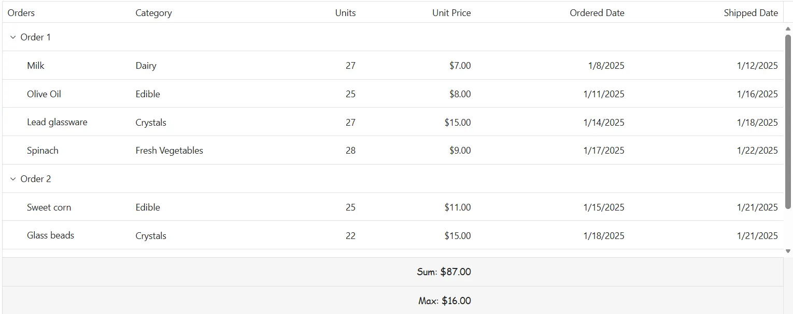
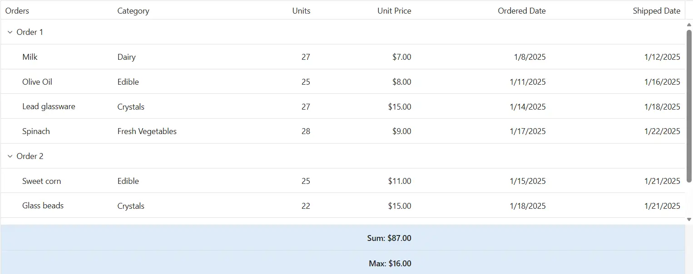

# Aggregate customization in Syncfusion Blazor TreeGrid

Aggregates are displayed as summary rows in the TreeGrid footer, providing a consolidated view of totals, averages, or counts. These rows can be styled using CSS to match the layout and design of the TreeGrid. Styling options are available for:

- **Aggregate root container:** The outer wrapper of the footer row.
- **Aggregate summary row and cells:** The row that shows summary values, and the cells that display each result.

## Customize the aggregate root element
The **.e-gridfooter** class styles the root container of the aggregate footer row. Use CSS to adjust its appearance:

```css
.e-treegrid .e-gridfooter {
    font-family: cursive;
}
```

Properties like **font-family**, **font-size**, and **padding** can be changed to fit the TreeGrid layout design.



## Customize the aggregate cell elements

The **.e-summaryrow** and **.e-summarycell** classes define the appearance of the summary row and its individual cells in the Blazor TreeGrid. Apply CSS to modify their look:

```css
.e-treegrid .e-summaryrow .e-summarycell {
    background-color: #deecf9;
}
```

Properties such as **background-color**, **color**, and **text-align** can be adjusted to improve clarity and interaction.






@using Syncfusion.Blazor.TreeGrid
@using Syncfusion.Blazor.Grids
<SfTreeGrid DataSource="@TreeGridData" IdMapping="ID" ParentIdMapping="ParentID" Height="362" TreeColumnIndex="1" AllowPaging="true">
    <TreeGridPageSettings PageSizes="@PageSizes" PageCount="5" PageSize="2" PageSizeMode="PageSizeMode.Root"></TreeGridPageSettings>
    <TreeGridEditSettings AllowEditing="true"></TreeGridEditSettings>
    <TreeGridColumns>
        <TreeGridColumn Field="ShipID" HeaderText="Ship ID" Width="80" Visible="false" IsPrimaryKey="true" TextAlign="TextAlign.Right"></TreeGridColumn>
        <TreeGridColumn Field="Name" ClipMode="ClipMode.EllipsisWithTooltip" HeaderText="Orders" Width="100"></TreeGridColumn>
        <TreeGridColumn Field="ShipmentCategory" HeaderText="Category" Width="100"></TreeGridColumn>
        <TreeGridColumn Field="Units" HeaderText="Units" Width="80" TextAlign="TextAlign.Right"></TreeGridColumn>
        <TreeGridColumn Field="UnitPrice" ClipMode="ClipMode.EllipsisWithTooltip" HeaderText="Unit Price" Format="c2" Width="90" TextAlign="TextAlign.Right"></TreeGridColumn>
        <TreeGridColumn Field="OrderDate" HeaderText="Ordered Date" ClipMode="ClipMode.EllipsisWithTooltip" Format="d" Type="ColumnType.Date" Width="120" TextAlign="TextAlign.Right"></TreeGridColumn>
        <TreeGridColumn Field="ShippedDate" HeaderText="Shipped Date" ClipMode="ClipMode.EllipsisWithTooltip" Format="d" Type="ColumnType.Date" Width="120" TextAlign="TextAlign.Right"></TreeGridColumn>

    </TreeGridColumns>
    <TreeGridAggregates>
        <TreeGridAggregate ShowChildSummary="false">
            <TreeGridAggregateColumns>
                <TreeGridAggregateColumn Field="UnitPrice" Type="Syncfusion.Blazor.Grids.AggregateType.Sum" Format="C2">
                    <FooterTemplate>
                        @{
                            var sumvalue = (context as Syncfusion.Blazor.Grids.AggregateTemplateContext);
                            <div  class="aggregate-chip">
                                Sum: @sumvalue.Sum
                            </div>
                        }
                    </FooterTemplate>
                </TreeGridAggregateColumn>
            </TreeGridAggregateColumns>
        </TreeGridAggregate>
        <TreeGridAggregate ShowChildSummary="false">
            <TreeGridAggregateColumns>
                <TreeGridAggregateColumn Field="UnitPrice" Type="Syncfusion.Blazor.Grids.AggregateType.Max" Format="C2">
                    <FooterTemplate>
                        @{
                            var sumvalue = (context as Syncfusion.Blazor.Grids.AggregateTemplateContext);
                            <div  class="aggregate-chip">
                                Max: @sumvalue.Max
                            </div>
                        }
                    </FooterTemplate>
                </TreeGridAggregateColumn>
            </TreeGridAggregateColumns>
        </TreeGridAggregate>
    </TreeGridAggregates>
</SfTreeGrid>

<style>
    .e-treegrid .e-gridfooter { font-family: cursive; background-color: #f5f8fc; }
    .e-treegrid .e-summaryrow .e-summarycell { background-color: #deecf9; }
    .aggregate-chip { padding: 4px 8px; border-radius: 6px; background-color: #fff; border: 1px solid #bcd3ea; display: inline-block; min-width: 120px; text-align: center; color: #0b3f73; font-weight: 600; }
    .e-treegrid .e-summarycell:focus-visible { outline: 2px solid #005a9e; outline-offset: -2px; }
</style>

@code {
    private List<ShipmentData> TreeGridData { get; set; } = new List<ShipmentData>();
    private List<string> PageSizes { get; set; } = new List<string>();
    protected override void OnInitialized()
    {
        TreeGridData = ShipmentData.GetData();
        PageSizes = new List<string>() { "2", "4", "5", "10", "15", "20", "All" };
    }
}





public class ShipmentData
{
    public int? ID { get; set; }
    public int? ShipID { get; set; }
    public string? Name { get; set; }
    public int? Units { get; set; }
    public string? Category { get; set; }
    public int? UnitPrice { get; set; }
    public int? Price { get; set; }
    public int? TotalPrice { get; set; } // Added for total price calculation (sum for parents, individual for items)
    public string? ShipmentCategory { get; set; }
    public DateTime? ShippedDate { get; set; } = null;
    public DateTime? OrderDate { get; set; } = null;
    public string? OrderReached { get; set; } = null;
    public int? ParentID { get; set; }
    private static void CalculateTotalPrices(List<ShipmentData> data)
    {
        // For items (non-parents), TotalPrice = Price
        // For parents, TotalPrice = sum of children's TotalPrice
        var parents = data.Where(d => d.ParentID == null).ToList();
        foreach (var parent in parents)
        {
            var children = data.Where(d => d.ParentID == parent.ID).ToList();
            parent.TotalPrice = children.Sum(c => c.Price ?? 0);
            // Recursively set for children if nested, but here it's flat tree
        }
        // Set for items
        foreach (var item in data.Where(d => d.ParentID != null))
        {
            item.TotalPrice = item.Price;
        }
    }
    public static List<ShipmentData> GetData()
    {
        var data = new List<ShipmentData>(capacity: 150);
        var rnd = new Random(42); // deterministic
        var baseOrderDate = new DateTime(2025, 1, 1);
        // pools for categories/items - standardized to Title Case
        var categories = new[]
        {
            ("Seafood", new[] { "Mackerel", "Herrings", "Tilapias", "White Shrimp", "Yellowfin Tuna" }),
            ("Dairy", new[] { "Fresh Cheese", "Blue Veined Cheese", "Butter", "Milk", "Yogurt" }),
            ("Edible", new[] { "Preserved Olives", "Sweet corn", "Pickles", "Tomato Puree", "Olive Oil" }),
            ("Crystals", new[] { "Lead glassware", "Pharmaceutical glass", "Glass beads", "Crystal vials", "Borosilicate glass" }),
            ("Fresh Vegetables", new[] { "Broccoli", "Spinach", "Carrots", "Lettuce", "Cabbage" }),
            ("Leafy Greens", new[] { "Kale", "Arugula", "Chard", "Collards", "Mustard Greens" }),
            ("Root Vegetables", new[] { "Beets", "Radish", "Parsnip", "Turnip", "Rutabaga" }),
            ("Paper", new[] { "Printer Paper", "Photo Paper", "Sticky Notes", "Card Stock", "Plotter Rolls" }),
            ("Consumables", new[] { "Ink Cartridges", "Toner", "Markers", "Glue Sticks", "Tape Rolls" }),
            ("Tools", new[] { "Staplers", "Hole Punch", "Cutters", "Rulers", "Scissors" }),
            ("Stationery", new[] { "Notebooks", "Pens", "Pencils", "Folders", "Envelopes" })
        };
        int id = 0;
        int shipSeed = 4500;
        for (int p = 1; p <= 40; p++)
        {
            int parentId = id++;
            data.Add(new ShipmentData
            {
                ID = parentId,
                Name = $"Order {p}",
                ParentID = null
            });
            for (int c = 0; c < 4; c++)
            {
                // pick a category and item name
                var (cat, items) = categories[(p + c) % categories.Length];
                var itemName = items[(p * 3 + c) % items.Length];
                // numbers
                int units = 20 + rnd.Next(11); // 20..30
                int unitPrice = 5 + rnd.Next(20); // 5..24
                int price = units * unitPrice;
                // dates
                var orderDate = baseOrderDate.AddDays(p * 7 + c * 3);
                var shipLag = 3 + rnd.Next(10); // 3..12 days
                var shippedDate = orderDate.AddDays(shipLag);
                // reached?
                var reached = shippedDate >= orderDate.AddDays(7) && rnd.Next(100) > 30 ? "Yes" : "No";
                data.Add(new ShipmentData
                {
                    ID = id,
                    ShipID = shipSeed + id,
                    Name = itemName,
                    Category = cat,
                    Units = units,
                    UnitPrice = unitPrice,
                    Price = price,
                    OrderDate = orderDate,
                    ShippedDate = shippedDate,
                    ShipmentCategory = cat,
                    OrderReached = reached,
                    ParentID = parentId
                });
                id++;
            }
        }
        CalculateTotalPrices(data);
        return data;
    }
}




