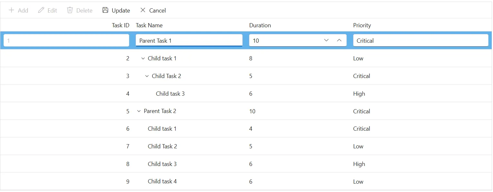
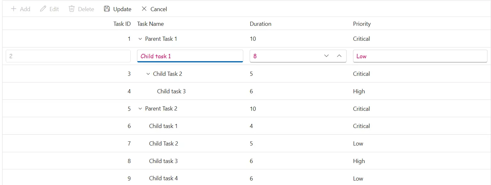
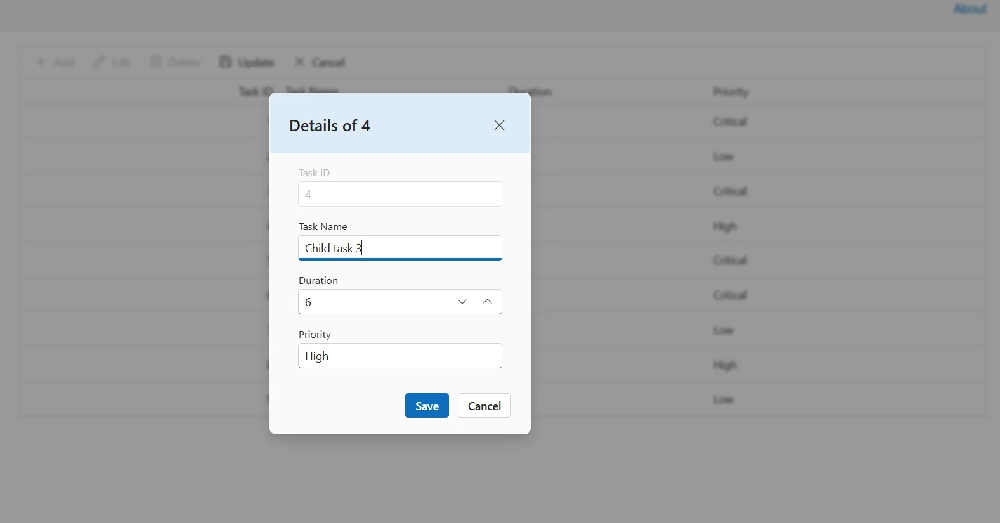
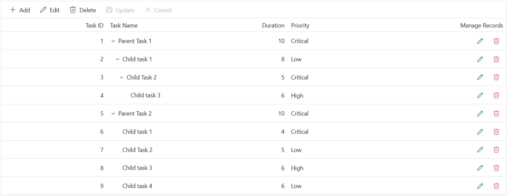
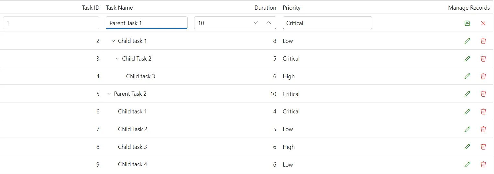

# Editing customization in Syncfusion Blazor TreeGrid

The appearance of editing elements in the Syncfusion<sup style="font-size:70%">&reg;</sup> Blazor TreeGrid can be customized using CSS. Styling options are available for different parts of the editing interface:

- **Edited and newly added rows:** Highlights rows that are being modified or newly inserted.
- **Edit form input fields:** Displays text boxes used to enter or update values during editing.
- **Edit dialog header:** Shows the title or context of the current editing operation.
- **Command column buttons:** Displays action buttons such as Edit, Delete, Update, and Cancel.

## Customize edited and added row elements

The **.e-editedrow** and **.e-addedrow** classes style edited and newly added rows. Apply CSS to make these rows stand out:

```css
.e-treegrid .e-editedrow table, .e-treegrid .e-addedrow table {
	    background-color: #62b2eb;
}
```

Adjust properties such as **background-color** or **border** styles to highlight rows that are in edit mode.

 

## Customize edited row input elements

The **.e-treegridform** and **.e-input** classes style inputs inside the inline edit form in the Blazor TreeGrid. Use CSS to adjust their appearance:

```css

.e-treegrid .e-rowcell .e-input-group .e-input {
    font-family: cursive;
    color:rgb(214, 33, 123)
}

```

Modify properties such as **font-family**, **color**, or **padding** to improve readability.






@using Syncfusion.Blazor.TreeGrid

<SfTreeGrid DataSource="@TreeGridData" IdMapping="TaskId" ParentIdMapping="ParentId" TreeColumnIndex="1" Toolbar="@(new List<string>() { "Add", "Edit", "Delete", "Update", "Cancel" })">
    <TreeGridEditSettings AllowAdding="true" AllowEditing="true" AllowDeleting="true"  Mode="Syncfusion.Blazor.TreeGrid.EditMode.Row"></TreeGridEditSettings>
    <TreeGridColumns>
        <TreeGridColumn Field=@nameof(TreeData.BusinessObject.TaskId) HeaderText="Task ID" IsPrimaryKey="true" TextAlign="Syncfusion.Blazor.Grids.TextAlign.Right" Width="140"></TreeGridColumn>
        <TreeGridColumn Field=@nameof(TreeData.BusinessObject.TaskName) HeaderText="Task Name" Width="120"></TreeGridColumn>
        <TreeGridColumn Field=@nameof(TreeData.BusinessObject.Duration) HeaderText="Duration" Width="110"></TreeGridColumn>
        <TreeGridColumn Field=@nameof(TreeData.BusinessObject.Priority) HeaderText="Priority" Width="150"></TreeGridColumn>
    </TreeGridColumns>
</SfTreeGrid>

<style>
    .e-treegrid .e-editedrow table,
    .e-treegrid .e-addedrow table { background-color: #62b2eb; }
    .e-treegrid .e-rowcell .e-input-group .e-input { font-family: cursive; color: rgb(214,33,123); }
    .e-treegrid .e-rowcell:focus-visible { outline: 2px solid #005a9e; outline-offset: -2px; }
</style>

@code {
    private List<TreeData.BusinessObject> TreeGridData { get; set; }
    protected override void OnInitialized()
    {
        TreeGridData = TreeData.GetSelfDataSource().ToList();
    }
}



namespace TreeGridComponent.Data
{
    public class TreeData
    {
        public class BusinessObject
        {
            public int TaskId { get; set; }
            public string TaskName { get; set; }
            public int? Duration { get; set; }
            public int? Progress { get; set; }
            public string Priority { get; set; }
            public int? ParentId { get; set; }
        }

        internal static List<BusinessObject> GetSelfDataSource()
        {
            List<BusinessObject> BusinessObjectCollection = new List<BusinessObject>();
            BusinessObjectCollection.Add(new BusinessObject() { TaskId = 1, TaskName = "Parent Task 1", Duration = 10, Progress = 70, Priority = "Critical", ParentId = null });
            BusinessObjectCollection.Add(new BusinessObject() { TaskId = 2, TaskName = "Child task 1", Duration = 8, Progress = 80, Priority = "Low", ParentId = 1 });
            BusinessObjectCollection.Add(new BusinessObject() { TaskId = 3, TaskName = "Child Task 2", Duration = 5, Progress = 65, Priority = "Critical", ParentId = 2 });
            BusinessObjectCollection.Add(new BusinessObject() { TaskId = 4, TaskName = "Child task 3", Duration = 6, Progress = 77, Priority = "High", ParentId = 3 });
            BusinessObjectCollection.Add(new BusinessObject() { TaskId = 5, TaskName = "Parent Task 2", Duration = 10, Progress = 70, Priority = "Critical", ParentId = null });
            BusinessObjectCollection.Add(new BusinessObject() { TaskId = 6, TaskName = "Child task 1", Duration = 4, Progress = 80, Priority = "Critical", ParentId = 5 });
            BusinessObjectCollection.Add(new BusinessObject() { TaskId = 7, TaskName = "Child Task 2", Duration = 5, Progress = 65, Priority = "Low", ParentId = 5 });
            BusinessObjectCollection.Add(new BusinessObject() { TaskId = 8, TaskName = "Child task 3", Duration = 6, Progress = 77, Priority = "High", ParentId = 5 });
            BusinessObjectCollection.Add(new BusinessObject() { TaskId = 9, TaskName = "Child task 4", Duration = 6, Progress = 77, Priority = "Low", ParentId = 5 });
            return BusinessObjectCollection;
        }
    }
}






## Customize the edit dialog header

The **.e-edit-dialog** and **.e-dlg-header-content** classes style the dialog header when dialog editing is enabled. Apply CSS to differentiate the header:

```css

.e-edit-dialog .e-dlg-header-content {
    background-color: #deecf9;
}

```

Change properties such as **background-color** to visually separate the header from the rest of the dialog content.






@using Syncfusion.Blazor.TreeGrid

<SfTreeGrid DataSource="@TreeGridData" IdMapping="TaskId" ParentIdMapping="ParentId" TreeColumnIndex="1" Toolbar="@(new List<string>() { "Add", "Edit", "Delete", "Update", "Cancel" })">
    <TreeGridEditSettings AllowAdding="true" AllowEditing="true" AllowDeleting="true" Mode="EditMode.Dialog"></TreeGridEditSettings>
    <TreeGridColumns>
        <TreeGridColumn Field=@nameof(TreeData.BusinessObject.TaskId) HeaderText="Task ID" IsPrimaryKey="true" TextAlign="Syncfusion.Blazor.Grids.TextAlign.Right" Width="140"></TreeGridColumn>
        <TreeGridColumn Field=@nameof(TreeData.BusinessObject.TaskName) HeaderText="Task Name" Width="120"></TreeGridColumn>
        <TreeGridColumn Field=@nameof(TreeData.BusinessObject.Duration) HeaderText="Duration" Width="110"></TreeGridColumn>
        <TreeGridColumn Field=@nameof(TreeData.BusinessObject.Priority) HeaderText="Priority" Width="150"></TreeGridColumn>
    </TreeGridColumns>
</SfTreeGrid>

<style>
    .e-edit-dialog .e-dlg-header-content { background-color: #deecf9; color: #0b345d; }
    .e-edit-dialog .e-dlg-header-content .e-btn.e-dlg-closeicon-btn:focus-visible { outline: 2px solid #005a9e; outline-offset: 2px; }
</style>

@code {
    private List<TreeData.BusinessObject> TreeGridData { get; set; }

    protected override void OnInitialized()
    {
        TreeGridData = TreeData.GetSelfDataSource().ToList();
    }
}



namespace TreeGridComponent.Data
{
    public class TreeData
    {
        public class BusinessObject
        {
            public int TaskId { get; set; }
            public string TaskName { get; set; }
            public int? Duration { get; set; }
            public int? Progress { get; set; }
            public string Priority { get; set; }
            public int? ParentId { get; set; }
        }

        internal static List<BusinessObject> GetSelfDataSource()
        {
            List<BusinessObject> BusinessObjectCollection = new List<BusinessObject>();
            BusinessObjectCollection.Add(new BusinessObject() { TaskId = 1, TaskName = "Parent Task 1", Duration = 10, Progress = 70, Priority = "Critical", ParentId = null });
            BusinessObjectCollection.Add(new BusinessObject() { TaskId = 2, TaskName = "Child task 1", Duration = 8, Progress = 80, Priority = "Low", ParentId = 1 });
            BusinessObjectCollection.Add(new BusinessObject() { TaskId = 3, TaskName = "Child Task 2", Duration = 5, Progress = 65, Priority = "Critical", ParentId = 2 });
            BusinessObjectCollection.Add(new BusinessObject() { TaskId = 4, TaskName = "Child task 3", Duration = 6, Progress = 77, Priority = "High", ParentId = 3 });
            BusinessObjectCollection.Add(new BusinessObject() { TaskId = 5, TaskName = "Parent Task 2", Duration = 10, Progress = 70, Priority = "Critical", ParentId = null });
            BusinessObjectCollection.Add(new BusinessObject() { TaskId = 6, TaskName = "Child task 1", Duration = 4, Progress = 80, Priority = "Critical", ParentId = 5 });
            BusinessObjectCollection.Add(new BusinessObject() { TaskId = 7, TaskName = "Child Task 2", Duration = 5, Progress = 65, Priority = "Low", ParentId = 5 });
            BusinessObjectCollection.Add(new BusinessObject() { TaskId = 8, TaskName = "Child task 3", Duration = 6, Progress = 77, Priority = "High", ParentId = 5 });
            BusinessObjectCollection.Add(new BusinessObject() { TaskId = 9, TaskName = "Child task 4", Duration = 6, Progress = 77, Priority = "Low", ParentId = 5 });
            return BusinessObjectCollection;
        }
    }
}




## Customize command column buttons

The **.e-edit**, **.e-delete**, **.e-update**, and **.e-cancel-icon** classes style the command column buttons in the Blazor TreeGrid. Use CSS to adjust their appearance:

```css

.e-treegrid .e-unboundcelldiv .e-delete::before,
.e-treegrid .e-unboundcelldiv .e-cancel-icon::before {
    color: #f51717;
}

.e-treegrid .e-unboundcelldiv .e-edit::before,
.e-treegrid .e-unboundcelldiv .e-update::before {
    color: #077005;
}

```

Style properties like **color**, **font-size**, and **font-weight** can be adjusted to differentiate action icons and enhance visibility during interaction.







@using Syncfusion.Blazor.TreeGrid

<SfTreeGrid DataSource="@TreeGridData" IdMapping="TaskId" ParentIdMapping="ParentId" TreeColumnIndex="1" Toolbar="@(new List<string>() { "Add", "Edit", "Delete", "Update", "Cancel" })">
    <TreeGridEditSettings AllowAdding="true" AllowEditing="true" AllowDeleting="true"  Mode="Syncfusion.Blazor.TreeGrid.EditMode.Row"></TreeGridEditSettings>
    <TreeGridColumns>
        <TreeGridColumn Field=@nameof(TreeData.BusinessObject.TaskId) HeaderText="Task ID" IsPrimaryKey="true" TextAlign="Syncfusion.Blazor.Grids.TextAlign.Right" Width="140"></TreeGridColumn>
        <TreeGridColumn Field=@nameof(TreeData.BusinessObject.TaskName) HeaderText="Task Name" Width="120"></TreeGridColumn>
        <TreeGridColumn Field=@nameof(TreeData.BusinessObject.Duration) HeaderText="Duration" TextAlign="Syncfusion.Blazor.Grids.TextAlign.Right" Width="120"></TreeGridColumn>
        <TreeGridColumn Field=@nameof(TreeData.BusinessObject.Priority) HeaderText="Priority" Width="130"></TreeGridColumn>
        <TreeGridColumn HeaderText="Manage Records" Width="160">
            <TreeGridCommandColumns>
                <TreeGridCommandColumn Type="CommandButtonType.Edit" ButtonOption="@(new CommandButtonOptions { IconCss = "e-icons e-edit", CssClass = "e-flat" })"></TreeGridCommandColumn>
                <TreeGridCommandColumn Type="CommandButtonType.Delete" ButtonOption="@(new CommandButtonOptions { IconCss = "e-icons e-delete", CssClass = "e-flat" })"></TreeGridCommandColumn>
                <TreeGridCommandColumn Type="CommandButtonType.Save" ButtonOption="@(new CommandButtonOptions { IconCss = "e-icons e-update", CssClass = "e-flat" })"></TreeGridCommandColumn>
                <TreeGridCommandColumn Type="CommandButtonType.Cancel" ButtonOption="@(new CommandButtonOptions { IconCss = "e-icons e-cancel-icon", CssClass = "e-flat" })"></TreeGridCommandColumn>
            </TreeGridCommandColumns>
        </TreeGridColumn>
    </TreeGridColumns>
</SfTreeGrid>
<style>
    .e-treegrid .e-unboundcelldiv .e-delete::before,
    .e-treegrid .e-unboundcelldiv .e-cancel-icon::before {
        color: #f51717;
    }

    .e-treegrid .e-unboundcelldiv .e-edit::before,
    .e-treegrid .e-unboundcelldiv .e-update::before {
        color: #077005;
    }
</style>
@code {
    private List<TreeData.BusinessObject> TreeGridData { get; set; }
    protected override void OnInitialized()
    {
        TreeGridData = TreeData.GetSelfDataSource().ToList();
    }
}



namespace TreeGridComponent.Data
{
    public class TreeData
    {
        public class BusinessObject
        {
            public int TaskId { get; set; }
            public string TaskName { get; set; }
            public int? Duration { get; set; }
            public int? Progress { get; set; }
            public string Priority { get; set; }
            public int? ParentId { get; set; }
        }

        internal static List<BusinessObject> GetSelfDataSource()
        {
            List<BusinessObject> BusinessObjectCollection = new List<BusinessObject>();
            BusinessObjectCollection.Add(new BusinessObject() { TaskId = 1, TaskName = "Parent Task 1", Duration = 10, Progress = 70, Priority = "Critical", ParentId = null });
            BusinessObjectCollection.Add(new BusinessObject() { TaskId = 2, TaskName = "Child task 1", Duration = 8, Progress = 80, Priority = "Low", ParentId = 1 });
            BusinessObjectCollection.Add(new BusinessObject() { TaskId = 3, TaskName = "Child Task 2", Duration = 5, Progress = 65, Priority = "Critical", ParentId = 2 });
            BusinessObjectCollection.Add(new BusinessObject() { TaskId = 4, TaskName = "Child task 3", Duration = 6, Progress = 77, Priority = "High", ParentId = 3 });
            BusinessObjectCollection.Add(new BusinessObject() { TaskId = 5, TaskName = "Parent Task 2", Duration = 10, Progress = 70, Priority = "Critical", ParentId = null });
            BusinessObjectCollection.Add(new BusinessObject() { TaskId = 6, TaskName = "Child task 1", Duration = 4, Progress = 80, Priority = "Critical", ParentId = 5 });
            BusinessObjectCollection.Add(new BusinessObject() { TaskId = 7, TaskName = "Child Task 2", Duration = 5, Progress = 65, Priority = "Low", ParentId = 5 });
            BusinessObjectCollection.Add(new BusinessObject() { TaskId = 8, TaskName = "Child task 3", Duration = 6, Progress = 77, Priority = "High", ParentId = 5 });
            BusinessObjectCollection.Add(new BusinessObject() { TaskId = 9, TaskName = "Child task 4", Duration = 6, Progress = 77, Priority = "Low", ParentId = 5 });
            return BusinessObjectCollection;
        }
    }
}




