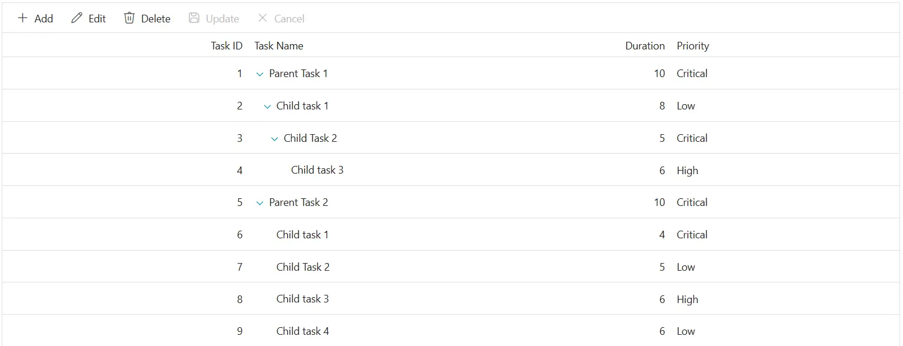
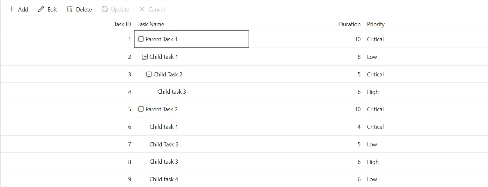

# Expand and collapse icon customization in Syncfusion Blazor TreeGrid

The appearance of expand and collapse icons in the Syncfusion<sup style="font-size:70%">&reg;</sup> Blazor TreeGrid can be customized using CSS. Styling options are available for different aspects of the expand/collapse interface:

- **Expand/collapse icon element:** The icon used to indicate expand or collapse state.
- **Icon size and color:** Properties to modify icon dimensions and visual appearance.

## Customize the expand/collapse icon element

The **.e-icons** class combined with **.e-treegridexpand** or **.e-treegridcollapse** class styles the expand and collapse icons in the Blazor TreeGrid. Apply CSS to customize the icon appearance:

```css
.e-treegrid .e-icons.e-treegridexpand::before,
.e-treegrid .e-icons.e-treegridcollapse::before {
    color: #1ea8bd;
    font-size: 18px;
}
```

Properties such as **color**, **font-size**, **width**, and **height** can be adjusted to match the TreeGrid design. Ensure that custom icons remain clearly visible and maintain adequate contrast for accessibility.



## Change the expand and collapse icon

The expand and collapse icons can be customized by changing the icon glyph using the `::before` pseudo-element content property:

```css
.e-treegrid .e-icons.e-treegridexpand::before {
    content: '\e7c9';
}

.e-treegrid .e-icons.e-treegridcollapse::before {
    content: '\e80f';
}
```

Modify the `content` value to use different glyphs from the icon font. Confirm that the appropriate icon font family is available so glyphs render correctly. Refer to the [Syncfusion icons](https://blazor.syncfusion.com/documentation/appearance/icons) documentation to choose glyphs for your theme.




## Customize the expand/collapse icon on hover

Apply hover styles to expand/collapse icons for better user interaction:

```css
.e-treegrid .e-icons.e-treegridexpand:hover::before,
.e-treegrid .e-icons.e-treegridcollapse:hover::before {
    color: #ff6b6b;
    font-weight: bold;
}
```

This allows users to see visual feedback when interacting with expand/collapse controls.




@using Syncfusion.Blazor.TreeGrid;

<SfTreeGrid DataSource="@TreeGridData" IdMapping="TaskId" ParentIdMapping="ParentId" TreeColumnIndex="1" Toolbar="@(new List<string>() { "Add", "Edit", "Delete", "Update", "Cancel" })">
    <TreeGridEditSettings AllowAdding="true" AllowEditing="true" AllowDeleting="true"  Mode="Syncfusion.Blazor.TreeGrid.EditMode.Row"></TreeGridEditSettings>
    <TreeGridColumns>
        <TreeGridColumn Field=@nameof(TreeData.BusinessObject.TaskId) HeaderText="Task ID" IsPrimaryKey="true" TextAlign="Syncfusion.Blazor.Grids.TextAlign.Right" Width="140"></TreeGridColumn>
        <TreeGridColumn Field=@nameof(TreeData.BusinessObject.TaskName) HeaderText="Task Name" Width="120"></TreeGridColumn>
        <TreeGridColumn Field=@nameof(TreeData.BusinessObject.Duration) HeaderText="Duration" TextAlign="Syncfusion.Blazor.Grids.TextAlign.Right" Width="120"></TreeGridColumn>
        <TreeGridColumn Field=@nameof(TreeData.BusinessObject.Priority) HeaderText="Priority" Width="130"></TreeGridColumn>
    </TreeGridColumns>
</SfTreeGrid>

<style>
    .e-treegrid .e-icons.e-treegridexpand::before,
    .e-treegrid .e-icons.e-treegridcollapse::before {
        color: #1ea8bd;
        font-size: 18px;
    }
    
    .e-treegrid .e-icons.e-treegridexpand::before {
        content: '\e7c9';
    }

    .e-treegrid .e-icons.e-treegridcollapse::before {
        content: '\e80f';
    }
    
    .e-treegrid .e-icons.e-treegridexpand:hover::before,
    .e-treegrid .e-icons.e-treegridcollapse:hover::before {
        color: #ff6b6b;
    }
</style>

@code {
    private List<TreeData.BusinessObject> TreeGridData { get; set; }
    protected override void OnInitialized()
    {
        TreeGridData = TreeData.GetSelfDataSource().ToList();
    }
    public class TreeData
    {
        public class BusinessObject
        {
            public int TaskId { get; set; }
            public string TaskName { get; set; }
            public int? Duration { get; set; }
            public int? Progress { get; set; }
            public string Priority { get; set; }
            public int? ParentId { get; set; }
        }

        internal static List<BusinessObject> GetSelfDataSource()
        {
            List<BusinessObject> BusinessObjectCollection = new List<BusinessObject>();
            BusinessObjectCollection.Add(new BusinessObject() { TaskId = 1, TaskName = "Parent Task 1", Duration = 10, Progress = 70, Priority = "Critical", ParentId = null });
            BusinessObjectCollection.Add(new BusinessObject() { TaskId = 2, TaskName = "Child task 1", Duration = 8, Progress = 80, Priority = "Low", ParentId = 1 });
            BusinessObjectCollection.Add(new BusinessObject() { TaskId = 3, TaskName = "Child Task 2", Duration = 5, Progress = 65, Priority = "Critical", ParentId = 2 });
            BusinessObjectCollection.Add(new BusinessObject() { TaskId = 4, TaskName = "Child task 3", Duration = 6, Progress = 77, Priority = "High", ParentId = 3 });
            BusinessObjectCollection.Add(new BusinessObject() { TaskId = 5, TaskName = "Parent Task 2", Duration = 10, Progress = 70, Priority = "Critical", ParentId = null });
            BusinessObjectCollection.Add(new BusinessObject() { TaskId = 6, TaskName = "Child task 1", Duration = 4, Progress = 80, Priority = "Critical", ParentId = 5 });
            BusinessObjectCollection.Add(new BusinessObject() { TaskId = 7, TaskName = "Child Task 2", Duration = 5, Progress = 65, Priority = "Low", ParentId = 5 });
            BusinessObjectCollection.Add(new BusinessObject() { TaskId = 8, TaskName = "Child task 3", Duration = 6, Progress = 77, Priority = "High", ParentId = 5 });
            BusinessObjectCollection.Add(new BusinessObject() { TaskId = 9, TaskName = "Child task 4", Duration = 6, Progress = 77, Priority = "Low", ParentId = 5 });
            return BusinessObjectCollection;
        }
    }
}






