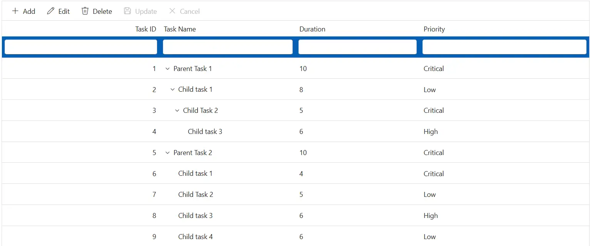
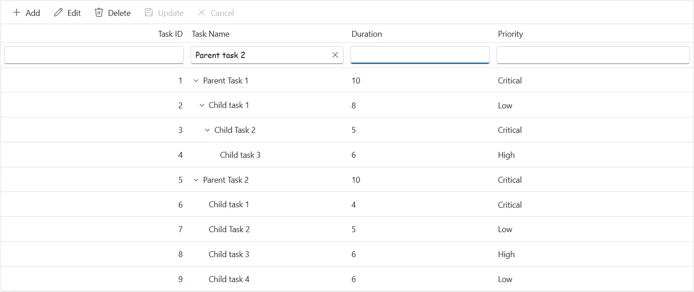
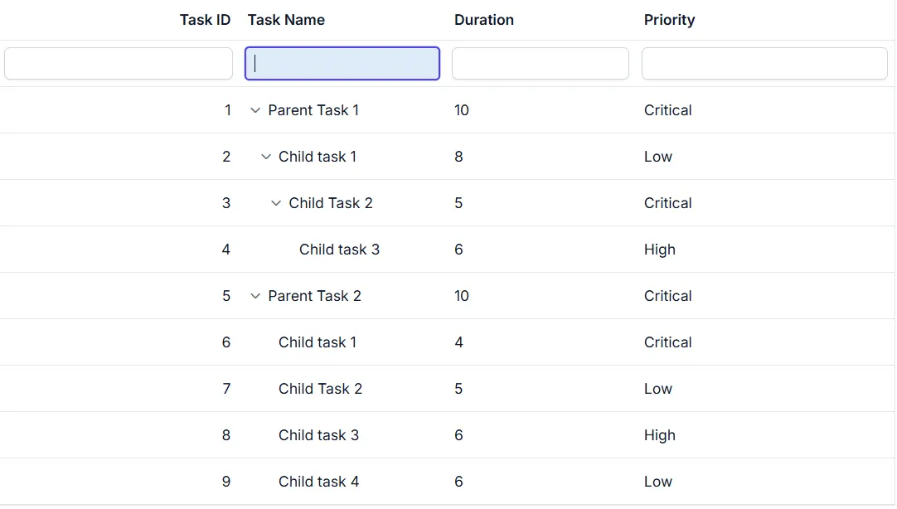
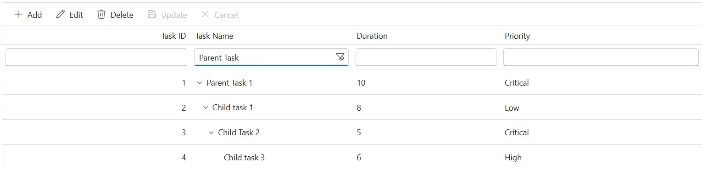
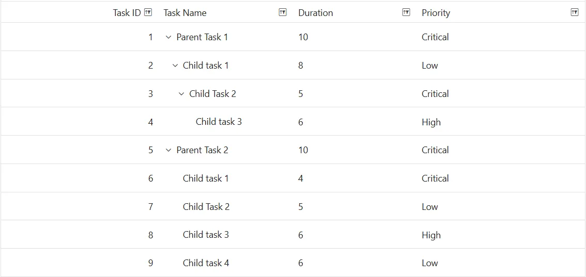
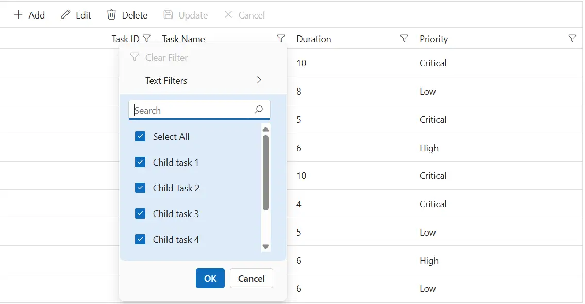
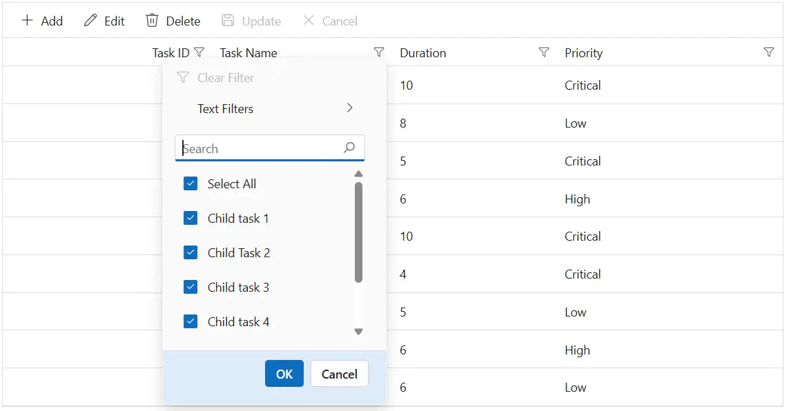
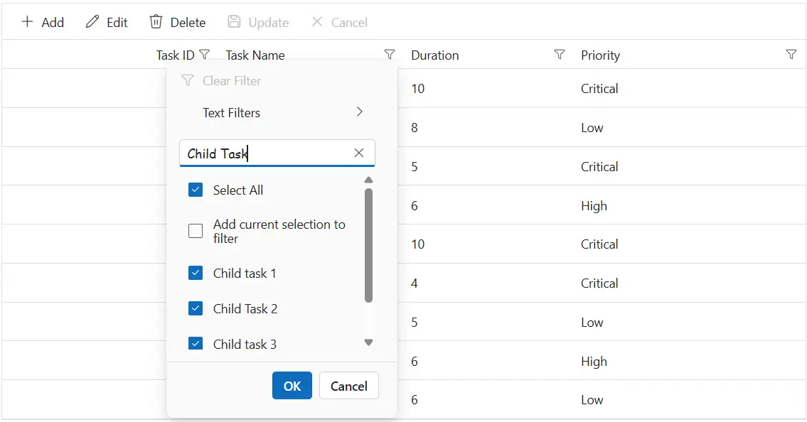
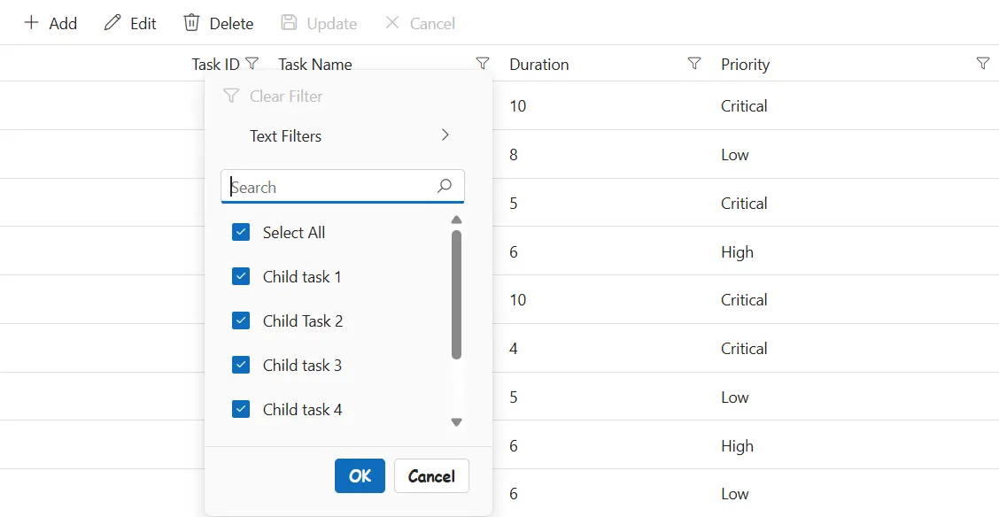
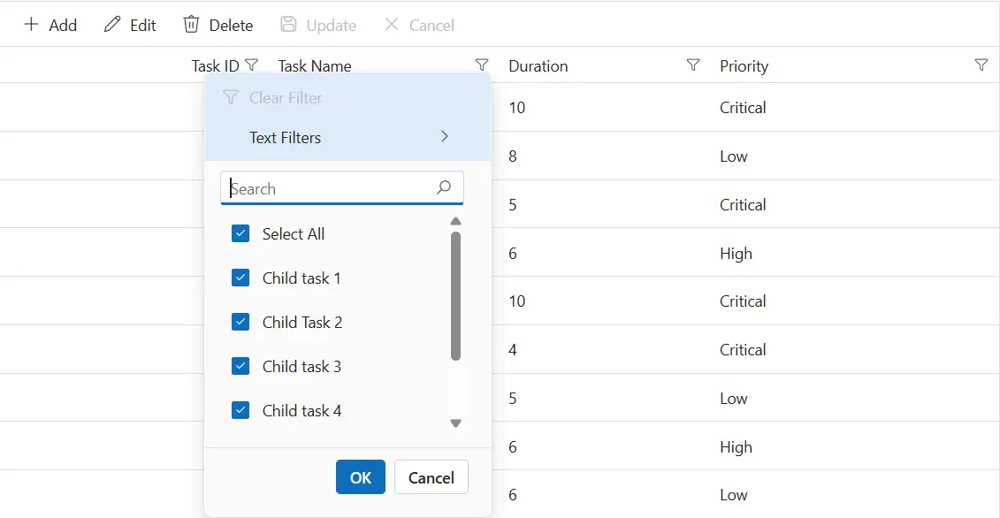

# Filtering customization in Syncfusion Blazor TreeGrid

The appearance of filtering elements in the Syncfusion<sup style="font-size:70%">&reg;</sup> Blazor TreeGrid can be customized using CSS. Styling options are available for different parts of the filtering interface:

- **Filter bar cell and input elements:** Used to enter filter values directly in the header row.
- **Input focus styles:** Visual highlight applied when the filter input field is focused.
- **Clear and filter icons:** Icons for clearing filter values and indicating active filters in column headers.
- **Filter dialog content and footer:** Sections of the filter popup used for entering filter criteria and confirming actions.
- **Input fields and buttons within the filter dialog:** Controls used to specify filter values and apply or cancel filtering.
- **Excel-style number filter visuals:** Menu-style interface for selecting numeric filter conditions in Excel-like filtering mode.

## Customize the filter bar cell element

The **.e-filterbarcell** class styles the filter bar cells in the header row. Use CSS to adjust its appearance:

```css
.e-treegrid .e-filterbarcell {
    background-color: #045fb4;
}
```

Properties like **background-color**, **padding**, and **border** can be changed to visually distinguish the filter row from header cells.



## Customize the filter bar input element

The **.e-input** class inside **.e-filterbarcell** styles the input field in the filter bar. Apply CSS to modify its look:

```css
.e-treegrid .e-filterbarcell .e-input-group input.e-input {
    font-family: cursive;
}
```

Adjust properties such as **font-family**, **font-size**, and **border** can be adjusted to improve readability and match the TreeGrid design.



## Customize the input focus

The **.e-input-focus** class styles the filter bar input group when focused. Apply CSS to change its appearance:

```css
.e-treegrid .e-filterbarcell .e-input-group.e-input-focus {
    background-color: #deecf9;
}
```

Change properties like **background-color** and **border** to enhance focus visibility and support keyboard navigation.



## Customize the filter bar input clear icon

The **.e-clear-icon::before** class defines the clear icon in the filter bar input. Apply CSS to change its appearance:

```css
.e-treegrid .e-filterbarcell .e-input-group .e-clear-icon::before {
    content: '\e72c';
}
```

The `content` property can be updated to use a different glyph from the icon set.






@using Syncfusion.Blazor.TreeGrid

<SfTreeGrid DataSource="@TreeGridData"
        IdMapping="TaskId"
        ParentIdMapping="ParentId"
        TreeColumnIndex="1"
        AllowFiltering="true"
        AllowPaging="true">
    <TreeGridPageSettings PageSize="8"></TreeGridPageSettings>
    <TreeGridColumns>
        <TreeGridColumn Field=@nameof(TreeData.BusinessObject.TaskId) HeaderText="Task ID" TextAlign="Syncfusion.Blazor.Grids.TextAlign.Right" Width="140"></TreeGridColumn>
        <TreeGridColumn Field=@nameof(TreeData.BusinessObject.TaskName) HeaderText="Task Name" Width="120"></TreeGridColumn>
        <TreeGridColumn Field=@nameof(TreeData.BusinessObject.Duration) HeaderText="Duration" TextAlign="Syncfusion.Blazor.Grids.TextAlign.Right" Width="120"></TreeGridColumn>
        <TreeGridColumn Field=@nameof(TreeData.BusinessObject.Progress) HeaderText="Progress" Width="100"></TreeGridColumn>
    </TreeGridColumns>
</SfTreeGrid>

<style>
    .e-treegrid .e-filterbarcell {
        background-color: #045fb4;
        color: #ffffff;
    }

    .e-treegrid .e-filterbarcell .e-input-group input.e-input {
        font-family: cursive;
    }

    .e-treegrid .e-filterbarcell .e-input-group.e-input-focus {
        background-color: #deecf9;
    }

    .e-treegrid .e-filterbarcell .e-input-group .e-clear-icon::before {
        font-family: 'e-icons' !important;
        font-weight: normal;
        content: '\e72c';
    }

    /* Optional: highlight the focused filter cell for keyboard users */
    .e-treegrid .e-filterbarcell:focus-visible {
        outline: 2px solid #005a9e;
        outline-offset: -2px;
    }
</style>

@code {
    private List<TreeData.BusinessObject> TreeGridData { get; set; }

    protected override void OnInitialized()
    {
        TreeGridData = TreeData.GetSelfDataSource().ToList();
    }
}



namespace TreeGridComponent.Data
{
    public class TreeData
    {
        public class BusinessObject
        {
            public int TaskId { get; set; }
            public string TaskName { get; set; }
            public int? Duration { get; set; }
            public int? Progress { get; set; }
            public string Priority { get; set; }
            public int? ParentId { get; set; }
        }

        internal static List<BusinessObject> GetSelfDataSource()
        {
            List<BusinessObject> BusinessObjectCollection = new List<BusinessObject>();
            BusinessObjectCollection.Add(new BusinessObject() { TaskId = 1, TaskName = "Parent Task 1", Duration = 10, Progress = 70, Priority = "Critical", ParentId = null });
            BusinessObjectCollection.Add(new BusinessObject() { TaskId = 2, TaskName = "Child task 1", Duration = 8, Progress = 80, Priority = "Low", ParentId = 1 });
            BusinessObjectCollection.Add(new BusinessObject() { TaskId = 3, TaskName = "Child Task 2", Duration = 5, Progress = 65, Priority = "Critical", ParentId = 2 });
            BusinessObjectCollection.Add(new BusinessObject() { TaskId = 4, TaskName = "Child task 3", Duration = 6, Progress = 77, Priority = "High", ParentId = 3 });
            BusinessObjectCollection.Add(new BusinessObject() { TaskId = 5, TaskName = "Parent Task 2", Duration = 10, Progress = 70, Priority = "Critical", ParentId = null });
            BusinessObjectCollection.Add(new BusinessObject() { TaskId = 6, TaskName = "Child task 1", Duration = 4, Progress = 80, Priority = "Critical", ParentId = 5 });
            BusinessObjectCollection.Add(new BusinessObject() { TaskId = 7, TaskName = "Child Task 2", Duration = 5, Progress = 65, Priority = "Low", ParentId = 5 });
            BusinessObjectCollection.Add(new BusinessObject() { TaskId = 8, TaskName = "Child task 3", Duration = 6, Progress = 77, Priority = "High", ParentId = 5 });
            BusinessObjectCollection.Add(new BusinessObject() { TaskId = 9, TaskName = "Child task 4", Duration = 6, Progress = 77, Priority = "Low", ParentId = 5 });
            return BusinessObjectCollection;
        }
    }
}






## Customize the filtering icon in the header

The **.e-icon-filter::before** class styles the filter icon in column headers. Apply CSS to modify its look:

```css
.e-treegrid .e-icon-filter::before {
    content: '\e81e';
}
```

Update the `content` value to match the desired icon glyph.



## Customize the filter dialog content

The **.e-filter-popup .e-dlg-content** class styles the content area of the filter dialog. Apply CSS to change its appearance:

```css
.e-treegrid .e-filter-popup .e-dlg-content {
    background-color: #deecf9;
}
```

Modify properties such as **background-color**, **padding**, and **border** to match the application theme.



## Customize the filter dialog footer

The **.e-filter-popup .e-footer-content** class styles the footer section of the filter dialog. Apply CSS to adjust its appearance:

```css
.e-treegrid .e-filter-popup .e-footer-content {
    background-color: #deecf9;
}
```

Properties like **background-color**, **text-align**, and **border** can be changed to align with the layout design.



## Customize the filter dialog input field

The **.e-input** class inside **.e-filter-popup** targets input fields in the filter dialog. Use CSS to adjust its appearance:

```css
.e-treegrid .e-filter-popup .e-input-group input.e-input {
    font-family: cursive;
}
```

Adjust properties such as **font-family**, **color**, and **border** to improve clarity and consistency.



## Customize the filter dialog button element

The **.e-filter-popup .e-btn** class styles buttons inside the filter dialog. Apply CSS to modify their appearance:

```css
.e-treegrid .e-filter-popup .e-btn {
    font-family: cursive;
}
```

Change properties like **font-family**, **background-color**, and **border** to match the design.



## Customize the Excel-style number filter menu

The **.e-contextmenu-container ul** class inside **.e-filter-popup** styles the number filter list in the Excel-style filter dialog. Apply CSS to change its appearance:

```css
.e-treegrid .e-filter-popup .e-contextmenu-container ul {
    background-color: #deecf9;
}
```

Properties such as **background-color**, **color**, and **text-align** can be adjusted to match the required design.






@using Syncfusion.Blazor.TreeGrid

<SfTreeGrid DataSource="@TreeGridData"
        IdMapping="TaskId"
        ParentIdMapping="ParentId"
        TreeColumnIndex="1"
        AllowFiltering="true"
        AllowPaging="true">
    <TreeGridPageSettings PageSize="8"></TreeGridPageSettings>
    <TreeGridFilterSettings Type="FilterType.Menu"></TreeGridFilterSettings>
    <TreeGridColumns>
        <TreeGridColumn Field=@nameof(TreeData.BusinessObject.TaskId) HeaderText="Task ID" TextAlign="Syncfusion.Blazor.Grids.TextAlign.Right" Width="140"></TreeGridColumn>
        <TreeGridColumn Field=@nameof(TreeData.BusinessObject.TaskName) HeaderText="Task Name" Width="120"></TreeGridColumn>
        <TreeGridColumn Field=@nameof(TreeData.BusinessObject.Duration) HeaderText="Duration" TextAlign="Syncfusion.Blazor.Grids.TextAlign.Right" Width="120"></TreeGridColumn>
        <TreeGridColumn Field=@nameof(TreeData.BusinessObject.Progress) HeaderText="Progress" Width="100"></TreeGridColumn>
    </TreeGridColumns>
</SfTreeGrid>

<style>
    .e-treegrid .e-icon-filter::before {
        font-family: 'e-icons' !important;
        font-weight: normal;
        content: '\e81e';
    }

    .e-treegrid .e-filter-popup .e-dlg-content,
    .e-treegrid .e-filter-popup .e-footer-content,
    .e-treegrid .e-filter-popup .e-contextmenu-container ul {
        background-color: #deecf9;
    }

    .e-treegrid .e-filter-popup .e-input-group input.e-input,
    .e-treegrid .e-filter-popup .e-btn {
        font-family: cursive;
    }

    /* Optional: focus outline inside the filter dialog for keyboard users */
    .e-treegrid .e-filter-popup .e-input-group input.e-input:focus-visible,
    .e-treegrid .e-filter-popup .e-btn:focus-visible {
        outline: 2px solid #005a9e;
        outline-offset: 2px;
    }
</style>

@code {
    private List<TreeData.BusinessObject> TreeGridData { get; set; }

    protected override void OnInitialized()
    {
        TreeGridData = TreeData.GetSelfDataSource().ToList();
    }
}



namespace TreeGridComponent.Data
{
    public class TreeData
    {
        public class BusinessObject
        {
            public int TaskId { get; set; }
            public string TaskName { get; set; }
            public int? Duration { get; set; }
            public int? Progress { get; set; }
            public string Priority { get; set; }
            public int? ParentId { get; set; }
        }

        internal static List<BusinessObject> GetSelfDataSource()
        {
            List<BusinessObject> BusinessObjectCollection = new List<BusinessObject>();
            BusinessObjectCollection.Add(new BusinessObject() { TaskId = 1, TaskName = "Parent Task 1", Duration = 10, Progress = 70, Priority = "Critical", ParentId = null });
            BusinessObjectCollection.Add(new BusinessObject() { TaskId = 2, TaskName = "Child task 1", Duration = 8, Progress = 80, Priority = "Low", ParentId = 1 });
            BusinessObjectCollection.Add(new BusinessObject() { TaskId = 3, TaskName = "Child Task 2", Duration = 5, Progress = 65, Priority = "Critical", ParentId = 2 });
            BusinessObjectCollection.Add(new BusinessObject() { TaskId = 4, TaskName = "Child task 3", Duration = 6, Progress = 77, Priority = "High", ParentId = 3 });
            BusinessObjectCollection.Add(new BusinessObject() { TaskId = 5, TaskName = "Parent Task 2", Duration = 10, Progress = 70, Priority = "Critical", ParentId = null });
            BusinessObjectCollection.Add(new BusinessObject() { TaskId = 6, TaskName = "Child task 1", Duration = 4, Progress = 80, Priority = "Critical", ParentId = 5 });
            BusinessObjectCollection.Add(new BusinessObject() { TaskId = 7, TaskName = "Child Task 2", Duration = 5, Progress = 65, Priority = "Low", ParentId = 5 });
            BusinessObjectCollection.Add(new BusinessObject() { TaskId = 8, TaskName = "Child task 3", Duration = 6, Progress = 77, Priority = "High", ParentId = 5 });
            BusinessObjectCollection.Add(new BusinessObject() { TaskId = 9, TaskName = "Child task 4", Duration = 6, Progress = 77, Priority = "Low", ParentId = 5 });
            return BusinessObjectCollection;
        }
    }
}




