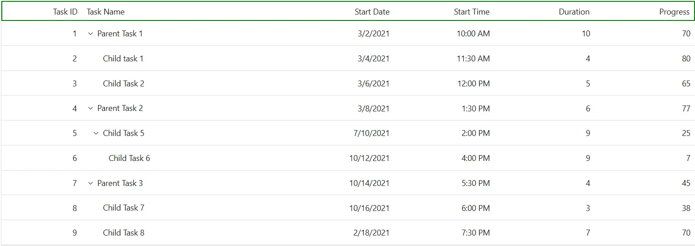
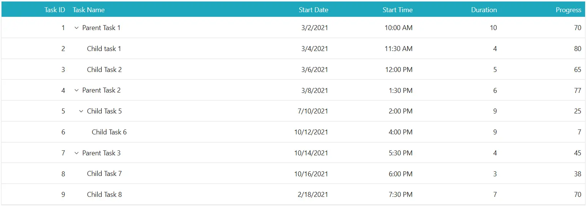
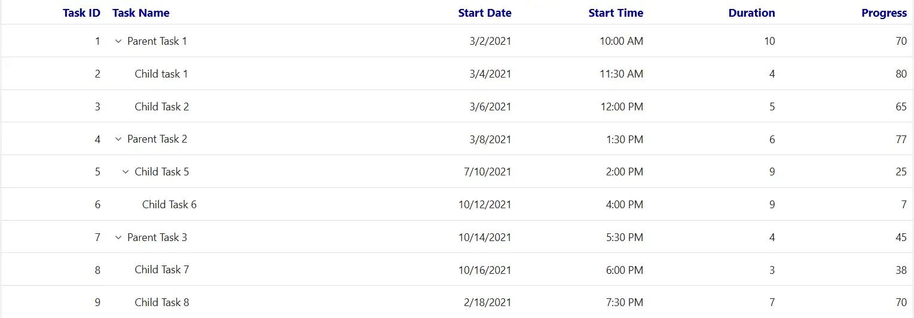

# Header customization in Syncfusion Blazor TreeGrid

The appearance of header elements in the Syncfusion<sup style="font-size:70%">&reg;</sup> Blazor TreeGrid can be customized using CSS. Styling options are available for different parts of the header interface:

- **Header container**: The outer wrapper that holds all column headers.
- **Header cells**: Individual containers for each column title and associated icons.
- **Header text container**: The inner element that holds the header text content.

## Customize the Blazor TreeGrid header

The **.e-gridheader** class styles the header container in the Blazor TreeGrid. Use CSS to adjust its appearance:

```css
.e-treegrid .e-gridheader {
    border: 2px solid green;
}
```

Style Properties like  **border**, **padding**, and **background-color** can be changed to fit the TreeGrid layout design.



## Customize the Blazor TreeGrid header cell

The **.e-headercell** class styles individual header cells in the Blazor TreeGrid. Apply CSS to modify its look:

```css
.e-treegrid .e-headercell {
    color: #ffffff;
    background-color: #1ea8bd;
}
```

Properties such as **color**, **background-color**, **font**, and alignment can be adjusted to align with the TreeGrid design.



## Customize the Blazor TreeGrid header cell div element

The **.e-headercelldiv** class styles the text container inside each header cell. Apply CSS to change its appearance:

```css
.e-treegrid .e-headercelldiv {
    font-size: 15px;
    font-weight: bold;
    color: darkblue;
}
```

Change properties like **font-size**, **font-weight**, and **color** to highlight the header text and improve clarity.






@using Syncfusion.Blazor.TreeGrid;

<SfTreeGrid DataSource="@TreeData" IdMapping="TaskId" ParentIdMapping="ParentId" TreeColumnIndex="1">
    <TreeGridColumns>
        <TreeGridColumn Field="TaskId" HeaderText="Task ID" Width="80" TextAlign="Syncfusion.Blazor.Grids.TextAlign.Right"></TreeGridColumn>
        <TreeGridColumn Field="TaskName" HeaderText="Task Name" Width="160"></TreeGridColumn>
        <TreeGridColumn Field="StartDate" HeaderText="Start Date" Format="d" Type="Syncfusion.Blazor.Grids.ColumnType.DateOnly" Width="152" TextAlign="Syncfusion.Blazor.Grids.TextAlign.Right"></TreeGridColumn>
        <TreeGridColumn Field="StartTime" HeaderText="Start Time" Type="Syncfusion.Blazor.Grids.ColumnType.TimeOnly" Width="100" TextAlign="Syncfusion.Blazor.Grids.TextAlign.Right"></TreeGridColumn>
        <TreeGridColumn Field="Duration" HeaderText="Duration" Width="100" TextAlign="Syncfusion.Blazor.Grids.TextAlign.Right"></TreeGridColumn>
        <TreeGridColumn Field="Progress" HeaderText="Progress" Width="100" TextAlign="Syncfusion.Blazor.Grids.TextAlign.Right"></TreeGridColumn>
    </TreeGridColumns>
</SfTreeGrid>
<style>
    .e-grid .e-headercelldiv {
        font-size: 15px;
        font-weight: bold;
        color: darkblue;
    }
</style>
@code {
    public class BusinessObject
    {
        public int TaskId { get; set; }
        public string TaskName { get; set; }
        public DateOnly? StartDate { get; set; }
        public TimeOnly? StartTime { get; set; }
        public int Duration { get; set; }
        public int Progress { get; set; }
        public string Priority { get; set; }
        public int? ParentId { get; set; }
    }

    public List<BusinessObject> TreeData = new List<BusinessObject>();

    protected override void OnInitialized()
    {
        TreeData.Add(new BusinessObject() { TaskId = 1, TaskName = "Parent Task 1", StartDate = new DateOnly(2021, 03, 02), StartTime = new TimeOnly(10, 00, 00), Duration = 10, Progress = 70, ParentId = null, Priority = "High" });
        TreeData.Add(new BusinessObject() { TaskId = 2, TaskName = "Child task 1", StartDate = new DateOnly(2021, 03, 04), StartTime = new TimeOnly(11, 30, 00), Duration = 4, Progress = 80, ParentId = 1, Priority = "Normal" });
        TreeData.Add(new BusinessObject() { TaskId = 3, TaskName = "Child Task 2", StartDate = new DateOnly(2021, 03, 06), StartTime = new TimeOnly(12, 00, 00), Duration = 5, Progress = 65, ParentId = 1, Priority = "Critical" });
        TreeData.Add(new BusinessObject() { TaskId = 4, TaskName = "Parent Task 2", StartDate = new DateOnly(2021, 03, 08), StartTime = new TimeOnly(13, 30, 00), Duration = 6, Progress = 77, ParentId = null, Priority = "Low" });
        TreeData.Add(new BusinessObject() { TaskId = 5, TaskName = "Child Task 5", StartDate = new DateOnly(2021, 07, 10), StartTime = new TimeOnly(14, 00, 00), Duration = 9, Progress = 25, ParentId = 4, Priority = "Normal" });
        TreeData.Add(new BusinessObject() { TaskId = 6, TaskName = "Child Task 6", StartDate = new DateOnly(2021, 10, 12), StartTime = new TimeOnly(16, 00, 00), Duration = 9, Progress = 7, ParentId = 5, Priority = "Normal" });
        TreeData.Add(new BusinessObject() { TaskId = 7, TaskName = "Parent Task 3", StartDate = new DateOnly(2021, 10, 14), StartTime = new TimeOnly(17, 30, 00), Duration = 4, Progress = 45, ParentId = null, Priority = "High" });
        TreeData.Add(new BusinessObject() { TaskId = 8, TaskName = "Child Task 7", StartDate = new DateOnly(2021, 10, 16), StartTime = new TimeOnly(18, 00, 00), Duration = 3, Progress = 38, ParentId = 7, Priority = "Critical" });
        TreeData.Add(new BusinessObject() { TaskId = 9, TaskName = "Child Task 8", StartDate = new DateOnly(2021, 02, 18), StartTime = new TimeOnly(19, 30, 00), Duration = 7, Progress = 70, ParentId = 7, Priority = "Low" });
    }
}






## Hide the Blazor TreeGrid header

The **.e-gridheader .e-columnheader** class combination targets the column header row in the Blazor TreeGrid. Use CSS to hide the header:

```css
.e-treegrid .e-gridheader .e-columnheader {
    display: none;
}
```

To hide the header for a specific TreeGrid only, apply the style using the grid's ID:

```css
#TreeGrid.e-treegrid .e-gridheader .e-columnheader {
    display: none;
}
```

> Hiding headers also removes visual elements such as sorting arrows, filter icons, and column menu buttons. This may affect accessibility. If headers are hidden, ensure alternative labels are provided using attributes like `aria-label` or `aria-labelledby`.




@using Syncfusion.Blazor.TreeGrid;

<SfTreeGrid DataSource="@TreeData" IdMapping="TaskId" ParentIdMapping="ParentId" TreeColumnIndex="1">
    <TreeGridColumns>
        <TreeGridColumn Field="TaskId" HeaderText="Task ID" Width="80" TextAlign="Syncfusion.Blazor.Grids.TextAlign.Right"></TreeGridColumn>
        <TreeGridColumn Field="TaskName" HeaderText="Task Name" Width="160"></TreeGridColumn>
        <TreeGridColumn Field="StartDate" HeaderText="Start Date" Format="d" Type="Syncfusion.Blazor.Grids.ColumnType.DateOnly" Width="152" TextAlign="Syncfusion.Blazor.Grids.TextAlign.Right"></TreeGridColumn>
        <TreeGridColumn Field="StartTime" HeaderText="Start Time" Type="Syncfusion.Blazor.Grids.ColumnType.TimeOnly" Width="100" TextAlign="Syncfusion.Blazor.Grids.TextAlign.Right"></TreeGridColumn>
        <TreeGridColumn Field="Duration" HeaderText="Duration" Width="100" TextAlign="Syncfusion.Blazor.Grids.TextAlign.Right"></TreeGridColumn>
        <TreeGridColumn Field="Progress" HeaderText="Progress" Width="100" TextAlign="Syncfusion.Blazor.Grids.TextAlign.Right"></TreeGridColumn>
    </TreeGridColumns>
</SfTreeGrid>
<style>
    .e-treegrid .e-gridheader .e-columnheader {
        display: none;
    }
</style>
@code {
    public class BusinessObject
    {
        public int TaskId { get; set; }
        public string TaskName { get; set; }
        public DateOnly? StartDate { get; set; }
        public TimeOnly? StartTime { get; set; }
        public int Duration { get; set; }
        public int Progress { get; set; }
        public string Priority { get; set; }
        public int? ParentId { get; set; }
    }

    public List<BusinessObject> TreeData = new List<BusinessObject>();

    protected override void OnInitialized()
    {
        TreeData.Add(new BusinessObject() { TaskId = 1, TaskName = "Parent Task 1", StartDate = new DateOnly(2021, 03, 02), StartTime = new TimeOnly(10, 00, 00), Duration = 10, Progress = 70, ParentId = null, Priority = "High" });
        TreeData.Add(new BusinessObject() { TaskId = 2, TaskName = "Child task 1", StartDate = new DateOnly(2021, 03, 04), StartTime = new TimeOnly(11, 30, 00), Duration = 4, Progress = 80, ParentId = 1, Priority = "Normal" });
        TreeData.Add(new BusinessObject() { TaskId = 3, TaskName = "Child Task 2", StartDate = new DateOnly(2021, 03, 06), StartTime = new TimeOnly(12, 00, 00), Duration = 5, Progress = 65, ParentId = 1, Priority = "Critical" });
        TreeData.Add(new BusinessObject() { TaskId = 4, TaskName = "Parent Task 2", StartDate = new DateOnly(2021, 03, 08), StartTime = new TimeOnly(13, 30, 00), Duration = 6, Progress = 77, ParentId = null, Priority = "Low" });
        TreeData.Add(new BusinessObject() { TaskId = 5, TaskName = "Child Task 5", StartDate = new DateOnly(2021, 07, 10), StartTime = new TimeOnly(14, 00, 00), Duration = 9, Progress = 25, ParentId = 4, Priority = "Normal" });
        TreeData.Add(new BusinessObject() { TaskId = 6, TaskName = "Child Task 6", StartDate = new DateOnly(2021, 10, 12), StartTime = new TimeOnly(16, 00, 00), Duration = 9, Progress = 7, ParentId = 5, Priority = "Normal" });
        TreeData.Add(new BusinessObject() { TaskId = 7, TaskName = "Parent Task 3", StartDate = new DateOnly(2021, 10, 14), StartTime = new TimeOnly(17, 30, 00), Duration = 4, Progress = 45, ParentId = null, Priority = "High" });
        TreeData.Add(new BusinessObject() { TaskId = 8, TaskName = "Child Task 7", StartDate = new DateOnly(2021, 10, 16), StartTime = new TimeOnly(18, 00, 00), Duration = 3, Progress = 38, ParentId = 7, Priority = "Critical" });
        TreeData.Add(new BusinessObject() { TaskId = 9, TaskName = "Child Task 8", StartDate = new DateOnly(2021, 02, 18), StartTime = new TimeOnly(19, 30, 00), Duration = 7, Progress = 70, ParentId = 7, Priority = "Low" });
    }
}




