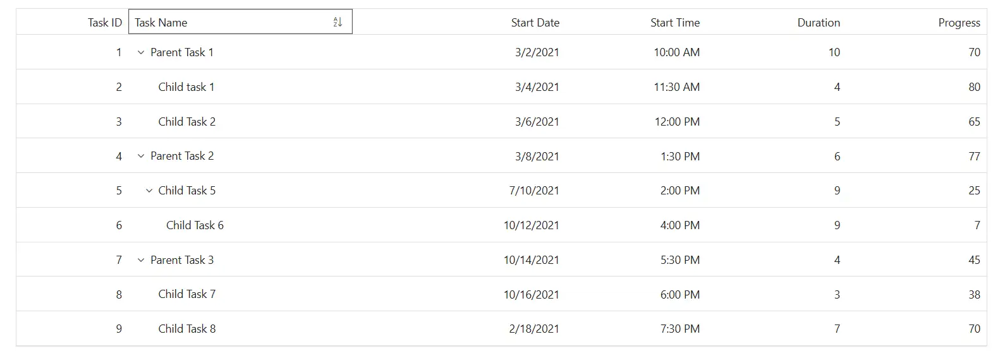
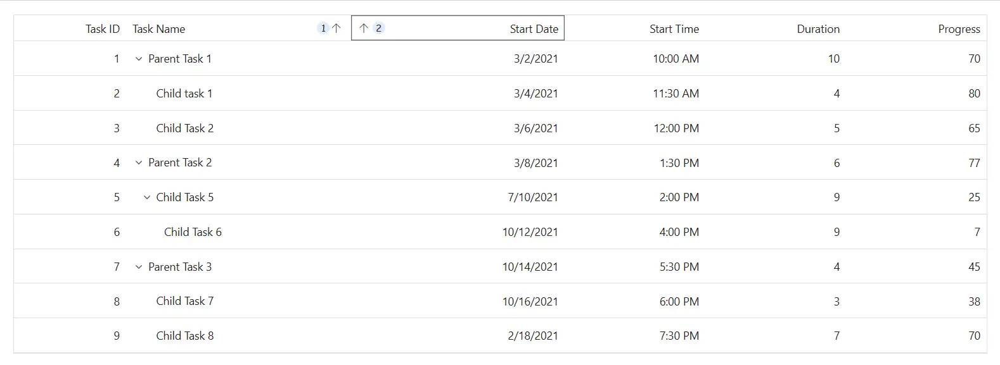

# Sorting customization in Syncfusion Blazor TreeGrid

The appearance of sorting indicators in the Syncfusion<sup style="font-size:70%">&reg;</sup> Blazor TreeGrid can be customized using CSS. Styling options are available for:

- **Ascending and descending sort icons:** Show the current sort direction in column headers.
- **Multi-sorting order indicators:** Display the order of sorting when multiple columns are sorted.

## Customize sorting icons

The **.e-icon-ascending** and **.e-icon-descending** classes define the icons shown in the TreeGrid header when a column is sorted in `ascending` or `descending` order. Use CSS to adjust its appearance:

```css
.e-treegrid .e-gridheader .e-icon-ascending::before {
     content: '\e7a3'; /* Ascending icon code */
 }

 .e-treegrid .e-gridheader .e-icon-descending::before {
     content: '\e7b6'; /* Descending icon code */
 }
```

Adjust properties such as **content**, **color**, **font-size**, and **margin** to match the grid design. Ensure the correct icon font family is loaded to display the icons properly.



## Customize multi-sorting indicators

The **.e-sortnumber** class styles the numeric indicator shown when multiple columns are sorted. Apply CSS to change their appearance:

```css
.e-treegrid .e-gridheader .e-sortnumber {
    background-color: #deecf9;
    font-family: cursive;
}
```

Modify properties such as **background-color**, **font-family**, **font-size**, and **border-radius** to align with the grid layout. Ensure accessibility by maintaining clear contrast and focus styles.






@using Syncfusion.Blazor.TreeGrid;

<SfTreeGrid DataSource="@TreeData" IdMapping="TaskId" ParentIdMapping="ParentId" TreeColumnIndex="1" AllowSorting AllowMultiSorting>
    <TreeGridColumns>
        <TreeGridColumn Field="TaskId" HeaderText="Task ID" Width="80" TextAlign="Syncfusion.Blazor.Grids.TextAlign.Right"></TreeGridColumn>
        <TreeGridColumn Field="TaskName" HeaderText="Task Name" Width="160"></TreeGridColumn>
        <TreeGridColumn Field="StartDate" HeaderText="Start Date" Format="d" Type="Syncfusion.Blazor.Grids.ColumnType.DateOnly" Width="152" TextAlign="Syncfusion.Blazor.Grids.TextAlign.Right"></TreeGridColumn>
        <TreeGridColumn Field="StartTime" HeaderText="Start Time" Type="Syncfusion.Blazor.Grids.ColumnType.TimeOnly" Width="100" TextAlign="Syncfusion.Blazor.Grids.TextAlign.Right"></TreeGridColumn>
        <TreeGridColumn Field="Duration" HeaderText="Duration" Width="100" TextAlign="Syncfusion.Blazor.Grids.TextAlign.Right"></TreeGridColumn>
        <TreeGridColumn Field="Progress" HeaderText="Progress" Width="100" TextAlign="Syncfusion.Blazor.Grids.TextAlign.Right"></TreeGridColumn>
    </TreeGridColumns>
</SfTreeGrid>

<style>
    /* Multi-sorting order badge (e.g., 1, 2, 3) */
    .e-treegrid .e-gridheader .e-sortnumber {
        background-color: #deecf9;
        color: #0b6aa2;
        font-family: cursive;
        border-radius: 10px;
        padding: 0 6px;
        min-width: 18px;
        text-align: center;
        line-height: 18px;
        height: 18px;
        display: inline-block;
        margin-left: 4px;
    }

    /* Override sorting icons (ensure correct icon font family) */
    ..e-treegrid .e-gridheader .e-icon-ascending::before,
    .e-treegrid .e-gridheader .e-icon-descending::before {
        font-family: 'e-icons' !important; /* required for glyphs to render */
        font-weight: normal;
        speak: none;
    }
    .e-treegrid .e-gridheader .e-icon-ascending::before {
        content: '\e7a3'; /* Ascending icon code (verify for your theme/version) */
    }
    .e-treegrid .e-gridheader .e-icon-descending::before {
        content: '\e7b6'; /* Descending icon code (verify for your theme/version) */
    }

    /* Optional: emphasize sorted header and provide better focus visibility */
    .e-treegrid .e-headercell[aria-sort] {
        background-color: #f3f9ff;
    }
    .e-treegrid .e-headercell:focus-visible {
        outline: 2px solid #005a9e;
        outline-offset: -2px;
    }
</style>

@code {
    public class BusinessObject
    {
        public int TaskId { get; set; }
        public string TaskName { get; set; }
        public DateOnly? StartDate { get; set; }
        public TimeOnly? StartTime { get; set; }
        public int Duration { get; set; }
        public int Progress { get; set; }
        public string Priority { get; set; }
        public int? ParentId { get; set; }
    }

    public List<BusinessObject> TreeData = new List<BusinessObject>();

    protected override void OnInitialized()
    {
        TreeData.Add(new BusinessObject() { TaskId = 1, TaskName = "Parent Task 1", StartDate = new DateOnly(2021, 03, 02), StartTime = new TimeOnly(10, 00, 00), Duration = 10, Progress = 70, ParentId = null, Priority = "High" });
        TreeData.Add(new BusinessObject() { TaskId = 2, TaskName = "Child task 1", StartDate = new DateOnly(2021, 03, 04), StartTime = new TimeOnly(11, 30, 00), Duration = 4, Progress = 80, ParentId = 1, Priority = "Normal" });
        TreeData.Add(new BusinessObject() { TaskId = 3, TaskName = "Child Task 2", StartDate = new DateOnly(2021, 03, 06), StartTime = new TimeOnly(12, 00, 00), Duration = 5, Progress = 65, ParentId = 1, Priority = "Critical" });
        TreeData.Add(new BusinessObject() { TaskId = 4, TaskName = "Parent Task 2", StartDate = new DateOnly(2021, 03, 08), StartTime = new TimeOnly(13, 30, 00), Duration = 6, Progress = 77, ParentId = null, Priority = "Low" });
        TreeData.Add(new BusinessObject() { TaskId = 5, TaskName = "Child Task 5", StartDate = new DateOnly(2021, 07, 10), StartTime = new TimeOnly(14, 00, 00), Duration = 9, Progress = 25, ParentId = 4, Priority = "Normal" });
        TreeData.Add(new BusinessObject() { TaskId = 6, TaskName = "Child Task 6", StartDate = new DateOnly(2021, 10, 12), StartTime = new TimeOnly(16, 00, 00), Duration = 9, Progress = 7, ParentId = 5, Priority = "Normal" });
        TreeData.Add(new BusinessObject() { TaskId = 7, TaskName = "Parent Task 3", StartDate = new DateOnly(2021, 10, 14), StartTime = new TimeOnly(17, 30, 00), Duration = 4, Progress = 45, ParentId = null, Priority = "High" });
        TreeData.Add(new BusinessObject() { TaskId = 8, TaskName = "Child Task 7", StartDate = new DateOnly(2021, 10, 16), StartTime = new TimeOnly(18, 00, 00), Duration = 3, Progress = 38, ParentId = 7, Priority = "Critical" });
        TreeData.Add(new BusinessObject() { TaskId = 9, TaskName = "Child Task 8", StartDate = new DateOnly(2021, 02, 18), StartTime = new TimeOnly(19, 30, 00), Duration = 7, Progress = 70, ParentId = 7, Priority = "Low" });
    }
}






