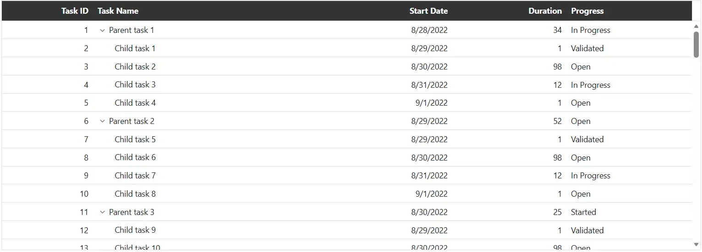
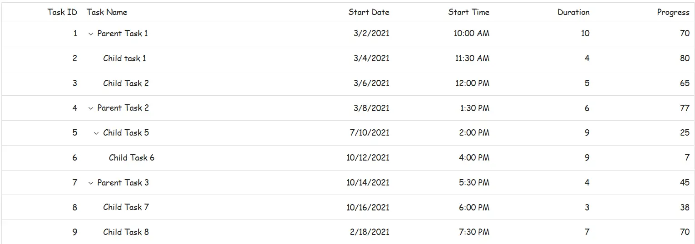
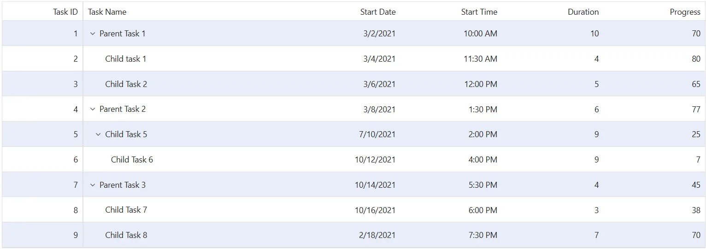
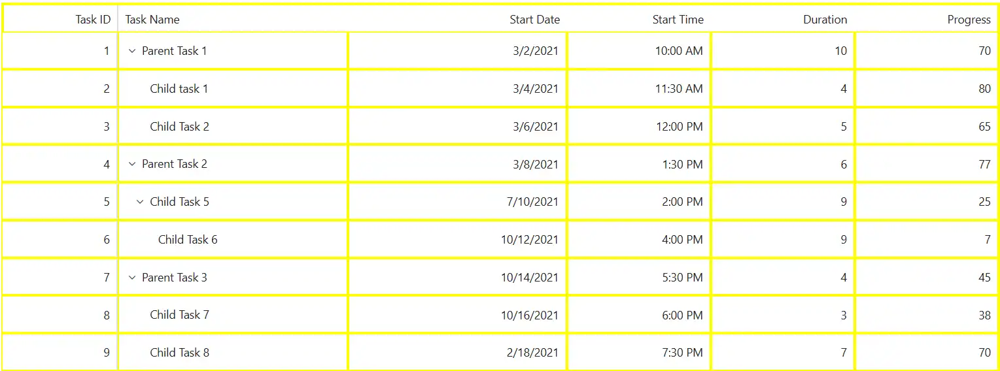

# Style and appearance in Syncfusion Blazor TreeGrid

The Syncfusion<sup style="font-size:70%">&reg;</sup> Blazor TreeGrid supports visual customization using CSS and theme-based styling. Styles can be applied to various elements to match the application's design. Styling options are available for:

- **TreeGrid root element:** Defines the overall appearance of the TreeGrid container.
- **Alternate rows:** Applies styles to alternate rows for improved readability.
- **Grid lines:** Controls the color and visibility of horizontal and vertical lines between cells.
- **Headers and cells:** Customize header appearance and cell styling throughout the grid.

**Override Default Styles:**

Default styles such as **colors**, **typography**, **spacing**, and **borders** can be customized using CSS. Use browser developer tools to inspect the rendered HTML and identify relevant selectors. Where possible, use CSS variables or theme tokens to maintain consistency across components.

```css
.e-treegrid .e-headercell {
    background-color: #333; /* Override the header background color */
    color: #fff;
}
```

Properties like **background-color**, **color**, **font-family**, and **padding** can be changed to match the TreeGrid layout design and improve visual consistency.


**Using Theme Studio:**

## CSS classes and their purposes

The following table lists all CSS classes available in the TreeGrid for styling different sections:

| Section |CSS class | Purpose of CSS class |
| ----- | ----- | ----- |
| **Root** | e-treegrid | Styles applied to the root element div of the TreeGrid control. |
| **Header** | e-gridheader | Styles for the root element of the header. The thin line between header and content can be overridden here. |
| | e-table | Styles applied to the table element of the TreeGrid header. Makes table width 100%. |
| | e-columnheader | Styles for the **tr** element in the TreeGrid header. |
| | e-headercell | Styles for **th** elements in the TreeGrid header. Override header background color and border color here. |
| | e-headercelldiv | Styles for div elements within **th** elements in the header. Use to override header skeleton styling. |
| **Body** | e-gridcontent | Styles for the root of the body content. Use to override background color of the body. |
| | e-table | Styles for the table of the content. Makes table width 100%. |
| | e-altrow | Styles for alternate rows of the TreeGrid. Override alternate row colors here. |
| | e-rowcell | Styles for all cells in the TreeGrid. Override cell appearance and styling. |
| | e-selectionbackground | Styles for selected rowcells of the TreeGrid. Override selection appearance. |
| | e-hover | Styles added to rows when hovering over TreeGrid rows. |
| **Pager** | e-pager | Styles for the root element of the pager. Change appearance, background color, and font color. |
| | e-pagercontainer | Styles for numeric items of the pager. |
| | e-parentmsgbar | Styles for pager information. |
| **Summary** | e-gridfooter | Styles for the root of the summary div. |
| | e-summaryrow | Styles for rows in TreeGrid summary. |
| | e-summarycell | Styles for cells in summary rows. Override background color of summary cells. |

## Customize the TreeGrid root element

The **.e-treegrid** class styles the root container of the Blazor TreeGrid. Apply CSS to modify its appearance:

```css
.e-gridcontent, .e-gridheader {
    font-family: cursive;
}
```

Properties such as **font-family**, **background-color**, and spacing-related styles can be adjusted to align with the TreeGrid design. 



Additional styling can be applied to rows, alternate rows, selected rows, and hover states. Avoid using `!important` for hover styles in production environments. Instead, increase selector specificity to maintain consistent styling control.





@using Syncfusion.Blazor.TreeGrid;

<SfTreeGrid DataSource="@TreeData" IdMapping="TaskId" ParentIdMapping="ParentId" TreeColumnIndex="1">
    <TreeGridColumns>
        <TreeGridColumn Field="TaskId" HeaderText="Task ID" Width="80" TextAlign="Syncfusion.Blazor.Grids.TextAlign.Right"></TreeGridColumn>
        <TreeGridColumn Field="TaskName" HeaderText="Task Name" Width="160"></TreeGridColumn>
        <TreeGridColumn Field="StartDate" HeaderText="Start Date" Format="d" Type="Syncfusion.Blazor.Grids.ColumnType.DateOnly" Width="152" TextAlign="Syncfusion.Blazor.Grids.TextAlign.Right"></TreeGridColumn>
        <TreeGridColumn Field="StartTime" HeaderText="Start Time" Type="Syncfusion.Blazor.Grids.ColumnType.TimeOnly" Width="100" TextAlign="Syncfusion.Blazor.Grids.TextAlign.Right"></TreeGridColumn>
        <TreeGridColumn Field="Duration" HeaderText="Duration" Width="100" TextAlign="Syncfusion.Blazor.Grids.TextAlign.Right"></TreeGridColumn>
        <TreeGridColumn Field="Progress" HeaderText="Progress" Width="100" TextAlign="Syncfusion.Blazor.Grids.TextAlign.Right"></TreeGridColumn>
    </TreeGridColumns>
</SfTreeGrid>
<style>
    .e-gridcontent, .e-gridheader {
        font-family: cursive;
    }

    /* Prefer specificity over !important for hover */
    .e-treegrid .e-gridcontent .e-row:hover .e-rowcell {
        background-color: rgb(204, 229, 255);
    }

    .e-treegrid .e-rowcell.e-selectionbackground {
        background-color: rgb(230, 230, 250);
    }

    .e-treegrid .e-row.e-altrow {
        background-color: rgb(150, 212, 212);
    }

    .e-treegrid .e-row {
        background-color: rgb(180, 180, 180);
    }

    /* Optional: keyboard focus visibility */
    .e-treegrid .e-row:focus-visible .e-rowcell {
        outline: 2px solid #005a9e;
        outline-offset: -2px;
    }
</style>

@code {
    public class BusinessObject
    {
        public int TaskId { get; set; }
        public string TaskName { get; set; }
        public DateOnly? StartDate { get; set; }
        public TimeOnly? StartTime { get; set; }
        public int Duration { get; set; }
        public int Progress { get; set; }
        public string Priority { get; set; }
        public int? ParentId { get; set; }
    }

    public List<BusinessObject> TreeData = new List<BusinessObject>();

    protected override void OnInitialized()
    {
        TreeData.Add(new BusinessObject() { TaskId = 1, TaskName = "Parent Task 1", StartDate = new DateOnly(2021, 03, 02), StartTime = new TimeOnly(10, 00, 00), Duration = 10, Progress = 70, ParentId = null, Priority = "High" });
        TreeData.Add(new BusinessObject() { TaskId = 2, TaskName = "Child task 1", StartDate = new DateOnly(2021, 03, 04), StartTime = new TimeOnly(11, 30, 00), Duration = 4, Progress = 80, ParentId = 1, Priority = "Normal" });
        TreeData.Add(new BusinessObject() { TaskId = 3, TaskName = "Child Task 2", StartDate = new DateOnly(2021, 03, 06), StartTime = new TimeOnly(12, 00, 00), Duration = 5, Progress = 65, ParentId = 1, Priority = "Critical" });
        TreeData.Add(new BusinessObject() { TaskId = 4, TaskName = "Parent Task 2", StartDate = new DateOnly(2021, 03, 08), StartTime = new TimeOnly(13, 30, 00), Duration = 6, Progress = 77, ParentId = null, Priority = "Low" });
        TreeData.Add(new BusinessObject() { TaskId = 5, TaskName = "Child Task 5", StartDate = new DateOnly(2021, 07, 10), StartTime = new TimeOnly(14, 00, 00), Duration = 9, Progress = 25, ParentId = 4, Priority = "Normal" });
        TreeData.Add(new BusinessObject() { TaskId = 6, TaskName = "Child Task 6", StartDate = new DateOnly(2021, 10, 12), StartTime = new TimeOnly(16, 00, 00), Duration = 9, Progress = 7, ParentId = 5, Priority = "Normal" });
        TreeData.Add(new BusinessObject() { TaskId = 7, TaskName = "Parent Task 3", StartDate = new DateOnly(2021, 10, 14), StartTime = new TimeOnly(17, 30, 00), Duration = 4, Progress = 45, ParentId = null, Priority = "High" });
        TreeData.Add(new BusinessObject() { TaskId = 8, TaskName = "Child Task 7", StartDate = new DateOnly(2021, 10, 16), StartTime = new TimeOnly(18, 00, 00), Duration = 3, Progress = 38, ParentId = 7, Priority = "Critical" });
        TreeData.Add(new BusinessObject() { TaskId = 9, TaskName = "Child Task 8", StartDate = new DateOnly(2021, 02, 18), StartTime = new TimeOnly(19, 30, 00), Duration = 7, Progress = 70, ParentId = 7, Priority = "Low" });
    }
}





## Customize alternate rows

The **.e-altrow .e-rowcell** selector styles cells in alternate rows in the Blazor TreeGrid.

```css
.e-treegrid .e-altrow .e-rowcell {
    background-color: #E8EEFA;
}
```

Adjust properties like **background-color**, **font-family**, and **border** to maintain consistent styling across the TreeGrid.





@using Syncfusion.Blazor.TreeGrid;

<SfTreeGrid DataSource="@TreeData" IdMapping="TaskId" ParentIdMapping="ParentId" TreeColumnIndex="1">
    <TreeGridColumns>
        <TreeGridColumn Field="TaskId" HeaderText="Task ID" Width="80" IsFrozen="true" Freeze="Syncfusion.Blazor.Grids.FreezeDirection.Left" TextAlign="Syncfusion.Blazor.Grids.TextAlign.Right"></TreeGridColumn>
        <TreeGridColumn Field="TaskName" HeaderText="Task Name" Width="160"></TreeGridColumn>
        <TreeGridColumn Field="StartDate" HeaderText="Start Date" Format="d" Type="Syncfusion.Blazor.Grids.ColumnType.DateOnly" Width="152" TextAlign="Syncfusion.Blazor.Grids.TextAlign.Right"></TreeGridColumn>
        <TreeGridColumn Field="StartTime" HeaderText="Start Time" Type="Syncfusion.Blazor.Grids.ColumnType.TimeOnly" Width="100" TextAlign="Syncfusion.Blazor.Grids.TextAlign.Right"></TreeGridColumn>
        <TreeGridColumn Field="Duration" HeaderText="Duration" Width="100" TextAlign="Syncfusion.Blazor.Grids.TextAlign.Right"></TreeGridColumn>
        <TreeGridColumn Field="Progress" HeaderText="Progress" Width="100" TextAlign="Syncfusion.Blazor.Grids.TextAlign.Right"></TreeGridColumn>
    </TreeGridColumns>
</SfTreeGrid>
<style>
    .e-treegrid .e-altrow .e-rowcell {
        background-color: #E8EEFA;
    }
</style>
@code {
    public class BusinessObject
    {
        public int TaskId { get; set; }
        public string TaskName { get; set; }
        public DateOnly? StartDate { get; set; }
        public TimeOnly? StartTime { get; set; }
        public int Duration { get; set; }
        public int Progress { get; set; }
        public string Priority { get; set; }
        public int? ParentId { get; set; }
    }

    public List<BusinessObject> TreeData = new List<BusinessObject>();

    protected override void OnInitialized()
    {
        TreeData.Add(new BusinessObject() { TaskId = 1, TaskName = "Parent Task 1", StartDate = new DateOnly(2021, 03, 02), StartTime = new TimeOnly(10, 00, 00), Duration = 10, Progress = 70, ParentId = null, Priority = "High" });
        TreeData.Add(new BusinessObject() { TaskId = 2, TaskName = "Child task 1", StartDate = new DateOnly(2021, 03, 04), StartTime = new TimeOnly(11, 30, 00), Duration = 4, Progress = 80, ParentId = 1, Priority = "Normal" });
        TreeData.Add(new BusinessObject() { TaskId = 3, TaskName = "Child Task 2", StartDate = new DateOnly(2021, 03, 06), StartTime = new TimeOnly(12, 00, 00), Duration = 5, Progress = 65, ParentId = 1, Priority = "Critical" });
        TreeData.Add(new BusinessObject() { TaskId = 4, TaskName = "Parent Task 2", StartDate = new DateOnly(2021, 03, 08), StartTime = new TimeOnly(13, 30, 00), Duration = 6, Progress = 77, ParentId = null, Priority = "Low" });
        TreeData.Add(new BusinessObject() { TaskId = 5, TaskName = "Child Task 5", StartDate = new DateOnly(2021, 07, 10), StartTime = new TimeOnly(14, 00, 00), Duration = 9, Progress = 25, ParentId = 4, Priority = "Normal" });
        TreeData.Add(new BusinessObject() { TaskId = 6, TaskName = "Child Task 6", StartDate = new DateOnly(2021, 10, 12), StartTime = new TimeOnly(16, 00, 00), Duration = 9, Progress = 7, ParentId = 5, Priority = "Normal" });
        TreeData.Add(new BusinessObject() { TaskId = 7, TaskName = "Parent Task 3", StartDate = new DateOnly(2021, 10, 14), StartTime = new TimeOnly(17, 30, 00), Duration = 4, Progress = 45, ParentId = null, Priority = "High" });
        TreeData.Add(new BusinessObject() { TaskId = 8, TaskName = "Child Task 7", StartDate = new DateOnly(2021, 10, 16), StartTime = new TimeOnly(18, 00, 00), Duration = 3, Progress = 38, ParentId = 7, Priority = "Critical" });
        TreeData.Add(new BusinessObject() { TaskId = 9, TaskName = "Child Task 8", StartDate = new DateOnly(2021, 02, 18), StartTime = new TimeOnly(19, 30, 00), Duration = 7, Progress = 70, ParentId = 7, Priority = "Low" });
    }
}

 





## Customize the color of grid lines

The Syncfusion<sup style="font-size:70%">&reg;</sup> Blazor TreeGrid allows customization of grid lines to match application design requirements. Apply CSS to structural elements such as header cells, row cells, and the grid container to control color, thickness, and border style.

The [GridLines](https://help.syncfusion.com/cr/blazor/Syncfusion.Blazor.TreeGrid.SfTreeGrid-1.html#Syncfusion_Blazor_TreeGrid_SfTreeGrid_1_GridLines) property defines border visibility and supports options for `Horizontal`, `Vertical`, `Both`, or `None`.

```css
    /* Customize the color of grid lines */
    .e-treegrid .e-gridheader, .e-treegrid .e-headercell, .e-treegrid .e-rowcell, .e-treegrid {
        border-color: yellow;
        border-style: solid;
        border-width: 2px;
    }

```





@using Syncfusion.Blazor.TreeGrid;

<SfTreeGrid DataSource="@TreeData" IdMapping="TaskId" ParentIdMapping="ParentId" TreeColumnIndex="1">
    <TreeGridColumns>
        <TreeGridColumn Field="TaskId" HeaderText="Task ID" Width="80" IsFrozen="true" Freeze="Syncfusion.Blazor.Grids.FreezeDirection.Left" TextAlign="Syncfusion.Blazor.Grids.TextAlign.Right"></TreeGridColumn>
        <TreeGridColumn Field="TaskName" HeaderText="Task Name" Width="160"></TreeGridColumn>
        <TreeGridColumn Field="StartDate" HeaderText="Start Date" Format="d" Type="Syncfusion.Blazor.Grids.ColumnType.DateOnly" Width="152" TextAlign="Syncfusion.Blazor.Grids.TextAlign.Right"></TreeGridColumn>
        <TreeGridColumn Field="StartTime" HeaderText="Start Time" Type="Syncfusion.Blazor.Grids.ColumnType.TimeOnly" Width="100" TextAlign="Syncfusion.Blazor.Grids.TextAlign.Right"></TreeGridColumn>
        <TreeGridColumn Field="Duration" HeaderText="Duration" Width="100" TextAlign="Syncfusion.Blazor.Grids.TextAlign.Right"></TreeGridColumn>
        <TreeGridColumn Field="Progress" HeaderText="Progress" Width="100" TextAlign="Syncfusion.Blazor.Grids.TextAlign.Right"></TreeGridColumn>
    </TreeGridColumns>
</SfTreeGrid>
<style>
    .e-grid .e-gridheader, .e-grid .e-headercell, .e-grid .e-rowcell, .e-grid {
        border-color: yellow;
        border-style: solid;
        border-width: 2px;
    }
</style>
@code {
    public class BusinessObject
    {
        public int TaskId { get; set; }
        public string TaskName { get; set; }
        public DateOnly? StartDate { get; set; }
        public TimeOnly? StartTime { get; set; }
        public int Duration { get; set; }
        public int Progress { get; set; }
        public string Priority { get; set; }
        public int? ParentId { get; set; }
    }

    public List<BusinessObject> TreeData = new List<BusinessObject>();

    protected override void OnInitialized()
    {
        TreeData.Add(new BusinessObject() { TaskId = 1, TaskName = "Parent Task 1", StartDate = new DateOnly(2021, 03, 02), StartTime = new TimeOnly(10, 00, 00), Duration = 10, Progress = 70, ParentId = null, Priority = "High" });
        TreeData.Add(new BusinessObject() { TaskId = 2, TaskName = "Child task 1", StartDate = new DateOnly(2021, 03, 04), StartTime = new TimeOnly(11, 30, 00), Duration = 4, Progress = 80, ParentId = 1, Priority = "Normal" });
        TreeData.Add(new BusinessObject() { TaskId = 3, TaskName = "Child Task 2", StartDate = new DateOnly(2021, 03, 06), StartTime = new TimeOnly(12, 00, 00), Duration = 5, Progress = 65, ParentId = 1, Priority = "Critical" });
        TreeData.Add(new BusinessObject() { TaskId = 4, TaskName = "Parent Task 2", StartDate = new DateOnly(2021, 03, 08), StartTime = new TimeOnly(13, 30, 00), Duration = 6, Progress = 77, ParentId = null, Priority = "Low" });
        TreeData.Add(new BusinessObject() { TaskId = 5, TaskName = "Child Task 5", StartDate = new DateOnly(2021, 07, 10), StartTime = new TimeOnly(14, 00, 00), Duration = 9, Progress = 25, ParentId = 4, Priority = "Normal" });
        TreeData.Add(new BusinessObject() { TaskId = 6, TaskName = "Child Task 6", StartDate = new DateOnly(2021, 10, 12), StartTime = new TimeOnly(16, 00, 00), Duration = 9, Progress = 7, ParentId = 5, Priority = "Normal" });
        TreeData.Add(new BusinessObject() { TaskId = 7, TaskName = "Parent Task 3", StartDate = new DateOnly(2021, 10, 14), StartTime = new TimeOnly(17, 30, 00), Duration = 4, Progress = 45, ParentId = null, Priority = "High" });
        TreeData.Add(new BusinessObject() { TaskId = 8, TaskName = "Child Task 7", StartDate = new DateOnly(2021, 10, 16), StartTime = new TimeOnly(18, 00, 00), Duration = 3, Progress = 38, ParentId = 7, Priority = "Critical" });
        TreeData.Add(new BusinessObject() { TaskId = 9, TaskName = "Child Task 8", StartDate = new DateOnly(2021, 02, 18), StartTime = new TimeOnly(19, 30, 00), Duration = 7, Progress = 70, ParentId = 7, Priority = "Low" });
    }
}

 



