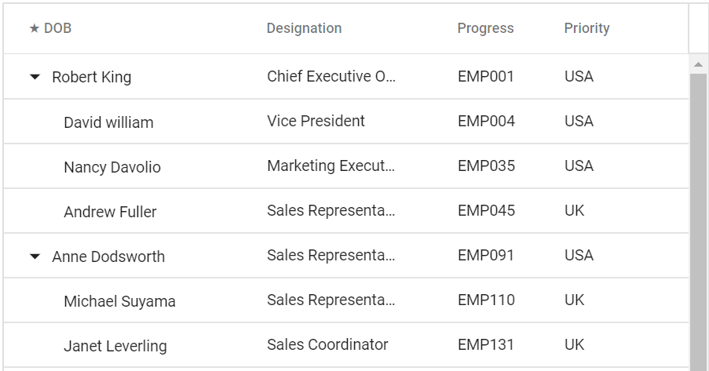

# Templates

Blazor has templated components which accepts one or more UI segments as input that can be rendered as part of the component during component rendering. Tree Grid is a templated razor component, that allow you to customize various part of the UI using template parameters. It allow you to render custom components or content based on your own logic.

The available template options in tree grid are as follows,

* [`Column template`](./columns/#column-template) - Used to customize cell content.
* [`Header template`](./columns/#header-template) - Used to customize header cell content.
* [`Row template`](./rows/#row-template) - Used to customize row content.
* [`Detail template`](./rows/#detail-template) - Used to customize the detail cell content.

## Template ModelType

To use templates, the tree grid must be bound with named model. This can be done by specifying the model type using the `ModelType` property of the tree grid component as follows.





The following output is displayed as a result of the above code example.

## Template Context

Most of the templates used by tree grid are of type `RenderFragment<T>` and they will be passed with parameters. You can access the parameters passed to the templates using implicit parameter named `context`. You can also change this implicit parameter name using `Context` attribute.

For example, you can access the data of the column template using `context` as follows.





The following output is displayed as a result of the above code example.

## TreeGridTemplates component

If a component contains any `RenderFragment` type property then it does not allow any child components other than the render fragment property, which is [`by design in Blazor`](https://github.com/aspnet/AspNetCore/issues/10836).

This prevents us from directly specifying templates such as `RowTemplate` and `DetailTemplate` as descendent of Tree Grid component. Hence the templates such as `RowTemplate` and `DetailTemplate` should be wrapped around a component named `TreeGridTemplates` as follows.





The following output is displayed as a result of the above code example.

