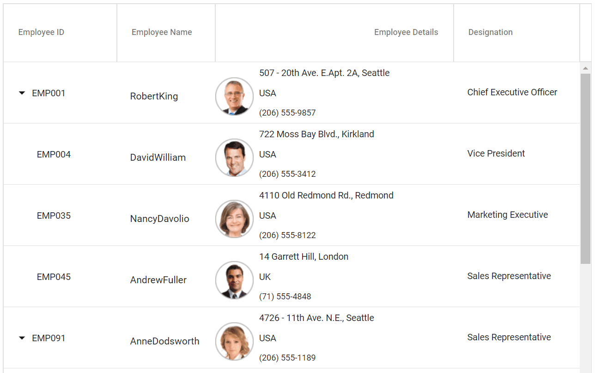
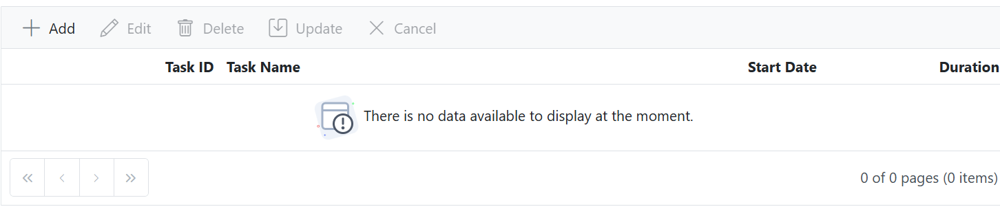

# Templates in Blazor TreeGrid Component

Blazor has templated components which accepts one or more UI segments as input that can be rendered as part of the component during component rendering. Tree Grid is a templated razor component, that allows to customize various part of the UI using template parameters. It allows to render custom components or content based on own logic.

The available template options in tree grid are as follows,

* [Column template](./columns/column-template) - Used to customize cell content.
* [Header template](./columns/columns#header-template) - Used to customize header cell content.
* [Row template](./rows/row-template) - Used to customize row content.
* [Detail template](./rows/detail-template) - Used to customize the detail cell content.

## Template ModelType

To use templates, the tree grid must be bound with named model. This can be done by specifying the model type using the `ModelType` property of the tree grid component as follows.





@using TreeGridComponent.Data
@using Syncfusion.Blazor.TreeGrid;

<SfTreeGrid ModelType="@model" Height="400" DataSource="@TreeData" IdMapping="EmployeeID" ParentIdMapping="ParentId" TreeColumnIndex="0">
    <TreeGridColumns>
        <TreeGridColumn Field="Name" HeaderText="Name" Width="160">
            <HeaderTemplate>
                

                     DOB
                

            </HeaderTemplate>
        </TreeGridColumn>
        <TreeGridColumn Field="Designation" HeaderText="Designation" Width="120"></TreeGridColumn>
        <TreeGridColumn Field="EmpID" HeaderText="Progress" Width="80" TextAlign="Syncfusion.Blazor.Grids.TextAlign.Right"></TreeGridColumn>
        <TreeGridColumn Field="Country" HeaderText="Priority" Width="100"></TreeGridColumn>
        </TreeGridColumns>
</SfTreeGrid>

@code{
    public Employee model = new Employee();
    public IEnumerable<Employee> TreeData { get; set; }
    protected override void OnInitialized()
    {
        this.TreeData = Employee.GetTemplateData();
    }
}





namespace TreeGridComponent.Data {

public class Employee
    {
        public string Name { get; set; }
        public string FullName { get; set; }
        public DateTime? DOB { get; set; }
        public string Designation { get; set; }
        public string EmpID { get; set; }
        public int? EmployeeID { get; set; }
        public string Country { get; set; }
        public string Address { get; set; }
        public string Contact { get; set; }
        public int? ParentId { get; set; }
        public TreeData Treedata { get; set; }

        public static List<Employee> GetTemplateData()
        {
            List<Employee> DataCollection = new List<Employee>();

            DataCollection.Add(new Employee { Name = "Robert King",FullName = "RobertKing",Designation = "Chief Executive Officer",EmployeeID = 1,EmpID = "EMP001",Country = "USA",DOB = new DateTime(1963, 2, 15),ParentId = null,Treedata = new TreeData() { ID = 21}});
            DataCollection.Add(new Employee { Name = "David william",FullName = "DavidWilliam",Designation = "Vice President",EmployeeID = 2,EmpID = "EMP004",Country = "USA",DOB = new DateTime(1971, 5, 20),ParentId = 1,Treedata = new TreeData() { ID = 21 }});
            DataCollection.Add(new Employee { Name = "Nancy Davolio",FullName = "NancyDavolio",Designation = "Marketing Executive",EmployeeID = 3,EmpID = "EMP035",Country = "USA",DOB = new DateTime(1966, 3, 19),ParentId = 1,Treedata = new TreeData() { ID = 21 }});
            DataCollection.Add(new Employee { Name = "Andrew Fuller",FullName = "AndrewFuller",Designation = "Sales Representative",EmployeeID = 4,EmpID = "EMP045",Country = "UK",DOB = new DateTime(1980, 9, 20),ParentId = 1,Treedata = new TreeData() { ID = 21 }});
            DataCollection.Add(new Employee { Name = "Anne Dodsworth",FullName = "AnneDodsworth",Designation = "Sales Representative",EmployeeID = 5,EmpID = "EMP091",Country = "USA",ParentId = null,Treedata = new TreeData() { ID = 21 }});
            DataCollection.Add(new Employee { Name = "Michael Suyama",FullName = "MichaelSuyama",Designation = "Sales Representative",EmployeeID = 6,EmpID = "EMP110",Country = "UK",ParentId = 5,Treedata = new TreeData() { ID = 21 }});
            return DataCollection;
        }
    }
}





## Template Context

Most of the templates used by tree grid are of type `RenderFragment<T>` and they will be passed with parameters. The parameters passed can be accessed to the templates using implicit parameter named `context`. This implicit parameter name can also be changed using the `Context` attribute.

For example, the data of the column template can be accessed using `context` as follows.





@using TreeGridComponent.Data
@using Syncfusion.Blazor.TreeGrid;
@inject Microsoft.AspNetCore.Components.NavigationManager UriHelper

<SfTreeGrid ModelType="@model" Height="400" DataSource="@TreeData" IdMapping="EmployeeID" ParentIdMapping="ParentId" TreeColumnIndex="0">
    <TreeGridColumns>
        <TreeGridColumn Field="Name" HeaderText="Name" Width="160"></TreeGridColumn>
        <TreeGridColumn HeaderText="Employee Image" Width="80">
            <Template>
                @{
                    var employee = (context as Employee);
                    

                        
                    

                }
            </Template>
        </TreeGridColumn>
        <TreeGridColumn Field="DOB" HeaderText="DOB" Width="10" Type="Syncfusion.Blazor.Grids.ColumnType.Date" Format="yMd"></TreeGridColumn>
        <TreeGridColumn Field="Designation" HeaderText="Designation" Width="120"></TreeGridColumn>
        <TreeGridColumn Field="EmpID" HeaderText="Progress" Width="80" TextAlign="Syncfusion.Blazor.Grids.TextAlign.Right"></TreeGridColumn>
        <TreeGridColumn Field="Country" HeaderText="Priority" Width="100"></TreeGridColumn>
    </TreeGridColumns>
</SfTreeGrid>

@code{
    public Employee model = new Employee();
    public IEnumerable<Employee> TreeData { get; set; }
    protected override void OnInitialized()
    {
        this.TreeData = Employee.GetTemplateData();
    }
}





namespace TreeGridComponent.Data {

public class Employee
    {
        public string Name { get; set; }
        public string FullName { get; set; }
        public DateTime? DOB { get; set; }
        public string Designation { get; set; }
        public string EmpID { get; set; }
        public int? EmployeeID { get; set; }
        public string Country { get; set; }
        public string Address { get; set; }
        public string Contact { get; set; }
        public int? ParentId { get; set; }
        public TreeData Treedata { get; set; }

        public static List<Employee> GetTemplateData()
        {
            List<Employee> DataCollection = new List<Employee>();

            DataCollection.Add(new Employee { Name = "Robert King",FullName = "RobertKing",Designation = "Chief Executive Officer",EmployeeID = 1,EmpID = "EMP001",Address = "507 - 20th Ave. E.Apt. 2A, Seattle",Contact = "(206) 555-9857",Country = "USA",DOB = new DateTime(1963, 2, 15),ParentId = null,Treedata = new TreeData() { ID = 21}});
            DataCollection.Add(new Employee { Name = "David william",FullName = "DavidWilliam",Designation = "Vice President",EmployeeID = 2,EmpID = "EMP004",Address = "722 Moss Bay Blvd., Kirkland",Contact = "(206) 555-3412",Country = "USA",DOB = new DateTime(1971, 5, 20),ParentId = 1,Treedata = new TreeData() { ID = 21 }});
            DataCollection.Add(new Employee { Name = "Nancy Davolio",FullName = "NancyDavolio",Designation = "Marketing Executive",EmployeeID = 3,EmpID = "EMP035",Address = "4110 Old Redmond Rd., Redmond",Contact = "(206) 555-8122",Country = "USA",DOB = new DateTime(1966, 3, 19),ParentId = 1,Treedata = new TreeData() { ID = 21 }});
            DataCollection.Add(new Employee { Name = "Andrew Fuller",FullName = "AndrewFuller",Designation = "Sales Representative",EmployeeID = 4,EmpID = "EMP045",Country = "UK",DOB = new DateTime(1980, 9, 20),ParentId = 1,Treedata = new TreeData() { ID = 21 }});
            return DataCollection;
        }
    }
}





## TreeGridTemplates component

If a component contains any `RenderFragment` type property then it does not allow any child components other than the render fragment property, which is [by design in Blazor](https://github.com/dotnet/aspnetcore/issues/10836).

This prevents us from directly specifying templates such as `RowTemplate` and `DetailTemplate` as descendant of the Tree Grid component. Hence the templates such as `RowTemplate` and `DetailTemplate` should be wrapped around a component named `TreeGridTemplates` as follows.





@using TreeGridComponent.Data
@using Syncfusion.Blazor.TreeGrid;
@inject Microsoft.AspNetCore.Components.NavigationManager UriHelper

<SfTreeGrid ModelType="@model" Height="335" DataSource="@TreeData" IdMapping="EmployeeID" ParentIdMapping="ParentId" TreeColumnIndex="0" RowHeight="83" GridLines="@GridLine.Vertical">
    <TreeGridTemplates>
        <RowTemplate>
           @{
            var employee = (context as Employee);

            <td style='padding-left:18px; border-bottom: 0.5px solid #e0e0e0;'>
                
@employee.EmpID

            </td>
            <td style='padding: 10px 0px 0px 20px; border-bottom: 0.5px solid #e0e0e0;'>
                

                    @employee.FullName
                

            </td>
            <td style="border-bottom: 0.5px solid #e0e0e0;">
                

                    

                        
                    

                    

                        
@employee.Address

                        
@employee.Country

                        
@employee.Contact

                    

                

            </td>
            <td style='padding-left: 20px; border-bottom: 0.5px solid #e0e0e0;'>
                
@employee.Designation

            </td>
          }
        </RowTemplate>
    </TreeGridTemplates>
    <TreeGridColumns>
        <TreeGridColumn Field="EmpID" HeaderText="Employee ID" Width="160"></TreeGridColumn>
        <TreeGridColumn Field="Name" HeaderText="Employee Name"></TreeGridColumn>
        <TreeGridColumn Field="Address" HeaderText="Employee Details" Width="340" TextAlign="@TextAlign.Right"></TreeGridColumn>
        <TreeGridColumn Field="Designation" HeaderText="Designation"></TreeGridColumn>
    </TreeGridColumns>
</SfTreeGrid>

@code{
    public Employee model = new Employee();
    public IEnumerable<Employee> TreeData { get; set; }
    protected override void OnInitialized()
    {
        this.TreeData = Employee.GetTemplateData();
    }
}





namespace TreeGridComponent.Data {

public class Employee
    {
        public string Name { get; set; }
        public DateTime? DOB { get; set; }
        public string Designation { get; set; }
        public string EmpID { get; set; }
        public string Country { get; set; }
        public int? ParentId { get; set; }
        public TreeData Treedata { get; set; }

        public static List<Employee> GetTemplateData()
        {
            List<Employee> DataCollection = new List<Employee>();
            DataCollection.Add(new Employee { Name = "Robert King",Designation = "Chief Executive Officer",EmpID = "EMP001",Country = "USA",DOB = new DateTime(1963, 2, 15),ParentId = null,Treedata = new TreeData() { ID = 21}});
            DataCollection.Add(new Employee { Name = "David william",Designation = "Vice President",EmpID = "EMP004",Country = "USA",DOB = new DateTime(1971, 5, 20),ParentId = 1,Treedata = new TreeData() { ID = 21 }});
            DataCollection.Add(new Employee { Name = "Nancy Davolio",Designation = "Marketing Executive",EmpID = "EMP035",Country = "USA",DOB = new DateTime(1966, 3, 19),ParentId = 1,Treedata = new TreeData() { ID = 21 }});
            DataCollection.Add(new Employee { Name = "Andrew Fuller",Designation = "Sales Representative",EmpID = "EMP045",Country = "UK",DOB = new DateTime(1980, 9, 20),ParentId = 1,Treedata = new TreeData() { ID = 21 }});
            return DataCollection;
        }
    }
}





## Customize the empty record template in Blazor TreeGrid

The empty record template feature in the Syncfusion&reg; Blazor TreeGrid allows displaying custom content such as images, text, or other components when the TreeGrid has no records to show. It replaces the default message of **No records to display.**

To activate this feature, set the `EmptyRecordTemplate` feature of the TreeGrid. The `EmptyRecordTemplate` feature expects the HTML element or a function that returns the HTML element.

The following example demonstrates how an image and text can be rendered as a template to indicate that the TreeGrid has no data to display:




@using TreeGridComponent.Data
@using Syncfusion.Blazor.TreeGrid

<SfTreeGrid DataSource="@TreeGridData" IdMapping="TaskID" ParentIdMapping="ParentID" HasChildMapping="IsParent" TreeColumnIndex="1" AllowPaging="true" Toolbar="@(new List<string>() { "Add", "Edit", "Delete", "Update", "Cancel" })">
    <TreeGridPageSettings PageCount="5"></TreeGridPageSettings>
    <TreeGridEditSettings AllowEditing="true" AllowAdding="true" AllowDeleting="true"/>
    <TreeGridTemplates>
        <EmptyRecordTemplate>
            

                
                There is no data available to display at the moment.
            

        </EmptyRecordTemplate>
    </TreeGridTemplates>
    <TreeGridColumns>
        <TreeGridColumn Field="TaskID" HeaderText="Task ID" Width="120" IsPrimaryKey="true" TextAlign="TextAlign.Right"></TreeGridColumn>
        <TreeGridColumn Field="TaskName" HeaderText="Task Name" Width="200"></TreeGridColumn>
        <TreeGridColumn Field="StartDate" HeaderText="Start Date" Width="130" Format="d" TextAlign="TextAlign.Right"></TreeGridColumn>
        <TreeGridColumn Field="Duration" HeaderText="Duration" Width="100" TextAlign="TextAlign.Right"></TreeGridColumn>
    </TreeGridColumns>
</SfTreeGrid>

@code{
    public List<TreeData> TreeGridData { get; set; }

    protected override void OnInitialized()
    {
        this.TreeGridData = TreeData.GetSelfDataSource().ToList();
    }

	public string ImageUrl = "data:image/svg+xml;base64...."
   
}




namespace TreeGridComponent.Data {

public class TreeData
    {
        public int TaskId { get; set;}
        public string TaskName { get; set;}
        public DateTime? StartDate { get; set;}
        public int? Duration { get; set;}
       
        public static List<TreeData> GetSelfDataSource()
        {
            List<TreeData> TreeDataCollection = new List<TreeData>();
            return TreeDataCollection;
        }
    }
}




