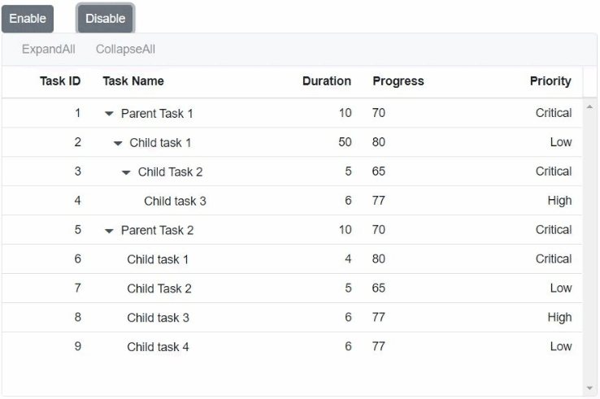

# Toolbar in Syncfusion Blazor TreeGrid Component

The TreeGrid component supports a toolbar that facilitates various grid actions such as printing, searching, exporting, and editing.

To learn more about toolbar templates in the Blazor TreeGrid component, refer to the following video:



## Built-in Toolbar Items

Built-in toolbar items perform standard TreeGrid actions and can be added by defining the [Toolbar](https://help.syncfusion.com/cr/blazor/Syncfusion.Blazor.TreeGrid.SfTreeGrid-1.html#Syncfusion_Blazor_TreeGrid_SfTreeGrid_1_Toolbar) property as a collection of predefined item names. These items render with both icon and text.

| Built-in Toolbar Item | Action Description               |
|-----------------------|----------------------------------|
| ExpandAll             | Expands all rows                 |
| CollapseAll           | Collapses all rows              |
| Add                   | Adds a new record                |
| Edit                  | Edits the selected record        |
| Update                | Updates the edited record        |
| Delete                | Deletes the selected record      |
| Cancel                | Cancels the edit state           |
| Search                | Searches records by keyword      |
| Print                 | Prints the TreeGrid              |
| ExcelExport           | Exports TreeGrid to Excel        |
| PdfExport             | Exports TreeGrid to PDF          |
| WordExport            | Exports TreeGrid to Word         |





@using TreeGridComponent.Data;
@using Syncfusion.Blazor.TreeGrid;

<SfTreeGrid DataSource="@TreeGridData" Toolbar="@(new List<string>() { "Print", "Search" })" IdMapping="TaskId" AllowSelection="true" ParentIdMapping="ParentId" TreeColumnIndex="1">
    <TreeGridColumns>
        <TreeGridColumn Field="TaskId" HeaderText="Task ID" Width="80" TextAlign="Syncfusion.Blazor.Grids.TextAlign.Right"></TreeGridColumn>
        <TreeGridColumn Field="TaskName" HeaderText="Task Name" Width="160"></TreeGridColumn>
        <TreeGridColumn Field="Duration" HeaderText="Duration" Width="100" TextAlign="Syncfusion.Blazor.Grids.TextAlign.Right"></TreeGridColumn>
        <TreeGridColumn Field="Progress" HeaderText="Progress" Width="100" TextAlign="Syncfusion.Blazor.Grids.TextAlign.Right"></TreeGridColumn>
        <TreeGridColumn Field="Priority" HeaderText="Priority" Width="80"></TreeGridColumn>
    </TreeGridColumns>
</SfTreeGrid>

@code{
    public List<TreeData.BusinessObject> TreeGridData { get; set; }
    protected override void OnInitialized()
    {
        this.TreeGridData = TreeData.GetSelfDataSource().ToList();
    }
}





namespace TreeGridComponent.Data {

public class TreeData
    {
        public class BusinessObject
        {
            public int TaskId { get; set;}
            public string TaskName { get; set;}
            public int? Duration { get; set;}
            public int? Progress { get; set;}
            public string Priority { get; set;}
            public int? ParentId { get; set;}
        }

        public static List<BusinessObject> GetSelfDataSource()
        {
            List<BusinessObject> BusinessObjectCollection = new List<BusinessObject>();
            BusinessObjectCollection.Add(new BusinessObject() { TaskId = 1,TaskName = "Parent Task 1",Duration = 10,Progress = 70,Priority = "Critical",ParentId = null });
            BusinessObjectCollection.Add(new BusinessObject() { TaskId = 2,TaskName = "Child task 1",Progress = 80,Priority = "Low",ParentId = 1 });
            BusinessObjectCollection.Add(new BusinessObject() { TaskId = 3,TaskName = "Child Task 2",Duration = 5,Progress = 65,Priority = "Critical",ParentId = 2 });
            BusinessObjectCollection.Add(new BusinessObject() { TaskId = 4,TaskName = "Child task 3",Duration = 6,Priority = "High",Progress = 77,ParentId = 3 });
            BusinessObjectCollection.Add(new BusinessObject() { TaskId = 5,TaskName = "Parent Task 2",Duration = 10,Progress = 70,Priority = "Critical",ParentId = null});
            BusinessObjectCollection.Add(new BusinessObject() { TaskId = 6,TaskName = "Child task 1",Duration = 4,Progress = 80,Priority = "Critical",ParentId = 5});
            BusinessObjectCollection.Add(new BusinessObject() { TaskId = 7,TaskName = "Child Task 2",Duration = 5,Progress = 65,Priority = "Low",ParentId = 5});
            BusinessObjectCollection.Add(new BusinessObject() { TaskId = 8,TaskName = "Child task 3",Duration = 6,Progress = 77,Priority = "High",ParentId = 5});
            BusinessObjectCollection.Add(new BusinessObject() { TaskId = 9,TaskName = "Child task 4",Duration = 6,Progress = 77,Priority = "Low",ParentId = 5});
            return BusinessObjectCollection;
        }
    }
}






N> The [Toolbar](https://help.syncfusion.com/cr/blazor/Syncfusion.Blazor~Syncfusion.Blazor.TreeGrid.SfTreeGrid~Toolbar.html) property supports both built-in and custom toolbar items.

## Enable/Disable Toolbar Items

Toolbar items can be enabled or disabled using the [EnableToolbarItemsAsync](https://help.syncfusion.com/cr/blazor/Syncfusion.Blazor.TreeGrid.SfTreeGrid-1.html#Syncfusion_Blazor_TreeGrid_SfTreeGrid_1_EnableToolbarItemsAsync_System_Collections_Generic_List_System_String__System_Boolean_) method.

```cshtml

@using Syncfusion.Blazor.Buttons
@using Syncfusion.Blazor.TreeGrid;
@using Syncfusion.Blazor.Grids;

<div>
    <div style="float:left;">
        <SfButton id="Enable" Content="Enable" @onclick="Enable"></SfButton>
    </div>
    <div style="padding-left: 90px">
        <SfButton id="Disable" Content="Disable" @onclick="Disable"></SfButton>
    </div>
</div>

@{
    var Tool = (new string[] { "ExpandAll", "CollapseAll" });
}

<SfTreeGrid ID="TreeGrid" @ref="TreeGrid" DataSource="TreeGridData" IdMapping="TaskId" ParentIdMapping="ParentId" TreeColumnIndex="1" Toolbar="@Tool" Height="350">
    <TreeGridEvents TValue="TreeData" OnToolbarClick="ToolBarClick"></TreeGridEvents>
    <TreeGridColumns>
        <TreeGridColumn Field="TaskId" HeaderText="Task ID" Width="80" TextAlign="TextAlign.Right"></TreeGridColumn>
        <TreeGridColumn Field="TaskName" HeaderText="Task Name" Width="145"></TreeGridColumn>
        <TreeGridColumn Field="Duration" HeaderText="Duration" Width="100" TextAlign="TextAlign.Right"></TreeGridColumn>
        <TreeGridColumn Field="Progress" HeaderText="Progress" Width="100"></TreeGridColumn>
        <TreeGridColumn Field="Priority" HeaderText="Priority" Width="100" TextAlign="TextAlign.Right"></TreeGridColumn>
    </TreeGridColumns>
</SfTreeGrid>

@code{
    SfTreeGrid<TreeData> TreeGrid;

    public void Enable()
    {
        this.TreeGrid.EnableToolbarItemsAsync(new List<string>() { "TreeGrid_gridcontrol_ExpandAll", "TreeGrid_gridcontrol_CollapseAll" }, true);
    }

    public void Disable()
    {
        this.TreeGrid.EnableToolbarItemsAsync(new List<string>() { "TreeGrid_gridcontrol_ExpandAll", "TreeGrid_gridcontrol_CollapseAll" }, false);
    }

    public void ToolBarClick(Syncfusion.Blazor.Navigations.ClickEventArgs Args)
    {
        if (Args.Item.Text == "ExpandAll")
        {
            this.TreeGrid.ExpandAll();
        }
        if (Args.Item.Text == "CollapseAll")
        {
            this.TreeGrid.CollapseAllAsync();
        }
    }

    public List<TreeData> TreeGridData { get; set; }
    public class TreeData
    {
        public int TaskId { get; set; }
        public string TaskName { get; set; }
        public int? Duration { get; set; }
        public int? Progress { get; set; }
        public string Priority { get; set; }
        public int? ParentId { get; set; }
        public static List<TreeData> GetSelfDataSource()
        {
            List<TreeData> TreeDataCollection = new List<TreeData>();
            TreeDataCollection.Add(new TreeData(){ TaskId = 1, TaskName = "Parent Task 1", Duration = 10, Progress = 70, Priority = "Critical", ParentId = null });
            TreeDataCollection.Add(new TreeData(){ TaskId = 2, TaskName = "Child task 1", Progress = 80, Priority = "Low", Duration = 50, ParentId = 1 });
            TreeDataCollection.Add(new TreeData(){ TaskId = 3, TaskName = "Child Task 2", Duration = 5, Progress = 65, Priority = "Critical", ParentId = 2 });
            TreeDataCollection.Add(new TreeData(){ TaskId = 4, TaskName = "Child task 3", Duration = 6, Priority = "High", Progress = 77, ParentId = 3 });
            TreeDataCollection.Add(new TreeData(){ TaskId = 5, TaskName = "Parent Task 2", Duration = 10, Progress = 70, Priority = "Critical", ParentId = null });
            TreeDataCollection.Add(new TreeData(){ TaskId = 6, TaskName = "Child task 1", Duration = 4, Progress = 80, Priority = "Critical", ParentId = 5 });
            TreeDataCollection.Add(new TreeData(){ TaskId = 7, TaskName = "Child Task 2", Duration = 5, Progress = 65, Priority = "Low", ParentId = 5 });
            TreeDataCollection.Add(new TreeData(){ TaskId = 8, TaskName = "Child task 3", Duration = 6, Progress = 77, Priority = "High", ParentId = 5 });
            TreeDataCollection.Add(new TreeData(){ TaskId = 9, TaskName = "Child task 4", Duration = 6, Progress = 77, Priority = "Low", ParentId = 5 });
            return TreeDataCollection;
        }
    }
    protected override void OnInitialized()
    {
        this.TreeGridData = TreeData.GetSelfDataSource().ToList();
    }
}

```

The following screenshots represent a TreeGrid with Enable/disable toolbar items,


## Enable/Disable Toolbar Items based on Row Selection

ToolbarTemplate renders an SfToolbar inside the Syncfusion TreeGrid, binds boolean properties to each ToolbarItem’s Disabled attribute, invokes RowSelected to enable the buttons, and invokes RowDeselected to disable them.

```cshtml
@using Syncfusion.Blazor.Navigations
@using Syncfusion.Blazor.TreeGrid;


<SfTreeGrid @ref="TreeGrid" DataSource="@TreeGridData" IdMapping="TaskId" AllowSelection="true" ParentIdMapping="ParentId" TreeColumnIndex="1">
    <TreeGridEvents RowSelected="RowSelected" RowDeselected="RowDeselected" TValue="TreeData.BusinessObject"></TreeGridEvents>
    <TreeGridEditSettings AllowAdding="true" NewRowPosition="Syncfusion.Blazor.TreeGrid.RowPosition.Child"></TreeGridEditSettings>
    <TreeGridTemplates>
        <ToolbarTemplate>
            <SfToolbar>
                <ToolbarEvents Clicked = "ToolbarClickHandler"></ToolbarEvents>
                <ToolbarItems>
                    <ToolbarItem Text="Add" Id="Add" TooltipText="Add Enable/Disable" Visible="true" Disabled="@IsRowSelected"></ToolbarItem>
                    <ToolbarItem Text="Save" Id="Save" TooltipText="Save Data" Visible="true" Disabled="@EnableSave"></ToolbarItem>
                    </ToolbarItems>
            </SfToolbar>
        </ToolbarTemplate>
    </TreeGridTemplates>
    <TreeGridColumns>
        <TreeGridColumn Field="TaskId" HeaderText="Task ID" Width="80" IsPrimaryKey="true" TextAlign="Syncfusion.Blazor.Grids.TextAlign.Right"></TreeGridColumn>
        <TreeGridColumn Field="TaskName" HeaderText="Task Name" Width="160"></TreeGridColumn>
        <TreeGridColumn Field="Duration" HeaderText="Duration" Width="100" TextAlign="Syncfusion.Blazor.Grids.TextAlign.Right"></TreeGridColumn>
        <TreeGridColumn Field="Progress" HeaderText="Progress" Width="100" TextAlign="Syncfusion.Blazor.Grids.TextAlign.Right"></TreeGridColumn>
        <TreeGridColumn Field="Priority" HeaderText="Priority" Width="80"></TreeGridColumn>
    </TreeGridColumns>
</SfTreeGrid>

@code {
    public List<TreeData.BusinessObject> TreeGridData { get; set; }
    SfTreeGrid<TreeData.BusinessObject> TreeGrid;
    public bool IsRowSelected { get; set; } = true;
    public bool EnableSave { get; set; } = true;

    protected override void OnInitialized()
    {
        this.TreeGridData = TreeData.GetSelfDataSource().ToList();
    }

    public void ToolbarClickHandler(Syncfusion.Blazor.Navigations.ClickEventArgs args)
    {
        if (args.Item.Text == "Add")
        {
            this.TreeGrid.AddRecordAsync();
            EnableSave = false;
        }
        if (args.Item.Text == "Save")
        {
            this.TreeGrid.EndEditAsync();
            EnableSave = true;
        }
    }

    public void RowSelected(Syncfusion.Blazor.Grids.RowSelectEventArgs<TreeData.BusinessObject> args)
    {
        IsRowSelected = false;
    }
    public void RowDeselected(Syncfusion.Blazor.Grids.RowDeselectEventArgs<TreeData.BusinessObject> args)
    {
        IsRowSelected = true;
    }

    public class TreeData
    {
        public class BusinessObject
        {
            public int TaskId { get; set; }
            public string TaskName { get; set; }
            public int? Duration { get; set; }
            public int? Progress { get; set; }
            public string Priority { get; set; }
            public int? ParentId { get; set; }
            public int? AgendaTopicTypeId { get; set; }
            
        }

        public static List<BusinessObject> GetSelfDataSource()
        {
            List<BusinessObject> BusinessObjectCollection = new List<BusinessObject>();
            BusinessObjectCollection.Add(new BusinessObject() { TaskId = 1, TaskName = "Parent Task 1", Duration = 10, Progress = 70, Priority = "Critical", ParentId = null });
            BusinessObjectCollection.Add(new BusinessObject() { TaskId = 2, TaskName = "Child task 1", Progress = 80, Priority = "Low", ParentId = 1 });
            BusinessObjectCollection.Add(new BusinessObject() { TaskId = 3, TaskName = "Child Task 2", Duration = 5, Progress = 65, Priority = "Critical", ParentId = 2 });
            BusinessObjectCollection.Add(new BusinessObject() { TaskId = 4, TaskName = "Child task 3", Duration = 6, Priority = "High", Progress = 77, ParentId = 3 });
            BusinessObjectCollection.Add(new BusinessObject() { TaskId = 5, TaskName = "Parent Task 2", Duration = 10, Progress = 70, Priority = "Critical", ParentId = null });
            BusinessObjectCollection.Add(new BusinessObject() { TaskId = 6, TaskName = "Child task 1", Duration = 4, Progress = 80, Priority = "Critical", ParentId = 5 });
            BusinessObjectCollection.Add(new BusinessObject() { TaskId = 7, TaskName = "Child Task 2", Duration = 5, Progress = 65, Priority = "Low", ParentId = 5 });
            BusinessObjectCollection.Add(new BusinessObject() { TaskId = 8, TaskName = "Child task 3", Duration = 6, Progress = 77, Priority = "High", ParentId = 5 });
            BusinessObjectCollection.Add(new BusinessObject() { TaskId = 9, TaskName = "Child task 4", Duration = 6, Progress = 77, Priority = "Low", ParentId = 5 });
            return BusinessObjectCollection;
        }
    }
}


<!--
Custom toolbar items

Custom toolbar items can be added by defining the [`Toolbar`](https://help.syncfusion.com/cr/blazor/Syncfusion.Blazor~Syncfusion.Blazor.TreeGrid.SfTreeGrid~Toolbar.html) as a collection of
**ItemModels**.
Actions for this customized toolbar items are defined in the [`ToolbarClick`](https://help.syncfusion.com/cr/blazor/Syncfusion.Blazor~Syncfusion.Blazor.TreeGrid.SfTreeGrid~ToolbarClick.html) event.

By default, Custom toolbar items are in position **Left**. Change the position by using the **Align** property. In the below sample, we have applied position **Right** for the **Quick Filter** toolbar item.

> The [`Toolbar`](https://help.syncfusion.com/cr/blazor/Syncfusion.Blazor~Syncfusion.Blazor.TreeGrid.SfTreeGrid~Toolbar.html) has options to define both built-in and custom toolbar items.
> If a toolbar item does not match the built-in items, it will be treated as a custom toolbar item.

 Built-in and custom items in toolbar

TreeGrid have an option to use both built-in and custom toolbar items at same time.

In the below example, **ExpandAll**, **CollapseAll** are built-in toolbar items and **Click** is custom toolbar item.

Enable/disable toolbar items

Toolbar items can be enabled or disabled using the **enableItems** method.

-->