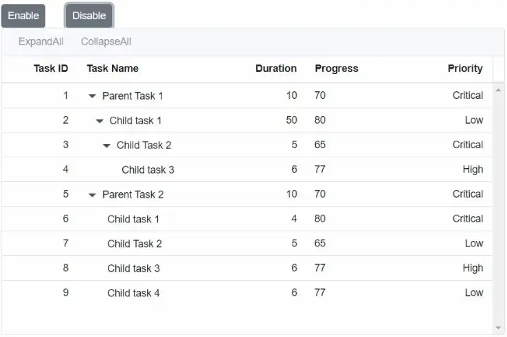

---
layout: post
title: Configuring and Customizing Toolbar in Syncfusion Blazor TreeGrid
description: Learn about configuring, customizing, and managing toolbar actions in Syncfusion Blazor TreeGrid, including dynamic control and CSS styling
platform: Blazor
control: TreeGrid
documentation: ug
---

# Toolbar in Blazor TreeGrid

The toolbar in the [Blazor TreeGrid](https://www.syncfusion.com/blazor-components/blazor-tree-grid) provides quick access to common actions such as adding, editing, deleting, printing, and exporting data (Excel, CSV, PDF).

The toolbar can be configured with built-in toolbar items or custom items using the [Toolbar](https://help.syncfusion.com/cr/blazor/Syncfusion.Blazor.TreeGrid.SfTreeGrid-1.html#Syncfusion_Blazor_TreeGrid_SfTreeGrid_1_Toolbar) property. The `Toolbar` property accepts:
- An array of strings for built-in items
- An array of [ItemModel](https://help.syncfusion.com/cr/blazor/Syncfusion.Blazor.Navigations.ItemModel.html#Syncfusion_Blazor_Navigations_ItemModel__ctor) objects for custom items (text, icon, id, tooltip)



@using Syncfusion.Blazor.TreeGrid

<SfTreeGrid DataSource="@TreeGridData" IdMapping="TaskId" ParentIdMapping="ParentId" TreeColumnIndex="1" Toolbar="@ToolbarItems">
    <TreeGridColumns>
        <TreeGridColumn Field="TaskId" HeaderText="Task ID" IsPrimaryKey="true" Width="80" TextAlign="Syncfusion.Blazor.Grids.TextAlign.Right"></TreeGridColumn>
        <TreeGridColumn Field="TaskName" HeaderText="Task Name" Width="160"></TreeGridColumn>
        <TreeGridColumn Field="Duration" HeaderText="Duration" Width="100" TextAlign="Syncfusion.Blazor.Grids.TextAlign.Right"></TreeGridColumn>
        <TreeGridColumn Field="Progress" HeaderText="Progress" Width="100" TextAlign="Syncfusion.Blazor.Grids.TextAlign.Right"></TreeGridColumn>
        <TreeGridColumn Field="Priority" HeaderText="Priority" Width="80"></TreeGridColumn>
    </TreeGridColumns>
</SfTreeGrid>

@code {
    public List<string> ToolbarItems = new List<string>() { "Search", "Print" };
    public List<TreeData.BusinessObject> TreeGridData { get; set; }

    protected override void OnInitialized()
    {
        TreeGridData = TreeData.GetSelfDataSource();
    }

    public class TreeData
    {
        public class BusinessObject
        {
            public int TaskId { get; set; }
            public string TaskName { get; set; }
            public int? Duration { get; set; }
            public int? Progress { get; set; }
            public string Priority { get; set; }
            public int? ParentId { get; set; }
        }

        public static List<BusinessObject> GetSelfDataSource()
        {
            List<BusinessObject> BusinessObjectCollection = new List<BusinessObject>();
            BusinessObjectCollection.Add(new BusinessObject() { TaskId = 1, TaskName = "Parent Task 1", Duration = 10, Progress = 70, Priority = "Critical", ParentId = null });
            BusinessObjectCollection.Add(new BusinessObject() { TaskId = 2, TaskName = "Child task 1", Progress = 80, Priority = "Low", ParentId = 1 });
            BusinessObjectCollection.Add(new BusinessObject() { TaskId = 3, TaskName = "Child Task 2", Duration = 5, Progress = 65, Priority = "Critical", ParentId = 2 });
            BusinessObjectCollection.Add(new BusinessObject() { TaskId = 4, TaskName = "Child task 3", Duration = 6, Priority = "High", Progress = 77, ParentId = 3 });
            BusinessObjectCollection.Add(new BusinessObject() { TaskId = 5, TaskName = "Parent Task 2", Duration = 10, Progress = 70, Priority = "Critical", ParentId = null });
            BusinessObjectCollection.Add(new BusinessObject() { TaskId = 6, TaskName = "Child task 1", Duration = 4, Progress = 80, Priority = "Critical", ParentId = 5 });
            BusinessObjectCollection.Add(new BusinessObject() { TaskId = 7, TaskName = "Child Task 2", Duration = 5, Progress = 65, Priority = "Low", ParentId = 5 });
            BusinessObjectCollection.Add(new BusinessObject() { TaskId = 8, TaskName = "Child task 3", Duration = 6, Progress = 77, Priority = "High", ParentId = 5 });
            BusinessObjectCollection.Add(new BusinessObject() { TaskId = 9, TaskName = "Child task 4", Duration = 6, Progress = 77, Priority = "Low", ParentId = 5 });
            return BusinessObjectCollection;
        }
    }
}






## Enable or disable toolbar items

Enable or disable toolbar items dynamically to control which actions are available based on application logic or user interactions.

Toolbar items in the Blazor TreeGrid can be enabled or disabled dynamically using the [EnableToolbarItemsAsync](https://help.syncfusion.com/cr/blazor/Syncfusion.Blazor.TreeGrid.SfTreeGrid-1.html#Syncfusion_Blazor_TreeGrid_SfTreeGrid_1_EnableToolbarItemsAsync_System_Collections_Generic_List_System_String__System_Boolean_) method. This provides programmatic control over the availability of specific items by their IDs. For built-in toolbar items specified with strings, the TreeGrid generates IDs (for example, **TreeGrid_ExpandAll, TreeGrid_CollapseAll**). For custom items created with ItemModel, set the Id property explicitly and use it when enabling or disabling items.



@using Syncfusion.Blazor.TreeGrid
@using Syncfusion.Blazor.Navigations
@using Syncfusion.Blazor.Buttons

<label>Enable or disable toolbar items</label>
<SfSwitch ValueChange="Change" TChecked="bool"></SfSwitch>

<SfTreeGrid ID="TreeGrid" @ref="TreeGrid" DataSource="@TreeGridData" IdMapping="TaskId" ParentIdMapping="ParentId" TreeColumnIndex="1" Toolbar="@ToolbarItems" Height="350">
    <TreeGridEvents OnToolbarClick="ToolbarClickHandler" TValue="TreeData.BusinessObject"></TreeGridEvents>
    <TreeGridColumns>
        <TreeGridColumn Field="TaskId" HeaderText="Task ID" Width="80" TextAlign="Syncfusion.Blazor.Grids.TextAlign.Right"></TreeGridColumn>
        <TreeGridColumn Field="TaskName" HeaderText="Task Name" Width="145"></TreeGridColumn>
        <TreeGridColumn Field="Duration" HeaderText="Duration" Width="100" TextAlign="Syncfusion.Blazor.Grids.TextAlign.Right"></TreeGridColumn>
        <TreeGridColumn Field="Progress" HeaderText="Progress" Width="100"></TreeGridColumn>
        <TreeGridColumn Field="Priority" HeaderText="Priority" Width="100"></TreeGridColumn>
    </TreeGridColumns>
</SfTreeGrid>

@code {
    private SfTreeGrid<TreeData.BusinessObject> TreeGrid;
    public string[] ToolbarItems = new string[] { "ExpandAll", "CollapseAll" };
    public List<TreeData.BusinessObject> TreeGridData { get; set; }

    protected override void OnInitialized()
    {
        TreeGridData = TreeData.GetSelfDataSource();
    }

    private async Task Change(Syncfusion.Blazor.Buttons.ChangeEventArgs<bool> args)
    {
        if (args.Checked)
        {
            await this.TreeGrid.EnableToolbarItemsAsync(new List<string>() { "TreeGrid_ExpandAll", "TreeGrid_CollapseAll" }, false);
        }
        else
        {
            await this.TreeGrid.EnableToolbarItemsAsync(new List<string>() { "TreeGrid_ExpandAll", "TreeGrid_CollapseAll" }, true);
        }
    }

    public async Task ToolbarClickHandler(Syncfusion.Blazor.Navigations.ClickEventArgs args)
    {
        if (args.Item.Text == "ExpandAll")
        {
            await this.TreeGrid.ExpandAllAsync();
        }
        if (args.Item.Text == "CollapseAll")
        {
            await this.TreeGrid.CollapseAllAsync();
        }
    }

    public class TreeData
    {
        public class BusinessObject
        {
            public int TaskId { get; set; }
            public string TaskName { get; set; }
            public int? Duration { get; set; }
            public int? Progress { get; set; }
            public string Priority { get; set; }
            public int? ParentId { get; set; }
        }

        public static List<BusinessObject> GetSelfDataSource()
        {
            List<BusinessObject> BusinessObjectCollection = new List<BusinessObject>();
            BusinessObjectCollection.Add(new BusinessObject() { TaskId = 1, TaskName = "Parent Task 1", Duration = 10, Progress = 70, Priority = "Critical", ParentId = null });
            BusinessObjectCollection.Add(new BusinessObject() { TaskId = 2, TaskName = "Child task 1", Progress = 80, Priority = "Low", ParentId = 1 });
            BusinessObjectCollection.Add(new BusinessObject() { TaskId = 3, TaskName = "Child Task 2", Duration = 5, Progress = 65, Priority = "Critical", ParentId = 2 });
            BusinessObjectCollection.Add(new BusinessObject() { TaskId = 4, TaskName = "Child task 3", Duration = 6, Priority = "High", Progress = 77, ParentId = 3 });
            BusinessObjectCollection.Add(new BusinessObject() { TaskId = 5, TaskName = "Parent Task 2", Duration = 10, Progress = 70, Priority = "Critical", ParentId = null });
            BusinessObjectCollection.Add(new BusinessObject() { TaskId = 6, TaskName = "Child task 1", Duration = 4, Progress = 80, Priority = "Critical", ParentId = 5 });
            BusinessObjectCollection.Add(new BusinessObject() { TaskId = 7, TaskName = "Child Task 2", Duration = 5, Progress = 65, Priority = "Low", ParentId = 5 });
            BusinessObjectCollection.Add(new BusinessObject() { TaskId = 8, TaskName = "Child task 3", Duration = 6, Progress = 77, Priority = "High", ParentId = 5 });
            BusinessObjectCollection.Add(new BusinessObject() { TaskId = 9, TaskName = "Child task 4", Duration = 6, Progress = 77, Priority = "Low", ParentId = 5 });
            return BusinessObjectCollection;
        }
    }
}







## Enable or disable toolbar items based on selected row data

Enable or disable toolbar items based on the selected row so that actions are available only when relevant to the current selection.

Use the [RowSelecting](https://help.syncfusion.com/cr/blazor/Syncfusion.Blazor.TreeGrid.TreeGridEvents-1.html#Syncfusion_Blazor_TreeGrid_TreeGridEvents_1_RowSelecting) event with the [EnableToolbarItemsAsync](https://help.syncfusion.com/cr/blazor/Syncfusion.Blazor.TreeGrid.SfTreeGrid-1.html#Syncfusion_Blazor_TreeGrid_SfTreeGrid_1_EnableToolbarItemsAsync_System_Collections_Generic_List_System_String__System_Boolean_) method to toggle specific items by id during selection. For built-in items, refer to the generated toolbar item IDs (for example, TreeGrid_Add, TreeGrid_Edit, TreeGrid_Delete). For custom items, use the ItemModel Id value. Ensure that the IDs used match the rendered toolbar item IDs in the target version.



@using Syncfusion.Blazor.TreeGrid

<SfTreeGrid ID="TreeGrid" @ref="TreeGrid" DataSource="@TreeGridData" IdMapping="TaskId" ParentIdMapping="ParentId" TreeColumnIndex="1" Toolbar="@(new List<string>() { "Add", "Edit", "Delete", "Cancel", "Update" })" Height="315">
    <TreeGridEditSettings AllowAdding="true" AllowEditing="true" AllowDeleting="true" Mode="Syncfusion.Blazor.TreeGrid.EditMode.Normal"></TreeGridEditSettings>
    <TreeGridEvents RowSelecting="RowSelectingHandler" TValue="TreeData.BusinessObject"></TreeGridEvents>
    <TreeGridColumns>
        <TreeGridColumn Field="TaskId" HeaderText="Task ID" TextAlign="Syncfusion.Blazor.Grids.TextAlign.Right" IsPrimaryKey="true" Width="120"></TreeGridColumn>
        <TreeGridColumn Field="TaskName" HeaderText="Task Name" Width="150"></TreeGridColumn>
        <TreeGridColumn Field="Duration" HeaderText="Duration" TextAlign="Syncfusion.Blazor.Grids.TextAlign.Right" Width="120"></TreeGridColumn>
        <TreeGridColumn Field="Progress" HeaderText="Progress" TextAlign="Syncfusion.Blazor.Grids.TextAlign.Right" Width="120"></TreeGridColumn>
        <TreeGridColumn Field="Priority" HeaderText="Priority" Width="100"></TreeGridColumn>
    </TreeGridColumns>
</SfTreeGrid>

@code {
    private SfTreeGrid<TreeData.BusinessObject> TreeGrid;
    public List<TreeData.BusinessObject> TreeGridData { get; set; }

    protected override void OnInitialized()
    {
        TreeGridData = TreeData.GetSelfDataSource();
    }

    public async Task RowSelectingHandler(Syncfusion.Blazor.TreeGrid.RowSelectingEventArgs<TreeData.BusinessObject> args)
    {
        if (args.Data.TaskId == 2 || args.Data.TaskId == 5 || args.Data.TaskId == 8)
        {
            await this.TreeGrid.EnableToolbarItemsAsync(new List<string>() { "TreeGrid_Add", "TreeGrid_Edit", "TreeGrid_Delete" }, false);
        }
        else
        {
            await this.TreeGrid.EnableToolbarItemsAsync(new List<string>() { "TreeGrid_Add", "TreeGrid_Edit", "TreeGrid_Delete" }, true);
        }
    }

    public class TreeData
    {
        public class BusinessObject
        {
            public int TaskId { get; set; }
            public string TaskName { get; set; }
            public int? Duration { get; set; }
            public int? Progress { get; set; }
            public string Priority { get; set; }
            public int? ParentId { get; set; }
        }

        public static List<BusinessObject> GetSelfDataSource()
        {
            List<BusinessObject> BusinessObjectCollection = new List<BusinessObject>();
            BusinessObjectCollection.Add(new BusinessObject() { TaskId = 1, TaskName = "Parent Task 1", Duration = 10, Progress = 70, Priority = "Critical", ParentId = null });
            BusinessObjectCollection.Add(new BusinessObject() { TaskId = 2, TaskName = "Child task 1", Progress = 80, Priority = "Low", ParentId = 1 });
            BusinessObjectCollection.Add(new BusinessObject() { TaskId = 3, TaskName = "Child Task 2", Duration = 5, Progress = 65, Priority = "Critical", ParentId = 2 });
            BusinessObjectCollection.Add(new BusinessObject() { TaskId = 4, TaskName = "Child task 3", Duration = 6, Priority = "High", Progress = 77, ParentId = 3 });
            BusinessObjectCollection.Add(new BusinessObject() { TaskId = 5, TaskName = "Parent Task 2", Duration = 10, Progress = 70, Priority = "Critical", ParentId = null });
            BusinessObjectCollection.Add(new BusinessObject() { TaskId = 6, TaskName = "Child task 1", Duration = 4, Progress = 80, Priority = "Critical", ParentId = 5 });
            BusinessObjectCollection.Add(new BusinessObject() { TaskId = 7, TaskName = "Child Task 2", Duration = 5, Progress = 65, Priority = "Low", ParentId = 5 });
            BusinessObjectCollection.Add(new BusinessObject() { TaskId = 8, TaskName = "Child task 3", Duration = 6, Progress = 77, Priority = "High", ParentId = 5 });
            BusinessObjectCollection.Add(new BusinessObject() { TaskId = 9, TaskName = "Child task 4", Duration = 6, Progress = 77, Priority = "Low", ParentId = 5 });
            return BusinessObjectCollection;
        }
    }
}





## Customize Toolbar buttons using CSS

Customize the appearance of built-in toolbar buttons by applying CSS to achieve cohesive theming and clear visual hierarchy. Maintain sufficient color contrast and preserve visible focus indicators for accessibility.

The following styles target toolbar button icons and buttons to update the background color:

```csharp
.e-treegrid .e-toolbar .e-tbar-btn .e-icons,
.e-treegrid .e-toolbar .e-toolbar-items .e-toolbar-item .e-tbar-btn {
    background: #add8e6;
}
```

The following example demonstrates changing the background color of the `Add`, `Edit`, `Delete`, `Update`, and `Cancel` toolbar buttons using CSS:



@using Syncfusion.Blazor.TreeGrid

<SfTreeGrid DataSource="@TreeGridData" IdMapping="TaskId" ParentIdMapping="ParentId" TreeColumnIndex="1" Toolbar="@ToolbarItems" Height="315">
    <TreeGridEditSettings AllowAdding="true" AllowEditing="true" AllowDeleting="true"></TreeGridEditSettings>
    <TreeGridColumns>
        <TreeGridColumn Field="TaskId" HeaderText="Task ID" IsPrimaryKey="true" Width="80" TextAlign="Syncfusion.Blazor.Grids.TextAlign.Right"></TreeGridColumn>
        <TreeGridColumn Field="TaskName" HeaderText="Task Name" Width="160"></TreeGridColumn>
        <TreeGridColumn Field="Duration" HeaderText="Duration" Width="100" TextAlign="Syncfusion.Blazor.Grids.TextAlign.Right"></TreeGridColumn>
        <TreeGridColumn Field="Progress" HeaderText="Progress" Width="100" TextAlign="Syncfusion.Blazor.Grids.TextAlign.Right"></TreeGridColumn>
        <TreeGridColumn Field="Priority" HeaderText="Priority" Width="80"></TreeGridColumn>
    </TreeGridColumns>
</SfTreeGrid>

@code {
    public string[] ToolbarItems = new string[] { "Add", "Edit", "Delete", "Update", "Cancel" };
    public List<TreeData.BusinessObject> TreeGridData { get; set; }

    protected override void OnInitialized()
    {
        this.TreeGridData = TreeData.GetSelfDataSource().ToList();
    }

    public class TreeData
    {
        public class BusinessObject
        {
            public int TaskId { get; set; }
            public string TaskName { get; set; }
            public int? Duration { get; set; }
            public int? Progress { get; set; }
            public string Priority { get; set; }
            public int? ParentId { get; set; }
        }

        public static List<BusinessObject> GetSelfDataSource()
        {
            List<BusinessObject> BusinessObjectCollection = new List<BusinessObject>();
            BusinessObjectCollection.Add(new BusinessObject() { TaskId = 1, TaskName = "Parent Task 1", Duration = 10, Progress = 70, Priority = "Critical", ParentId = null });
            BusinessObjectCollection.Add(new BusinessObject() { TaskId = 2, TaskName = "Child task 1", Progress = 80, Priority = "Low", ParentId = 1 });
            BusinessObjectCollection.Add(new BusinessObject() { TaskId = 3, TaskName = "Child Task 2", Duration = 5, Progress = 65, Priority = "Critical", ParentId = 2 });
            BusinessObjectCollection.Add(new BusinessObject() { TaskId = 4, TaskName = "Child task 3", Duration = 6, Priority = "High", Progress = 77, ParentId = 3 });
            BusinessObjectCollection.Add(new BusinessObject() { TaskId = 5, TaskName = "Parent Task 2", Duration = 10, Progress = 70, Priority = "Critical", ParentId = null });
            BusinessObjectCollection.Add(new BusinessObject() { TaskId = 6, TaskName = "Child task 1", Duration = 4, Progress = 80, Priority = "Critical", ParentId = 5 });
            BusinessObjectCollection.Add(new BusinessObject() { TaskId = 7, TaskName = "Child Task 2", Duration = 5, Progress = 65, Priority = "Low", ParentId = 5 });
            BusinessObjectCollection.Add(new BusinessObject() { TaskId = 8, TaskName = "Child task 3", Duration = 6, Progress = 77, Priority = "High", ParentId = 5 });
            BusinessObjectCollection.Add(new BusinessObject() { TaskId = 9, TaskName = "Child task 4", Duration = 6, Progress = 77, Priority = "Low", ParentId = 5 });
            return BusinessObjectCollection;
        }
    }
}

<style>
    .e-treegrid .e-toolbar .e-tbar-btn .e-icons,
    .e-treegrid .e-toolbar .e-toolbar-items .e-toolbar-item .e-tbar-btn {
        background: #add8e6;
    }
</style>





N> Styling tips: when using CSS isolation, place styles in the component's **.razor.css** file. To target inner elements from isolated CSS, use the **::deep** selector where appropriate. Consider additional state styles (hover, active, focus-visible, disabled) and high-contrast themes to improve accessibility.