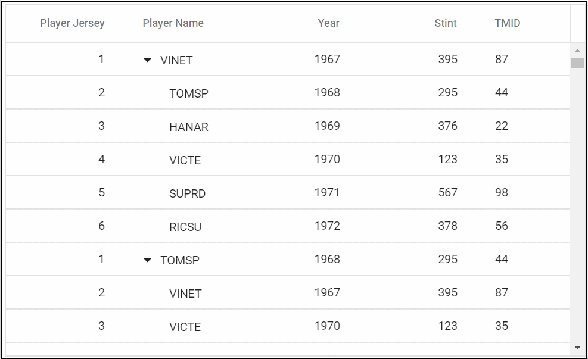

# Virtualization

Tree Grid allows you to load large amount of data without performance degradation.

## Row Virtualization

Row virtualization allows you to load and render rows only in the content viewport. It is an alternative way of paging in which the rows will be appended while scrolling vertically. To setup the row virtualization, you need to define
[`EnableVirtualization`](https://help.syncfusion.com/cr/blazor/Syncfusion.Blazor~Syncfusion.Blazor.TreeGrid.SfTreeGrid%601~EnableVirtualization.html) as true and content height by [`Height`](https://help.syncfusion.com/cr/blazor/Syncfusion.Blazor~Syncfusion.Blazor.TreeGrid.SfTreeGrid%601~Height.html) property.

The number of records displayed in the Tree Grid is determined implicitly by height of the content area and a buffer records will be maintained in the Tree Grid content in addition to the original set of rows.

Expand and Collapse state of any child record will be persisted.





The following output is displayed as a result of the above code example.

## Limitations for Virtualization

* Due to the element height limitation in browsers, the maximum number of records loaded by the tree grid is limited by the browser capability.
* Cell selection will not be persisted in row.
* Virtual scrolling is not compatible with detail template.
* Row count of the page does not depend on the **PageSize** property of the **TreeGridPageSettings**. Row count for the page is determined by the [`Height`](https://help.syncfusion.com/cr/blazor/Syncfusion.Blazor~Syncfusion.Blazor.TreeGrid.SfTreeGrid%601~Height.html) given to the Tree Grid.
* The virtual height of the tree grid content is calculated using the row height and total number of records in the data source and hence features which changes row height such as text wrapping are not supported. If you want to increase the row height to accommodate the content then you can specify the row height as below to ensure all the table rows are in same height.
* Programmatic selection using the **SelectRows** method is not supported in virtual scrolling.
* Frozen column feature is not supported with Virtual Scrolling.