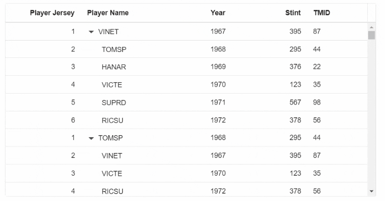
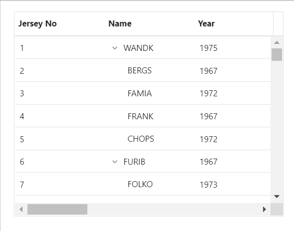

# Virtualization in Blazor TreeGrid Component

Tree Grid allows to load large amount of data without performance degradation.

## Row Virtualization

Row virtualization allows to load and render rows only in the content viewport. It is an alternative way of paging in which the rows will be appended while scrolling vertically. To setup the row virtualization, define the [EnableVirtualization](https://help.syncfusion.com/cr/blazor/Syncfusion.Blazor~Syncfusion.Blazor.TreeGrid.SfTreeGrid%601~EnableVirtualization.html) as true and content height by [Height](https://help.syncfusion.com/cr/blazor/Syncfusion.Blazor~Syncfusion.Blazor.TreeGrid.SfTreeGrid%601~Height.html) property.

The number of records displayed in the Tree Grid is determined implicitly by height of the content area and a buffer records will be maintained in the Tree Grid content in addition to the original set of rows.

Expand and Collapse state of any child record will be persisted.





@using TreeGridComponent.Data;
@using Syncfusion.Blazor.TreeGrid;
@using Syncfusion.Blazor.Grids;

<SfTreeGrid TValue="VirtualData" DataSource="@TreeGridData" ChildMapping="Children" EnableVirtualization="true" Height="350" TreeColumnIndex="1">
    <TreeGridColumns>
        <TreeGridColumn Field="TaskID" HeaderText="Player Jersey" Width="100" TextAlign="Syncfusion.Blazor.Grids.TextAlign.Right"></TreeGridColumn>
        <TreeGridColumn Field="FIELD1" HeaderText="Player Name" Width="100"></TreeGridColumn>
        <TreeGridColumn Field="FIELD2" HeaderText="Year" Width="100" TextAlign="Syncfusion.Blazor.Grids.TextAlign.Right"></TreeGridColumn>
        <TreeGridColumn Field="FIELD3" HeaderText="Stint" Width="100" TextAlign="Syncfusion.Blazor.Grids.TextAlign.Right"></TreeGridColumn>
        <TreeGridColumn Field="FIELD4" HeaderText="TMID" Width="80"></TreeGridColumn>
    </TreeGridColumns>
</SfTreeGrid>

@code{
    public VirtualData[] TreeGridData { get; set; }   

    protected override void OnInitialized()
    {
        this.TreeGridData = VirtualData.GetVirtualData().ToArray();
    } 
}





namespace TreeGridComponent.Data {

public class VirtualData
    {
        public int? TaskID { get; set; }
        public string FIELD1 { get; set; }
        public int? FIELD2 { get; set; }
        public int? FIELD3 { get; set; }
        public int? FIELD4 { get; set; }
        public List<VirtualData> Children { get; set; }

        public static List<VirtualData> GetVirtualData()
        {
            List<VirtualData> DataCollection = new List<VirtualData>();

            for (var i = 1; i <= 1000; i++)
            {
                VirtualData Parent1 = new VirtualData()
                {
                    TaskID = 1,
                    FIELD1 = "VINET",
                    FIELD2 = 1967,
                    FIELD3 = 395,
                    FIELD4 = 87,
                    Children = new List<VirtualData>()
                };
                VirtualData Child1 = new VirtualData()
                {
                    TaskID = 2,
                    FIELD1 = "TOMSP",
                    FIELD2 = 1968,
                    FIELD3 = 295,
                    FIELD4 = 44
                };
                VirtualData Child2 = new VirtualData()
                {
                    TaskID = 3,
                    FIELD1 = "HANAR",
                    FIELD2 = 1969,
                    FIELD3 = 376,
                    FIELD4 = 22
                };
                VirtualData Child3 = new VirtualData()
                {
                    TaskID = 4,
                    FIELD1 = "VICTE",
                    FIELD2 = 1970,
                    FIELD3 = 123,
                    FIELD4 = 35
                };
                VirtualData Child4 = new VirtualData()
                {
                    TaskID = 5,
                    FIELD1 = "SUPRD",
                    FIELD2 = 1971,
                    FIELD3 = 567,
                    FIELD4 = 98
                };
                VirtualData Child5 = new VirtualData()
                {
                    TaskID = 6,
                    FIELD1 = "RICSU",
                    FIELD2 = 1972,
                    FIELD3 = 378,
                    FIELD4 = 56
                };
                VirtualData Parent2 = new VirtualData()
                {
                    TaskID = 1,
                    FIELD1 = "TOMSP",
                    FIELD2 = 1968,
                    FIELD3 = 295,
                    FIELD4 = 44,
                    Children = new List<VirtualData>()
                };
                VirtualData Child6 = new VirtualData()
                {
                    TaskID = 2,
                    FIELD1 = "VINET",
                    FIELD2 = 1967,
                    FIELD3 = 395,
                    FIELD4 = 87
                };
                VirtualData Child7 = new VirtualData()
                {
                    TaskID = 3,
                    FIELD1 = "VICTE",
                    FIELD2 = 1970,
                    FIELD3 = 123,
                    FIELD4 = 35
                };
                VirtualData Child8 = new VirtualData()
                {
                    TaskID = 4,
                    FIELD1 = "RICSU",
                    FIELD2 = 1972,
                    FIELD3 = 378,
                    FIELD4 = 56
                };
                VirtualData Child9 = new VirtualData()
                {
                    TaskID = 5,
                    FIELD1 = "HANAR",
                    FIELD2 = 1969,
                    FIELD3 = 376,
                    FIELD4 = 22
                };
                VirtualData Child10 = new VirtualData()
                {
                    TaskID = 6,
                    FIELD1 = "SUPRD",
                    FIELD2 = 1971,
                    FIELD3 = 567,
                    FIELD4 = 98
                };
                Parent1.Children.Add(Child1);
                Parent1.Children.Add(Child2);
                Parent1.Children.Add(Child3);
                Parent1.Children.Add(Child4);
                Parent1.Children.Add(Child5);

                Parent2.Children.Add(Child6);
                Parent2.Children.Add(Child7);
                Parent2.Children.Add(Child8);
                Parent2.Children.Add(Child9);
                Parent2.Children.Add(Child10);

                DataCollection.Add(Parent1);
                DataCollection.Add(Parent2);
            }
            return DataCollection;
        }
    }
}







### Managing records count

By default, the number of records rendered per page will be twice the TreeGrid's height. You can customize the row rendering count using the [PageSize](https://help.syncfusion.com/cr/blazor/Syncfusion.Blazor.TreeGrid.TreeGridPageSettings.html#Syncfusion_Blazor_TreeGrid_TreeGridPageSettings_PageSize) and [OverscanCount](https://help.syncfusion.com/cr/blazor/Syncfusion.Blazor.TreeGrid.SfTreeGrid-1.html#Syncfusion_Blazor_TreeGrid_SfTreeGrid_1_OverscanCount) properties. Here's an explanation of these properties:

* PageSize:
    •	The `PageSize` property determines the number of rows rendered per page in the  tree grid.
    •	It allows you to control how many rows are loaded and displayed at initial rendering and also while scrolling, helping to improve performance by reducing the number of DOM elements rendered.
* OverscanCount:
    •	The `OverscanCount` property is used to render additional rows before and after the tree grid's current page rows.
    •	During both virtual scrolling and initial rendering, extra rows are rendered to provide a buffer around the current page area. This minimizes the need for frequent rendering during scrolling, providing a smoother user experience.

```csharp

@using Syncfusion.Blazor.Grids
@using Syncfusion.Blazor.TreeGrid

<SfTreeGrid DataSource="@TreeGridData" OverscanCount="5" IdMapping="TaskID" RowHeight="35"  TreeColumnIndex="1" ParentIdMapping="ParentID" Height="410" Width="410" EnableHover="false" EnableVirtualization="true"  EnableColumnVirtualization="true">
    <TreeGridPageSettings PageSize="40"></TreeGridPageSettings>
    <TreeGridColumns>
        <TreeGridColumn Field="TaskID" HeaderText="No" TextAlign="TextAlign.Right" Width="60"></TreeGridColumn>
        <TreeGridColumn Field="FIELD1" HeaderText="Name" Width="100"></TreeGridColumn>
        <TreeGridColumn Field="FIELD2" HeaderText="Year" TextAlign="TextAlign.Right" Width="80"></TreeGridColumn>
        <TreeGridColumn Field="FIELD3" HeaderText="Stint" TextAlign="TextAlign.Right" Width="80"></TreeGridColumn>
        <TreeGridColumn Field="FIELD4" HeaderText="TMID" TextAlign="TextAlign.Right" Width="80"></TreeGridColumn>
        <TreeGridColumn Field="FIELD5" HeaderText="LGID" TextAlign="TextAlign.Right" Width="150"></TreeGridColumn>
        <TreeGridColumn Field="FIELD6" HeaderText="GP" TextAlign="TextAlign.Right" Width="150"></TreeGridColumn>
        <TreeGridColumn Field="Field7" HeaderText="GS" TextAlign="TextAlign.Right" Width="150"></TreeGridColumn>
        <TreeGridColumn Field="Field8" HeaderText="Minutes" TextAlign="TextAlign.Right" Width="150"></TreeGridColumn>
        <TreeGridColumn Field="Field9" HeaderText="Points" TextAlign="TextAlign.Right" Width="150"></TreeGridColumn>
        <TreeGridColumn Field="Field10" HeaderText="ORebounds" TextAlign="TextAlign.Right" Width="150"></TreeGridColumn>
        <TreeGridColumn Field="Field11" HeaderText="DRebounds" TextAlign="TextAlign.Right" Width="150"></TreeGridColumn>
        <TreeGridColumn Field="Field12" HeaderText="Rebounds" TextAlign="TextAlign.Right" Width="150"></TreeGridColumn>
        <TreeGridColumn Field="Field13" HeaderText="Assists" TextAlign="TextAlign.Right" Width="150"></TreeGridColumn>
        <TreeGridColumn Field="Field14" HeaderText="Steals" TextAlign="TextAlign.Right" Width="150"></TreeGridColumn>
        <TreeGridColumn Field="Field15" HeaderText="Blocks" TextAlign="TextAlign.Right" Width="150"></TreeGridColumn>
        <TreeGridColumn Field="Field16" HeaderText="TurnOvers" TextAlign="TextAlign.Right" Width="150"></TreeGridColumn>
        <TreeGridColumn Field="Field17" HeaderText="PF" TextAlign="TextAlign.Right" Width="150"></TreeGridColumn>
        <TreeGridColumn Field="Field18" HeaderText="FgAttempted" TextAlign="TextAlign.Right" Width="150"></TreeGridColumn>
        <TreeGridColumn Field="Field19" HeaderText="FgMade" TextAlign="TextAlign.Right" Width="150"></TreeGridColumn>
        <TreeGridColumn Field="Field20" HeaderText="FtAttempted" TextAlign="TextAlign.Right" Width="150"></TreeGridColumn>
    </TreeGridColumns>
</SfTreeGrid>

@code{
    private List<VirtualData> TreeGridData { get; set; } = new List<VirtualData>();
    protected override void OnInitialized()
    {
        TreeGridData = VirtualData.GetTreeVirtualData();
        
    }
    public class VirtualData
    {
        public int TaskID { get; set; }
        public string FIELD1 { get; set; }
        public int FIELD2 { get; set; }
        public int FIELD3 { get; set; }
        public int FIELD4 { get; set; }
        public int FIELD5 { get; set; }
        public int FIELD6 { get; set; }
        public int Field7 { get; set; }
        public int Field8 { get; set; }
        public int Field9 { get; set; }
        public int Field10 { get; set; }
        public int Field11 { get; set; }
        public int Field12 { get; set; }
        public int Field13 { get; set; }
        public int Field14 { get; set; }
        public int Field15 { get; set; }
        public int Field16 { get; set; }
        public int Field17 { get; set; }
        public int Field18 { get; set; }
        public int Field19 { get; set; }
        public int Field20 { get; set; }
        public int? ParentID { get; set; }
        public static List<VirtualData> GetTreeVirtualData()
        {
            string[] Names = new string[] { "VINET", "TOMSP", "HANAR", "VICTE", "SUPRD", "HANAR", "CHOPS", "RICSU", "WELLI", "HILAA", "ERNSH", "CENTC",
            "OTTIK", "QUEDE", "RATTC", "ERNSH", "FOLKO", "BLONP", "WARTH", "FRANK", "GROSR", "WHITC", "WARTH", "SPLIR", "RATTC", "QUICK", "VINET",
            "MAGAA", "TORTU", "MORGK", "BERGS", "LEHMS", "BERGS", "ROMEY", "ROMEY", "LILAS", "LEHMS", "QUICK", "QUICK", "RICAR", "REGGC", "BSBEV",
            "COMMI", "QUEDE", "TRADH", "TORTU", "RATTC", "VINET", "LILAS", "BLONP", "HUNGO", "RICAR", "MAGAA", "WANDK", "SUPRD", "GODOS", "TORTU",
            "OLDWO", "ROMEY", "LONEP", "ANATR", "HUNGO", "THEBI", "DUMON", "WANDK", "QUICK", "RATTC", "ISLAT", "RATTC", "LONEP", "ISLAT", "TORTU",
            "WARTH", "ISLAT", "PERIC", "KOENE", "SAVEA", "KOENE", "BOLID", "FOLKO", "FURIB", "SPLIR", "LILAS", "BONAP", "MEREP", "WARTH", "VICTE",
            "HUNGO", "PRINI", "FRANK", "OLDWO", "MEREP", "BONAP", "SIMOB", "FRANK", "LEHMS", "WHITC", "QUICK", "RATTC", "FAMIA" };
            List<VirtualData> DataCollection = new List<VirtualData>();
            var RecordID = 0;
            for (var i = 1; i <= 2000; i++)
            {
                var name = (i % 100);
                VirtualData Parent = new VirtualData()
                    {
                        TaskID = ++RecordID,
                        FIELD1 = Names[name],
                        FIELD2 = (i % 2 == 0) ? 1967 + 2 : (i % 5 == 0) ? 1967 + 8 : 1967 + 12,
                        FIELD3 = (i % 2 == 0) ? 395 + 2 : (i % 5 == 0) ? 395 + 1 : 395 + 25,
                        FIELD4 = (i % 2 == 0) ? 87 + 2 : (i % 5 == 0) ? 87 + 1 : 87 + 15,
                        FIELD5 = (i % 2 == 0) ? 410 + 2 : (i % 5 == 0) ? 410 + 1 : 410 + 45,
                        FIELD6 = (i % 2 == 0) ? 67 + 2 : (i % 5 == 0) ? 67 + 1 : 67 + 6,
                        Field7 = (i % 2 == 0) ? 35 + 2 : (i % 5 == 0) ? 24 + 1 : 45 + 12,
                        Field8 = (i % 2 == 0) ? 100 + 2 : (i % 5 == 0) ? 100 + 1 : 100 + 12,
                        Field9 = (i % 2 == 0) ? 35 + 2 : (i % 5 == 0) ? 24 + 1 : 45 + 12,
                        Field10 = (i % 2 == 0) ? 46 + 2 : (i % 5 == 0) ? 46 + 1 : 64 + 6,
                        Field11 = (i % 2 == 0) ? 67 + 2 : (i % 5 == 0) ? 67 + 1 : 67 + 6,
                        Field12 = (i % 2 == 0) ? 100 + 62 : (i % 5 == 0) ? 100 + 41 : 100 + 112,
                        Field13 = (i % 2 == 0) ? 2 + 2 : (i % 5 == 0) ? 1 + 1 : 1 + 6,
                        Field14 = (i % 2 == 0) ? 46 + 2 : (i % 5 == 0) ? 46 + 1 : 64 + 6,
                        Field15 = (i % 2 == 0) ? 1000 + 112 : (i % 5 == 0) ? 1000 + 153 : 1000 + 412,
                        Field16 = (i % 2 == 0) ? 210 + 23 : (i % 5 == 0) ? 210 + 12 : 210 + 621,
                        Field17 = (i % 2 == 0) ? 300 + 533 : (i % 5 == 0) ? 300 + 321 : 300 + 699,
                        Field18 = (i % 2 == 0) ? 400 + 232 : (i % 5 == 0) ? 400 + 153 : 400 + 342,
                        Field19 = (i % 2 == 0) ? 40 + 12 : (i % 5 == 0) ? 40 + 24 : 40 + 25,
                        Field20 = (i % 2 == 0) ? 700 + 423 : (i % 5 == 0) ? 700 + 53 : 700 + 43,
                        ParentID = null
                    };
                DataCollection.Add(Parent);
                for (var j = 1; j <= 4; j++)
                {
                    var childName = ((i + j) % 100);
                    DataCollection.Add(new VirtualData()
                        {
                            TaskID = ++RecordID,
                            FIELD1 = Names[childName],
                            FIELD2 = (j % 3 == 0) ? 1967 + (j + 2) : (j % 4 == 0) ? 1967 + (j + 1) : 1967 + j,
                            FIELD3 = (j % 3 == 0) ? 395 + (j + 2) : (j % 4 == 0) ? 395 + (j + 4) : 395 + (j + 13),
                            FIELD4 = (j % 3 == 0) ? 87 + (j + 2) : (j % 4 == 0) ? 87 + (j + 1) : 87 + (j + 12),
                            FIELD5 = (j % 3 == 0) ? 410 + (j + 2) : (j % 4 == 0) ? 410 + (j + 1) : 410 + (j + 14),
                            FIELD6 = (j % 3 == 0) ? 67 + (j + 2) : (j % 4 == 0) ? 67 + (j + 1) : 67 + (j + 7),
                            Field7 = (j % 3 == 0) ? 89 + (j + 2) : (j % 4 == 0) ? 94 + (j + 1) : 23 + (j + 7),
                            Field8 = (j % 3 == 0) ? 76 + (j + 2) : (j % 4 == 0) ? 23 + (j + 1) : 45 + (j + 7),
                            Field9 = (j % 3 == 0) ? 87 + (j + 2) : (j % 4 == 0) ? 87 + (j + 1) : 87 + (j + 12),
                            Field10 = (j % 3 == 0) ? 54 + (j + 2) : (j % 4 == 0) ? 54 + (j + 1) : 54 + (j + 12),
                            Field11 = (j % 3 == 0) ? 280 + (j + 2) : (j % 4 == 0) ? 280 + (j + 1) : 280 + (j + 12),
                            Field12 = (j % 3 == 0) ? 126 + (j + 2) : (j % 4 == 0) ? 116 + (j + 1) : 156 + (j + 12),
                            Field13 = (j % 3 == 0) ? 12 + (j + 2) : (j % 4 == 0) ? 12 + (j + 1) : 12 + (j + 12),
                            Field14 = (j % 3 == 0) ? 54 + (j + 2) : (j % 4 == 0) ? 53 + (j + 1) : 23 + (j + 12),
                            Field15 = (j % 3 == 0) ? 1003 + (j + 2) : (j % 4 == 0) ? 1100 + (j + 1) : 1000 + (j + 12),
                            Field16 = (j % 3 == 0) ? 210 + (j + 2) : (j % 4 == 0) ? 237 + (j + 1) : 290 + (j + 12),
                            Field17 = (j % 3 == 0) ? 300 + (j + 2) : (j % 4 == 0) ? 300 + (j + 1) : 300 + (j + 12),
                            Field18 = (j % 3 == 0) ? 400 + (j + 2) : (j % 4 == 0) ? 400 + (j + 1) : 400 + (j + 12),
                            Field19 = (j % 3 == 0) ? 40 + (j + 2) : (j % 4 == 0) ? 40 + (j + 1) : 40 + (j + 12),
                            Field20 = (j % 3 == 0) ? 700 + (j + 2) : (j % 4 == 0) ? 700 + (j + 1) : 700 + (j + 12),
                            ParentID = Parent.TaskID
                        });
                }
            }
            return DataCollection;
        }
    }
}
```



N> For example, when the OverscanCount is set to 5, only 5 buffer rows are rendered on the first and last pages. However, on in-between pages, a total of 10 buffer rows are rendered, with 5 rows allocated for both before and after the current page's visible rows.

## Virtualization with hierarchical data binding

Virtualization with hierarchical data binding is a technique used in the TreeGrid to efficiently render and manage large volumes of hierarchical (parent-child) data without compromising performance.

In this approach, the data source is transformed into a flattened hierarchical structure, where each parent record is immediately followed by its child records in the correct sequence.

* In hierarchical data binding with virtualization, the data source should follow a flattened hierarchical structure where each parent record is immediately followed by its child records in the correct sequence.

* This differs from earlier implementations where only the top-level parent records were initially bound, and child data was loaded or rendered separately.

* To support dynamic operations like expand/collapse and virtualization, a helper method is used to flatten the hierarchy while preserving the parent-child display order.

* This structure makes rendering efficient and ensures smooth interactions when working with large hierarchical datasets in a virtualized environment.

Consider a task management application that displays projects and their sub-tasks in a hierarchical grid. Users need to:

* Efficiently scroll through thousands of tasks without lag.

* Expand or collapse parent tasks to show or hide subtasks dynamically.

* Maintain smooth interactions without loading the entire dataset into the DOM at once.

To achieve this, follow the steps below:

**Step 1: Define the ChildMapping property:**

In the `SfTreeGrid`, set the `ChildMapping` property to the field name that holds the children collection for each record (e.g., "Children").

**Step 2: Flatten the hierarchical data source:**

To flatten the data, implement a recursive method that processes each parent and appends its children immediately after it, maintaining the display order.

```ts

  public List<VirtualData> HierarchyToFlatData(List<VirtualData> dataSource, string childMapping, List<VirtualData> addedData = null)
  {
    if (addedData == null)
    {
      addedData = new List<VirtualData>();
    }

    foreach (var item in dataSource)
    {
      addedData.Add(item);

      // Get children dynamically using reflection.
      var propertyInfo = item.GetType().GetProperty(childMapping);
      var children = propertyInfo?.GetValue(item) as IEnumerable<VirtualData>;

      if (children != null)
      {
        HierarchyToFlatData(children.ToList(), childMapping, addedData);
      }
    }
    return addedData;
  }

```

**Step 3: Initialize the flattened data in the component lifecycle:**

Call the `HierarchyToFlatData` method to flatten your hierarchical data and bind it to the TreeGrid.

```ts

protected override void OnInitialized()
{
  this.TreeGridData = HierarchyToFlatData(VirtualData.GetVirtualData(), "Children").ToArray();
}

```

**Step 4: Define the data model:**

Create a data model class that contains hierarchical data with a collection of child records.

```ts

public class VirtualData
{
  public int TaskID { get; set; }
  public string FIELD1 { get; set; }
  public int FIELD2 { get; set; }
  public int? FIELD3 { get; set; }
  public int? FIELD4 { get; set; }
  ublic List<VirtualData> Children { get; set; }

  static string[] Names = new string[] { "VINET", "TOMSP", "HANAR", "VICTE", "SUPRD", "HANAR", "CHOPS", "RICSU", "WELLI", "HILAA", "ERNSH", "CENTC","OTTIK", "QUEDE", "RATTC", "ERNSH", "FOLKO", "BLONP", "WARTH", "FRANK", "GROSR", "WHITC", "WARTH", "SPLIR", "RATTC", "QUICK", "VINET","MAGAA", "TORTU", "MORGK", "BERGS", "LEHMS", "BERGS", "ROMEY", "ROMEY", "LILAS", "LEHMS", "QUICK", "QUICK", "RICAR", "REGGC", "BSBEV","COMMI", "QUEDE", "TRADH", "TORTU", "RATTC", "VINET", "LILAS", "BLONP", "HUNGO", "RICAR", "MAGAA", "WANDK", "SUPRD", "GODOS", "TORTU","OLDWO", "ROMEY", "LONEP", "ANATR", "HUNGO", "THEBI", "DUMON", "WANDK", "QUICK", "RATTC", "ISLAT", "RATTC", "LONEP", "ISLAT", "TORTU","WARTH", "ISLAT", "PERIC", "KOENE", "SAVEA", "KOENE", "BOLID", "FOLKO", "FURIB", "SPLIR", "LILAS", "BONAP", "MEREP", "WARTH", "VICTE","HUNGO", "PRINI", "FRANK", "OLDWO", "MEREP", "BONAP", "SIMOB", "FRANK", "LEHMS", "WHITC", "QUICK", "RATTC", "FAMIA" };

  public static List<VirtualData> GetVirtualData()
  {
    List<VirtualData> DataCollection = new List<VirtualData>();
    var j = 0;
    for (var i = 1; i <= 10000; i++)
    {

      var random = new Random();
      var name = random.Next(50);
      VirtualData Parent1 = new VirtualData()
      {
        TaskID = ++j,
        FIELD1 = VirtualData.Names[name],
        FIELD2 = 1967,
        FIELD3 = 395,
        FIELD4 = 87,
        Children = new List<VirtualData>()
      };
      for (var k = 0; k < 4; k++)
      {
        name = random.Next(5);
        VirtualData Child1 = new VirtualData()
        {
          TaskID = ++j,
          FIELD1 = VirtualData.Names[name],
          FIELD2 = 1968,
          FIELD3 = 295,
          FIELD4 = 44
        };
        Parent1.Children.Add(Child1);
      }

      name = random.Next(50);
      VirtualData Parent2 = new VirtualData()
      {
        TaskID = ++j,
        FIELD1 = VirtualData.Names[name],
        FIELD2 = 1968,
        FIELD3 = 295,
        FIELD4 = 44,
        Children = new List<VirtualData>()
      };
      for (var m = 0; m < 4; m++)
      {
        name = random.Next(50);
        VirtualData Child2 = new VirtualData()
        {
          TaskID = ++j,
          FIELD1 = VirtualData.Names[name],
          FIELD2 = 1968,
          FIELD3 = 295,
          FIELD4 = 44
        };
        Parent2.Children.Add(Child2);
      }
      DataCollection.Add(Parent1);
      DataCollection.Add(Parent2);
    }
    return DataCollection;
  }
}

```

The following sample demonstrates a complete working example of virtualization with hierarchical data binding:




@using Syncfusion.Blazor.TreeGrid;
@using Syncfusion.Blazor.Grids;

<SfTreeGrid RowHeight="35" OverscanCount="5" @ref="TreeGrid" TValue="VirtualData" DataSource="@TreeGridData" ChildMapping="Children" EnableVirtualization="true" Height="400" TreeColumnIndex="1" EnableVirtualMaskRow="true" Toolbar="@(new List<string>(){"Add","Edit","Delete","Update","Cancel","ExpandAll", "CollapseAll"})">
  <TreeGridEditSettings AllowEditing="true" AllowAdding="true" AllowDeleting="true" Mode="Syncfusion.Blazor.TreeGrid.EditMode.Cell" NewRowPosition="RowPosition.Child" />
  <TreeGridPageSettings PageSize="30"></TreeGridPageSettings>
  <TreeGridColumns>
    <TreeGridColumn Field="TaskID" IsPrimaryKey="true" HeaderText="Player Jersey" Width="100" TextAlign="Syncfusion.Blazor.Grids.TextAlign.Right"></TreeGridColumn>
    <TreeGridColumn Field="FIELD1" HeaderText="Player Name" Width="100"></TreeGridColumn>
    <TreeGridColumn Field="FIELD2" HeaderText="Year" Width="100" TextAlign="Syncfusion.Blazor.Grids.TextAlign.Right"></TreeGridColumn>
    <TreeGridColumn Field="FIELD3" HeaderText="Stint" Width="100" TextAlign="Syncfusion.Blazor.Grids.TextAlign.Right"></TreeGridColumn>
    <TreeGridColumn Field="FIELD4" HeaderText="TMID" Width="80"></TreeGridColumn>
  </TreeGridColumns>
</SfTreeGrid>

@code {
  private SfTreeGrid<VirtualData> TreeGrid;
  public VirtualData[] TreeGridData { get; set; }

  protected override void OnInitialized()
  {
    this.TreeGridData = HierarchyToFlatData(VirtualData.GetVirtualData(), "Children").ToArray();
  }

  public List<VirtualData> HierarchyToFlatData(List<VirtualData> dataSource, string childMapping, List<VirtualData> addedData = null)
  {
    if (addedData == null)
    {
      addedData = new List<VirtualData>();
    }

    foreach (var item in dataSource)
    {
      addedData.Add(item);

      // Get children dynamically using reflection.
      var propertyInfo = item.GetType().GetProperty(childMapping);
      var children = propertyInfo?.GetValue(item) as IEnumerable<VirtualData>;
      if (children != null)
      {
        HierarchyToFlatData(children.ToList(), childMapping, addedData);
      }
    }

    return addedData;
  }

  private async Task ExpandAllOnClick()
  {
    await TreeGrid.ExpandAllAsync();
  }

  public class VirtualData
  {
    public int TaskID { get; set; }
    public string FIELD1 { get; set; }
    public int FIELD2 { get; set; }
    public int? FIELD3 { get; set; }
    public int? FIELD4 { get; set; }
    public List<VirtualData> Children { get; set; }

    static string[] Names = new string[] { "VINET", "TOMSP", "HANAR", "VICTE", "SUPRD", "HANAR", "CHOPS", "RICSU", "WELLI", "HILAA", "ERNSH", "CENTC","OTTIK", "QUEDE", "RATTC", "ERNSH", "FOLKO", "BLONP", "WARTH", "FRANK", "GROSR", "WHITC", "WARTH", "SPLIR", "RATTC", "QUICK", "VINET","MAGAA", "TORTU", "MORGK", "BERGS", "LEHMS", "BERGS", "ROMEY", "ROMEY", "LILAS", "LEHMS", "QUICK", "QUICK", "RICAR", "REGGC", "BSBEV","COMMI", "QUEDE", "TRADH", "TORTU", "RATTC", "VINET", "LILAS", "BLONP", "HUNGO", "RICAR", "MAGAA", "WANDK", "SUPRD", "GODOS", "TORTU","OLDWO", "ROMEY", "LONEP", "ANATR", "HUNGO", "THEBI", "DUMON", "WANDK", "QUICK", "RATTC", "ISLAT", "RATTC", "LONEP", "ISLAT", "TORTU","WARTH", "ISLAT", "PERIC", "KOENE", "SAVEA", "KOENE", "BOLID", "FOLKO", "FURIB", "SPLIR", "LILAS", "BONAP", "MEREP", "WARTH", "VICTE","HUNGO", "PRINI", "FRANK", "OLDWO", "MEREP", "BONAP", "SIMOB", "FRANK", "LEHMS", "WHITC", "QUICK", "RATTC", "FAMIA" };

    public static List<VirtualData> GetVirtualData()
    {
      List<VirtualData> DataCollection = new List<VirtualData>();
      var j = 0;
      for (var i = 1; i <= 10000; i++)
      {
        var random = new Random();
        var name = random.Next(50);
        VirtualData Parent1 = new VirtualData()
        {
          TaskID = ++j,
          FIELD1 = VirtualData.Names[name],
          FIELD2 = 1967,
          FIELD3 = 395,
          FIELD4 = 87,
          Children = new List<VirtualData>()
        };
        for (var k = 0; k < 4; k++)
        {
          name = random.Next(5);
          VirtualData Child1 = new VirtualData()
          {
            TaskID = ++j,
            FIELD1 = VirtualData.Names[name],
            FIELD2 = 1968,
            FIELD3 = 295,
            FIELD4 = 44
          };
          Parent1.Children.Add(Child1);
        }

        name = random.Next(50);
        VirtualData Parent2 = new VirtualData()
        {
          TaskID = ++j,
          FIELD1 = VirtualData.Names[name],
          FIELD2 = 1968,
          FIELD3 = 295,
          FIELD4 = 44,
          Children = new List<VirtualData>()
        };
        for (var m = 0; m < 4; m++)
        {
          name = random.Next(50);
          VirtualData Child2 = new VirtualData()
          {
            TaskID = ++j,
            FIELD1 = VirtualData.Names[name],
            FIELD2 = 1968,
            FIELD3 = 295,
            FIELD4 = 44
          };
          Parent2.Children.Add(Child2);
        }
        DataCollection.Add(Parent1);
        DataCollection.Add(Parent2);
      }
      return DataCollection;
    }
  }
}




## Column Virtualization

Column virtualization allows you to virtualize columns. It will render columns which are in the viewport. You can scroll horizontally to view more columns.

To setup the column virtualization, set the [EnableVirtualization](https://help.syncfusion.com/cr/blazor/Syncfusion.Blazor.TreeGrid.SfTreeGrid-1.html#Syncfusion_Blazor_TreeGrid_SfTreeGrid_1_EnableVirtualization) and [EnableColumnVirtualization](https://help.syncfusion.com/cr/blazor/Syncfusion.Blazor.TreeGrid.SfTreeGrid-1.html#Syncfusion_Blazor_TreeGrid_SfTreeGrid_1_EnableColumnVirtualization) properties as **true**.

```csharp

@using Syncfusion.Blazor.Grids
@using Syncfusion.Blazor.TreeGrid;

<SfTreeGrid DataSource="@TreeData" IdMapping="TaskID" TreeColumnIndex="1" ParentIdMapping="ParentID" Height="400" Width="600" EnableHover="false" EnableVirtualization="true" EnableColumnVirtualization="true">
    <TreeGridPageSettings PageSize="40"></TreeGridPageSettings>
    <TreeGridColumns>
        <TreeGridColumn Field="TaskID" HeaderText="Jersey No" TextAlign="TextAlign.Right" Width="150"></TreeGridColumn>
        <TreeGridColumn Field="FIELD1" HeaderText="Name" Width="150"></TreeGridColumn>
        <TreeGridColumn Field="FIELD2" HeaderText="Year" TextAlign="TextAlign.Right" Width="150"></TreeGridColumn>
        <TreeGridColumn Field="FIELD3" HeaderText="Stint" TextAlign="TextAlign.Right" Width="150"></TreeGridColumn>
        <TreeGridColumn Field="FIELD4" HeaderText="TMID" TextAlign="TextAlign.Right" Width="150"></TreeGridColumn>
        <TreeGridColumn Field="FIELD5" HeaderText="LGID" TextAlign="TextAlign.Right" Width="150"></TreeGridColumn>
        <TreeGridColumn Field="FIELD6" HeaderText="GP" TextAlign="TextAlign.Right" Width="150"></TreeGridColumn>
        <TreeGridColumn Field="Field7" HeaderText="GS" TextAlign="TextAlign.Right" Width="150"></TreeGridColumn>
        <TreeGridColumn Field="Field8" HeaderText="Minutes" TextAlign="TextAlign.Right" Width="150"></TreeGridColumn>
        <TreeGridColumn Field="Field9" HeaderText="Points" TextAlign="TextAlign.Right" Width="150"></TreeGridColumn>
    </TreeGridColumns>
</SfTreeGrid>

@code{
    public List<VirtualData> TreeData { get; set; }
    protected override void OnInitialized()
    {
        this.TreeData = VirtualData.GetTreeVirtualData().ToList();
    }

    public class VirtualData
    {
        public int TaskID { get; set; }
        public string FIELD1 { get; set; }
        public int FIELD2 { get; set; }
        public int FIELD3 { get; set; }
        public int FIELD4 { get; set; }
        public int FIELD5 { get; set; }
        public int FIELD6 { get; set; }
        public int Field7 { get; set; }
        public int Field8 { get; set; }
        public int Field9 { get; set; }
        public int? ParentID { get; set; }
        public static List<VirtualData> GetTreeVirtualData()
        {
            string[] Names = new string[] { "VINET", "TOMSP", "HANAR", "VICTE", "SUPRD", "HANAR", "CHOPS", "RICSU", "WELLI", "HILAA", "ERNSH", "CENTC",
            "OTTIK", "QUEDE", "RATTC", "ERNSH", "FOLKO", "BLONP", "WARTH", "FRANK", "GROSR", "WHITC", "WARTH", "SPLIR", "RATTC", "QUICK", "VINET",
            "MAGAA", "TORTU", "MORGK", "BERGS", "LEHMS", "BERGS", "ROMEY", "ROMEY", "LILAS", "LEHMS", "QUICK", "QUICK", "RICAR", "REGGC", "BSBEV",
            "COMMI", "QUEDE", "TRADH", "TORTU", "RATTC", "VINET", "LILAS", "BLONP", "HUNGO", "RICAR", "MAGAA", "WANDK", "SUPRD", "GODOS", "TORTU",
            "OLDWO", "ROMEY", "LONEP", "ANATR", "HUNGO", "THEBI", "DUMON", "WANDK", "QUICK", "RATTC", "ISLAT", "RATTC", "LONEP", "ISLAT", "TORTU",
            "WARTH", "ISLAT", "PERIC", "KOENE", "SAVEA", "KOENE", "BOLID", "FOLKO", "FURIB", "SPLIR", "LILAS", "BONAP", "MEREP", "WARTH", "VICTE",
            "HUNGO", "PRINI", "FRANK", "OLDWO", "MEREP", "BONAP", "SIMOB", "FRANK", "LEHMS", "WHITC", "QUICK", "RATTC", "FAMIA" };
            List<VirtualData> DataCollection = new List<VirtualData>();
            Random random = new Random();
            var RecordID = 0;
            for (var i = 1; i <= 2000; i++)
            {
                var name = random.Next(0, 100);
                VirtualData Parent = new VirtualData()
                {
                    TaskID = ++RecordID,
                    FIELD1 = Names[name],
                    FIELD2 = 1967 + random.Next(0, 10),
                    FIELD3 = 395 + random.Next(100, 600),
                    FIELD4 = 87 + random.Next(50, 250),
                    FIELD5 = 410 + random.Next(100, 600),
                    FIELD6 = 67 + random.Next(50, 250),
                    Field7 = (int)Math.Floor(random.NextDouble() * 100),
                    Field8 = (int)Math.Floor(random.NextDouble() * 10),
                    Field9 = (int)Math.Floor(random.NextDouble() * 10),
                    ParentID = null
                };
                DataCollection.Add(Parent);
                for (var j = 1; j <= 4; j++)
                {
                    var childName = random.Next(0, 100);
                    DataCollection.Add(new VirtualData()
                    {
                        TaskID = ++RecordID,
                        FIELD1 = Names[childName],
                        FIELD2 = 1967 + random.Next(0, 10),
                        FIELD3 = 395 + random.Next(100, 600),
                        FIELD4 = 87 + random.Next(50, 250),
                        FIELD5 = 410 + random.Next(100, 600),
                        FIELD6 = 67 + random.Next(50, 250),
                        Field7 = (int)Math.Floor(random.NextDouble() * 100),
                        Field8 = (int)Math.Floor(random.NextDouble() * 10),
                        Field9 = (int)Math.Floor(random.NextDouble() * 10),
                        ParentID = Parent.TaskID
                    });
                }
            }
            return DataCollection;

        }
    }
}
```

N> Column's [Width](https://help.syncfusion.com/cr/blazor/Syncfusion.Blazor.TreeGrid.SfTreeGrid-1.html#Syncfusion_Blazor_TreeGrid_SfTreeGrid_1_Width) is required for column virtualization. If column's width is not defined then Tree Grid will consider its value as **200px**.

The following GIF represent a Tree Grid with Column virtualization.


## Enable Cell placeholder during Virtualization

Displays placeholder in cells while data is loading in scrolling action. Also, the same set of DOM elements is reused to enhance performance.

To set up the enable cell placeholder during virtualization, define the [EnableVirtualMaskRow](https://help.syncfusion.com/cr/blazor/Syncfusion.Blazor.TreeGrid.SfTreeGrid-1.html#Syncfusion_Blazor_TreeGrid_SfTreeGrid_1_EnableVirtualMaskRow) as true along with the [EnableVirtualization](https://help.syncfusion.com/cr/blazor/Syncfusion.Blazor.TreeGrid.SfTreeGrid-1.html#Syncfusion_Blazor_TreeGrid_SfTreeGrid_1_EnableVirtualization)/[EnableColumnVirtualization](https://help.syncfusion.com/cr/blazor/Syncfusion.Blazor.TreeGrid.SfTreeGrid-1.html#Syncfusion_Blazor_TreeGrid_SfTreeGrid_1_EnableColumnVirtualization) property.

```csharp

@using Syncfusion.Blazor.TreeGrid
@using Syncfusion.Blazor.Grids
<SfTreeGrid Height="300" Width="450" RowHeight="38" EnableVirtualMaskRow="true" DataSource="@TreeGridData" IdMapping="TaskID" TreeColumnIndex="1" ParentIdMapping="ParentID" EnableVirtualization="true" EnableColumnVirtualization="true">
    <TreeGridPageSettings PageSize="40"></TreeGridPageSettings>
    <TreeGridColumns>
        <TreeGridColumn Field="TaskID" HeaderText="Jersey No" TextAlign="TextAlign.Left" Width="150"></TreeGridColumn>
        <TreeGridColumn Field="FIELD1" HeaderText="Name" Width="150"></TreeGridColumn>
        <TreeGridColumn Field="FIELD2" HeaderText="Year" TextAlign="TextAlign.Left" Width="150"></TreeGridColumn>
        <TreeGridColumn Field="FIELD3" HeaderText="Stint" TextAlign="TextAlign.Left" Width="150"></TreeGridColumn>
        <TreeGridColumn Field="FIELD4" HeaderText="TMID" TextAlign="TextAlign.Left" Width="150"></TreeGridColumn>
        <TreeGridColumn Field="FIELD5" HeaderText="LGID" TextAlign="TextAlign.Left" Width="150"></TreeGridColumn>
        <TreeGridColumn Field="FIELD6" HeaderText="GP" TextAlign="TextAlign.Left" Width="150"></TreeGridColumn>
        <TreeGridColumn Field="Field7" HeaderText="GS" TextAlign="TextAlign.Left" Width="150"></TreeGridColumn>
        <TreeGridColumn Field="Field8" HeaderText="Minutes" TextAlign="TextAlign.Left" Width="150"></TreeGridColumn>
        <TreeGridColumn Field="Field9" HeaderText="Points" TextAlign="TextAlign.Left" Width="150"></TreeGridColumn>
        <TreeGridColumn Field="Field10" HeaderText="ORebounds" TextAlign="TextAlign.Left" Width="150"></TreeGridColumn>
    </TreeGridColumns>
</SfTreeGrid>
@code {
    private List<VirtualData> TreeGridData { get; set; } = new List<VirtualData>();
    protected override void OnInitialized()
    {
        TreeGridData = VirtualData.GetTreeVirtualData();
    }
    public class VirtualData
    {
        public int TaskID { get; set; }
        public string? FIELD1 { get; set; }
        public int FIELD2 { get; set; }
        public int FIELD3 { get; set; }
        public int FIELD4 { get; set; }
        public int FIELD5 { get; set; }
        public int FIELD6 { get; set; }
        public int Field7 { get; set; }
        public int Field8 { get; set; }
        public int Field9 { get; set; }
        public int Field10 { get; set; }
        public int? ParentID { get; set; }
        public static List<VirtualData> GetTreeVirtualData()
        {
            string[] Names = new string[] { "VINET", "TOMSP", "HANAR", "VICTE", "SUPRD", "HANAR", "CHOPS", "RICSU", "WELLI", "HILAA", "ERNSH", "CENTC",
            "OTTIK", "QUEDE", "RATTC", "ERNSH", "FOLKO", "BLONP", "WARTH", "FRANK", "GROSR", "WHITC", "WARTH", "SPLIR", "RATTC", "QUICK", "VINET",
            "MAGAA", "TORTU", "MORGK", "BERGS", "LEHMS", "BERGS", "ROMEY", "ROMEY", "LILAS", "LEHMS", "QUICK", "QUICK", "RICAR", "REGGC", "BSBEV",
            "COMMI", "QUEDE", "TRADH", "TORTU", "RATTC", "VINET", "LILAS", "BLONP", "HUNGO", "RICAR", "MAGAA", "WANDK", "SUPRD", "GODOS", "TORTU",
            "OLDWO", "ROMEY", "LONEP", "ANATR", "HUNGO", "THEBI", "DUMON", "WANDK", "QUICK", "RATTC", "ISLAT", "RATTC", "LONEP", "ISLAT", "TORTU",
            "WARTH", "ISLAT", "PERIC", "KOENE", "SAVEA", "KOENE", "BOLID", "FOLKO", "FURIB", "SPLIR", "LILAS", "BONAP", "MEREP", "WARTH", "VICTE",
            "HUNGO", "PRINI", "FRANK", "OLDWO", "MEREP", "BONAP", "SIMOB", "FRANK", "LEHMS", "WHITC", "QUICK", "RATTC", "FAMIA" };
            List<VirtualData> DataCollection = new List<VirtualData>();
            Random random = new Random();
            var RecordID = 0;
            for (var i = 1; i <= 2000; i++)
            {
                var name = random.Next(0, 100);
                VirtualData Parent = new VirtualData()
                    {
                        TaskID = ++RecordID,
                        FIELD1 = Names[name],
                        FIELD2 = 1967 + random.Next(0, 10),
                        FIELD3 = 395 + random.Next(100, 600),
                        FIELD4 = 87 + random.Next(50, 250),
                        FIELD5 = 410 + random.Next(100, 600),
                        FIELD6 = 67 + random.Next(50, 250),
                        Field7 = (int)Math.Floor(random.NextDouble() * 100),
                        Field8 = (int)Math.Floor(random.NextDouble() * 10),
                        Field9 = (int)Math.Floor(random.NextDouble() * 10),
                        Field10 = (int)Math.Floor(random.NextDouble() * 100),
                        ParentID = null
                    };
                DataCollection.Add(Parent);
                for (var j = 1; j <= 4; j++)
                {
                    var childName = random.Next(0, 100);
                    DataCollection.Add(new VirtualData()
                        {
                            TaskID = ++RecordID,
                            FIELD1 = Names[childName],
                            FIELD2 = 1967 + random.Next(0, 10),
                            FIELD3 = 395 + random.Next(100, 600),
                            FIELD4 = 87 + random.Next(50, 250),
                            FIELD5 = 410 + random.Next(100, 600),
                            FIELD6 = 67 + random.Next(50, 250),
                            Field7 = (int)Math.Floor(random.NextDouble() * 100),
                            Field8 = (int)Math.Floor(random.NextDouble() * 10),
                            Field9 = (int)Math.Floor(random.NextDouble() * 10),
                            Field10 = (int)Math.Floor(random.NextDouble() * 100),
                            ParentID = Parent.TaskID
                        });
                }
            }
            return DataCollection;
        }
    }
}
```

The following image represents a tree grid with the mask row virtualization.


> For a better experience, the [PageSize](https://help.syncfusion.com/cr/blazor/Syncfusion.Blazor.TreeGrid.TreeGridPageSettings.html#Syncfusion_Blazor_TreeGrid_TreeGridPageSettings_PageSize) property of the [TreeGridPageSettings](https://help.syncfusion.com/cr/blazor/Syncfusion.Blazor.TreeGrid.TreeGridPageSettings.html) class and the [RowHeight](https://help.syncfusion.com/cr/blazor/Syncfusion.Blazor.TreeGrid.SfTreeGrid-1.html#Syncfusion_Blazor_TreeGrid_SfTreeGrid_1_RowHeight) property should be defined.

## Limitations for Virtualization

* While using column virtualization, column width should be in the pixel. Percentage values are not accepted.
* Due to the element height limitation in browsers, the maximum number of records loaded by the tree grid is limited by the browser capability.
* Cell selection will not be persisted in both row and column virtualization.
* Stacked Header is not compatible with detail template.
* Virtual scrolling is not compatible with detail template.
* Row count of the page does not depend on the **PageSize** property of the **TreeGridPageSettings**. Row count for the page is determined by the [Height](https://help.syncfusion.com/cr/blazor/Syncfusion.Blazor.TreeGrid.SfTreeGrid-1.html#Syncfusion_Blazor_TreeGrid_SfTreeGrid_1_Height) given to the Tree Grid.
* The virtual height of the tree grid content is calculated using the row height and total number of records in the data source and hence features which changes row height such as text wrapping are not supported. In order to increase the row height to accommodate the content then the row height can be  specified as below to ensure all the table rows are in same height.
* Programmatic selection using the **SelectRows** method is not supported in virtual scrolling.
* When row virtualization is enabled, reordering rows is limited to only the records currently visible in the viewport.
