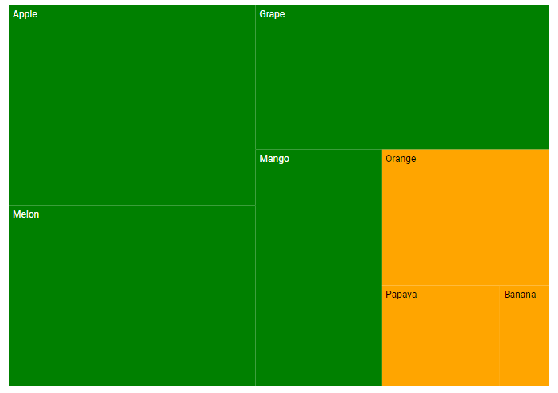
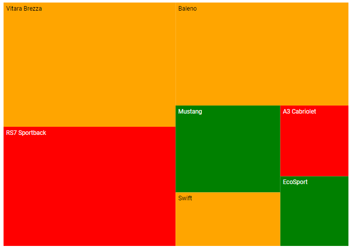
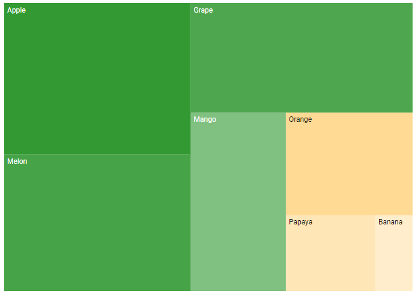
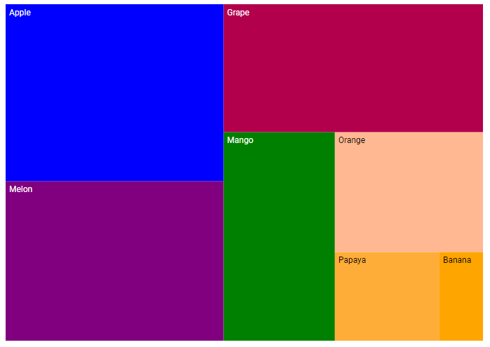
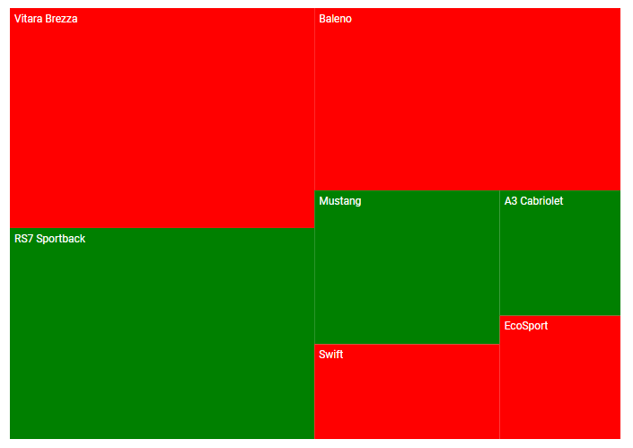
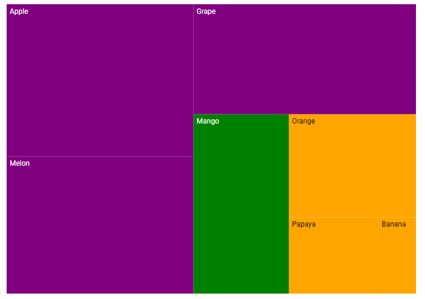
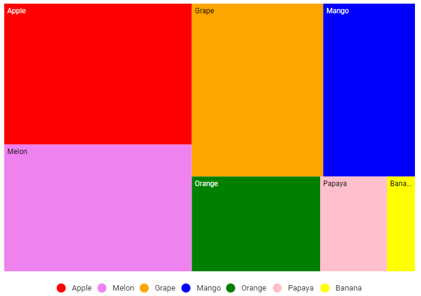

# Color Mapping in Blazor TreeMap Component

Color mapping customizes group and leaf item colors based on defined mapping types. The following options allow customizing group and leaf items in the TreeMap component.

## Range color mapping

Range color mapping applies colors to items based on numeric ranges of a specified value, defined by the [RangeColorValuePath](https://help.syncfusion.com/cr/blazor/Syncfusion.Blazor.TreeMap.SfTreeMap-1.html#Syncfusion_Blazor_TreeMap_SfTreeMap_1_RangeColorValuePath) property.

```cshtml
@using Syncfusion.Blazor.TreeMap

<SfTreeMap WeightValuePath="Count" TValue="Fruit" DataSource="Fruits" RangeColorValuePath="Count">
    <TreeMapLeafItemSettings LabelPath="FruitName">
        <TreeMapLeafColorMappings>
            <TreeMapLeafColorMapping StartRange="500" EndRange="3000" Color='new string[] { "Orange" }'></TreeMapLeafColorMapping>
            <TreeMapLeafColorMapping StartRange="3000" EndRange="5000" Color='new string[] { "Green" }'></TreeMapLeafColorMapping>
        </TreeMapLeafColorMappings>
    </TreeMapLeafItemSettings>
</SfTreeMap>

@code {
    public class Fruit
    {
        public string FruitName { get; set; }
        public double Count { get; set; }
    };

    public List<Fruit> Fruits = new List<Fruit> {
        new Fruit { FruitName = "Apple", Count = 5000 },
        new Fruit { FruitName = "Mango", Count = 3000 },
        new Fruit { FruitName = "Orange", Count = 2300 },
        new Fruit { FruitName = "Banana", Count = 500 },
        new Fruit { FruitName = "Grape", Count = 4300 },
        new Fruit { FruitName = "Papaya", Count = 1200 },
        new Fruit { FruitName = "Melon", Count = 4500 }
    };
}

```



## Equal color mapping

Equal color mapping fills items with colors by matching equal values from the data source, specified by the [EqualColorValuePath](https://help.syncfusion.com/cr/blazor/Syncfusion.Blazor.TreeMap.SfTreeMap-1.html#Syncfusion_Blazor_TreeMap_SfTreeMap_1_EqualColorValuePath) property.

```cshtml

@using Syncfusion.Blazor.TreeMap

<SfTreeMap WeightValuePath="Count" TValue="Car" DataSource="Cars" EqualColorValuePath="Brand">
    <TreeMapLeafItemSettings LabelPath="Name">
        <TreeMapLeafColorMappings>
            <TreeMapLeafColorMapping LeafValue="Ford" Color='new string[] { "green" }'></TreeMapLeafColorMapping>
            <TreeMapLeafColorMapping LeafValue="Audi" Color='new string[] { "red" }'></TreeMapLeafColorMapping>
            <TreeMapLeafColorMapping LeafValue="Maruti" Color='new string[] { "orange"}'></TreeMapLeafColorMapping>
        </TreeMapLeafColorMappings>
    </TreeMapLeafItemSettings>
</SfTreeMap>

@code {
    public class Car
    {
        public string Name { get; set; }
        public int Count { get; set; }
        public string Brand { get; set; }
    };
    public List<Car> Cars = new List<Car> {
        new Car { Name = "Mustang", Brand = "Ford", Count = 232 },
        new Car { Name = "EcoSport", Brand = "Ford", Count = 121 },
        new Car { Name = "Swift", Brand = "Maruti", Count = 143 },
        new Car { Name = "Baleno", Brand = "Maruti", Count = 454 },
        new Car { Name = "Vitara Brezza", Brand = "Maruti", Count = 545 },
        new Car { Name = "A3 Cabriolet", Brand = "Audi",Count = 123 },
        new Car { Name = "RS7 Sportback", Brand = "Audi", Count = 523 }
    };
}

```



## Desaturation color mapping

Desaturation color mapping applies colors to items based on [MinOpacity](https://help.syncfusion.com/cr/blazor/Syncfusion.Blazor.TreeMap.ColorMapping.html#Syncfusion_Blazor_TreeMap_ColorMapping_MinOpacity) and [MaxOpacity](https://help.syncfusion.com/cr/blazor/Syncfusion.Blazor.TreeMap.ColorMapping.html#Syncfusion_Blazor_TreeMap_ColorMapping_MaxOpacity) properties in [TreeMapLeafColorMapping](https://help.syncfusion.com/cr/blazor/Syncfusion.Blazor.TreeMap.TreeMapLeafColorMapping.html).

```cshtml

@using Syncfusion.Blazor.TreeMap

<SfTreeMap WeightValuePath="Count" TValue="Fruit" DataSource="Fruits" RangeColorValuePath="Count">
    <TreeMapLeafItemSettings LabelPath="FruitName">
        <TreeMapLeafColorMappings>
            <TreeMapLeafColorMapping StartRange="500" EndRange="3000" MinOpacity="0.2" MaxOpacity="0.5" Color='new string[] { "Orange"}'></TreeMapLeafColorMapping>
            <TreeMapLeafColorMapping StartRange="3000" EndRange="5000" MinOpacity="0.5" MaxOpacity="0.8" Color='new string[] { "Green"}'></TreeMapLeafColorMapping>
        </TreeMapLeafColorMappings>
    </TreeMapLeafItemSettings>
</SfTreeMap>

```

N> See the [range color mapping](#range-color-mapping) section for the **Fruits** data model and values.



## Desaturation with multiple colors

Multiple colors provide a gradient effect to TreeMap items based on [TreeMapLeafColorMapping](https://help.syncfusion.com/cr/blazor/Syncfusion.Blazor.TreeMap.TreeMapLeafColorMapping.html) ranges. Specify multiple colors in the [ColorMapping](https://help.syncfusion.com/cr/blazor/Syncfusion.Blazor.TreeMap.TreeMapLeafItemSettings.html#Syncfusion_Blazor_TreeMap_TreeMapLeafItemSettings_ColorMapping) property.

```cshtml

@using Syncfusion.Blazor.TreeMap

<SfTreeMap WeightValuePath="Count" TValue="Fruit" DataSource="Fruits" RangeColorValuePath="Count">
    <TreeMapLeafItemSettings LabelPath="FruitName">
        <TreeMapLeafColorMappings>
            <TreeMapLeafColorMapping StartRange="500" EndRange="3000" Color='new string[]{ "orange", "pink" }'></TreeMapLeafColorMapping>
            <TreeMapLeafColorMapping StartRange="3000" EndRange="5000" Color='new string[]{ "green", "red", "blue" }'></TreeMapLeafColorMapping>
        </TreeMapLeafColorMappings>
    </TreeMapLeafItemSettings>
</SfTreeMap>

```

N> See the [range color mapping](#range-color-mapping) section for the **Fruits** data model and values.



## Palette color mapping

Palette color mapping assigns colors to items from a predefined set of colors specified using the [Palette](https://help.syncfusion.com/cr/blazor/Syncfusion.Blazor.TreeMap.SfTreeMap-1.html#Syncfusion_Blazor_TreeMap_SfTreeMap_1_Palette) property.

```cshtml

@using Syncfusion.Blazor.TreeMap

<SfTreeMap WeightValuePath="Count" TValue="Car" DataSource="Cars" Palette='new string[] { "red", "green" }'>
    <TreeMapLeafItemSettings LabelPath="Name">
    </TreeMapLeafItemSettings>
</SfTreeMap>

```

N> See the [equal color mapping](#equal-color-mapping) section for the **Cars** data model and values.



## Color for items excluded from color mapping

Retrieve excluded ranges from the data source and apply a specific color to those items without specifying [StartRange](https://help.syncfusion.com/cr/blazor/Syncfusion.Blazor.TreeMap.ColorMapping.html#Syncfusion_Blazor_TreeMap_ColorMapping_StartRange) and [EndRange](https://help.syncfusion.com/cr/blazor/Syncfusion.Blazor.TreeMap.ColorMapping.html#Syncfusion_Blazor_TreeMap_ColorMapping_EndRange) properties.

```cshtml

@using Syncfusion.Blazor.TreeMap

<SfTreeMap WeightValuePath="Count" TValue="Fruit" DataSource="Fruits" RangeColorValuePath="Count">
    <TreeMapLeafItemSettings LabelPath="FruitName">
        <TreeMapLeafColorMappings>
            <TreeMapLeafColorMapping StartRange="500" EndRange="3000" Color='new string[] { "Orange" }'></TreeMapLeafColorMapping>
            <TreeMapLeafColorMapping StartRange="3000" EndRange="4000" Color='new string[]{ "Green"}'></TreeMapLeafColorMapping>
            <TreeMapLeafColorMapping Color='new string[]{ "purple"}'></TreeMapLeafColorMapping>
        </TreeMapLeafColorMappings>
    </TreeMapLeafItemSettings>
</SfTreeMap>

```

N> See the [range color mapping](#range-color-mapping) section for the **Fruits** data model and values.



## Bind the colors to items from the data source

```cshtml

@using Syncfusion.Blazor.TreeMap

<SfTreeMap WeightValuePath="Count" TValue="Fruit" DataSource="Fruits" RangeColorValuePath="Count" ColorValuePath="Color">
    <TreeMapLeafItemSettings LabelPath="Name"></TreeMapLeafItemSettings>
    <TreeMapLegendSettings Visible="true"></TreeMapLegendSettings>
</SfTreeMap>

@code {
    public class Fruit
    {
        public string Name { get; set; }
        public double Count { get; set; }
        public string Color { get; set; }
    };

    public List<Fruit> Fruits = new List<Fruit> {
        new Fruit { Name = "Apple", Count = 5000, Color = "red" },
        new Fruit { Name = "Mango", Count = 3000, Color = "blue" },
        new Fruit { Name = "Orange", Count = 2300, Color = "green" },
        new Fruit { Name = "Banana", Count = 500 , Color = "yellow"},
        new Fruit { Name = "Grape", Count = 4300 , Color = "orange"},
        new Fruit { Name = "Papaya",Count = 1200 , Color = "pink"},
        new Fruit { Name = "Melon", Count = 4500, Color = "violet" }
    };
}

```


