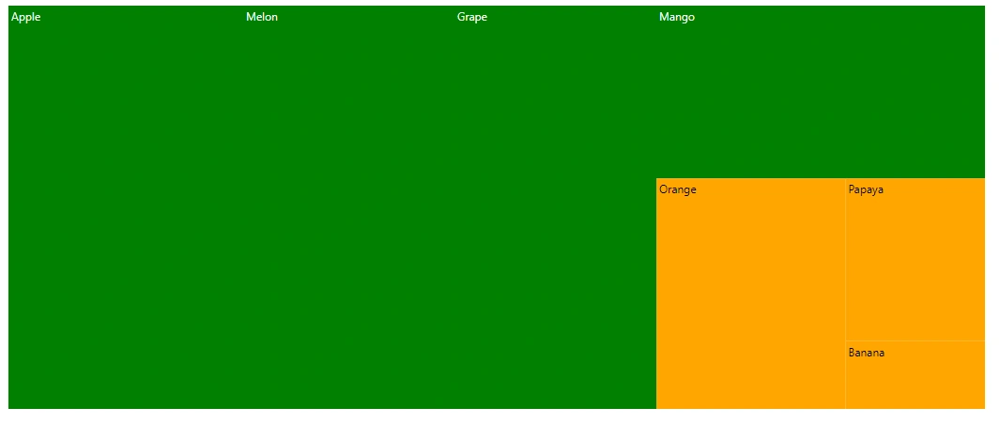
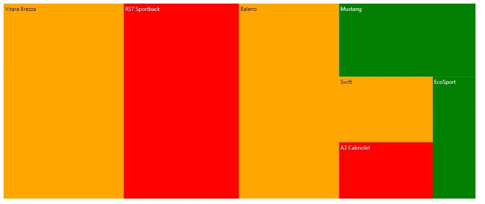
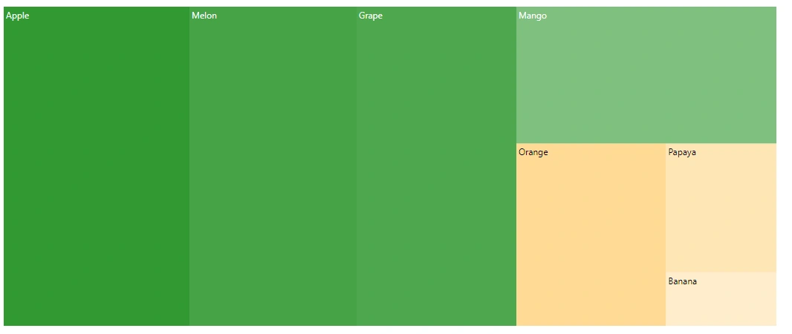
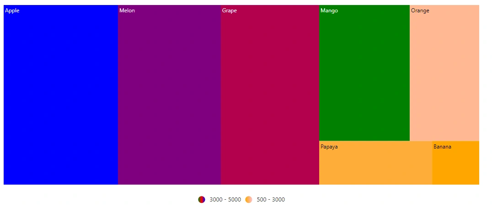
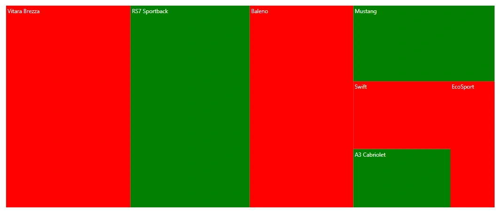
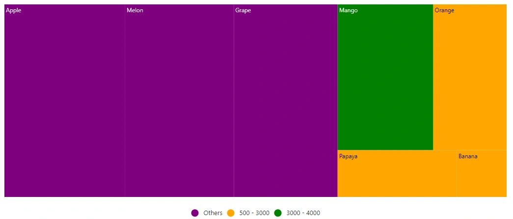
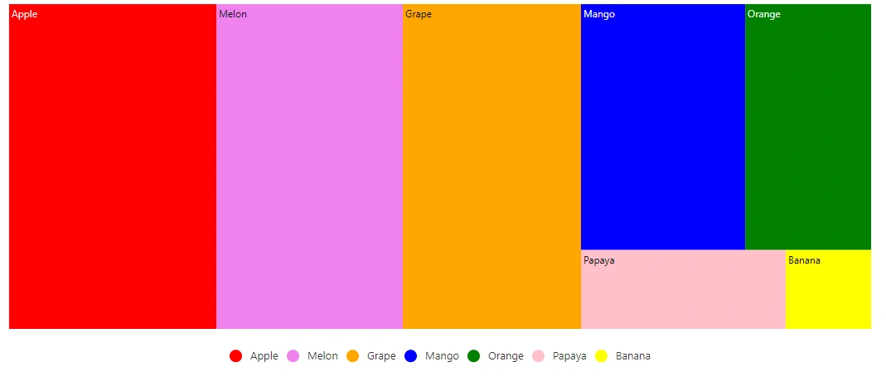

# Blazor TreeMap Color Mapping

Color mapping is used to customize the color for each group or item based on the specified mapping types. The following options are available to customize the group and leaf items in the TreeMap component.

## Range color mapping

Range color mapping applies colors to items whose underlying value falls within a defined range. Bind the field name from the data source used for range comparison to the [RangeColorValuePath](https://help.syncfusion.com/cr/blazor/Syncfusion.Blazor.TreeMap.SfTreeMap-1.html#Syncfusion_Blazor_TreeMap_SfTreeMap_1_RangeColorValuePath) property in [SfTreeMap](https://help.syncfusion.com/cr/blazor/Syncfusion.Blazor.TreeMap.SfTreeMap-1.html), and define each range and its color in the [TreeMapLeafColorMapping](https://help.syncfusion.com/cr/blazor/Syncfusion.Blazor.TreeMap.TreeMapLeafColorMapping.html) under `TreeMapLeafItemSettings`. An item whose value equals the `StartRange` of a band is treated as part of that band.

```cshtml
@using Syncfusion.Blazor.TreeMap

<SfTreeMap WeightValuePath="Count" TValue="Fruit" DataSource="Fruits" RangeColorValuePath="Count">
    <TreeMapLeafItemSettings LabelPath="FruitName">
        <TreeMapLeafColorMappings>
            <TreeMapLeafColorMapping StartRange="500" EndRange="3000" Color='new string[] { "Orange" }'></TreeMapLeafColorMapping>
            <TreeMapLeafColorMapping StartRange="3000" EndRange="5000" Color='new string[] { "Green" }'></TreeMapLeafColorMapping>
        </TreeMapLeafColorMappings>
    </TreeMapLeafItemSettings>
</SfTreeMap>

@code {
    public class Fruit
    {
        public string FruitName { get; set; }
        public double Count { get; set; }
    };
    public List<Fruit> Fruits = new List<Fruit> {
        new Fruit { FruitName="Apple", Count=5000 },
        new Fruit { FruitName="Mango", Count=3000 },
        new Fruit { FruitName="Orange", Count=2300 },
        new Fruit { FruitName="Banana", Count=500 },
        new Fruit { FruitName="Grape", Count=4300 },
        new Fruit { FruitName="Papaya", Count=1200 },
        new Fruit { FruitName="Melon", Count=4500 }
    };
}
```



## Equal color mapping

Equal color mapping is used to fill each item with colors by specifying an equal value present in the data source, that can be specified in the [EqualColorValuePath](https://help.syncfusion.com/cr/blazor/Syncfusion.Blazor.TreeMap.SfTreeMap-1.html#Syncfusion_Blazor_TreeMap_SfTreeMap_1_EqualColorValuePath) property.

```cshtml
@using Syncfusion.Blazor.TreeMap

<SfTreeMap WeightValuePath="Count" TValue="Car" DataSource="Cars" EqualColorValuePath="Brand">
    <TreeMapLeafItemSettings LabelPath="Name">
        <TreeMapLeafColorMappings>
            <TreeMapLeafColorMapping LeafValue="Ford" Color='new string[] { "green" }'></TreeMapLeafColorMapping>
            <TreeMapLeafColorMapping LeafValue="Audi" Color='new string[] { "red" }'></TreeMapLeafColorMapping>
            <TreeMapLeafColorMapping LeafValue="Maruti" Color='new string[] { "orange"}'></TreeMapLeafColorMapping>
        </TreeMapLeafColorMappings>
    </TreeMapLeafItemSettings>
</SfTreeMap>

@code {
    public class Car
    {
        public string Name { get; set; }
        public int Count { get; set; }
        public string Brand { get; set; }
    };
    public List<Car> Cars = new List<Car> {
        new Car { Name="Mustang", Brand="Ford", Count=232 },
        new Car { Name="EcoSport", Brand="Ford", Count=121 },
        new Car { Name="Swift", Brand="Maruti", Count=143 },
        new Car { Name="Baleno", Brand="Maruti", Count=454 },
        new Car { Name="Vitara Brezza", Brand="Maruti", Count=545 },
        new Car { Name="A3 Cabriolet", Brand="Audi",Count=123 },
        new Car { Name="RS7 Sportback", Brand="Audi", Count=523 }
    };
}
```



## Desaturation color mapping

Desaturation color mapping is used to apply colors to the items based on the [MinOpacity](https://help.syncfusion.com/cr/blazor/Syncfusion.Blazor.TreeMap.ColorMapping.html#Syncfusion_Blazor_TreeMap_ColorMapping_MinOpacity) and the [MaxOpacity](https://help.syncfusion.com/cr/blazor/Syncfusion.Blazor.TreeMap.ColorMapping.html#Syncfusion_Blazor_TreeMap_ColorMapping_MaxOpacity) properties in the [TreeMapLeafColorMapping](https://help.syncfusion.com/cr/blazor/Syncfusion.Blazor.TreeMap.TreeMapLeafColorMapping.html).

```cshtml
@using Syncfusion.Blazor.TreeMap

<SfTreeMap WeightValuePath="Count" TValue="Fruit" DataSource="Fruits" RangeColorValuePath="Count">
    <TreeMapLeafItemSettings LabelPath="FruitName">
        <TreeMapLeafColorMappings>
            <TreeMapLeafColorMapping StartRange="500" EndRange="3000" MinOpacity="0.2" MaxOpacity="0.5" Color='new string[] { "Orange"}'></TreeMapLeafColorMapping>
            <TreeMapLeafColorMapping StartRange="3000" EndRange="5000" MinOpacity="0.5" MaxOpacity="0.8" Color='new string[] { "Green"}'></TreeMapLeafColorMapping>
        </TreeMapLeafColorMappings>
    </TreeMapLeafItemSettings>
</SfTreeMap>
```

N> Refer to the [code block](#range-color-mapping) to know about the property value of the **Fruits**.



## Desaturation with multiple colors

Multiple colors are used to provide gradient effect to the TreeMap items based on the [TreeMapLeafColorMapping](https://help.syncfusion.com/cr/blazor/Syncfusion.Blazor.TreeMap.TreeMapLeafColorMapping.html) ranges and specify any number of colors in the [Color](https://help.syncfusion.com/cr/blazor/Syncfusion.Blazor.TreeMap.TreeMapLeafItemSettings.html#Syncfusion_Blazor_TreeMap_TreeMapLeafItemSettings_ColorMapping) property.

```cshtml
@using Syncfusion.Blazor.TreeMap

<SfTreeMap WeightValuePath="Count" TValue="Fruit" DataSource="Fruits" RangeColorValuePath="Count">
    <TreeMapLeafItemSettings LabelPath="FruitName">
        <TreeMapLeafColorMappings>
            <TreeMapLeafColorMapping StartRange="500" EndRange="3000" Color='new string[]{ "orange", "pink" }'></TreeMapLeafColorMapping>
            <TreeMapLeafColorMapping StartRange="3000" EndRange="5000" Color='new string[]{ "green", "red", "blue" }'></TreeMapLeafColorMapping>
        </TreeMapLeafColorMappings>
    </TreeMapLeafItemSettings>
</SfTreeMap>
```

N> Refer to the [code block](#range-color-mapping) to know about the property value of **Fruits**.



## Palette color mapping

Palette color mapping applies a predefined set of colors to the items cyclically. Assign the colors to the [Palette](https://help.syncfusion.com/cr/blazor/Syncfusion.Blazor.TreeMap.SfTreeMap-1.html#Syncfusion_Blazor_TreeMap_SfTreeMap_1_Palette) property in [SfTreeMap](https://help.syncfusion.com/cr/blazor/Syncfusion.Blazor.TreeMap.SfTreeMap-1.html).

```cshtml
@using Syncfusion.Blazor.TreeMap

<SfTreeMap WeightValuePath="Count" TValue="Car" DataSource="Cars" Palette='new string[] { "red", "green" }'>
    <TreeMapLeafItemSettings LabelPath="Name">
    </TreeMapLeafItemSettings>
</SfTreeMap>
```

N> Refer to the [code block](#equal-color-mapping) to know about the property value of **Cars**.



## Color for items excluded from color mapping

Get the excluded ranges from data source using the color mapping and apply the specific color to those items, without specifying the [StartRange](https://help.syncfusion.com/cr/blazor/Syncfusion.Blazor.TreeMap.ColorMapping.html#Syncfusion_Blazor_TreeMap_ColorMapping_StartRange) and the [EndRange](https://help.syncfusion.com/cr/blazor/Syncfusion.Blazor.TreeMap.ColorMapping.html#Syncfusion_Blazor_TreeMap_ColorMapping_EndRange) properties.

```cshtml
@using Syncfusion.Blazor.TreeMap

<SfTreeMap WeightValuePath="Count" TValue="Fruit" DataSource="Fruits" RangeColorValuePath="Count">
    <TreeMapLeafItemSettings LabelPath="FruitName">
        <TreeMapLeafColorMappings>
            <TreeMapLeafColorMapping StartRange="500" EndRange="3000" Color='new string[] { "Orange" }'></TreeMapLeafColorMapping>
            <TreeMapLeafColorMapping StartRange="3000" EndRange="4000" Color='new string[]{ "Green"}'></TreeMapLeafColorMapping>
            <TreeMapLeafColorMapping Color='new string[]{ "purple"}'></TreeMapLeafColorMapping>
        </TreeMapLeafColorMappings>
    </TreeMapLeafItemSettings>
</SfTreeMap>
```

N> Refer to the [code block](#range-color-mapping) to know about the property value of the **Fruits**.



## Bind the colors to items from the data source

Bind the color values directly from the data source field by assigning its name to the [ColorValuePath](https://help.syncfusion.com/cr/blazor/Syncfusion.Blazor.TreeMap.SfTreeMap-1.html#Syncfusion_Blazor_TreeMap_SfTreeMap_1_ColorValuePath) property in [SfTreeMap](https://help.syncfusion.com/cr/blazor/Syncfusion.Blazor.TreeMap.SfTreeMap-1.html). `RangeColorValuePath` or `EqualColorValuePath` are not required when `ColorValuePath` is used.

```cshtml
@using Syncfusion.Blazor.TreeMap

<SfTreeMap WeightValuePath="Count" TValue="Fruit" DataSource="Fruits" RangeColorValuePath="Count" ColorValuePath="Color">
    <TreeMapLeafItemSettings LabelPath="Name"></TreeMapLeafItemSettings>
    <TreeMapLegendSettings Visible="true"></TreeMapLegendSettings>
</SfTreeMap>

@code {
    public class Fruit
    {
        public string Name { get; set; }
        public double Count { get; set; }
        public string Color { get; set; }
    };
    public List<Fruit> Fruits = new List<Fruit> {
        new Fruit { Name="Apple", Count=5000, Color = "red" },
        new Fruit { Name="Mango", Count=3000, Color="blue" },
        new Fruit { Name="Orange", Count=2300, Color="green" },
        new Fruit { Name="Banana", Count=500 , Color="yellow"},
        new Fruit { Name="Grape", Count=4300 , Color="orange"},
        new Fruit { Name="Papaya",Count=1200 , Color="pink"},
        new Fruit { Name="Melon", Count=4500, Color="violet" }
    };
}
```



## See also

* [Blazor TreeMap Legend](./legend.md)
* [Blazor TreeMap Tooltip](./tooltip.md)
* [Getting Started with Blazor TreeMap](./getting-started.md)
