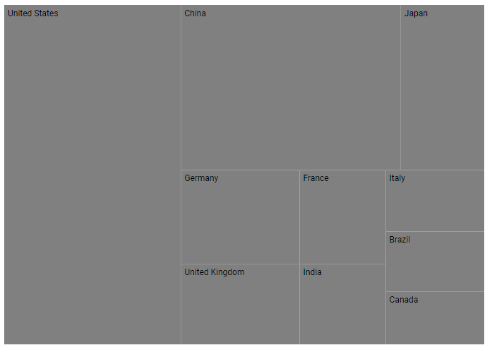
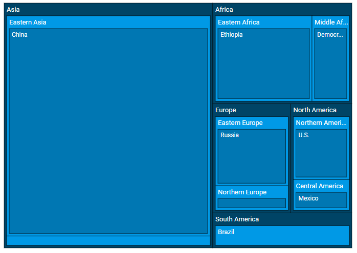
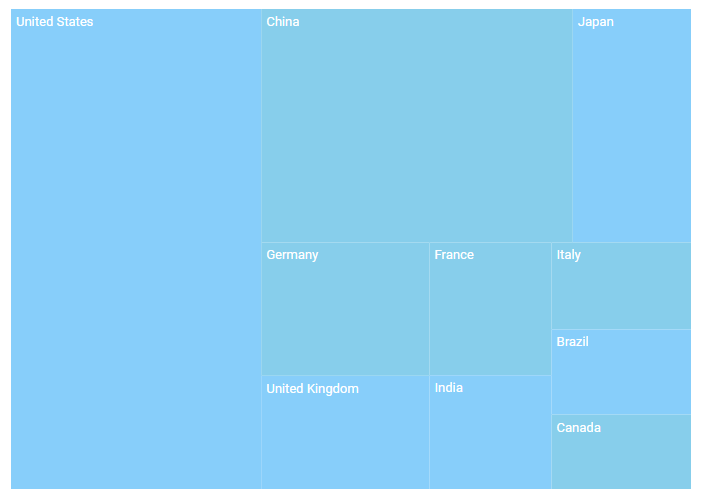
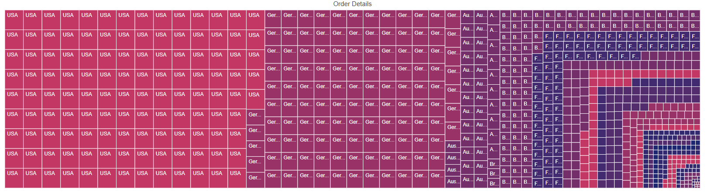
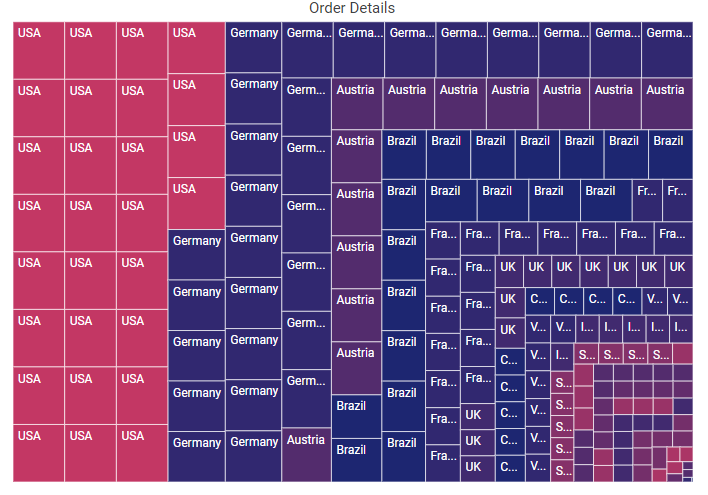
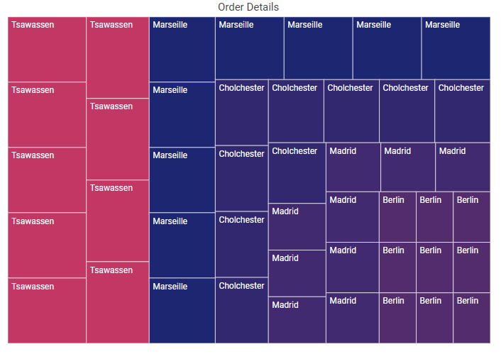

# Data Binding in Blazor TreeMap Component

## Populate data

The [DataSource](https://help.syncfusion.com/cr/blazor/Syncfusion.Blazor.TreeMap.SfTreeMap-1.html#Syncfusion_Blazor_TreeMap_SfTreeMap_1_DataSource) property accepts a collection of values. A list of objects can be provided as input. Data can be supplied as either a flat or a hierarchical collection to the [DataSource](https://help.syncfusion.com/cr/blazor/Syncfusion.Blazor.TreeMap.SfTreeMap-1.html#Syncfusion_Blazor_TreeMap_SfTreeMap_1_DataSource) property.

### Flat data

The following example shows how to bind a flat collection as the data source to the TreeMap component.

```cshtml

@using Syncfusion.Blazor.TreeMap

<SfTreeMap WeightValuePath="GDP" TValue="GDPReport" DataSource="GrowthReports">
    <TreeMapLeafItemSettings LabelPath="Country">
    </TreeMapLeafItemSettings>
</SfTreeMap>

@code {
    public class GDPReport
    {
        public string Country { get; set; }
        public double GDP { get; set; }
        public double Percentage { get; set; }
        public double Rank { get; set; }
    };

    public List<GDPReport> GrowthReports = new List<GDPReport> {
        new GDPReport { Country = "United States", GDP = 17946, Percentage = 11.08, Rank = 1 },
        new GDPReport { Country = "China", GDP = 10866, Percentage = 28.42, Rank = 2 },
        new GDPReport { Country = "Japan", GDP = 4123, Percentage = -30.78, Rank = 3 },
        new GDPReport { Country = "Germany", GDP = 3355, Percentage = -5.19, Rank = 4 },
        new GDPReport { Country = "United Kingdom", GDP = 2848, Percentage = 8.28, Rank = 5 },
        new GDPReport { Country = "France", GDP = 2421, Percentage = -9.69, Rank = 6 },
        new GDPReport { Country = "India", GDP = 2073, Percentage = 13.65, Rank = 7 },
        new GDPReport { Country = "Italy", GDP = 1814, Percentage = -12.45, Rank = 8 },
        new GDPReport { Country = "Brazil", GDP = 1774, Percentage = -27.88, Rank = 9 },
        new GDPReport { Country = "Canada", GDP = 1550, Percentage = -15.02, Rank = 10 }
    };
}

```



### Hierarchical data

The following example shows how to bind a hierarchical collection as the data source to the TreeMap component.

```cshtml

@using Syncfusion.Blazor.TreeMap

<SfTreeMap WeightValuePath="Population" DataSource="PopulationReport">
    <TreeMapLeafItemSettings LabelPath="Name" Fill="#0077b3">
        <TreeMapLeafBorder Width="0.5" Color="black"></TreeMapLeafBorder>
    </TreeMapLeafItemSettings>
    <TreeMapLevels>
        <TreeMapLevel GroupPath="Continent" Fill="#004466">
            <TreeMapLevelBorder Width="0.5" Color="black"></TreeMapLevelBorder>
        </TreeMapLevel>
        <TreeMapLevel GroupPath="States" Fill="#0099e6">
            <TreeMapLevelBorder Width="0.5" Color="black"></TreeMapLevelBorder>
        </TreeMapLevel>
    </TreeMapLevels>
</SfTreeMap>

@code {
    public List<object> PopulationReport { get; set; } = new List<object>
    {
        new {
            Continent =  new List<object> { new {
            Name= "Africa",
            Population= 1216130000,
            States= new List<object> { new {
                Name= "Eastern Africa",
                Population= 410637987,
                Region= new List<object> { new {
                    Name= "Ethiopia",
                    Population= 107534882
                    }}
                },
            new {
                Name= "Middle Africa",
                Population= 158562976,
                Region= new List<object>{ new {
                        Name= "Democratic, Republic of the Congo",
                        Population= 84004989
                    }}
                    }
                }
            }}
        },
        new {
            Continent= new List<object> { new {
                Name= "Asia",
                Population= 4436224000,
                States= new List<object> { new {
                        Name= "Central Asia",
                        Population= 69787760,
                        Region= new List<object> { new {
                            Name= "Uzbekistan",
                            Population= 32364996
                        }}
                    },
                    new {
                        Name= "Eastern Asia",
                        Population= 1641908531,
                        Region= new List<object> { new {
                            Name= "China",
                            Population= 1415045928
                        }}
                    }
                }
            }}
        },
        new {
            Continent= new List<object> { new {
                Name= "North America",
                Population= 579024000,
                States= new List<object> { new {
                        Name= "Central America",
                        Population= 174988756,
                        Region= new List<object> { new {
                            Name= "Mexico",
                            Population= 130759074
                        }}
                    },
                    new {
                        Name= "Northern America",
                        Population= 358593810,
                        Region= new List<object> { new {
                            Name= "U.S.",
                            Population= 3267667480
                        }}
                    }
                }
            }}
        },
        new {
            Continent= new List<object> { new {
                Name= "South America",
                Population= 422535000,
                States= new List<object> { new {
                    Name= "Brazil",
                    Population= 204519000
                }}
            }}
        },
        new {
            Continent= new List<object> { new {
                Name= "Europe",
                Population= 738849000,
                States= new List<object> { new {
                        Name= "Eastern Europe",
                        Population= 291953328,
                        Region= new List<object> { new {
                            Name= "Russia",
                            Population= 143964709
                        }}
                    },
                    new {
                        Name= "Northern Europe",
                        Population= 103642971,
                        Region= new List<object> { new {
                            Name= "United Kingdom",
                            Population= 66573504
                        }}
                    }
                }
            }}
        }
    };
}

```



## Local data

### Fetching data from the collection

The following example shows how to bind an `IEnumerable` object to the TreeMap component as a data source.

```cshtml

@using Syncfusion.Blazor.TreeMap

<SfTreeMap DataSource="GrowthReports" TValue="GDPReport" Palette="@Palette" WeightValuePath="GDP">
    <TreeMapLeafItemSettings LabelPath="CountryName">
        <TreeMapLeafLabelStyle Color="White"></TreeMapLeafLabelStyle>
    </TreeMapLeafItemSettings>
</SfTreeMap>

@code{
    public class GDPReport
    {
        public string CountryName { get; set; }
        public double GDP { get; set; }
        public double Percentage { get; set; }
        public int Rank { get; set; }
    };

    public string[] Palette = new string[] { "#87CEFA", "#87CEEB" };

    public List<GDPReport> GrowthReports = new List<GDPReport> {
        new GDPReport { CountryName = "United States", GDP = 17946, Percentage = 11.08, Rank = 1 },
        new GDPReport { CountryName = "China", GDP = 10866, Percentage = 28.42, Rank = 2 },
        new GDPReport { CountryName = "Japan", GDP = 4123, Percentage = -30.78, Rank = 3 },
        new GDPReport { CountryName = "Germany", GDP = 3355, Percentage = -5.19, Rank = 4 },
        new GDPReport { CountryName = "United Kingdom", GDP = 2848, Percentage = 8.28, Rank = 5 },
        new GDPReport { CountryName = "France", GDP = 2421, Percentage = -9.69, Rank = 6 },
        new GDPReport { CountryName = "India", GDP = 2073, Percentage = 13.65, Rank = 7 },
        new GDPReport { CountryName = "Italy", GDP = 1814, Percentage = -12.45, Rank = 8 },
        new GDPReport { CountryName = "Brazil", GDP = 1774, Percentage = -27.88, Rank = 9 },
        new GDPReport { CountryName = "Canada", GDP = 1550, Percentage = -15.02, Rank = 10 }
    };
}

```



### Fetching data from the JSON file

Read the JSON file, convert it to a C# object, and assign it to the [DataSource](https://help.syncfusion.com/cr/blazor/Syncfusion.Blazor.TreeMap.SfTreeMap-1.html#Syncfusion_Blazor_TreeMap_SfTreeMap_1_DataSource) property of the TreeMap component.

The `Http.GetFromJsonAsync` method is used in the `OnInitializedAsync` lifecycle method to load the JSON file data.

```cshtml

@using Syncfusion.Blazor.TreeMap
@inject NavigationManager Navigation
@inject HttpClient Http;

@if (GrowthReports == null)
{
    <p><em>Loading TreeMap component...</em></p>
}
else
{
    <SfTreeMap WeightValuePath="GDP" TValue="GDPReport" DataSource="GrowthReports">
        <TreeMapLeafItemSettings LabelPath="Country">
        </TreeMapLeafItemSettings>
    </SfTreeMap>
}

@code {
    public class GDPReport
    {
        public string Country { get; set; }
        public int GDP { get; set; }
        public double Percentage { get; set; }
        public int Rank { get; set; }
    };

    public List<GDPReport> GrowthReports { get; set; }

    protected async override Task OnInitializedAsync()
    {
         GrowthReports = await Http.GetFromJsonAsync<List<GDPReport>>(Navigation.ToAbsoluteUri("sample-data/product-growth.json"));
    }
}

```


N> See the data values for [product_growth](https://www.syncfusion.com/downloads/support/directtrac/general/ze/product-growth-360857189).

## Remote data

To interact with a remote data source, provide the endpoint [Url](https://help.syncfusion.com/cr/blazor/Syncfusion.Blazor.DataManager.html#Syncfusion_Blazor_DataManager_Url) within the [SfDataManager](https://help.syncfusion.com/cr/blazor/Syncfusion.Blazor.DataManager.html) class along with an appropriate [Adaptor](https://blazor.syncfusion.com/documentation/data/adaptors). By default, the [SfDataManager](https://help.syncfusion.com/cr/blazor/Syncfusion.Blazor.DataManager.html) uses [ODataAdaptor](https://blazor.syncfusion.com/documentation/data/adaptors#odata-adaptor) for remote data binding.

N> When using [SfDataManager](https://help.syncfusion.com/cr/blazor/Syncfusion.Blazor.DataManager.html) for data binding, the **TValue** must be provided explicitly to the TreeMap component.

### Binding with OData services

[OData](https://blazor.syncfusion.com/documentation/data/adaptors#odata-adaptor) is a standardized protocol for creating and consuming data. Data can be retrieved from an OData service using the [SfDataManager](https://help.syncfusion.com/cr/blazor/Syncfusion.Blazor.DataManager.html).

```cshtml

@using Syncfusion.Blazor.TreeMap
@using Syncfusion.Blazor.Data

<SfTreeMap TValue="OrderDetails" WeightValuePath="Freight" Palette="@Palette">
    <SfDataManager Url="https://js.syncfusion.com/ejServices/Wcf/Northwind.svc/Orders" Adaptor="Syncfusion.Blazor.Adaptors.ODataAdaptor">
    </SfDataManager>
    <TreeMapTitleSettings Text="Order Details">
    </TreeMapTitleSettings>
    <TreeMapLeafItemSettings LabelPath="ShipCountry">
        <TreeMapLeafBorder Color="white" Width="0.5">
        </TreeMapLeafBorder>
    </TreeMapLeafItemSettings>
    <TreeMapTooltipSettings Visible="true">
    </TreeMapTooltipSettings>
</SfTreeMap>

@code {
    public string[] Palette = new string[] { "#C33764", "#AB3566", "#993367", "#853169", "#742F6A", "#632D6C", "#532C6D", "#412A6F", "#312870", "#1D2671" };

    public class OrderDetails
    {
        public int OrderID { get; set; }
        public string OrderDate { get; set; }
        public string CustomerID { get; set; }
        public string ShipCountry { get; set; }
        public double Freight { get; set; }
    }
}

```



### Binding with OData V4 services

The [OData V4](https://blazor.syncfusion.com/documentation/data/adaptors#odatav4-adaptor) protocol is an improved version of OData, and the [SfDataManager](https://help.syncfusion.com/cr/blazor/Syncfusion.Blazor.DataManager.html) can be used to retrieve and consume [OData V4](https://blazor.syncfusion.com/documentation/data/adaptors#odatav4-adaptor) services.

N> For details on OData V4 services, refer to the [OData V4 adaptor](https://blazor.syncfusion.com/documentation/data/adaptors#odatav4-adaptor) documentation.

```cshtml

@using Syncfusion.Blazor.TreeMap
@using Syncfusion.Blazor.Data

<SfTreeMap TValue="OrderDetails" WeightValuePath="Freight" Palette="@Palette">
    <SfDataManager Url="https://services.odata.org/V4/Northwind/Northwind.svc/Orders/" Adaptor="Syncfusion.Blazor.Adaptors.ODataV4Adaptor"></SfDataManager>
    <TreeMapTitleSettings Text="Order Details">
    </TreeMapTitleSettings>
    <TreeMapLeafItemSettings LabelPath="ShipCountry">
        <TreeMapLeafBorder Color="white" Width="0.5">
        </TreeMapLeafBorder>
    </TreeMapLeafItemSettings>
    <TreeMapTooltipSettings Visible="true"></TreeMapTooltipSettings>
</SfTreeMap>

@code {
    public string[] Palette = new string[] { "#C33764", "#AB3566", "#993367", "#853169", "#742F6A", "#632D6C", "#532C6D", "#412A6F", "#312870", "#1D2671" };

    public class OrderDetails
    {
        public int OrderID { get; set; }
        public string OrderDate { get; set; }
        public string CustomerID { get; set; }
        public string ShipCountry { get; set; }
        public double Freight { get; set; }
    }
}

```



### Web API

Use [WebApiAdaptor](https://blazor.syncfusion.com/documentation/data/adaptors/?no-cache=1#web-api-adaptor) to bind the TreeMap to an ASP.NET Web API endpoint.

```cshtml

@using Syncfusion.Blazor.TreeMap
@using Syncfusion.Blazor.Data

<SfTreeMap TValue="OrderDetails" WeightValuePath="Freight" Palette="@Palette">
    <SfDataManager Url="https://ej2services.syncfusion.com/production/web-services/api/Orders" Adaptor="Syncfusion.Blazor.Adaptors.WebApiAdaptor">
    </SfDataManager>
    <TreeMapTitleSettings Text="Order Details">
    </TreeMapTitleSettings>
    <TreeMapLeafItemSettings LabelPath="ShipCity">
        <TreeMapLeafBorder Color="white" Width="0.5">
        </TreeMapLeafBorder>
    </TreeMapLeafItemSettings>
    <TreeMapTooltipSettings Visible="true">
    </TreeMapTooltipSettings>
</SfTreeMap>

@code {
    public string[] Palette = new string[] { "#C33764", "#AB3566", "#993367", "#853169", "#742F6A", "#632D6C", "#532C6D", "#412A6F", "#312870", "#1D2671" };

    public class OrderDetails
    {
        public int OrderID { get; set; }
        public string OrderDate { get; set; }
        public string CustomerID { get; set; }
        public string ShipCity { get; set; }
        public double Freight { get; set; }
    }
}

```



## Entity Framework

Entity Framework is an object-relational mapper (ORM) for .NET. This section explains how to consume data from a **Microsoft SQL Server** database and bind it to the TreeMap component.

### Create DBContext class

Create a DbContext class named **OrderContext** to establish a connection to a Microsoft SQL Server database.

```csharp

using Microsoft.EntityFrameworkCore;
using System;
using System.Collections.Generic;
using System.Linq;
using System.Threading.Tasks;
using EFTreeMap.Data;

namespace EFTreeMap.Data
{
    public class OrderContext : DbContext
    {
        public virtual DbSet<Order> Orders { get; set; }

        protected override void OnConfiguring(DbContextOptionsBuilder optionsBuilder)
        {
            if (!optionsBuilder.IsConfigured)
            {
                // Configures the context to connect to a Microsoft SQL Serve database
                optionsBuilder.UseSqlServer(@"Data Source=(LocalDB)\MSSQLLocalDB;AttachDbFilename='D:\blazor\EFTreeMap\App_Data\NORTHWND.MDF';Integrated Security=True;Connect Timeout=30");
            }
        }
    }

    public class Order
    {
        [Key]
        public int? OrderID { get; set; }
        [Required]
        public string CustomerID { get; set; }
        [Required]
        public int EmployeeID { get; set; }
    }
}

```

### Create data access layer to perform data operation

Create a class named **OrderDataAccessLayer** that acts as a data access layer to retrieve records from the database table.

```csharp

using Microsoft.EntityFrameworkCore;
using System;
using System.Collections.Generic;
using System.Linq;
using System.Threading.Tasks;
using EFTreeMap.Data;

namespace EFTreeMap.Data
{
    public class OrderDataAccessLayer
    {
        OrderContext db = new OrderContext();
        //To Get all Orders details
        public DbSet<Order> GetAllOrders()
        {
            try
            {
                return db.Orders;
            }
            catch
            {
                throw;
            }
        }
    }
}

```

### Creating Web API Controller

Create a Web API controller that allows the TreeMap to consume data directly from Entity Framework.

```csharp

using System;
using System.Collections;
using System.Collections.Generic;
using System.Linq;
using System.Threading.Tasks;
using Microsoft.AspNetCore.Http;
using Microsoft.AspNetCore.Mvc;
using Microsoft.Extensions.Primitives;
using EFTreeMap.Data;

namespace EFTreeMap.Controller
{
    [Route("api/[controller]")]
    [ApiController]
    public class DefaultController : ControllerBase
    {
        OrderDataAccessLayer db = new OrderDataAccessLayer();
    
        [HttpGet]
        public object Get()
        {
            IQueryable<Order> data = db.GetAllOrders().AsQueryable();
            var count = data.Count();
            var queryString = Request.Query;
            if (queryString.Keys.Contains("$inlinecount"))
            {
                StringValues Skip;
                StringValues Take;
                int skip = (queryString.TryGetValue("$skip", out Skip)) ? Convert.ToInt32(Skip[0]) : 0;
                int top = (queryString.TryGetValue("$top", out Take)) ? Convert.ToInt32(Take[0]) : data.Count();
                return new { Items = data.Skip(skip).Take(top), Count = count };
            }
            else
            {
                return data;
            }
        }
    }
}

```

### Add Web API Controller services in Startup.cs

Open the **Startup.cs** file and add the services and endpoints required for the Web API controller as follows.

```csharp

using Newtonsoft.Json.Serialization;

namespace BlazorApplication
{
    public class Startup
    {
        ....
        ....
        public void ConfigureServices(IServiceCollection services)
        {
            ....
            ....
            services.AddSingleton<OrderDataAccessLayer>();
            // Adds services for controllers to the specified Microsoft.Extensions.DependencyInjection.IServiceCollection.
            services.AddControllers().AddNewtonsoftJson(options =>
            {
                options.SerializerSettings.ContractResolver = new DefaultContractResolver();
            });
        }

        public void Configure(IApplicationBuilder app, IWebHostEnvironment env)
        {
            ....
            ....
            app.UseEndpoints(endpoints =>
            {
                // Adds endpoints for controller actions to the Microsoft.AspNetCore.Routing.IEndpointRouteBuilder
                endpoints.MapDefaultControllerRoute();
                .....
                .....
            });
        }
    }
}

```

### Configure treemap component

Configure the TreeMap to bind data by using either the [DataSource](https://help.syncfusion.com/cr/blazor/Syncfusion.Blazor.TreeMap.SfTreeMap-1.html#Syncfusion_Blazor_TreeMap_SfTreeMap_1_DataSource) property or [SfDataManager](https://help.syncfusion.com/cr/blazor/Syncfusion.Blazor.DataManager.html).

For instance, bind data directly from the **OrderDataAccessLayer** class and assign it to the [DataSource](https://help.syncfusion.com/cr/blazor/Syncfusion.Blazor.TreeMap.SfTreeMap-1.html#Syncfusion_Blazor_TreeMap_SfTreeMap_1_DataSource) property.

```csharp

@inject OrderDataAccessLayer OrderData

@using EFTreeMap.Data
@using Syncfusion.Blazor.TreeMap

<SfTreeMap TValue="Order" WeightValuePath="OrderID" Palette="@Palette" DataSource="@OrderData.GetAllOrders()">
        <TreeMapTitleSettings Text="Order Details">
        </TreeMapTitleSettings>
        <TreeMapLeafItemSettings LabelPath="CustomerID">
            <TreeMapLeafBorder Color="white" Width="0.5">
            </TreeMapLeafBorder>
        </TreeMapLeafItemSettings>
        <TreeMapTooltipSettings Visible="true"></TreeMapTooltipSettings>
</SfTreeMap>

@code {
    public string[] Palette = new string[] { "#C33764", "#AB3566", "#993367", "#853169", "#742F6A", "#632D6C", "#532C6D", "#412A6F", "#312870", "#1D2671" };
}

```

On the other hand, to configure the TreeMap by using a Web API, provide the endpoint URL in the [SfDataManager](https://help.syncfusion.com/cr/blazor/Syncfusion.Blazor.DataManager.html) along with an [Adaptor](https://blazor.syncfusion.com/documentation/data/adaptors). Here, [WebApiAdaptor](https://blazor.syncfusion.com/documentation/data/adaptors?no-cache=1#web-api-adaptor) is used to interact with the Web API to consume data from Entity Framework.

```cshtml
@using Syncfusion.Blazor.TreeMap
@using Syncfusion.Blazor.Data

<SfTreeMap TValue="Order" WeightValuePath="OrderID" Palette="@Palette">
    <SfDataManager Url="api/Default" Adaptor="Syncfusion.Blazor.Adaptors.WebApiAdaptor">
    </SfDataManager>
    <TreeMapTitleSettings Text="Order Details">
    </TreeMapTitleSettings>
    <TreeMapLeafItemSettings LabelPath="CustomerID">
        <TreeMapLeafBorder Color="white" Width="0.5">
        </TreeMapLeafBorder>
    </TreeMapLeafItemSettings>
    <TreeMapTooltipSettings Visible="true"></TreeMapTooltipSettings>
</SfTreeMap>

@code {
    public string[] Palette = new string[] { "#C33764", "#AB3566", "#993367", "#853169", "#742F6A", "#632D6C", "#532C6D", "#412A6F", "#312870", "#1D2671" };
}

```