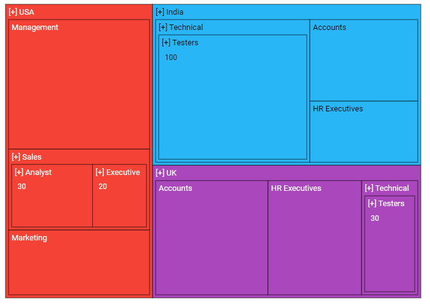
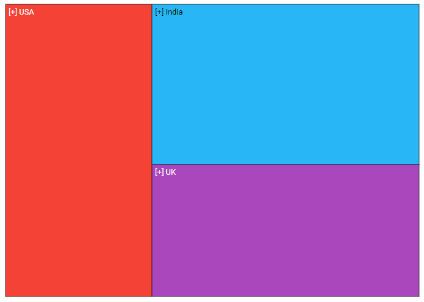
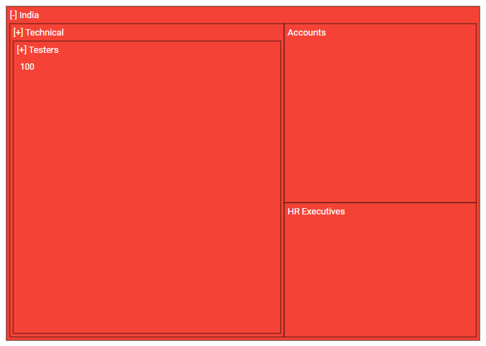

# Drill-down in Blazor TreeMap Component

The [Blazor TreeMap](https://www.syncfusion.com/blazor-components/blazor-treemap) component supports drill-down to explore hierarchical data by selecting a node. Selecting an item navigates to its child level, and selecting again on the breadcrumb or node returns to the previous level.

## Perform drill-down

TreeMap items can be drilled by setting the [EnableDrillDown](https://help.syncfusion.com/cr/blazor/Syncfusion.Blazor.TreeMap.SfTreeMap-1.html#Syncfusion_Blazor_TreeMap_SfTreeMap_1_EnableDrillDown) property to **true**.

```cshtml

@using Syncfusion.Blazor.TreeMap

<SfTreeMap WeightValuePath="EmployeeCount" TValue="Employee" DataSource="Employees" EnableDrillDown=true Palette='new string[] {"#f44336", "#29b6f6", "#ab47bc", "#ffc107", "#5c6bc0", "#009688"}'>
    <TreeMapLevels>
        <TreeMapLevel GroupPath="Country">
            <TreeMapLevelBorder Color="black" Width="0.5">
            </TreeMapLevelBorder>
        </TreeMapLevel>
        <TreeMapLevel GroupPath="JobDescription">
            <TreeMapLevelBorder Color="black" Width="0.5">
            </TreeMapLevelBorder>
        </TreeMapLevel>
        <TreeMapLevel GroupPath="JobGroup">
            <TreeMapLevelBorder Color="black" Width="0.5">
            </TreeMapLevelBorder>
        </TreeMapLevel>
    </TreeMapLevels>
</SfTreeMap>

@code {
    public class Employee
    {
        public string Country { get; set; }
        public string JobDescription { get; set; }
        public string JobGroup { get; set; }
        public int EmployeeCount { get; set; }
    };

    public List<Employee> Employees = new List<Employee> {
        new Employee { Country = "USA", JobDescription = "Sales", JobGroup = "Executive", EmployeeCount = 20 },
        new Employee { Country = "USA", JobDescription = "Sales", JobGroup = "Analyst", EmployeeCount = 30 },
        new Employee { Country = "USA", JobDescription = "Marketing", EmployeeCount = 40 },
        new Employee { Country = "USA", JobDescription = "Management", EmployeeCount = 80 },
        new Employee { Country = "India", JobDescription = "Technical", JobGroup = "Testers", EmployeeCount = 100 },
        new Employee { Country = "India", JobDescription = "HR Executives", EmployeeCount = 30 },
        new Employee { Country = "India", JobDescription = "Accounts", EmployeeCount = 40 },
        new Employee { Country = "UK", JobDescription = "Technical", JobGroup = "Testers", EmployeeCount = 30 },
        new Employee { Country = "UK", JobDescription = "HR Executives", EmployeeCount = 50 },
        new Employee { Country = "UK", JobDescription = "Accounts", EmployeeCount = 60 }
    };
}

```



## On-demand data loading

During standard drill-down, all child items are available at initial render. With on-demand data loading, child nodes are created only when drilling into a parent. Enable this behavior by setting the [DrillDownView](https://help.syncfusion.com/cr/blazor/Syncfusion.Blazor.TreeMap.SfTreeMap-1.html#Syncfusion_Blazor_TreeMap_SfTreeMap_1_DrillDownView) property to **true**.

```cshtml

@using Syncfusion.Blazor.TreeMap

<SfTreeMap WeightValuePath="EmployeeCount" TValue="Employee" DataSource="Employees" EnableDrillDown=true DrillDownView ="true" Palette='new string[] {"#f44336", "#29b6f6", "#ab47bc", "#ffc107", "#5c6bc0", "#009688"}'>
    <TreeMapLevels>
        <TreeMapLevel GroupPath="Country">
            <TreeMapLevelBorder Color="black" Width="0.5">
            </TreeMapLevelBorder>
        </TreeMapLevel>
        <TreeMapLevel GroupPath="JobDescription">
            <TreeMapLevelBorder Color="black" Width="0.5">
            </TreeMapLevelBorder>
        </TreeMapLevel>
        <TreeMapLevel GroupPath="JobGroup">
            <TreeMapLevelBorder Color="black" Width="0.5">
            </TreeMapLevelBorder>
        </TreeMapLevel>
    </TreeMapLevels>
</SfTreeMap>

```

N> Refer to the **Employees** data source defined in the [Perform drill-down](#perform-drill-down) section.



## Breadcrumb support

Breadcrumb navigation indicates the path from the root to the current level and supports drilling back to any parent level. Enable it by setting [EnableBreadcrumb](https://help.syncfusion.com/cr/blazor/Syncfusion.Blazor.TreeMap.SfTreeMap-1.html#Syncfusion_Blazor_TreeMap_SfTreeMap_1_EnableBreadcrumb) to **true**. Customize the separator using [BreadcrumbConnector](https://help.syncfusion.com/cr/blazor/Syncfusion.Blazor.TreeMap.SfTreeMap-1.html#Syncfusion_Blazor_TreeMap_SfTreeMap_1_BreadcrumbConnector). The default connector is a hyphen (-).

```cshtml

@using Syncfusion.Blazor.TreeMap

<SfTreeMap WeightValuePath="EmployeeCount" TValue="Employee" DataSource="Employees" EnableDrillDown=true EnableBreadcrumb="true" BreadcrumbConnector=" -> " Palette='new string[] {"#f44336", "#29b6f6", "#ab47bc", "#ffc107", "#5c6bc0", "#009688"}'>
    <TreeMapLevels>
        <TreeMapLevel GroupPath="Country">
            <TreeMapLevelBorder Color="black" Width="0.5">
            </TreeMapLevelBorder>
        </TreeMapLevel>
        <TreeMapLevel GroupPath="JobDescription">
            <TreeMapLevelBorder Color="black" Width="0.5">
            </TreeMapLevelBorder>
        </TreeMapLevel>
        <TreeMapLevel GroupPath="JobGroup">
            <TreeMapLevelBorder Color="black" Width="0.5">
            </TreeMapLevelBorder>
        </TreeMapLevel>
    </TreeMapLevels>
</SfTreeMap>

```

N> Refer to the **Employees** data source defined in the [Perform drill-down](#perform-drill-down) section.


## Initial drill-down

Initial drill-down navigates to a specified item and level during the first render. Configure the item index using [GroupIndex](https://help.syncfusion.com/cr/blazor/Syncfusion.Blazor.TreeMap.TreeMapInitialDrillSettings.html#Syncfusion_Blazor_TreeMap_TreeMapInitialDrillSettings_GroupIndex) and the level name using [GroupName](https://help.syncfusion.com/cr/blazor/Syncfusion.Blazor.TreeMap.TreeMapInitialDrillSettings.html#Syncfusion_Blazor_TreeMap_TreeMapInitialDrillSettings_GroupName) in [TreeMapInitialDrillSettings](https://help.syncfusion.com/cr/blazor/Syncfusion.Blazor.TreeMap.TreeMapInitialDrillSettings.html).

```cshtml

@using Syncfusion.Blazor.TreeMap

<SfTreeMap WeightValuePath="EmployeeCount" TValue="Employee" DataSource="Employees" EnableDrillDown=true Palette='new string[] {"#f44336", "#29b6f6", "#ab47bc", "#ffc107", "#5c6bc0", "#009688"}'>
    <TreeMapInitialDrillSettings GroupIndex="0" GroupName="India"></TreeMapInitialDrillSettings>
    <TreeMapLevels>
        <TreeMapLevel GroupPath="Country">
            <TreeMapLevelBorder Color="black" Width="0.5">
            </TreeMapLevelBorder>
        </TreeMapLevel>
        <TreeMapLevel GroupPath="JobDescription">
            <TreeMapLevelBorder Color="black" Width="0.5">
            </TreeMapLevelBorder>
        </TreeMapLevel>
        <TreeMapLevel GroupPath="JobGroup">
            <TreeMapLevelBorder Color="black" Width="0.5">
            </TreeMapLevelBorder>
        </TreeMapLevel>
    </TreeMapLevels>
</SfTreeMap>

```

N> Refer to the **Employees** data source defined in the [Perform drill-down](#perform-drill-down) section.


