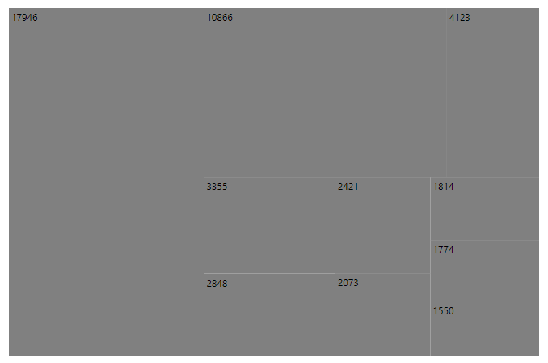
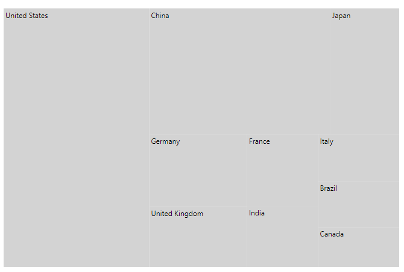
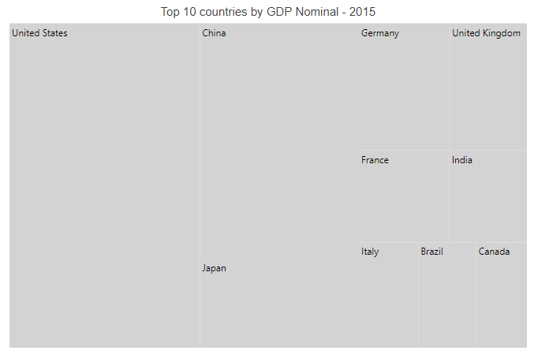
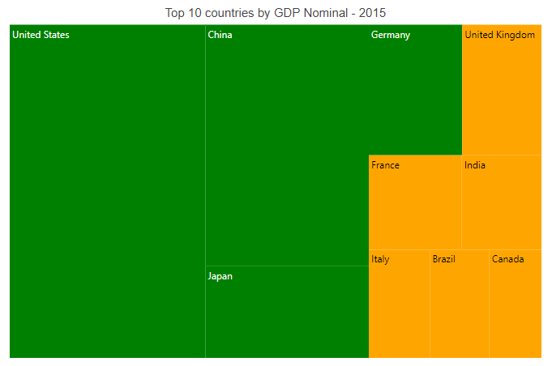

# Blazor TreeMap Component in Server Side App using Visual Studio

This section briefly explains how to include a TreeMap component in the Blazor server-side application. Refer to [Getting Started with Syncfusion Blazor for server-side in Visual Studio 2019](https://blazor.syncfusion.com/documentation/getting-started/blazor-server-side-visual-studio-2019/) page for introduction and configuring common specifications.

## Importing Syncfusion Blazor TreeMap component in the application

1. Install **Syncfusion.Blazor.TreeMap** NuGet package in the application using the **NuGet Package Manager**.

2. Add the client-side resources through CDN or local npm package in the `<head>` element of the **~/Pages/_Host.cshtml** page.

```html
    <head>
        <link href="_content/Syncfusion.Blazor.Themes/bootstrap4.css" rel="stylesheet" />
        <!---CDN--->
        @*<link href="https://cdn.syncfusion.com/blazor/{:version:}/styles/bootstrap4.css" rel="stylesheet" />*@
    </head>
```

> For Internet Explorer 11, kindly refer to the polyfills. Refer the [documentation](https://blazor.syncfusion.com/documentation/common/how-to/render-blazor-server-app-in-ie/) for more information.

 ```html
    <head>
        <link href="https://cdn.syncfusion.com/blazor/{:version:}/styles/bootstrap4.css" rel="stylesheet" />
        <script src="https://github.com/Daddoon/Blazor.Polyfill/releases/download/3.0.1/blazor.polyfill.min.js"></script>
    </head>
```

## Adding component package to the application

Open the **~/_Imports.razor** file and include the **Syncfusion.Blazor.TreeMap** namespace.

```cshtml
@using Syncfusion.Blazor.TreeMap
```

## Adding SyncfusionBlazor Service in Startup.cs

Open the **Startup.cs** file and add services required by Syncfusion components using **services.AddSyncfusionBlazor()** method. Add this method in the **ConfigureServices** function as follows.

```csharp
using Syncfusion.Blazor;

namespace BlazorApplication
{
    public class Startup
    {
        ....
        ....
        public void ConfigureServices(IServiceColloection services)
        {
            ....
            ....
            services.AddSyncfusionBlazor();
        }
    }
}
```

> To enable custom client-side source loading from CRG or CDN, please refer to the section about [custom resources in Blazor application](https://blazor.syncfusion.com/documentation/common/custom-resource-generator/#how-to-use-custom-resources-in-the-blazor-application).

## Adding TreeMap component

To initialize the TreeMap component, add the following code to the **Index.razor** view page under **~/Pages** folder. In a new application, if **Index.razor** page has any default content template, then those content can be completely removed and the following code can be added.

Use the [DataSource](https://help.syncfusion.com/cr/blazor/Syncfusion.Blazor.TreeMap.SfTreeMap-1.html#Syncfusion_Blazor_TreeMap_SfTreeMap_1_DataSource) property to load the car sales details in the TreeMap component. Specify a field name from the data source in the [WeightValuePath](https://help.syncfusion.com/cr/blazor/Syncfusion.Blazor.TreeMap.SfTreeMap-1.html#Syncfusion_Blazor_TreeMap_SfTreeMap_1_WeightValuePath) property to calculate the TreeMap item size.

```cshtml
<SfTreeMap DataSource="GrowthReport"
            WeightValuePath="GDP"
            TValue="Country">
</SfTreeMap>

@code {
    public class Country
    {
        public string Name { get; set; }
        public double GDP { get; set; }
    }
    public List<Country> GrowthReport = new List<Country> {
        new Country  {Name="United States", GDP=17946 },
        new Country  {Name="China", GDP=10866 },
        new Country  {Name="Japan", GDP=4123 },
        new Country  {Name="Germany", GDP=3355 },
        new Country  {Name="United Kingdom", GDP=2848 },
        new Country  {Name="France", GDP=2421 },
        new Country  {Name="India", GDP=2073 },
        new Country  {Name="Italy", GDP=1814 },
        new Country  {Name="Brazil", GDP=1774 },
        new Country  {Name="Canada", GDP=1550 }
    };
}
```

On successful compilation of the application, the Syncfusion Blazor TreeMap component will render in the web browser as following.



## Adding labels in TreeMap items

Add label text to the leaf items in the TreeMap component by setting the field name from data source in the [LabelPath](https://help.syncfusion.com/cr/blazor/Syncfusion.Blazor.TreeMap.TreeMapLeafItemSettings.html#Syncfusion_Blazor_TreeMap_TreeMapLeafItemSettings_LabelPath) property in the [TreeMapLeafItemSettings](https://help.syncfusion.com/cr/blazor/Syncfusion.Blazor.TreeMap.TreeMapLeafItemSettings.html), and it provides information to the user about the leaf items.

```cshtml
<SfTreeMap DataSource="GrowthReport"
            WeightValuePath="GDP"
            TValue="Country">
    <TreeMapLeafItemSettings LabelPath="Name" Fill="lightgray"></TreeMapLeafItemSettings>
</SfTreeMap>
```

> Refer to [code block](#adding-treemap-component) to know about the property value of **GrowthReport**.



## Adding title to TreeMap

Add a title using the [Text](https://help.syncfusion.com/cr/blazor/Syncfusion.Blazor.TreeMap.TreeMapTitleSettings.html#Syncfusion_Blazor_TreeMap_TreeMapTitleSettings_Text) property in the [TreeMapTitleSettings](https://help.syncfusion.com/cr/blazor/Syncfusion.Blazor.TreeMap.TreeMapTitleSettings.html) to provide quick information to the user about the items rendered in the TreeMap.

```cshtml
<SfTreeMap DataSource="GrowthReport"
            WeightValuePath="GDP"
            TValue="Country">
    <TreeMapTitleSettings Text="Top 10 countries by GDP Nominal - 2015"></TreeMapTitleSettings>
    <TreeMapLeafItemSettings LabelPath="Name" Fill="lightgray"></TreeMapLeafItemSettings>
</SfTreeMap>
```

> Refer to the [code block](#adding-treemap-component) to know the property value of **GrowthReport**.



## Apply color mapping

The color mapping supports customization of item colors based on the underlying value received from the bound data source. Specify the field name from which the values have to be compared for the items in the [RangeColorValuePath](https://help.syncfusion.com/cr/blazor/Syncfusion.Blazor.TreeMap.SfTreeMap-1.html#Syncfusion_Blazor_TreeMap_SfTreeMap_1_RangeColorValuePath) property in [SfTreeMap](https://help.syncfusion.com/cr/blazor/Syncfusion.Blazor.TreeMap.SfTreeMap-1.html). Also, specify range value and color in the [TreeMapLeafColorMapping](https://help.syncfusion.com/cr/blazor/Syncfusion.Blazor.TreeMap.TreeMapLeafColorMapping.html). Here, in this example, **"Orange"** is specified for the range **"0 - 3000"** and **"Green"** is specified for the range **"3000 - 20000"**.

```cshtml
<SfTreeMap DataSource="GrowthReport"
            WeightValuePath="GDP"
            TValue="Country"
            RangeColorValuePath="GDP">
    <TreeMapTitleSettings Text="Top 10 countries by GDP Nominal - 2015"></TreeMapTitleSettings>
    <TreeMapLeafItemSettings LabelPath="Name" Fill="lightgray">
        <TreeMapLeafColorMappings>
            <TreeMapLeafColorMapping From="0" To="3000" Color="@(new string[] { "Orange" })"></TreeMapLeafColorMapping>
            <TreeMapLeafColorMapping From="3000" To="20000" Color="@(new string[] { "Green" })"></TreeMapLeafColorMapping>
        </TreeMapLeafColorMappings>
    </TreeMapLeafItemSettings>
</SfTreeMap>
```

> Refer to the [code block](#adding-treemap-component) to know about the property value of **GrowthReport**.



## Enable legend

Legend items are used to denote the color mapping categories and show the legend for the TreeMap by setting the [Visible](https://help.syncfusion.com/cr/blazor/Syncfusion.Blazor.TreeMap.TreeMapLegendSettings.html#Syncfusion_Blazor_TreeMap_TreeMapLegendSettings_Visible) property to **true** in the [TreeMapLegendSettings](https://help.syncfusion.com/cr/blazor/Syncfusion.Blazor.TreeMap.TreeMapLegendSettings.html).

```cshtml
<SfTreeMap DataSource="GrowthReport"
            WeightValuePath="GDP"
            TValue="Country"
            RangeColorValuePath="GDP">
    <TreeMapTitleSettings Text="Top 10 countries by GDP Nominal - 2015"></TreeMapTitleSettings>
    <TreeMapLeafItemSettings LabelPath="Name" Fill="lightgray">
        <TreeMapLeafColorMappings>
            <TreeMapLeafColorMapping From="0" To="3000" Color="@(new string[] { "Orange" })"></TreeMapLeafColorMapping>
            <TreeMapLeafColorMapping From="3000" To="20000" Color="@(new string[] { "Green" })"></TreeMapLeafColorMapping>
        </TreeMapLeafColorMappings>
    </TreeMapLeafItemSettings>
    <TreeMapLegendSettings Visible="true"></TreeMapLegendSettings>
</SfTreeMap>
```

> Refer to the [code block](#adding-treemap-component) to know about the property value of **GrowthReport**.


## Enable tooltip

When space constraints prevents from displaying information using data labels, the tooltip comes in handy. The tooltip can be enabled by setting the [Visible](https://help.syncfusion.com/cr/blazor/Syncfusion.Blazor.TreeMap.TreeMapTooltipSettings.html#Syncfusion_Blazor_TreeMap_TreeMapTooltipSettings_Visible) property to **true** in the [TreeMapTooltipSettings](https://help.syncfusion.com/cr/blazor/Syncfusion.Blazor.TreeMap.TreeMapTooltipSettings.html).

```cshtml
<SfTreeMap DataSource="GrowthReport"
            WeightValuePath="GDP"
            TValue="Country"
            RangeColorValuePath="GDP">
    <TreeMapTitleSettings Text="Top 10 countries by GDP Nominal - 2015"></TreeMapTitleSettings>
    <TreeMapLeafItemSettings LabelPath="Name" Fill="lightgray">
        <TreeMapLeafColorMappings>
            <TreeMapLeafColorMapping From="0" To="3000" Color="@(new string[] { "Orange" })"></TreeMapLeafColorMapping>
            <TreeMapLeafColorMapping From="3000" To="20000" Color="@(new string[] { "Green" })"></TreeMapLeafColorMapping>
        </TreeMapLeafColorMappings>
    </TreeMapLeafItemSettings>
    <TreeMapLegendSettings Visible="true"></TreeMapLegendSettings>
    <TreeMapTooltipSettings Visible="true"></TreeMapTooltipSettings>
</SfTreeMap>
```

> Refer to the [code block](#adding-treemap-component) to know about the property value of **GrowthReport**.


## See also

* [Getting Started with Syncfusion Blazor for Client-Side in .NET Core CLI](https://blazor.syncfusion.com/documentation/getting-started/dotnet-cli-blazor/)

* [Getting Started with Syncfusion Blazor for Server-Side in Visual Studio 2019](https://blazor.syncfusion.com/documentation/getting-started/blazor-server-side-visual-studio-2019/)

* [Getting Started with Syncfusion Blazor for Server-Side in .NET Core CLI](https://blazor.syncfusion.com/documentation/getting-started/dotnet-cli-blazor-server/)
