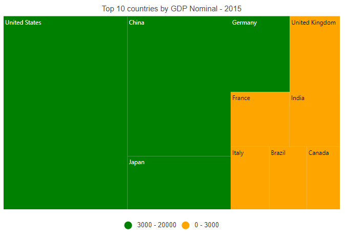
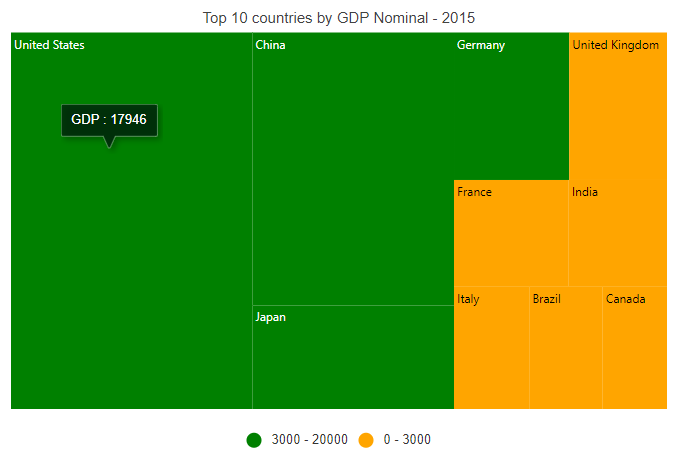

# Getting Started with Blazor TreeMap Component

This section briefly explains about how to include [Blazor TreeMap](https://www.syncfusion.com/blazor-components/blazor-treemap) component in your Blazor Server App and Blazor WebAssembly App using Visual Studio.

## Prerequisites

* [System requirements for Blazor components](https://blazor.syncfusion.com/documentation/system-requirements)

## Create a new Blazor App in Visual Studio

You can create **Blazor Server App** or **Blazor WebAssembly App** using Visual Studio in one of the following ways,

* [Create a Project using Microsoft Templates](https://docs.microsoft.com/en-us/aspnet/core/blazor/tooling?pivots=windows)

* [Create a Project using Syncfusion Blazor Extension](https://blazor.syncfusion.com/documentation/visual-studio-integration/vs2019-extensions/create-project)

## Install Syncfusion Blazor TreeMap NuGet in the App

Syncfusion Blazor components are available in [nuget.org](https://www.nuget.org/packages?q=syncfusion.blazor). To use Syncfusion Blazor components in the application, add reference to the corresponding NuGet. Refer to [NuGet packages topic](https://blazor.syncfusion.com/documentation/nuget-packages) for available NuGet packages list with component details.

To add Blazor TreeMap component in the app, open the NuGet package manager in Visual Studio (*Tools → NuGet Package Manager → Manage NuGet Packages for Solution*), search for [Syncfusion.Blazor.TreeMap](https://www.nuget.org/packages/Syncfusion.Blazor.TreeMap) and then install it.

## Register Syncfusion Blazor Service

Open **~/_Imports.razor** file and import the Syncfusion.Blazor namespace.




@using Syncfusion.Blazor




Now, register the Syncfusion Blazor Service in the Blazor Server App or Blazor WebAssembly App. Here, Syncfusion Blazor Service is registered by setting [IgnoreScriptIsolation](https://help.syncfusion.com/cr/blazor/Syncfusion.Blazor.GlobalOptions.html#Syncfusion_Blazor_GlobalOptions_IgnoreScriptIsolation) property as true to load the scripts externally in the [next steps](#add-script-reference).

> From 2022 Vol1 (20.1) version - The default value of `IgnoreScriptIsolation` is changed as `true`, so, you don’t have to set `IgnoreScriptIsolation` property explicitly to refer scripts externally.

### Blazor Server App

* For **.NET 6** app, open the **~/Program.cs** file and register the Syncfusion Blazor Service.

* For **.NET 5 and .NET 3.X** app, open the **~/Startup.cs** file and register the Syncfusion Blazor Service.




using Microsoft.AspNetCore.Components;
using Microsoft.AspNetCore.Components.Web;
using Syncfusion.Blazor;

var builder = WebApplication.CreateBuilder(args);

// Add services to the container.
builder.Services.AddRazorPages();
builder.Services.AddServerSideBlazor();
builder.Services.AddSyncfusionBlazor(options => { options.IgnoreScriptIsolation = true; });

var app = builder.Build();
....





using Syncfusion.Blazor;

namespace BlazorApplication
{
    public class Startup
    {
        ...
        public void ConfigureServices(IServiceCollection services)
        {
            services.AddRazorPages();
            services.AddServerSideBlazor();
            services.AddSyncfusionBlazor(options => { options.IgnoreScriptIsolation = true; });
        }
        ...
    }
}




### Blazor WebAssembly App

Open **~/Program.cs** file and register the Syncfusion Blazor Service in the client web app.




using Microsoft.AspNetCore.Components.Web;
using Microsoft.AspNetCore.Components.WebAssembly.Hosting;
using Syncfusion.Blazor;

var builder = WebAssemblyHostBuilder.CreateDefault(args);
builder.RootComponents.Add<App>("#app");
builder.RootComponents.Add<HeadOutlet>("head::after");

builder.Services.AddScoped(sp => new HttpClient { BaseAddress = new Uri(builder.HostEnvironment.BaseAddress) });

builder.Services.AddSyncfusionBlazor(options => { options.IgnoreScriptIsolation = true; });
await builder.Build().RunAsync();
....





using Syncfusion.Blazor;

namespace WebApplication1
{
    public class Program
    {
        public static async Task Main(string[] args)
        {
            ....
            builder.Services.AddSyncfusionBlazor(options => { options.IgnoreScriptIsolation = true; });
            await builder.Build().RunAsync();
        }
    }
}




## Add Style Sheet

Checkout the [Blazor Themes topic](https://blazor.syncfusion.com/documentation/appearance/themes) to learn different ways ([Static Web Assets](https://blazor.syncfusion.com/documentation/appearance/themes#static-web-assets), [CDN](https://blazor.syncfusion.com/documentation/appearance/themes#cdn-reference) and [CRG](https://blazor.syncfusion.com/documentation/common/custom-resource-generator)) to refer themes in Blazor application, and to have the expected appearance for Syncfusion Blazor components. Here, the theme is referred using [Static Web Assets](https://blazor.syncfusion.com/documentation/appearance/themes#static-web-assets). Refer to [Enable static web assets usage](https://blazor.syncfusion.com/documentation/appearance/themes#enable-static-web-assets-usage) topic to use static assets in your project.

To add theme to the app, open the NuGet package manager in Visual Studio (*Tools → NuGet Package Manager → Manage NuGet Packages for Solution*), search for [Syncfusion.Blazor.Themes](https://www.nuget.org/packages/Syncfusion.Blazor.Themes/) and then install it. Then, the theme style sheet from NuGet can be referred as follows,

### Blazor Server App

* For .NET 6 app, add the Syncfusion bootstrap5 theme in the `<head>` of the **~/Pages/_Layout.cshtml** file.

* For .NET 5 and .NET 3.X app, add the Syncfusion bootstrap5 theme in the `<head>` of the **~/Pages/_Host.cshtml** file.




<head>
    <link href="_content/Syncfusion.Blazor.Themes/bootstrap5.css" rel="stylesheet" />
</head>





<head>
    <link href="_content/Syncfusion.Blazor.Themes/bootstrap5.css" rel="stylesheet" />
</head>




### Blazor WebAssembly App

For Blazor WebAssembly App, Refer the theme style sheet from NuGet in the `<head>` of **wwwroot/index.html** file in the client web app.




<head>
    <link href="_content/Syncfusion.Blazor.Themes/bootstrap5.css" rel="stylesheet" />
</head>




## Add Script Reference

Checkout [Adding Script Reference topic](https://blazor.syncfusion.com/documentation/common/adding-script-references) to learn different ways to add script reference in Blazor Application. In this getting started walk-through, the required scripts are referred using [Static Web Assets](https://blazor.syncfusion.com/documentation/common/adding-script-references#static-web-assets) externally inside the `<head>` as follows. Refer to [Enable static web assets usage](https://blazor.syncfusion.com/documentation/common/adding-script-references#enable-static-web-assets-usage) topic to use static assets in your project.

### Blazor Server App

* For **.NET 6** app, Refer script in the `<head>` of the **~/Pages/_Layout.cshtml** file.

* For **.NET 5 and .NET 3.X** app, Refer script in the `<head>` of the **~/Pages/_Host.cshtml** file.




<head>
    ....
    <link href="_content/Syncfusion.Blazor.Themes/bootstrap5.css" rel="stylesheet" />
    
</head>





<head>
    ....
    <link href="_content/Syncfusion.Blazor.Themes/bootstrap5.css" rel="stylesheet" />
    
</head>




### Blazor WebAssembly App

For Blazor WebAssembly App, Refer script in the `<head>` of the **~/index.html** file.




<head>
    ....
    <link href="_content/Syncfusion.Blazor.Themes/bootstrap5.css" rel="stylesheet" />
    
</head>




> Syncfusion recommends to reference scripts using [Static Web Assets](https://blazor.syncfusion.com/documentation/common/adding-script-references#static-web-assets), [CDN](https://blazor.syncfusion.com/documentation/common/adding-script-references#cdn-reference) and [CRG](https://blazor.syncfusion.com/documentation/common/custom-resource-generator) by [disabling JavaScript isolation](https://blazor.syncfusion.com/documentation/common/adding-script-references#disable-javascript-isolation) for better loading performance of the Blazor application.

## Add Blazor TreeMap component

* Open **~/_Imports.razor** file or any other page under the `~/Pages` folder where the component is to be added and import the **Syncfusion.Blazor.TreeMap** namespace.




@using Syncfusion.Blazor
@using Syncfusion.Blazor.TreeMap




* Now, add the Syncfusion TreeMap component in razor file. Here, the TreeMap component is added in the **~/Pages/Index.razor** file under the **~/Pages** folder.

* You can use the [DataSource](https://help.syncfusion.com/cr/blazor/Syncfusion.Blazor.TreeMap.SfTreeMap-1.html#Syncfusion_Blazor_TreeMap_SfTreeMap_1_DataSource) property to load the car sales details in the TreeMap component. Specify a field name from the data source in the [WeightValuePath](https://help.syncfusion.com/cr/blazor/Syncfusion.Blazor.TreeMap.SfTreeMap-1.html#Syncfusion_Blazor_TreeMap_SfTreeMap_1_WeightValuePath) property to calculate the TreeMap item size.




<SfTreeMap DataSource="GrowthReport"
            WeightValuePath="GDP"
            TValue="Country">
</SfTreeMap>

@code {
    public class Country
    {
        public string Name { get; set; }
        public double GDP { get; set; }
    }
    public List<Country> GrowthReport = new List<Country> {
        new Country  {Name="United States", GDP=17946 },
        new Country  {Name="China", GDP=10866 },
        new Country  {Name="Japan", GDP=4123 },
        new Country  {Name="Germany", GDP=3355 },
        new Country  {Name="United Kingdom", GDP=2848 },
        new Country  {Name="France", GDP=2421 },
        new Country  {Name="India", GDP=2073 },
        new Country  {Name="Italy", GDP=1814 },
        new Country  {Name="Brazil", GDP=1774 },
        new Country  {Name="Canada", GDP=1550 }
    };
}




* Press <kbd>Ctrl</kbd>+<kbd>F5</kbd> (Windows) or <kbd>⌘</kbd>+<kbd>F5</kbd> (macOS) to run the application. Then, the Syncfusion `Blazor TreeMap` component will be rendered in the default web browser.

## Adding labels in TreeMap items

Add label text to the leaf items in the TreeMap component by setting the field name from data source in the [LabelPath](https://help.syncfusion.com/cr/blazor/Syncfusion.Blazor.TreeMap.TreeMapLeafItemSettings.html#Syncfusion_Blazor_TreeMap_TreeMapLeafItemSettings_LabelPath) property in the [TreeMapLeafItemSettings](https://help.syncfusion.com/cr/blazor/Syncfusion.Blazor.TreeMap.TreeMapLeafItemSettings.html), and it provides information to the user about the leaf items.




<SfTreeMap DataSource="GrowthReport"
            WeightValuePath="GDP"
            TValue="Country">
    <TreeMapLeafItemSettings LabelPath="Name" Fill="lightgray"></TreeMapLeafItemSettings>
</SfTreeMap>




> Refer to the [code block](#adding-treemap-component) to know about the property value of the **GrowthReport**.

## Adding title to TreeMap

Add a title using the [Text](https://help.syncfusion.com/cr/blazor/Syncfusion.Blazor.TreeMap.TreeMapTitleSettings.html#Syncfusion_Blazor_TreeMap_TreeMapTitleSettings_Text) property in the [TreeMapTitleSettings](https://help.syncfusion.com/cr/blazor/Syncfusion.Blazor.TreeMap.TreeMapTitleSettings.html) to provide quick information to the user about the items rendered in the TreeMap.




<SfTreeMap DataSource="GrowthReport"
            WeightValuePath="GDP"
            TValue="Country">
    <TreeMapTitleSettings Text="Top 10 countries by GDP Nominal - 2015"></TreeMapTitleSettings>
    <TreeMapLeafItemSettings LabelPath="Name" Fill="lightgray"></TreeMapLeafItemSettings>
</SfTreeMap>




> Refer to the [code block](#adding-treemap-component) to know the property value of the **GrowthReport**.

> [View Sample in GitHub](https://github.com/SyncfusionExamples/Blazor-Getting-Started-Examples/tree/main/TreeMap).

## Apply color mapping

The color mapping supports customization of item colors based on the underlying value received from the bound data source. Specify the field name from which the values have to be compared for the items in the [RangeColorValuePath](https://help.syncfusion.com/cr/blazor/Syncfusion.Blazor.TreeMap.SfTreeMap-1.html#Syncfusion_Blazor_TreeMap_SfTreeMap_1_RangeColorValuePath) property in [SfTreeMap](https://help.syncfusion.com/cr/blazor/Syncfusion.Blazor.TreeMap.SfTreeMap-1.html). Also, specify range value and color in the [TreeMapLeafColorMapping](https://help.syncfusion.com/cr/blazor/Syncfusion.Blazor.TreeMap.TreeMapLeafColorMapping.html). Here, in this example, **"Orange"** is specified for the range **"0 - 3000"** and **"Green"** is specified for the range **"3000 - 20000"**.




<SfTreeMap DataSource="GrowthReport"
            WeightValuePath="GDP"
            TValue="Country"
            RangeColorValuePath="GDP">
    <TreeMapTitleSettings Text="Top 10 countries by GDP Nominal - 2015"></TreeMapTitleSettings>
    <TreeMapLeafItemSettings LabelPath="Name" Fill="lightgray">
        <TreeMapLeafColorMappings>
            <TreeMapLeafColorMapping From="0" To="3000" Color="@(new string[] { "Orange" })"></TreeMapLeafColorMapping>
            <TreeMapLeafColorMapping From="3000" To="20000" Color="@(new string[] { "Green" })"></TreeMapLeafColorMapping>
        </TreeMapLeafColorMappings>
    </TreeMapLeafItemSettings>
</SfTreeMap>




> Refer to the [code block](#adding-treemap-component) to know about the property value of the **GrowthReport**.

## Enable legend

Legend items are used to denote the color mapping categories and show the legend for the TreeMap by setting the [Visible](https://help.syncfusion.com/cr/blazor/Syncfusion.Blazor.TreeMap.TreeMapLegendSettings.html#Syncfusion_Blazor_TreeMap_TreeMapLegendSettings_Visible) property to **true** in the [TreeMapLegendSettings](https://help.syncfusion.com/cr/blazor/Syncfusion.Blazor.TreeMap.TreeMapLegendSettings.html).




<SfTreeMap DataSource="GrowthReport"
            WeightValuePath="GDP"
            TValue="Country"
            RangeColorValuePath="GDP">
    <TreeMapTitleSettings Text="Top 10 countries by GDP Nominal - 2015"></TreeMapTitleSettings>
    <TreeMapLeafItemSettings LabelPath="Name" Fill="lightgray">
        <TreeMapLeafColorMappings>
            <TreeMapLeafColorMapping From="0" To="3000" Color="@(new string[] { "Orange" })"></TreeMapLeafColorMapping>
            <TreeMapLeafColorMapping From="3000" To="20000" Color="@(new string[] { "Green" })"></TreeMapLeafColorMapping>
        </TreeMapLeafColorMappings>
    </TreeMapLeafItemSettings>
    <TreeMapLegendSettings Visible="true"></TreeMapLegendSettings>
</SfTreeMap>




> Refer to the [code block](#adding-treemap-component) to know about the property value of the **GrowthReport**.

## Enable tooltip

When space constraints prevents from displaying information using data labels, the tooltip comes in handy. The tooltip can be enabled by setting the [Visible](https://help.syncfusion.com/cr/blazor/Syncfusion.Blazor.TreeMap.TreeMapTooltipSettings.html#Syncfusion_Blazor_TreeMap_TreeMapTooltipSettings_Visible) property to **true** in the [TreeMapTooltipSettings](https://help.syncfusion.com/cr/blazor/Syncfusion.Blazor.TreeMap.TreeMapTooltipSettings.html).




<SfTreeMap DataSource="GrowthReport"
            WeightValuePath="GDP"
            TValue="Country"
            RangeColorValuePath="GDP">
    <TreeMapTitleSettings Text="Top 10 countries by GDP Nominal - 2015"></TreeMapTitleSettings>
    <TreeMapLeafItemSettings LabelPath="Name" Fill="lightgray">
        <TreeMapLeafColorMappings>
            <TreeMapLeafColorMapping From="0" To="3000" Color="@(new string[] { "Orange" })"></TreeMapLeafColorMapping>
            <TreeMapLeafColorMapping From="3000" To="20000" Color="@(new string[] { "Green" })"></TreeMapLeafColorMapping>
        </TreeMapLeafColorMappings>
    </TreeMapLeafItemSettings>
    <TreeMapLegendSettings Visible="true"></TreeMapLegendSettings>
    <TreeMapTooltipSettings Visible="true"></TreeMapTooltipSettings>
</SfTreeMap>




> Refer to the [code block](#adding-treemap-component) to know about the property value of the **GrowthReport**.

> You can also explore our [Blazor TreeMap example](https://blazor.syncfusion.com/demos/treemap/default-functionalities?theme=bootstrap5) that shows you how to render and configure the treemap.

## See also

* [Getting Started with Syncfusion Blazor for Client-Side in .NET Core CLI](https://blazor.syncfusion.com/documentation/getting-started/blazor-webassembly-dotnet-cli/)

* [Getting Started with Syncfusion Blazor for Server-Side in Visual Studio](https://blazor.syncfusion.com/documentation/getting-started/blazor-server-side-visual-studio/)

* [Getting Started with Syncfusion Blazor for Server-Side in .NET Core CLI](https://blazor.syncfusion.com/documentation/getting-started/blazor-server-side-dotnet-cli/)
