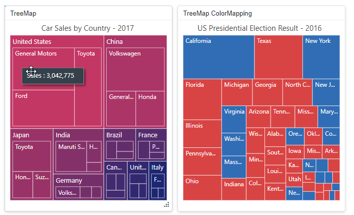
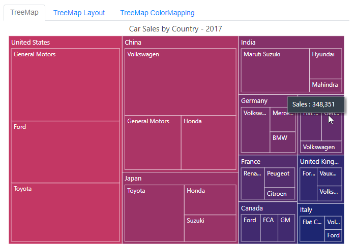
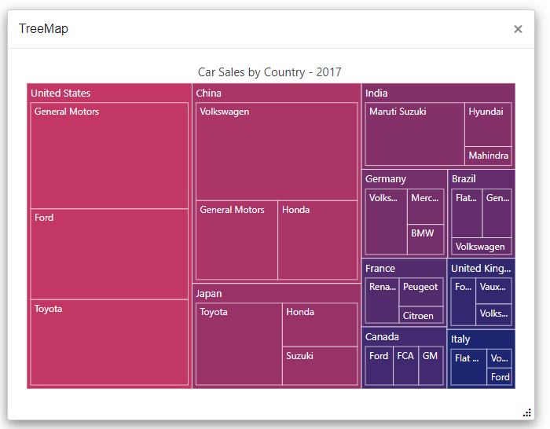
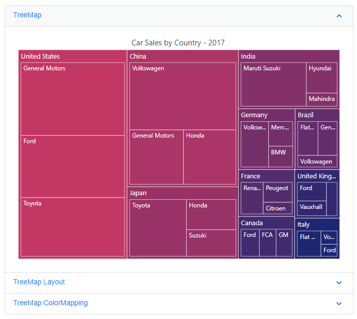

# Render TreeMap component inside other components

The TreeMap can be rendered within components such as the Dashboard Layout, Tabs, Dialog, and others. In general, the TreeMap component renders before other components, so a boolean variable (i.e. boolean flag) is used to determine when to begin rendering the TreeMap component.

## TreeMap component inside Dashboard Layout

When the TreeMap component renders within a panel of the Dashboard Layout component, its rendering begins concurrently with the Dashboard Layout component's rendering. As a result, the size of the TreeMap component will not be proper. To properly render the TreeMap component, a boolean variable (i.e. **IsInitialRender**) must be created and it is used to determine the TreeMap component's rendering. The boolean variable is set to **false** by default, so the TreeMap component will not be rendered initially. When the Dashboard Layout component is rendered, its [Created](https://help.syncfusion.com/cr/blazor/Syncfusion.Blazor.Layouts.DashboardLayoutEvents.html#Syncfusion_Blazor_Layouts_DashboardLayoutEvents_Created) event is fired. Within this event, the `Task.Yield()` method should be called, and the boolean variable (i.e. **IsInitialRender**) should be set to **true** to initiate the rendering of the TreeMap component. This ensures that the Dashboard Layout component is fully rendered before the TreeMap component begins rendering.

When you drag and resize the Dashboard Layout panel or resize the window, the TreeMap component is not notified and thus may not render properly within the panel. To address this, call the TreeMap component's [RefreshAsync](https://help.syncfusion.com/cr/blazor/Syncfusion.Blazor.TreeMap.SfTreeMap-1.html#Syncfusion_Blazor_TreeMap_SfTreeMap_1_RefreshAsync) method within the Dashboard Layout's [Resizing](https://help.syncfusion.com/cr/blazor/Syncfusion.Blazor.Layouts.DashboardLayoutEvents.html#Syncfusion_Blazor_Layouts_DashboardLayoutEvents_Resizing) and [OnWindowResize](https://help.syncfusion.com/cr/blazor/Syncfusion.Blazor.Layouts.DashboardLayoutEvents.html#Syncfusion_Blazor_Layouts_DashboardLayoutEvents_OnWindowResize) events. Additionally, apply a 500-millisecond delay using a timer to refresh the TreeMap components after resizing is complete.

```cshtml

@using Syncfusion.Blazor.TreeMap
@using Syncfusion.Blazor.Layouts
@using Syncfusion.Blazor.Inputs


<SfDashboardLayout ID="DashBoard" AllowResizing="true" AllowFloating="true" CellSpacing="@CellSpacing" Columns="20">
<DashboardLayoutEvents Created="Created" OnWindowResize="@ResizingWindow" Resizing="@ResizingWindow"></DashboardLayoutEvents>
    <DashboardLayoutPanels>
        <DashboardLayoutPanel Id="LayoutOne" Row="0" Col="5" SizeX="5" SizeY="7">
            <HeaderTemplate><div>TreeMap</div></HeaderTemplate>
            <ContentTemplate>
                @if (IsInitialRender)
                {
                     <SfTreeMap ID="TreeOne" @ref="TreeOne" TValue="CarSalesDetails" Format="N0" EnableGroupingSeparator="true" WeightValuePath="Sales" RangeColorValuePath="Sales" DataSource="@DataSource" Palette="@Palette" Width="100%" Height="100%">
                         <TreeMapTitleSettings Text="Car Sales by Country - 2017">
                             <TreeMapTitleTextStyle FontFamily="Segoe UI" Size="15px"></TreeMapTitleTextStyle>
                         </TreeMapTitleSettings>
                         <TreeMapLeafItemSettings LabelPath="Company">
                             <TreeMapLeafBorder Color="#FFFFFF" Width="0.5" />
                             <TreeMapLeafLabelStyle FontFamily="Segoe UI" Size="12px"></TreeMapLeafLabelStyle>
                         </TreeMapLeafItemSettings>
                         <TreeMapLevels>
                             <TreeMapLevel GroupPath="Continent">
                                 <TreeMapLevelBorder Color="#FFFFFF" Width="0.5" />
                                 <TreeMapHeaderStyle FontFamily="Segoe UI"></TreeMapHeaderStyle>
                             </TreeMapLevel>
                         </TreeMapLevels>
                         <TreeMapTooltipSettings Visible="true">
                             <TreeMapTooltipTextStyle FontFamily="Segoe UI"></TreeMapTooltipTextStyle>
                         </TreeMapTooltipSettings>
                     </SfTreeMap>
                }
            </ContentTemplate>
        </DashboardLayoutPanel> 
        <DashboardLayoutPanel Id="LayoutTwo" Row="1" Col="5" SizeX="5" SizeY="7">
            <HeaderTemplate><div>  TreeMap - Layout </div></HeaderTemplate>
            <ContentTemplate>
                @if (IsInitialRender)
                {
                     <SfTreeMap ID="TreeTwo" @ref="TreeTwo" WeightValuePath="GDP" DataSource="@Economics" RangeColorValuePath="GDP" TValue="LeafData" LayoutType="@LayoutModes" RenderDirection="@RenderMode" Width="100%" Height="100%">
                            <TreeMapTitleSettings Text="Top 10 Countries by GDP Nominal - 2015">
                                <TreeMapTitleTextStyle Size="15px" FontFamily="Segoe UI" />
                            </TreeMapTitleSettings>
                            <TreeMapTooltipSettings Visible="true" Format="${State}<br>Rank : ${Rank}">
                                <TreeMapTooltipTextStyle FontFamily="Segoe UI"></TreeMapTooltipTextStyle>
                            </TreeMapTooltipSettings>
                            <TreeMapLeafItemSettings LabelPath="State" LabelFormat="${State}<br>$${GDP} Trillion<br>(${Percentage} %)">
                                <TreeMapLeafColorMappings>
                                    <TreeMapLeafColorMapping StartRange="1550" EndRange="17946" Color="@LeafColor" MinOpacity="0.7" MaxOpacity="1" />
                                </TreeMapLeafColorMappings>
                                <TreeMapLeafLabelStyle Color="#000000" FontFamily="Segoe UI" />
                                <TreeMapLeafBorder Color="#000000" Width="0.5" />
                            </TreeMapLeafItemSettings>
                        </SfTreeMap>
                }
            </ContentTemplate>
        </DashboardLayoutPanel>
        <DashboardLayoutPanel Id="LayoutThree" Row="2" Col="5" SizeX="5" SizeY="7">
            <HeaderTemplate><div> TreeMap - ColorMapping </div></HeaderTemplate>
            <ContentTemplate>
                @if (IsInitialRender)
                {
                     <SfTreeMap ID="TreeThree" @ref="TreeThree" TValue="USAElectionResult" WeightValuePath="Population" EqualColorValuePath="Winner" RangeColorValuePath="WinPercentage" DataSource="@DataSourceUSA" Width="100%" Height="100%">
                            <TreeMapTitleSettings Text="US Presidential Election Result - 2016">
                                <TreeMapTitleTextStyle FontFamily="Segoe UI" Size="15px"></TreeMapTitleTextStyle>
                            </TreeMapTitleSettings>
                            <TreeMapLeafItemSettings LabelPath="State" Fill="6699cc">
                                <TreeMapLeafColorMappings>
                                    <TreeMapLeafColorMapping LeafValue="Trump" Color="@LeafColorOne" />
                                    <TreeMapLeafColorMapping LeafValue="Clinton" Color="@LeafColorTwo" />
                                </TreeMapLeafColorMappings>
                                <TreeMapLeafBorder Color="#FFFFFF" Width="0.5" />
                                <TreeMapLeafLabelStyle FontFamily="Segoe UI" Size="12px"></TreeMapLeafLabelStyle>
                            </TreeMapLeafItemSettings>
                            <TreeMapTooltipSettings Visible="true" Format="<b>${Winner}</b><br>State : ${State}<br>Trump : ${Trump} %<br>Clinton : ${Clinton} %">
                                <TreeMapTooltipTextStyle FontFamily="Segoe UI"></TreeMapTooltipTextStyle>
                            </TreeMapTooltipSettings>
                          </SfTreeMap>
                }
            </ContentTemplate>
        </DashboardLayoutPanel> 
    </DashboardLayoutPanels>
</SfDashboardLayout>

@code {
    SfTreeMap<CarSalesDetails> TreeOne;
    SfTreeMap<LeafData> TreeTwo;
    SfTreeMap<USAElectionResult> TreeThree;
    private Timer _resizeTimer;
    public string[] LeafColor = new string[] { "#9cbb59" };
    public string[] LeafColorOne = new string[] { "#D84444" };
    public string[] LeafColorTwo = new string[] { "#316DB5" };

    public Syncfusion.Blazor.TreeMap.LayoutMode LayoutModes = Syncfusion.Blazor.TreeMap.LayoutMode.Squarified;
    public Syncfusion.Blazor.TreeMap.RenderingMode RenderMode = Syncfusion.Blazor.TreeMap.RenderingMode.TopLeftBottomRight;
    public Syncfusion.Blazor.TreeMap.LegendMode LegendModes = Syncfusion.Blazor.TreeMap.LegendMode.Default;
    public Syncfusion.Blazor.TreeMap.LegendPosition LegendPositions = Syncfusion.Blazor.TreeMap.LegendPosition.Top;

    public bool IsInitialRender { get; set; }
    public double[] CellSpacing = { 10, 10 };

    public string[] Palette = new string[] { "#C33764", "#AB3566", "#993367", "#853169", "#742F6A", "#632D6C", "#532C6D", "#412A6F", "#312870", "#1D2671" };

    public async void Created(Object args)
    {
        await Task.Yield();
        IsInitialRender = true;
    }

    public async Task ResizingWindow(ResizeArgs args)
    {
        if (_resizeTimer != null)
        {
            _resizeTimer.Dispose();
        }
        _resizeTimer = new Timer(async _ =>
        {
            await InvokeAsync(() =>
            {
                RefreshComponents();
            });
        }, null, 500, Timeout.Infinite);
    }
    
    private async Task RefreshComponents()
    {
        await Task.Yield();
        await TreeOne.RefreshAsync();
        await TreeTwo.RefreshAsync();
        await TreeThree.RefreshAsync();
    }

    public class CarSalesDetails
    {
        public string Continent { get; set; }
        public string Company { get; set; }
        public int Sales { get; set; }
    }
    public List<CarSalesDetails> DataSource = new List<CarSalesDetails> {
        new CarSalesDetails { Continent="China", Company="Volkswagen", Sales=3005994 },
        new CarSalesDetails { Continent="China", Company="General Motors", Sales=1230044 },
        new CarSalesDetails { Continent="China", Company="Honda", Sales=1197023 },
        new CarSalesDetails { Continent="United States", Company="General Motors", Sales=3042775 },
        new CarSalesDetails { Continent="United States", Company="Ford", Sales=2599193 },
        new CarSalesDetails { Continent="United States", Company="Toyota", Sales=2449587 },
        new CarSalesDetails { Continent="Japan",Company="Toyota", Sales=1527977 },
        new CarSalesDetails { Continent="Japan", Company="Honda", Sales=706982 },
        new CarSalesDetails { Continent="Japan", Company="Suzuki", Sales=623041 },
        new CarSalesDetails { Continent="Germany",Company="Volkswagen", Sales=655977 },
        new CarSalesDetails { Continent="Germany", Company="Mercedes", Sales=310845 },
        new CarSalesDetails { Continent="Germany", Company="BMW", Sales=261931 },
        new CarSalesDetails { Continent="United Kingdom", Company="Ford ", Sales=319442 },
        new CarSalesDetails { Continent="United Kingdom", Company="Vauxhall", Sales=251146 },
        new CarSalesDetails { Continent="United Kingdom", Company="Volkswagen", Sales=206994 },
        new CarSalesDetails { Continent="India", Company="Maruti Suzuki", Sales=1443654 },
        new CarSalesDetails { Continent="India", Company="Hyundai", Sales=476241 },
        new CarSalesDetails { Continent="India", Company="Mahindra", Sales=205041 },
        new CarSalesDetails { Continent="France", Company="Renault", Sales=408183 },
        new CarSalesDetails { Continent="France", Company="Peugeot", Sales=336242 },
        new CarSalesDetails { Continent="France", Company="Citroen", Sales=194986 },
        new CarSalesDetails { Continent="Brazil", Company="Flat Chrysler", Sales=368842 },
        new CarSalesDetails { Continent="Brazil", Company="General Motors", Sales=348351 },
        new CarSalesDetails { Continent="Brazil", Company="Volkswagen", Sales=245895 },
        new CarSalesDetails { Continent="Italy", Company="Flat Chrysler", Sales=386260 },
        new CarSalesDetails { Continent="Italy", Company="Volkswagen", Sales=138984 },
        new CarSalesDetails { Continent="Italy", Company="Ford", Sales=125144 },
        new CarSalesDetails { Continent="Canada", Company="Ford", Sales=305086},
        new CarSalesDetails { Continent="Canada", Company="FCA", Sales=278011 },
        new CarSalesDetails { Continent="Canada", Company="GM", Sales=266884 },
    }; 
    
    public class USAElectionResult
    {
        public string State { get; set; }
        public double Trump { get; set; }
        public double Clinton { get; set; }
        public double WinPercentage { get; set; }
        public string Winner { get; set; }
        public double Population { get; set; }
    }
    public List<USAElectionResult> DataSourceUSA = new List<USAElectionResult> {
        new USAElectionResult { State="Alabama", Trump=62.9, Clinton=34.6, WinPercentage= 62.9, Winner="Trump", Population=4780127 },
        new USAElectionResult { State="Alaska", Trump=52.9, Clinton=37.7, WinPercentage= 52.9, Winner="Trump", Population=710249},
        new USAElectionResult { State="Arkansas", Trump=60.6, Clinton=33.7, WinPercentage=60.6, Winner="Trump", Population=2915958 },
        new USAElectionResult { State="Arizona", Trump=49.5, Clinton=45.4, WinPercentage=49.5, Winner="Trump", Population=6392307 },
        new USAElectionResult { State="California",  Trump=32.8, Clinton=61.6, WinPercentage= 61.6, Winner="Clinton", Population=37252895},
        new USAElectionResult { State="Colorado",  Trump=47.3, Clinton=44.4, WinPercentage= 47.3, Winner="Trump", Population=5029324 },
        new USAElectionResult { State="Connecticut",  Trump=41.2, Clinton=54.5, WinPercentage= 54.5, Winner="Clinton", Population=3574118},
        new USAElectionResult { State="Delaware",  Trump=53.4, Clinton=41.9, WinPercentage= 53.4, Winner="Trump", Population=897936 },
        new USAElectionResult { State="District of Columbia",   Trump=4.1, Clinton=92.8, WinPercentage= 92.8, Winner="Clinton", Population=693972 },
        new USAElectionResult { State="Florida", Trump=49.1, Clinton=47.8, WinPercentage= 49.1, Winner="Trump", Population=18804623},
        new USAElectionResult { State="Georgia", Trump=51.3, Clinton=45.6, WinPercentage=51.3, Winner="Trump", Population=9688681},
        new USAElectionResult { State="Hawaii",  Trump=62.2, Clinton=30, WinPercentage=62.2, Winner="Trump", Population=1360301 },
        new USAElectionResult { State="Idaho", Trump=59.2, Clinton=27.6, WinPercentage= 59.2, Winner="Trump", Population=1567652 },
        new USAElectionResult { State="Illinois",  Trump=55.4, Clinton=39.4, WinPercentage= 55.4, Winner="Trump", Population=12831549  },
        new USAElectionResult { State="Indiana", Trump=57.2, Clinton=37.9, WinPercentage=57.2, Winner="Trump", Population=6484229 },
        new USAElectionResult { State="Iowa", Trump=51.8, Clinton=42.2, WinPercentage=51.8, Winner="Trump", Population=3046869  },
        new USAElectionResult { State="Kansas", Trump=57.2, Clinton=36.2, WinPercentage=57.2, Winner="Trump", Population=2853132, },
        new USAElectionResult { State="Kentucky", Trump=62.5, Clinton=32.7, WinPercentage=62.5, Winner="Trump", Population=4339349 },
        new USAElectionResult { State="Louisiana", Trump=58.1, Clinton=38.4, WinPercentage=58.1, Winner="Trump", Population=4533479 },
        new USAElectionResult { State="Maine",  Trump=45.2, Clinton=47.9, WinPercentage=47.9, Winner="Clinton", Population=1328361},
        new USAElectionResult { State="Maryland",  Trump=35.3, Clinton=60.5, WinPercentage=60.5, Winner="Clinton", Population=5773785 },
        new USAElectionResult { State="Massachusetts",  Trump=33.5, Clinton=60.8, WinPercentage=60.8, Winner="Clinton", Population=6547817 },
        new USAElectionResult { State="Michigan", Trump=47.6, Clinton=47.3, WinPercentage=47.6, Winner="Trump", Population=9884129 },
        new USAElectionResult { State="Minnesota",  Trump=45.4, Clinton=46.9, WinPercentage=46.9, Winner="Trump", Population=5303925 },
        new USAElectionResult { State="Mississippi", Trump=58.3, Clinton=39.7, WinPercentage=58.3, Winner="Trump", Population=2968103  },
        new USAElectionResult { State="Missouri", Trump=57.1, Clinton=38.0, WinPercentage=57.1, Winner="Trump", Population=5988927  },
        new USAElectionResult { State="Montana", Trump=56.5, Clinton=36.0, WinPercentage= 56.5, Winner="Trump", Population=989417 },
        new USAElectionResult { State="Nebraska", Trump=60.3, Clinton=34.0, WinPercentage=60.3, Winner="Trump", Population=1826341 },
        new USAElectionResult { State="Nevada",  Trump=45.5, Clinton=47.9, WinPercentage=47.9, Winner="Clinton", Population=2700691  },
        new USAElectionResult { State="New Hampshire",  Trump=47.2, Clinton=47.6, WinPercentage= 47.6, Winner="Clinton", Population=1316466 },
        new USAElectionResult { State="New Jersey",  Trump=41.8, Clinton=55.0, WinPercentage=55, Winner="Clinton", Population=8791936},
        new USAElectionResult { State="New Mexico",  Trump=40.0, Clinton=48.3, WinPercentage=48.3, Winner="Clinton", Population=2059192 },
        new USAElectionResult { State="New York",  Trump=37.5, Clinton=58.8, WinPercentage=58.8, Winner="Clinton", Population=19378087},
        new USAElectionResult { State="North Carolina", Trump=50.5, Clinton=46.7, WinPercentage=50.5, Winner="Trump", Population=9535692 },
        new USAElectionResult { State="North Dakota", Trump=64.1, Clinton=27.8,  WinPercentage=64.1, Winner="Trump", Population=672591 },
        new USAElectionResult { State="Ohio", Trump=52.1, Clinton=43.5,  WinPercentage=52.5, Winner="Trump", Population=11536725 },
        new USAElectionResult { State="Oklahoma", Trump=65.3, Clinton=28.9, WinPercentage= 65.3, Winner="Trump", Population=3751616 },
        new USAElectionResult { State="Oregon",  Trump=41.1, Clinton=51.7, WinPercentage=51.7, Winner="Clinton", Population=3831073  },
        new USAElectionResult { State="Pennsylvania", Trump=48.8, Clinton=47.6, WinPercentage= 48.8, Winner="Trump", Population=12702887},
        new USAElectionResult { State="Rhode Island",  Trump=39.8, Clinton=55.4, WinPercentage= 55.4, Winner="Clinton", Population=1052931 },
        new USAElectionResult { State="South Carolina", Trump=54.9, Clinton=40.8, WinPercentage=54.9, Winner="Trump", Population=4625401},
        new USAElectionResult { State="South Dakota", Trump=61.5, Clinton=31.7, WinPercentage= 61.5, Winner="Trump", Population=814191 },
        new USAElectionResult { State="Tennessee", Trump=61.1, Clinton=34.9, WinPercentage=61.1, Winner="Trump", Population=6346275},
        new USAElectionResult { State="Texas", Trump=52.6, Clinton=43.4, WinPercentage=52.6, Winner="Trump", Population=25146105 },
        new USAElectionResult { State="Utah", Trump=45.9, Clinton=27.8, WinPercentage=45.9, Winner="Trump", Population=2763888, },
        new USAElectionResult { State="Vermont",  Trump=39.7, Clinton=61.1,  WinPercentage=61.1, Winner="Clinton", Population=625745 },
        new USAElectionResult { State="Virginia",  Trump=45.0, Clinton=49.9, WinPercentage=49.9, Winner="Clinton", Population=8001045},
        new USAElectionResult { State="Washington",  Trump=4.1, Clinton=92.8, WinPercentage=92.8, Winner="Clinton", Population=6724543 },
        new USAElectionResult { State="Wisconsin", Trump=68.7, Clinton=26.5, WinPercentage=68.7, Winner="Trump", Population=5687289},
        new USAElectionResult { State="West Virginia", Trump=47.9, Clinton=46.9, WinPercentage=47.9, Winner="Clinton", Population=1853011 },
        new USAElectionResult { State="Wyoming", Trump=70.1, Clinton=22.5, WinPercentage=70.1, Winner="Trump", Population=583767 }
    };

    public class LeafData
    {
        public string State { get; set; }
        public int GDP { get; set; }
        public double Percentage { get; set; }
        public int Rank { get; set; }
    };
    public List<LeafData> Economics = new List<LeafData> {
        new LeafData { State="United States", GDP=17946, Percentage=11.08, Rank=1},
        new LeafData { State="China", GDP=10866, Percentage=28.42, Rank=2 },
        new LeafData { State="Japan", GDP=4123, Percentage=-30.78, Rank=3},
        new LeafData { State="Germany", GDP=3355, Percentage=-5.19, Rank=4},
        new LeafData { State="United Kingdom", GDP=2848, Percentage=8.28, Rank=5 },
        new LeafData { State="France", GDP=2421, Percentage=-9.69, Rank=6 },
        new LeafData { State="India", GDP=2073, Percentage=13.65, Rank=7 },
        new LeafData { State="Italy", GDP=1814, Percentage=-12.45, Rank=8 },
        new LeafData { State="Brazil", GDP=1774, Percentage=-27.88, Rank=9 },
        new LeafData { State="Canada", GDP=1550, Percentage=-15.02, Rank=10 }
    };

}

```


## TreeMap component inside Tab

When the TreeMap component renders within the Tab component, its rendering begins concurrently with the Tab component's rendering. As a result, the size of the TreeMap component will not be proper. To properly render the TreeMap component, a boolean variable (i.e. **IsInitialRender**) must be created and it is used to determine the TreeMap component's rendering. The boolean variable is set to **false** by default, so the TreeMap component will not be rendered initially. When the Tab component is rendered, its [Created](https://help.syncfusion.com/cr/blazor/Syncfusion.Blazor.Navigations.TabEvents.html#Syncfusion_Blazor_Navigations_TabEvents_Created) event is fired, and the boolean variable (i.e. **IsInitialRender**) in this event must be changed to **true** to initiate the render of the TreeMap component.

```cshtml

@using Syncfusion.Blazor.Navigations
@using Syncfusion.Blazor.TreeMap
@using Syncfusion.Blazor.Inputs

    <SfTab CssClass="default-tab">
        <TabEvents Created="Created"></TabEvents>
        <TabItems>
            <TabItem>
                <ChildContent>
                    <TabHeader Text="TreeMap"></TabHeader>
                </ChildContent>
                <ContentTemplate>
                 @if (IsInitialRender)
                 {
                    <SfTreeMap ID="TreeOne" @ref="TreeOne" TValue="CarSalesDetails" Format="N0" EnableGroupingSeparator="true" WeightValuePath="Sales" RangeColorValuePath="Sales" DataSource="@DataSource" Palette="@Palette" Width="100%">
                         <TreeMapTitleSettings Text="Car Sales by Country - 2017">
                             <TreeMapTitleTextStyle FontFamily="Segoe UI" Size="15px"></TreeMapTitleTextStyle>
                         </TreeMapTitleSettings>
                         <TreeMapLeafItemSettings LabelPath="Company">
                             <TreeMapLeafBorder Color="#FFFFFF" Width="0.5" />
                             <TreeMapLeafLabelStyle FontFamily="Segoe UI" Size="12px"></TreeMapLeafLabelStyle>
                         </TreeMapLeafItemSettings>
                         <TreeMapLevels>
                             <TreeMapLevel GroupPath="Continent">
                                 <TreeMapLevelBorder Color="#FFFFFF" Width="0.5" />
                                 <TreeMapHeaderStyle FontFamily="Segoe UI"></TreeMapHeaderStyle>
                             </TreeMapLevel>
                         </TreeMapLevels>
                         <TreeMapTooltipSettings Visible="true">
                             <TreeMapTooltipTextStyle FontFamily="Segoe UI"></TreeMapTooltipTextStyle>
                         </TreeMapTooltipSettings>
                     </SfTreeMap>
                 }   
                 </ContentTemplate>
            </TabItem>
            <TabItem>
                <ChildContent>
                    <TabHeader Text="TreeMap - Layout"></TabHeader>
                </ChildContent>
                 <ContentTemplate>
                 @if (IsInitialRender)
                 {
                         <SfTreeMap ID="TreeTwo" @ref="TreeTwo" WeightValuePath="GDP" DataSource="@Economics" RangeColorValuePath="GDP" TValue="LeafData" LayoutType="@LayoutModes" RenderDirection="@RenderMode" Width="100%">
                            <TreeMapTitleSettings Text="Top 10 Countries by GDP Nominal - 2015">
                                <TreeMapTitleTextStyle Size="15px" FontFamily="Segoe UI" />
                            </TreeMapTitleSettings>
                            <TreeMapTooltipSettings Visible="true" Format="${State}<br>Rank : ${Rank}">
                                <TreeMapTooltipTextStyle FontFamily="Segoe UI"></TreeMapTooltipTextStyle>
                            </TreeMapTooltipSettings>
                            <TreeMapLeafItemSettings LabelPath="State" LabelFormat="${State}<br>$${GDP} Trillion<br>(${Percentage} %)">
                                <TreeMapLeafColorMappings>
                                    <TreeMapLeafColorMapping StartRange="1550" EndRange="17946" Color="@LeafColor" MinOpacity="0.7" MaxOpacity="1" />
                                </TreeMapLeafColorMappings>
                                <TreeMapLeafLabelStyle Color="#000000" FontFamily="Segoe UI" />
                                <TreeMapLeafBorder Color="#000000" Width="0.5" />
                            </TreeMapLeafItemSettings>
                        </SfTreeMap>
                 }   
                 </ContentTemplate>
            </TabItem>
            <TabItem>
                <ChildContent>
                    <TabHeader Text="TreeMap - ColorMapping"></TabHeader>
                </ChildContent>
                 <ContentTemplate>
                 @if (IsInitialRender)
                 {
                     <SfTreeMap ID="TreeThree" @ref="TreeThree" TValue="USAElectionResult" WeightValuePath="Population" EqualColorValuePath="Winner" RangeColorValuePath="WinPercentage" DataSource="@DataSourceUSA" Width="100%">
                            <TreeMapTitleSettings Text="US Presidential Election Result - 2016">
                                <TreeMapTitleTextStyle FontFamily="Segoe UI" Size="15px"></TreeMapTitleTextStyle>
                            </TreeMapTitleSettings>
                            <TreeMapLeafItemSettings LabelPath="State" Fill="6699cc">
                                <TreeMapLeafColorMappings>
                                    <TreeMapLeafColorMapping LeafValue="Trump" Color="@LeafColorOne" />
                                    <TreeMapLeafColorMapping LeafValue="Clinton" Color="@LeafColorTwo" />
                                </TreeMapLeafColorMappings>
                                <TreeMapLeafBorder Color="#FFFFFF" Width="0.5" />
                                <TreeMapLeafLabelStyle FontFamily="Segoe UI" Size="12px"></TreeMapLeafLabelStyle>
                            </TreeMapLeafItemSettings>
                            <TreeMapTooltipSettings Visible="true" Format="<b>${Winner}</b><br>State : ${State}<br>Trump : ${Trump} %<br>Clinton : ${Clinton} %">
                                <TreeMapTooltipTextStyle FontFamily="Segoe UI"></TreeMapTooltipTextStyle>
                            </TreeMapTooltipSettings>
                          </SfTreeMap>
                 }   
                 </ContentTemplate>
            </TabItem>
        </TabItems>
    </SfTab>

@code{
    SfTreeMap<CarSalesDetails> TreeOne;
    SfTreeMap<LeafData> TreeTwo;
    SfTreeMap<USAElectionResult> TreeThree;

    public string[] LeafColor = new string[] { "#9cbb59" };
    public string[] LeafColorOne = new string[] { "#D84444" };
    public string[] LeafColorTwo = new string[] { "#316DB5" };

    public Syncfusion.Blazor.TreeMap.LayoutMode LayoutModes = Syncfusion.Blazor.TreeMap.LayoutMode.Squarified;
    public Syncfusion.Blazor.TreeMap.RenderingMode RenderMode = Syncfusion.Blazor.TreeMap.RenderingMode.TopLeftBottomRight;
    public Syncfusion.Blazor.TreeMap.LegendMode LegendModes = Syncfusion.Blazor.TreeMap.LegendMode.Default;
    public Syncfusion.Blazor.TreeMap.LegendPosition LegendPositions = Syncfusion.Blazor.TreeMap.LegendPosition.Top;

    public bool IsInitialRender { get; set; }

    public string[] Palette = new string[] { "#C33764", "#AB3566", "#993367", "#853169", "#742F6A", "#632D6C", "#532C6D", "#412A6F", "#312870", "#1D2671" };

    public void Created()
    {
        IsInitialRender = true;
    }

    public class CarSalesDetails
    {
        public string Continent { get; set; }
        public string Company { get; set; }
        public int Sales { get; set; }
    }
    public List<CarSalesDetails> DataSource = new List<CarSalesDetails> {
        new CarSalesDetails { Continent="China", Company="Volkswagen", Sales=3005994 },
        new CarSalesDetails { Continent="China", Company="General Motors", Sales=1230044 },
        new CarSalesDetails { Continent="China", Company="Honda", Sales=1197023 },
        new CarSalesDetails { Continent="United States", Company="General Motors", Sales=3042775 },
        new CarSalesDetails { Continent="United States", Company="Ford", Sales=2599193 },
        new CarSalesDetails { Continent="United States", Company="Toyota", Sales=2449587 },
        new CarSalesDetails { Continent="Japan",Company="Toyota", Sales=1527977 },
        new CarSalesDetails { Continent="Japan", Company="Honda", Sales=706982 },
        new CarSalesDetails { Continent="Japan", Company="Suzuki", Sales=623041 },
        new CarSalesDetails { Continent="Germany",Company="Volkswagen", Sales=655977 },
        new CarSalesDetails { Continent="Germany", Company="Mercedes", Sales=310845 },
        new CarSalesDetails { Continent="Germany", Company="BMW", Sales=261931 },
        new CarSalesDetails { Continent="United Kingdom", Company="Ford ", Sales=319442 },
        new CarSalesDetails { Continent="United Kingdom", Company="Vauxhall", Sales=251146 },
        new CarSalesDetails { Continent="United Kingdom", Company="Volkswagen", Sales=206994 },
        new CarSalesDetails { Continent="India", Company="Maruti Suzuki", Sales=1443654 },
        new CarSalesDetails { Continent="India", Company="Hyundai", Sales=476241 },
        new CarSalesDetails { Continent="India", Company="Mahindra", Sales=205041 },
        new CarSalesDetails { Continent="France", Company="Renault", Sales=408183 },
        new CarSalesDetails { Continent="France", Company="Peugeot", Sales=336242 },
        new CarSalesDetails { Continent="France", Company="Citroen", Sales=194986 },
        new CarSalesDetails { Continent="Brazil", Company="Flat Chrysler", Sales=368842 },
        new CarSalesDetails { Continent="Brazil", Company="General Motors", Sales=348351 },
        new CarSalesDetails { Continent="Brazil", Company="Volkswagen", Sales=245895 },
        new CarSalesDetails { Continent="Italy", Company="Flat Chrysler", Sales=386260 },
        new CarSalesDetails { Continent="Italy", Company="Volkswagen", Sales=138984 },
        new CarSalesDetails { Continent="Italy", Company="Ford", Sales=125144 },
        new CarSalesDetails { Continent="Canada", Company="Ford", Sales=305086},
        new CarSalesDetails { Continent="Canada", Company="FCA", Sales=278011 },
        new CarSalesDetails { Continent="Canada", Company="GM", Sales=266884 },
    }; 
    
    public class USAElectionResult
    {
        public string State { get; set; }
        public double Trump { get; set; }
        public double Clinton { get; set; }
        public double WinPercentage { get; set; }
        public string Winner { get; set; }
        public double Population { get; set; }
    }
    public List<USAElectionResult> DataSourceUSA = new List<USAElectionResult> {
        new USAElectionResult { State="Alabama", Trump=62.9, Clinton=34.6, WinPercentage= 62.9, Winner="Trump", Population=4780127 },
        new USAElectionResult { State="Alaska", Trump=52.9, Clinton=37.7, WinPercentage= 52.9, Winner="Trump", Population=710249},
        new USAElectionResult { State="Arkansas", Trump=60.6, Clinton=33.7, WinPercentage=60.6, Winner="Trump", Population=2915958 },
        new USAElectionResult { State="Arizona", Trump=49.5, Clinton=45.4, WinPercentage=49.5, Winner="Trump", Population=6392307 },
        new USAElectionResult { State="California",  Trump=32.8, Clinton=61.6, WinPercentage= 61.6, Winner="Clinton", Population=37252895},
        new USAElectionResult { State="Colorado",  Trump=47.3, Clinton=44.4, WinPercentage= 47.3, Winner="Trump", Population=5029324 },
        new USAElectionResult { State="Connecticut",  Trump=41.2, Clinton=54.5, WinPercentage= 54.5, Winner="Clinton", Population=3574118},
        new USAElectionResult { State="Delaware",  Trump=53.4, Clinton=41.9, WinPercentage= 53.4, Winner="Trump", Population=897936 },
        new USAElectionResult { State="District of Columbia",   Trump=4.1, Clinton=92.8, WinPercentage= 92.8, Winner="Clinton", Population=693972 },
        new USAElectionResult { State="Florida", Trump=49.1, Clinton=47.8, WinPercentage= 49.1, Winner="Trump", Population=18804623},
        new USAElectionResult { State="Georgia", Trump=51.3, Clinton=45.6, WinPercentage=51.3, Winner="Trump", Population=9688681},
        new USAElectionResult { State="Hawaii",  Trump=62.2, Clinton=30, WinPercentage=62.2, Winner="Trump", Population=1360301 },
        new USAElectionResult { State="Idaho", Trump=59.2, Clinton=27.6, WinPercentage= 59.2, Winner="Trump", Population=1567652 },
        new USAElectionResult { State="Illinois",  Trump=55.4, Clinton=39.4, WinPercentage= 55.4, Winner="Trump", Population=12831549  },
        new USAElectionResult { State="Indiana", Trump=57.2, Clinton=37.9, WinPercentage=57.2, Winner="Trump", Population=6484229 },
        new USAElectionResult { State="Iowa", Trump=51.8, Clinton=42.2, WinPercentage=51.8, Winner="Trump", Population=3046869  },
        new USAElectionResult { State="Kansas", Trump=57.2, Clinton=36.2, WinPercentage=57.2, Winner="Trump", Population=2853132, },
        new USAElectionResult { State="Kentucky", Trump=62.5, Clinton=32.7, WinPercentage=62.5, Winner="Trump", Population=4339349 },
        new USAElectionResult { State="Louisiana", Trump=58.1, Clinton=38.4, WinPercentage=58.1, Winner="Trump", Population=4533479 },
        new USAElectionResult { State="Maine",  Trump=45.2, Clinton=47.9, WinPercentage=47.9, Winner="Clinton", Population=1328361},
        new USAElectionResult { State="Maryland",  Trump=35.3, Clinton=60.5, WinPercentage=60.5, Winner="Clinton", Population=5773785 },
        new USAElectionResult { State="Massachusetts",  Trump=33.5, Clinton=60.8, WinPercentage=60.8, Winner="Clinton", Population=6547817 },
        new USAElectionResult { State="Michigan", Trump=47.6, Clinton=47.3, WinPercentage=47.6, Winner="Trump", Population=9884129 },
        new USAElectionResult { State="Minnesota",  Trump=45.4, Clinton=46.9, WinPercentage=46.9, Winner="Trump", Population=5303925 },
        new USAElectionResult { State="Mississippi", Trump=58.3, Clinton=39.7, WinPercentage=58.3, Winner="Trump", Population=2968103  },
        new USAElectionResult { State="Missouri", Trump=57.1, Clinton=38.0, WinPercentage=57.1, Winner="Trump", Population=5988927  },
        new USAElectionResult { State="Montana", Trump=56.5, Clinton=36.0, WinPercentage= 56.5, Winner="Trump", Population=989417 },
        new USAElectionResult { State="Nebraska", Trump=60.3, Clinton=34.0, WinPercentage=60.3, Winner="Trump", Population=1826341 },
        new USAElectionResult { State="Nevada",  Trump=45.5, Clinton=47.9, WinPercentage=47.9, Winner="Clinton", Population=2700691  },
        new USAElectionResult { State="New Hampshire",  Trump=47.2, Clinton=47.6, WinPercentage= 47.6, Winner="Clinton", Population=1316466 },
        new USAElectionResult { State="New Jersey",  Trump=41.8, Clinton=55.0, WinPercentage=55, Winner="Clinton", Population=8791936},
        new USAElectionResult { State="New Mexico",  Trump=40.0, Clinton=48.3, WinPercentage=48.3, Winner="Clinton", Population=2059192 },
        new USAElectionResult { State="New York",  Trump=37.5, Clinton=58.8, WinPercentage=58.8, Winner="Clinton", Population=19378087},
        new USAElectionResult { State="North Carolina", Trump=50.5, Clinton=46.7, WinPercentage=50.5, Winner="Trump", Population=9535692 },
        new USAElectionResult { State="North Dakota", Trump=64.1, Clinton=27.8,  WinPercentage=64.1, Winner="Trump", Population=672591 },
        new USAElectionResult { State="Ohio", Trump=52.1, Clinton=43.5,  WinPercentage=52.5, Winner="Trump", Population=11536725 },
        new USAElectionResult { State="Oklahoma", Trump=65.3, Clinton=28.9, WinPercentage= 65.3, Winner="Trump", Population=3751616 },
        new USAElectionResult { State="Oregon",  Trump=41.1, Clinton=51.7, WinPercentage=51.7, Winner="Clinton", Population=3831073  },
        new USAElectionResult { State="Pennsylvania", Trump=48.8, Clinton=47.6, WinPercentage= 48.8, Winner="Trump", Population=12702887},
        new USAElectionResult { State="Rhode Island",  Trump=39.8, Clinton=55.4, WinPercentage= 55.4, Winner="Clinton", Population=1052931 },
        new USAElectionResult { State="South Carolina", Trump=54.9, Clinton=40.8, WinPercentage=54.9, Winner="Trump", Population=4625401},
        new USAElectionResult { State="South Dakota", Trump=61.5, Clinton=31.7, WinPercentage= 61.5, Winner="Trump", Population=814191 },
        new USAElectionResult { State="Tennessee", Trump=61.1, Clinton=34.9, WinPercentage=61.1, Winner="Trump", Population=6346275},
        new USAElectionResult { State="Texas", Trump=52.6, Clinton=43.4, WinPercentage=52.6, Winner="Trump", Population=25146105 },
        new USAElectionResult { State="Utah", Trump=45.9, Clinton=27.8, WinPercentage=45.9, Winner="Trump", Population=2763888, },
        new USAElectionResult { State="Vermont",  Trump=39.7, Clinton=61.1,  WinPercentage=61.1, Winner="Clinton", Population=625745 },
        new USAElectionResult { State="Virginia",  Trump=45.0, Clinton=49.9, WinPercentage=49.9, Winner="Clinton", Population=8001045},
        new USAElectionResult { State="Washington",  Trump=4.1, Clinton=92.8, WinPercentage=92.8, Winner="Clinton", Population=6724543 },
        new USAElectionResult { State="Wisconsin", Trump=68.7, Clinton=26.5, WinPercentage=68.7, Winner="Trump", Population=5687289},
        new USAElectionResult { State="West Virginia", Trump=47.9, Clinton=46.9, WinPercentage=47.9, Winner="Clinton", Population=1853011 },
        new USAElectionResult { State="Wyoming", Trump=70.1, Clinton=22.5, WinPercentage=70.1, Winner="Trump", Population=583767 }
    };

    public class LeafData
    {
        public string State { get; set; }
        public int GDP { get; set; }
        public double Percentage { get; set; }
        public int Rank { get; set; }
    };
    public List<LeafData> Economics = new List<LeafData> {
        new LeafData { State="United States", GDP=17946, Percentage=11.08, Rank=1},
        new LeafData { State="China", GDP=10866, Percentage=28.42, Rank=2 },
        new LeafData { State="Japan", GDP=4123, Percentage=-30.78, Rank=3},
        new LeafData { State="Germany", GDP=3355, Percentage=-5.19, Rank=4},
        new LeafData { State="United Kingdom", GDP=2848, Percentage=8.28, Rank=5 },
        new LeafData { State="France", GDP=2421, Percentage=-9.69, Rank=6 },
        new LeafData { State="India", GDP=2073, Percentage=13.65, Rank=7 },
        new LeafData { State="Italy", GDP=1814, Percentage=-12.45, Rank=8 },
        new LeafData { State="Brazil", GDP=1774, Percentage=-27.88, Rank=9 },
        new LeafData { State="Canada", GDP=1550, Percentage=-15.02, Rank=10 }
    };
}

```



## TreeMap component inside Dialog

When the TreeMap component renders within the Dialog component, its rendering begins concurrently with the Dialog component's rendering. As a result, the size of the TreeMap component will not be proper. To properly render the TreeMap component, a boolean variable (i.e. **IsInitialRender**) must be created and it is used to determine the TreeMap component's rendering. The boolean variable is set to **false** by default, so the TreeMap component will not be rendered initially. When the Dialog component is being opened, its [Opened](https://help.syncfusion.com/cr/blazor/Syncfusion.Blazor.Popups.DialogEvents.html#Syncfusion_Blazor_Popups_DialogEvents_Opened) event is fired, and the boolean variable (i.e. **IsInitialRender**) must be set to **true** to initiate the render of the TreeMap component. When the Dialog component is closed, its [Closed](https://help.syncfusion.com/cr/blazor/Syncfusion.Blazor.Popups.DialogEvents.html#Syncfusion_Blazor_Popups_DialogEvents_Closed) event is triggered, and the boolean variable (i.e. **IsInitialRender**) in this event must be changed to false.

When you drag and resize the Dialog component, the TreeMap component is not notified, so the TreeMap are not properly rendered within the Dialog. To avoid this scenario, the TreeMap component's `RefreshAsync` method must be called in the Dialog's [Resizing](https://help.syncfusion.com/cr/blazor/Syncfusion.Blazor.Popups.DialogEvents.html#Syncfusion_Blazor_Popups_DialogEvents_Resizing) and [OnResizeStop](https://help.syncfusion.com/cr/blazor/Syncfusion.Blazor.Popups.DialogEvents.html#Syncfusion_Blazor_Popups_DialogEvents_OnResizeStop) events. Because the size of the Dialog is determined after a delay, a 500 millisecond delay must be provided before refreshing the TreeMap component.

```cshtml

@using Syncfusion.Blazor.Popups
@using Syncfusion.Blazor.TreeMap

<div class="col-lg-12 control-section" id="target">
    <div>
        @if (this.ShowButton)
        {
            <button class="e-btn" @onclick="@OnClicked">Open</button>
        }
    </div>
    <SfDialog ResizeHandles="@DialogResizeDirections" AllowDragging="true" Height="300px" Width="400px" EnableResize="true" ShowCloseIcon="true" @bind-Visible="Visibility">
        <DialogEvents OnResizeStop="@OnResizeStopHandler" Resizing="OnResizeStopHandler" Opened="@DialogOpen" Closed="@DialogClose"></DialogEvents>
        <DialogTemplates>
            <Header>TreeMap</Header>
            <Content> 
                @if(IsInitialRender)
                {
                   <SfTreeMap ID="TreeOne" @ref="TreeOne" TValue="CarSalesDetails" Format="N0" EnableGroupingSeparator="true" WeightValuePath="Sales" RangeColorValuePath="Sales" DataSource="@DataSource" Palette="@Palette" Height="100%">
                         <TreeMapTitleSettings Text="Car Sales by Country - 2017">
                             <TreeMapTitleTextStyle FontFamily="Segoe UI" Size="15px"></TreeMapTitleTextStyle>
                         </TreeMapTitleSettings>
                         <TreeMapLeafItemSettings LabelPath="Company">
                             <TreeMapLeafBorder Color="#FFFFFF" Width="0.5" />
                             <TreeMapLeafLabelStyle FontFamily="Segoe UI" Size="12px"></TreeMapLeafLabelStyle>
                         </TreeMapLeafItemSettings>
                         <TreeMapLevels>
                             <TreeMapLevel GroupPath="Continent">
                                 <TreeMapLevelBorder Color="#FFFFFF" Width="0.5" />
                                 <TreeMapHeaderStyle FontFamily="Segoe UI"></TreeMapHeaderStyle>
                             </TreeMapLevel>
                         </TreeMapLevels>
                         <TreeMapTooltipSettings Visible="true">
                             <TreeMapTooltipTextStyle FontFamily="Segoe UI"></TreeMapTooltipTextStyle>
                         </TreeMapTooltipSettings>
                     </SfTreeMap>
                }
            </Content>
        </DialogTemplates>
    </SfDialog>
</div>
<style>
    #target {
        min-height: 400px;
    }
   
</style>
@code {
    SfTreeMap<CarSalesDetails> TreeOne;
    public bool IsInitialRender { get; set; }
    public bool Visibility { get; set; } = true;
    public bool ShowButton { get; set; } = false;
    public ResizeDirection[] DialogResizeDirections { get; set; } = new ResizeDirection[] { ResizeDirection.All };
    public string[] Palette = new string[] { "#C33764", "#AB3566", "#993367", "#853169", "#742F6A", "#632D6C", "#532C6D", "#412A6F", "#312870", "#1D2671" };

    public class CarSalesDetails
    {
        public string Continent { get; set; }
        public string Company { get; set; }
        public int Sales { get; set; }
    }
    public List<CarSalesDetails> DataSource = new List<CarSalesDetails> {
        new CarSalesDetails { Continent="China", Company="Volkswagen", Sales=3005994 },
        new CarSalesDetails { Continent="China", Company="General Motors", Sales=1230044 },
        new CarSalesDetails { Continent="China", Company="Honda", Sales=1197023 },
        new CarSalesDetails { Continent="United States", Company="General Motors", Sales=3042775 },
        new CarSalesDetails { Continent="United States", Company="Ford", Sales=2599193 },
        new CarSalesDetails { Continent="United States", Company="Toyota", Sales=2449587 },
        new CarSalesDetails { Continent="Japan",Company="Toyota", Sales=1527977 },
        new CarSalesDetails { Continent="Japan", Company="Honda", Sales=706982 },
        new CarSalesDetails { Continent="Japan", Company="Suzuki", Sales=623041 },
        new CarSalesDetails { Continent="Germany",Company="Volkswagen", Sales=655977 },
        new CarSalesDetails { Continent="Germany", Company="Mercedes", Sales=310845 },
        new CarSalesDetails { Continent="Germany", Company="BMW", Sales=261931 },
        new CarSalesDetails { Continent="United Kingdom", Company="Ford ", Sales=319442 },
        new CarSalesDetails { Continent="United Kingdom", Company="Vauxhall", Sales=251146 },
        new CarSalesDetails { Continent="United Kingdom", Company="Volkswagen", Sales=206994 },
        new CarSalesDetails { Continent="India", Company="Maruti Suzuki", Sales=1443654 },
        new CarSalesDetails { Continent="India", Company="Hyundai", Sales=476241 },
        new CarSalesDetails { Continent="India", Company="Mahindra", Sales=205041 },
        new CarSalesDetails { Continent="France", Company="Renault", Sales=408183 },
        new CarSalesDetails { Continent="France", Company="Peugeot", Sales=336242 },
        new CarSalesDetails { Continent="France", Company="Citroen", Sales=194986 },
        new CarSalesDetails { Continent="Brazil", Company="Flat Chrysler", Sales=368842 },
        new CarSalesDetails { Continent="Brazil", Company="General Motors", Sales=348351 },
        new CarSalesDetails { Continent="Brazil", Company="Volkswagen", Sales=245895 },
        new CarSalesDetails { Continent="Italy", Company="Flat Chrysler", Sales=386260 },
        new CarSalesDetails { Continent="Italy", Company="Volkswagen", Sales=138984 },
        new CarSalesDetails { Continent="Italy", Company="Ford", Sales=125144 },
        new CarSalesDetails { Continent="Canada", Company="Ford", Sales=305086},
        new CarSalesDetails { Continent="Canada", Company="FCA", Sales=278011 },
        new CarSalesDetails { Continent="Canada", Company="GM", Sales=266884 },
   }; 

    public async Task OnResizeStopHandler(Microsoft.AspNetCore.Components.Web.MouseEventArgs args)
    {
        await Task.Delay(500);
        TreeOne.RefreshAsync();
    }

    public void DialogOpen(Object args)
    {
        this.ShowButton = false;
        IsInitialRender = true;
    }
    private void DialogClose(Object args)
    {
        this.ShowButton = true;
        IsInitialRender = false;
    }
    private void OnClicked()
    {
        this.Visibility = true;
    }
}

```



## TreeMap component inside Accordion

When the TreeMap component renders within the Accordion component, its rendering begins concurrently with the Accordion component's rendering. As a result, the size of the TreeMap component will not be proper. To properly render the TreeMap component, a boolean variable (i.e. **IsInitialRender**) must be created and it is used to determine the TreeMap component's rendering. The boolean variable is set to **false** by default, so the TreeMap component will not be rendered initially. When the Accordion component is rendered, its [Created](https://help.syncfusion.com/cr/blazor/Syncfusion.Blazor.Navigations.AccordionEvents.html#Syncfusion_Blazor_Navigations_AccordionEvents_Created) event is fired, and the boolean variable (i.e. **IsInitialRender**) in this event must be changed to **true** to initiate the render of the TreeMap component.

When you expand the Accordion component, the TreeMap component is not notified, so the TreeMap are not properly rendered within the Accordion. To avoid this scenario, the TreeMap component's `RefreshAsync` method must be called in the Accordion's [Expanded](https://help.syncfusion.com/cr/blazor/Syncfusion.Blazor.Navigations.AccordionEvents.html#Syncfusion_Blazor_Navigations_AccordionEvents_Expanded) event.


```cshtml
@using Syncfusion.Blazor.Navigations
@using Syncfusion.Blazor.TreeMap
@using Syncfusion.Blazor.Inputs

<div class="control-section accordion-control-section">
    <SfAccordion>
        <AccordionEvents Created="Created" Expanded="Expand"></AccordionEvents>
        <AccordionItems>
            <AccordionItem Expanded="true">
                <HeaderTemplate>TreeMap</HeaderTemplate>
                <ContentTemplate>
                 @if (IsInitialRender)
                 {
                     <SfTreeMap ID="TreeOne" @ref="TreeOne" TValue="CarSalesDetails" Format="N0" EnableGroupingSeparator="true" WeightValuePath="Sales" RangeColorValuePath="Sales" DataSource="@DataSource" Palette="@Palette" Width="100%">
                         <TreeMapTitleSettings Text="Car Sales by Country - 2017">
                             <TreeMapTitleTextStyle FontFamily="Segoe UI" Size="15px"></TreeMapTitleTextStyle>
                         </TreeMapTitleSettings>
                         <TreeMapLeafItemSettings LabelPath="Company">
                             <TreeMapLeafBorder Color="#FFFFFF" Width="0.5" />
                             <TreeMapLeafLabelStyle FontFamily="Segoe UI" Size="12px"></TreeMapLeafLabelStyle>
                         </TreeMapLeafItemSettings>
                         <TreeMapLevels>
                             <TreeMapLevel GroupPath="Continent">
                                 <TreeMapLevelBorder Color="#FFFFFF" Width="0.5" />
                                 <TreeMapHeaderStyle FontFamily="Segoe UI"></TreeMapHeaderStyle>
                             </TreeMapLevel>
                         </TreeMapLevels>
                         <TreeMapTooltipSettings Visible="true">
                             <TreeMapTooltipTextStyle FontFamily="Segoe UI"></TreeMapTooltipTextStyle>
                         </TreeMapTooltipSettings>
                     </SfTreeMap>
                }
                </ContentTemplate>
            </AccordionItem>
            <AccordionItem>
                <HeaderTemplate>TreeMap - Layout</HeaderTemplate>
                <ContentTemplate>
                    @if (IsInitialRender)
                    {
                        <SfTreeMap ID="TreeTwo" @ref="TreeTwo" WeightValuePath="GDP" DataSource="@Economics" RangeColorValuePath="GDP" TValue="LeafData" LayoutType="@LayoutModes" RenderDirection="@RenderMode" Width="100%">
                            <TreeMapTitleSettings Text="Top 10 Countries by GDP Nominal - 2015">
                                <TreeMapTitleTextStyle Size="15px" FontFamily="Segoe UI" />
                            </TreeMapTitleSettings>
                            <TreeMapTooltipSettings Visible="true" Format="${State}<br>Rank : ${Rank}">
                                <TreeMapTooltipTextStyle FontFamily="Segoe UI"></TreeMapTooltipTextStyle>
                            </TreeMapTooltipSettings>
                            <TreeMapLeafItemSettings LabelPath="State" LabelFormat="${State}<br>$${GDP} Trillion<br>(${Percentage} %)">
                                <TreeMapLeafColorMappings>
                                    <TreeMapLeafColorMapping StartRange="1550" EndRange="17946" Color="@LeafColor" MinOpacity="0.7" MaxOpacity="1" />
                                </TreeMapLeafColorMappings>
                                <TreeMapLeafLabelStyle Color="#000000" FontFamily="Segoe UI" />
                                <TreeMapLeafBorder Color="#000000" Width="0.5" />
                            </TreeMapLeafItemSettings>
                        </SfTreeMap>
                    }      
                </ContentTemplate>
            </AccordionItem>
            <AccordionItem>
                <HeaderTemplate>TreeMap - ColorMapping</HeaderTemplate>
                <ContentTemplate>
                     @if (IsInitialRender)
                     {
                          <SfTreeMap ID="TreeThree" @ref="TreeThree" TValue="USAElectionResult" WeightValuePath="Population" EqualColorValuePath="Winner" RangeColorValuePath="WinPercentage" DataSource="@DataSourceUSA" Width="100%">
                            <TreeMapTitleSettings Text="US Presidential Election Result - 2016">
                                <TreeMapTitleTextStyle FontFamily="Segoe UI" Size="15px"></TreeMapTitleTextStyle>
                            </TreeMapTitleSettings>
                            <TreeMapLeafItemSettings LabelPath="State" Fill="6699cc">
                                <TreeMapLeafColorMappings>
                                    <TreeMapLeafColorMapping LeafValue="Trump" Color="@LeafColorOne" />
                                    <TreeMapLeafColorMapping LeafValue="Clinton" Color="@LeafColorTwo" />
                                </TreeMapLeafColorMappings>
                                <TreeMapLeafBorder Color="#FFFFFF" Width="0.5" />
                                <TreeMapLeafLabelStyle FontFamily="Segoe UI" Size="12px"></TreeMapLeafLabelStyle>
                            </TreeMapLeafItemSettings>
                            <TreeMapTooltipSettings Visible="true" Format="<b>${Winner}</b><br>State : ${State}<br>Trump : ${Trump} %<br>Clinton : ${Clinton} %">
                                <TreeMapTooltipTextStyle FontFamily="Segoe UI"></TreeMapTooltipTextStyle>
                            </TreeMapTooltipSettings>
                          </SfTreeMap>
                     }   
                </ContentTemplate>
            </AccordionItem>
        </AccordionItems>
    </SfAccordion>
</div>
<style>
    @@-moz-document url-prefix() {
        .e-accordion .e-content table {
            border-collapse: initial;
        }
    }
    .e-accordion table {
        width: 100%;
    }
    #nested-accordion.e-accordion {
        padding: 4px;
    }
    .e-accordion table th,
    .e-accordion table td {
        padding: 5px;
        border: 1px solid #ddd;
    }
    .accordion-control-section {
        margin: 0 10% 0 10%;
        padding-bottom: 25px;
    }
    .source-link {
        padding-bottom: 25px;
    }
</style>
@code{
    SfTreeMap<CarSalesDetails> TreeOne;
    SfTreeMap<LeafData> TreeTwo;
    SfTreeMap<USAElectionResult> TreeThree;

    public string[] LeafColor = new string[] { "#9cbb59" };
    public string[] LeafColorOne = new string[] { "#D84444" };
    public string[] LeafColorTwo = new string[] { "#316DB5" };

    public LayoutMode LayoutModes = LayoutMode.Squarified;
    public RenderingMode RenderMode = RenderingMode.TopLeftBottomRight;
    public Syncfusion.Blazor.TreeMap.LegendMode LegendModes = Syncfusion.Blazor.TreeMap.LegendMode.Default;
    public Syncfusion.Blazor.TreeMap.LegendPosition LegendPositions = Syncfusion.Blazor.TreeMap.LegendPosition.Top;

    public bool IsInitialRender { get; set; }

    public void Created(Object args)
    {
        IsInitialRender = true;
    }

    public async Task Expand(ExpandedEventArgs args)
    {
        if (args.Index == 0)
        {
            await TreeOne.RefreshAsync();

        } else if (args.Index == 1)
        {
            await TreeTwo.RefreshAsync();

        } else if (args.Index == 2)
        {
            await TreeThree.RefreshAsync();
        } 
    }

    public string[] Palette = new string[] { "#C33764", "#AB3566", "#993367", "#853169", "#742F6A", "#632D6C", "#532C6D", "#412A6F", "#312870", "#1D2671" };

    public class CarSalesDetails
    {
        public string Continent { get; set; }
        public string Company { get; set; }
        public int Sales { get; set; }
    }
    public List<CarSalesDetails> DataSource = new List<CarSalesDetails> {
        new CarSalesDetails { Continent="China", Company="Volkswagen", Sales=3005994 },
        new CarSalesDetails { Continent="China", Company="General Motors", Sales=1230044 },
        new CarSalesDetails { Continent="China", Company="Honda", Sales=1197023 },
        new CarSalesDetails { Continent="United States", Company="General Motors", Sales=3042775 },
        new CarSalesDetails { Continent="United States", Company="Ford", Sales=2599193 },
        new CarSalesDetails { Continent="United States", Company="Toyota", Sales=2449587 },
        new CarSalesDetails { Continent="Japan",Company="Toyota", Sales=1527977 },
        new CarSalesDetails { Continent="Japan", Company="Honda", Sales=706982 },
        new CarSalesDetails { Continent="Japan", Company="Suzuki", Sales=623041 },
        new CarSalesDetails { Continent="Germany",Company="Volkswagen", Sales=655977 },
        new CarSalesDetails { Continent="Germany", Company="Mercedes", Sales=310845 },
        new CarSalesDetails { Continent="Germany", Company="BMW", Sales=261931 },
        new CarSalesDetails { Continent="United Kingdom", Company="Ford ", Sales=319442 },
        new CarSalesDetails { Continent="United Kingdom", Company="Vauxhall", Sales=251146 },
        new CarSalesDetails { Continent="United Kingdom", Company="Volkswagen", Sales=206994 },
        new CarSalesDetails { Continent="India", Company="Maruti Suzuki", Sales=1443654 },
        new CarSalesDetails { Continent="India", Company="Hyundai", Sales=476241 },
        new CarSalesDetails { Continent="India", Company="Mahindra", Sales=205041 },
        new CarSalesDetails { Continent="France", Company="Renault", Sales=408183 },
        new CarSalesDetails { Continent="France", Company="Peugeot", Sales=336242 },
        new CarSalesDetails { Continent="France", Company="Citroen", Sales=194986 },
        new CarSalesDetails { Continent="Brazil", Company="Flat Chrysler", Sales=368842 },
        new CarSalesDetails { Continent="Brazil", Company="General Motors", Sales=348351 },
        new CarSalesDetails { Continent="Brazil", Company="Volkswagen", Sales=245895 },
        new CarSalesDetails { Continent="Italy", Company="Flat Chrysler", Sales=386260 },
        new CarSalesDetails { Continent="Italy", Company="Volkswagen", Sales=138984 },
        new CarSalesDetails { Continent="Italy", Company="Ford", Sales=125144 },
        new CarSalesDetails { Continent="Canada", Company="Ford", Sales=305086},
        new CarSalesDetails { Continent="Canada", Company="FCA", Sales=278011 },
        new CarSalesDetails { Continent="Canada", Company="GM", Sales=266884 },
    }; 
    
    public class USAElectionResult
    {
        public string State { get; set; }
        public double Trump { get; set; }
        public double Clinton { get; set; }
        public double WinPercentage { get; set; }
        public string Winner { get; set; }
        public double Population { get; set; }
    }
    public List<USAElectionResult> DataSourceUSA = new List<USAElectionResult> {
        new USAElectionResult { State="Alabama", Trump=62.9, Clinton=34.6, WinPercentage= 62.9, Winner="Trump", Population=4780127 },
        new USAElectionResult { State="Alaska", Trump=52.9, Clinton=37.7, WinPercentage= 52.9, Winner="Trump", Population=710249},
        new USAElectionResult { State="Arkansas", Trump=60.6, Clinton=33.7, WinPercentage=60.6, Winner="Trump", Population=2915958 },
        new USAElectionResult { State="Arizona", Trump=49.5, Clinton=45.4, WinPercentage=49.5, Winner="Trump", Population=6392307 },
        new USAElectionResult { State="California",  Trump=32.8, Clinton=61.6, WinPercentage= 61.6, Winner="Clinton", Population=37252895},
        new USAElectionResult { State="Colorado",  Trump=47.3, Clinton=44.4, WinPercentage= 47.3, Winner="Trump", Population=5029324 },
        new USAElectionResult { State="Connecticut",  Trump=41.2, Clinton=54.5, WinPercentage= 54.5, Winner="Clinton", Population=3574118},
        new USAElectionResult { State="Delaware",  Trump=53.4, Clinton=41.9, WinPercentage= 53.4, Winner="Trump", Population=897936 },
        new USAElectionResult { State="District of Columbia",   Trump=4.1, Clinton=92.8, WinPercentage= 92.8, Winner="Clinton", Population=693972 },
        new USAElectionResult { State="Florida", Trump=49.1, Clinton=47.8, WinPercentage= 49.1, Winner="Trump", Population=18804623},
        new USAElectionResult { State="Georgia", Trump=51.3, Clinton=45.6, WinPercentage=51.3, Winner="Trump", Population=9688681},
        new USAElectionResult { State="Hawaii",  Trump=62.2, Clinton=30, WinPercentage=62.2, Winner="Trump", Population=1360301 },
        new USAElectionResult { State="Idaho", Trump=59.2, Clinton=27.6, WinPercentage= 59.2, Winner="Trump", Population=1567652 },
        new USAElectionResult { State="Illinois",  Trump=55.4, Clinton=39.4, WinPercentage= 55.4, Winner="Trump", Population=12831549  },
        new USAElectionResult { State="Indiana", Trump=57.2, Clinton=37.9, WinPercentage=57.2, Winner="Trump", Population=6484229 },
        new USAElectionResult { State="Iowa", Trump=51.8, Clinton=42.2, WinPercentage=51.8, Winner="Trump", Population=3046869  },
        new USAElectionResult { State="Kansas", Trump=57.2, Clinton=36.2, WinPercentage=57.2, Winner="Trump", Population=2853132, },
        new USAElectionResult { State="Kentucky", Trump=62.5, Clinton=32.7, WinPercentage=62.5, Winner="Trump", Population=4339349 },
        new USAElectionResult { State="Louisiana", Trump=58.1, Clinton=38.4, WinPercentage=58.1, Winner="Trump", Population=4533479 },
        new USAElectionResult { State="Maine",  Trump=45.2, Clinton=47.9, WinPercentage=47.9, Winner="Clinton", Population=1328361},
        new USAElectionResult { State="Maryland",  Trump=35.3, Clinton=60.5, WinPercentage=60.5, Winner="Clinton", Population=5773785 },
        new USAElectionResult { State="Massachusetts",  Trump=33.5, Clinton=60.8, WinPercentage=60.8, Winner="Clinton", Population=6547817 },
        new USAElectionResult { State="Michigan", Trump=47.6, Clinton=47.3, WinPercentage=47.6, Winner="Trump", Population=9884129 },
        new USAElectionResult { State="Minnesota",  Trump=45.4, Clinton=46.9, WinPercentage=46.9, Winner="Trump", Population=5303925 },
        new USAElectionResult { State="Mississippi", Trump=58.3, Clinton=39.7, WinPercentage=58.3, Winner="Trump", Population=2968103  },
        new USAElectionResult { State="Missouri", Trump=57.1, Clinton=38.0, WinPercentage=57.1, Winner="Trump", Population=5988927  },
        new USAElectionResult { State="Montana", Trump=56.5, Clinton=36.0, WinPercentage= 56.5, Winner="Trump", Population=989417 },
        new USAElectionResult { State="Nebraska", Trump=60.3, Clinton=34.0, WinPercentage=60.3, Winner="Trump", Population=1826341 },
        new USAElectionResult { State="Nevada",  Trump=45.5, Clinton=47.9, WinPercentage=47.9, Winner="Clinton", Population=2700691  },
        new USAElectionResult { State="New Hampshire",  Trump=47.2, Clinton=47.6, WinPercentage= 47.6, Winner="Clinton", Population=1316466 },
        new USAElectionResult { State="New Jersey",  Trump=41.8, Clinton=55.0, WinPercentage=55, Winner="Clinton", Population=8791936},
        new USAElectionResult { State="New Mexico",  Trump=40.0, Clinton=48.3, WinPercentage=48.3, Winner="Clinton", Population=2059192 },
        new USAElectionResult { State="New York",  Trump=37.5, Clinton=58.8, WinPercentage=58.8, Winner="Clinton", Population=19378087},
        new USAElectionResult { State="North Carolina", Trump=50.5, Clinton=46.7, WinPercentage=50.5, Winner="Trump", Population=9535692 },
        new USAElectionResult { State="North Dakota", Trump=64.1, Clinton=27.8,  WinPercentage=64.1, Winner="Trump", Population=672591 },
        new USAElectionResult { State="Ohio", Trump=52.1, Clinton=43.5,  WinPercentage=52.5, Winner="Trump", Population=11536725 },
        new USAElectionResult { State="Oklahoma", Trump=65.3, Clinton=28.9, WinPercentage= 65.3, Winner="Trump", Population=3751616 },
        new USAElectionResult { State="Oregon",  Trump=41.1, Clinton=51.7, WinPercentage=51.7, Winner="Clinton", Population=3831073  },
        new USAElectionResult { State="Pennsylvania", Trump=48.8, Clinton=47.6, WinPercentage= 48.8, Winner="Trump", Population=12702887},
        new USAElectionResult { State="Rhode Island",  Trump=39.8, Clinton=55.4, WinPercentage= 55.4, Winner="Clinton", Population=1052931 },
        new USAElectionResult { State="South Carolina", Trump=54.9, Clinton=40.8, WinPercentage=54.9, Winner="Trump", Population=4625401},
        new USAElectionResult { State="South Dakota", Trump=61.5, Clinton=31.7, WinPercentage= 61.5, Winner="Trump", Population=814191 },
        new USAElectionResult { State="Tennessee", Trump=61.1, Clinton=34.9, WinPercentage=61.1, Winner="Trump", Population=6346275},
        new USAElectionResult { State="Texas", Trump=52.6, Clinton=43.4, WinPercentage=52.6, Winner="Trump", Population=25146105 },
        new USAElectionResult { State="Utah", Trump=45.9, Clinton=27.8, WinPercentage=45.9, Winner="Trump", Population=2763888, },
        new USAElectionResult { State="Vermont",  Trump=39.7, Clinton=61.1,  WinPercentage=61.1, Winner="Clinton", Population=625745 },
        new USAElectionResult { State="Virginia",  Trump=45.0, Clinton=49.9, WinPercentage=49.9, Winner="Clinton", Population=8001045},
        new USAElectionResult { State="Washington",  Trump=4.1, Clinton=92.8, WinPercentage=92.8, Winner="Clinton", Population=6724543 },
        new USAElectionResult { State="Wisconsin", Trump=68.7, Clinton=26.5, WinPercentage=68.7, Winner="Trump", Population=5687289},
        new USAElectionResult { State="West Virginia", Trump=47.9, Clinton=46.9, WinPercentage=47.9, Winner="Clinton", Population=1853011 },
        new USAElectionResult { State="Wyoming", Trump=70.1, Clinton=22.5, WinPercentage=70.1, Winner="Trump", Population=583767 }
    };

    public class LeafData
    {
        public string State { get; set; }
        public int GDP { get; set; }
        public double Percentage { get; set; }
        public int Rank { get; set; }
    };
    public List<LeafData> Economics = new List<LeafData> {
        new LeafData { State="United States", GDP=17946, Percentage=11.08, Rank=1},
        new LeafData { State="China", GDP=10866, Percentage=28.42, Rank=2 },
        new LeafData { State="Japan", GDP=4123, Percentage=-30.78, Rank=3},
        new LeafData { State="Germany", GDP=3355, Percentage=-5.19, Rank=4},
        new LeafData { State="United Kingdom", GDP=2848, Percentage=8.28, Rank=5 },
        new LeafData { State="France", GDP=2421, Percentage=-9.69, Rank=6 },
        new LeafData { State="India", GDP=2073, Percentage=13.65, Rank=7 },
        new LeafData { State="Italy", GDP=1814, Percentage=-12.45, Rank=8 },
        new LeafData { State="Brazil", GDP=1774, Percentage=-27.88, Rank=9 },
        new LeafData { State="Canada", GDP=1550, Percentage=-15.02, Rank=10 }
    };
    
}

```
