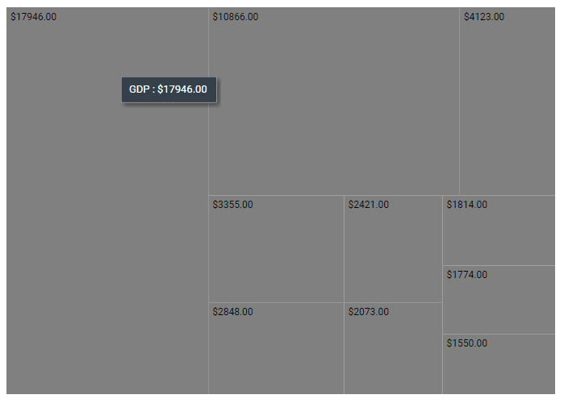

# Globalization in Blazor TreeMap Component

The [Blazor TreeMap](https://www.syncfusion.com/blazor-components/blazor-treemap) component supports globalization for the following elements:

* Data label
* Tooltip

Globalization enables a component to display numbers, dates, and times according to a specific culture or locale. The [Format](https://help.syncfusion.com/cr/blazor/Syncfusion.Blazor.TreeMap.SfTreeMap-1.html#Syncfusion_Blazor_TreeMap_SfTreeMap_1_Format) property globalize number, date, and time values in the TreeMap component.

In the following example, tooltips and data labels are formatted as currency based on the current application culture (for example, German).

```cshtml
@using Syncfusion.Blazor.TreeMap

<SfTreeMap WeightValuePath="GDP" DataSource="GrowthReports" Format="C">
    <TreeMapTooltipSettings Visible=true>
    </TreeMapTooltipSettings>
</SfTreeMap>

@code {
    public class GDPReport
    {
        public string State { get; set; }
        public double GDP { get; set; }
        public double Percentage { get; set; }
        public int Rank { get; set; }
    };

    public List<GDPReport> GrowthReports = new List<GDPReport> {
        new GDPReport {State = "United States", GDP = 17946, Percentage = 11.08, Rank = 1 },
        new GDPReport {State = "China", GDP = 10866, Percentage = 28.42, Rank = 2 },
        new GDPReport {State = "Japan", GDP = 4123, Percentage = -30.78, Rank = 3 },
        new GDPReport {State = "Germany", GDP = 3355, Percentage = -5.19, Rank = 4 },
        new GDPReport {State = "United Kingdom", GDP = 2848, Percentage = 8.28, Rank = 5 },
        new GDPReport {State = "France", GDP = 2421, Percentage = -9.69, Rank = 6 },
        new GDPReport {State = "India", GDP = 2073, Percentage = 13.65, Rank = 7 },
        new GDPReport {State = "Italy", GDP = 1814, Percentage = -12.45, Rank = 8 },
        new GDPReport {State = "Brazil", GDP = 1774, Percentage = -27.88, Rank = 9 },
        new GDPReport {State = "Canada", GDP = 1550, Percentage = -15.02, Rank = 10 }
    };
}

```

N> Refer to the [Blazor Localization](https://blazor.syncfusion.com/documentation/common/localization) topic to localize Syncfusion<sup style="font-size:70%">&reg;</sup> Blazor components.


