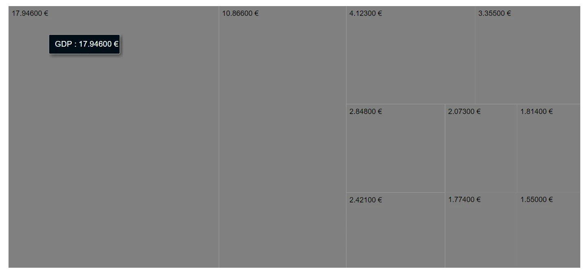

# Blazor TreeMap Internationalization

The [Blazor TreeMap](https://www.syncfusion.com/blazor-components/blazor-treemap) component supports globalization for the following elements:

* Data Label
* Tooltip

Globalization is the process of designing and developing a component that works in different cultures or locales. The [Format](https://help.syncfusion.com/cr/blazor/Syncfusion.Blazor.TreeMap.SfTreeMap-1.html#Syncfusion_Blazor_TreeMap_SfTreeMap_1_Format) property is used to globalize number, date, and time values in the TreeMap component.

In the following code example, the tooltip and data labels are globalized to currency format. The values are formatted according to the application's current culture; see the [Blazor Localization](https://blazor.syncfusion.com/documentation/common/localization) topic to configure a specific culture.

```cshtml
@using Syncfusion.Blazor.TreeMap

<SfTreeMap WeightValuePath="GDP" DataSource="GrowthReports" Format="C">
    <TreeMapTooltipSettings Visible=true>
    </TreeMapTooltipSettings>
</SfTreeMap>

@code {
    public class GDPReport
    {
        public string State { get; set; }
        public double GDP { get; set; }
        public double Percentage { get; set; }
        public int Rank { get; set; }
    };
    public List<GDPReport> GrowthReports = new List<GDPReport> {
            new GDPReport {State="United States", GDP=17946, Percentage=11.08, Rank=1},
            new GDPReport {State="China", GDP=10866, Percentage= 28.42, Rank=2},
            new GDPReport {State="Japan", GDP=4123, Percentage=-30.78, Rank=3},
            new GDPReport {State="Germany", GDP=3355, Percentage=-5.19, Rank=4},
            new GDPReport {State="United Kingdom", GDP=2848, Percentage=8.28, Rank=5},
            new GDPReport {State="France", GDP=2421, Percentage=-9.69, Rank=6},
            new GDPReport {State="India", GDP=2073, Percentage=13.65, Rank=7},
            new GDPReport {State="Italy", GDP=1814, Percentage=-12.45, Rank=8},
            new GDPReport {State="Brazil", GDP=1774, Percentage=-27.88, Rank=9},
            new GDPReport {State="Canada", GDP=1550, Percentage=-15.02, Rank=10}
    };
}
```

N> Refer to [Blazor Localization](https://blazor.syncfusion.com/documentation/common/localization) topic to localize Blazor components.



## See also

* [Blazor Localization](https://blazor.syncfusion.com/documentation/common/localization)
* [Formatting tooltip content](tooltip.md#formatting-tooltip-content)
* [Formatting labels](labels.md#formatting-labels)