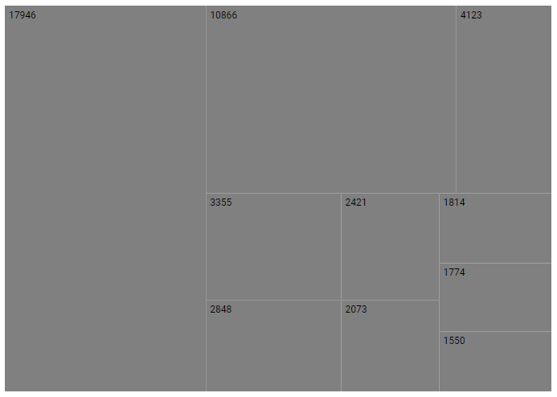
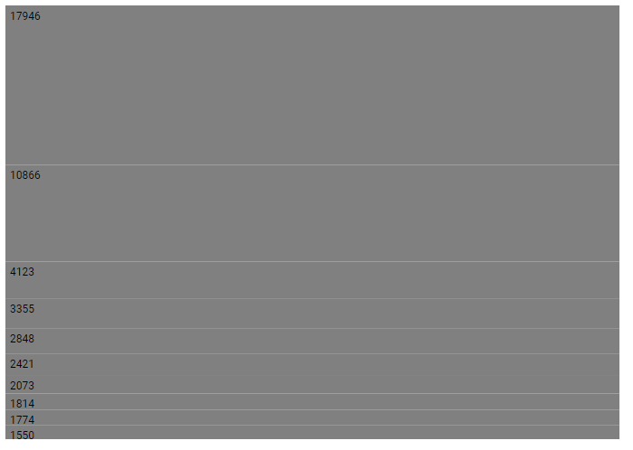
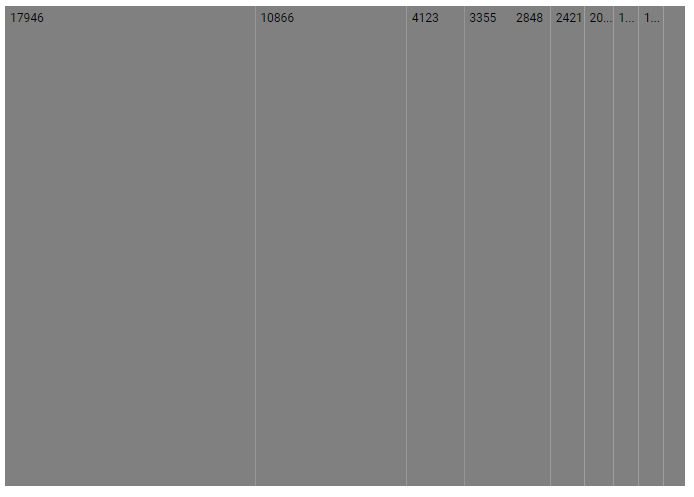
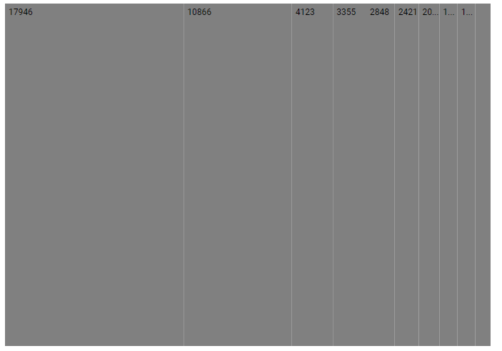
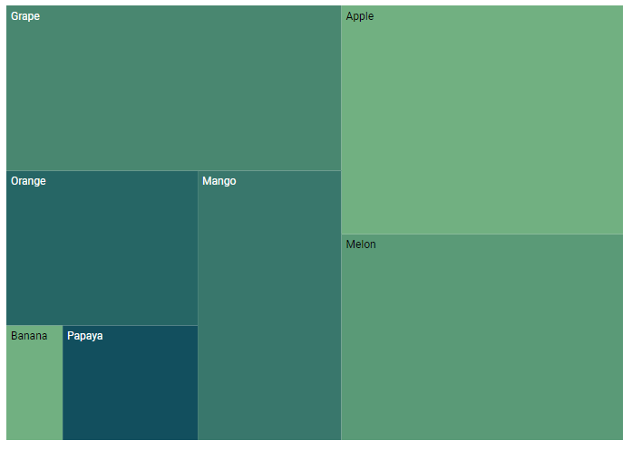
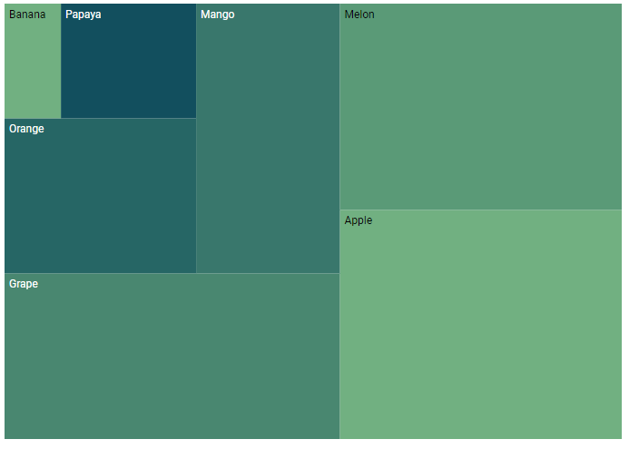
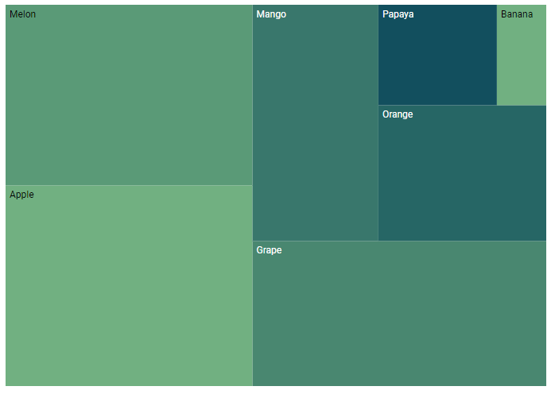

# Layout in Blazor TreeMap Component

Determine the visual representation of nodes belonging to all the TreeMap levels using the [LayoutType](https://help.syncfusion.com/cr/blazor/Syncfusion.Blazor.TreeMap.SfTreeMap-1.html#Syncfusion_Blazor_TreeMap_SfTreeMap_1_LayoutType) property.

## Types of layout

The available layout types are,

* [Squarified](https://help.syncfusion.com/cr/blazor/Syncfusion.Blazor.TreeMap.LayoutMode.html#Syncfusion_Blazor_TreeMap_LayoutMode_Squarified)
* [SliceAndDiceVertical](https://help.syncfusion.com/cr/blazor/Syncfusion.Blazor.TreeMap.LayoutMode.html#Syncfusion_Blazor_TreeMap_LayoutMode_SliceAndDiceVertical)
* [SliceAndDiceHorizontal](https://help.syncfusion.com/cr/blazor/Syncfusion.Blazor.TreeMap.LayoutMode.html#Syncfusion_Blazor_TreeMap_LayoutMode_SliceAndDiceHorizontal)
* [SliceAndDiceAuto](https://help.syncfusion.com/cr/blazor/Syncfusion.Blazor.TreeMap.LayoutMode.html#Syncfusion_Blazor_TreeMap_LayoutMode_SliceAndDiceAuto)

### Squarified

The [Squarified](https://help.syncfusion.com/cr/blazor/Syncfusion.Blazor.TreeMap.LayoutMode.html#Syncfusion_Blazor_TreeMap_LayoutMode_Squarified) layout displays the nested rectangles based on aspect ratio in the TreeMap. The rectangles will be split based on the height and width of the parent. The default rendering type of the layout is [Squarified](https://help.syncfusion.com/cr/aspnetcore-blazor/Syncfusion.Blazor.TreeMap.LayoutMode.html).

```cshtml
@using Syncfusion.Blazor.TreeMap

<SfTreeMap DataSource="GrowthReports" TValue="GDPReport" WeightValuePath="GDP">
</SfTreeMap>

@code {
    public class GDPReport
    {
        public string CountryName { get; set; }
        public double GDP { get; set; }
        public double Percentage { get; set; }
        public int Rank { get; set; }
    };
    public List<GDPReport> GrowthReports = new List<GDPReport> {
            new GDPReport {CountryName="United States", GDP=17946, Percentage=11.08, Rank=1},
            new GDPReport {CountryName="China", GDP=10866, Percentage= 28.42, Rank=2},
            new GDPReport {CountryName="Japan", GDP=4123, Percentage=-30.78, Rank=3},
            new GDPReport {CountryName="Germany", GDP=3355, Percentage=-5.19, Rank=4},
            new GDPReport {CountryName="United Kingdom", GDP=2848, Percentage=8.28, Rank=5},
            new GDPReport {CountryName="France", GDP=2421, Percentage=-9.69, Rank=6},
            new GDPReport {CountryName="India", GDP=2073, Percentage=13.65, Rank=7},
            new GDPReport {CountryName="Italy", GDP=1814, Percentage=-12.45, Rank=8},
            new GDPReport {CountryName="Brazil", GDP=1774, Percentage=-27.88, Rank=9},
            new GDPReport {CountryName="Canada", GDP=1550, Percentage=-15.02, Rank=10}
    };
}
```



### Slice and dice vertical

The [SliceAndDiceVertical](https://help.syncfusion.com/cr/aspnetcore-blazor/Syncfusion.Blazor.TreeMap.LayoutMode.html) layout creates rectangles with high aspect ratio and displays items in a vertically sorted order.

```cshtml
@using Syncfusion.Blazor.TreeMap;

<SfTreeMap DataSource="GrowthReports" TValue="GDPReport" WeightValuePath="GDP" LayoutType="LayoutMode.SliceAndDiceVertical">
</SfTreeMap>
```

N> Refer to the [code block](#squarified) to know about the property value of the **GrowthReports**.



### Slice and dice horizontal

The [SliceAndDiceHorizontal](https://help.syncfusion.com/cr/aspnetcore-blazor/Syncfusion.Blazor.TreeMap.LayoutMode.html) layout creates rectangles with high aspect ratio and displays items in a horizontally sorted order.

```cshtml
@using Syncfusion.Blazor.TreeMap;

<SfTreeMap DataSource="GrowthReports" TValue="GDPReport" WeightValuePath="GDP" LayoutType="LayoutMode.SliceAndDiceHorizontal">
</SfTreeMap>
```

N> Refer to the [code block](#squarified) to know about the property value of the **GrowthReports**.



### Slice and dice auto

The [SliceAndDiceAuto](https://help.syncfusion.com/cr/aspnetcore-blazor/Syncfusion.Blazor.TreeMap.LayoutMode.html) layout creates rectangles with high aspect ratio and displays items sorted both horizontally and vertically.

```cshtml
@using Syncfusion.Blazor.TreeMap;

<SfTreeMap DataSource="GrowthReports" TValue="GDPReport" WeightValuePath="GDP" LayoutType="LayoutMode.SliceAndDiceAuto">
</SfTreeMap>
```

N> Refer to the [code block](#squarified) to know about the property value of the **GrowthReports**.



## Rendering direction

The direction of the TreeMap item is [TopLeftBottomRight](https://help.syncfusion.com/cr/aspnetcore-blazor/Syncfusion.Blazor.TreeMap.RenderingMode.html) by default and customize the rendering direction of the TreeMap item by setting the [RenderDirection](https://help.syncfusion.com/cr/blazor/Syncfusion.Blazor.TreeMap.SfTreeMap-1.html#Syncfusion_Blazor_TreeMap_SfTreeMap_1_RenderDirection) property.

The TreeMap can be rendered in the following directions:

* [TopLeftBottomRight](https://help.syncfusion.com/cr/aspnetcore-blazor/Syncfusion.Blazor.TreeMap.RenderingMode.html),
* [TopRightBottomLeft](https://help.syncfusion.com/cr/aspnetcore-blazor/Syncfusion.Blazor.TreeMap.RenderingMode.html),
* [BottomRightTopLeft](https://help.syncfusion.com/cr/aspnetcore-blazor/Syncfusion.Blazor.TreeMap.RenderingMode.html)
* [BottomLeftTopRight](https://help.syncfusion.com/cr/aspnetcore-blazor/Syncfusion.Blazor.TreeMap.RenderingMode.html)

The following example shows, how to render the TreeMap in the RTL direction with [TopLeftBottomRight](https://help.syncfusion.com/cr/aspnetcore-blazor/Syncfusion.Blazor.TreeMap.RenderingMode.html).

```csharp
@using Syncfusion.Blazor.TreeMap;

<SfTreeMap DataSource="Fruits" TValue="Fruit" WeightValuePath="Count" Palette='new string[]{"#71B081","#5A9A77", "#498770", "#39776C", "#266665","#124F5E"}' RenderDirection="RenderingMode.TopLeftBottomRight">
    <TreeMapLeafItemSettings LabelPath="Name">
    </TreeMapLeafItemSettings>
    <TreeMapTooltipSettings Visible=true Format="${Count} : ${Name}">
    </TreeMapTooltipSettings>
</SfTreeMap>

@code{
    public class Fruit
    {
        public string Name { get; set; }
        public int Count { get; set; }
    };
    public List<Fruit> Fruits = new List<Fruit> {
        new Fruit { Name="Apple", Count=5000 },
        new Fruit { Name="Mango", Count=3000 },
        new Fruit { Name="Orange", Count=2300 },
        new Fruit { Name="Banana", Count=500 },
        new Fruit { Name="Grape", Count=4300 },
        new Fruit { Name="Papaya", Count=1200 },
        new Fruit { Name="Melon", Count=4500 }
    };
}
```


The following example shows, how to render the TreeMap in the RTL direction with [TopRightBottomLeft](https://help.syncfusion.com/cr/aspnetcore-blazor/Syncfusion.Blazor.TreeMap.RenderingMode.html).

```cshtml
@using Syncfusion.Blazor.TreeMap;

<SfTreeMap DataSource="Fruits" TValue="Fruit" WeightValuePath="Count" Palette='new string[]{"#71B081","#5A9A77", "#498770", "#39776C", "#266665","#124F5E"}' RenderDirection="RenderingMode.TopRightBottomLeft">
    <TreeMapLeafItemSettings LabelPath="Name">
    </TreeMapLeafItemSettings>
    <TreeMapTooltipSettings Visible=true Format="${Count} : ${Name}">
    </TreeMapTooltipSettings>
</SfTreeMap>
```

N> Refer to the [code block](#rendering-direction) to know about the property value of **Fruits**.



The following example shows, how to render the TreeMap in the RTL direction with [BottomRightTopLeft](https://help.syncfusion.com/cr/aspnetcore-blazor/Syncfusion.Blazor.TreeMap.RenderingMode.html).

```cshtml
@using Syncfusion.Blazor.TreeMap;

<SfTreeMap DataSource="Fruits" TValue="Fruit" WeightValuePath="Count" Palette='new string[]{"#71B081","#5A9A77", "#498770", "#39776C", "#266665","#124F5E"}' RenderDirection="RenderingMode.BottomRightTopLeft">
    <TreeMapLeafItemSettings LabelPath="Name">
    </TreeMapLeafItemSettings>
    <TreeMapTooltipSettings Visible=true Format="${Count} : ${Name}">
    </TreeMapTooltipSettings>
</SfTreeMap>
```

N> Refer to the [code block](#rendering-direction) to know about the property value of **Fruits**.



The following example shows, how to render the TreeMap in the RTL direction with [BottomLeftTopRight](https://help.syncfusion.com/cr/aspnetcore-blazor/Syncfusion.Blazor.TreeMap.RenderingMode.html).

```cshtml
@using Syncfusion.Blazor.TreeMap;

<SfTreeMap DataSource="Fruits" TValue="Fruit" WeightValuePath="Count" Palette='new string[]{"#71B081","#5A9A77", "#498770", "#39776C", "#266665","#124F5E"}' RenderDirection="RenderingMode.BottomLeftTopRight">
    <TreeMapLeafItemSettings LabelPath="Name">
    </TreeMapLeafItemSettings>
    <TreeMapTooltipSettings Visible=true Format="${Count} : ${Name}">
    </TreeMapTooltipSettings>
</SfTreeMap>
```

N> Refer to the [code block](#rendering-direction) to know about the property value of **Fruits**.

