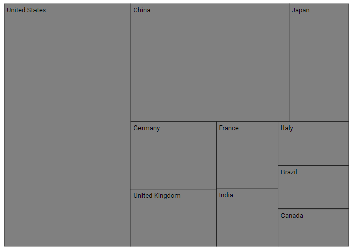
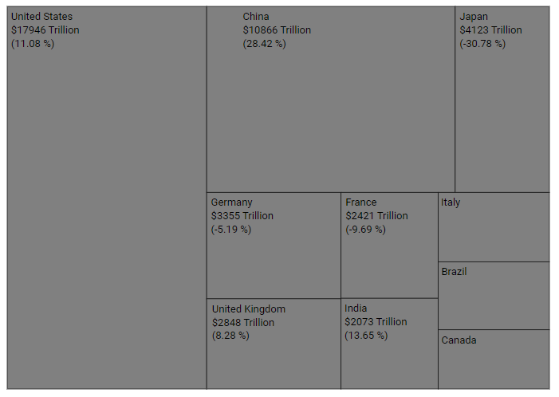
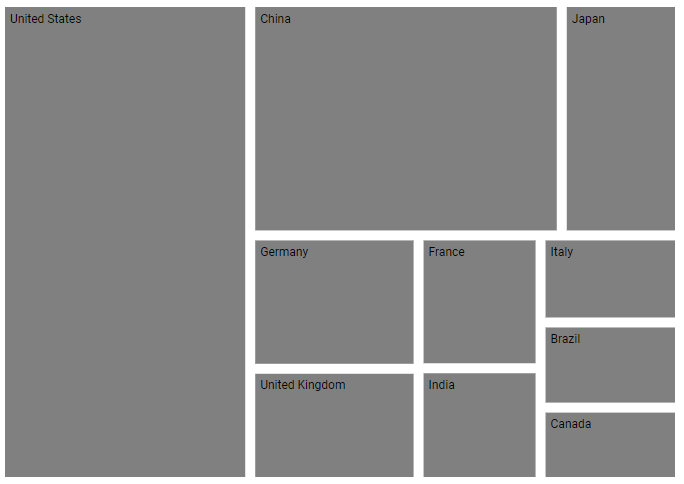

# Leaf Item in Blazor TreeMap Component

A leaf item defines a visualized data element and does not contain child nodes but contains parent node if the levels are specified in the TreeMap.

## Customization

The following properties are available to customize the leaf item in the [TreeMapLeafItemSettings](https://help.syncfusion.com/cr/aspnetcore-blazor/Syncfusion.Blazor.TreeMap.TreeMapLeafItemSettings.html).
* [LabelPath](https://help.syncfusion.com/cr/blazor/Syncfusion.Blazor.TreeMap.TreeMapLeafItemSettings.html) - Represents the item name, which is available in the data source.
* [Fill](https://help.syncfusion.com/cr/blazor/Syncfusion.Blazor.TreeMap.TreeMapLeafItemSettings.html) - Specifies the fill color for the leaf items.
* [Opacity](https://help.syncfusion.com/cr/blazor/Syncfusion.Blazor.TreeMap.TreeMapLeafItemSettings.html) - Specifies the opacity of leaf item fill color.
* [ShowLabels](https://help.syncfusion.com/cr/blazor/Syncfusion.Blazor.TreeMap.TreeMapLeafItemSettings.html#Syncfusion_Blazor_TreeMap_TreeMapLeafItemSettings_ShowLabels) - Specifies the visibility of the leaf item label.
* [Padding](https://help.syncfusion.com/cr/blazor/Syncfusion.Blazor.TreeMap.TreeMapLeafItemSettings.html) - Specifies the padding of leaf items
* [LabelTemplate](https://help.syncfusion.com/cr/blazor/Syncfusion.Blazor.TreeMap.TreeMapLeafItemSettings.html#Syncfusion_Blazor_TreeMap_TreeMapLeafItemSettings_LabelTemplate) - Specifies the template of leaf item label and the position of the template to be customized using the [TemplatePosition](https://help.syncfusion.com/cr/blazor/Syncfusion.Blazor.TreeMap.TreeMapLeafItemSettings.html#Syncfusion_Blazor_TreeMap_TreeMapLeafItemSettings_TemplatePosition) property.
* [TreeMapLeafLabelStyle](https://help.syncfusion.com/cr/aspnetcore-blazor/Syncfusion.Blazor.TreeMap.TreeMapLeafLabelStyle.html) - To customize the label color, opacity, font size, font family, font weight and font style.
* [TreeMapLeafBorder](https://help.syncfusion.com/cr/aspnetcore-blazor/Syncfusion.Blazor.TreeMap.TreeMapLeafBorder.html) - Specifies leaf item border color and width.

In the following example, the name of the property **CountryName** from data source is mapped to [LabelPath](https://help.syncfusion.com/cr/blazor/Syncfusion.Blazor.TreeMap.TreeMapLeafItemSettings.html) property, so corresponding country name will be displayed in the label.

```cshtml
@using Syncfusion.Blazor.TreeMap

<SfTreeMap DataSource="GrowthReports" TValue="GDPReport" WeightValuePath="GDP">
    <TreeMapLeafItemSettings LabelPath="CountryName">
        <TreeMapLeafLabelStyle Color="#000000"></TreeMapLeafLabelStyle>
        <TreeMapLeafBorder Color="#000000" Width="0.5"></TreeMapLeafBorder>
    </TreeMapLeafItemSettings>
</SfTreeMap>

@code{
    public class GDPReport
    {
        public string CountryName { get; set; }
        public double GDP { get; set; }
        public double Percentage { get; set; }
        public int Rank { get; set; }
    };
    public List<GDPReport> GrowthReports = new List<GDPReport> {
            new GDPReport {CountryName="United States", GDP=17946, Percentage=11.08, Rank=1},
            new GDPReport {CountryName="China", GDP=10866, Percentage= 28.42, Rank=2},
            new GDPReport {CountryName="Japan", GDP=4123, Percentage=-30.78, Rank=3},
            new GDPReport {CountryName="Germany", GDP=3355, Percentage=-5.19, Rank=4},
            new GDPReport {CountryName="United Kingdom", GDP=2848, Percentage=8.28, Rank=5},
            new GDPReport {CountryName="France", GDP=2421, Percentage=-9.69, Rank=6},
            new GDPReport {CountryName="India", GDP=2073, Percentage=13.65, Rank=7},
            new GDPReport {CountryName="Italy", GDP=1814, Percentage=-12.45, Rank=8},
            new GDPReport {CountryName="Brazil", GDP=1774, Percentage=-27.88, Rank=9},
            new GDPReport {CountryName="Canada", GDP=1550, Percentage=-15.02, Rank=10}
    };
}
```



## Label position and format

Positioning the leaf item label using the [LabelPosition](https://help.syncfusion.com/cr/aspnetcore-blazor/Syncfusion.Blazor.TreeMap.LabelPosition.html) property and the text format can be customized by specifying data source properties name in the [LabelFormat](https://help.syncfusion.com/cr/blazor/Syncfusion.Blazor.TreeMap.TreeMapLeafItemSettings.html#Syncfusion_Blazor_TreeMap_TreeMapLeafItemSettings_LabelFormat) property.

```cshtml
@using Syncfusion.Blazor.TreeMap

<SfTreeMap DataSource="GrowthReports" TValue="GDPReport" WeightValuePath="GDP">
    <TreeMapLeafItemSettings LabelPath="CountryName" LabelPosition="LabelPosition.TopCenter" LabelFormat="${CountryName}<br>$${GDP} Trillion<br>(${Percentage} %)">
        <TreeMapLeafLabelStyle Color="#000000"></TreeMapLeafLabelStyle>
        <TreeMapLeafBorder Color="#000000" Width="0.5"></TreeMapLeafBorder>
    </TreeMapLeafItemSettings>
</SfTreeMap>
```

N> Refer to the [code block](#customization) to know about the property value of the **GrowthReports**.



## Gap between the leaf items

The [Gap](https://help.syncfusion.com/cr/blazor/Syncfusion.Blazor.TreeMap.TreeMapLeafItemSettings.html#Syncfusion_Blazor_TreeMap_TreeMapLeafItemSettings_Gap) property is used to separate an item from another item. Each item rectangle is split into equal space with specified gap.

```cshtml
@using Syncfusion.Blazor.TreeMap

<SfTreeMap DataSource="GrowthReports" TValue="GDPReport" WeightValuePath="GDP">
    <TreeMapLeafItemSettings LabelPath="CountryName" Gap="20">
    </TreeMapLeafItemSettings>
</SfTreeMap>
```

N> Refer to the [code block](#customization) to know about the property value of the **GrowthReports**.

