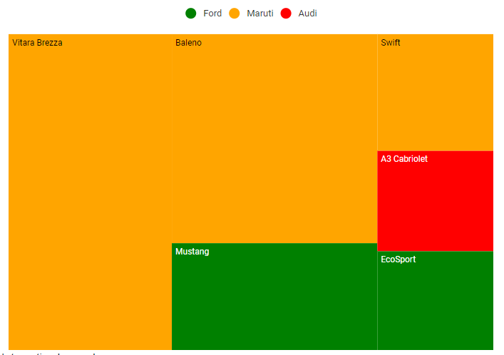
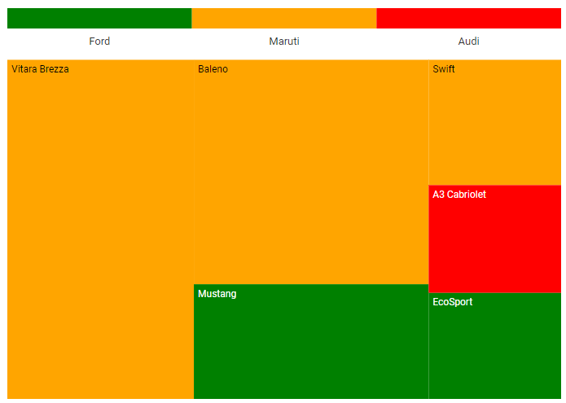
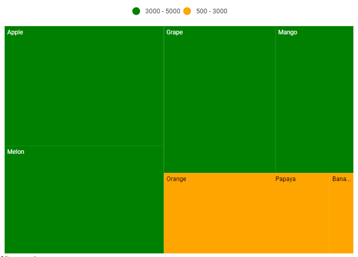
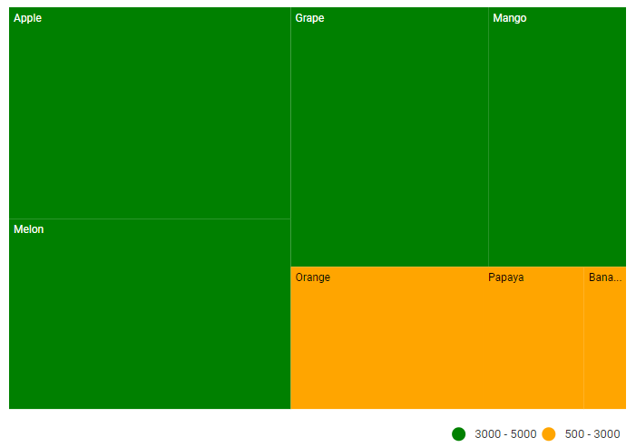
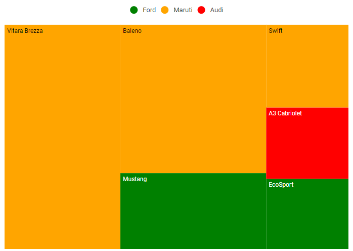
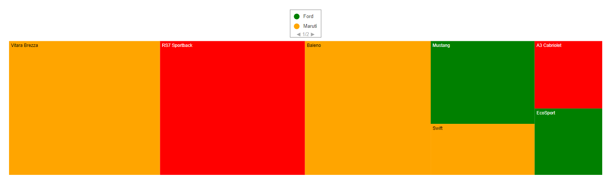
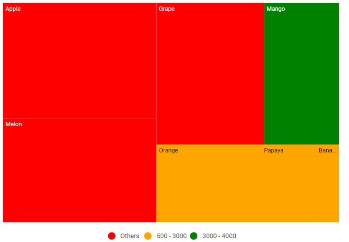
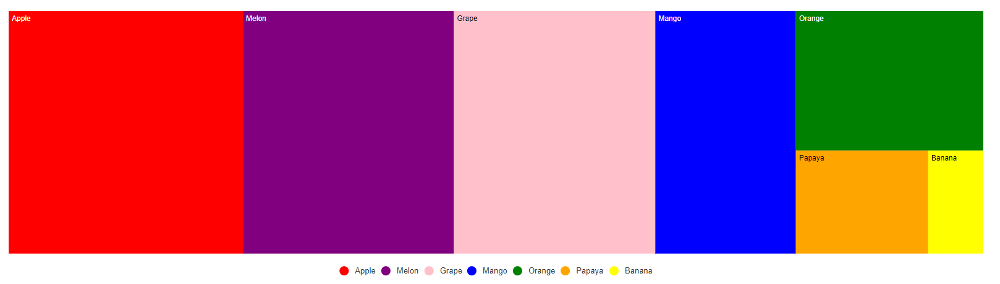
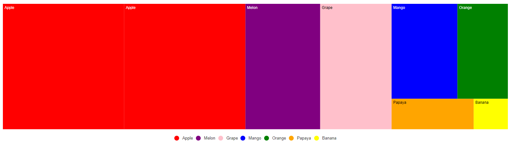
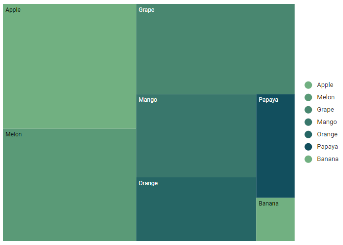

# Legend in Blazor TreeMap Component

A legend provides contextual information that helps interpret the values displayed in a TreeMap. Legends can use colors, shapes, or other identifiers based on the mapped data.

The following video demonstrates legend customization in the Blazor TreeMap component.



## Types of legend

The TreeMap component supports two legend modes:

* [Default](https://help.syncfusion.com/cr/blazor/Syncfusion.Blazor.TreeMap.LegendMode.html#Syncfusion_Blazor_TreeMap_LegendMode_Default)
* [Interactive](https://help.syncfusion.com/cr/blazor/Syncfusion.Blazor.TreeMap.LegendMode.html#Syncfusion_Blazor_TreeMap_LegendMode_Interactive)

### Default legend

In default mode, legends display symbols with labels that identify items in the TreeMap.

```cshtml

@using Syncfusion.Blazor.TreeMap

<SfTreeMap DataSource="Cars" TValue="Car" WeightValuePath="Count" EqualColorValuePath="Brand">
    <TreeMapLeafItemSettings LabelPath="Name">
        <TreeMapLeafColorMappings>
            <TreeMapLeafColorMapping LeafValue="Ford" Color='new string[]{ "green" }'></TreeMapLeafColorMapping>
            <TreeMapLeafColorMapping LeafValue="Audi" Color='new string[]{ "red" }'></TreeMapLeafColorMapping>
            <TreeMapLeafColorMapping LeafValue="Maruti" Color='new string[]{ "orange" }'></TreeMapLeafColorMapping>
        </TreeMapLeafColorMappings>
    </TreeMapLeafItemSettings>
    <TreeMapLegendSettings Visible="true" Position="LegendPosition.Top">
    </TreeMapLegendSettings>
</SfTreeMap>

@code {
    public class Car
    {
        public string Name { get; set; }
        public string Brand { get; set; }
        public int Count { get; set; }
    };

    public List<Car> Cars = new List<Car> {
        new Car { Name = "Mustang", Brand = "Ford", Count = 232 },
        new Car { Name = "EcoSport", Brand = "Ford", Count = 121 },
        new Car { Name = "Swift", Brand = "Maruti", Count = 143 },
        new Car { Name = "Baleno", Brand = "Maruti", Count = 454 },
        new Car { Name = "Vitara Brezza", Brand = "Maruti", Count = 545 },
        new Car { Name = "A3 Cabriolet", Brand = "Audi", Count = 123 }
    };
}

```



### Interactive legend

Interactive mode highlights the exact range color in the legend with an arrow indicator when hovering over a TreeMap item. Enable this by setting the [Mode](https://help.syncfusion.com/cr/blazor/Syncfusion.Blazor.TreeMap.TreeMapLegendSettings.html#Syncfusion_Blazor_TreeMap_TreeMapLegendSettings_Mode) property in [TreeMapLegendSettings](https://help.syncfusion.com/cr/blazor/Syncfusion.Blazor.TreeMap.TreeMapLegendSettings.html) to [Interactive](https://help.syncfusion.com/cr/blazor/Syncfusion.Blazor.TreeMap.LegendMode.html#Syncfusion_Blazor_TreeMap_LegendMode_Interactive).

```cshtml

@using Syncfusion.Blazor.TreeMap

<SfTreeMap DataSource="Cars" TValue="Car" WeightValuePath="Count" EqualColorValuePath="Brand">
    <TreeMapLeafItemSettings LabelPath="Name">
        <TreeMapLeafColorMappings>
            <TreeMapLeafColorMapping LeafValue="Ford" Color='new string[]{ "green" }'></TreeMapLeafColorMapping>
            <TreeMapLeafColorMapping LeafValue="Audi" Color='new string[]{ "red" }'></TreeMapLeafColorMapping>
            <TreeMapLeafColorMapping LeafValue="Maruti" Color='new string[]{ "orange" }'></TreeMapLeafColorMapping>
        </TreeMapLeafColorMappings>
    </TreeMapLeafItemSettings>
    <TreeMapLegendSettings Visible="true" Position="LegendPosition.Top" Mode="LegendMode.Interactive">
    </TreeMapLegendSettings>
</SfTreeMap>

```

N> Refer to the [code block](#default-legend) for the **Cars** data source.



## Position and Alignment

Legend position determines where the legend is placed, and items are arranged accordingly. When positioned at [Top](https://help.syncfusion.com/cr/blazor/Syncfusion.Blazor.TreeMap.LegendPosition.html#Syncfusion_Blazor_TreeMap_LegendPosition_Top) or [Bottom](https://help.syncfusion.com/cr/blazor/Syncfusion.Blazor.TreeMap.LegendPosition.html#Syncfusion_Blazor_TreeMap_LegendPosition_Bottom), items are arranged in rows. When positioned at [Left](https://help.syncfusion.com/cr/blazor/Syncfusion.Blazor.TreeMap.LegendPosition.html#Syncfusion_Blazor_TreeMap_LegendPosition_Left) or [Right](https://help.syncfusion.com/cr/blazor/Syncfusion.Blazor.TreeMap.LegendPosition.html#Syncfusion_Blazor_TreeMap_LegendPosition_Right), items are arranged in columns.

The following options are available for legend position:

* [Top](https://help.syncfusion.com/cr/blazor/Syncfusion.Blazor.TreeMap.LegendPosition.html#Syncfusion_Blazor_TreeMap_LegendPosition_Top)
* [Bottom](https://help.syncfusion.com/cr/blazor/Syncfusion.Blazor.TreeMap.LegendPosition.html#Syncfusion_Blazor_TreeMap_LegendPosition_Bottom)
* [Left](https://help.syncfusion.com/cr/blazor/Syncfusion.Blazor.TreeMap.LegendPosition.html#Syncfusion_Blazor_TreeMap_LegendPosition_Left)
* [Right](https://help.syncfusion.com/cr/blazor/Syncfusion.Blazor.TreeMap.LegendPosition.html#Syncfusion_Blazor_TreeMap_LegendPosition_Right)
* [Float](https://help.syncfusion.com/cr/blazor/Syncfusion.Blazor.TreeMap.LegendPosition.html#Syncfusion_Blazor_TreeMap_LegendPosition_Float)
* [Auto](https://help.syncfusion.com/cr/blazor/Syncfusion.Blazor.TreeMap.LegendPosition.html#Syncfusion_Blazor_TreeMap_LegendPosition_Auto)

```cshtml

@using Syncfusion.Blazor.TreeMap

<SfTreeMap DataSource="Fruits" TValue="Fruit" WeightValuePath="Count" RangeColorValuePath="Count">
    <TreeMapLeafItemSettings LabelPath="FruitName">
        <TreeMapLeafColorMappings>
            <TreeMapLeafColorMapping StartRange="500" EndRange="3000" Color='new string[] { "Orange" }'></TreeMapLeafColorMapping>
            <TreeMapLeafColorMapping StartRange="3000" EndRange="5000" Color='new string[] { "Green" }'></TreeMapLeafColorMapping>
        </TreeMapLeafColorMappings>
    </TreeMapLeafItemSettings>
    <TreeMapLegendSettings Visible="true" Position="LegendPosition.Top"></TreeMapLegendSettings>
</SfTreeMap>

@code {
    public class Fruit
    {
        public string FruitName { get; set; }
        public double Count { get; set; }
    };

    public List<Fruit> Fruits = new List<Fruit> {
        new Fruit { FruitName = "Apple", Count = 5000 },
        new Fruit { FruitName = "Mango", Count = 3000 },
        new Fruit { FruitName = "Orange", Count = 2300 },
        new Fruit { FruitName = "Banana", Count = 500 },
        new Fruit { FruitName = "Grape", Count = 4300 },
        new Fruit { FruitName = "Papaya", Count = 1200 },
        new Fruit { FruitName = "Melon", Count = 4500 }
    };
}

```



Legend alignment controls how items are aligned within the legend area. The available options are:

* [Near](https://help.syncfusion.com/cr/blazor/Syncfusion.Blazor.TreeMap.Alignment.html#Syncfusion_Blazor_TreeMap_Alignment_Near)
* [Center](https://help.syncfusion.com/cr/blazor/Syncfusion.Blazor.TreeMap.Alignment.html#Syncfusion_Blazor_TreeMap_Alignment_Center)
* [Far](https://help.syncfusion.com/cr/blazor/Syncfusion.Blazor.TreeMap.Alignment.html#Syncfusion_Blazor_TreeMap_Alignment_Far)

```cshtml

@using Syncfusion.Blazor.TreeMap

<SfTreeMap DataSource="Fruits" TValue="Fruit" WeightValuePath="Count" RangeColorValuePath="Count">
    <TreeMapLeafItemSettings LabelPath="FruitName">
        <TreeMapLeafColorMappings>
            <TreeMapLeafColorMapping StartRange="500" EndRange="3000" Color='new string[]{"Orange"}'></TreeMapLeafColorMapping>
            <TreeMapLeafColorMapping StartRange="3000" EndRange="5000" Color='new string[]{"Green"}'></TreeMapLeafColorMapping>
        </TreeMapLeafColorMappings>
    </TreeMapLeafItemSettings>
    <TreeMapLegendSettings Visible="true" Alignment="Alignment.Far">
    </TreeMapLegendSettings>
</SfTreeMap>

```

N> Refer to the [code block](#position-and-alignment) for the **Fruits** data source.



## Legend size

Customize the legend size by setting the [Height](https://help.syncfusion.com/cr/blazor/Syncfusion.Blazor.TreeMap.TreeMapLegendSettings.html#Syncfusion_Blazor_TreeMap_TreeMapLegendSettings_Height) and [Width](https://help.syncfusion.com/cr/blazor/Syncfusion.Blazor.TreeMap.TreeMapLegendSettings.html#Syncfusion_Blazor_TreeMap_TreeMapLegendSettings_Width) properties in [TreeMapLegendSettings](https://help.syncfusion.com/cr/blazor/Syncfusion.Blazor.TreeMap.TreeMapLegendSettings.html). Values can be specified in pixels or percentages.

```cshtml

@using Syncfusion.Blazor.TreeMap

<SfTreeMap DataSource="Cars" WeightValuePath="Count" EqualColorValuePath="Brand">
    <TreeMapLeafItemSettings LabelPath="Name">
        <TreeMapLeafColorMappings>
            <TreeMapLeafColorMapping LeafValue="Ford" Color='new string[] { "green"}'></TreeMapLeafColorMapping>
            <TreeMapLeafColorMapping LeafValue="Audi" Color='new string[] { "red" }'></TreeMapLeafColorMapping>
            <TreeMapLeafColorMapping LeafValue="Maruti" Color='new string[] { "orange"}'></TreeMapLeafColorMapping>
        </TreeMapLeafColorMappings>
    </TreeMapLeafItemSettings>
    <TreeMapLegendSettings Visible="true" Height="50px" Width="200px" Position="LegendPosition.Top">
    </TreeMapLegendSettings>
</SfTreeMap>

@code {
    public class Car
    {
        public string Name { get; set; }
        public string Brand { get; set; }
        public int Count { get; set; }
    };

    public List<Car> Cars = new List<Car> {
        new Car { Name = "Mustang", Brand = "Ford", Count = 232 },
        new Car { Name = "EcoSport", Brand = "Ford", Count = 121 },
        new Car { Name = "Swift", Brand = "Maruti", Count = 143 },
        new Car { Name = "Baleno", Brand = "Maruti", Count = 454 },
        new Car { Name = "Vitara Brezza", Brand = "Maruti", Count = 545 },
        new Car { Name = "A3 Cabriolet", Brand = "Audi", Count = 123 },
        new Car { Name = "RS7 Sportback", Brand = "Audi", Count = 523 }
    };
}

```



### Legend with paging support

Legend paging is automatically enabled when legend items do not fit within the specified [Height](https://help.syncfusion.com/cr/blazor/Syncfusion.Blazor.TreeMap.TreeMapLegendSettings.html#Syncfusion_Blazor_TreeMap_TreeMapLegendSettings_Height) and [Width](https://help.syncfusion.com/cr/blazor/Syncfusion.Blazor.TreeMap.TreeMapLegendSettings.html#Syncfusion_Blazor_TreeMap_TreeMapLegendSettings_Width).

```cshtml

@using Syncfusion.Blazor.TreeMap

<SfTreeMap DataSource="Cars" TValue="Car" WeightValuePath="Count" EqualColorValuePath="Brand">
    <TreeMapLeafItemSettings LabelPath="Name">
        <TreeMapLeafColorMappings>
            <TreeMapLeafColorMapping LeafValue="Ford" Color='new string[] { "green" }'></TreeMapLeafColorMapping>
            <TreeMapLeafColorMapping LeafValue="Audi" Color='new string[] { "red" }'></TreeMapLeafColorMapping>
            <TreeMapLeafColorMapping LeafValue="Maruti" Color='new string[] { "orange" }'></TreeMapLeafColorMapping>
        </TreeMapLeafColorMappings>
    </TreeMapLeafItemSettings>
    <TreeMapLegendSettings Visible="true" Height="50px" Width="100px" Position="LegendPosition.Top">
        <TreeMapLegendBorder Width="1"></TreeMapLegendBorder>
    </TreeMapLegendSettings>
</SfTreeMap>

@code {
    public class Car
    {
        public string Name { get; set; }
        public string Brand { get; set; }
        public int Count { get; set; }
    };

    public List<Car> Cars = new List<Car> {
        new Car { Name = "Mustang", Brand = "Ford", Count = 232},
        new Car { Name = "EcoSport", Brand = "Ford", Count = 121},
        new Car { Name = "Swift", Brand = "Maruti", Count = 143},
        new Car { Name = "Baleno", Brand = "Maruti", Count = 454},
        new Car { Name = "Vitara Brezza", Brand = "Maruti", Count = 545},
        new Car { Name = "A3 Cabriolet", Brand = "Audi", Count = 123},
        new Car { Name = "RS7 Sportback", Brand = "Audi", Count = 523 }
    };
}

```



## Excluded legend items from the color mapping

Based on the defined mapping ranges, excluded ranges are identified and shown in the legend as items representing values not covered by explicit ranges.

```cshtml

@using Syncfusion.Blazor.TreeMap

<SfTreeMap DataSource="Fruits" TValue="Fruit" WeightValuePath="Count" RangeColorValuePath="Count">
    <TreeMapLeafItemSettings LabelPath="FruitName">
        <TreeMapLeafColorMappings>
            <TreeMapLeafColorMapping StartRange="500" EndRange="3000" Color='new string[] { "Orange" }'></TreeMapLeafColorMapping>
            <TreeMapLeafColorMapping StartRange="3000" EndRange="4000" Color='new string[] { "Green" }' ></TreeMapLeafColorMapping>
            <TreeMapLeafColorMapping Color='new string[] { "red" }'></TreeMapLeafColorMapping>
        </TreeMapLeafColorMappings>
    </TreeMapLeafItemSettings>
    <TreeMapLegendSettings Visible="true">
    </TreeMapLegendSettings>
</SfTreeMap>

@code {
    public class Fruit
    {
        public string FruitName { get; set; }
        public double Count { get; set; }
    };

    public List<Fruit> Fruits = new List<Fruit> {
        new Fruit { FruitName = "Apple", Count = 5000 },
        new Fruit { FruitName = "Mango", Count = 3000 },
        new Fruit { FruitName = "Orange", Count = 2300 },
        new Fruit { FruitName = "Banana", Count = 500 },
        new Fruit { FruitName = "Grape", Count = 4300 },
        new Fruit { FruitName = "Papaya", Count = 1200 },
        new Fruit { FruitName = "Melon", Count = 4500 }
    };
}

```



## Hide desired legend items

Control legend visibility for individual color mappings by setting the [ShowLegend](https://help.syncfusion.com/cr/blazor/Syncfusion.Blazor.TreeMap.TreeMapLeafColorMapping.html#Syncfusion_Blazor_TreeMap_TreeMapLeafColorMapping_ShowLegend) property on each mapping in [TreeMapLeafColorMappings](https://help.syncfusion.com/cr/blazor/Syncfusion.Blazor.TreeMap.TreeMapLeafItemSettings.html#Syncfusion_Blazor_TreeMap_TreeMapLeafItemSettings_ColorMapping).

```cshtml
@using Syncfusion.Blazor.TreeMap

<SfTreeMap DataSource="Fruits" TValue="Fruit" WeightValuePath="Count" RangeColorValuePath="Count">
    <TreeMapLeafItemSettings LabelPath="FruitName">
        <TreeMapLeafColorMappings>
            <TreeMapLeafColorMapping StartRange="500" EndRange="3000" Color='new string[] { "Orange" }'></TreeMapLeafColorMapping>
            <TreeMapLeafColorMapping StartRange="3000" EndRange="4000" Color='new string[] { "Green" }' ShowLegend="false"></TreeMapLeafColorMapping>
            <TreeMapLeafColorMapping Color='new string[] { "red" }'></TreeMapLeafColorMapping>
        </TreeMapLeafColorMappings>
    </TreeMapLeafItemSettings>
    <TreeMapLegendSettings Visible="true">
    </TreeMapLegendSettings>
</SfTreeMap>

@code {
    public class Fruit
    {
        public string FruitName { get; set; }
        public double Count { get; set; }
    };

    public List<Fruit> Fruits = new List<Fruit> {
        new Fruit { FruitName = "Apple", Count = 5000 },
        new Fruit { FruitName = "Mango", Count = 3000 },
        new Fruit { FruitName = "Orange", Count = 2300 },
        new Fruit { FruitName = "Banana", Count = 500 },
        new Fruit { FruitName = "Grape", Count = 4300 },
        new Fruit { FruitName = "Papaya", Count = 1200 },
        new Fruit { FruitName = "Melon", Count = 4500 }
    };
}
```


## Hide legend items based on the data source value

Control legend visibility per item through the data source by binding the appropriate field to the [ShowLegendPath](https://help.syncfusion.com/cr/blazor/Syncfusion.Blazor.TreeMap.TreeMapLegendSettings.html#Syncfusion_Blazor_TreeMap_TreeMapLegendSettings_ShowLegendPath) property in [TreeMapLegendSettings](https://help.syncfusion.com/cr/blazor/Syncfusion.Blazor.TreeMap.TreeMapLegendSettings.html).

```cshtml
@using Syncfusion.Blazor.TreeMap

<SfTreeMap DataSource="Fruits" TValue="Fruit" WeightValuePath="Count" ColorValuePath="Color">
    <TreeMapLeafItemSettings LabelPath="Name">
    </TreeMapLeafItemSettings>
    <TreeMapLegendSettings Visible="true" ShowLegendPath="Visibility">
    </TreeMapLegendSettings>
</SfTreeMap>

@code {
    public class Fruit
    {
        public string Name { get; set; }
        public int Count { get; set; }
        public bool Visibility { get; set; }
        public string Color { get; set; }
    };

    public List<Fruit> Fruits = new List<Fruit> {
        new Fruit { Name = "Apple", Count = 5000, Visibility = true , Color = "red" },
        new Fruit { Name = "Mango", Count = 3000, Visibility = false , Color = "blue" },
        new Fruit { Name = "Orange", Count = 2300, Visibility = true , Color = "green" },
        new Fruit { Name = "Banana", Count = 500, Visibility = false , Color = "yellow" },
        new Fruit { Name = "Grape", Count = 4300, Visibility = true , Color = "pink" },
        new Fruit { Name = "Papaya", Count = 1200, Visibility = false, Color = "orange" },
        new Fruit { Name = "Melon", Count = 4500, Visibility = true , Color = "purple" }
    };
}

```


## Bind legend item text from the data source

Bind legend text from the data source by setting the [ValuePath](https://help.syncfusion.com/cr/blazor/Syncfusion.Blazor.TreeMap.TreeMapLegendSettings.html#Syncfusion_Blazor_TreeMap_TreeMapLegendSettings_ValuePath) property in [TreeMapLegendSettings](https://help.syncfusion.com/cr/blazor/Syncfusion.Blazor.TreeMap.TreeMapLegendSettings.html).

```cshtml

@using Syncfusion.Blazor.TreeMap

<SfTreeMap DataSource="Fruits" TValue="Fruit" WeightValuePath="Count" ColorValuePath="Color">
    <TreeMapLeafItemSettings LabelPath="Name">
    </TreeMapLeafItemSettings>
    <TreeMapLegendSettings Visible="true" ValuePath="Name">
    </TreeMapLegendSettings>
</SfTreeMap>

@code {
    public class Fruit
    {
        public string Name { get; set; }
        public int Count { get; set; }
        public string Color { get; set; }
    };

    public List<Fruit> Fruits = new List<Fruit> {
        new Fruit { Name = "Apple", Count = 5000, Color = "red" },
        new Fruit { Name = "Mango", Count = 3000, Color = "blue" },
        new Fruit { Name = "Orange", Count = 2300, Color = "green" },
        new Fruit { Name = "Banana", Count = 500, Color = "yellow" },
        new Fruit { Name = "Grape", Count = 4300, Color = "pink" },
        new Fruit { Name = "Papaya", Count = 1200, Color = "orange" },
        new Fruit { Name = "Melon", Count = 4500, Color = "purple" }
    };
}

```



## Hide duplicate legend items

Remove duplicate legend items by setting the [RemoveDuplicateLegend](https://help.syncfusion.com/cr/blazor/Syncfusion.Blazor.TreeMap.TreeMapLegendSettings.html#Syncfusion_Blazor_TreeMap_TreeMapLegendSettings_RemoveDuplicateLegend) property to true in [TreeMapLegendSettings](https://help.syncfusion.com/cr/blazor/Syncfusion.Blazor.TreeMap.TreeMapLegendSettings.html).

```cshtml

@using Syncfusion.Blazor.TreeMap

<SfTreeMap DataSource="Fruits" TValue="Fruit" WeightValuePath="Count" ColorValuePath="Color">
    <TreeMapLeafItemSettings LabelPath="Name">
    </TreeMapLeafItemSettings>
    <TreeMapLegendSettings Visible="true" ValuePath="Name" RemoveDuplicateLegend="true">
    </TreeMapLegendSettings>
</SfTreeMap>

@code {
    public class Fruit
    {
        public string Name { get; set; }
        public int Count { get; set; }
        public string Color { get; set; }
    };

    public List<Fruit> Fruits = new List<Fruit> {
        new Fruit { Name = "Apple", Count = 5000, Color = "red" },
        new Fruit { Name = "Apple", Count = 2300, Color = "yellow" },
        new Fruit { Name = "Mango", Count = 3000, Color = "blue" },
        new Fruit { Name = "Orange", Count = 2300, Color = "green" },
        new Fruit { Name = "Banana", Count = 500, Color = "yellow" },
        new Fruit { Name = "Grape", Count = 4300, Color = "pink" },
        new Fruit { Name = "Papaya", Count = 1200, Color = "orange" },
        new Fruit { Name = "Melon", Count = 4500, Color = "purple"}
    };
}

```



## Positioning based on size

Use a responsive legend that switches between the right and bottom positions based on available height and width. To enable this behavior, set [Position](https://help.syncfusion.com/cr/blazor/Syncfusion.Blazor.TreeMap.LegendPosition.html) property to [Auto](https://help.syncfusion.com/cr/blazor/Syncfusion.Blazor.TreeMap.LegendPosition.html#Syncfusion_Blazor_TreeMap_LegendPosition_Auto) in [TreeMapLegendSettings](https://help.syncfusion.com/cr/blazor/Syncfusion.Blazor.TreeMap.TreeMapLegendSettings.html). The position adjusts automatically based on the available space.

```cshtml

@using Syncfusion.Blazor.TreeMap

<SfTreeMap DataSource="Fruits" TValue="Fruit" WeightValuePath="Count" Width="700px" Height="500px" Palette='new string[] { "#71B081", "#5A9A77", "#498770", "#39776C", "#266665", "#124F5E" }'>
    <TreeMapLeafItemSettings LabelPath="Name">
    </TreeMapLeafItemSettings>
    <TreeMapLegendSettings Visible="true" Position="LegendPosition.Auto">
    </TreeMapLegendSettings>
</SfTreeMap>

@code {
    public class Fruit
    {
        public string Name { get; set; }
        public int Count { get; set; }
    };

    public List<Fruit> Fruits = new List<Fruit> {
        new Fruit { Name = "Apple", Count = 5000 },
        new Fruit { Name = "Mango", Count = 3000 },
        new Fruit { Name = "Orange", Count = 2300 },
        new Fruit { Name = "Banana", Count = 500 },
        new Fruit { Name = "Grape", Count = 4300 },
        new Fruit { Name = "Papaya", Count = 1200 },
        new Fruit { Name = "Melon", Count = 4500 }
    };
}

```



## Legend with RTL support

Set [EnableRtl](https://help.syncfusion.com/cr/blazor/Syncfusion.Blazor.TreeMap.SfTreeMap-1.html#Syncfusion_Blazor_TreeMap_SfTreeMap_1_EnableRtl) property to **true** to render the legend icon on the right and the legend text on the left.

```cshtml

@using Syncfusion.Blazor.TreeMap

<SfTreeMap DataSource="Cars" WeightValuePath="Count" ColorValuePath="Color" EnableRtl="true">
    <TreeMapLeafItemSettings LabelPath="Name">
    </TreeMapLeafItemSettings>
    <TreeMapLegendSettings Visible="true" Position="LegendPosition.Top">
    </TreeMapLegendSettings>
</SfTreeMap>

@code {
    public class Car
    {
        public string Name { get; set; }
        public string Brand { get; set; }
        public int Count { get; set; }
        public string Color { get; set; }
    };

    public List<Car> Cars = new List<Car> {
        new Car { Name = "Mustang", Brand = "Ford", Count = 232, Color = "#71B081" },
        new Car { Name = "EcoSport", Brand = "Ford", Count = 121,  Color = "#5A9A77" },
        new Car { Name = "Swift", Brand = "Maruti", Count = 143, Color = "#498770" },
        new Car { Name = "Baleno", Brand = "Maruti", Count = 454, Color = "#39776C" },
        new Car { Name = "Vitara Brezza", Brand = "Maruti", Count = 545 , Color = "#266665" },
        new Car { Name = "A3 Cabriolet", Brand = "Audi", Count = 123, Color = "#124F5E" }
    };
}

```


