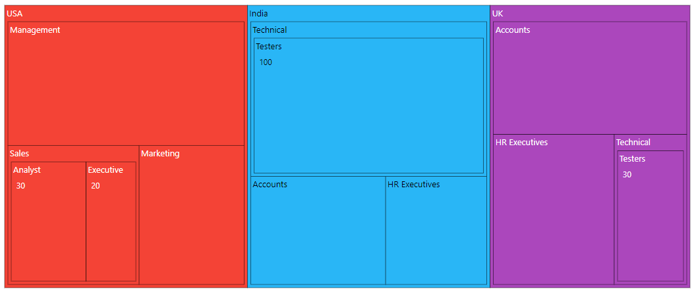
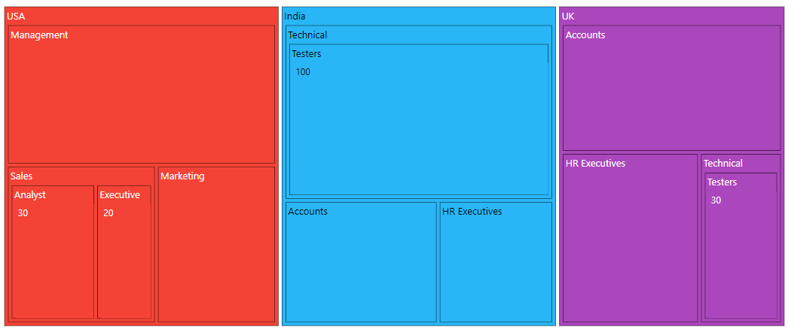
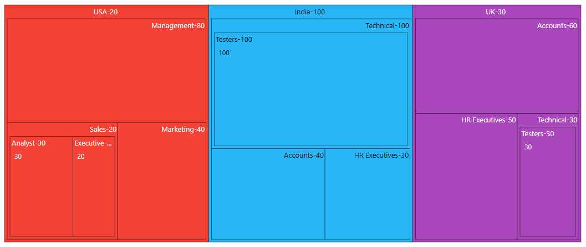

# Levels in Blazor TreeMap Component

TreeMap supports **n** number of levels and each level is separated by using the [`GroupPath`](https://help.syncfusion.com/cr/blazor/Syncfusion.Blazor.TreeMap.TreeMapLevel.html#Syncfusion_Blazor_TreeMap_TreeMapLevel_GroupPath) property.

## Group path

The [`GroupPath`](https://help.syncfusion.com/cr/blazor/Syncfusion.Blazor.TreeMap.TreeMapLevel.html#Syncfusion_Blazor_TreeMap_TreeMapLevel_GroupPath) property is used to separate each level of the TreeMap by specifying the property from the data source.

In the following example, three levels are added and each level is configured using the [`GroupPath`](https://help.syncfusion.com/cr/blazor/Syncfusion.Blazor.TreeMap.TreeMapLevel.html#Syncfusion_Blazor_TreeMap_TreeMapLevel_GroupPath) property.

```cshtml
@using Syncfusion.Blazor.TreeMap

<SfTreeMap WeightValuePath="EmployeeCount" TValue="Employee" DataSource="Employees" Palette='new string[] {"#f44336", "#29b6f6", "#ab47bc", "#ffc107", "#5c6bc0", "#009688"}'>
    <TreeMapLevels>
        <TreeMapLevel GroupPath="Country">
            <TreeMapLevelBorder Color="black" Width="0.5">
            </TreeMapLevelBorder>
        </TreeMapLevel>
        <TreeMapLevel GroupPath="JobDescription">
            <TreeMapLevelBorder Color="black" Width="0.5">
            </TreeMapLevelBorder>
        </TreeMapLevel>
        <TreeMapLevel GroupPath="JobGroup">
            <TreeMapLevelBorder Color="black" Width="0.5">
            </TreeMapLevelBorder>
        </TreeMapLevel>
    </TreeMapLevels>
</SfTreeMap>

@code{
    public class Employee
    {
        public string Country { get; set; }
        public string JobDescription { get; set; }
        public string JobGroup { get; set; }
        public int EmployeeCount { get; set; }
    };
    public List<Employee> Employees = new List<Employee> {
        new Employee { Country= "USA", JobDescription= "Sales", JobGroup= "Executive", EmployeeCount= 20 },
        new Employee { Country= "USA", JobDescription= "Sales", JobGroup= "Analyst", EmployeeCount= 30 },
        new Employee { Country= "USA", JobDescription= "Marketing", EmployeeCount= 40 },
        new Employee { Country= "USA", JobDescription= "Management", EmployeeCount= 80 },
        new Employee { Country= "India", JobDescription= "Technical", JobGroup= "Testers", EmployeeCount= 100 },
        new Employee { Country= "India", JobDescription= "HR Executives", EmployeeCount= 30 },
        new Employee { Country= "India", JobDescription= "Accounts", EmployeeCount= 40 },
        new Employee { Country= "UK", JobDescription= "Technical", JobGroup= "Testers", EmployeeCount= 30 },
        new Employee { Country= "UK", JobDescription= "HR Executives", EmployeeCount= 50 },
        new Employee { Country= "UK", JobDescription= "Accounts", EmployeeCount= 60 }
    };
}
```



## Gap between groups

The [`GroupGap`](https://help.syncfusion.com/cr/blazor/Syncfusion.Blazor.TreeMap.TreeMapLevel.html#Syncfusion_Blazor_TreeMap_TreeMapLevel_GroupGap) property is used to separate an item from each group or another item to differentiate the levels mentioned in the TreeMap.

```cshtml
@using Syncfusion.Blazor.TreeMap

<SfTreeMap WeightValuePath="EmployeeCount" TValue="Employee" DataSource="Employees" Palette='new string[] {"#f44336", "#29b6f6", "#ab47bc", "#ffc107", "#5c6bc0", "#009688"}'>
    <TreeMapLevels>
        <TreeMapLevel GroupPath="Country" GroupGap="10">
            <TreeMapLevelBorder Color="black" Width="0.5">
            </TreeMapLevelBorder>
        </TreeMapLevel>
        <TreeMapLevel GroupPath="JobDescription" GroupGap="10">
            <TreeMapLevelBorder Color="black" Width="0.5">
            </TreeMapLevelBorder>
        </TreeMapLevel>
        <TreeMapLevel GroupPath="JobGroup" GroupGap="10">
            <TreeMapLevelBorder Color="black" Width="0.5">
            </TreeMapLevelBorder>
        </TreeMapLevel>
    </TreeMapLevels>
</SfTreeMap>
```

> Refer to the [code block](#group-path) to know about the property value of the **Employees**.



## Header height and style

Customize the font color, family, weight, opacity and size using the [`TreeMapHeaderStyle`](https://help.syncfusion.com/cr/blazor/Syncfusion.Blazor.TreeMap.TreeMapHeaderStyle.html). Based on the font settings, the header height is given using the [`HeaderHeight`](https://help.syncfusion.com/cr/blazor/Syncfusion.Blazor.TreeMap.TreeMapLevel.html#Syncfusion_Blazor_TreeMap_TreeMapLevel_HeaderHeight) property in [`TreeMapLevel`](https://help.syncfusion.com/cr/blazor/Syncfusion.Blazor.TreeMap.TreeMapLevel.html).

```cshtml
@using Syncfusion.Blazor.TreeMap

<SfTreeMap WeightValuePath="EmployeeCount" TValue="Employee" DataSource="Employees" Palette='new string[] {"#f44336", "#29b6f6", "#ab47bc", "#ffc107", "#5c6bc0", "#009688"}'>
    <TreeMapLevels>
        <TreeMapLevel GroupPath="Country" HeaderHeight="35">
            <TreeMapHeaderStyle Size="15px"></TreeMapHeaderStyle>
            <TreeMapLevelBorder Color="black" Width="0.5">
            </TreeMapLevelBorder>
        </TreeMapLevel>
        <TreeMapLevel GroupPath="JobDescription" HeaderHeight="45">
            <TreeMapHeaderStyle Size="15px"></TreeMapHeaderStyle>
            <TreeMapLevelBorder Color="black" Width="0.5">
            </TreeMapLevelBorder>
        </TreeMapLevel>
        <TreeMapLevel GroupPath="JobGroup" HeaderHeight="40">
            <TreeMapHeaderStyle Size="15px"></TreeMapHeaderStyle>
            <TreeMapLevelBorder Color="black" Width="0.5">
            </TreeMapLevelBorder>
        </TreeMapLevel>
    </TreeMapLevels>
</SfTreeMap>
```

> Refer to the [code block](#group-path) to know about the property value of **Employees**.


## Customization

The following properties are available to customize the header content in the [`TreeMapLevel`](https://help.syncfusion.com/cr/blazor/Syncfusion.Blazor.TreeMap.TreeMapLevel.html).

* [`HeaderFormat`](https://help.syncfusion.com/cr/blazor/Syncfusion.Blazor.TreeMap.TreeMapLevel.html#Syncfusion_Blazor_TreeMap_TreeMapLevel_HeaderFormat) - Represents the header name, which is available in the data source.
* [`ShowHeader`](https://help.syncfusion.com/cr/blazor/Syncfusion.Blazor.TreeMap.TreeMapLevel.html#Syncfusion_Blazor_TreeMap_TreeMapLevel_ShowHeader) - Specifies to visibility of the header.
* [`HeaderTemplate`](https://help.syncfusion.com/cr/blazor/Syncfusion.Blazor.TreeMap.TreeMapLevel.html#Syncfusion_Blazor_TreeMap_TreeMapLevel_HeaderTemplate) - Specifies the template of the header and the position of the template to be customized using the [`TemplatePosition`](https://help.syncfusion.com/cr/blazor/Syncfusion.Blazor.TreeMap.TreeMapLevel.html#Syncfusion_Blazor_TreeMap_TreeMapLevel_TemplatePosition) property.
* [`TreeMapLevelBorder`](https://help.syncfusion.com/cr/blazor/Syncfusion.Blazor.TreeMap.TreeMapLevelBorder.html) - Specifies TreeMap level border color and width.
* [`HeaderAlignment`](https://help.syncfusion.com/cr/blazor/Syncfusion.Blazor.TreeMap.TreeMapLevel.html#Syncfusion_Blazor_TreeMap_TreeMapLevel_HeaderAlignment) - Align the header to [`Near`](https://help.syncfusion.com/cr/blazor/Syncfusion.Blazor.TreeMap.Alignment.html#Syncfusion_Blazor_TreeMap_Alignment_Near), [`Center`](https://help.syncfusion.com/cr/blazor/Syncfusion.Blazor.TreeMap.Alignment.html#Syncfusion_Blazor_TreeMap_Alignment_Center) and [`Far`](https://help.syncfusion.com/cr/blazor/Syncfusion.Blazor.TreeMap.Alignment.html#Syncfusion_Blazor_TreeMap_Alignment_Far).

```cshtml
@using Syncfusion.Blazor.TreeMap

<SfTreeMap WeightValuePath="EmployeeCount" TValue="Employee" DataSource="Employees" Palette='new string[] {"#f44336", "#29b6f6", "#ab47bc", "#ffc107", "#5c6bc0", "#009688"}'>
    <TreeMapLevels>
        <TreeMapLevel GroupPath="Country" HeaderFormat="${Country}-${EmployeeCount}" HeaderAlignment="Alignment.Center">
            <TreeMapLevelBorder Color="black" Width="0.5">
            </TreeMapLevelBorder>
        </TreeMapLevel>
        <TreeMapLevel GroupPath="JobDescription" GroupGap="10" HeaderFormat="${JobDescription}-${EmployeeCount}" HeaderAlignment="Alignment.Far">
            <TreeMapLevelBorder Color="black" Width="0.5">
            </TreeMapLevelBorder>
        </TreeMapLevel>
        <TreeMapLevel GroupPath="JobGroup" GroupGap="10" HeaderFormat="${JobGroup}-${EmployeeCount}" HeaderAlignment="Alignment.Near">
            <TreeMapLevelBorder Color="black" Width="0.5">
            </TreeMapLevelBorder>
        </TreeMapLevel>
    </TreeMapLevels>
</SfTreeMap>
```

> Refer to the [code block](#group-path) to know about the property value of `Employees`.


